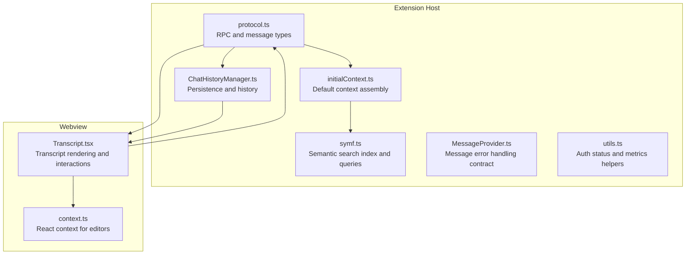
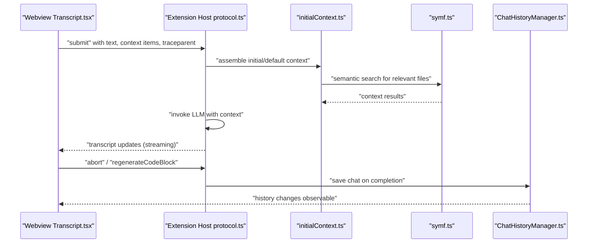
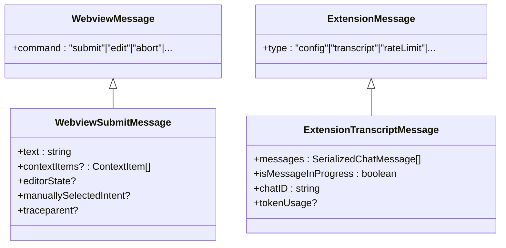
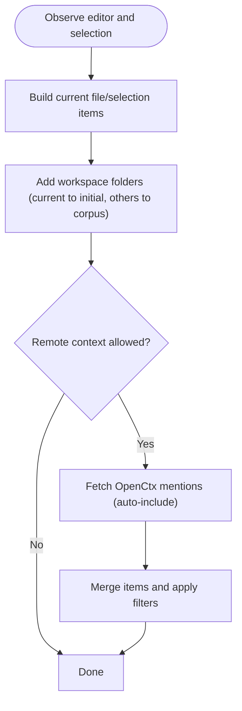
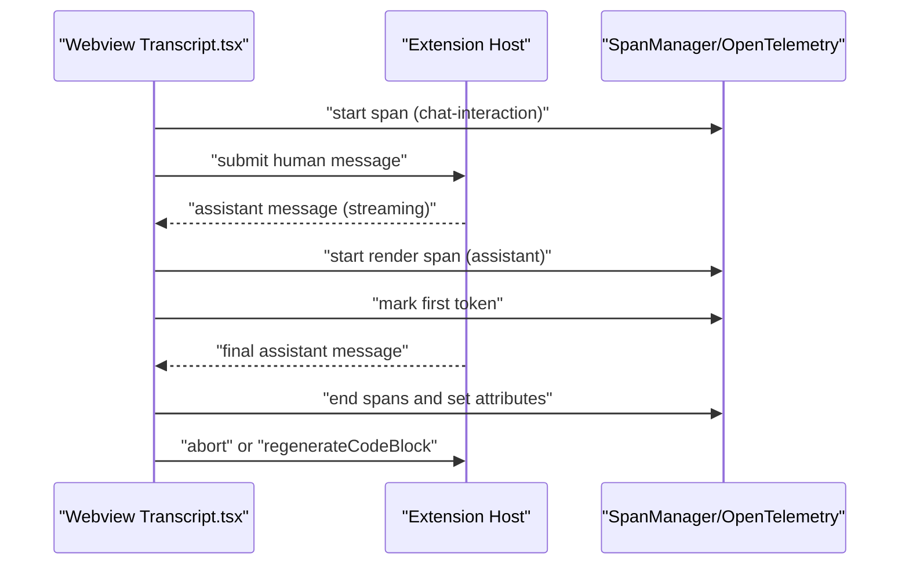
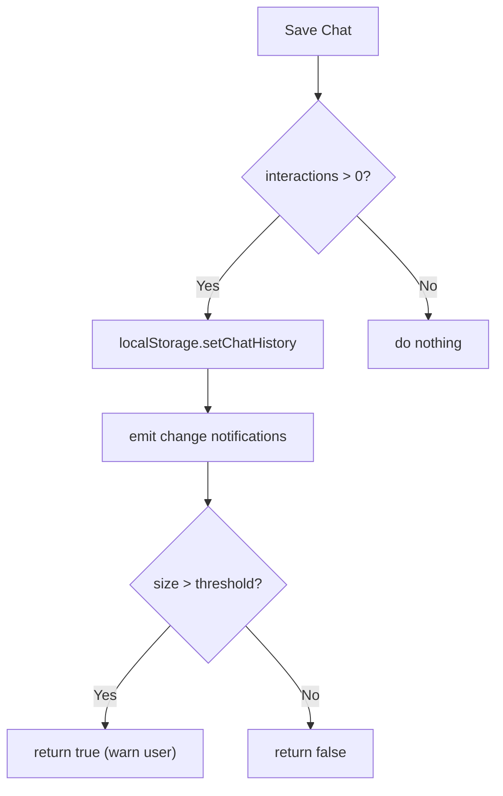
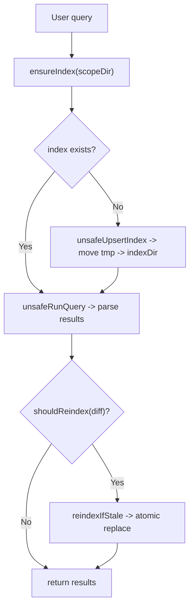
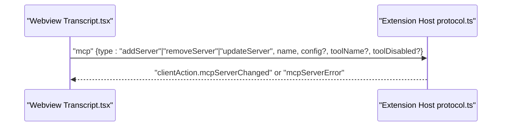
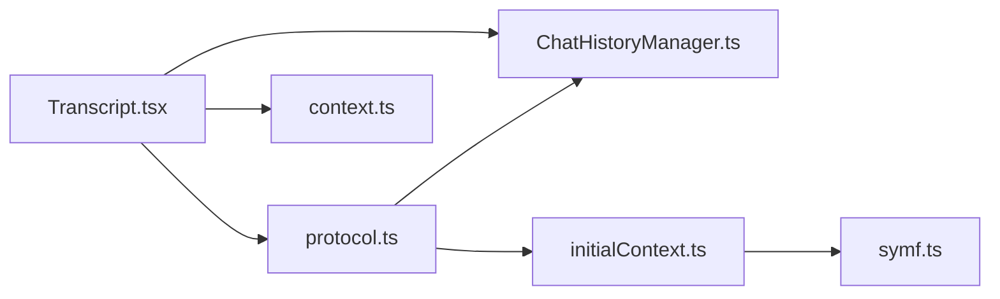

# Chat System

<cite>
**Referenced Files in This Document**
- [protocol.ts](file://vscode/src/chat/protocol.ts)
- [initialContext.ts](file://vscode/src/chat/initialContext.ts)
- [utils.ts](file://vscode/src/chat/utils.ts)
- [MessageProvider.ts](file://vscode/src/chat/MessageProvider.ts)
- [ChatHistoryManager.ts](file://vscode/src/chat/chat-view/ChatHistoryManager.ts)
- [HistoryChat.ts](file://vscode/src/services/HistoryChat.ts)
- [symf.ts](file://vscode/src/local-context/symf.ts)
- [Transcript.tsx](file://vscode/webviews/chat/Transcript.tsx)
- [context.ts](file://vscode/webviews/chat/context.ts)
</cite>

## Table of Contents
1. [Introduction](#introduction)
2. [Project Structure](#project-structure)
3. [Core Components](#core-components)
4. [Architecture Overview](#architecture-overview)
5. [Detailed Component Analysis](#detailed-component-analysis)
6. [Dependency Analysis](#dependency-analysis)
7. [Performance Considerations](#performance-considerations)
8. [Troubleshooting Guide](#troubleshooting-guide)
9. [Conclusion](#conclusion)

## Introduction
This document explains the Cody chat system’s multi-modal conversation interface, chat session management, and context-aware response generation. It covers the chat controller architecture, message handling pipeline, conversation persistence, context retrieval via semantic search across codebases, repositories, and documentation, and the integration with external tools and services through the Model Context Protocol (MCP). Practical examples illustrate common workflows such as asking questions about code, requesting explanations, debugging assistance, and collaborative solution building. The document also describes chat UI components, message formatting, real-time interaction patterns, chat history management, context filtering, and performance optimization for large codebases.

## Project Structure
The chat system spans both the extension host (TypeScript) and the webview (React). Key areas:
- Extension host: chat protocol, initial context assembly, chat history persistence, local context retrieval (symf), and UI orchestration.
- Webview: transcript rendering, message cells, context cells, and real-time interaction controls.

**Diagram sources**
- [protocol.ts:55-178](file://vscode/src/chat/protocol.ts#L55-L178)
- [initialContext.ts:68-119](file://vscode/src/chat/initialContext.ts#L68-L119)
- [ChatHistoryManager.ts:21-194](file://vscode/src/chat/chat-view/ChatHistoryManager.ts#L21-L194)
- [symf.ts:130-202](file://vscode/src/local-context/symf.ts#L130-L202)
- [Transcript.tsx:94-306](file://vscode/webviews/chat/Transcript.tsx#L94-L306)
- [context.ts:1-7](file://vscode/webviews/chat/context.ts#L1-L7)

**Section sources**
- [protocol.ts:55-178](file://vscode/src/chat/protocol.ts#L55-L178)
- [initialContext.ts:68-119](file://vscode/src/chat/initialContext.ts#L68-L119)
- [ChatHistoryManager.ts:21-194](file://vscode/src/chat/chat-view/ChatHistoryManager.ts#L21-L194)
- [symf.ts:130-202](file://vscode/src/local-context/symf.ts#L130-L202)
- [Transcript.tsx:94-306](file://vscode/webviews/chat/Transcript.tsx#L94-L306)
- [context.ts:1-7](file://vscode/webviews/chat/context.ts#L1-L7)

## Core Components
- Chat protocol and RPC: Defines webview-to-extension and extension-to-webview messages, telemetry events, authentication actions, and MCP server management.
- Initial context assembly: Builds default context from current file/selection, corpus repositories, and OpenCtx providers.
- Transcript rendering: Renders human and assistant messages, manages scrolling, loading states, and real-time telemetry.
- Chat history manager: Persists chats locally, supports lightweight history lists, renaming, deletion, and change observables.
- Semantic search (symf): Indexes and queries local codebases for context retrieval with concurrency control and index freshness checks.
- Message provider: Contracts for chat client, guardrails, and editor integration, including error categorization.

**Section sources**
- [protocol.ts:55-178](file://vscode/src/chat/protocol.ts#L55-L178)
- [initialContext.ts:68-119](file://vscode/src/chat/initialContext.ts#L68-L119)
- [Transcript.tsx:94-306](file://vscode/webviews/chat/Transcript.tsx#L94-L306)
- [ChatHistoryManager.ts:21-194](file://vscode/src/chat/chat-view/ChatHistoryManager.ts#L21-L194)
- [symf.ts:130-202](file://vscode/src/local-context/symf.ts#L130-L202)
- [MessageProvider.ts:1-18](file://vscode/src/chat/MessageProvider.ts#L1-L18)

## Architecture Overview
The chat system uses a bidirectional RPC channel between the webview and the extension host. The webview renders the transcript and sends user actions (submit/edit/abort/regenerate). The extension host resolves context, invokes the LLM, streams responses, and persists state. Context retrieval integrates local symf indices and remote repositories via OpenCtx.

**Diagram sources**
- [Transcript.tsx:431-488](file://vscode/webviews/chat/Transcript.tsx#L431-L488)
- [protocol.ts:55-178](file://vscode/src/chat/protocol.ts#L55-L178)
- [initialContext.ts:68-119](file://vscode/src/chat/initialContext.ts#L68-L119)
- [symf.ts:130-202](file://vscode/src/local-context/symf.ts#L130-L202)
- [ChatHistoryManager.ts:94-109](file://vscode/src/chat/chat-view/ChatHistoryManager.ts#L94-L109)

## Detailed Component Analysis

### Chat Protocol and RPC
- Webview messages include submit, edit, abort, regenerate, authentication, telemetry, and MCP server management.
- Extension messages include configuration, transcript updates, rate limits, client actions, attribution, and RPC responses.
- The protocol defines typed messages for context-aware chat, intent selection, and MCP server lifecycle.

**Diagram sources**
- [protocol.ts:55-178](file://vscode/src/chat/protocol.ts#L55-L178)
- [protocol.ts:249-292](file://vscode/src/chat/protocol.ts#L249-L292)

**Section sources**
- [protocol.ts:55-178](file://vscode/src/chat/protocol.ts#L55-L178)
- [protocol.ts:249-292](file://vscode/src/chat/protocol.ts#L249-L292)

### Initial Context Assembly
- Observes active editor changes and selection updates, debounced to avoid excessive recomputation.
- Builds context items from:
  - Current file and selection (always included).
  - Workspace folders (current to initial context, others to corpus).
  - Remote repositories via OpenCtx when allowed by auth capabilities.
  - OpenCtx auto-include providers for active editor context.
- Applies context window sizing and filters to avoid oversized context.

**Diagram sources**
- [initialContext.ts:126-208](file://vscode/src/chat/initialContext.ts#L126-L208)
- [initialContext.ts:210-339](file://vscode/src/chat/initialContext.ts#L210-L339)
- [initialContext.ts:341-390](file://vscode/src/chat/initialContext.ts#L341-L390)

**Section sources**
- [initialContext.ts:68-119](file://vscode/src/chat/initialContext.ts#L68-L119)
- [initialContext.ts:126-208](file://vscode/src/chat/initialContext.ts#L126-L208)
- [initialContext.ts:210-339](file://vscode/src/chat/initialContext.ts#L210-L339)
- [initialContext.ts:341-390](file://vscode/src/chat/initialContext.ts#L341-L390)

### Transcript Rendering and Real-Time Interaction
- Transforms chat transcripts into interaction pairs (human-assistant).
- Manages auto-scroll, “skip to end” behavior, and debounced bottom state to avoid UI flicker.
- Tracks spans for time-to-first-token and render durations; posts telemetry and ends spans on completion.
- Supports editing, aborting, and regenerating code blocks; integrates guardrails and smart apply actions.

**Diagram sources**
- [Transcript.tsx:431-488](file://vscode/webviews/chat/Transcript.tsx#L431-L488)
- [Transcript.tsx:515-628](file://vscode/webviews/chat/Transcript.tsx#L515-L628)

**Section sources**
- [Transcript.tsx:94-306](file://vscode/webviews/chat/Transcript.tsx#L94-L306)
- [Transcript.tsx:431-488](file://vscode/webviews/chat/Transcript.tsx#L431-L488)
- [Transcript.tsx:515-628](file://vscode/webviews/chat/Transcript.tsx#L515-L628)

### Chat History Management
- Stores chats locally keyed by authenticated user endpoint and username.
- Provides lightweight history for UI lists, supports rename/delete/clear, and emits observable changes.
- Saves chats only if non-empty and warns when storage threshold is exceeded.

**Diagram sources**
- [ChatHistoryManager.ts:94-109](file://vscode/src/chat/chat-view/ChatHistoryManager.ts#L94-L109)

**Section sources**
- [ChatHistoryManager.ts:21-194](file://vscode/src/chat/chat-view/ChatHistoryManager.ts#L21-L194)
- [HistoryChat.ts:25-69](file://vscode/src/services/HistoryChat.ts#L25-L69)

### Context Retrieval Integration (Semantic Search)
- SymfRunner manages per-scope indexing and queries:
  - Ensures index exists or creates it with read/write locks.
  - Reindexes when stale based on file diffs.
  - Runs live queries with boosted keywords and returns ranked results.
- Index lifecycle includes progress tracking, cancellation, and failure markers.

**Diagram sources**
- [symf.ts:289-393](file://vscode/src/local-context/symf.ts#L289-L393)
- [symf.ts:309-336](file://vscode/src/local-context/symf.ts#L309-L336)
- [symf.ts:232-263](file://vscode/src/local-context/symf.ts#L232-L263)

**Section sources**
- [symf.ts:130-202](file://vscode/src/local-context/symf.ts#L130-L202)
- [symf.ts:289-393](file://vscode/src/local-context/symf.ts#L289-L393)
- [symf.ts:309-336](file://vscode/src/local-context/symf.ts#L309-L336)
- [symf.ts:232-263](file://vscode/src/local-context/symf.ts#L232-L263)

### MCP Integration
- The protocol includes MCP server management commands to add, remove, or update servers and tools.
- Extension messages surface MCP server changes and errors to the webview for UI feedback.

**Diagram sources**
- [protocol.ts:170-178](file://vscode/src/chat/protocol.ts#L170-L178)

**Section sources**
- [protocol.ts:170-178](file://vscode/src/chat/protocol.ts#L170-L178)

### Message Provider and Error Handling
- Defines categories for message errors: transcript, system, and storage.
- Provides a contract for integrating chat client, guardrails, and editor.

**Section sources**
- [MessageProvider.ts:1-18](file://vscode/src/chat/MessageProvider.ts#L1-L18)

### Auth Status Utilities
- Constructs normalized auth status with verified email requirements and organization-specific flags.

**Section sources**
- [utils.ts:24-52](file://vscode/src/chat/utils.ts#L24-L52)

## Dependency Analysis
- Webview depends on protocol types and React context to send/receive messages and manage editor state.
- Initial context depends on auth status, client capabilities, and OpenCtx to assemble context items.
- SymfRunner depends on workspace folders and editor state to scope queries and maintain indices.
- ChatHistoryManager depends on local storage and auth status to persist and expose history.

**Diagram sources**
- [Transcript.tsx:94-306](file://vscode/webviews/chat/Transcript.tsx#L94-L306)
- [protocol.ts:55-178](file://vscode/src/chat/protocol.ts#L55-L178)
- [initialContext.ts:68-119](file://vscode/src/chat/initialContext.ts#L68-L119)
- [symf.ts:130-202](file://vscode/src/local-context/symf.ts#L130-L202)
- [ChatHistoryManager.ts:21-194](file://vscode/src/chat/chat-view/ChatHistoryManager.ts#L21-L194)
- [context.ts:1-7](file://vscode/webviews/chat/context.ts#L1-L7)

**Section sources**
- [Transcript.tsx:94-306](file://vscode/webviews/chat/Transcript.tsx#L94-L306)
- [protocol.ts:55-178](file://vscode/src/chat/protocol.ts#L55-L178)
- [initialContext.ts:68-119](file://vscode/src/chat/initialContext.ts#L68-L119)
- [symf.ts:130-202](file://vscode/src/local-context/symf.ts#L130-L202)
- [ChatHistoryManager.ts:21-194](file://vscode/src/chat/chat-view/ChatHistoryManager.ts#L21-L194)
- [context.ts:1-7](file://vscode/webviews/chat/context.ts#L1-L7)

## Performance Considerations
- Debounce and distinctUntilChanged reduce unnecessary recomputation of context and UI updates.
- Symf read/write locks and index caching minimize contention and redundant indexing.
- Lightweight history reduces payload sizes for UI lists; storage warnings proactively inform users.
- Streaming assistant responses and time-to-first-token spans improve perceived latency and diagnostics.

[No sources needed since this section provides general guidance]

## Troubleshooting Guide
- Authentication and auth status: Verify endpoint and verified email requirements; inspect normalized auth status construction.
- Rate limits and errors: Listen for rate limit and error messages from extension; handle storage warnings when history exceeds thresholds.
- Context retrieval failures: Symf errors indicate missing binaries, unauthorized access, or indexing failures; check logs and ensure proper setup.
- History restoration: Use quick pick to restore chats by grouping by relative time periods.

**Section sources**
- [utils.ts:24-52](file://vscode/src/chat/utils.ts#L24-L52)
- [protocol.ts:212-213](file://vscode/src/chat/protocol.ts#L212-L213)
- [symf.ts:689-701](file://vscode/src/local-context/symf.ts#L689-L701)
- [HistoryChat.ts:71-113](file://vscode/src/services/HistoryChat.ts#L71-L113)

## Conclusion
Cody’s chat system combines a robust protocol-driven architecture, reactive context assembly, and efficient semantic search to deliver a responsive, context-aware conversational experience. The webview renders transcripts and real-time interactions, while the extension host orchestrates context retrieval, LLM invocation, and persistent history. MCP integration enables extensibility with external tools. Together, these components support practical workflows—from code Q&A and explanations to debugging and collaborative problem-solving—while maintaining performance and reliability at scale.