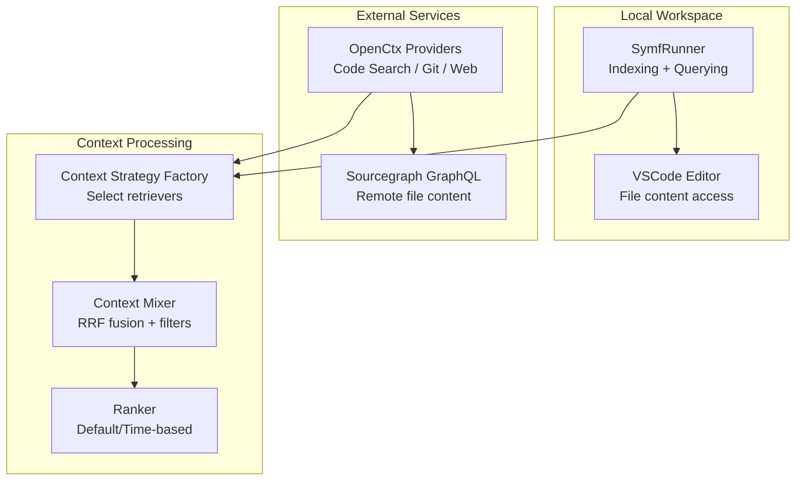
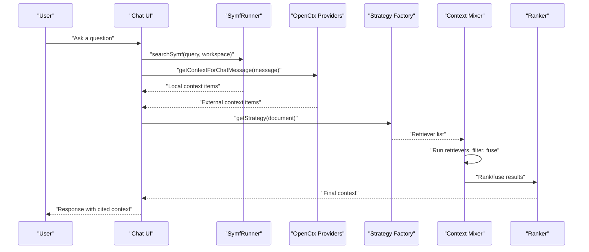
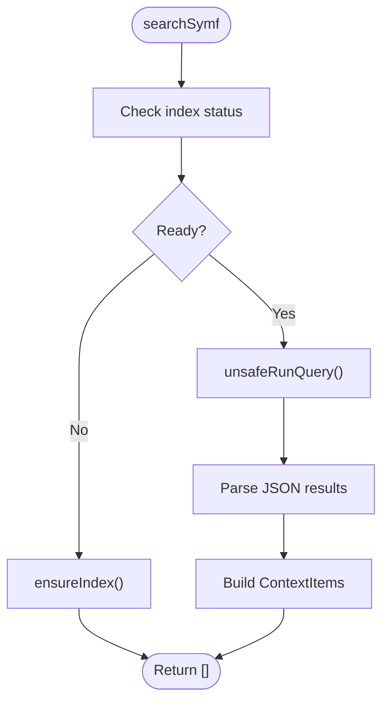
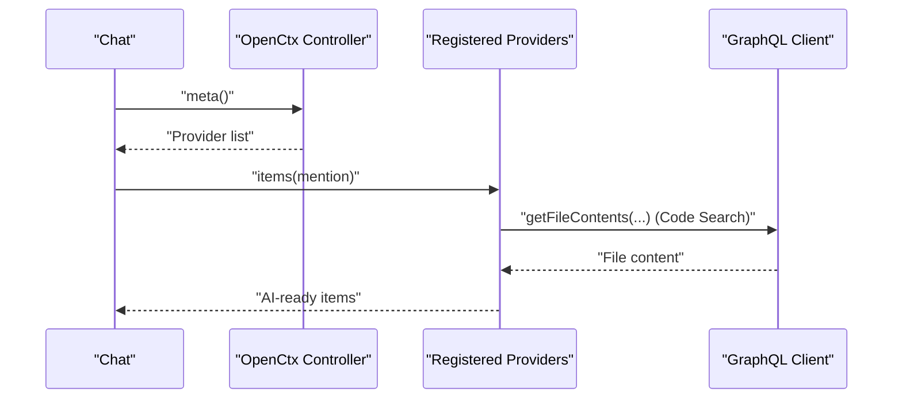
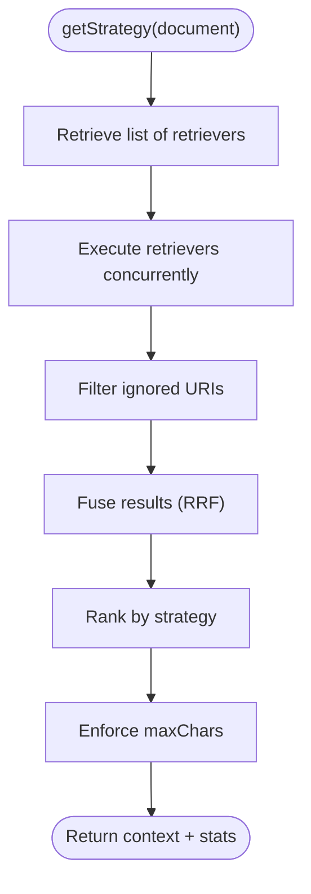
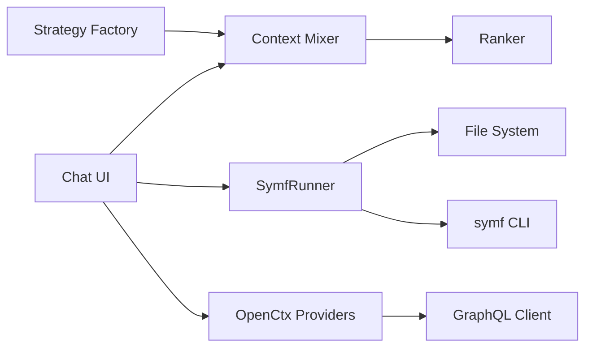

# Context Retrieval

<cite>
**Referenced Files in This Document**
- [symf.ts](file://vscode/src/local-context/symf.ts)
- [context.ts](file://vscode/src/chat/chat-view/context.ts)
- [openctx.ts](file://vscode/src/context/openctx.ts)
- [codeSearch.ts](file://vscode/src/context/openctx/codeSearch.ts)
- [git.ts](file://vscode/src/context/openctx/git.ts)
- [web.ts](file://vscode/src/context/openctx/web.ts)
- [context-mixer.ts](file://vscode/src/completions/context/context-mixer.ts)
- [context-strategy.ts](file://vscode/src/completions/context/context-strategy.ts)
- [completions-context-ranker.ts](file://vscode/src/completions/context/completions-context-ranker.ts)
- [context.ts](file://lib/shared/src/context/openctx/context.ts)
- [api.ts](file://lib/shared/src/context/openctx/api.ts)
</cite>

## Table of Contents
1. [Introduction](#introduction)
2. [Project Structure](#project-structure)
3. [Core Components](#core-components)
4. [Architecture Overview](#architecture-overview)
5. [Detailed Component Analysis](#detailed-component-analysis)
6. [Dependency Analysis](#dependency-analysis)
7. [Performance Considerations](#performance-considerations)
8. [Troubleshooting Guide](#troubleshooting-guide)
9. [Conclusion](#conclusion)

## Introduction
This document explains how Cody retrieves and presents context to the AI model across local workspace files, remote repositories, and external services. It covers:
- Semantic search via symf (symf local search) including indexing, querying, and result truncation
- Integration with the OpenCtx protocol for external context providers (code search, git logs, web URLs)
- Context filtering, relevance ranking, and presentation to the model
- Context mixing strategies that combine multiple sources for optimal results
- Examples for debugging, code explanation, and feature development
- Performance optimization techniques for large codebases and network latency

## Project Structure
Cody’s context retrieval spans three primary areas:
- Local semantic search: symf-based indexing and querying
- External context providers: OpenCtx integration for code search, git logs, and web URLs
- Context mixing and ranking: combining multiple retrievers and fusing results

**Diagram sources**
- [symf.ts:64-104](file://vscode/src/local-context/symf.ts#L64-L104)
- [context.ts:24-92](file://vscode/src/chat/chat-view/context.ts#L24-L92)
- [openctx.ts:109-207](file://vscode/src/context/openctx.ts#L109-L207)
- [codeSearch.ts:35-65](file://vscode/src/context/openctx/codeSearch.ts#L35-L65)
- [git.ts:25-130](file://vscode/src/context/openctx/git.ts#L25-L130)
- [web.ts:8-38](file://vscode/src/context/openctx/web.ts#L8-L38)
- [context-strategy.ts:42-229](file://vscode/src/completions/context/context-strategy.ts#L42-L229)
- [context-mixer.ts:88-244](file://vscode/src/completions/context/context-mixer.ts#L88-L244)
- [completions-context-ranker.ts:38-67](file://vscode/src/completions/context/completions-context-ranker.ts#L38-L67)

**Section sources**
- [symf.ts:64-104](file://vscode/src/local-context/symf.ts#L64-L104)
- [context.ts:24-92](file://vscode/src/chat/chat-view/context.ts#L24-L92)
- [openctx.ts:109-207](file://vscode/src/context/openctx.ts#L109-L207)
- [context-strategy.ts:42-229](file://vscode/src/completions/context/context-strategy.ts#L42-L229)
- [context-mixer.ts:88-244](file://vscode/src/completions/context/context-mixer.ts#L88-L244)

## Core Components
- SymfRunner: Manages local indexing and querying of workspace files, with index freshness checks, concurrency control, and telemetry.
- OpenCtx Providers: Provide external context including code search, git logs, and web URLs.
- Context Strategy Factory: Selects which retrievers to use based on configuration and language.
- Context Mixer: Executes retrievers, applies filters, ranks/fuses results, and enforces size limits.
- Ranker: Applies ranking strategies (default/time-based/no-rerank) to prioritize context.

**Section sources**
- [symf.ts:64-104](file://vscode/src/local-context/symf.ts#L64-L104)
- [openctx.ts:109-207](file://vscode/src/context/openctx.ts#L109-L207)
- [context-strategy.ts:42-229](file://vscode/src/completions/context/context-strategy.ts#L42-L229)
- [context-mixer.ts:88-244](file://vscode/src/completions/context/context-mixer.ts#L88-L244)
- [completions-context-ranker.ts:38-67](file://vscode/src/completions/context/completions-context-ranker.ts#L38-L67)

## Architecture Overview
The context retrieval pipeline integrates local and external sources, then mixes and ranks results before sending them to the model.

**Diagram sources**
- [context.ts:24-92](file://vscode/src/chat/chat-view/context.ts#L24-L92)
- [context.ts:6-26](file://lib/shared/src/context/openctx/context.ts#L6-L26)
- [context-strategy.ts:175-224](file://vscode/src/completions/context/context-strategy.ts#L175-L224)
- [context-mixer.ts:107-244](file://vscode/src/completions/context/context-mixer.ts#L107-L244)
- [completions-context-ranker.ts:38-67](file://vscode/src/completions/context/completions-context-ranker.ts#L38-L67)

## Detailed Component Analysis

### Semantic Search with Symf
SymfRunner manages indexing and querying of the local workspace:
- Index lifecycle: creation, refresh, and failure tracking
- Concurrency control: per-scope read/write locks
- Querying: runs symf CLI with boosted keywords and parses structured results
- Freshness: detects corpus diffs and triggers background reindex when stale
- Telemetry: records index size on successful reindex

Key behaviors:
- Index creation targets a temporary directory and atomically replaces the live index
- Query timeouts and buffer limits protect against large outputs
- Results are mapped to context items with metadata (scores, boosts)

**Diagram sources**
- [context.ts:24-92](file://vscode/src/chat/chat-view/context.ts#L24-L92)
- [symf.ts:210-263](file://vscode/src/local-context/symf.ts#L210-L263)
- [symf.ts:309-336](file://vscode/src/local-context/symf.ts#L309-L336)

**Section sources**
- [symf.ts:210-263](file://vscode/src/local-context/symf.ts#L210-L263)
- [symf.ts:309-336](file://vscode/src/local-context/symf.ts#L309-L336)
- [context.ts:24-92](file://vscode/src/chat/chat-view/context.ts#L24-L92)

### OpenCtx Protocol Integration
Cody integrates external context providers via OpenCtx:
- Provider registration: web, rules, remote repository/file/directory, git, code search, and omnibox-enabled providers
- Controller initialization: merges user configuration and viewer settings
- Chat-time retrieval: collects context items for a message from all configured providers

Provider specifics:
- Code Search: resolves repository file content via GraphQL and returns AI-ready items
- Git: offers mentions for diffs vs default branch and uncommitted changes; expands to AI content
- Web: fetches URL content either via proxy or direct HTTP, strips HTML noise

**Diagram sources**
- [openctx.ts:109-207](file://vscode/src/context/openctx.ts#L109-L207)
- [codeSearch.ts:35-65](file://vscode/src/context/openctx/codeSearch.ts#L35-L65)
- [codeSearch.ts:67-91](file://vscode/src/context/openctx/codeSearch.ts#L67-L91)
- [git.ts:59-130](file://vscode/src/context/openctx/git.ts#L59-L130)
- [web.ts:34-94](file://vscode/src/context/openctx/web.ts#L34-L94)
- [context.ts:6-26](file://lib/shared/src/context/openctx/context.ts#L6-L26)

**Section sources**
- [openctx.ts:109-207](file://vscode/src/context/openctx.ts#L109-L207)
- [codeSearch.ts:35-65](file://vscode/src/context/openctx/codeSearch.ts#L35-L65)
- [codeSearch.ts:67-91](file://vscode/src/context/openctx/codeSearch.ts#L67-L91)
- [git.ts:59-130](file://vscode/src/context/openctx/git.ts#L59-L130)
- [web.ts:34-94](file://vscode/src/context/openctx/web.ts#L34-L94)
- [context.ts:6-26](file://lib/shared/src/context/openctx/context.ts#L6-L26)
- [api.ts:42-49](file://lib/shared/src/context/openctx/api.ts#L42-L49)

### Context Filtering, Ranking, and Mixing
Cody combines multiple retrievers and sources into a cohesive context:
- Strategy selection: chooses retrievers based on configuration and language
- Execution: runs retrievers concurrently, applies filters, and records stats
- Fusion: uses reciprocal rank fusion (RRF) to interleave results from multiple sources
- Ranking: supports default/time-based/no-rerank strategies
- Size enforcement: accumulates snippets until max character limit is reached

**Diagram sources**
- [context-strategy.ts:175-224](file://vscode/src/completions/context/context-strategy.ts#L175-L224)
- [context-mixer.ts:107-244](file://vscode/src/completions/context/context-mixer.ts#L107-L244)
- [completions-context-ranker.ts:38-67](file://vscode/src/completions/context/completions-context-ranker.ts#L38-L67)

**Section sources**
- [context-strategy.ts:42-229](file://vscode/src/completions/context/context-strategy.ts#L42-L229)
- [context-mixer.ts:88-244](file://vscode/src/completions/context/context-mixer.ts#L88-L244)
- [completions-context-ranker.ts:38-67](file://vscode/src/completions/context/completions-context-ranker.ts#L38-L67)

### Presentation to the Model
- Local results: context items with file URIs, ranges, and metadata (scores, boosts)
- External results: OpenCtx items with AI-ready content and optional tooltips
- Chat truncation: symf results are truncated to a bounded byte size to fit model constraints

**Section sources**
- [context.ts:70-123](file://vscode/src/chat/chat-view/context.ts#L70-L123)
- [codeSearch.ts:82-91](file://vscode/src/context/openctx/codeSearch.ts#L82-L91)
- [web.ts:82-94](file://vscode/src/context/openctx/web.ts#L82-L94)

## Dependency Analysis
- SymfRunner depends on the VS Code file system and CLI execution, guarded by authentication and index locks
- OpenCtx providers depend on GraphQL for remote content and on the OpenCtx controller
- Context Mixer depends on the strategy factory and ranker; it also depends on context filters to exclude ignored URIs
- Chat UI depends on SymfRunner for local search and on OpenCtx for external context

**Diagram sources**
- [symf.ts:64-104](file://vscode/src/local-context/symf.ts#L64-L104)
- [openctx.ts:109-207](file://vscode/src/context/openctx.ts#L109-L207)
- [context-strategy.ts:42-229](file://vscode/src/completions/context/context-strategy.ts#L42-L229)
- [context-mixer.ts:88-244](file://vscode/src/completions/context/context-mixer.ts#L88-L244)

**Section sources**
- [symf.ts:64-104](file://vscode/src/local-context/symf.ts#L64-L104)
- [openctx.ts:109-207](file://vscode/src/context/openctx.ts#L109-L207)
- [context-strategy.ts:42-229](file://vscode/src/completions/context/context-strategy.ts#L42-L229)
- [context-mixer.ts:88-244](file://vscode/src/completions/context/context-mixer.ts#L88-L244)

## Performance Considerations
- Symf indexing
  - Uses read/write locks to avoid concurrent index corruption
  - Limits CPU usage during indexing and caps timeouts to prevent hangs
  - Tracks failures and clears them on success; reindexes only when stale
  - Emits telemetry on successful reindex with index size metrics
- Query performance
  - Enforces a 30-second timeout and large buffer for symf queries
  - Truncates results to a bounded byte size to meet model constraints
- External providers
  - Web provider can use a proxy or direct fetch; direct fetch uses a timeout
  - Code search fetches file content via GraphQL; errors are suppressed gracefully
- Context mixing
  - Concurrent retriever execution reduces total latency
  - Early exit when maxChars is reached prevents oversized prompts
  - Optional data logging retrievers are deduplicated to avoid duplication

**Section sources**
- [symf.ts:442-462](file://vscode/src/local-context/symf.ts#L442-L462)
- [symf.ts:232-263](file://vscode/src/local-context/symf.ts#L232-L263)
- [symf.ts:327-335](file://vscode/src/local-context/symf.ts#L327-L335)
- [context.ts:113-123](file://vscode/src/chat/chat-view/context.ts#L113-L123)
- [web.ts:63-94](file://vscode/src/context/openctx/web.ts#L63-L94)
- [codeSearch.ts:67-91](file://vscode/src/context/openctx/codeSearch.ts#L67-L91)
- [context-mixer.ts:128-151](file://vscode/src/completions/context/context-mixer.ts#L128-L151)
- [context-mixer.ts:194-228](file://vscode/src/completions/context/context-mixer.ts#L194-L228)

## Troubleshooting Guide
- Symf errors
  - Missing binary or unauthorized access are surfaced with actionable messages
  - Index failures are tracked with sentinel files; subsequent runs skip rebuilding unless explicitly requested
- Graceful degradation
  - Chat context retrieval wraps provider calls and logs errors without failing the entire pipeline
- OpenCtx conflicts
  - If the external OpenCtx extension is installed, users receive a warning to disable it in favor of Cody’s integrated support

**Section sources**
- [symf.ts:689-701](file://vscode/src/local-context/symf.ts#L689-L701)
- [symf.ts:513-530](file://vscode/src/local-context/symf.ts#L513-L530)
- [context.ts:94-111](file://vscode/src/chat/chat-view/context.ts#L94-L111)
- [openctx.ts:299-309](file://vscode/src/context/openctx.ts#L299-L309)

## Conclusion
Cody’s context retrieval system combines robust local semantic search with powerful external providers and intelligent mixing/ranking. By leveraging symf for fast, accurate local results, integrating OpenCtx for broader context, and applying careful filtering and fusion, it delivers high-quality, model-friendly context across diverse scenarios like debugging, code explanation, and feature development. Performance is ensured through concurrency, timeouts, truncation, and telemetry-driven index management.