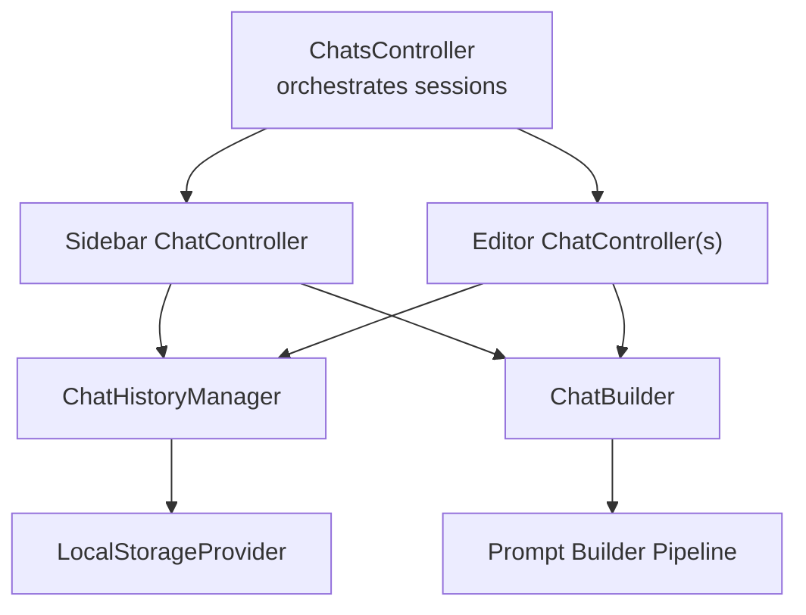
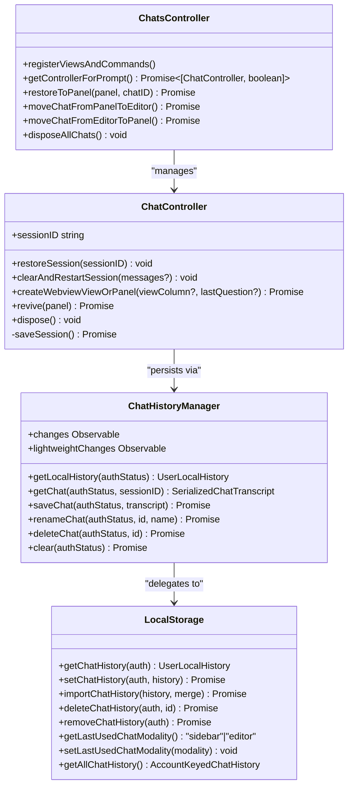
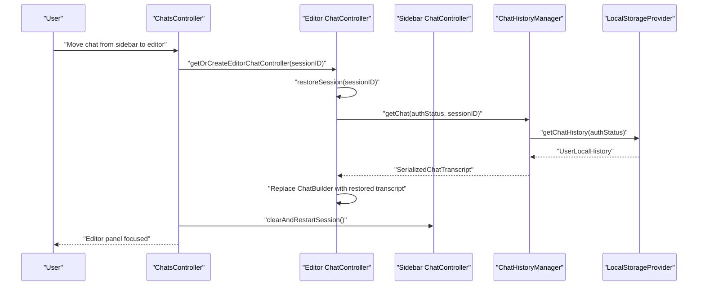
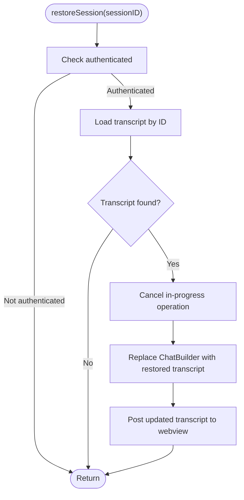
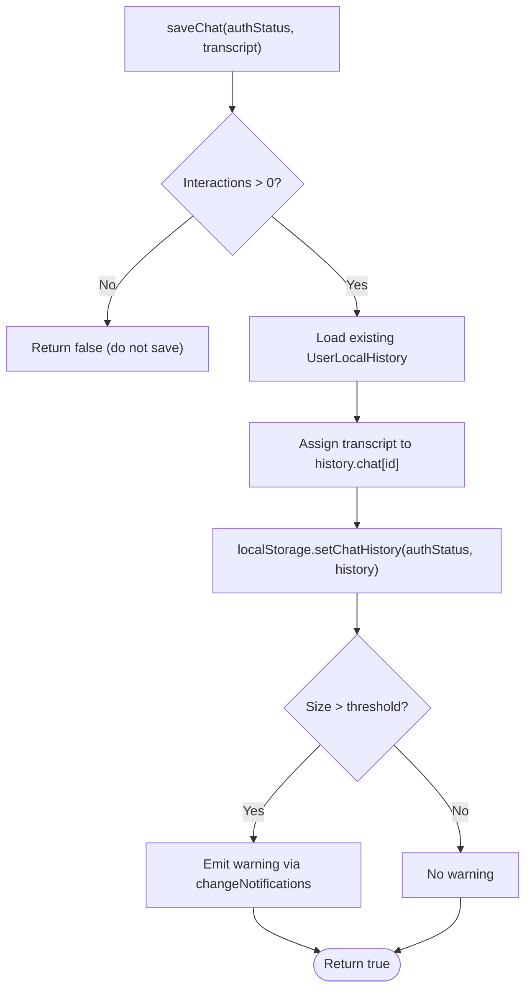
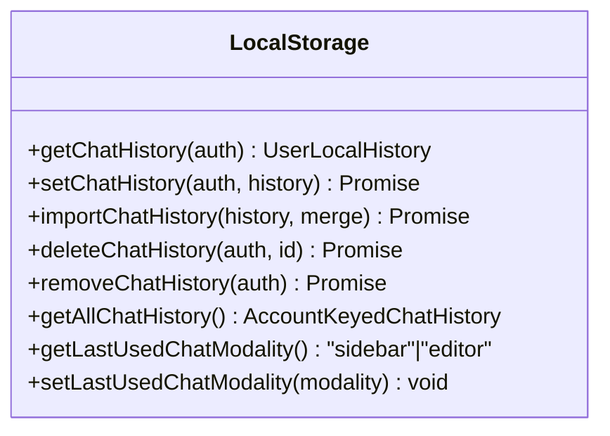
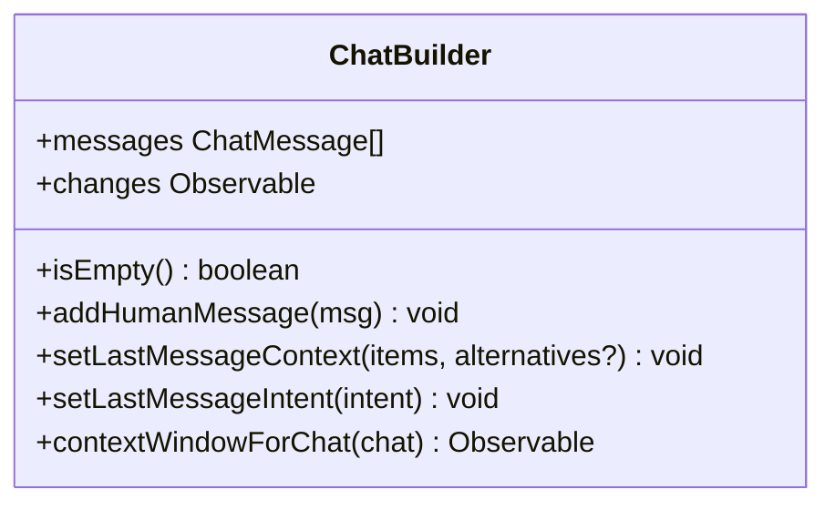
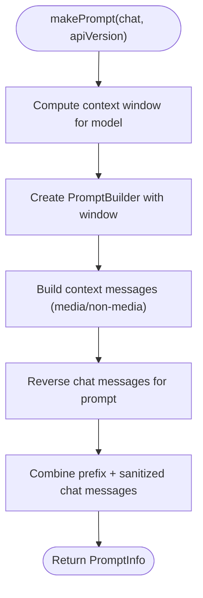
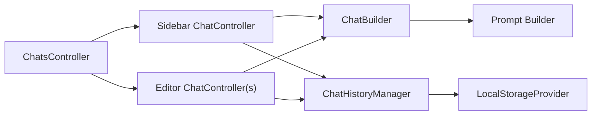

# Conversation Management

<cite>
**Referenced Files in This Document**
- [ChatsController.ts](file://vscode/src/chat/chat-view/ChatsController.ts)
- [ChatController.ts](file://vscode/src/chat/chat-view/ChatController.ts)
- [ChatHistoryManager.ts](file://vscode/src/chat/chat-view/ChatHistoryManager.ts)
- [LocalStorageProvider.ts](file://vscode/src/services/LocalStorageProvider.ts)
- [ChatBuilder.ts](file://vscode/src/chat/chat-view/ChatBuilder.ts)
- [prompt.ts](file://vscode/src/prompt-builder/index.ts)
</cite>

## Table of Contents
1. [Introduction](#introduction)
2. [Project Structure](#project-structure)
3. [Core Components](#core-components)
4. [Architecture Overview](#architecture-overview)
5. [Detailed Component Analysis](#detailed-component-analysis)
6. [Dependency Analysis](#dependency-analysis)
7. [Performance Considerations](#performance-considerations)
8. [Troubleshooting Guide](#troubleshooting-guide)
9. [Conclusion](#conclusion)

## Introduction
This document explains the conversation management system centered on the ChatsController architecture that orchestrates multiple chat sessions across the sidebar and editor panels. It covers session lifecycle management (creation, restoration, disposal), conversation state persistence using local storage, chat history management, switching between chat locations, restoration across authentication changes and account switches, conversation threading and message ordering, and practical workflows for starting new chats, continuing existing conversations, and managing multiple concurrent sessions.

## Project Structure
The conversation management system is implemented primarily in the chat view layer and integrates with a centralized local storage provider and a chat history manager. The key modules are:
- ChatsController: Top-level orchestrator for chat sessions across sidebar and editor panels.
- ChatController: Per-session controller for a single chat panel/webview, handling lifecycle, persistence, and UI updates.
- ChatHistoryManager: Manages retrieval, saving, renaming, deleting, and exporting chat transcripts.
- LocalStorageProvider: Provides persistent storage keyed by authenticated account identity.
- ChatBuilder: Thread builder that maintains message ordering and context for each session.
- Prompt pipeline: Builds and orders messages for LLM prompts.

**Diagram sources**
- [ChatsController.ts:54-94](file://vscode/src/chat/chat-view/ChatsController.ts#L54-L94)
- [ChatController.ts:193-281](file://vscode/src/chat/chat-view/ChatController.ts#L193-L281)
- [ChatHistoryManager.ts:21-33](file://vscode/src/chat/chat-view/ChatHistoryManager.ts#L21-L33)
- [LocalStorageProvider.ts:27-51](file://vscode/src/services/LocalStorageProvider.ts#L27-L51)
- [ChatBuilder.ts:31-50](file://vscode/src/chat/chat-view/ChatBuilder.ts#L31-L50)
- [prompt.ts:28-46](file://vscode/src/prompt-builder/index.ts#L28-L46)

**Section sources**
- [ChatsController.ts:54-94](file://vscode/src/chat/chat-view/ChatsController.ts#L54-L94)
- [ChatController.ts:193-281](file://vscode/src/chat/chat-view/ChatController.ts#L193-L281)
- [ChatHistoryManager.ts:21-33](file://vscode/src/chat/chat-view/ChatHistoryManager.ts#L21-L33)
- [LocalStorageProvider.ts:27-51](file://vscode/src/services/LocalStorageProvider.ts#L27-L51)
- [ChatBuilder.ts:31-50](file://vscode/src/chat/chat-view/ChatBuilder.ts#L31-L50)
- [prompt.ts:28-46](file://vscode/src/prompt-builder/index.ts#L28-L46)

## Core Components
- ChatsController
  - Maintains a sidebar ChatController and a list of active editor ChatControllers.
  - Listens to authentication changes and disposes all chats when the user logs out or switches accounts.
  - Provides commands to move chats between sidebar and editor, create new chats, and toggle visibility.
  - Restores chat sessions into editor panels and manages concurrent sessions.
- ChatController
  - Owns a ChatBuilder per session and serializes/deserializes state via ChatHistoryManager.
  - Handles webview lifecycle, message routing, and persistence.
  - Supports restoring, duplicating, and clearing sessions.
- ChatHistoryManager
  - Retrieves, saves, renames, deletes, and clears chat transcripts.
  - Emits lightweight history for UI lists and tracks changes.
- LocalStorageProvider
  - Stores chat history keyed by endpoint and username, with account-scoped keys.
  - Tracks last used chat modality (sidebar/editor) and exposes client state.
- ChatBuilder
  - Enforces message ordering and context for each session.
  - Exposes mutation APIs for human/bot messages and context attachments.
- Prompt pipeline
  - Builds the final prompt from chat messages and context, reversing message order for proper weighting.

**Section sources**
- [ChatsController.ts:54-94](file://vscode/src/chat/chat-view/ChatsController.ts#L54-L94)
- [ChatController.ts:193-281](file://vscode/src/chat/chat-view/ChatController.ts#L193-L281)
- [ChatHistoryManager.ts:21-33](file://vscode/src/chat/chat-view/ChatHistoryManager.ts#L21-L33)
- [LocalStorageProvider.ts:27-51](file://vscode/src/services/LocalStorageProvider.ts#L27-L51)
- [ChatBuilder.ts:31-50](file://vscode/src/chat/chat-view/ChatBuilder.ts#L31-L50)
- [prompt.ts:28-46](file://vscode/src/prompt-builder/index.ts#L28-L46)

## Architecture Overview
The system separates concerns across controllers and managers:
- ChatsController coordinates multiple ChatControllers and enforces location preferences and authentication boundaries.
- ChatController encapsulates a single session’s state, persistence, and webview integration.
- ChatHistoryManager mediates between ChatController and LocalStorageProvider for persistence.
- LocalStorageProvider persists account-scoped chat histories and supports import/export and account switching.

**Diagram sources**
- [ChatsController.ts:54-94](file://vscode/src/chat/chat-view/ChatsController.ts#L54-L94)
- [ChatController.ts:193-281](file://vscode/src/chat/chat-view/ChatController.ts#L193-L281)
- [ChatHistoryManager.ts:21-33](file://vscode/src/chat/chat-view/ChatHistoryManager.ts#L21-L33)
- [LocalStorageProvider.ts:27-51](file://vscode/src/services/LocalStorageProvider.ts#L27-L51)

## Detailed Component Analysis

### ChatsController: Multi-session orchestration
Responsibilities:
- Authentication-aware lifecycle: Disposes all chats on logout or endpoint change.
- Location-aware selection: Chooses between sidebar and editor based on configuration and last-used modality.
- Cross-session operations: Moving chats between sidebar and editor, restoring sessions into editor panels, toggling visibility, and creating new chats.
- Persistence coordination: Delegates history operations to ChatHistoryManager and LocalStorageProvider.

Key behaviors:
- getControllerForPrompt selects the active editor controller if visible, otherwise falls back to the sidebar controller or creates a new editor controller.
- restoreToPanel attempts to revive an editor panel with a given chatID; on failure, it recreates the session and disposes the original panel.
- moveChatFromPanelToEditor and moveChatFromEditorToPanel coordinate state transfer and UI focus.
- disposeAllChats ensures cleanup of all editor panels and resets the sidebar session.

**Diagram sources**
- [ChatsController.ts:274-292](file://vscode/src/chat/chat-view/ChatsController.ts#L274-L292)
- [ChatController.ts:1610-1625](file://vscode/src/chat/chat-view/ChatController.ts#L1610-L1625)
- [ChatHistoryManager.ts:41-47](file://vscode/src/chat/chat-view/ChatHistoryManager.ts#L41-L47)
- [LocalStorageProvider.ts:174-180](file://vscode/src/services/LocalStorageProvider.ts#L174-L180)

**Section sources**
- [ChatsController.ts:69-94](file://vscode/src/chat/chat-view/ChatsController.ts#L69-L94)
- [ChatsController.ts:137-154](file://vscode/src/chat/chat-view/ChatsController.ts#L137-L154)
- [ChatsController.ts:96-106](file://vscode/src/chat/chat-view/ChatsController.ts#L96-L106)
- [ChatsController.ts:274-292](file://vscode/src/chat/chat-view/ChatsController.ts#L274-L292)
- [ChatsController.ts:545-606](file://vscode/src/chat/chat-view/ChatsController.ts#L545-L606)

### ChatController: Session lifecycle and persistence
Responsibilities:
- Session identity: Exposes sessionID derived from ChatBuilder.
- Restoration: Loads a prior transcript by ID and replaces the current ChatBuilder.
- Persistence: Serializes the current transcript and saves it via ChatHistoryManager; warns when storage threshold is exceeded.
- Webview lifecycle: Creates/revives webview panels/views, registers message handlers, and cleans up on dispose.
- Operations: Clears and restarts sessions, duplicates sessions, and resubmits last input.

**Diagram sources**
- [ChatController.ts:1610-1625](file://vscode/src/chat/chat-view/ChatController.ts#L1610-L1625)
- [ChatHistoryManager.ts:41-47](file://vscode/src/chat/chat-view/ChatHistoryManager.ts#L41-L47)

**Section sources**
- [ChatController.ts:1600-1625](file://vscode/src/chat/chat-view/ChatController.ts#L1600-L1625)
- [ChatController.ts:1633-1647](file://vscode/src/chat/chat-view/ChatController.ts#L1633-L1647)
- [ChatController.ts:1672-1681](file://vscode/src/chat/chat-view/ChatController.ts#L1672-L1681)
- [ChatController.ts:1697-1752](file://vscode/src/chat/chat-view/ChatController.ts#L1697-L1752)

### ChatHistoryManager: History operations and change observables
Responsibilities:
- Retrieve account-scoped history and individual transcripts.
- Save transcripts (skipping empty ones) and trigger change notifications.
- Rename, delete, and clear histories.
- Provide lightweight history for UI lists with optional limits and timestamps.
- Emit changes based on authentication state transitions.

**Diagram sources**
- [ChatHistoryManager.ts:94-109](file://vscode/src/chat/chat-view/ChatHistoryManager.ts#L94-L109)
- [LocalStorageProvider.ts:190-213](file://vscode/src/services/LocalStorageProvider.ts#L190-L213)

**Section sources**
- [ChatHistoryManager.ts:94-109](file://vscode/src/chat/chat-view/ChatHistoryManager.ts#L94-L109)
- [ChatHistoryManager.ts:120-141](file://vscode/src/chat/chat-view/ChatHistoryManager.ts#L120-L141)
- [ChatHistoryManager.ts:172-193](file://vscode/src/chat/chat-view/ChatHistoryManager.ts#L172-L193)

### LocalStorageProvider: Account-scoped persistence
Responsibilities:
- Store and retrieve account-scoped chat histories using a composite key of endpoint and username.
- Support import/export of chat histories, including merging semantics.
- Track last used chat modality and expose client state for UI preferences.
- Provide access to all histories for export without authentication checks.

**Diagram sources**
- [LocalStorageProvider.ts:174-213](file://vscode/src/services/LocalStorageProvider.ts#L174-L213)
- [LocalStorageProvider.ts:330-336](file://vscode/src/services/LocalStorageProvider.ts#L330-L336)

**Section sources**
- [LocalStorageProvider.ts:174-213](file://vscode/src/services/LocalStorageProvider.ts#L174-L213)
- [LocalStorageProvider.ts:330-336](file://vscode/src/services/LocalStorageProvider.ts#L330-L336)
- [LocalStorageProvider.ts:186-188](file://vscode/src/services/LocalStorageProvider.ts#L186-L188)

### ChatBuilder: Message ordering and context
Responsibilities:
- Maintain a sequence of messages with speakers (human/assistant).
- Enforce alternation between human and assistant messages.
- Attach context items and alternatives to the last human message.
- Compute context windows and model-specific context budgets.
- Provide change observables for UI updates.

**Diagram sources**
- [ChatBuilder.ts:31-50](file://vscode/src/chat/chat-view/ChatBuilder.ts#L31-L50)
- [ChatBuilder.ts:168-174](file://vscode/src/chat/chat-view/ChatBuilder.ts#L168-L174)
- [ChatBuilder.ts:135-156](file://vscode/src/chat/chat-view/ChatBuilder.ts#L135-L156)

**Section sources**
- [ChatBuilder.ts:102-106](file://vscode/src/chat/chat-view/ChatBuilder.ts#L102-L106)
- [ChatBuilder.ts:168-174](file://vscode/src/chat/chat-view/ChatBuilder.ts#L168-L174)
- [ChatBuilder.ts:135-156](file://vscode/src/chat/chat-view/ChatBuilder.ts#L135-L156)

### Prompt pipeline: Message ordering and context assembly
Responsibilities:
- Build the final prompt by assembling chat messages and explicit context.
- Reverse message order to emphasize recent context appropriately.
- Render media context items and enforce token limits.

**Diagram sources**
- [prompt.ts:28-46](file://vscode/src/prompt-builder/index.ts#L28-L46)
- [prompt.ts:81-87](file://vscode/src/prompt-builder/index.ts#L81-L87)

**Section sources**
- [prompt.ts:28-46](file://vscode/src/prompt-builder/index.ts#L28-L46)
- [prompt.ts:81-110](file://vscode/src/prompt-builder/index.ts#L81-L110)

## Dependency Analysis
- ChatsController depends on:
  - ChatController for session instances.
  - ChatHistoryManager for history operations.
  - LocalStorageProvider for modality and client state.
  - ExtensionClient capabilities to restrict editor-only environments.
- ChatController depends on:
  - ChatBuilder for message threading.
  - ChatHistoryManager for persistence.
  - LocalStorageProvider for modality and client state.
- ChatHistoryManager depends on:
  - LocalStorageProvider for storage operations.
  - Auth status for account-scoped keys.
- Prompt pipeline depends on:
  - ChatBuilder for message ordering and context.

**Diagram sources**
- [ChatsController.ts:69-94](file://vscode/src/chat/chat-view/ChatsController.ts#L69-L94)
- [ChatController.ts:193-281](file://vscode/src/chat/chat-view/ChatController.ts#L193-L281)
- [ChatHistoryManager.ts:21-33](file://vscode/src/chat/chat-view/ChatHistoryManager.ts#L21-L33)
- [LocalStorageProvider.ts:27-51](file://vscode/src/services/LocalStorageProvider.ts#L27-L51)
- [ChatBuilder.ts:31-50](file://vscode/src/chat/chat-view/ChatBuilder.ts#L31-L50)
- [prompt.ts:28-46](file://vscode/src/prompt-builder/index.ts#L28-L46)

**Section sources**
- [ChatsController.ts:69-94](file://vscode/src/chat/chat-view/ChatsController.ts#L69-L94)
- [ChatController.ts:193-281](file://vscode/src/chat/chat-view/ChatController.ts#L193-L281)
- [ChatHistoryManager.ts:21-33](file://vscode/src/chat/chat-view/ChatHistoryManager.ts#L21-L33)
- [LocalStorageProvider.ts:27-51](file://vscode/src/services/LocalStorageProvider.ts#L27-L51)
- [ChatBuilder.ts:31-50](file://vscode/src/chat/chat-view/ChatBuilder.ts#L31-L50)
- [prompt.ts:28-46](file://vscode/src/prompt-builder/index.ts#L28-L46)

## Performance Considerations
- Storage thresholds: Saving a transcript triggers a size check; exceeding a large threshold emits a storage warning to the UI. This helps manage local storage growth across many sessions.
- Lightweight history: History lists are computed with a default limit and sorted by timestamp, reducing rendering overhead in the UI.
- Avoid unnecessary webview reuse: In specific runtime configurations, new webviews are created rather than reused to prevent instability.
- Debounced UI updates: Some operations delay posting prompt input to allow webview readiness, preventing race conditions.

[No sources needed since this section provides general guidance]

## Troubleshooting Guide
Common scenarios and remedies:
- Authentication changes or account switch
  - Symptom: All chats disappear or reset unexpectedly.
  - Cause: ChatsController disposes all chats on logout or endpoint change.
  - Action: Reauthenticate; restore sessions from history if needed.
- Editor panel fails to revive
  - Symptom: Attempting to restore a session into an editor panel fails.
  - Action: ChatsController falls back to creating a new editor panel and disposes the original panel; retry restoring.
- Storage warning appears
  - Symptom: A storage warning is posted after saving a transcript.
  - Cause: Local storage threshold exceeded.
  - Action: Export and prune history; consider clearing older sessions.
- Moving chats between locations
  - Symptom: Chat does not move or moves unexpectedly.
  - Action: Use commands to move from sidebar to editor or vice versa; verify last-used modality setting.

**Section sources**
- [ChatsController.ts:79-93](file://vscode/src/chat/chat-view/ChatsController.ts#L79-L93)
- [ChatsController.ts:96-106](file://vscode/src/chat/chat-view/ChatsController.ts#L96-L106)
- [ChatHistoryManager.ts:104-106](file://vscode/src/chat/chat-view/ChatHistoryManager.ts#L104-L106)
- [ChatController.ts:1633-1647](file://vscode/src/chat/chat-view/ChatController.ts#L1633-L1647)

## Conclusion
The conversation management system centers on ChatsController coordinating multiple ChatControllers across sidebar and editor panels, with robust session lifecycle management, authentication-aware disposal, and seamless persistence via ChatHistoryManager and LocalStorageProvider. ChatBuilder ensures correct message ordering and context attachment, while the prompt pipeline constructs properly ordered prompts for the LLM. Users can freely switch between chat locations, restore sessions across authentication changes, and manage multiple concurrent chats with reliable persistence and UI feedback.