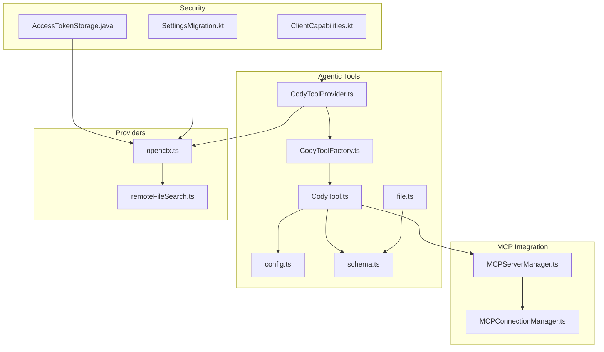
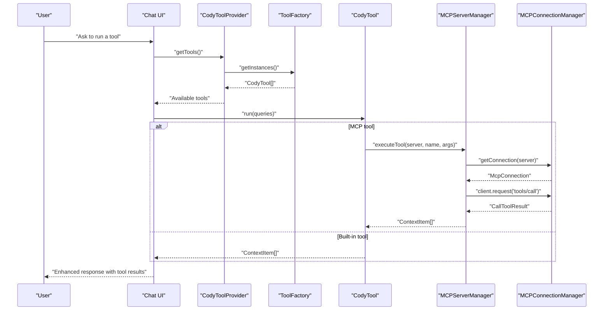
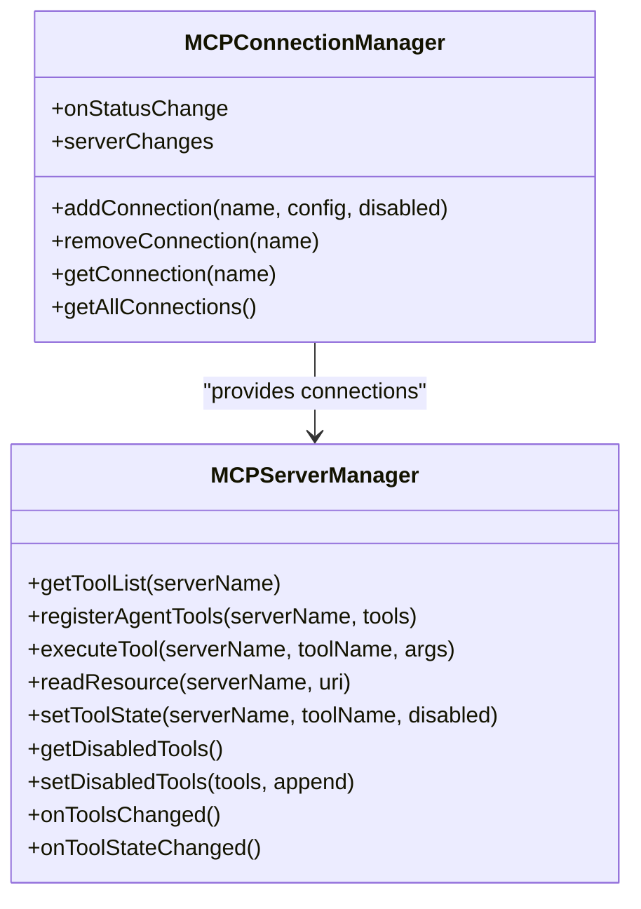
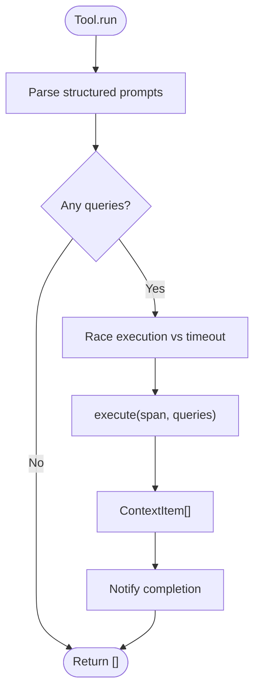
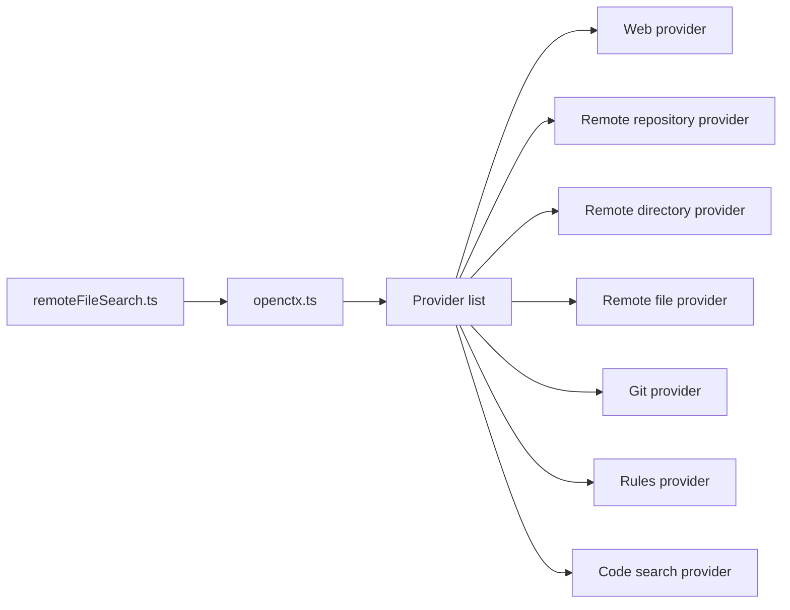
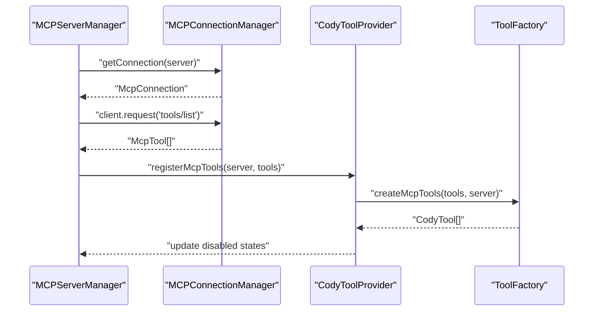
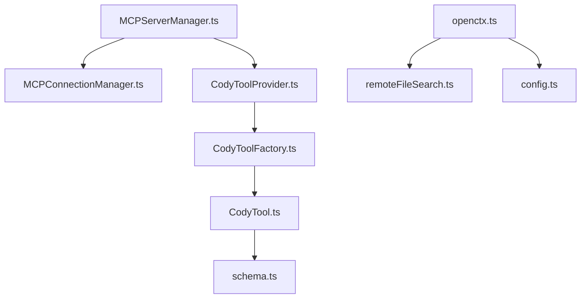

# External Integrations

<cite>
**Referenced Files in This Document**
- [MCPServerManager.ts](file://vscode/src/chat/chat-view/tools/MCPServerManager.ts)
- [MCPConnectionManager.ts](file://vscode/src/chat/chat-view/tools/MCPConnectionManager.ts)
- [CodyToolProvider.ts](file://vscode/src/chat/agentic/CodyToolProvider.ts)
- [CodyToolFactory.ts](file://vscode/src/chat/agentic/CodyToolFactory.ts)
- [CodyTool.ts](file://vscode/src/chat/agentic/CodyTool.ts)
- [config.ts](file://vscode/src/chat/agentic/config.ts)
- [openctx.ts](file://vscode/src/context/openctx.ts)
- [schema.ts](file://vscode/src/chat/chat-view/tools/schema.ts)
- [file.ts](file://vscode/src/chat/chat-view/tools/file.ts)
- [remoteFileSearch.ts](file://vscode/src/context/openctx/remoteFileSearch.ts)
- [vscode-shim.ts](file://agent/src/vscode-shim.ts)
- [url.ts](file://lib/shared/src/sourcegraph-api/graphql/url.ts)
- [AccessTokenStorage.java](file://jetbrains/src/main/java/com/sourcegraph/config/AccessTokenStorage.java)
- [SettingsMigration.kt](file://jetbrains/src/main/kotlin/com/sourcegraph/cody/config/migration/SettingsMigration.kt)
- [ClientCapabilities.kt](file://agent/bindings/kotlin/lib/src/main/kotlin/com/sourcegraph/cody/agent/protocol_generated/ClientCapabilities.kt)
</cite>

## Table of Contents
1. [Introduction](#introduction)
2. [Project Structure](#project-structure)
3. [Core Components](#core-components)
4. [Architecture Overview](#architecture-overview)
5. [Detailed Component Analysis](#detailed-component-analysis)
6. [Dependency Analysis](#dependency-analysis)
7. [Performance Considerations](#performance-considerations)
8. [Security Considerations](#security-considerations)
9. [Integration Patterns](#integration-patterns)
10. [Troubleshooting Guide](#troubleshooting-guide)
11. [Conclusion](#conclusion)

## Introduction
This document explains how Cody integrates external tools and services to enhance chat conversations. It covers:
- The Model Context Protocol (MCP) integration that enables external tools to participate in chat
- The agentic tool system that performs actions like file operations, shell commands, and repository interactions
- The provider architecture for extending chat with custom tools and services
- Integration patterns for external APIs, web services, and development tools
- Security considerations including permissions, sandboxing, and secret storage
- Examples of common integrations such as code search, bug tracking systems, and development workflows
- Tool discovery, registration, and lifecycle management

## Project Structure
Cody’s external integration surface spans three primary areas:
- MCP tooling and connections for external tool servers
- Agentic tools for file, shell, search, and OpenCtx/MCP tools
- Provider architecture for web, bug tracking, Git, and repository search

**Diagram sources**
- [MCPServerManager.ts:31-509](file://vscode/src/chat/chat-view/tools/MCPServerManager.ts#L31-L509)
- [MCPConnectionManager.ts:38-263](file://vscode/src/chat/chat-view/tools/MCPConnectionManager.ts#L38-L263)
- [CodyToolProvider.ts:48-141](file://vscode/src/chat/agentic/CodyToolProvider.ts#L48-L141)
- [CodyToolFactory.ts:36-208](file://vscode/src/chat/agentic/CodyToolFactory.ts#L36-L208)
- [CodyTool.ts:32-495](file://vscode/src/chat/agentic/CodyTool.ts#L32-L495)
- [config.ts:5-102](file://vscode/src/chat/agentic/config.ts#L5-L102)
- [openctx.ts:109-254](file://vscode/src/context/openctx.ts#L109-L254)
- [remoteFileSearch.ts:96-118](file://vscode/src/context/openctx/remoteFileSearch.ts#L96-L118)
- [schema.ts:1-50](file://vscode/src/chat/chat-view/tools/schema.ts#L1-L50)
- [file.ts:10-41](file://vscode/src/chat/chat-view/tools/file.ts#L10-L41)
- [ClientCapabilities.kt:24-31](file://agent/bindings/kotlin/lib/src/main/kotlin/com/sourcegraph/cody/agent/protocol_generated/ClientCapabilities.kt#L24-L31)
- [AccessTokenStorage.java:32-68](file://jetbrains/src/main/java/com/sourcegraph/config/AccessTokenStorage.java#L32-L68)
- [SettingsMigration.kt:350-378](file://jetbrains/src/main/kotlin/com/sourcegraph/cody/config/migration/SettingsMigration.kt#L350-L378)

**Section sources**
- [MCPServerManager.ts:31-509](file://vscode/src/chat/chat-view/tools/MCPServerManager.ts#L31-L509)
- [CodyToolProvider.ts:48-141](file://vscode/src/chat/agentic/CodyToolProvider.ts#L48-L141)
- [openctx.ts:109-254](file://vscode/src/context/openctx.ts#L109-L254)

## Core Components
- MCP tooling and connections:
  - MCPConnectionManager establishes and monitors connections to external MCP servers via stdio or SSE transports
  - MCPServerManager discovers tools, registers agent tools, executes tool calls, and transforms results into chat context items
- Agentic tool system:
  - CodyToolProvider orchestrates tool lifecycle and integrates OpenCtx providers
  - ToolFactory registers default tools (search, file, CLI) and dynamically creates OpenCtx and MCP tools
  - CodyTool defines the base tool abstraction, execution timeouts, and parsing of structured prompts
- Provider architecture:
  - OpenCtx controller composes providers for web, repositories, files, Git, rules, and omnibox search
  - Remote file search provider resolves repository file content for chat

**Section sources**
- [MCPConnectionManager.ts:38-263](file://vscode/src/chat/chat-view/tools/MCPConnectionManager.ts#L38-L263)
- [MCPServerManager.ts:31-509](file://vscode/src/chat/chat-view/tools/MCPServerManager.ts#L31-L509)
- [CodyToolProvider.ts:48-141](file://vscode/src/chat/agentic/CodyToolProvider.ts#L48-L141)
- [CodyToolFactory.ts:36-208](file://vscode/src/chat/agentic/CodyToolFactory.ts#L36-L208)
- [CodyTool.ts:32-495](file://vscode/src/chat/agentic/CodyTool.ts#L32-L495)
- [openctx.ts:109-254](file://vscode/src/context/openctx.ts#L109-L254)
- [remoteFileSearch.ts:96-118](file://vscode/src/context/openctx/remoteFileSearch.ts#L96-L118)

## Architecture Overview
The external integration architecture connects chat agents to external services through two pathways:
- MCP tools: External servers expose tools; MCPServerManager executes them and returns context items
- Providers: OpenCtx providers supply context items for web pages, repositories, files, and Git diffs

**Diagram sources**
- [CodyToolProvider.ts:64-74](file://vscode/src/chat/agentic/CodyToolProvider.ts#L64-L74)
- [CodyToolFactory.ts:70-83](file://vscode/src/chat/agentic/CodyToolFactory.ts#L70-L83)
- [CodyTool.ts:96-133](file://vscode/src/chat/agentic/CodyTool.ts#L96-L133)
- [MCPServerManager.ts:282-337](file://vscode/src/chat/chat-view/tools/MCPServerManager.ts#L282-L337)
- [MCPConnectionManager.ts:249-255](file://vscode/src/chat/chat-view/tools/MCPConnectionManager.ts#L249-L255)

## Detailed Component Analysis

### MCP Integration
- Connection management:
  - Supports stdio and SSE transports
  - Emits status change events and notifies server/tool changes
- Tool discovery and registration:
  - Lists tools from servers and registers agent tools
  - Updates disabled states and propagates changes to UI and provider registry
- Execution pipeline:
  - Validates tool/server state, sends tools/call, transforms results into message parts and context items
  - Produces a standardized tool state object for chat rendering

**Diagram sources**
- [MCPConnectionManager.ts:38-263](file://vscode/src/chat/chat-view/tools/MCPConnectionManager.ts#L38-L263)
- [MCPServerManager.ts:31-509](file://vscode/src/chat/chat-view/tools/MCPServerManager.ts#L31-L509)

**Section sources**
- [MCPConnectionManager.ts:106-218](file://vscode/src/chat/chat-view/tools/MCPConnectionManager.ts#L106-L218)
- [MCPServerManager.ts:49-114](file://vscode/src/chat/chat-view/tools/MCPServerManager.ts#L49-L114)
- [MCPServerManager.ts:185-250](file://vscode/src/chat/chat-view/tools/MCPServerManager.ts#L185-L250)
- [MCPServerManager.ts:282-337](file://vscode/src/chat/chat-view/tools/MCPServerManager.ts#L282-L337)
- [MCPServerManager.ts:342-370](file://vscode/src/chat/chat-view/tools/MCPServerManager.ts#L342-L370)
- [MCPServerManager.ts:375-420](file://vscode/src/chat/chat-view/tools/MCPServerManager.ts#L375-L420)
- [MCPServerManager.ts:425-491](file://vscode/src/chat/chat-view/tools/MCPServerManager.ts#L425-L491)

### Agentic Tool System
- Tool lifecycle:
  - Default tools: search, file retrieval, terminal commands
  - Dynamic tools: OpenCtx and MCP tools created via ToolFactory
  - Execution timeout enforced per tool
- Tool execution:
  - Parse structured prompts and execute with callbacks for progress and approval (e.g., CLI)
  - Transform results into context items consumable by chat

**Diagram sources**
- [CodyTool.ts:101-133](file://vscode/src/chat/agentic/CodyTool.ts#L101-L133)

**Section sources**
- [CodyToolProvider.ts:59-62](file://vscode/src/chat/agentic/CodyToolProvider.ts#L59-L62)
- [CodyToolFactory.ts:36-89](file://vscode/src/chat/agentic/CodyToolFactory.ts#L36-L89)
- [CodyTool.ts:96-133](file://vscode/src/chat/agentic/CodyTool.ts#L96-L133)
- [CodyTool.ts:158-187](file://vscode/src/chat/agentic/CodyTool.ts#L158-L187)
- [CodyTool.ts:211-218](file://vscode/src/chat/agentic/CodyTool.ts#L211-L218)
- [CodyTool.ts:243-270](file://vscode/src/chat/agentic/CodyTool.ts#L243-L270)
- [CodyTool.ts:284-340](file://vscode/src/chat/agentic/CodyTool.ts#L284-L340)
- [CodyTool.ts:357-403](file://vscode/src/chat/agentic/CodyTool.ts#L357-L403)
- [CodyTool.ts:427-487](file://vscode/src/chat/agentic/CodyTool.ts#L427-L487)

### Provider Architecture
- OpenCtx controller composes providers:
  - Web, repository, directory, file, Git, rules, omnibox code search
  - Conditional inclusion based on auth status, site version, and feature flags
- Remote file search provider:
  - Resolves repository file content and constructs items with AI content for chat

**Diagram sources**
- [openctx.ts:109-206](file://vscode/src/context/openctx.ts#L109-L206)
- [openctx.ts:209-254](file://vscode/src/context/openctx.ts#L209-L254)
- [remoteFileSearch.ts:96-118](file://vscode/src/context/openctx/remoteFileSearch.ts#L96-L118)

**Section sources**
- [openctx.ts:109-206](file://vscode/src/context/openctx.ts#L109-L206)
- [openctx.ts:209-254](file://vscode/src/context/openctx.ts#L209-L254)
- [remoteFileSearch.ts:96-118](file://vscode/src/context/openctx/remoteFileSearch.ts#L96-L118)

### Tool Discovery, Registration, and Lifecycle
- Discovery:
  - MCP: MCPServerManager lists tools and registers agent tools
  - OpenCtx: CodyToolProvider listens for provider metadata and creates tools
- Registration:
  - ToolFactory registers default and dynamic tools
  - MCP tools are normalized to consistent tool names
- Lifecycle:
  - Disabled states synchronized across UI, provider, and server
  - Tool state changes emit events for observers

**Diagram sources**
- [MCPServerManager.ts:49-114](file://vscode/src/chat/chat-view/tools/MCPServerManager.ts#L49-L114)
- [MCPServerManager.ts:81-98](file://vscode/src/chat/chat-view/tools/MCPServerManager.ts#L81-L98)
- [CodyToolProvider.ts:81-89](file://vscode/src/chat/agentic/CodyToolProvider.ts#L81-L89)
- [CodyToolFactory.ts:128-150](file://vscode/src/chat/agentic/CodyToolFactory.ts#L128-L150)

**Section sources**
- [MCPServerManager.ts:49-114](file://vscode/src/chat/chat-view/tools/MCPServerManager.ts#L49-L114)
- [CodyToolProvider.ts:112-131](file://vscode/src/chat/agentic/CodyToolProvider.ts#L112-L131)
- [CodyToolFactory.ts:128-150](file://vscode/src/chat/agentic/CodyToolFactory.ts#L128-L150)
- [CodyToolFactory.ts:152-158](file://vscode/src/chat/agentic/CodyToolFactory.ts#L152-L158)

### Example Integrations
- Code search:
  - Built-in SearchTool leverages corpus context and retrieves context items
- File operations:
  - FileTool retrieves file content; EditTool schema supports create/replace operations
- Shell commands:
  - CLI tool requires explicit approval and executes safely
- Web and bug tracking:
  - OpenCtx web provider for URLs; Linear issues provider for bug tracking
- Development workflows:
  - Git provider for diffs; Omnibox code search for repository-wide queries

**Section sources**
- [CodyTool.ts:243-270](file://vscode/src/chat/agentic/CodyTool.ts#L243-L270)
- [file.ts:10-41](file://vscode/src/chat/chat-view/tools/file.ts#L10-L41)
- [schema.ts:4-11](file://vscode/src/chat/chat-view/tools/schema.ts#L4-L11)
- [schema.ts:17-26](file://vscode/src/chat/chat-view/tools/schema.ts#L17-L26)
- [openctx.ts:141-206](file://vscode/src/context/openctx.ts#L141-L206)
- [config.ts:5-102](file://vscode/src/chat/agentic/config.ts#L5-L102)

## Dependency Analysis
- MCP depends on:
  - MCPConnectionManager for transport and connection lifecycle
  - ToolFactory and CodyToolProvider for tool registration and orchestration
- Agentic tools depend on:
  - ContextRetriever for corpus-based search
  - Shell execution for CLI commands
  - OpenCtx controller for external provider items
- Providers depend on:
  - Auth status and feature flags for capability gating
  - GraphQL client for viewer settings and site version checks

**Diagram sources**
- [MCPServerManager.ts:31-509](file://vscode/src/chat/chat-view/tools/MCPServerManager.ts#L31-L509)
- [MCPConnectionManager.ts:38-263](file://vscode/src/chat/chat-view/tools/MCPConnectionManager.ts#L38-L263)
- [CodyToolProvider.ts:48-141](file://vscode/src/chat/agentic/CodyToolProvider.ts#L48-L141)
- [CodyToolFactory.ts:36-208](file://vscode/src/chat/agentic/CodyToolFactory.ts#L36-L208)
- [CodyTool.ts:32-495](file://vscode/src/chat/agentic/CodyTool.ts#L32-L495)
- [openctx.ts:109-254](file://vscode/src/context/openctx.ts#L109-L254)
- [remoteFileSearch.ts:96-118](file://vscode/src/context/openctx/remoteFileSearch.ts#L96-L118)
- [config.ts:5-102](file://vscode/src/chat/agentic/config.ts#L5-L102)
- [schema.ts:1-50](file://vscode/src/chat/chat-view/tools/schema.ts#L1-L50)

**Section sources**
- [MCPServerManager.ts:31-509](file://vscode/src/chat/chat-view/tools/MCPServerManager.ts#L31-L509)
- [CodyToolProvider.ts:48-141](file://vscode/src/chat/agentic/CodyToolProvider.ts#L48-L141)
- [openctx.ts:109-254](file://vscode/src/context/openctx.ts#L109-L254)

## Performance Considerations
- Tool execution timeouts prevent long-running operations from blocking chat
- Batched provider queries should be investigated for OpenCtx tools to reduce latency
- Resource and template listings are currently stubbed; implementing them can improve tool discoverability and reduce unnecessary calls
- Connection lifecycle management (retries, backoff) should be considered for MCP servers to improve resilience

[No sources needed since this section provides general guidance]

## Security Considerations
- Permissions and approvals:
  - CLI tool execution requires explicit user confirmation before running commands
  - MCP tool execution is gated by server connection state and disabled flags
- Transport security:
  - SSE transport supports secure URLs; stdio transport runs local processes
- Secret storage:
  - JetBrains secure storage for access tokens with fallbacks and user denial handling
  - Settings migration logic considers project-level overrides and secure storage availability
- Capability exposure:
  - Client capabilities define whether shell execution and secrets are enabled
- Sandboxing:
  - MCP servers run in separate processes or over secure channels; results are sanitized into message parts and context items

**Section sources**
- [CodyTool.ts:169-181](file://vscode/src/chat/agentic/CodyTool.ts#L169-L181)
- [MCPConnectionManager.ts:60-76](file://vscode/src/chat/chat-view/tools/MCPConnectionManager.ts#L60-L76)
- [AccessTokenStorage.java:32-68](file://jetbrains/src/main/java/com/sourcegraph/config/AccessTokenStorage.java#L32-L68)
- [SettingsMigration.kt:350-378](file://jetbrains/src/main/kotlin/com/sourcegraph/cody/config/migration/SettingsMigration.kt#L350-L378)
- [ClientCapabilities.kt:24-31](file://agent/bindings/kotlin/lib/src/main/kotlin/com/sourcegraph/cody/agent/protocol_generated/ClientCapabilities.kt#L24-L31)

## Integration Patterns
- External APIs:
  - Use OpenCtx providers to integrate web APIs and services; results are transformed into AI content for chat
  - GraphQL URL construction demonstrates API endpoint composition
- Web services:
  - Web provider fetches content from URLs; Git provider supplies diffs; omnibox code search queries repositories
- Development tools:
  - MCP tools enable repository operations, database schema inspection, and HTTP fetching
  - File and edit tools operate within the editor’s file system

**Section sources**
- [openctx.ts:109-206](file://vscode/src/context/openctx.ts#L109-L206)
- [remoteFileSearch.ts:96-118](file://vscode/src/context/openctx/remoteFileSearch.ts#L96-L118)
- [config.ts:34-101](file://vscode/src/chat/agentic/config.ts#L34-L101)
- [url.ts:12-16](file://lib/shared/src/sourcegraph-api/graphql/url.ts#L12-L16)

## Troubleshooting Guide
- MCP connection failures:
  - Check transport type (stdio/SSE), command/URL configuration, and logs emitted on transport errors
  - Verify server status and error messages; connection manager updates status and emits events
- Tool execution errors:
  - Ensure the tool is enabled and server is connected
  - Inspect transformed results and error states produced by MCPServerManager
- Provider issues:
  - Confirm auth status and feature flags; viewer settings can override provider configuration
  - Disable conflicting extensions and ensure OpenCtx controller initializes successfully

**Section sources**
- [MCPConnectionManager.ts:134-217](file://vscode/src/chat/chat-view/tools/MCPConnectionManager.ts#L134-L217)
- [MCPServerManager.ts:282-337](file://vscode/src/chat/chat-view/tools/MCPServerManager.ts#L282-L337)
- [openctx.ts:299-308](file://vscode/src/context/openctx.ts#L299-L308)

## Conclusion
Cody’s external integration framework combines MCP tooling and a robust provider architecture to deliver powerful, extensible chat experiences. The agentic tool system enforces safety and transparency through approvals and timeouts, while the provider layer opens access to web, repository, and development tools. With clear lifecycle management, security-conscious defaults, and modular design, the system supports both simple and advanced integrations across diverse development workflows.