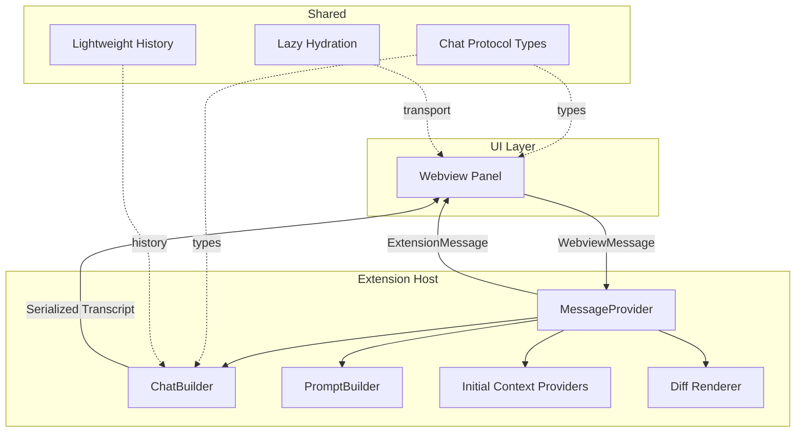
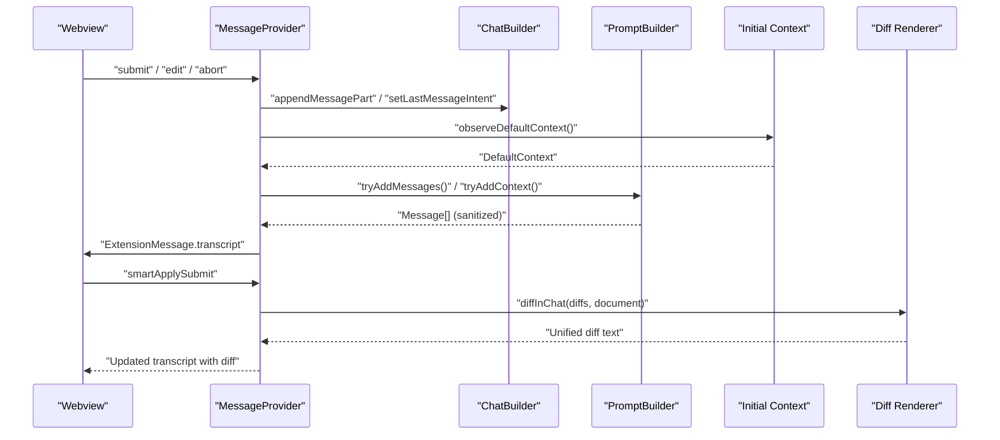
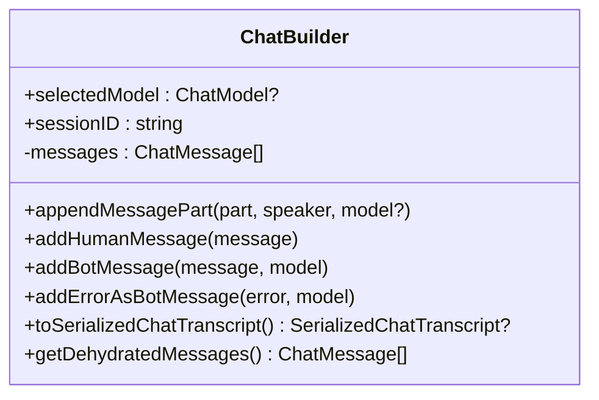
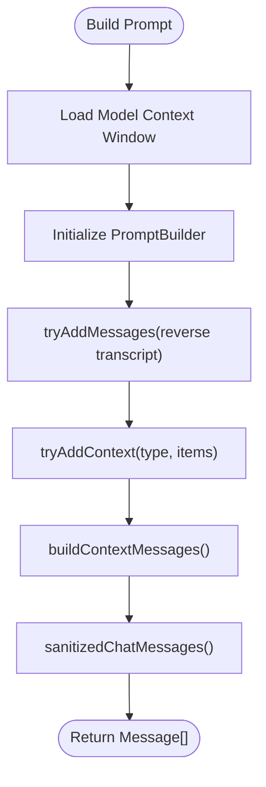
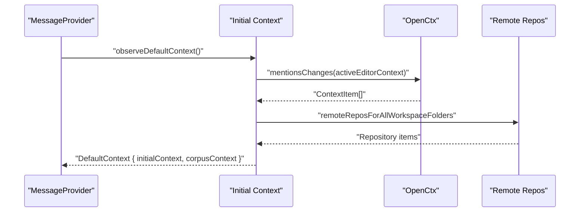
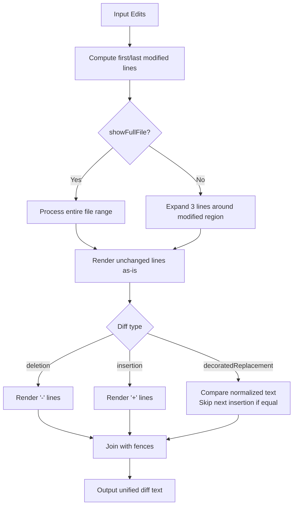
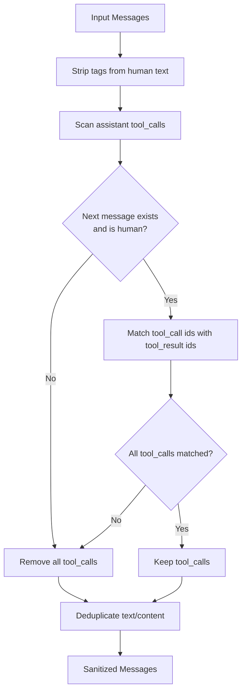
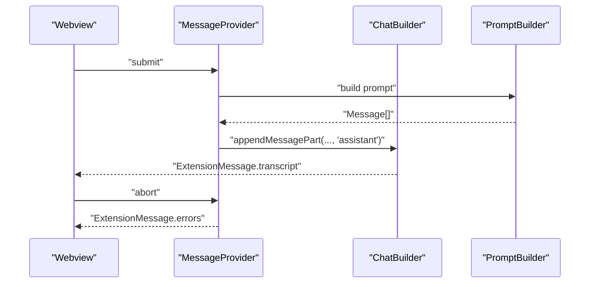
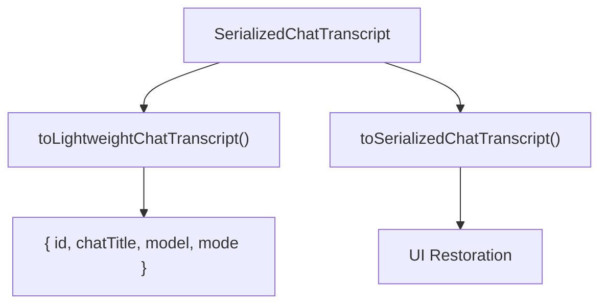
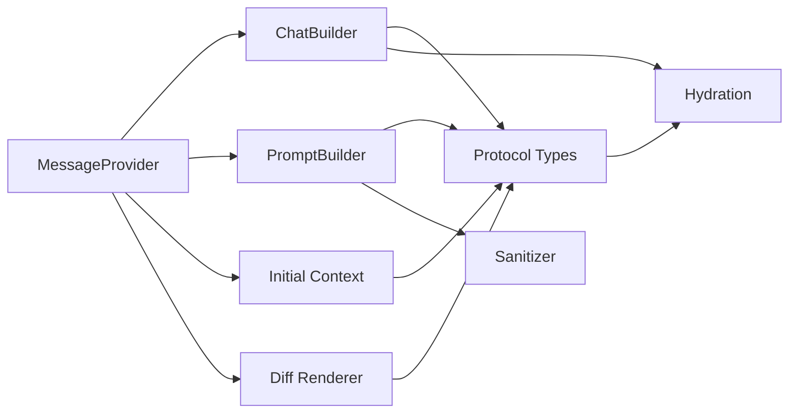

# Message Handling

<cite>
**Referenced Files in This Document**
- [MessageProvider.ts](file://vscode/src/chat/MessageProvider.ts)
- [protocol.ts](file://vscode/src/chat/protocol.ts)
- [ChatBuilder.ts](file://vscode/src/chat/chat-view/ChatBuilder.ts)
- [initialContext.ts](file://vscode/src/chat/initialContext.ts)
- [prompt.ts](file://vscode/src/chat/chat-view/prompt.ts)
- [index.ts](file://vscode/src/prompt-builder/index.ts)
- [sanitize.ts](file://vscode/src/prompt-builder/sanitize.ts)
- [diff.ts](file://vscode/src/chat/diff.ts)
- [hydrateAfterPostMessage.ts](file://lib/shared/src/editor/hydrateAfterPostMessage.ts)
- [lightweight-history.ts](file://lib/shared/src/chat/transcript/lightweight-history.ts)
- [utils.ts](file://vscode/src/chat/utils.ts)
</cite>

## Table of Contents
1. [Introduction](#introduction)
2. [Project Structure](#project-structure)
3. [Core Components](#core-components)
4. [Architecture Overview](#architecture-overview)
5. [Detailed Component Analysis](#detailed-component-analysis)
6. [Dependency Analysis](#dependency-analysis)
7. [Performance Considerations](#performance-considerations)
8. [Troubleshooting Guide](#troubleshooting-guide)
9. [Conclusion](#conclusion)
10. [Appendices](#appendices)

## Introduction
This document explains the message handling system that powers chat interactions between the UI and the AI backend. It covers how messages are modeled, serialized and deserialized, transformed for prompts, validated and sanitized, streamed and rendered, and persisted across sessions. It also documents how code-related diffs are tracked and presented, and how context is injected and preserved across exchanges.

## Project Structure
The message handling system spans several modules:
- Chat protocol and wire-level message types define the communication contract between the UI and the extension host.
- ChatBuilder maintains the in-memory transcript and supports incremental updates, serialization, and de-hydration for cross-process transport.
- PromptBuilder constructs the LLM prompt from the transcript and context items, enforcing token budgets and sanitizing content.
- Initial context providers assemble default and corpus context for the first interaction.
- Diff utilities render code changes as unified diffs suitable for chat.
- Serialization and hydration utilities optimize transport and restore structured data efficiently.



**Diagram sources**
- [protocol.ts:55-179](file://vscode/src/chat/protocol.ts#L55-L179)
- [protocol.ts:188-236](file://vscode/src/chat/protocol.ts#L188-L236)
- [MessageProvider.ts:13-17](file://vscode/src/chat/MessageProvider.ts#L13-L17)
- [ChatBuilder.ts:321-344](file://vscode/src/chat/chat-view/ChatBuilder.ts#L321-L344)
- [index.ts:39-87](file://vscode/src/prompt-builder/index.ts#L39-L87)
- [initialContext.ts:68-119](file://vscode/src/chat/initialContext.ts#L68-L119)
- [diff.ts:8-97](file://vscode/src/chat/diff.ts#L8-L97)
- [hydrateAfterPostMessage.ts:40-67](file://lib/shared/src/editor/hydrateAfterPostMessage.ts#L40-L67)
- [lightweight-history.ts:49-68](file://lib/shared/src/chat/transcript/lightweight-history.ts#L49-L68)

**Section sources**
- [protocol.ts:55-179](file://vscode/src/chat/protocol.ts#L55-L179)
- [protocol.ts:188-236](file://vscode/src/chat/protocol.ts#L188-L236)
- [MessageProvider.ts:13-17](file://vscode/src/chat/MessageProvider.ts#L13-L17)
- [ChatBuilder.ts:321-344](file://vscode/src/chat/chat-view/ChatBuilder.ts#L321-L344)
- [index.ts:39-87](file://vscode/src/prompt-builder/index.ts#L39-L87)
- [initialContext.ts:68-119](file://vscode/src/chat/initialContext.ts#L68-L119)
- [diff.ts:8-97](file://vscode/src/chat/diff.ts#L8-L97)
- [hydrateAfterPostMessage.ts:40-67](file://lib/shared/src/editor/hydrateAfterPostMessage.ts#L40-L67)
- [lightweight-history.ts:49-68](file://lib/shared/src/chat/transcript/lightweight-history.ts#L49-L68)

## Core Components
- MessageProvider: Defines the options and error types for message handling and orchestrates chat operations.
- ChatBuilder: Manages the transcript lifecycle, incremental message parts, serialization, and de-hydration for transport.
- PromptBuilder: Builds the LLM prompt from the transcript and context items, enforces token budgets, and sanitizes content.
- Initial Context: Provides default and corpus context for the first interaction, respecting feature flags and user settings.
- Diff Utilities: Renders code changes as unified diffs for chat presentation.
- Protocol Types: Define the wire-level message schema for webview ↔ extension host communication.
- Serialization/Hydration: Optimizes transport of transcripts and restores structured data lazily.

**Section sources**
- [MessageProvider.ts:5-17](file://vscode/src/chat/MessageProvider.ts#L5-L17)
- [ChatBuilder.ts:346-418](file://vscode/src/chat/chat-view/ChatBuilder.ts#L346-L418)
- [index.ts:76-87](file://vscode/src/prompt-builder/index.ts#L76-L87)
- [initialContext.ts:68-119](file://vscode/src/chat/initialContext.ts#L68-L119)
- [diff.ts:8-97](file://vscode/src/chat/diff.ts#L8-L97)
- [protocol.ts:250-292](file://vscode/src/chat/protocol.ts#L250-L292)
- [hydrateAfterPostMessage.ts:40-67](file://lib/shared/src/editor/hydrateAfterPostMessage.ts#L40-L67)

## Architecture Overview
The message flow is a pipeline:
- UI sends WebviewMessage commands to the extension host.
- MessageProvider coordinates chat actions, builds prompts, and streams responses.
- ChatBuilder stores and serializes the transcript, handling incremental parts and de-hydration.
- PromptBuilder constructs the prompt from the transcript and context items, sanitizes content, and enforces token budgets.
- Diff utilities render code changes for code-centric interactions.
- ExtensionMessage carries the updated transcript and UI state back to the webview.



**Diagram sources**
- [protocol.ts:74-103](file://vscode/src/chat/protocol.ts#L74-L103)
- [protocol.ts:188-236](file://vscode/src/chat/protocol.ts#L188-L236)
- [ChatBuilder.ts:346-418](file://vscode/src/chat/chat-view/ChatBuilder.ts#L346-L418)
- [index.ts:171-203](file://vscode/src/prompt-builder/index.ts#L171-L203)
- [initialContext.ts:68-119](file://vscode/src/chat/initialContext.ts#L68-L119)
- [diff.ts:8-97](file://vscode/src/chat/diff.ts#L8-L97)

## Detailed Component Analysis

### MessageProvider
MessageProvider encapsulates the chat runtime options and error classification. It defines how errors propagate back to the UI (transcript-level, system-level, storage warnings) and holds references to the chat client, guardrails, and editor.

```mermaid
classDiagram
class MessageProviderOptions {
+chat : ChatClient
+guardrails : SourcegraphGuardrailsClient
+editor : VSCodeEditor
}
class MessageErrorType {
<<enumeration>>
"transcript"
"system"
"storage"
}
```

**Diagram sources**
- [MessageProvider.ts:11-17](file://vscode/src/chat/MessageProvider.ts#L11-L17)

**Section sources**
- [MessageProvider.ts:5-17](file://vscode/src/chat/MessageProvider.ts#L5-L17)

### ChatBuilder: Transcript Management and Serialization
ChatBuilder is the canonical transcript builder. It:
- Appends message parts incrementally, combining text parts intelligently.
- Enforces alternating human/assistant order and prevents invalid sequences.
- Serializes to a transcript format suitable for persistence and restoration.
- De-hydrates context items and ranges for transport across postMessage boundaries.



**Diagram sources**
- [ChatBuilder.ts:168-202](file://vscode/src/chat/chat-view/ChatBuilder.ts#L168-L202)
- [ChatBuilder.ts:321-344](file://vscode/src/chat/chat-view/ChatBuilder.ts#L321-L344)
- [ChatBuilder.ts:453-470](file://vscode/src/chat/chat-view/ChatBuilder.ts#L453-L470)

**Section sources**
- [ChatBuilder.ts:346-418](file://vscode/src/chat/chat-view/ChatBuilder.ts#L346-L418)
- [ChatBuilder.ts:321-344](file://vscode/src/chat/chat-view/ChatBuilder.ts#L321-L344)
- [ChatBuilder.ts:453-470](file://vscode/src/chat/chat-view/ChatBuilder.ts#L453-L470)

### Prompt Engineering: Context Injection, Instruction Formatting, and Response Parsing
PromptBuilder constructs the LLM prompt by:
- Building context messages from context items and transcript parts.
- Respecting token budgets per context type and history.
- Sanitizing messages to remove inappropriate content and deduplicate text.
- Handling media items and tool interactions appropriately.



**Diagram sources**
- [index.ts:171-203](file://vscode/src/prompt-builder/index.ts#L171-L203)
- [index.ts:205-292](file://vscode/src/prompt-builder/index.ts#L205-L292)
- [index.ts:76-87](file://vscode/src/prompt-builder/index.ts#L76-L87)
- [sanitize.ts:9-110](file://vscode/src/prompt-builder/sanitize.ts#L9-L110)

**Section sources**
- [index.ts:76-87](file://vscode/src/prompt-builder/index.ts#L76-L87)
- [index.ts:171-203](file://vscode/src/prompt-builder/index.ts#L171-L203)
- [index.ts:205-292](file://vscode/src/prompt-builder/index.ts#L205-L292)
- [sanitize.ts:9-110](file://vscode/src/prompt-builder/sanitize.ts#L9-L110)

### Context Injection and Initial Context
Initial context providers assemble:
- Current file and selection context.
- Corpus context (repositories and remote mentions) with feature-flag-aware behavior.
- OpenCtx auto-included mentions.



**Diagram sources**
- [initialContext.ts:68-119](file://vscode/src/chat/initialContext.ts#L68-L119)
- [initialContext.ts:341-390](file://vscode/src/chat/initialContext.ts#L341-L390)
- [initialContext.ts:210-339](file://vscode/src/chat/initialContext.ts#L210-L339)

**Section sources**
- [initialContext.ts:68-119](file://vscode/src/chat/initialContext.ts#L68-L119)
- [initialContext.ts:341-390](file://vscode/src/chat/initialContext.ts#L341-L390)
- [initialContext.ts:210-339](file://vscode/src/chat/initialContext.ts#L210-L339)

### Message Diff Handling for Code Conversations
Code-related changes are rendered as unified diffs with:
- Optional full-file or compact context views.
- Normalization of text to reduce noise.
- Pairwise detection of decorated replacements to avoid redundant insertions.



**Diagram sources**
- [diff.ts:8-97](file://vscode/src/chat/diff.ts#L8-L97)
- [diff.ts:99-120](file://vscode/src/chat/diff.ts#L99-L120)

**Section sources**
- [diff.ts:8-97](file://vscode/src/chat/diff.ts#L8-L97)
- [diff.ts:99-120](file://vscode/src/chat/diff.ts#L99-L120)

### Message Validation, Sanitization, and Security
Sanitization ensures:
- Tool calls are only retained when paired with corresponding tool results in the next human message.
- Tool results are only retained when originating from the human side.
- Empty text parts are filtered out.
- Think tags are stripped from human messages.
- Duplicate text content is avoided when both text and content exist.



**Diagram sources**
- [sanitize.ts:9-110](file://vscode/src/prompt-builder/sanitize.ts#L9-L110)
- [sanitize.ts:111-137](file://vscode/src/prompt-builder/sanitize.ts#L111-L137)

**Section sources**
- [sanitize.ts:9-110](file://vscode/src/prompt-builder/sanitize.ts#L9-L110)
- [sanitize.ts:111-137](file://vscode/src/prompt-builder/sanitize.ts#L111-L137)

### Real-time Message Processing, Streaming Responses, and Error Handling
- Streaming: The protocol supports server-sent events and chunked responses. Middleware can simulate delays for testing streaming behavior.
- Error handling: Errors are represented as transcript-level errors or system-level alerts depending on severity. ChatBuilder surfaces errors as assistant messages with error metadata.
- Abort handling: Context resolution and operations can be aborted via abort signals.



**Diagram sources**
- [protocol.ts:147-147](file://vscode/src/chat/protocol.ts#L147-L147)
- [ChatBuilder.ts:223-236](file://vscode/src/chat/chat-view/ChatBuilder.ts#L223-L236)
- [e2e utils mitmProxy.ts:235-286](file://vscode/e2e/utils/vscody/fixture/mitmProxy.ts#L235-L286)

**Section sources**
- [protocol.ts:147-147](file://vscode/src/chat/protocol.ts#L147-L147)
- [ChatBuilder.ts:223-236](file://vscode/src/chat/chat-view/ChatBuilder.ts#L223-L236)
- [e2e utils mitmProxy.ts:235-286](file://vscode/e2e/utils/vscody/fixture/mitmProxy.ts#L235-L286)

### Examples of Different Message Types and Rendering
- Text messages: Stored as text parts or combined content parts; sanitized to remove duplicates and empty entries.
- Code messages: Rendered using unified diffs for precise change presentation.
- Images/media: Handled as dedicated context items and rendered as assistant messages when caching is enabled.
- Tool interactions: Tool calls and results are sanitized and only retained when properly paired.

**Section sources**
- [index.ts:99-154](file://vscode/src/prompt-builder/index.ts#L99-L154)
- [sanitize.ts:69-110](file://vscode/src/prompt-builder/sanitize.ts#L69-L110)
- [diff.ts:8-97](file://vscode/src/chat/diff.ts#L8-L97)

### Message History Management, Conversation Continuity, and Context Preservation
- Lightweight history conversion preserves essential metadata (title, last model, intent) for UI continuity.
- ChatBuilder serializes transcripts with interaction pairs and optional model metadata.
- De-hydration avoids expensive serialization of ranges and context items until needed.



**Diagram sources**
- [lightweight-history.ts:49-68](file://lib/shared/src/chat/transcript/lightweight-history.ts#L49-L68)
- [ChatBuilder.ts:321-344](file://vscode/src/chat/chat-view/ChatBuilder.ts#L321-L344)

**Section sources**
- [lightweight-history.ts:49-68](file://lib/shared/src/chat/transcript/lightweight-history.ts#L49-L68)
- [ChatBuilder.ts:321-344](file://vscode/src/chat/chat-view/ChatBuilder.ts#L321-L344)

## Dependency Analysis
- MessageProvider depends on ChatBuilder, PromptBuilder, and initial context providers to orchestrate chat.
- ChatBuilder depends on shared types for serialization and de-hydration.
- PromptBuilder depends on token counting and context rendering utilities.
- Diff utilities depend on edit operations and document text.
- Serialization and hydration utilities optimize cross-process transport.



**Diagram sources**
- [MessageProvider.ts:13-17](file://vscode/src/chat/MessageProvider.ts#L13-L17)
- [ChatBuilder.ts:321-344](file://vscode/src/chat/chat-view/ChatBuilder.ts#L321-L344)
- [index.ts:76-87](file://vscode/src/prompt-builder/index.ts#L76-L87)
- [initialContext.ts:68-119](file://vscode/src/chat/initialContext.ts#L68-L119)
- [diff.ts:8-97](file://vscode/src/chat/diff.ts#L8-L97)
- [protocol.ts:250-292](file://vscode/src/chat/protocol.ts#L250-L292)
- [hydrateAfterPostMessage.ts:40-67](file://lib/shared/src/editor/hydrateAfterPostMessage.ts#L40-L67)

**Section sources**
- [MessageProvider.ts:13-17](file://vscode/src/chat/MessageProvider.ts#L13-L17)
- [ChatBuilder.ts:321-344](file://vscode/src/chat/chat-view/ChatBuilder.ts#L321-L344)
- [index.ts:76-87](file://vscode/src/prompt-builder/index.ts#L76-L87)
- [initialContext.ts:68-119](file://vscode/src/chat/initialContext.ts#L68-L119)
- [diff.ts:8-97](file://vscode/src/chat/diff.ts#L8-L97)
- [protocol.ts:250-292](file://vscode/src/chat/protocol.ts#L250-L292)
- [hydrateAfterPostMessage.ts:40-67](file://lib/shared/src/editor/hydrateAfterPostMessage.ts#L40-L67)

## Performance Considerations
- Lazy hydration reduces overhead when only inspecting small subsets of transcript data.
- De-hydrated context items and ranges minimize payload sizes during postMessage.
- Token budget enforcement prevents oversized prompts and improves throughput.
- Media items are handled separately to avoid token counting overhead while still preserving UI fidelity.

[No sources needed since this section provides general guidance]

## Troubleshooting Guide
Common issues and remedies:
- Transcript serialization failures: Ensure no error-bearing messages precede serialization; ChatBuilder skips interactions containing errors.
- Invalid message order: ChatBuilder enforces alternating human/assistant order and throws on violations.
- Token limit exceeded: PromptBuilder throws when the input exceeds the model’s context window; reduce context or use @-mentions.
- Tool call/result mismatch: Sanitizer removes orphaned tool calls; ensure tool results arrive in the following human message.
- Streaming anomalies: Verify content-type headers for SSE and chunked responses; use middleware to simulate delays for testing.

**Section sources**
- [ChatBuilder.ts:321-344](file://vscode/src/chat/chat-view/ChatBuilder.ts#L321-L344)
- [ChatBuilder.ts:168-202](file://vscode/src/chat/chat-view/ChatBuilder.ts#L168-L202)
- [index.ts:182-194](file://vscode/src/prompt-builder/index.ts#L182-L194)
- [sanitize.ts:33-65](file://vscode/src/prompt-builder/sanitize.ts#L33-L65)
- [e2e utils mitmProxy.ts:235-286](file://vscode/e2e/utils/vscody/fixture/mitmProxy.ts#L235-L286)

## Conclusion
The message handling system integrates a robust transcript builder, a configurable prompt engine, and efficient serialization/hydration mechanisms. It supports real-time streaming, strict sanitization, and specialized rendering for code diffs, while preserving conversation continuity and context across exchanges.

[No sources needed since this section summarizes without analyzing specific files]

## Appendices

### Wire Protocol Highlights
- WebviewMessage: Commands for submit, edit, smart apply, auth, and telemetry.
- ExtensionMessage: Updates to configuration, transcript, rate limits, and client actions.

**Section sources**
- [protocol.ts:55-179](file://vscode/src/chat/protocol.ts#L55-L179)
- [protocol.ts:188-236](file://vscode/src/chat/protocol.ts#L188-L236)

### Additional Utilities
- Auth status helpers for endpoint and verification handling.
- Code block counting for telemetry and UX insights.

**Section sources**
- [utils.ts:24-52](file://vscode/src/chat/utils.ts#L24-L52)
- [utils.ts:60-79](file://vscode/src/chat/utils.ts#L60-L79)