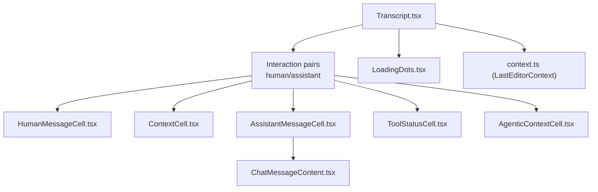
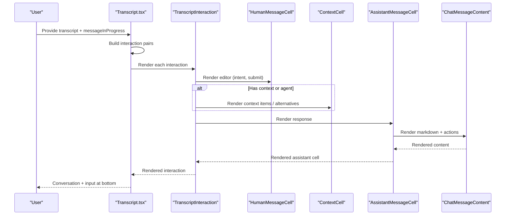
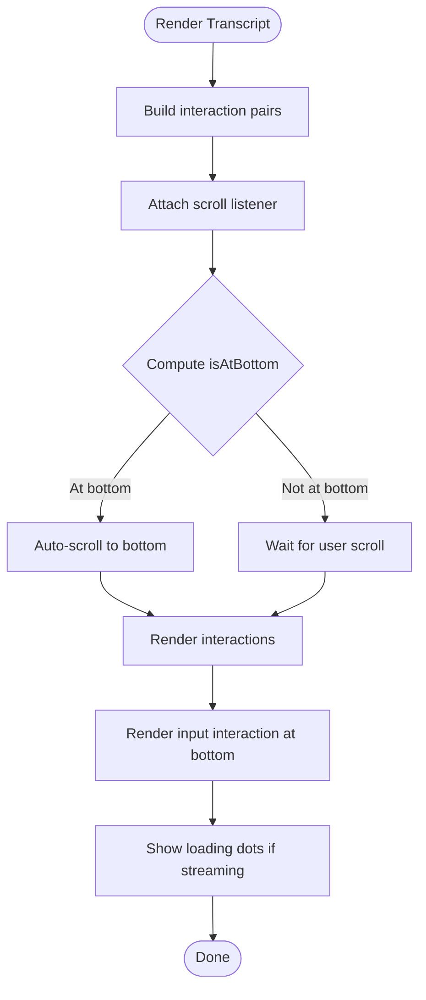
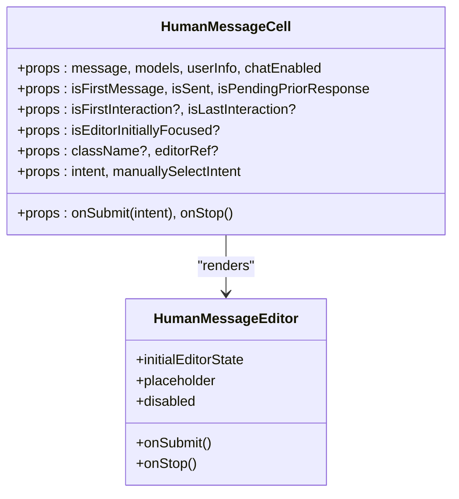
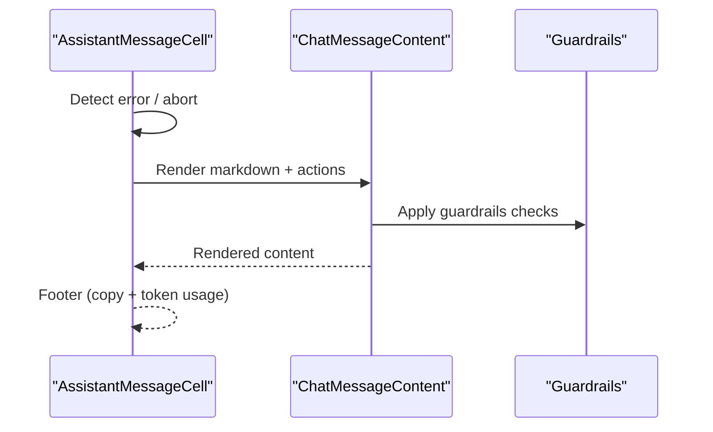
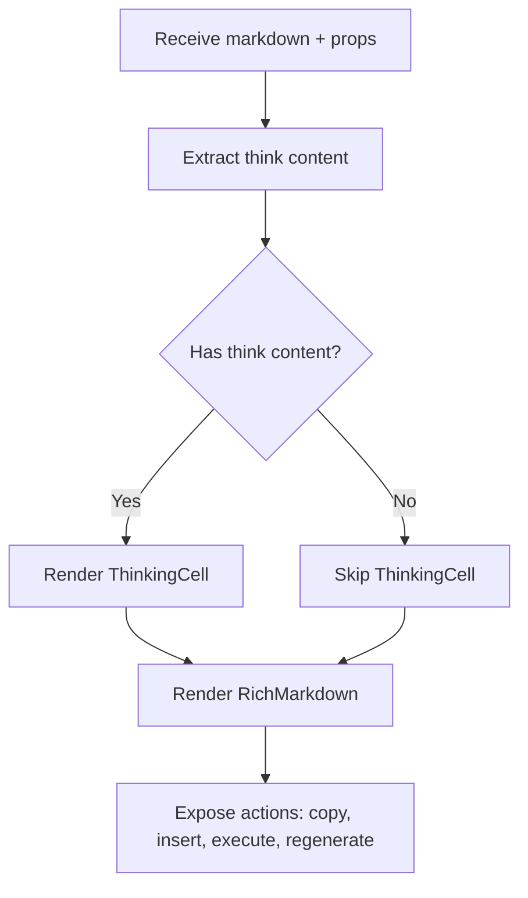
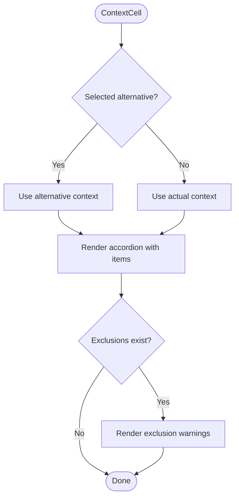
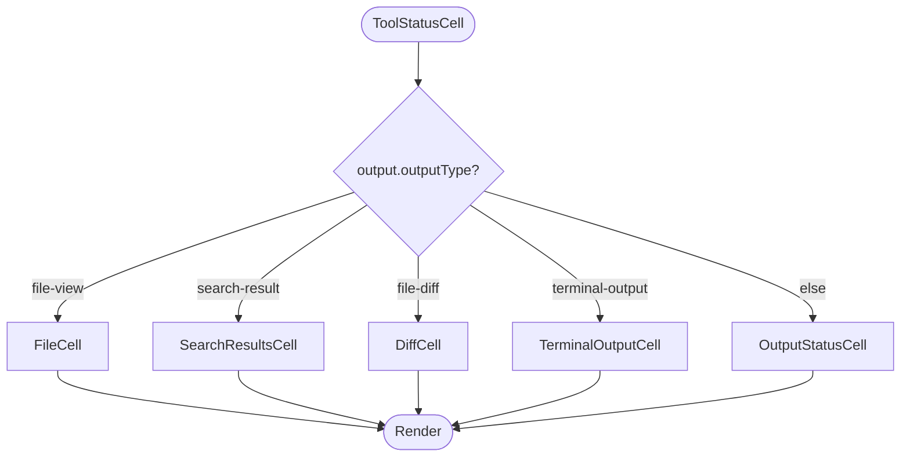
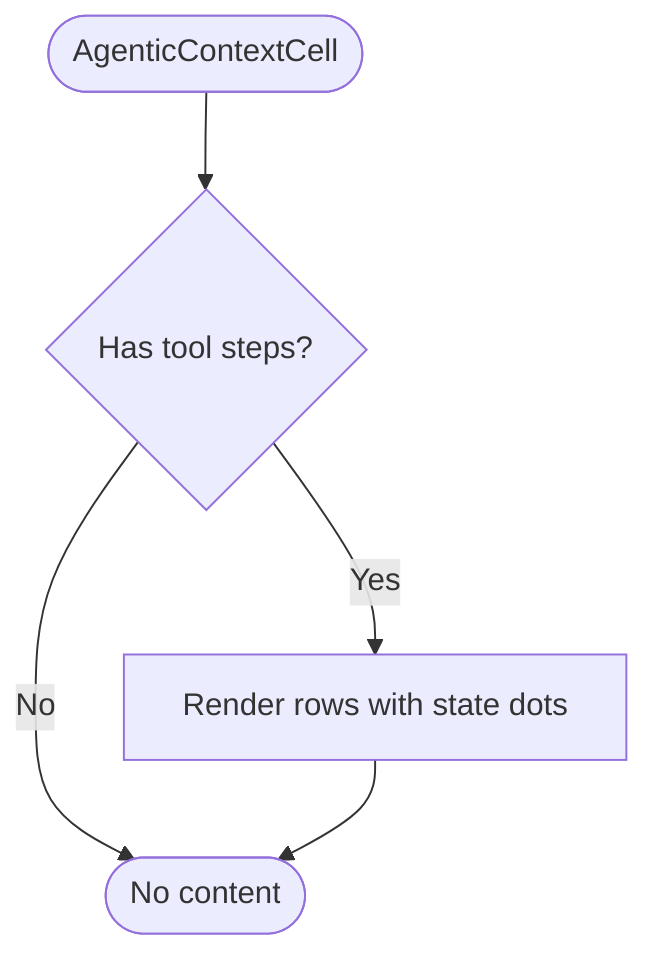
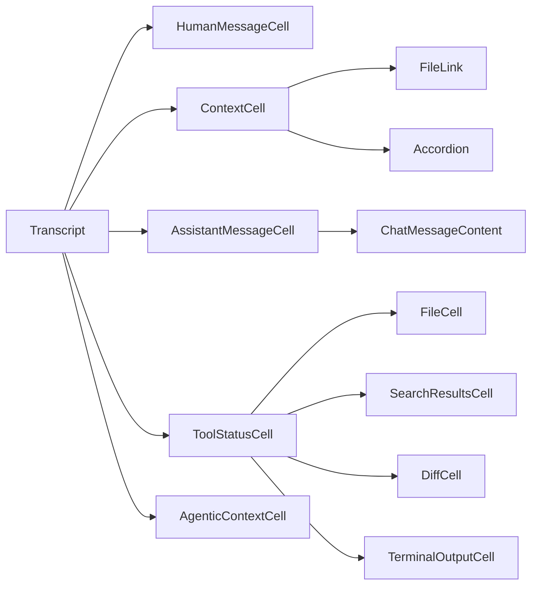

# UI Components

<cite>
**Referenced Files in This Document**
- [Transcript.tsx](file://vscode/webviews/chat/Transcript.tsx)
- [context.ts](file://vscode/webviews/chat/context.ts)
- [ChatMessageContent.tsx](file://vscode/webviews/chat/ChatMessageContent/ChatMessageContent.tsx)
- [AssistantMessageCell.tsx](file://vscode/webviews/chat/cells/messageCell/assistant/AssistantMessageCell.tsx)
- [HumanMessageCell.tsx](file://vscode/webviews/chat/cells/messageCell/human/HumanMessageCell.tsx)
- [ContextCell.tsx](file://vscode/webviews/chat/cells/contextCell/ContextCell.tsx)
- [ToolStatusCell.tsx](file://vscode/webviews/chat/cells/toolCell/ToolStatusCell.tsx)
- [AgenticContextCell.tsx](file://vscode/webviews/chat/cells/agenticCell/AgenticContextCell.tsx)
- [LoadingDots.tsx](file://vscode/webviews/chat/components/LoadingDots.tsx)
</cite>

## Table of Contents
1. [Introduction](#introduction)
2. [Project Structure](#project-structure)
3. [Core Components](#core-components)
4. [Architecture Overview](#architecture-overview)
5. [Detailed Component Analysis](#detailed-component-analysis)
6. [Dependency Analysis](#dependency-analysis)
7. [Performance Considerations](#performance-considerations)
8. [Accessibility and UX](#accessibility-and-ux)
9. [Troubleshooting Guide](#troubleshooting-guide)
10. [Conclusion](#conclusion)

## Introduction
This document explains the React-based webview architecture that renders chat conversations in VS Code. It focuses on the transcript rendering system, the cell-based component model for different message types (human, assistant, context, tool, and agentic), real-time update mechanisms, scroll management, responsive design, styling via CSS modules and theme integration, accessibility, and performance strategies for large conversations.

## Project Structure
The chat UI is organized around a transcript renderer that orchestrates message interactions and a set of reusable cells for rendering distinct parts of a conversation. Supporting components handle loading states, context presentation, tool outputs, and message content rendering.

**Diagram sources**
- [Transcript.tsx:94-306](file://vscode/webviews/chat/Transcript.tsx#L94-L306)
- [HumanMessageCell.tsx:51-132](file://vscode/webviews/chat/cells/messageCell/human/HumanMessageCell.tsx#L51-L132)
- [AssistantMessageCell.tsx:59-183](file://vscode/webviews/chat/cells/messageCell/assistant/AssistantMessageCell.tsx#L59-L183)
- [ContextCell.tsx:40-280](file://vscode/webviews/chat/cells/contextCell/ContextCell.tsx#L40-L280)
- [ToolStatusCell.tsx:21-59](file://vscode/webviews/chat/cells/toolCell/ToolStatusCell.tsx#L21-L59)
- [AgenticContextCell.tsx:21-58](file://vscode/webviews/chat/cells/agenticCell/AgenticContextCell.tsx#L21-L58)
- [ChatMessageContent.tsx:55-132](file://vscode/webviews/chat/ChatMessageContent/ChatMessageContent.tsx#L55-L132)
- [LoadingDots.tsx:4-10](file://vscode/webviews/chat/components/LoadingDots.tsx#L4-L10)
- [context.ts:4-6](file://vscode/webviews/chat/context.ts#L4-L6)

**Section sources**
- [Transcript.tsx:94-306](file://vscode/webviews/chat/Transcript.tsx#L94-L306)
- [context.ts:4-6](file://vscode/webviews/chat/context.ts#L4-L6)

## Core Components
- Transcript: Converts a flat message list into interaction pairs, manages scroll behavior, and renders the conversation with optional input at the bottom.
- HumanMessageCell: Renders the human input editor with intent selection and submission controls.
- AssistantMessageCell: Renders assistant responses, handles errors, sub-messages, and token usage; delegates content rendering to ChatMessageContent.
- ChatMessageContent: Renders markdown content, supports code actions (copy, insert, smart apply), regeneration, and “thinking” visibility.
- ContextCell: Presents context items and alternatives with an accordion UI and exclusion warnings.
- ToolStatusCell: Renders tool outputs (files, diffs, search results, terminal output) or skeleton loaders.
- AgenticContextCell: Visualizes agent processing steps and context retrieval status.
- LoadingDots: Minimal spinner shown while a response is in progress.

**Section sources**
- [Transcript.tsx:94-306](file://vscode/webviews/chat/Transcript.tsx#L94-L306)
- [HumanMessageCell.tsx:51-132](file://vscode/webviews/chat/cells/messageCell/human/HumanMessageCell.tsx#L51-L132)
- [AssistantMessageCell.tsx:59-183](file://vscode/webviews/chat/cells/messageCell/assistant/AssistantMessageCell.tsx#L59-L183)
- [ChatMessageContent.tsx:55-132](file://vscode/webviews/chat/ChatMessageContent/ChatMessageContent.tsx#L55-L132)
- [ContextCell.tsx:40-280](file://vscode/webviews/chat/cells/contextCell/ContextCell.tsx#L40-L280)
- [ToolStatusCell.tsx:21-59](file://vscode/webviews/chat/cells/toolCell/ToolStatusCell.tsx#L21-L59)
- [AgenticContextCell.tsx:21-58](file://vscode/webviews/chat/cells/agenticCell/AgenticContextCell.tsx#L21-L58)
- [LoadingDots.tsx:4-10](file://vscode/webviews/chat/components/LoadingDots.tsx#L4-L10)

## Architecture Overview
The chat UI is a composition of cells rendered inside interactions. The Transcript orchestrates rendering, scroll management, and real-time updates. Cells encapsulate specific concerns and are composed together per interaction.

**Diagram sources**
- [Transcript.tsx:396-807](file://vscode/webviews/chat/Transcript.tsx#L396-L807)
- [HumanMessageCell.tsx:51-132](file://vscode/webviews/chat/cells/messageCell/human/HumanMessageCell.tsx#L51-L132)
- [ContextCell.tsx:40-280](file://vscode/webviews/chat/cells/contextCell/ContextCell.tsx#L40-L280)
- [AssistantMessageCell.tsx:59-183](file://vscode/webviews/chat/cells/messageCell/assistant/AssistantMessageCell.tsx#L59-L183)
- [ChatMessageContent.tsx:55-132](file://vscode/webviews/chat/ChatMessageContent/ChatMessageContent.tsx#L55-L132)

## Detailed Component Analysis

### Transcript: Conversation orchestration and scroll management
- Converts a flat message array into interaction pairs of human/assistant.
- Manages a scrollable container, detects “at bottom,” and auto-scrolls on new content unless the user scrolled up.
- Renders a floating “skip to end” affordance when not at bottom.
- Renders a dedicated input interaction at the bottom and conditionally hides it in the main list.
- Provides token usage display above the input when applicable.
- Uses a debounced state for “at bottom” to avoid flicker.

**Diagram sources**
- [Transcript.tsx:128-191](file://vscode/webviews/chat/Transcript.tsx#L128-L191)
- [Transcript.tsx:268-306](file://vscode/webviews/chat/Transcript.tsx#L268-L306)

**Section sources**
- [Transcript.tsx:94-306](file://vscode/webviews/chat/Transcript.tsx#L94-L306)

### HumanMessageCell: Editor and intent-driven input
- Renders a prompt editor initialized from serialized message state.
- Supports intent selection (chat, edit, search, agentic) and submission/edit callbacks.
- Disables input when chat is disabled and focuses the editor appropriately.
- Skips rendering for agentic tool-only responses when there is no text.

**Diagram sources**
- [HumanMessageCell.tsx:51-132](file://vscode/webviews/chat/cells/messageCell/human/HumanMessageCell.tsx#L51-L132)

**Section sources**
- [HumanMessageCell.tsx:51-132](file://vscode/webviews/chat/cells/messageCell/human/HumanMessageCell.tsx#L51-L132)

### AssistantMessageCell: Response rendering and error handling
- Handles error states (including abort detection) and displays appropriate UI.
- Delegates markdown rendering to ChatMessageContent.
- Supports sub-messages for streamed segments.
- Shows a copy button for chat-mode messages and token usage footer.
- Integrates with guardrails and smart apply for code actions.

**Diagram sources**
- [AssistantMessageCell.tsx:59-183](file://vscode/webviews/chat/cells/messageCell/assistant/AssistantMessageCell.tsx#L59-L183)
- [ChatMessageContent.tsx:55-132](file://vscode/webviews/chat/ChatMessageContent/ChatMessageContent.tsx#L55-L132)

**Section sources**
- [AssistantMessageCell.tsx:59-183](file://vscode/webviews/chat/cells/messageCell/assistant/AssistantMessageCell.tsx#L59-L183)

### ChatMessageContent: Markdown rendering and code actions
- Extracts “thinking” sections from markdown and optionally shows a collapsible thinking cell.
- Renders rich markdown with support for code block actions (copy, insert, smart apply, regenerate).
- Conditionally enables insert based on client capabilities and VS Code context.
- Exposes guards against unsafe content via guardrails.

**Diagram sources**
- [ChatMessageContent.tsx:55-132](file://vscode/webviews/chat/ChatMessageContent/ChatMessageContent.tsx#L55-L132)

**Section sources**
- [ChatMessageContent.tsx:55-132](file://vscode/webviews/chat/ChatMessageContent/ChatMessageContent.tsx#L55-L132)

### ContextCell: Context presentation and alternatives
- Displays context items with an accordion UI and alternative rankings.
- Computes counts and exclusion reasons (too large, filtered).
- Provides tooltips and debug controls in internal builds.
- Conditionally hidden for agentic chat when no items are present.

**Diagram sources**
- [ContextCell.tsx:40-280](file://vscode/webviews/chat/cells/contextCell/ContextCell.tsx#L40-L280)

**Section sources**
- [ContextCell.tsx:40-280](file://vscode/webviews/chat/cells/contextCell/ContextCell.tsx#L40-L280)

### ToolStatusCell: Tool output rendering
- Routes to specialized cells based on output type: file-view, search-result, file-diff, terminal-output.
- Falls back to a generic output status cell.
- Emits VS Code commands for file links.

**Diagram sources**
- [ToolStatusCell.tsx:21-59](file://vscode/webviews/chat/cells/toolCell/ToolStatusCell.tsx#L21-L59)

**Section sources**
- [ToolStatusCell.tsx:21-59](file://vscode/webviews/chat/cells/toolCell/ToolStatusCell.tsx#L21-L59)

### AgenticContextCell: Agent process visualization
- Displays agent processing steps with state indicators (start, success, error).
- Shows context retrieval status and failure badges.

**Diagram sources**
- [AgenticContextCell.tsx:21-58](file://vscode/webviews/chat/cells/agenticCell/AgenticContextCell.tsx#L21-L58)

**Section sources**
- [AgenticContextCell.tsx:21-58](file://vscode/webviews/chat/cells/agenticCell/AgenticContextCell.tsx#L21-L58)

### LoadingDots: Streaming indicator
- Minimal animated dots shown while a response is in progress.

**Section sources**
- [LoadingDots.tsx:4-10](file://vscode/webviews/chat/components/LoadingDots.tsx#L4-L10)

## Dependency Analysis
- Transcript depends on:
  - Interaction construction and memoization
  - Scroll management and debounce
  - Rendering of HumanMessageCell, ContextCell, AssistantMessageCell, ToolStatusCell, AgenticContextCell
  - LastEditorContext for editor lifecycle
- AssistantMessageCell depends on:
  - ChatMessageContent for markdown rendering
  - Guardrails and token usage
- ContextCell depends on:
  - FileLink and shadcn UI primitives
  - Telemetry recorder
- ToolStatusCell depends on:
  - Specialized tool output cells
  - VS Code API wrapper

**Diagram sources**
- [Transcript.tsx:94-306](file://vscode/webviews/chat/Transcript.tsx#L94-L306)
- [AssistantMessageCell.tsx:59-183](file://vscode/webviews/chat/cells/messageCell/assistant/AssistantMessageCell.tsx#L59-L183)
- [ChatMessageContent.tsx:55-132](file://vscode/webviews/chat/ChatMessageContent/ChatMessageContent.tsx#L55-L132)
- [ContextCell.tsx:40-280](file://vscode/webviews/chat/cells/contextCell/ContextCell.tsx#L40-L280)
- [ToolStatusCell.tsx:21-59](file://vscode/webviews/chat/cells/toolCell/ToolStatusCell.tsx#L21-L59)

**Section sources**
- [Transcript.tsx:94-306](file://vscode/webviews/chat/Transcript.tsx#L94-L306)
- [AssistantMessageCell.tsx:59-183](file://vscode/webviews/chat/cells/messageCell/assistant/AssistantMessageCell.tsx#L59-L183)
- [ChatMessageContent.tsx:55-132](file://vscode/webviews/chat/ChatMessageContent/ChatMessageContent.tsx#L55-L132)
- [ContextCell.tsx:40-280](file://vscode/webviews/chat/cells/contextCell/ContextCell.tsx#L40-L280)
- [ToolStatusCell.tsx:21-59](file://vscode/webviews/chat/cells/toolCell/ToolStatusCell.tsx#L21-L59)

## Performance Considerations
- Interaction pairing and memoization:
  - Interaction arrays are computed via a pure function and memoized to avoid unnecessary re-renders.
  - Assistant message loading state is tracked per interaction to gate expensive rendering.
- Rendering boundaries:
  - AssistantMessageCell and HumanMessageCell are wrapped with memo to prevent re-rendering on unrelated prop changes.
  - ChatMessageContent extracts “thinking” content and uses memo to avoid recomputation.
- Scroll management:
  - Debounced “at bottom” prevents micro UI flicker.
  - Auto-scroll only occurs when user has not scrolled up; expected auto-scroll position is recorded to distinguish user scrolls.
- Virtualization and large conversations:
  - No explicit virtualization is present in the referenced files. For very large transcripts, consider:
    - Virtualizing the list of interactions
    - Lazy-loading sub-messages and tool outputs
    - Throttling scroll handlers and debouncing layout calculations
- Efficient re-rendering:
  - Prefer passing stable references and memoized callbacks to child components.
  - Avoid re-creating editor state on each render; use serialized state from messages.

[No sources needed since this section provides general guidance]

## Accessibility and UX
- Keyboard navigation and focus:
  - HumanMessageCell sets initial focus for the editor when appropriate and supports editor focus change callbacks.
  - ToolStatusCell uses accessible UI primitives and emits VS Code commands for file links.
- Screen reader support:
  - LoadingDots uses role and aria attributes to indicate busy state.
  - ContextCell and AgenticContextCell use semantic headings and labels for status and steps.
- Copy and insert actions:
  - Copy button is exposed for assistant messages in chat mode.
  - Insert action is gated by client capabilities and VS Code context.
- Intent selection:
  - Users can select intent (chat, edit, search, agentic) per interaction to tailor behavior.

**Section sources**
- [HumanMessageCell.tsx:100-131](file://vscode/webviews/chat/cells/messageCell/human/HumanMessageCell.tsx#L100-L131)
- [AssistantMessageCell.tsx:162-176](file://vscode/webviews/chat/cells/messageCell/assistant/AssistantMessageCell.tsx#L162-L176)
- [LoadingDots.tsx:4-10](file://vscode/webviews/chat/components/LoadingDots.tsx#L4-L10)
- [ContextCell.tsx:146-168](file://vscode/webviews/chat/cells/contextCell/ContextCell.tsx#L146-L168)
- [AgenticContextCell.tsx:36-58](file://vscode/webviews/chat/cells/agenticCell/AgenticContextCell.tsx#L36-L58)

## Troubleshooting Guide
- Assistant response not appearing:
  - Verify assistant message is included in the interaction pair and not filtered by context loading conditions.
  - Check for error or abort states and ensure guardrails did not block content.
- Context not visible:
  - Confirm context items exist and are not excluded due to size or filters.
  - For agentic chat, the cell may be hidden when no items are present.
- Editor resets or loses focus:
  - Ensure the last editor ref is wired correctly and that the unsent follow-up index is preserved across renders.
- Auto-scroll interferes with reading:
  - The system avoids auto-scrolling when the user has scrolled up; ensure scroll listeners are attached and debounce is configured.

**Section sources**
- [Transcript.tsx:128-191](file://vscode/webviews/chat/Transcript.tsx#L128-L191)
- [AssistantMessageCell.tsx:95-106](file://vscode/webviews/chat/cells/messageCell/assistant/AssistantMessageCell.tsx#L95-L106)
- [ContextCell.tsx:132-135](file://vscode/webviews/chat/cells/contextCell/ContextCell.tsx#L132-L135)
- [HumanMessageCell.tsx:63-71](file://vscode/webviews/chat/cells/messageCell/human/HumanMessageCell.tsx#L63-L71)

## Conclusion
The chat UI composes a robust, cell-based rendering system around a transcript orchestrator. It balances real-time responsiveness with accessibility and performance by using memoization, controlled scroll behavior, and modular components. For very large conversations, consider adding virtualization and lazy-loading strategies to maintain smooth interactions.