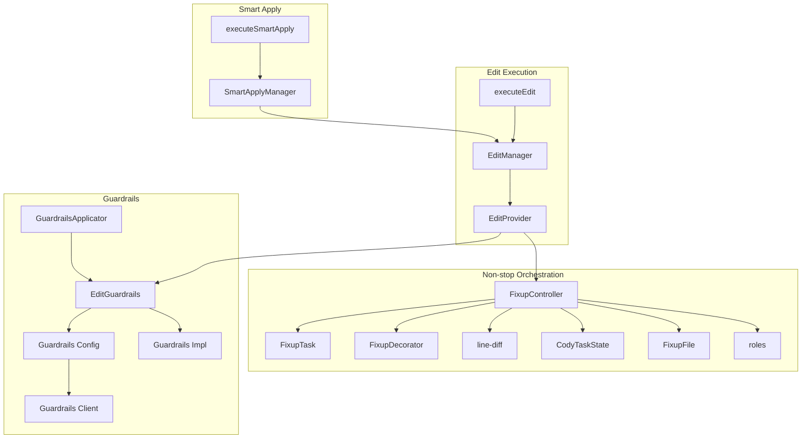
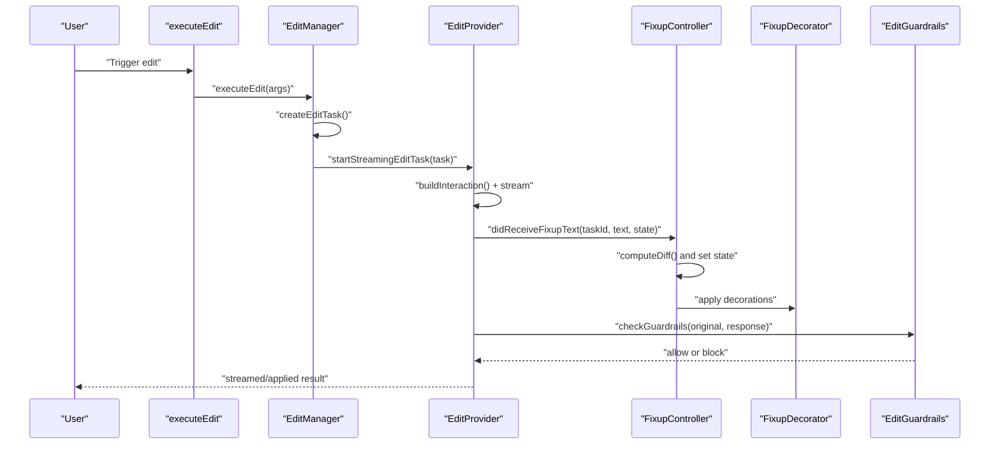
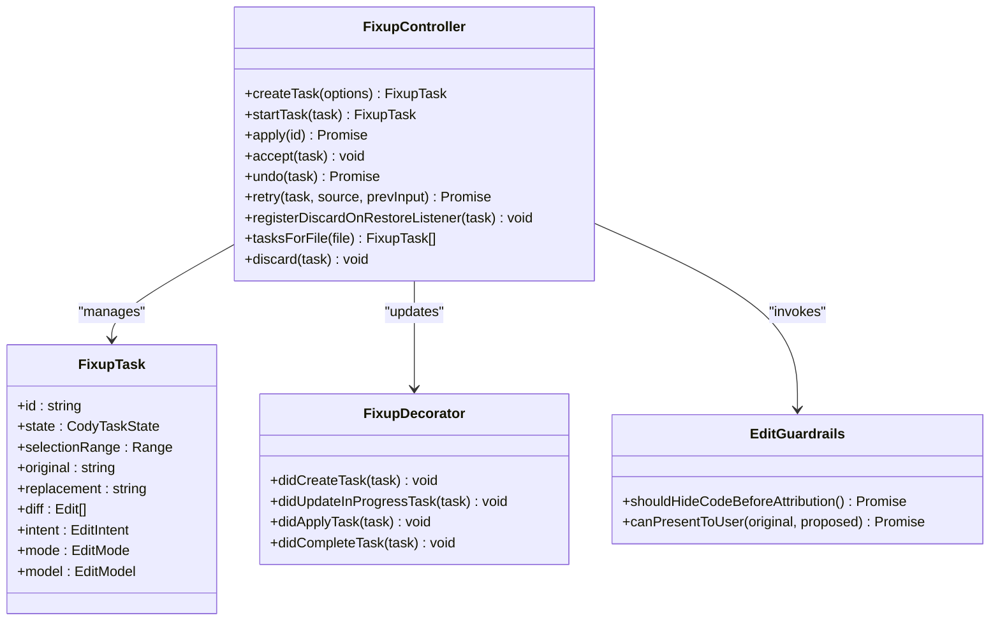
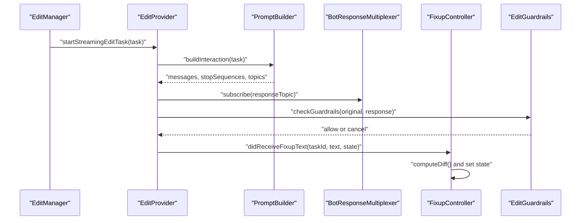
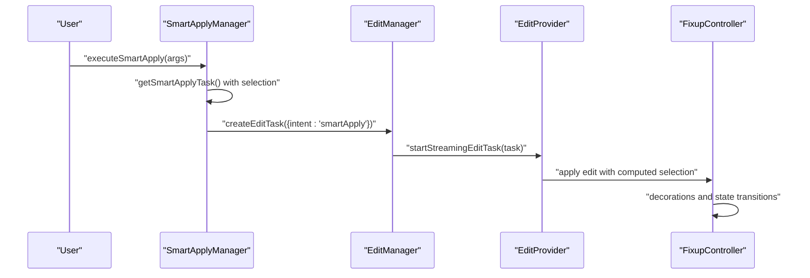
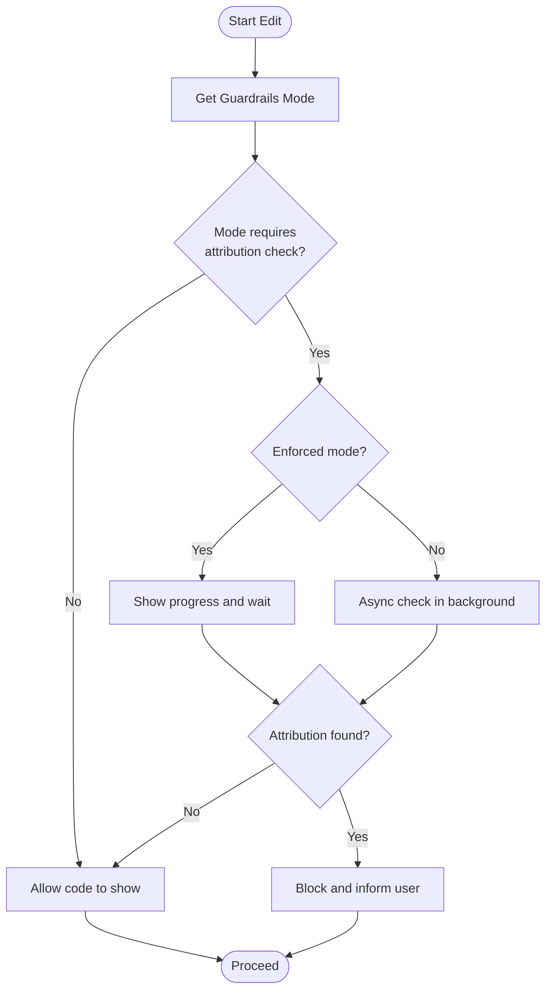
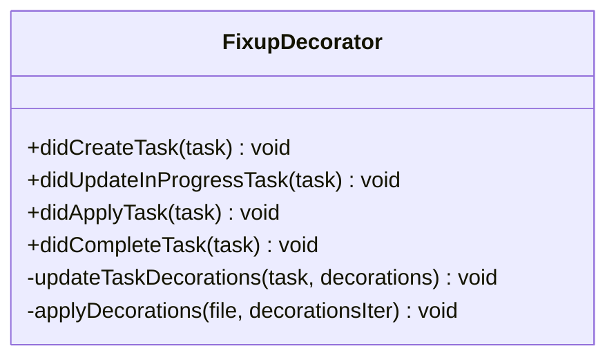
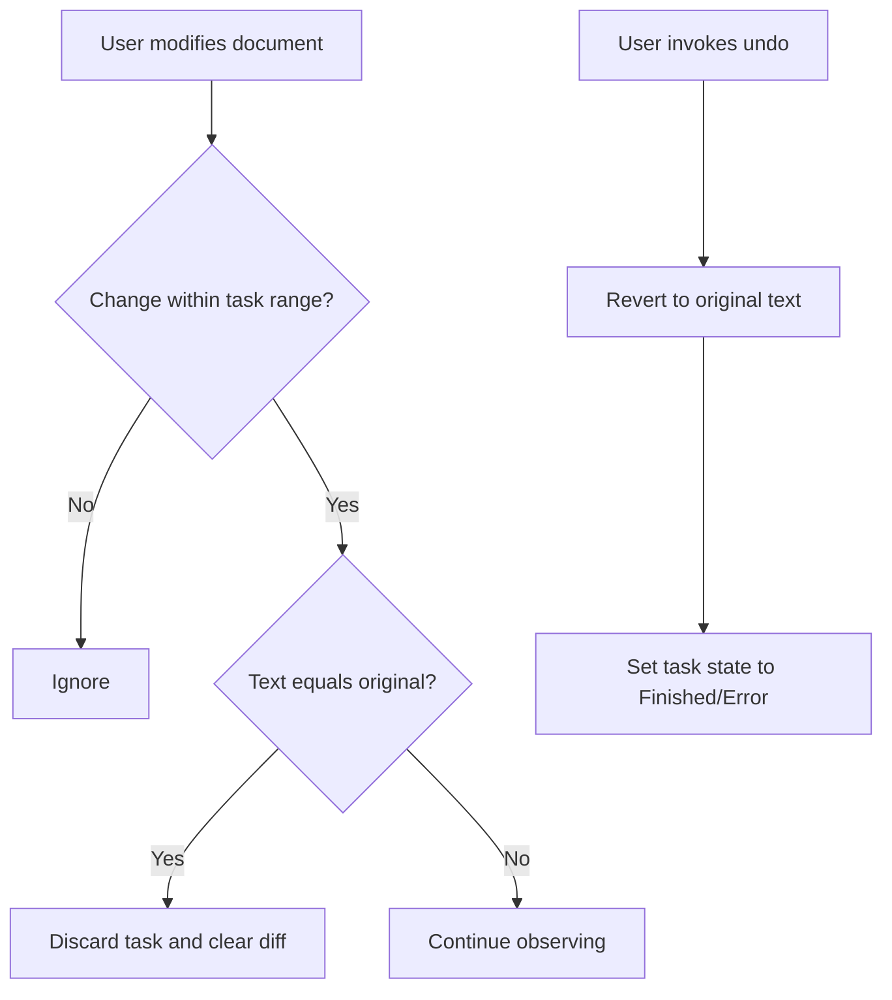
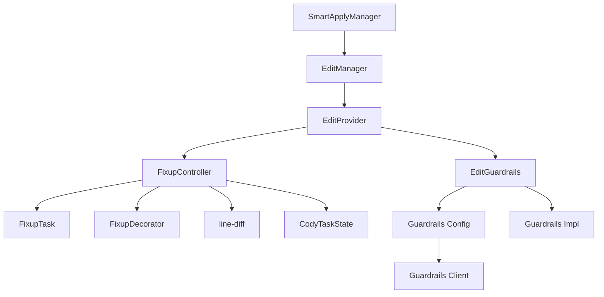

# Code Editing

<cite>
**Referenced Files in This Document**
- [FixupController.ts](file://vscode/src/non-stop/FixupController.ts)
- [FixupTask.ts](file://vscode/src/non-stop/FixupTask.ts)
- [FixupDecorator.ts](file://vscode/src/non-stop/decorations/FixupDecorator.ts)
- [line-diff.ts](file://vscode/src/non-stop/line-diff.ts)
- [state.ts](file://vscode/src/non-stop/state.ts)
- [FixupFile.ts](file://vscode/src/non-stop/FixupFile.ts)
- [roles.ts](file://vscode/src/non-stop/roles.ts)
- [execute.ts](file://vscode/src/edit/execute.ts)
- [edit-manager.ts](file://vscode/src/edit/edit-manager.ts)
- [provider.ts](file://vscode/src/edit/provider.ts)
- [smart-apply.ts](file://vscode/src/edit/smart-apply.ts)
- [smart-apply-manager.ts](file://vscode/src/edit/smart-apply-manager.ts)
- [edit-guardrails.ts](file://vscode/src/edit/edit-guardrails.ts)
- [GuardrailsApplicator.tsx](file://vscode/webviews/components/GuardrailsApplicator.tsx)
- [config.ts](file://lib/shared/src/guardrails/config.ts)
- [index.ts](file://lib/shared/src/guardrails/index.ts)
- [client.ts](file://lib/shared/src/guardrails/client.ts)
- [recent-edits-tracker.ts](file://vscode/src/completions/context/retrievers/recent-user-actions/recent-edits-tracker.ts)
- [CharactersLogger.ts](file://vscode/src/services/CharactersLogger.ts)
- [rejection-tracker.test.ts](file://vscode/src/non-stop/rejection-tracker.test.ts)
- [edit-history.ts](file://vscode/src/chat/chat-view/tools/edit-history.ts)
- [AgentWorkspaceEdit.ts](file://vscode/src/testutils/AgentWorkspaceEdit.ts)
</cite>

## Table of Contents
1. [Introduction](#introduction)
2. [Project Structure](#project-structure)
3. [Core Components](#core-components)
4. [Architecture Overview](#architecture-overview)
5. [Detailed Component Analysis](#detailed-component-analysis)
6. [Dependency Analysis](#dependency-analysis)
7. [Performance Considerations](#performance-considerations)
8. [Troubleshooting Guide](#troubleshooting-guide)
9. [Conclusion](#conclusion)
10. [Appendices](#appendices)

## Introduction
This document explains the Cody code editing system with a focus on automated refactoring, smart apply functionality, and the code transformation pipeline. It covers the fixup controller architecture, task lifecycle, decorator system for visual feedback, guardrails, and conflict resolution. It also documents the edit execution workflow, integration with VS Code’s editor APIs, change tracking, undo/redo, and the smart apply system that adapts suggestions to user preferences and coding styles.

## Project Structure
Cody’s code editing system spans several modules:
- Non-stop fixup orchestration: task creation, state transitions, diffs, and UI decorations
- Edit execution pipeline: prompt building, streaming, guardrails, and application
- Smart apply: intelligent selection and insertion of AI-generated code
- Guardrails: attribution checks and policy enforcement
- VS Code integration: editor APIs, change tracking, undo/redo, and persistence

**Diagram sources**
- [FixupController.ts:72-143](file://vscode/src/non-stop/FixupController.ts#L72-L143)
- [FixupTask.ts:35-99](file://vscode/src/non-stop/FixupTask.ts#L35-L99)
- [FixupDecorator.ts:17-104](file://vscode/src/non-stop/decorations/FixupDecorator.ts#L17-L104)
- [line-diff.ts:29-88](file://vscode/src/non-stop/line-diff.ts#L29-L88)
- [state.ts:1-50](file://vscode/src/non-stop/state.ts#L1-L50)
- [FixupFile.ts:7-29](file://vscode/src/non-stop/FixupFile.ts#L7-L29)
- [roles.ts:15-40](file://vscode/src/non-stop/roles.ts#L15-L40)
- [execute.ts:20-78](file://vscode/src/edit/execute.ts#L20-L78)
- [edit-manager.ts:137-257](file://vscode/src/edit/edit-manager.ts#L137-L257)
- [provider.ts:78-176](file://vscode/src/edit/provider.ts#L78-L176)
- [smart-apply-manager.ts:40-115](file://vscode/src/edit/smart-apply-manager.ts#L40-L115)
- [smart-apply.ts:6-34](file://vscode/src/edit/smart-apply.ts#L6-L34)
- [edit-guardrails.ts:28-142](file://vscode/src/edit/edit-guardrails.ts#L28-L142)
- [GuardrailsApplicator.tsx:157-227](file://vscode/webviews/components/GuardrailsApplicator.tsx#L157-L227)
- [config.ts:27-43](file://lib/shared/src/guardrails/config.ts#L27-L43)
- [index.ts:108-117](file://lib/shared/src/guardrails/index.ts#L108-L117)
- [client.ts:43-56](file://lib/shared/src/guardrails/client.ts#L43-L56)

**Section sources**
- [FixupController.ts:72-143](file://vscode/src/non-stop/FixupController.ts#L72-L143)
- [provider.ts:78-176](file://vscode/src/edit/provider.ts#L78-L176)
- [smart-apply-manager.ts:40-115](file://vscode/src/edit/smart-apply-manager.ts#L40-L115)
- [edit-guardrails.ts:28-142](file://vscode/src/edit/edit-guardrails.ts#L28-L142)

## Core Components
- FixupController: central orchestrator for task lifecycle, state transitions, applying edits, and UI feedback
- FixupTask: encapsulates instruction, selection range, mode, intent, model, and diff tracking
- FixupDecorator: computes and applies visual decorations for ongoing/applied tasks
- EditProvider: manages prompt construction, streaming, guardrails, and applying changes
- SmartApplyManager: selects where to apply AI suggestions and triggers edits
- EditGuardrails: enforces attribution policies and controls visibility of code before checks

Key responsibilities:
- Context-aware selection and diff computation
- Streaming and batch application of edits
- Conflict detection and resolution via decorations and change tracking
- Guardrails-driven safety gates
- Undo/redo integration and persistence

**Section sources**
- [FixupController.ts:53-143](file://vscode/src/non-stop/FixupController.ts#L53-L143)
- [FixupTask.ts:35-99](file://vscode/src/non-stop/FixupTask.ts#L35-L99)
- [FixupDecorator.ts:17-104](file://vscode/src/non-stop/decorations/FixupDecorator.ts#L17-L104)
- [provider.ts:78-176](file://vscode/src/edit/provider.ts#L78-L176)
- [smart-apply-manager.ts:40-115](file://vscode/src/edit/smart-apply-manager.ts#L40-L115)
- [edit-guardrails.ts:28-142](file://vscode/src/edit/edit-guardrails.ts#L28-L142)

## Architecture Overview
The system follows a pipeline:
1. User triggers an edit (directly or via smart apply)
2. EditManager validates context and creates a FixupTask
3. EditProvider builds prompts, streams responses, and applies via FixupController
4. FixupController computes diffs, updates decorations, and manages state
5. Guardrails ensures safe presentation of code
6. VS Code editor APIs integrate with change tracking, undo/redo, and persistence

**Diagram sources**
- [execute.ts:75-78](file://vscode/src/edit/execute.ts#L75-L78)
- [edit-manager.ts:137-257](file://vscode/src/edit/edit-manager.ts#L137-L257)
- [provider.ts:124-176](file://vscode/src/edit/provider.ts#L124-L176)
- [FixupController.ts:584-800](file://vscode/src/non-stop/FixupController.ts#L584-L800)
- [FixupDecorator.ts:24-42](file://vscode/src/non-stop/decorations/FixupDecorator.ts#L24-L42)
- [edit-guardrails.ts:36-142](file://vscode/src/edit/edit-guardrails.ts#L36-L142)

## Detailed Component Analysis

### Fixup Controller and Task Lifecycle
The FixupController manages task creation, state transitions, applying edits, and cleanup. It integrates with VS Code editor APIs for change observation, auto-accept on save, and undo/redo behavior.

**Diagram sources**
- [FixupController.ts:53-143](file://vscode/src/non-stop/FixupController.ts#L53-L143)
- [FixupTask.ts:35-99](file://vscode/src/non-stop/FixupTask.ts#L35-L99)
- [FixupDecorator.ts:17-104](file://vscode/src/non-stop/decorations/FixupDecorator.ts#L17-L104)
- [edit-guardrails.ts:28-142](file://vscode/src/edit/edit-guardrails.ts#L28-L142)

Key behaviors:
- State machine transitions: Idle → Working → Inserting/Applying → Applied → Finished/Error
- Diff computation and decoration updates
- Auto-accept on save when autoSave settings permit
- Undo reverts to original text and clears placeholders
- Retry opens the editor, re-prompts for instruction, and restarts the task

**Section sources**
- [FixupController.ts:577-800](file://vscode/src/non-stop/FixupController.ts#L577-L800)
- [state.ts:1-50](file://vscode/src/non-stop/state.ts#L1-L50)
- [line-diff.ts:29-88](file://vscode/src/non-stop/line-diff.ts#L29-L88)

### Edit Execution Pipeline
EditProvider constructs prompts, streams responses, transforms them, and delegates application to FixupController. It supports prefetching, test file creation, and guardrails checks.

**Diagram sources**
- [provider.ts:124-176](file://vscode/src/edit/provider.ts#L124-L176)
- [provider.ts:177-356](file://vscode/src/edit/provider.ts#L177-L356)
- [provider.ts:358-437](file://vscode/src/edit/provider.ts#L358-L437)
- [edit-guardrails.ts:36-142](file://vscode/src/edit/edit-guardrails.ts#L36-L142)
- [FixupController.ts:596-800](file://vscode/src/non-stop/FixupController.ts#L596-L800)

Implementation highlights:
- Prefetching shares sessions across start and prefetch
- Streaming uses a Typewriter and BotResponseMultiplexer to emit partial text
- Response transformation normalizes model outputs
- Guardrails gating prevents unsafe code from being shown

**Section sources**
- [provider.ts:78-176](file://vscode/src/edit/provider.ts#L78-L176)
- [provider.ts:177-356](file://vscode/src/edit/provider.ts#L177-L356)
- [provider.ts:358-437](file://vscode/src/edit/provider.ts#L358-L437)

### Smart Apply System
SmartApplyManager determines where to apply AI suggestions and triggers edits. It caches selections, supports prefetching, and logs context for telemetry.

**Diagram sources**
- [smart-apply-manager.ts:256-336](file://vscode/src/edit/smart-apply-manager.ts#L256-L336)
- [smart-apply-manager.ts:117-141](file://vscode/src/edit/smart-apply-manager.ts#L117-L141)
- [smart-apply.ts:22-34](file://vscode/src/edit/smart-apply.ts#L22-L34)
- [edit-manager.ts:137-257](file://vscode/src/edit/edit-manager.ts#L137-L257)
- [provider.ts:124-176](file://vscode/src/edit/provider.ts#L124-L176)

Smart apply specifics:
- Selection strategies for replace/insert/entire-file
- Prefetching to reduce latency
- Insertion edit handling for new files and bottom-of-file edge cases
- Telemetry logging for selection and apply timing

**Section sources**
- [smart-apply-manager.ts:40-115](file://vscode/src/edit/smart-apply-manager.ts#L40-L115)
- [smart-apply-manager.ts:117-141](file://vscode/src/edit/smart-apply-manager.ts#L117-L141)
- [smart-apply-manager.ts:256-336](file://vscode/src/edit/smart-apply-manager.ts#L256-L336)
- [smart-apply.ts:6-34](file://vscode/src/edit/smart-apply.ts#L6-L34)

### Guardrails and Safety Gates
Guardrails enforce attribution policies and control visibility of code before checks. The webview component renders guardrails status and tooltips.

**Diagram sources**
- [edit-guardrails.ts:36-142](file://vscode/src/edit/edit-guardrails.ts#L36-L142)
- [GuardrailsApplicator.tsx:157-227](file://vscode/webviews/components/GuardrailsApplicator.tsx#L157-L227)
- [config.ts:27-43](file://lib/shared/src/guardrails/config.ts#L27-L43)
- [index.ts:108-117](file://lib/shared/src/guardrails/index.ts#L108-L117)
- [client.ts:43-56](file://lib/shared/src/guardrails/client.ts#L43-L56)

**Section sources**
- [edit-guardrails.ts:28-142](file://vscode/src/edit/edit-guardrails.ts#L28-L142)
- [GuardrailsApplicator.tsx:157-227](file://vscode/webviews/components/GuardrailsApplicator.tsx#L157-L227)
- [config.ts:27-43](file://lib/shared/src/guardrails/config.ts#L27-L43)
- [index.ts:108-117](file://lib/shared/src/guardrails/index.ts#L108-L117)
- [client.ts:43-56](file://lib/shared/src/guardrails/client.ts#L43-L56)

### Decorators and Visual Feedback
FixupDecorator computes and applies decorations for current line, visited/unvisited lines, inserted/removal regions, and ongoing/applied states.

**Diagram sources**
- [FixupDecorator.ts:17-104](file://vscode/src/non-stop/decorations/FixupDecorator.ts#L17-L104)

**Section sources**
- [FixupDecorator.ts:17-104](file://vscode/src/non-stop/decorations/FixupDecorator.ts#L17-L104)

### Conflict Resolution and Undo/Redo
Conflict resolution leverages decorations and change tracking. The system detects when users restore applied edits to original text and discards tasks accordingly. Undo reverts to original text and records telemetry.

**Diagram sources**
- [FixupController.ts:324-357](file://vscode/src/non-stop/FixupController.ts#L324-L357)
- [FixupController.ts:266-317](file://vscode/src/non-stop/FixupController.ts#L266-L317)

**Section sources**
- [FixupController.ts:324-357](file://vscode/src/non-stop/FixupController.ts#L324-L357)
- [FixupController.ts:266-317](file://vscode/src/non-stop/FixupController.ts#L266-L317)

### Integration with VS Code Editor APIs
- Workspace and editor events: document changes, saves, visible editors
- TextEditor.edit and WorkspaceEdit for applying changes
- Code lens and decorations for user actions
- Persistence tracker for telemetry and user acceptance/rejection

**Section sources**
- [FixupController.ts:89-143](file://vscode/src/non-stop/FixupController.ts#L89-L143)
- [CharactersLogger.ts:251-280](file://vscode/src/services/CharactersLogger.ts#L251-L280)
- [recent-edits-tracker.ts:59-95](file://vscode/src/completions/context/retrievers/recent-user-actions/recent-edits-tracker.ts#L59-L95)
- [AgentWorkspaceEdit.ts:116-157](file://vscode/src/testutils/AgentWorkspaceEdit.ts#L116-L157)

## Dependency Analysis
- FixupController depends on FixupTask, FixupDecorator, line-diff, and roles
- EditProvider depends on prompt builders, model parameter providers, and guardrails
- SmartApplyManager depends on EditManager and selection logic
- Guardrails integrates with client configuration and webview applicator

**Diagram sources**
- [FixupController.ts:72-143](file://vscode/src/non-stop/FixupController.ts#L72-L143)
- [provider.ts:78-176](file://vscode/src/edit/provider.ts#L78-L176)
- [edit-manager.ts:137-257](file://vscode/src/edit/edit-manager.ts#L137-L257)
- [smart-apply-manager.ts:40-115](file://vscode/src/edit/smart-apply-manager.ts#L40-L115)
- [edit-guardrails.ts:28-142](file://vscode/src/edit/edit-guardrails.ts#L28-L142)
- [config.ts:27-43](file://lib/shared/src/guardrails/config.ts#L27-L43)
- [index.ts:108-117](file://lib/shared/src/guardrails/index.ts#L108-L117)
- [client.ts:43-56](file://lib/shared/src/guardrails/client.ts#L43-L56)

**Section sources**
- [FixupController.ts:72-143](file://vscode/src/non-stop/FixupController.ts#L72-L143)
- [provider.ts:78-176](file://vscode/src/edit/provider.ts#L78-L176)
- [edit-manager.ts:137-257](file://vscode/src/edit/edit-manager.ts#L137-L257)
- [smart-apply-manager.ts:40-115](file://vscode/src/edit/smart-apply-manager.ts#L40-L115)
- [edit-guardrails.ts:28-142](file://vscode/src/edit/edit-guardrails.ts#L28-L142)

## Performance Considerations
- Prefetching: SmartApplyManager and EditProvider cache and reuse streaming sessions to reduce latency
- Streaming: Typewriter and multiplexer emit partial text efficiently
- Diff computation: Optimized line diffing with decoration support for deletions
- Auto-accept on save: Avoids flicker by deferring acceptance until after formatting

[No sources needed since this section provides general guidance]

## Troubleshooting Guide
Common issues and remedies:
- Guardrails blocking edits: Review attribution mode and retry if needed
- Undo/redo confusion: Ensure undo reverts to original text; if not, inspect change tracking and task state
- Conflict resolution: If user restores original text, task is discarded automatically
- Prefetch failures: Sessions are cleared on error; subsequent attempts will retry

**Section sources**
- [edit-guardrails.ts:108-142](file://vscode/src/edit/edit-guardrails.ts#L108-L142)
- [FixupController.ts:324-357](file://vscode/src/non-stop/FixupController.ts#L324-L357)
- [rejection-tracker.test.ts:148-185](file://vscode/src/non-stop/rejection-tracker.test.ts#L148-L185)

## Conclusion
Cody’s code editing system combines robust orchestration, intelligent selection, streaming application, and strong safety controls. The fixup controller coordinates tasks and UI feedback, EditProvider manages the AI pipeline, SmartApplyManager adapts suggestions to user intent, and Guardrails ensures responsible code generation. Integration with VS Code’s editor APIs enables seamless change tracking, undo/redo, and persistence.

[No sources needed since this section summarizes without analyzing specific files]

## Appendices

### Practical Scenarios
- Fixing code issues: Use edit intent “fix” with a precise selection range; guardrails gate presentation
- Generating documentation: Use intent “doc”; selection expands to aid context-aware suggestions
- Creating unit tests: Use intent “test”; provider listens for filename suggestions and creates test files
- Refactoring code: Use “edit” intent with smart apply to target specific regions; accept/reject per-block

[No sources needed since this section provides general guidance]