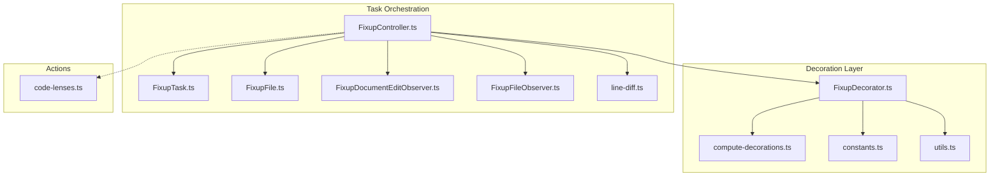
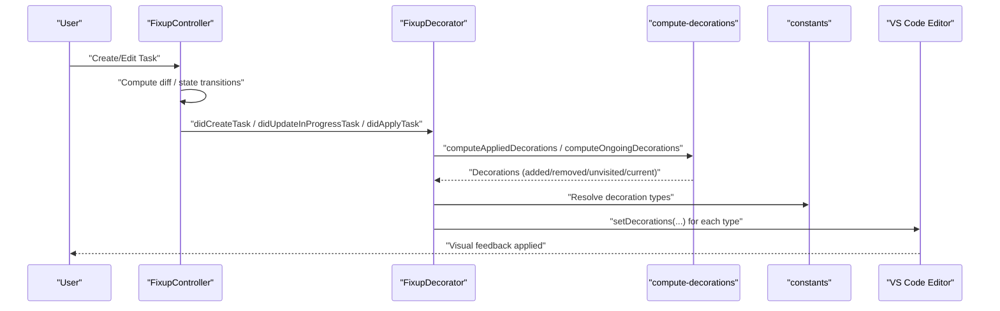
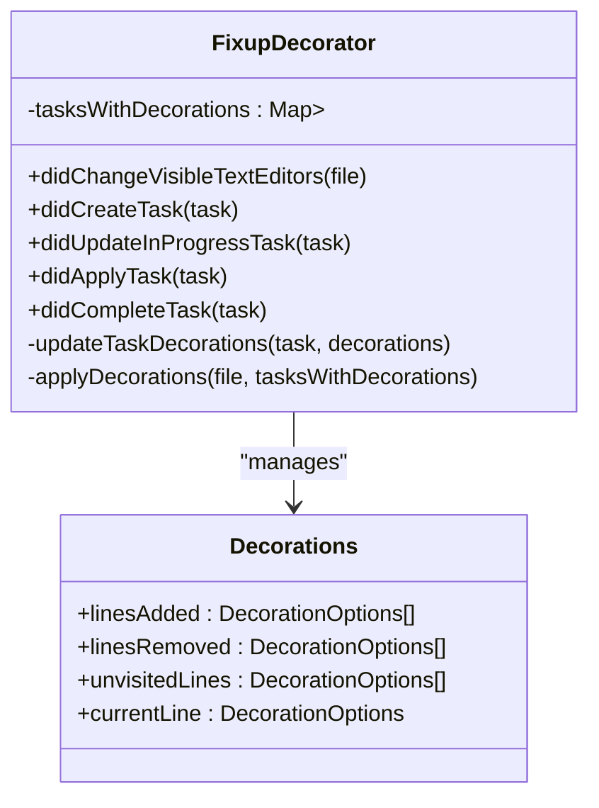
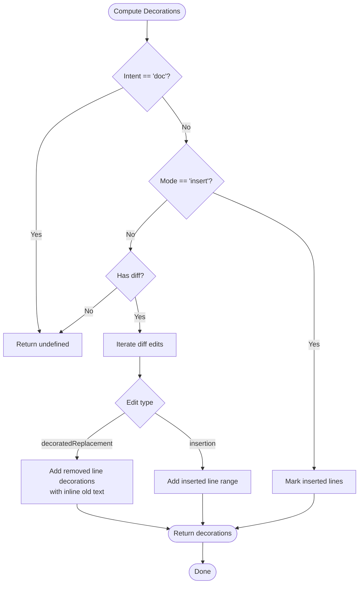
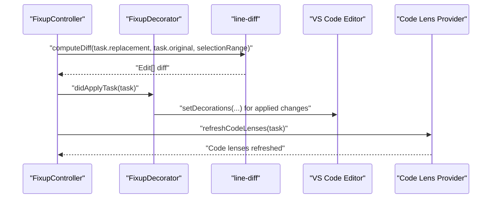
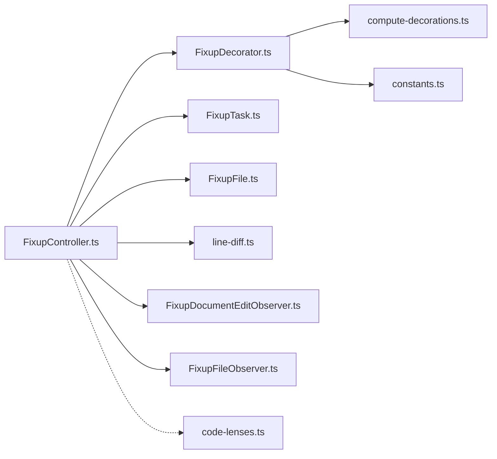

# Decorations & Visual Feedback

<cite>
**Referenced Files in This Document**
- [FixupDecorator.ts](file://vscode/src/non-stop/decorations/FixupDecorator.ts)
- [compute-decorations.ts](file://vscode/src/non-stop/decorations/compute-decorations.ts)
- [constants.ts](file://vscode/src/non-stop/decorations/constants.ts)
- [utils.ts](file://vscode/src/non-stop/decorations/utils.ts)
- [FixupController.ts](file://vscode/src/non-stop/FixupController.ts)
- [FixupTask.ts](file://vscode/src/non-stop/FixupTask.ts)
- [FixupFile.ts](file://vscode/src/non-stop/FixupFile.ts)
- [FixupDocumentEditObserver.ts](file://vscode/src/non-stop/FixupDocumentEditObserver.ts)
- [FixupFileObserver.ts](file://vscode/src/non-stop/FixupFileObserver.ts)
- [line-diff.ts](file://vscode/src/non-stop/line-diff.ts)
- [code-lenses.ts](file://vscode/src/commands/services/code-lenses.ts)
</cite>

## Table of Contents
1. [Introduction](#introduction)
2. [Project Structure](#project-structure)
3. [Core Components](#core-components)
4. [Architecture Overview](#architecture-overview)
5. [Detailed Component Analysis](#detailed-component-analysis)
6. [Dependency Analysis](#dependency-analysis)
7. [Performance Considerations](#performance-considerations)
8. [Troubleshooting Guide](#troubleshooting-guide)
9. [Conclusion](#conclusion)

## Introduction
This document explains the visual feedback system for code changes and editing status in the non-stop editing experience. It focuses on how FixupDecorator renders visual cues in the editor, the decoration types used for applied changes, pending edits, and conflict markers, and how code lenses provide quick actions to accept, reject, or modify changes. It also covers the real-time update system that keeps decorations synchronized with editor state, the color coding system, accessibility considerations, and performance optimizations.

## Project Structure
The visual feedback system spans several modules:
- Decoration computation and rendering: FixupDecorator and supporting modules
- Task lifecycle orchestration: FixupController
- Task and file abstractions: FixupTask and FixupFile
- Diff computation and editing observers: line-diff and observers
- Quick actions via code lenses: code-lenses service

**Diagram sources**
- [FixupDecorator.ts](file://vscode/src/non-stop/decorations/FixupDecorator.ts)
- [compute-decorations.ts](file://vscode/src/non-stop/decorations/compute-decorations.ts)
- [constants.ts](file://vscode/src/non-stop/decorations/constants.ts)
- [utils.ts](file://vscode/src/non-stop/decorations/utils.ts)
- [FixupController.ts](file://vscode/src/non-stop/FixupController.ts)
- [FixupTask.ts](file://vscode/src/non-stop/FixupTask.ts)
- [FixupFile.ts](file://vscode/src/non-stop/FixupFile.ts)
- [FixupDocumentEditObserver.ts](file://vscode/src/non-stop/FixupDocumentEditObserver.ts)
- [FixupFileObserver.ts](file://vscode/src/non-stop/FixupFileObserver.ts)
- [line-diff.ts](file://vscode/src/non-stop/line-diff.ts)
- [code-lenses.ts](file://vscode/src/commands/services/code-lenses.ts)

**Section sources**
- [FixupDecorator.ts](file://vscode/src/non-stop/decorations/FixupDecorator.ts)
- [FixupController.ts](file://vscode/src/non-stop/FixupController.ts)

## Core Components
- FixupDecorator: Central renderer that computes and applies decorations per task and file, updating the editor in real time.
- compute-decorations: Produces decoration options for applied changes and ongoing edits.
- constants: Defines decoration types for current line, unvisited lines, inserted code, and removed code.
- utils: Provides helpers to normalize text for decoration rendering.
- FixupController: Drives task lifecycle and triggers decoration updates and code lens refreshes.
- FixupTask and FixupFile: Represent the task and target file for decoration computation.
- line-diff: Computes diffs used to drive applied decorations.
- code-lenses: Supplies quick actions for accepting/rejecting changes and navigating tasks.

**Section sources**
- [FixupDecorator.ts](file://vscode/src/non-stop/decorations/FixupDecorator.ts)
- [compute-decorations.ts](file://vscode/src/non-stop/decorations/compute-decorations.ts)
- [constants.ts](file://vscode/src/non-stop/decorations/constants.ts)
- [utils.ts](file://vscode/src/non-stop/decorations/utils.ts)
- [FixupController.ts](file://vscode/src/non-stop/FixupController.ts)
- [FixupTask.ts](file://vscode/src/non-stop/FixupTask.ts)
- [FixupFile.ts](file://vscode/src/non-stop/FixupFile.ts)
- [line-diff.ts](file://vscode/src/non-stop/line-diff.ts)
- [code-lenses.ts](file://vscode/src/commands/services/code-lenses.ts)

## Architecture Overview
The system follows a reactive pattern:
- FixupController observes editor and document changes, manages task states, and requests decoration updates.
- FixupDecorator computes decorations for each task and applies them to visible editors for the target file.
- compute-decorations builds decoration options from task diff and selection ranges.
- constants defines theme-aware decoration types.
- utils ensures rendered text respects indentation and spacing.
- code-lenses provide user-triggered actions to accept/reject parts of a task and refresh the UI.

**Diagram sources**
- [FixupController.ts](file://vscode/src/non-stop/FixupController.ts)
- [FixupDecorator.ts](file://vscode/src/non-stop/decorations/FixupDecorator.ts)
- [compute-decorations.ts](file://vscode/src/non-stop/decorations/compute-decorations.ts)
- [constants.ts](file://vscode/src/non-stop/decorations/constants.ts)

## Detailed Component Analysis

### FixupDecorator: Rendering Visual Cues
FixupDecorator maintains a map of file → task → computed decorations and applies them to visible editors. It reacts to task lifecycle events and merges overlapping decorations from multiple tasks.

Key behaviors:
- Tracks decorations per file and task.
- Applies four decoration types: current line, unvisited lines, inserted code, removed code.
- Merges decorations across tasks and filters editors by URI.
- Handles empty decorations by removing stale decorations.

**Diagram sources**
- [FixupDecorator.ts](file://vscode/src/non-stop/decorations/FixupDecorator.ts)
- [compute-decorations.ts](file://vscode/src/non-stop/decorations/compute-decorations.ts)

**Section sources**
- [FixupDecorator.ts](file://vscode/src/non-stop/decorations/FixupDecorator.ts)

### compute-decorations: Decoration Types and Logic
compute-decorations produces decoration options for:
- Applied changes: highlights inserted and removed lines, and shows deleted text inline for review.
- Ongoing edits: highlights the current line and remaining unvisited lines to guide user attention.

Important logic:
- Insert mode: marks inserted lines without diff calculation.
- Doc intent: disables decorations to avoid mismatch between selection and output.
- Streamed edits: suppress ongoing decorations; only applied decorations are used.
- Trimmed ranges: trims empty lines for accurate diffing while keeping whole-line decorations.
- Inline rendering: uses utils to normalize whitespace for proper rendering.

**Diagram sources**
- [compute-decorations.ts](file://vscode/src/non-stop/decorations/compute-decorations.ts)
- [utils.ts](file://vscode/src/non-stop/decorations/utils.ts)

**Section sources**
- [compute-decorations.ts](file://vscode/src/non-stop/decorations/compute-decorations.ts)
- [utils.ts](file://vscode/src/non-stop/decorations/utils.ts)

### constants: Color Coding and Theme Integration
Decoration types are defined with theme-aware colors and whole-line semantics:
- Current line: word highlight background/border for emphasis.
- Unvisited lines: unchanged code background to indicate future changes.
- Inserted code: inserted line background.
- Removed code: removed line background.

Range behavior is closed-closed to prevent expansion when edits occur.

**Section sources**
- [constants.ts](file://vscode/src/non-stop/decorations/constants.ts)

### utils: Text Normalization for Decoration Rendering
Ensures decorations render correctly:
- Converts tabs to Unicode spaces for consistent indentation.
- Replaces normal spaces with Unicode spaces to prevent trimming.
- Extracts the last full line from streaming replacement text to guide current-line highlighting.

**Section sources**
- [utils.ts](file://vscode/src/non-stop/decorations/utils.ts)

### FixupController: Real-Time Updates and Actions
FixupController orchestrates decoration updates and user actions:
- Triggers decoration updates on task lifecycle events.
- Computes diffs against the latest document text.
- Accepts/rejects individual change blocks and refreshes code lenses.
- Observes editor visibility and document changes to keep decorations in sync.

**Diagram sources**
- [FixupController.ts](file://vscode/src/non-stop/FixupController.ts)
- [FixupDecorator.ts](file://vscode/src/non-stop/decorations/FixupDecorator.ts)
- [line-diff.ts](file://vscode/src/non-stop/line-diff.ts)
- [code-lenses.ts](file://vscode/src/commands/services/code-lenses.ts)

**Section sources**
- [FixupController.ts](file://vscode/src/non-stop/FixupController.ts)
- [line-diff.ts](file://vscode/src/non-stop/line-diff.ts)
- [code-lenses.ts](file://vscode/src/commands/services/code-lenses.ts)

### Code Lens Integration: Quick Actions
Code lenses provide immediate actions for tasks:
- Accept/Reject/Modify actions are surfaced via code lenses.
- Clicking a lens triggers controller actions and refreshes code lenses.
- Provider registers dynamically based on configuration and editor focus.

Note: The code lens service referenced here is distinct from the fixup code lens actions handled by FixupController. The latter are integrated directly into the fixup experience and are managed by the controller’s code lens refresh mechanism.

**Section sources**
- [code-lenses.ts](file://vscode/src/commands/services/code-lenses.ts)
- [FixupController.ts](file://vscode/src/non-stop/FixupController.ts)

## Dependency Analysis
- FixupDecorator depends on compute-decorations and constants for decoration computation and type definitions.
- FixupController depends on FixupDecorator, FixupTask, FixupFile, and line-diff to manage state and compute diffs.
- FixupController also depends on FixupDocumentEditObserver and FixupFileObserver to track editor and file changes.
- Code lens actions are coordinated through FixupController’s refresh mechanism.

**Diagram sources**
- [FixupController.ts](file://vscode/src/non-stop/FixupController.ts)
- [FixupDecorator.ts](file://vscode/src/non-stop/decorations/FixupDecorator.ts)
- [compute-decorations.ts](file://vscode/src/non-stop/decorations/compute-decorations.ts)
- [constants.ts](file://vscode/src/non-stop/decorations/constants.ts)
- [FixupTask.ts](file://vscode/src/non-stop/FixupTask.ts)
- [FixupFile.ts](file://vscode/src/non-stop/FixupFile.ts)
- [FixupDocumentEditObserver.ts](file://vscode/src/non-stop/FixupDocumentEditObserver.ts)
- [FixupFileObserver.ts](file://vscode/src/non-stop/FixupFileObserver.ts)
- [line-diff.ts](file://vscode/src/non-stop/line-diff.ts)
- [code-lenses.ts](file://vscode/src/commands/services/code-lenses.ts)

**Section sources**
- [FixupController.ts](file://vscode/src/non-stop/FixupController.ts)
- [FixupDecorator.ts](file://vscode/src/non-stop/decorations/FixupDecorator.ts)
- [compute-decorations.ts](file://vscode/src/non-stop/decorations/compute-decorations.ts)
- [constants.ts](file://vscode/src/non-stop/decorations/constants.ts)
- [FixupTask.ts](file://vscode/src/non-stop/FixupTask.ts)
- [FixupFile.ts](file://vscode/src/non-stop/FixupFile.ts)
- [FixupDocumentEditObserver.ts](file://vscode/src/non-stop/FixupDocumentEditObserver.ts)
- [FixupFileObserver.ts](file://vscode/src/non-stop/FixupFileObserver.ts)
- [line-diff.ts](file://vscode/src/non-stop/line-diff.ts)
- [code-lenses.ts](file://vscode/src/commands/services/code-lenses.ts)

## Performance Considerations
- Minimize decoration updates: FixupDecorator only applies when tasks change or editors become visible.
- Merge decorations across tasks: Accumulates decorations per file to reduce repeated setDecorations calls.
- Avoid unnecessary recomputation: compute-decorations short-circuits for doc intent and streamed edits.
- Range behavior: Closed-closed range behavior prevents decorations from expanding, reducing layout thrash.
- Lazy normalization: utils normalizes text only when needed for decoration rendering.
- Batched refresh: FixupController refreshes code lenses after state changes to avoid redundant renders.

[No sources needed since this section provides general guidance]

## Troubleshooting Guide
Common issues and remedies:
- No decorations appear
  - Verify the file is visible and the task is in a state that supports decorations (not doc intent, not streamed).
  - Confirm decoration types are registered and applied to visible editors for the target file.
- Incorrect current line highlighting
  - Ensure the latest full line is present in the replacement text; utils extracts the last full line to locate matches.
  - Check that unvisited lines are computed from the current selection range.
- Deleted text not visible
  - For decorated replacements, inline old text is rendered; hover messages are provided for copyability.
- Conflicting changes
  - When accepting/rejecting individual blocks, ensure the editor selection is within the affected range.
  - After applying changes, refresh code lenses to update action availability.

**Section sources**
- [FixupDecorator.ts](file://vscode/src/non-stop/decorations/FixupDecorator.ts)
- [compute-decorations.ts](file://vscode/src/non-stop/decorations/compute-decorations.ts)
- [utils.ts](file://vscode/src/non-stop/decorations/utils.ts)
- [FixupController.ts](file://vscode/src/non-stop/FixupController.ts)

## Conclusion
The visual feedback system combines precise decoration computation with theme-aware rendering and real-time synchronization to provide clear, actionable cues during editing. FixupDecorator consolidates logic for applied and ongoing edits, while FixupController coordinates lifecycle events, diff computation, and user actions. Together with code lens integration and careful performance optimizations, the system delivers responsive and accessible visual feedback.