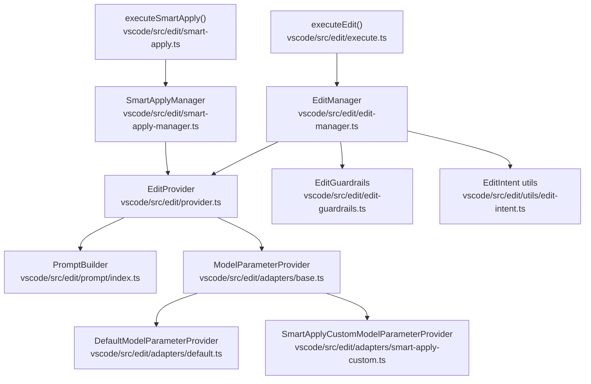
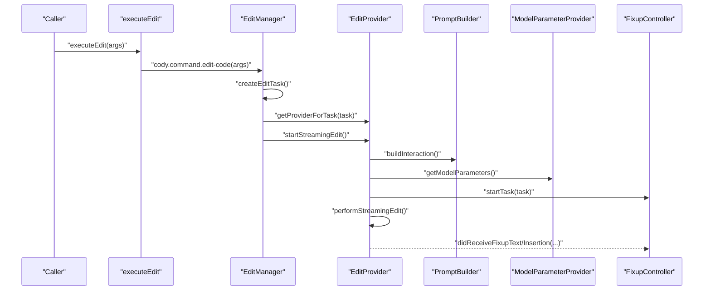
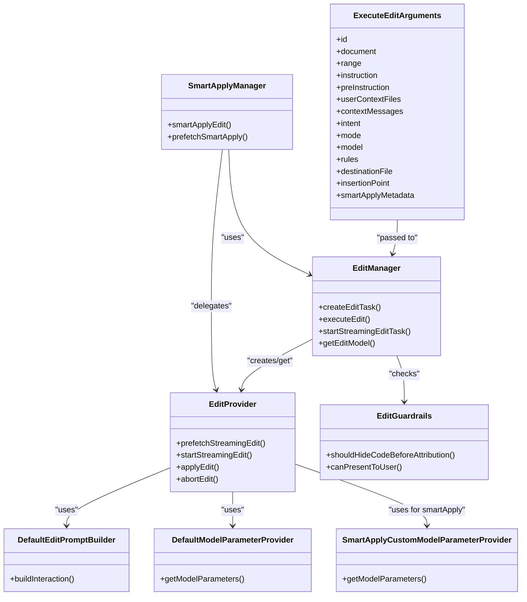

# Edit Execution

<cite>
**Referenced Files in This Document**
- [execute.ts](file://vscode/src/edit/execute.ts)
- [provider.ts](file://vscode/src/edit/provider.ts)
- [types.ts](file://vscode/src/edit/types.ts)
- [edit-manager.ts](file://vscode/src/edit/edit-manager.ts)
- [prompt/index.ts](file://vscode/src/edit/prompt/index.ts)
- [adapters/base.ts](file://vscode/src/edit/adapters/base.ts)
- [adapters/default.ts](file://vscode/src/edit/adapters/default.ts)
- [adapters/smart-apply-custom.ts](file://vscode/src/edit/adapters/smart-apply-custom.ts)
- [smart-apply.ts](file://vscode/src/edit/smart-apply.ts)
- [smart-apply-manager.ts](file://vscode/src/edit/smart-apply-manager.ts)
- [edit-guardrails.ts](file://vscode/src/edit/edit-guardrails.ts)
- [utils/edit-intent.ts](file://vscode/src/edit/utils/edit-intent.ts)
</cite>

## Table of Contents
1. [Introduction](#introduction)
2. [Project Structure](#project-structure)
3. [Core Components](#core-components)
4. [Architecture Overview](#architecture-overview)
5. [Detailed Component Analysis](#detailed-component-analysis)
6. [Dependency Analysis](#dependency-analysis)
7. [Performance Considerations](#performance-considerations)
8. [Troubleshooting Guide](#troubleshooting-guide)
9. [Conclusion](#conclusion)

## Introduction
This document explains the edit execution system that powers AI-assisted editing in the editor. It covers how AI-generated code changes are processed, validated, and applied, including the executeEdit function, edit provider architecture, edit intents, smart apply functionality, guardrails integration, conflict detection, error handling, retries, and fallback strategies. It also provides practical examples for common edit scenarios such as fixing errors, generating documentation, creating unit tests, and refactoring code.

## Project Structure
The edit execution system is organized around a small set of focused modules:
- Entry points and orchestration: executeEdit, EditManager
- Streaming and application: EditProvider
- Prompt building and model integration: DefaultEditPromptBuilder and adapters
- Intent and mode resolution: utils/edit-intent
- Guardrails and safety: EditGuardrails
- Smart apply: executeSmartApply and SmartApplyManager

**Diagram sources**
- [execute.ts:75-77](file://vscode/src/edit/execute.ts#L75-L77)
- [edit-manager.ts:58-86](file://vscode/src/edit/edit-manager.ts#L58-L86)
- [provider.ts:78-98](file://vscode/src/edit/provider.ts#L78-L98)
- [prompt/index.ts:55-132](file://vscode/src/edit/prompt/index.ts#L55-L132)
- [adapters/base.ts:11-13](file://vscode/src/edit/adapters/base.ts#L11-L13)
- [adapters/default.ts:4-26](file://vscode/src/edit/adapters/default.ts#L4-L26)
- [adapters/smart-apply-custom.ts:5-28](file://vscode/src/edit/adapters/smart-apply-custom.ts#L5-L28)
- [edit-guardrails.ts:28-141](file://vscode/src/edit/edit-guardrails.ts#L28-L141)
- [utils/edit-intent.ts:17-41](file://vscode/src/edit/utils/edit-intent.ts#L17-L41)
- [smart-apply.ts:22-33](file://vscode/src/edit/smart-apply.ts#L22-L33)
- [smart-apply-manager.ts:40-115](file://vscode/src/edit/smart-apply-manager.ts#L40-L115)

**Section sources**
- [execute.ts:1-78](file://vscode/src/edit/execute.ts#L1-L78)
- [edit-manager.ts:45-87](file://vscode/src/edit/edit-manager.ts#L45-L87)
- [provider.ts:78-98](file://vscode/src/edit/provider.ts#L78-L98)
- [prompt/index.ts:55-132](file://vscode/src/edit/prompt/index.ts#L55-L132)
- [adapters/base.ts:11-13](file://vscode/src/edit/adapters/base.ts#L11-L13)
- [adapters/default.ts:4-26](file://vscode/src/edit/adapters/default.ts#L4-L26)
- [adapters/smart-apply-custom.ts:5-28](file://vscode/src/edit/adapters/smart-apply-custom.ts#L5-L28)
- [edit-guardrails.ts:28-141](file://vscode/src/edit/edit-guardrails.ts#L28-L141)
- [utils/edit-intent.ts:17-41](file://vscode/src/edit/utils/edit-intent.ts#L17-L41)
- [smart-apply.ts:22-33](file://vscode/src/edit/smart-apply.ts#L22-L33)
- [smart-apply-manager.ts:40-115](file://vscode/src/edit/smart-apply-manager.ts#L40-L115)

## Core Components
- executeEdit: A typed wrapper that invokes the cody.command.edit-code command with ExecuteEditArguments. It returns a FixupTask or undefined.
- EditManager: Orchestrates task creation, intent/mode resolution, selection expansion, guardrails checks, and starts streaming.
- EditProvider: Manages streaming lifecycle, prompt construction, model parameterization, response handling, guardrails, and application via FixupController.
- PromptBuilder and adapters: Build LLM prompts per intent and provider, and supply model parameters.
- EditGuardrails: Enforces attribution guardrails and decides whether to hide code before attribution checks.
- SmartApplyManager and executeSmartApply: Provide “smart apply” functionality to adapt AI suggestions to user preferences and selections.

**Section sources**
- [execute.ts:20-70](file://vscode/src/edit/execute.ts#L20-L70)
- [edit-manager.ts:45-87](file://vscode/src/edit/edit-manager.ts#L45-L87)
- [provider.ts:78-98](file://vscode/src/edit/provider.ts#L78-L98)
- [prompt/index.ts:55-132](file://vscode/src/edit/prompt/index.ts#L55-L132)
- [adapters/default.ts:4-26](file://vscode/src/edit/adapters/default.ts#L4-L26)
- [adapters/smart-apply-custom.ts:5-28](file://vscode/src/edit/adapters/smart-apply-custom.ts#L5-L28)
- [edit-guardrails.ts:28-141](file://vscode/src/edit/edit-guardrails.ts#L28-L141)
- [smart-apply.ts:6-33](file://vscode/src/edit/smart-apply.ts#L6-L33)
- [smart-apply-manager.ts:40-115](file://vscode/src/edit/smart-apply-manager.ts#L40-L115)

## Architecture Overview
The system follows a layered pattern:
- UI triggers executeEdit with configuration.
- EditManager resolves intent/mode, expands selection, creates a FixupTask, and starts streaming.
- EditProvider builds prompts and model parameters, streams tokens, applies guardrails, and delegates application to FixupController.
- SmartApplyManager optionally prefetches and adapts suggestions to precise selections.

**Diagram sources**
- [execute.ts:75-77](file://vscode/src/edit/execute.ts#L75-L77)
- [edit-manager.ts:225-249](file://vscode/src/edit/edit-manager.ts#L225-L249)
- [provider.ts:124-158](file://vscode/src/edit/provider.ts#L124-L158)
- [prompt/index.ts:55-132](file://vscode/src/edit/prompt/index.ts#L55-L132)
- [adapters/base.ts:11-13](file://vscode/src/edit/adapters/base.ts#L11-L13)

## Detailed Component Analysis

### executeEdit and ExecuteEditArguments
- Purpose: Provide a strongly typed entry point to trigger edits from anywhere in the app.
- Key configuration options:
  - id: Optional FixupTask identifier for correlation.
  - document/range: Target document and selection range; defaults to active editor selection.
  - instruction/preInstruction: Pre-set instruction or a prefix to guide instruction input.
  - userContextFiles/contextMessages: Additional context items/messages.
  - intent/mode: Edit intent and mode; resolved by EditManager.
  - model: LLM model; falls back to default if omitted.
  - rules: Optional rule set for the edit.
  - destinationFile/insertionPoint: For insertions or test file creation.
  - smartApplyMetadata: Metadata specific to smart apply tasks.
  - source/telemetryMetadata: Event source and telemetry payload.

Behavior:
- Invokes the cody.command.edit-code command with the provided arguments and returns a FixupTask or undefined.

**Section sources**
- [execute.ts:20-70](file://vscode/src/edit/execute.ts#L20-L70)
- [execute.ts:75-77](file://vscode/src/edit/execute.ts#L75-L77)

### EditManager: Task creation, intent/mode resolution, and streaming
Responsibilities:
- Validates client configuration and active document.
- Resolves intent and mode, expands selection for non-add intents, and checks guardrails for streaming visibility.
- Creates FixupTask via FixupController or prompts the user for missing instruction.
- Starts streaming edit and logs telemetry.

Key flows:
- getEditModel: Selects a model from configuration or default service.
- createEditTask: Builds task with intent, mode, range, and streaming capability.
- executeEdit: Orchestrates task creation and starts streaming.
- startStreamingEditTask: Logs events, starts decorators, and delegates to EditProvider.

Guardrails integration:
- Uses EditGuardrails to decide whether to hide code during streaming based on attribution mode.

Intent and mode:
- getEditIntent: Infers intent from selection and overrides if provided.
- getEditMode: Chooses mode based on intent.
- isStreamedIntent: Determines if an intent supports streaming.

**Section sources**
- [edit-manager.ts:100-109](file://vscode/src/edit/edit-manager.ts#L100-L109)
- [edit-manager.ts:137-223](file://vscode/src/edit/edit-manager.ts#L137-L223)
- [edit-manager.ts:225-249](file://vscode/src/edit/edit-manager.ts#L225-L249)
- [edit-manager.ts:292-324](file://vscode/src/edit/edit-manager.ts#L292-L324)
- [utils/edit-intent.ts:17-41](file://vscode/src/edit/utils/edit-intent.ts#L17-L41)

### EditProvider: Streaming, prompt building, model parameters, guardrails, and application
Responsibilities:
- Prefetch and start streaming edits with shared sessions.
- Build prompts per intent and provider, and compute model parameters.
- Stream tokens, accumulate partial text, and apply guardrails.
- Delegate application to FixupController for text or insertion.

Streaming lifecycle:
- prefetchStreamingEdit: Starts background stream if none exists.
- startStreamingEdit: Reuses cached stream or starts fresh; applies partial text immediately if available.
- performStreamingEdit: Builds messages, sets up Typewriter and BotResponseMultiplexer, streams tokens, and publishes completion.

Guardrails:
- checkGuardrails: Ensures proposed edits can be presented to the user based on attribution checks; cancels or errors the task on failure.

Application:
- handleResponse: Routes to streaming or final application, applies response transformations, records telemetry, and triggers FixupController callbacks.

Test file handling:
- Special handling for test intent to suggest or create test files when destination is not provided.

**Section sources**
- [provider.ts:78-98](file://vscode/src/edit/provider.ts#L78-L98)
- [provider.ts:104-158](file://vscode/src/edit/provider.ts#L104-L158)
- [provider.ts:177-356](file://vscode/src/edit/provider.ts#L177-L356)
- [provider.ts:358-437](file://vscode/src/edit/provider.ts#L358-L437)
- [provider.ts:479-535](file://vscode/src/edit/provider.ts#L479-L535)

### PromptBuilder and Model Parameter Providers
- DefaultEditPromptBuilder:
  - Constructs context windows around the selection, validates token limits against the model’s context window, and builds a prompt with preamble and user context.
  - Selects provider-specific interaction based on model provider and intent.

- ModelParameterProvider implementations:
  - DefaultModelParameterProvider: Sets model, stop sequences, output tokens, and disables streaming for specific models.
  - SmartApplyCustomModelParameterProvider: Adds temperature, prediction, rewrite speculation, and adaptive speculation for smart apply.

**Section sources**
- [prompt/index.ts:55-132](file://vscode/src/edit/prompt/index.ts#L55-L132)
- [adapters/base.ts:11-13](file://vscode/src/edit/adapters/base.ts#L11-L13)
- [adapters/default.ts:4-26](file://vscode/src/edit/adapters/default.ts#L4-L26)
- [adapters/smart-apply-custom.ts:5-28](file://vscode/src/edit/adapters/smart-apply-custom.ts#L5-L28)

### Edit Intent System (fix, explain, test, doc, edit, add, smartApply)
- EditIntent types: add, edit, fix, doc, test, smartApply.
- Intent inference:
  - isGenerateIntent: Empty selection on an empty line implies add intent.
  - getEditIntent: Overrides intent only for add; otherwise infers based on selection.
  - isStreamedIntent: add and test are streamed directly; others are not.

Impact on pipeline:
- Determines prompt builder selection, streaming capability, and UI behavior (e.g., cursor movement for doc/test).

**Section sources**
- [types.ts:5](file://vscode/src/edit/types.ts#L5)
- [utils/edit-intent.ts:10-41](file://vscode/src/edit/utils/edit-intent.ts#L10-L41)

### Smart Apply Functionality
- executeSmartApply and executePrefetchSmartApply: Typed wrappers for smart apply commands.
- SmartApplyManager:
  - Prefetches smart apply tasks and starts background streaming when enabled.
  - Computes selection via getSmartApplySelection, creates a FixupTask with intent smartApply, and logs context.
  - Applies either via streaming EditProvider or direct insertion for new file scenarios.
  - Measures and logs timing for selection and application.

Adaptation to user preferences:
- Uses smart apply selection logic to choose precise ranges and insertion points, minimizing manual adjustments.

**Section sources**
- [smart-apply.ts:6-33](file://vscode/src/edit/smart-apply.ts#L6-L33)
- [smart-apply-manager.ts:40-115](file://vscode/src/edit/smart-apply-manager.ts#L40-L115)
- [smart-apply-manager.ts:117-141](file://vscode/src/edit/smart-apply-manager.ts#L117-L141)
- [smart-apply-manager.ts:146-254](file://vscode/src/edit/smart-apply-manager.ts#L146-L254)
- [smart-apply-manager.ts:256-336](file://vscode/src/edit/smart-apply-manager.ts#L256-L336)
- [smart-apply-manager.ts:358-437](file://vscode/src/edit/smart-apply-manager.ts#L358-L437)

### Guardrails Integration and Conflict Detection
- EditGuardrails:
  - Enforces attribution checks before presenting code.
  - Can hide code until checks complete (enforced mode).
  - Permits small diffs without checks; larger diffs trigger asynchronous or synchronous attribution checks.
  - Offers retry/cancel for network/API errors in enforced mode.

Conflict detection:
- EditManager detects duplicate active tasks for the same file with identical instruction and selection range, canceling new tasks to prevent conflicts.

**Section sources**
- [edit-guardrails.ts:28-141](file://vscode/src/edit/edit-guardrails.ts#L28-L141)
- [edit-manager.ts:111-135](file://vscode/src/edit/edit-manager.ts#L111-L135)

### Error Handling, Retry Mechanisms, and Fallback Strategies
- Streaming errors:
  - Aborts intentionally handled via AbortController; on abort, final partial text may be applied if streaming was in progress.
  - Network-like errors are normalized and surfaced to the user; non-abort errors trigger guardrails error handling.

- Guardrails error handling:
  - In enforced mode, errors present a retry/cancel dialog; in permissive mode, errors are logged and ignored.

- Fallback strategies:
  - If a streaming session fails, EditProvider clears the cache and re-throws to surface errors.
  - If guardrails cannot present code, tasks are canceled or retried based on mode.

**Section sources**
- [provider.ts:329-350](file://vscode/src/edit/provider.ts#L329-L350)
- [provider.ts:358-376](file://vscode/src/edit/provider.ts#L358-L376)
- [edit-guardrails.ts:108-122](file://vscode/src/edit/edit-guardrails.ts#L108-L122)

### Examples of Common Edit Scenarios
- Fix errors:
  - Trigger with intent fix; EditManager infers intent and mode; EditProvider builds a fix prompt and streams the correction.
- Generate documentation:
  - Trigger with intent doc; EditManager moves cursor to selection start and streams documentation into the file.
- Create unit tests:
  - Trigger with intent test; EditProvider listens for filename suggestions and creates a test file if needed, then inserts the test content.
- Refactor code:
  - Trigger with intent edit; EditManager expands selection intelligently for non-add intents; EditProvider streams the refactored code.

**Section sources**
- [edit-manager.ts:292-307](file://vscode/src/edit/edit-manager.ts#L292-L307)
- [provider.ts:264-292](file://vscode/src/edit/provider.ts#L264-L292)
- [provider.ts:389-396](file://vscode/src/edit/provider.ts#L389-L396)

## Dependency Analysis
The following diagram highlights key dependencies among modules involved in edit execution.

**Diagram sources**
- [execute.ts:20-70](file://vscode/src/edit/execute.ts#L20-L70)
- [edit-manager.ts:137-223](file://vscode/src/edit/edit-manager.ts#L137-L223)
- [provider.ts:78-98](file://vscode/src/edit/provider.ts#L78-L98)
- [prompt/index.ts:55-132](file://vscode/src/edit/prompt/index.ts#L55-L132)
- [adapters/default.ts:4-26](file://vscode/src/edit/adapters/default.ts#L4-L26)
- [adapters/smart-apply-custom.ts:5-28](file://vscode/src/edit/adapters/smart-apply-custom.ts#L5-L28)
- [edit-guardrails.ts:28-141](file://vscode/src/edit/edit-guardrails.ts#L28-L141)
- [smart-apply-manager.ts:256-336](file://vscode/src/edit/smart-apply-manager.ts#L256-L336)

**Section sources**
- [execute.ts:20-70](file://vscode/src/edit/execute.ts#L20-L70)
- [edit-manager.ts:137-223](file://vscode/src/edit/edit-manager.ts#L137-L223)
- [provider.ts:78-98](file://vscode/src/edit/provider.ts#L78-L98)
- [prompt/index.ts:55-132](file://vscode/src/edit/prompt/index.ts#L55-L132)
- [adapters/default.ts:4-26](file://vscode/src/edit/adapters/default.ts#L4-L26)
- [adapters/smart-apply-custom.ts:5-28](file://vscode/src/edit/adapters/smart-apply-custom.ts#L5-L28)
- [edit-guardrails.ts:28-141](file://vscode/src/edit/edit-guardrails.ts#L28-L141)
- [smart-apply-manager.ts:256-336](file://vscode/src/edit/smart-apply-manager.ts#L256-L336)

## Performance Considerations
- Streaming optimization:
  - Prefetching background streams reduce latency when users click start edit.
  - Typewriter and multiplexer minimize UI thrash by batching partial updates.
- Model parameter tuning:
  - Temperature and speculation toggles improve determinism and throughput for smart apply.
  - Streaming disabled for models that do not support it.
- Guardrails overhead:
  - Small diffs bypass attribution checks; larger diffs incur async/sync checks depending on mode.

[No sources needed since this section provides general guidance]

## Troubleshooting Guide
Common issues and resolutions:
- No active document or selection:
  - Ensure a document is open and a selection exists; otherwise, the command returns early.
- Guardrails enforced mode blocks presentation:
  - Retry after attribution check completes; review attribution message if repositories are matched.
- Network errors during streaming:
  - Retry the operation; intentional aborts apply partial text if streaming was in progress.
- Duplicate active tasks:
  - EditManager cancels new tasks if an identical active task exists for the same file and selection.

**Section sources**
- [edit-manager.ts:154-168](file://vscode/src/edit/edit-manager.ts#L154-L168)
- [edit-guardrails.ts:108-122](file://vscode/src/edit/edit-guardrails.ts#L108-L122)
- [provider.ts:329-350](file://vscode/src/edit/provider.ts#L329-L350)
- [edit-manager.ts:111-135](file://vscode/src/edit/edit-manager.ts#L111-L135)

## Conclusion
The edit execution system integrates a robust orchestration layer (EditManager), a flexible prompt and model parameterization system, and a guarded streaming provider (EditProvider) to deliver safe, efficient, and user-friendly AI-assisted editing. The intent-driven pipeline, combined with smart apply adaptation and guardrails, ensures that suggestions align with user preferences and organizational policies while maintaining responsiveness and reliability.