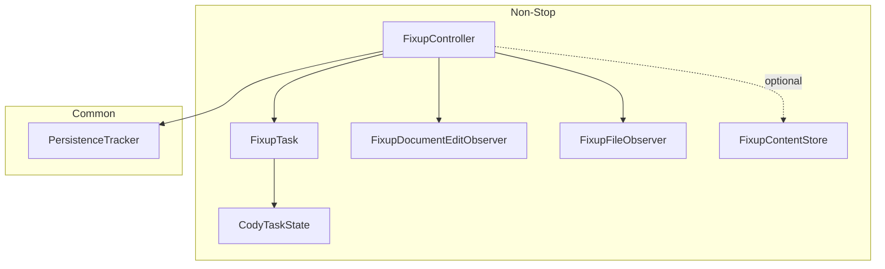
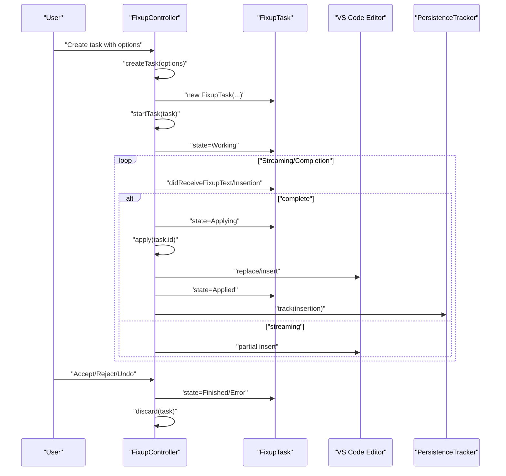
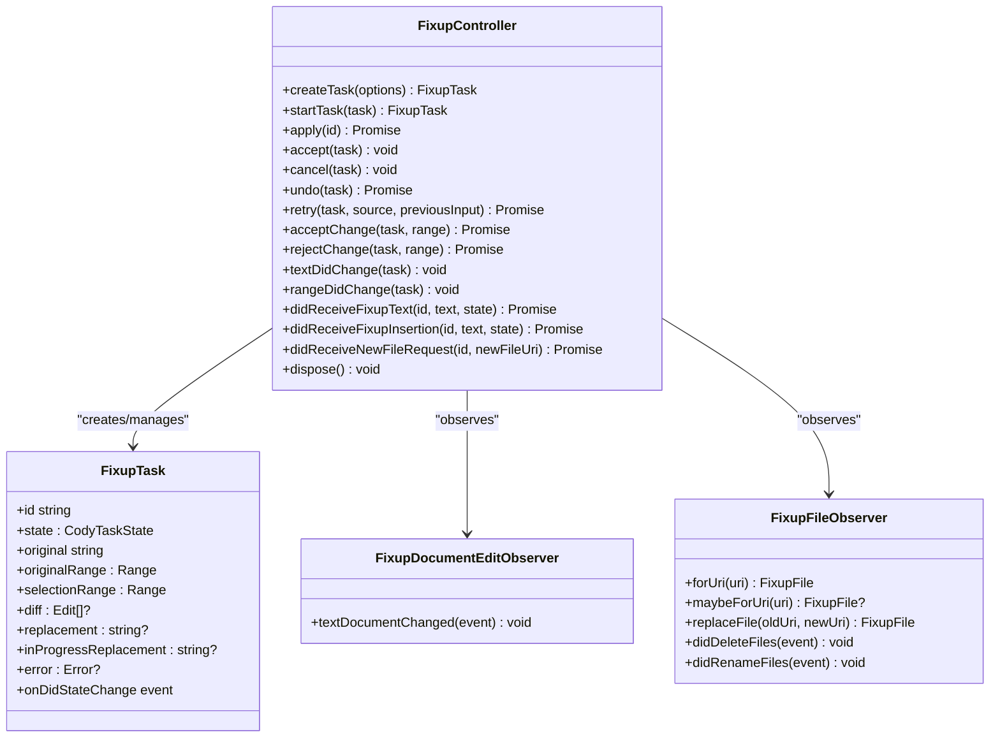
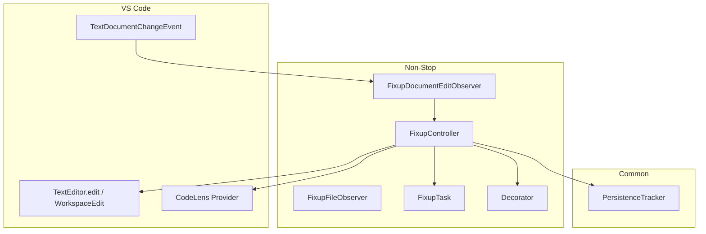
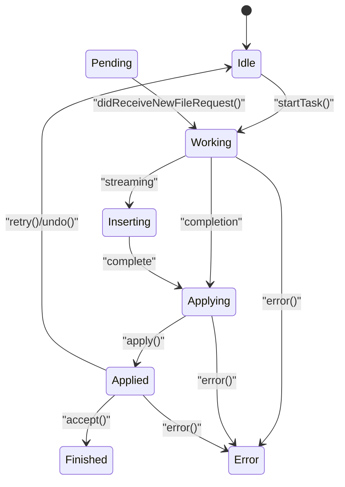
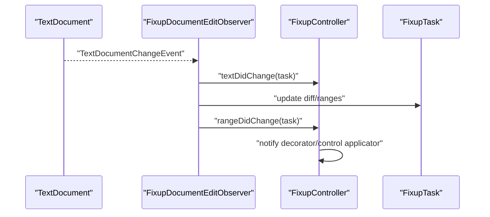
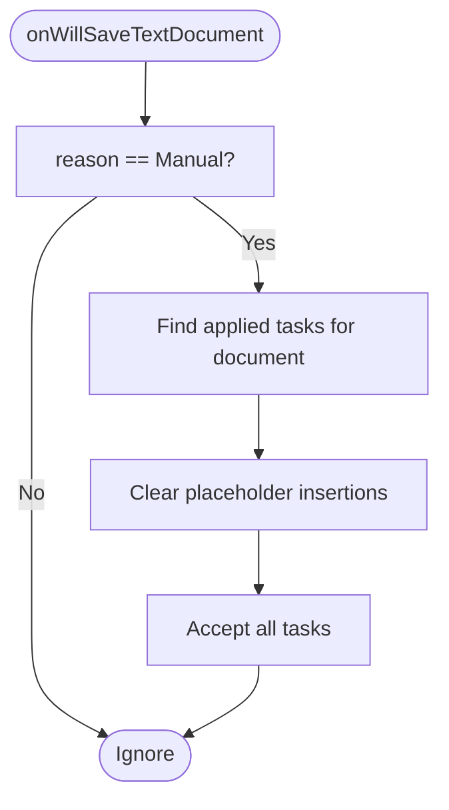
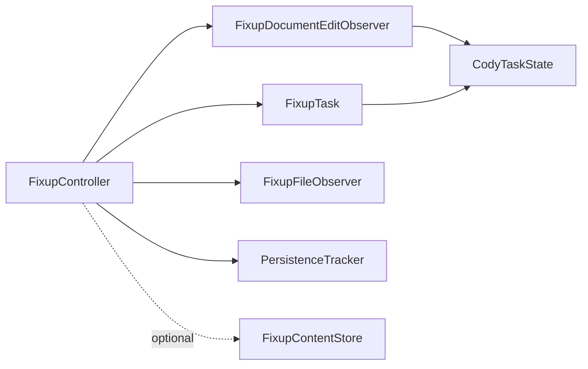

# Fixup Controller

<cite>
**Referenced Files in This Document**
- [FixupController.ts](file://vscode/src/non-stop/FixupController.ts)
- [FixupTask.ts](file://vscode/src/non-stop/FixupTask.ts)
- [FixupDocumentEditObserver.ts](file://vscode/src/non-stop/FixupDocumentEditObserver.ts)
- [FixupFileObserver.ts](file://vscode/src/non-stop/FixupFileObserver.ts)
- [FixupContentStore.ts](file://vscode/src/non-stop/FixupContentStore.ts)
- [state.ts](file://vscode/src/non-stop/state.ts)
- [index.ts](file://vscode/src/common/persistence-tracker/index.ts)
</cite>

## Table of Contents
1. [Introduction](#introduction)
2. [Project Structure](#project-structure)
3. [Core Components](#core-components)
4. [Architecture Overview](#architecture-overview)
5. [Detailed Component Analysis](#detailed-component-analysis)
6. [Dependency Analysis](#dependency-analysis)
7. [Performance Considerations](#performance-considerations)
8. [Troubleshooting Guide](#troubleshooting-guide)
9. [Conclusion](#conclusion)

## Introduction
The Fixup Controller orchestrates all code editing tasks in the non-stop editing subsystem. It manages task creation, lifecycle, state transitions, and integrates with VS Code’s editor APIs for real-time editing, undo/redo, and conflict-aware diff application. It also logs persistence metrics for applied changes and supports automatic acceptance on save, selective undo/redo behavior, and conflict resolution during edits.

## Project Structure
The Fixup system is organized around a central controller, a task model, observers for file/document changes, and a persistence tracker for measuring change persistence over time.

**Diagram sources**
- [FixupController.ts:72-143](file://vscode/src/non-stop/FixupController.ts#L72-L143)
- [FixupTask.ts:35-99](file://vscode/src/non-stop/FixupTask.ts#L35-L99)
- [FixupDocumentEditObserver.ts:67-147](file://vscode/src/non-stop/FixupDocumentEditObserver.ts#L67-L147)
- [FixupFileObserver.ts:10-80](file://vscode/src/non-stop/FixupFileObserver.ts#L10-L80)
- [FixupContentStore.ts:10-76](file://vscode/src/non-stop/FixupContentStore.ts#L10-L76)
- [state.ts:1-49](file://vscode/src/non-stop/state.ts#L1-L49)
- [index.ts:49-252](file://vscode/src/common/persistence-tracker/index.ts#L49-L252)

**Section sources**
- [FixupController.ts:72-143](file://vscode/src/non-stop/FixupController.ts#L72-L143)
- [FixupTask.ts:35-99](file://vscode/src/non-stop/FixupTask.ts#L35-L99)
- [FixupDocumentEditObserver.ts:67-147](file://vscode/src/non-stop/FixupDocumentEditObserver.ts#L67-L147)
- [FixupFileObserver.ts:10-80](file://vscode/src/non-stop/FixupFileObserver.ts#L10-L80)
- [FixupContentStore.ts:10-76](file://vscode/src/non-stop/FixupContentStore.ts#L10-L76)
- [state.ts:1-49](file://vscode/src/non-stop/state.ts#L1-L49)
- [index.ts:49-252](file://vscode/src/common/persistence-tracker/index.ts#L49-L252)

## Core Components
- FixupController: Central orchestrator for task creation, state transitions, applying edits, and integrating with VS Code editor APIs. It observes file and document changes, manages auto-acceptance on save, and coordinates persistence tracking.
- FixupTask: Immutable-like task model with state, diff cache, original text/range, and metadata. Exposes a state change event for observers.
- FixupDocumentEditObserver: Listens to text changes and updates task ranges/diffs, handles undo behavior for add tasks, and notifies the controller of text/range changes.
- FixupFileObserver: Tracks file lifecycle (rename/delete) and provides a durable handle per file.
- FixupContentStore: Optional content provider for storing original and replacement content keyed by task ID.
- PersistenceTracker: Measures how long inserted content persists in the document across time windows and computes differences.

**Section sources**
- [FixupController.ts:72-143](file://vscode/src/non-stop/FixupController.ts#L72-L143)
- [FixupTask.ts:35-212](file://vscode/src/non-stop/FixupTask.ts#L35-L212)
- [FixupDocumentEditObserver.ts:67-147](file://vscode/src/non-stop/FixupDocumentEditObserver.ts#L67-L147)
- [FixupFileObserver.ts:10-80](file://vscode/src/non-stop/FixupFileObserver.ts#L10-L80)
- [FixupContentStore.ts:10-76](file://vscode/src/non-stop/FixupContentStore.ts#L10-L76)
- [index.ts:49-252](file://vscode/src/common/persistence-tracker/index.ts#L49-L252)

## Architecture Overview
The Fixup Controller is the hub for all non-stop editing operations. It:
- Creates tasks from user input or commands.
- Manages state transitions from Idle → Working → Inserting/Applying → Applied → Finished/Error.
- Applies edits via VS Code TextEditor.edit or WorkspaceEdit, with undo boundaries carefully controlled.
- Observes document changes and adjusts task ranges/diffs accordingly.
- Automatically accepts tasks on save under appropriate conditions.
- Logs persistence metrics for applied changes.
- Supports undo/redo and conflict-aware diff updates.

**Diagram sources**
- [FixupController.ts:531-572](file://vscode/src/non-stop/FixupController.ts#L531-L572)
- [FixupController.ts:577-581](file://vscode/src/non-stop/FixupController.ts#L577-L581)
- [FixupController.ts:1102-1130](file://vscode/src/non-stop/FixupController.ts#L1102-L1130)
- [FixupController.ts:844-904](file://vscode/src/non-stop/FixupController.ts#L844-L904)
- [FixupController.ts:1241-1275](file://vscode/src/non-stop/FixupController.ts#L1241-L1275)
- [index.ts:67-107](file://vscode/src/common/persistence-tracker/index.ts#L67-L107)

## Detailed Component Analysis

### FixupController
Responsibilities:
- Task lifecycle: creation, start, apply, accept, cancel, undo, retry.
- Streaming vs. non-streaming edits: applies partial text during streaming and final text upon completion.
- Conflict-aware diff application: recomputes diffs against latest document text and updates ranges.
- Auto-acceptance on save: accepts applied tasks when saving manually and the autoSave setting allows it.
- Undo/Redo integration: respects undo boundaries and cancels add tasks on undo.
- Persistence tracking: records applied changes with timing and diff metrics.
- Observer integration: manages file and document change observers.

Key behaviors:
- CreateTaskOptions interface drives task instantiation with instruction, selection range, intent, mode, model, rules, and optional telemetry metadata.
- State transitions are validated centrally; terminal states trigger cleanup.
- Diff computation uses line-diff utilities and decorator-aware options depending on runtime context.

Practical examples:
- Task creation workflow: user triggers an edit → controller prompts for input → controller constructs FixupTask → controller starts task → streaming/completion updates → controller applies edits → controller logs persistence metrics.
- State transitions: Idle → Working → Inserting/Applying → Applied → Finished; error handling moves to Error → Finished.
- Conflict resolution: on text changes within a task range, diffs are recomputed and ranges updated; for decorated replacements, dimension changes invalidate deletions to prevent accidental removal.

**Section sources**
- [FixupController.ts:531-572](file://vscode/src/non-stop/FixupController.ts#L531-L572)
- [FixupController.ts:577-581](file://vscode/src/non-stop/FixupController.ts#L577-L581)
- [FixupController.ts:1102-1130](file://vscode/src/non-stop/FixupController.ts#L1102-L1130)
- [FixupController.ts:844-904](file://vscode/src/non-stop/FixupController.ts#L844-L904)
- [FixupController.ts:1241-1275](file://vscode/src/non-stop/FixupController.ts#L1241-L1275)
- [FixupController.ts:111-142](file://vscode/src/non-stop/FixupController.ts#L111-L142)
- [FixupController.ts:324-357](file://vscode/src/non-stop/FixupController.ts#L324-L357)

#### Class Diagram

**Diagram sources**
- [FixupController.ts:72-143](file://vscode/src/non-stop/FixupController.ts#L72-L143)
- [FixupTask.ts:35-212](file://vscode/src/non-stop/FixupTask.ts#L35-L212)
- [FixupDocumentEditObserver.ts:67-147](file://vscode/src/non-stop/FixupDocumentEditObserver.ts#L67-L147)
- [FixupFileObserver.ts:10-80](file://vscode/src/non-stop/FixupFileObserver.ts#L10-L80)

### FixupTask
Responsibilities:
- Encapsulates task configuration and runtime state.
- Caches original text and range for retry semantics.
- Maintains diff edits and supports partial acceptance/rejection.
- Emits state change events for observers.

Key design points:
- Default selection range expansion for non-add intents to improve diff accuracy.
- Content change conversion for telemetry compatibility with CharactersLogger.

**Section sources**
- [FixupTask.ts:35-212](file://vscode/src/non-stop/FixupTask.ts#L35-L212)

### FixupDocumentEditObserver
Responsibilities:
- Updates task ranges and diffs on document changes.
- Cancels add tasks on undo to prevent interference.
- Detects changes within task range and notifies the controller.

Conflict handling:
- For decorated replacements, if the replacement dimensions change, the edit is dropped from the diff to avoid unsafe deletions.
- Range updates are propagated to selectionRange, insertionPoint, and fixed originalRange.

**Section sources**
- [FixupDocumentEditObserver.ts:67-147](file://vscode/src/non-stop/FixupDocumentEditObserver.ts#L67-L147)

### FixupFileObserver
Responsibilities:
- Provides durable file handles across document renames/deletes.
- Associates tasks with a stable file identity.

**Section sources**
- [FixupFileObserver.ts:10-80](file://vscode/src/non-stop/FixupFileObserver.ts#L10-L80)

### FixupContentStore
Responsibilities:
- Optional content storage keyed by task ID for source control diffs.
- Tracks task IDs per file path and cleans up on document close.

**Section sources**
- [FixupContentStore.ts:10-76](file://vscode/src/non-stop/FixupContentStore.ts#L10-L76)

### PersistenceTracker
Responsibilities:
- Tracks applied insertions across time windows and measures persistence via Levenshtein difference and optional Git diff.
- Updates tracked ranges on document changes and handles file rename/delete.

Integration with FixupController:
- FixupController invokes PersistenceTracker.track with task metadata and callbacks for “present” and “removed” events.

**Section sources**
- [index.ts:49-252](file://vscode/src/common/persistence-tracker/index.ts#L49-L252)
- [FixupController.ts:711-728](file://vscode/src/non-stop/FixupController.ts#L711-L728)

## Architecture Overview

**Diagram sources**
- [FixupController.ts:104-109](file://vscode/src/non-stop/FixupController.ts#L104-L109)
- [FixupDocumentEditObserver.ts:70-102](file://vscode/src/non-stop/FixupDocumentEditObserver.ts#L70-L102)
- [FixupController.ts:1241-1275](file://vscode/src/non-stop/FixupController.ts#L1241-L1275)
- [FixupController.ts:711-728](file://vscode/src/non-stop/FixupController.ts#L711-L728)

## Detailed Component Analysis

### Task State Machine
States and transitions:
- Idle → Working: startTask sets the initial state.
- Working → Inserting/Applying: depends on intent and streaming; completion sets Applying.
- Inserting: streaming partial replacement; complete switches to Applying.
- Applying → Applied: edits applied; decorations updated.
- Applied: user can accept/reject per-block; full acceptance leads to Finished.
- Error: terminal state; task discarded.
- Pending: special state for test command awaiting additional info.

**Diagram sources**
- [state.ts:1-49](file://vscode/src/non-stop/state.ts#L1-L49)
- [FixupController.ts:577-581](file://vscode/src/non-stop/FixupController.ts#L577-L581)
- [FixupController.ts:1065-1100](file://vscode/src/non-stop/FixupController.ts#L1065-L1100)
- [FixupController.ts:844-904](file://vscode/src/non-stop/FixupController.ts#L844-L904)
- [FixupController.ts:1241-1275](file://vscode/src/non-stop/FixupController.ts#L1241-L1275)

**Section sources**
- [state.ts:1-49](file://vscode/src/non-stop/state.ts#L1-L49)
- [FixupController.ts:1241-1275](file://vscode/src/non-stop/FixupController.ts#L1241-L1275)

### Observer Pattern for File and Document Changes
- FixupFileObserver: Provides durable file handles and reacts to rename/delete events.
- FixupDocumentEditObserver: Listens to text changes, updates task ranges/diffs, and notifies controller of text/range changes.

**Diagram sources**
- [FixupDocumentEditObserver.ts:70-102](file://vscode/src/non-stop/FixupDocumentEditObserver.ts#L70-L102)
- [FixupController.ts:1176-1205](file://vscode/src/non-stop/FixupController.ts#L1176-L1205)

**Section sources**
- [FixupFileObserver.ts:56-80](file://vscode/src/non-stop/FixupFileObserver.ts#L56-L80)
- [FixupDocumentEditObserver.ts:67-147](file://vscode/src/non-stop/FixupDocumentEditObserver.ts#L67-L147)
- [FixupController.ts:1176-1205](file://vscode/src/non-stop/FixupController.ts#L1176-L1205)

### Automatic Acceptance on Save and Undo/Redo
- Auto-acceptance: on will-save, if the save reason is manual and autoSave settings permit, applied tasks for the saved document are accepted and placeholder insertions are cleared before formatting.
- Undo behavior: add tasks are canceled on undo to prevent interference; undo reverts to original text and updates state accordingly.

**Diagram sources**
- [FixupController.ts:120-142](file://vscode/src/non-stop/FixupController.ts#L120-L142)
- [FixupController.ts:1012-1023](file://vscode/src/non-stop/FixupController.ts#L1012-L1023)

**Section sources**
- [FixupController.ts:111-142](file://vscode/src/non-stop/FixupController.ts#L111-L142)
- [FixupController.ts:80-86](file://vscode/src/non-stop/FixupController.ts#L80-L86)

### Conflict Resolution Mechanisms
- Dimension-preserving checks for decorated replacements: if the replacement’s character-level dimensions change, the edit is removed from the diff to avoid unsafe deletions.
- Range updates: selectionRange, insertionPoint, and fixed originalRange are updated consistently across changes.
- Overlapping task acceptance: when a new task overlaps an existing applied task, the older one is auto-accepted and placeholders cleared.

**Section sources**
- [FixupDocumentEditObserver.ts:34-58](file://vscode/src/non-stop/FixupDocumentEditObserver.ts#L34-L58)
- [FixupController.ts:237-250](file://vscode/src/non-stop/FixupController.ts#L237-L250)

### Practical Examples

#### Example 1: Task Creation Workflow
- User initiates an edit; controller prompts for input and constructs a FixupTask with CreateTaskOptions.
- Controller starts the task and transitions to Working.
- Completion triggers Applying; controller applies edits and transitions to Applied.
- PersistenceTracker logs the insertion metrics.

**Section sources**
- [FixupController.ts:500-525](file://vscode/src/non-stop/FixupController.ts#L500-L525)
- [FixupController.ts:531-572](file://vscode/src/non-stop/FixupController.ts#L531-L572)
- [FixupController.ts:1102-1130](file://vscode/src/non-stop/FixupController.ts#L1102-L1130)
- [FixupController.ts:844-904](file://vscode/src/non-stop/FixupController.ts#L844-L904)
- [FixupController.ts:711-728](file://vscode/src/non-stop/FixupController.ts#L711-L728)

#### Example 2: State Transitions and Error Handling
- Working → Inserting/Applying → Applied → Finished on success.
- Error state transitions to Finished and discards the task.

**Section sources**
- [FixupController.ts:1241-1275](file://vscode/src/non-stop/FixupController.ts#L1241-L1275)
- [FixupController.ts:995-1003](file://vscode/src/non-stop/FixupController.ts#L995-L1003)

#### Example 3: Per-Block Accept/Reject
- User can accept/reject individual diff blocks; on full acceptance, the task is finalized.

**Section sources**
- [FixupController.ts:147-181](file://vscode/src/non-stop/FixupController.ts#L147-L181)
- [FixupController.ts:183-223](file://vscode/src/non-stop/FixupController.ts#L183-L223)

### Integration with VS Code Editor APIs
- Uses TextEditor.edit for visible editors and WorkspaceEdit for background edits.
- Controls undo boundaries to group streaming completions as a single undo unit.
- Reveals ranges and shows notifications when edits occur in background.

**Section sources**
- [FixupController.ts:764-842](file://vscode/src/non-stop/FixupController.ts#L764-L842)
- [FixupController.ts:943-976](file://vscode/src/non-stop/FixupController.ts#L943-L976)
- [FixupController.ts:979-993](file://vscode/src/non-stop/FixupController.ts#L979-L993)

### Persistence Tracker Integration
- Records insertions with metadata and schedules periodic checks to compute persistence difference and optional code diff.
- Updates tracked ranges on document changes and handles file rename/delete.

**Section sources**
- [FixupController.ts:711-728](file://vscode/src/non-stop/FixupController.ts#L711-L728)
- [index.ts:67-107](file://vscode/src/common/persistence-tracker/index.ts#L67-L107)
- [index.ts:199-240](file://vscode/src/common/persistence-tracker/index.ts#L199-L240)

## Dependency Analysis

**Diagram sources**
- [FixupController.ts:72-143](file://vscode/src/non-stop/FixupController.ts#L72-L143)
- [FixupTask.ts:35-99](file://vscode/src/non-stop/FixupTask.ts#L35-L99)
- [FixupDocumentEditObserver.ts:67-147](file://vscode/src/non-stop/FixupDocumentEditObserver.ts#L67-L147)
- [FixupFileObserver.ts:10-80](file://vscode/src/non-stop/FixupFileObserver.ts#L10-L80)
- [FixupContentStore.ts:10-76](file://vscode/src/non-stop/FixupContentStore.ts#L10-L76)
- [state.ts:1-49](file://vscode/src/non-stop/state.ts#L1-L49)
- [index.ts:49-252](file://vscode/src/common/persistence-tracker/index.ts#L49-L252)

**Section sources**
- [FixupController.ts:72-143](file://vscode/src/non-stop/FixupController.ts#L72-L143)
- [FixupTask.ts:35-99](file://vscode/src/non-stop/FixupTask.ts#L35-L99)
- [FixupDocumentEditObserver.ts:67-147](file://vscode/src/non-stop/FixupDocumentEditObserver.ts#L67-L147)
- [FixupFileObserver.ts:10-80](file://vscode/src/non-stop/FixupFileObserver.ts#L10-L80)
- [FixupContentStore.ts:10-76](file://vscode/src/non-stop/FixupContentStore.ts#L10-L76)
- [state.ts:1-49](file://vscode/src/non-stop/state.ts#L1-L49)
- [index.ts:49-252](file://vscode/src/common/persistence-tracker/index.ts#L49-L252)

## Performance Considerations
- Streaming edits avoid unnecessary undo stops until completion to keep undo units coherent.
- Diff recomputation is lazy and only occurs when needed; ranges are updated incrementally on changes.
- Persistence tracking batches measurements per document to reduce overhead.
- Auto-acceptance on save uses onWillSave to ensure placeholder cleanup before formatting.

[No sources needed since this section provides general guidance]

## Troubleshooting Guide
- Task stuck in Working: ensure completion callbacks are invoked; check didReceiveFixupText transitions to Applying.
- Applied task not accepting: verify per-block acceptance and that the diff is fully consumed.
- Undo fails to revert: confirm the task is in Applied state and that revertToOriginal is called with the correct editor/workspace edit.
- Conflicts during edits: watch for dimension changes in decorated replacements; the observer drops such edits to prevent unsafe deletions.
- Persistence metrics missing: ensure track is called with non-empty insertText and that the logger callbacks are invoked.

**Section sources**
- [FixupController.ts:1102-1130](file://vscode/src/non-stop/FixupController.ts#L1102-L1130)
- [FixupController.ts:147-181](file://vscode/src/non-stop/FixupController.ts#L147-L181)
- [FixupController.ts:266-317](file://vscode/src/non-stop/FixupController.ts#L266-L317)
- [FixupDocumentEditObserver.ts:34-58](file://vscode/src/non-stop/FixupDocumentEditObserver.ts#L34-L58)
- [FixupController.ts:711-728](file://vscode/src/non-stop/FixupController.ts#L711-L728)

## Conclusion
The Fixup Controller provides a robust, observable, and conflict-aware orchestration layer for non-stop code editing. It cleanly separates concerns between task modeling, document observation, and persistence measurement while integrating tightly with VS Code’s editor APIs. Its state machine, undo/redo awareness, and automatic acceptance logic deliver a smooth user experience, and the persistence tracker offers valuable insights into change adoption over time.