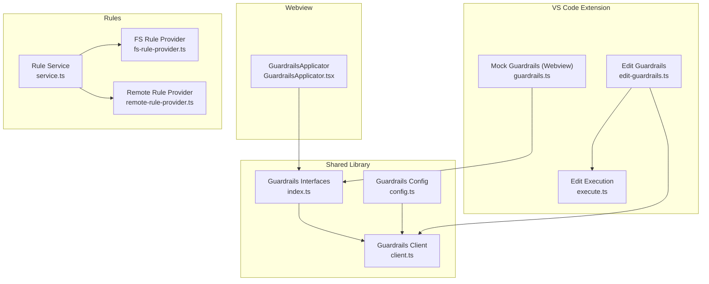
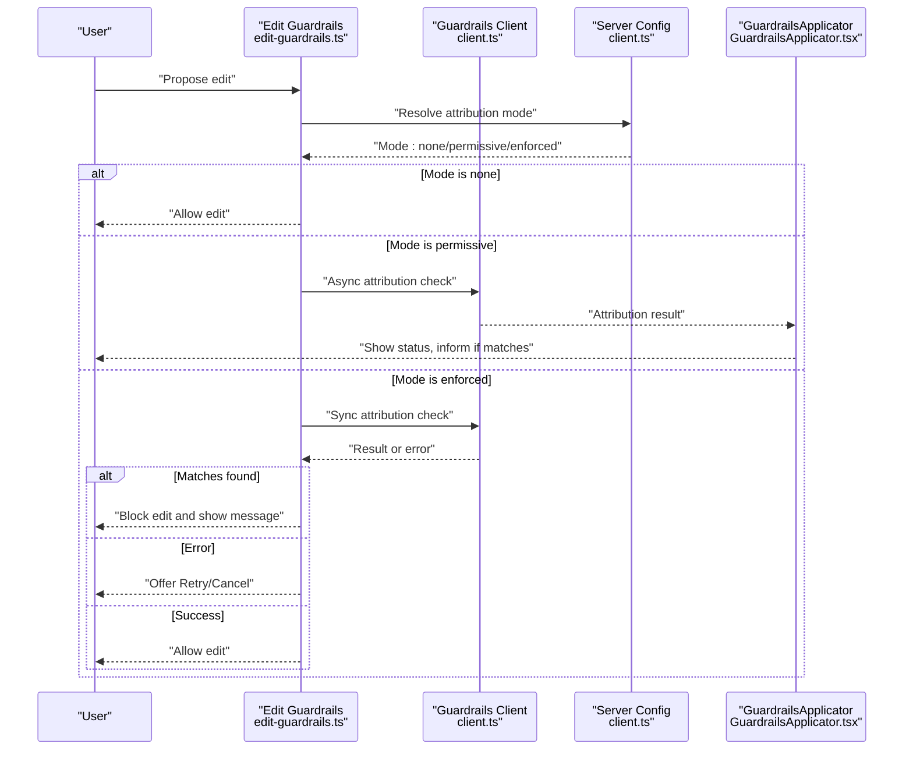
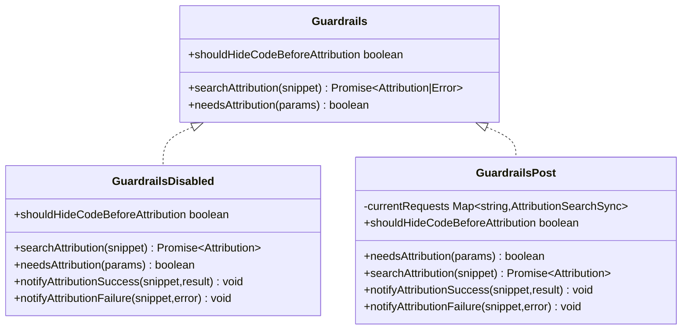
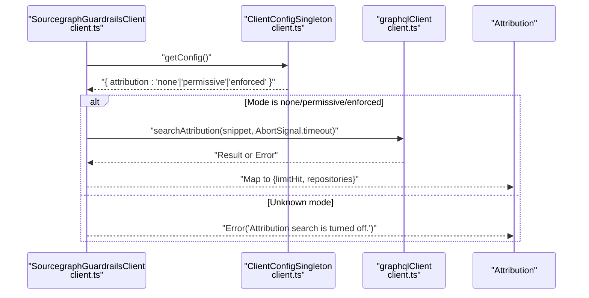
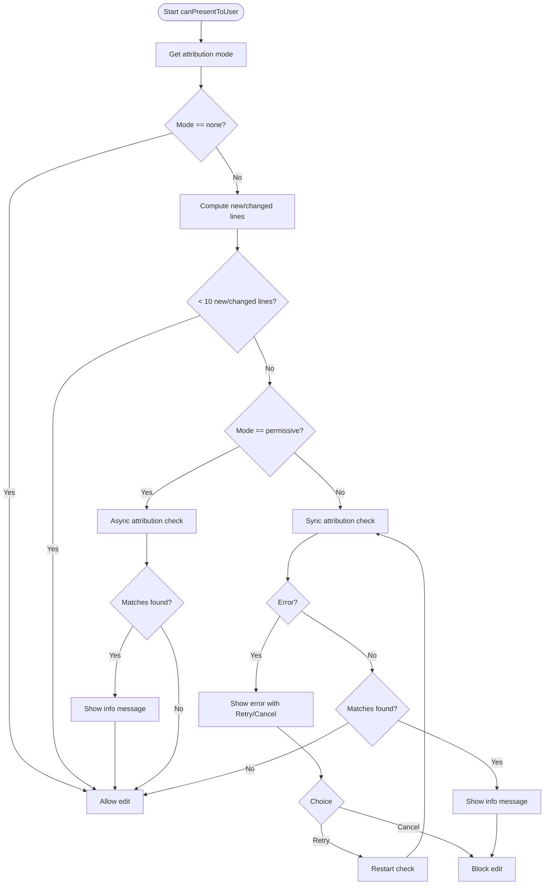
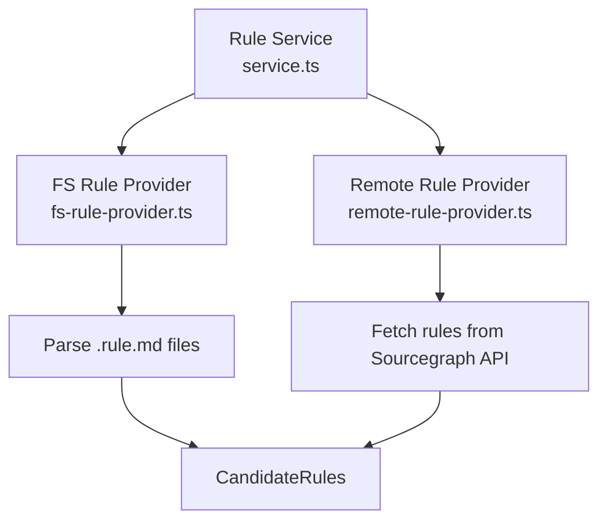
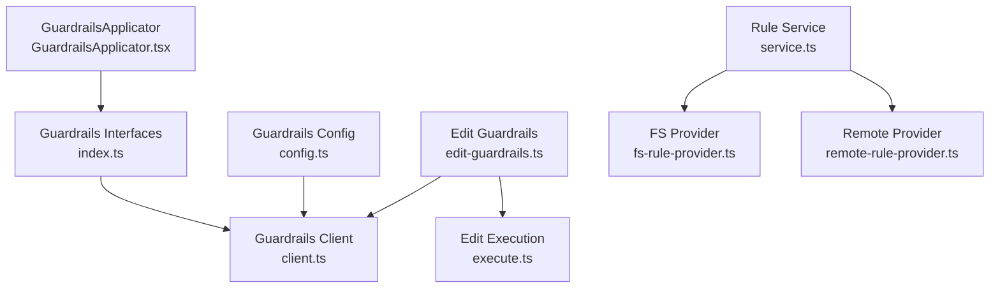

# Guardrails System

<cite>
**Referenced Files in This Document**
- [index.ts](file://lib/shared/src/guardrails/index.ts)
- [client.ts](file://lib/shared/src/guardrails/client.ts)
- [config.ts](file://lib/shared/src/guardrails/config.ts)
- [edit-guardrails.ts](file://vscode/src/edit/edit-guardrails.ts)
- [guardrails.ts](file://vscode/webviews/utils/guardrails.ts)
- [GuardrailsApplicator.tsx](file://vscode/webviews/components/GuardrailsApplicator.tsx)
- [service.ts](file://vscode/src/rules/service.ts)
- [fs-rule-provider.ts](file://vscode/src/rules/fs-rule-provider.ts)
- [remote-rule-provider.ts](file://vscode/src/rules/remote-rule-provider.ts)
- [configuration.ts](file://lib/shared/src/configuration.ts)
- [execute.ts](file://vscode/src/edit/execute.ts)
</cite>

## Table of Contents
1. [Introduction](#introduction)
2. [Project Structure](#project-structure)
3. [Core Components](#core-components)
4. [Architecture Overview](#architecture-overview)
5. [Detailed Component Analysis](#detailed-component-analysis)
6. [Dependency Analysis](#dependency-analysis)
7. [Performance Considerations](#performance-considerations)
8. [Troubleshooting Guide](#troubleshooting-guide)
9. [Conclusion](#conclusion)
10. [Appendices](#appendices)

## Introduction
This document explains the Guardrails system that prevents unsafe or inappropriate code changes in the application. It covers the rule-based filtering concept, the guardrail enforcement modes, the built-in guardrail evaluation logic, and the custom rule provider system that enables organizations to define their own safety policies. It also documents the real-time evaluation process during edit execution, user notification mechanisms, and the approval workflow for bypassing restrictions. Finally, it provides practical examples of common guardrail scenarios and discusses the balance between safety and flexibility.

## Project Structure
The Guardrails system spans shared libraries, the VS Code extension, and webview components:
- Shared guardrails interfaces and implementations define the contract and runtime behavior.
- The VS Code extension integrates guardrails into edit execution and user notifications.
- Webview components render guardrails status and manage attribution checks.
- Rule providers enable organizations to define custom safety policies via local or remote sources.



**Diagram sources**
- [index.ts:1-208](file://lib/shared/src/guardrails/index.ts#L1-L208)
- [client.ts:1-58](file://lib/shared/src/guardrails/client.ts#L1-L58)
- [config.ts:1-43](file://lib/shared/src/guardrails/config.ts#L1-L43)
- [edit-guardrails.ts:1-142](file://vscode/src/edit/edit-guardrails.ts#L1-L142)
- [guardrails.ts:1-22](file://vscode/webviews/utils/guardrails.ts#L1-L22)
- [GuardrailsApplicator.tsx:45-227](file://vscode/webviews/components/GuardrailsApplicator.tsx#L45-L227)
- [service.ts:1-39](file://vscode/src/rules/service.ts#L1-L39)
- [fs-rule-provider.ts:1-138](file://vscode/src/rules/fs-rule-provider.ts#L1-L138)
- [remote-rule-provider.ts:1-109](file://vscode/src/rules/remote-rule-provider.ts#L1-L109)
- [execute.ts:1-78](file://vscode/src/edit/execute.ts#L1-L78)

**Section sources**
- [index.ts:1-208](file://lib/shared/src/guardrails/index.ts#L1-L208)
- [client.ts:1-58](file://lib/shared/src/guardrails/client.ts#L1-L58)
- [config.ts:1-43](file://lib/shared/src/guardrails/config.ts#L1-L43)
- [edit-guardrails.ts:1-142](file://vscode/src/edit/edit-guardrails.ts#L1-L142)
- [guardrails.ts:1-22](file://vscode/webviews/utils/guardrails.ts#L1-L22)
- [GuardrailsApplicator.tsx:45-227](file://vscode/webviews/components/GuardrailsApplicator.tsx#L45-L227)
- [service.ts:1-39](file://vscode/src/rules/service.ts#L1-L39)
- [fs-rule-provider.ts:1-138](file://vscode/src/rules/fs-rule-provider.ts#L1-L138)
- [remote-rule-provider.ts:1-109](file://vscode/src/rules/remote-rule-provider.ts#L1-L109)
- [execute.ts:1-78](file://vscode/src/edit/execute.ts#L1-L78)

## Core Components
- Guardrails interfaces and modes:
  - GuardrailsMode: Off, Permissive, Enforced.
  - GuardrailsCheckStatus: GeneratingCode, Checking, Skipped, Success, Failed, Error.
  - Guardrails contract: searchAttribution, needsAttribution, shouldHideCodeBeforeAttribution.
- Guardrails client:
  - Resolves mode from server configuration and performs attribution search with timeouts.
- Edit guardrails:
  - Integrates guardrails into edit execution, deciding whether to show or hide code and how to handle errors.
- Webview guardrails applicator:
  - Manages attribution checks, caching, and UI status updates.
- Rule providers:
  - FileSystem and Remote providers that discover and load organization-defined rules.

**Section sources**
- [index.ts:25-117](file://lib/shared/src/guardrails/index.ts#L25-L117)
- [client.ts:21-57](file://lib/shared/src/guardrails/client.ts#L21-L57)
- [edit-guardrails.ts:28-141](file://vscode/src/edit/edit-guardrails.ts#L28-L141)
- [GuardrailsApplicator.tsx:147-227](file://vscode/webviews/components/GuardrailsApplicator.tsx#L147-L227)
- [service.ts:16-38](file://vscode/src/rules/service.ts#L16-L38)

## Architecture Overview
The Guardrails system enforces safety during code generation and editing by evaluating AI-generated code against attribution and policy rules. The architecture separates concerns between:
- Shared guardrails interfaces and implementations that define behavior and modes.
- A client that resolves server-side configuration and performs attribution.
- An edit guardrails module that gates edit presentation based on mode and results.
- A webview applicator that renders status and caches attribution results.
- A rule service backed by filesystem or remote providers for custom policy enforcement.



**Diagram sources**
- [edit-guardrails.ts:36-140](file://vscode/src/edit/edit-guardrails.ts#L36-L140)
- [client.ts:43-56](file://lib/shared/src/guardrails/client.ts#L43-L56)
- [GuardrailsApplicator.tsx:167-227](file://vscode/webviews/components/GuardrailsApplicator.tsx#L167-L227)

## Detailed Component Analysis

### Guardrails Interfaces and Modes
The shared guardrails module defines the core contract and states:
- Guardrails interface: encapsulates attribution lookup, gating behavior, and eligibility checks.
- GuardrailsMode: Off, Permissive, Enforced.
- GuardrailsCheckStatus: lifecycle of a guardrails check.
- Implementations:
  - GuardrailsDisabled: no-op when guardrails are off.
  - GuardrailsPost: posts snippets to extension for attribution; supports hiding code in enforced mode.



**Diagram sources**
- [index.ts:3-7](file://lib/shared/src/guardrails/index.ts#L3-L7)
- [index.ts:119-140](file://lib/shared/src/guardrails/index.ts#L119-L140)
- [index.ts:146-192](file://lib/shared/src/guardrails/index.ts#L146-L192)

**Section sources**
- [index.ts:25-117](file://lib/shared/src/guardrails/index.ts#L25-L117)

### Guardrails Client and Configuration
The client resolves the current mode from server configuration and performs attribution search with a configurable timeout. It normalizes results into a standard shape and surfaces errors.



**Diagram sources**
- [client.ts:21-56](file://lib/shared/src/guardrails/client.ts#L21-L56)

**Section sources**
- [client.ts:17-57](file://lib/shared/src/guardrails/client.ts#L17-L57)
- [configuration.ts:154-155](file://lib/shared/src/configuration.ts#L154-L155)

### Edit Guardrails Integration
EditGuardrails coordinates with the client to gate edit presentation:
- Determines mode from server configuration.
- Skips checks for small diffs (<10 new/changed lines).
- In permissive mode: asynchronously logs and informs the user; allows edit immediately.
- In enforced mode: synchronously waits for results; blocks on matches or errors; offers retry/cancel on error.



**Diagram sources**
- [edit-guardrails.ts:49-140](file://vscode/src/edit/edit-guardrails.ts#L49-L140)

**Section sources**
- [edit-guardrails.ts:9-141](file://vscode/src/edit/edit-guardrails.ts#L9-L141)

### Webview Guardrails Applicator
The GuardrailsApplicator manages attribution checks and UI state:
- Uses a cache keyed by Guardrails instance and code snippet to avoid redundant requests.
- Returns appropriate GuardrailsCheckStatus during generation, checking, success, failed, or error.
- Provides tooltips and status display based on current state.

```mermaid
classDiagram
class GuardrailsCache {
-cache WeakMap~Guardrails, {attributionRequests, results}~
+getStatus(guardrails,isCodeComplete,code,language,updateStatus) GuardrailsResult
+delete(guardrails,code) void
}
class GuardrailsApplicator {
+plainCode string
+markdownCode string
+language string
+fileName string
+guardrails Guardrails
+isMessageLoading boolean
+isCodeComplete boolean
+onRegenerate() void
+children ReactNode
}
GuardrailsApplicator --> GuardrailsCache : "uses"
```

**Diagram sources**
- [GuardrailsApplicator.tsx:55-147](file://vscode/webviews/components/GuardrailsApplicator.tsx#L55-L147)
- [GuardrailsApplicator.tsx:157-227](file://vscode/webviews/components/GuardrailsApplicator.tsx#L157-L227)

**Section sources**
- [GuardrailsApplicator.tsx:45-227](file://vscode/webviews/components/GuardrailsApplicator.tsx#L45-L227)

### Mock Guardrails for Testing
A mock implementation ensures tests can validate UI and logic without requiring attribution.

**Section sources**
- [guardrails.ts:11-22](file://vscode/webviews/utils/guardrails.ts#L11-L22)

### Rule Providers and Custom Policies
Organizations can define custom safety policies via rule files:
- Rule Service: creates a singleton that selects providers based on IDE capabilities.
- FileSystem Rule Provider: scans workspace folders for .rule.md files and parses them into CandidateRules.
- Remote Rule Provider: queries the Sourcegraph instance for rules applying to specific repositories and paths.



**Diagram sources**
- [service.ts:16-38](file://vscode/src/rules/service.ts#L16-L38)
- [fs-rule-provider.ts:47-137](file://vscode/src/rules/fs-rule-provider.ts#L47-L137)
- [remote-rule-provider.ts:19-69](file://vscode/src/rules/remote-rule-provider.ts#L19-L69)

**Section sources**
- [service.ts:1-39](file://vscode/src/rules/service.ts#L1-L39)
- [fs-rule-provider.ts:1-138](file://vscode/src/rules/fs-rule-provider.ts#L1-L138)
- [remote-rule-provider.ts:1-109](file://vscode/src/rules/remote-rule-provider.ts#L1-L109)

## Dependency Analysis
The system exhibits clear separation of concerns:
- Shared guardrails interfaces depend on configuration and client abstractions.
- Edit guardrails depends on the client and VS Code progress/notification APIs.
- Webview applicator depends on shared guardrails and caches results.
- Rule service composes providers based on environment (VS Code vs. non-VS Code).



**Diagram sources**
- [index.ts:1-208](file://lib/shared/src/guardrails/index.ts#L1-L208)
- [client.ts:1-58](file://lib/shared/src/guardrails/client.ts#L1-L58)
- [config.ts:1-43](file://lib/shared/src/guardrails/config.ts#L1-L43)
- [edit-guardrails.ts:1-142](file://vscode/src/edit/edit-guardrails.ts#L1-L142)
- [GuardrailsApplicator.tsx:45-227](file://vscode/webviews/components/GuardrailsApplicator.tsx#L45-L227)
- [service.ts:1-39](file://vscode/src/rules/service.ts#L1-L39)
- [fs-rule-provider.ts:1-138](file://vscode/src/rules/fs-rule-provider.ts#L1-L138)
- [remote-rule-provider.ts:1-109](file://vscode/src/rules/remote-rule-provider.ts#L1-L109)
- [execute.ts:1-78](file://vscode/src/edit/execute.ts#L1-L78)

**Section sources**
- [index.ts:1-208](file://lib/shared/src/guardrails/index.ts#L1-L208)
- [client.ts:1-58](file://lib/shared/src/guardrails/client.ts#L1-L58)
- [config.ts:1-43](file://lib/shared/src/guardrails/config.ts#L1-L43)
- [edit-guardrails.ts:1-142](file://vscode/src/edit/edit-guardrails.ts#L1-L142)
- [GuardrailsApplicator.tsx:45-227](file://vscode/webviews/components/GuardrailsApplicator.tsx#L45-L227)
- [service.ts:1-39](file://vscode/src/rules/service.ts#L1-L39)
- [fs-rule-provider.ts:1-138](file://vscode/src/rules/fs-rule-provider.ts#L1-L138)
- [remote-rule-provider.ts:1-109](file://vscode/src/rules/remote-rule-provider.ts#L1-L109)
- [execute.ts:1-78](file://vscode/src/edit/execute.ts#L1-L78)

## Performance Considerations
- Attribution timeouts: The client uses a default timeout suitable for slow attribution requests and honors a configurable timeout from resolved settings.
- Caching: The webview applicator caches attribution results keyed by Guardrails instance and code snippet to reduce redundant requests.
- Conditional checks: The edit guardrails skips checks for small diffs to minimize overhead.
- Asynchronous vs synchronous: Permissive mode avoids blocking by performing checks asynchronously, while enforced mode synchronously waits for results.

**Section sources**
- [client.ts:8-29](file://lib/shared/src/guardrails/client.ts#L8-L29)
- [GuardrailsApplicator.tsx:55-147](file://vscode/webviews/components/GuardrailsApplicator.tsx#L55-L147)
- [edit-guardrails.ts:58-75](file://vscode/src/edit/edit-guardrails.ts#L58-L75)

## Troubleshooting Guide
Common issues and resolutions:
- Attribution disabled: If the server configuration sets attribution to none, guardrails are effectively disabled and no checks are performed.
- API errors: In enforced mode, errors halt the edit; the user can retry or cancel. In permissive mode, errors are logged and ignored.
- Slow attribution: Configure a higher timeout to accommodate slow responses.
- Small diffs: Changes with fewer than the configured threshold are not checked; increase the threshold if stricter coverage is desired.
- Shell scripts: Code in shell-like languages is excluded from attribution checks by default.

**Section sources**
- [client.ts:22-41](file://lib/shared/src/guardrails/client.ts#L22-L41)
- [edit-guardrails.ts:106-139](file://vscode/src/edit/edit-guardrails.ts#L106-L139)
- [index.ts:142-163](file://lib/shared/src/guardrails/index.ts#L142-L163)

## Conclusion
The Guardrails system provides a flexible, extensible safety mechanism for AI-generated code. It supports three enforcement modes—Off, Permissive, and Enforced—allowing teams to balance safety and productivity. Built-in attribution checks protect against problematic code origins, while the rule provider system enables organizations to codify and enforce custom policies. Real-time evaluation during edit execution, combined with clear user notifications and retry workflows, ensures transparency and control.

## Appendices

### Built-in Guardrail Rules and Policy Enforcement
- Attribution-based protection: Detects matches against repositories and surfaces them to users.
- Threshold-based skipping: Skips checks for small diffs to reduce noise.
- Language exclusion: Excludes shell-like languages from checks by default.
- Organization-defined policies: Implemented via rule files loaded from filesystem or remote sources.

**Section sources**
- [index.ts:142-163](file://lib/shared/src/guardrails/index.ts#L142-L163)
- [fs-rule-provider.ts:20-38](file://vscode/src/rules/fs-rule-provider.ts#L20-L38)
- [remote-rule-provider.ts:79-108](file://vscode/src/rules/remote-rule-provider.ts#L79-L108)

### Real-Time Evaluation During Edit Execution
- EditGuardrails determines mode, computes change size, and triggers checks accordingly.
- Permissive mode informs users asynchronously; enforced mode synchronously blocks on matches or errors.

**Section sources**
- [edit-guardrails.ts:49-140](file://vscode/src/edit/edit-guardrails.ts#L49-L140)

### User Notification and Approval Workflow
- Notifications: Informational messages indicate matches found; errors surface actionable dialogs with Retry/Cancel in enforced mode.
- Approval workflow: Not directly implemented in the referenced files; organizations can integrate custom approval flows via their rule policies and provider backends.

**Section sources**
- [edit-guardrails.ts:112-127](file://vscode/src/edit/edit-guardrails.ts#L112-L127)

### Examples of Common Guardrail Scenarios
- Preventing dangerous API usage: Organizations can define rules that flag specific APIs or patterns; upon detection, enforcement mode can block edits and notify users.
- Enforcing code quality standards: Rules can encode style, complexity, or security constraints; permissive mode can warn without blocking, while enforced mode can prevent unsafe changes.
- Maintaining compliance with organizational policies: Rules can restrict usage of third-party components or code from specific repositories; attribution checks complement these rules to prevent licensing or provenance issues.

[No sources needed since this section provides conceptual examples]