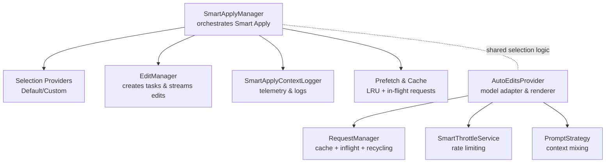
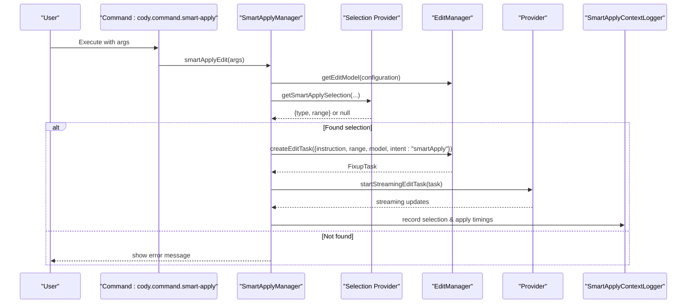
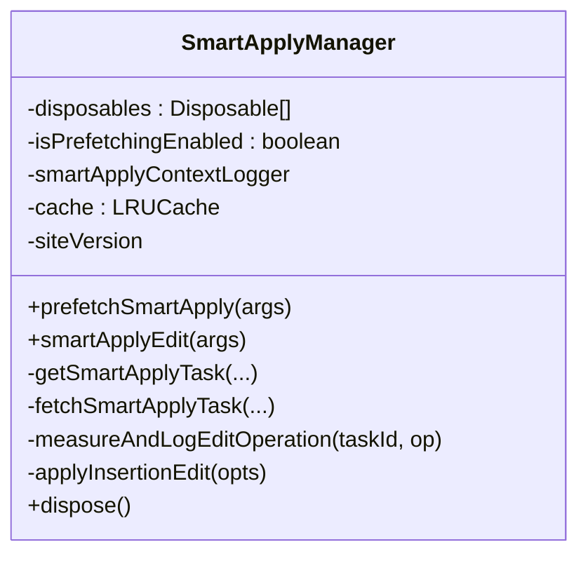
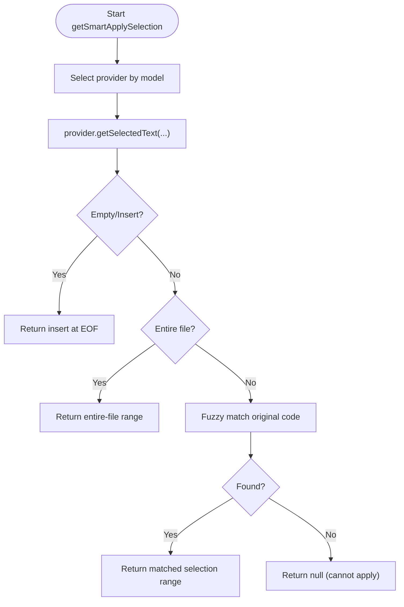
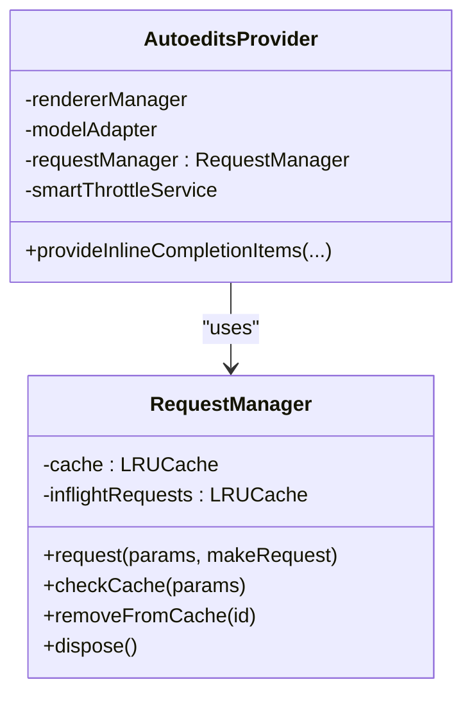
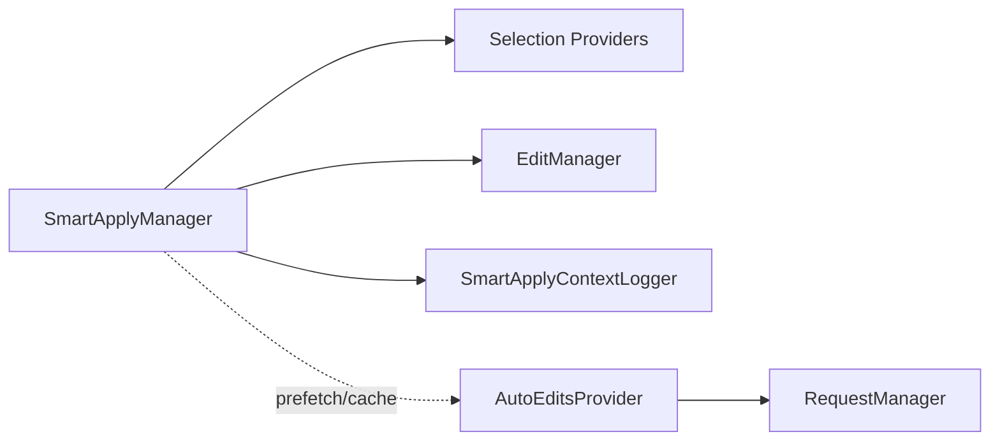

# Smart Apply

<cite>
**Referenced Files in This Document**
- [smart-apply-manager.ts](file://vscode/src/edit/smart-apply-manager.ts)
- [smart-apply.ts](file://vscode/src/edit/smart-apply.ts)
- [selection.ts](file://vscode/src/edit/prompt/smart-apply/selection.ts)
- [selection/base.ts](file://vscode/src/edit/prompt/smart-apply/selection/base.ts)
- [selection/default.ts](file://vscode/src/edit/prompt/smart-apply/selection/default.ts)
- [selection/custom-model.ts](file://vscode/src/edit/prompt/smart-apply/selection/custom-model.ts)
- [autoedits-provider.ts](file://vscode/src/autoedits/autoedits-provider.ts)
- [request-manager.ts](file://vscode/src/autoedits/request-manager.ts)
</cite>

## Table of Contents
1. [Introduction](#introduction)
2. [Project Structure](#project-structure)
3. [Core Components](#core-components)
4. [Architecture Overview](#architecture-overview)
5. [Detailed Component Analysis](#detailed-component-analysis)
6. [Dependency Analysis](#dependency-analysis)
7. [Performance Considerations](#performance-considerations)
8. [Troubleshooting Guide](#troubleshooting-guide)
9. [Conclusion](#conclusion)

## Introduction
Smart Apply is a system that adapts AI-generated code suggestions to a user’s document context, coding style, and existing patterns. It coordinates selection and application of changes through a prompt-based strategy, integrates with the broader editing pipeline, and enforces guardrails to prevent breaking changes. It also supports prefetching and caching to improve responsiveness, and it can adapt to different models and strategies depending on context window and model capabilities.

## Project Structure
Smart Apply spans several modules:
- Smart Apply Manager: orchestrates selection, task creation, streaming edits, and logging.
- Prompt-based selection: determines whether to insert, select, or replace entire file based on model reasoning and fuzzy matching.
- AutoEdits integration: shares request lifecycle, caching, and throttling to optimize model calls and reduce redundant work.
- Utilities: selection types, constants, and telemetry/logging.

**Diagram sources**
- [smart-apply-manager.ts:40-446](file://vscode/src/edit/smart-apply-manager.ts#L40-L446)
- [selection.ts:87-181](file://vscode/src/edit/prompt/smart-apply/selection.ts#L87-L181)
- [autoedits-provider.ts:169-756](file://vscode/src/autoedits/autoedits-provider.ts#L169-L756)
- [request-manager.ts:33-362](file://vscode/src/autoedits/request-manager.ts#L33-L362)

**Section sources**
- [smart-apply-manager.ts:40-446](file://vscode/src/edit/smart-apply-manager.ts#L40-L446)
- [selection.ts:87-181](file://vscode/src/edit/prompt/smart-apply/selection.ts#L87-L181)
- [autoedits-provider.ts:169-756](file://vscode/src/autoedits/autoedits-provider.ts#L169-L756)
- [request-manager.ts:33-362](file://vscode/src/autoedits/request-manager.ts#L33-L362)

## Core Components
- SmartApplyManager: registers commands, manages prefetching, caches tasks, selects the appropriate strategy, creates FixupTasks, and streams edits. It measures and logs timing for telemetry.
- Selection Providers: DefaultSelectionProvider and CustomModelSelectionProvider encapsulate prompting logic to determine selection type and range.
- AutoEditsProvider and RequestManager: provide model adaptation, throttling, caching, and request recycling to avoid redundant work and improve throughput.

**Section sources**
- [smart-apply-manager.ts:40-446](file://vscode/src/edit/smart-apply-manager.ts#L40-L446)
- [selection/default.ts:55-139](file://vscode/src/edit/prompt/smart-apply/selection/default.ts#L55-L139)
- [selection/custom-model.ts:46-142](file://vscode/src/edit/prompt/smart-apply/selection/custom-model.ts#L46-L142)
- [autoedits-provider.ts:169-756](file://vscode/src/autoedits/autoedits-provider.ts#L169-L756)
- [request-manager.ts:33-362](file://vscode/src/autoedits/request-manager.ts#L33-L362)

## Architecture Overview
Smart Apply is invoked via a command with arguments containing the instruction, replacement text, target document, and optional model. The manager:
- Validates context filtering and determines the model.
- Uses selection providers to determine the best range to apply the change.
- Creates a FixupTask and starts a streaming edit.
- Logs selection and apply durations for telemetry.

**Diagram sources**
- [smart-apply.ts:22-33](file://vscode/src/edit/smart-apply.ts#L22-L33)
- [smart-apply-manager.ts:256-336](file://vscode/src/edit/smart-apply-manager.ts#L256-L336)
- [selection.ts:87-181](file://vscode/src/edit/prompt/smart-apply/selection.ts#L87-L181)

## Detailed Component Analysis

### SmartApplyManager
Responsibilities:
- Registers commands for smart apply, accept, reject, and prefetch.
- Prefetching: pre-resolves a task and pre-streams provider edits when enabled.
- Selection caching: LRU cache keyed by configuration id to avoid recomputation.
- Task orchestration: creates FixupTasks, handles insertion vs. streaming edits, and measures apply duration.
- Logging: records selection type, selection time, apply time, and telemetry metadata.

Key behaviors:
- Prefetch checks ignored contexts and avoids caching for new files.
- Uses site version and API version to inform selection.
- Supports “insert” when selection is empty or when instructed by selection provider.
- Applies guardrails for attribution visibility before streaming.

**Diagram sources**
- [smart-apply-manager.ts:40-446](file://vscode/src/edit/smart-apply-manager.ts#L40-L446)

**Section sources**
- [smart-apply-manager.ts:40-446](file://vscode/src/edit/smart-apply-manager.ts#L40-L446)

### Prompt-based Smart Apply Selection
Selection logic:
- Determines selection type: insert, selection, or entire-file.
- Uses a selection provider based on model identifiers.
- For default provider: constructs a prompt with instruction, file contents, and incoming change; asks the model to return the original code to replace.
- For custom model provider: may force entire-file replacement under certain conditions or use a specialized prompt with speculation parameters.

**Diagram sources**
- [selection.ts:87-181](file://vscode/src/edit/prompt/smart-apply/selection.ts#L87-L181)
- [selection/default.ts:55-139](file://vscode/src/edit/prompt/smart-apply/selection/default.ts#L55-L139)
- [selection/custom-model.ts:46-142](file://vscode/src/edit/prompt/smart-apply/selection/custom-model.ts#L46-L142)

**Section sources**
- [selection.ts:87-181](file://vscode/src/edit/prompt/smart-apply/selection.ts#L87-L181)
- [selection/base.ts:26-42](file://vscode/src/edit/prompt/smart-apply/selection/base.ts#L26-L42)
- [selection/default.ts:55-139](file://vscode/src/edit/prompt/smart-apply/selection/default.ts#L55-L139)
- [selection/custom-model.ts:46-142](file://vscode/src/edit/prompt/smart-apply/selection/custom-model.ts#L46-L142)

### Integration with AutoEdits
Smart Apply shares infrastructure with AutoEdits for:
- Request lifecycle: caching, inflight requests, and recycling to avoid redundant model calls.
- Throttling: rate limiting and smart throttling to balance responsiveness and cost.
- Rendering and diffs: utilities for computing inline/deletion decorations and rendering.

**Diagram sources**
- [autoedits-provider.ts:169-756](file://vscode/src/autoedits/autoedits-provider.ts#L169-L756)
- [request-manager.ts:33-362](file://vscode/src/autoedits/request-manager.ts#L33-L362)

**Section sources**
- [autoedits-provider.ts:169-756](file://vscode/src/autoedits/autoedits-provider.ts#L169-L756)
- [request-manager.ts:33-362](file://vscode/src/autoedits/request-manager.ts#L33-L362)

### Conflict Detection and Resolution
Smart Apply relies on the broader editing pipeline and AutoEdits filters to avoid problematic changes:
- Duplicate text duplication checks in the rewrite area.
- Big modification detection to avoid overly large diffs.
- Recent edits filtering to avoid conflicts with user actions.
- Stale request cancellation and hot-streak navigation to keep suggestions relevant.

These checks occur before rendering or accepting suggestions in AutoEdits and complement Smart Apply’s selection stage.

**Section sources**
- [autoedits-provider.ts:560-610](file://vscode/src/autoedits/autoedits-provider.ts#L560-L610)
- [request-manager.ts:292-353](file://vscode/src/autoedits/request-manager.ts#L292-L353)

### User Preference System and Coding Style Enforcement
Smart Apply adapts to:
- Model-specific selection strategies (e.g., forcing entire-file replacement for fast models).
- Instruction truncation and token limits to fit context windows.
- Guardrails around attribution visibility to maintain compliance.

Style enforcement is implicit in the selection prompt and the downstream application instruction that instructs the model to avoid duplicating code outside the selection.

**Section sources**
- [selection/custom-model.ts:46-142](file://vscode/src/edit/prompt/smart-apply/selection/custom-model.ts#L46-L142)
- [selection/default.ts:72-95](file://vscode/src/edit/prompt/smart-apply/selection/default.ts#L72-L95)
- [smart-apply-manager.ts:410-412](file://vscode/src/edit/smart-apply-manager.ts#L410-L412)

### Examples of Smart Apply Scenarios
- Adapting to project conventions: The selection provider reasons about where to place or replace code based on the file context and instruction, minimizing duplication and aligning with existing patterns.
- Handling edge cases: Empty documents, entire-file replacements, and ambiguous matches are handled by explicit fallbacks (insert at EOF, entire-file, or null).
- Maintaining backward compatibility: By focusing on precise selections and avoiding broad replacements unless necessary, and by integrating with AutoEdits’ conflict checks, Smart Apply reduces risk of unintended changes.

**Section sources**
- [selection.ts:133-181](file://vscode/src/edit/prompt/smart-apply/selection.ts#L133-L181)
- [selection/default.ts:67-95](file://vscode/src/edit/prompt/smart-apply/selection/default.ts#L67-L95)
- [autoedits-provider.ts:560-610](file://vscode/src/autoedits/autoedits-provider.ts#L560-L610)

## Dependency Analysis
Smart Apply depends on:
- EditManager for task creation and streaming.
- Selection providers for context-aware selection.
- Telemetry and logging for observability.
- AutoEdits infrastructure for request lifecycle and caching.

**Diagram sources**
- [smart-apply-manager.ts:40-446](file://vscode/src/edit/smart-apply-manager.ts#L40-L446)
- [selection.ts:87-181](file://vscode/src/edit/prompt/smart-apply/selection.ts#L87-L181)
- [autoedits-provider.ts:169-756](file://vscode/src/autoedits/autoedits-provider.ts#L169-L756)
- [request-manager.ts:33-362](file://vscode/src/autoedits/request-manager.ts#L33-L362)

**Section sources**
- [smart-apply-manager.ts:40-446](file://vscode/src/edit/smart-apply-manager.ts#L40-L446)
- [selection.ts:87-181](file://vscode/src/edit/prompt/smart-apply/selection.ts#L87-L181)
- [autoedits-provider.ts:169-756](file://vscode/src/autoedits/autoedits-provider.ts#L169-L756)
- [request-manager.ts:33-362](file://vscode/src/autoedits/request-manager.ts#L33-L362)

## Performance Considerations
- Prefetching: Pre-resolve and warm the provider to reduce latency when the user accepts.
- Caching: LRU cache for selection tasks keyed by configuration id; in-flight request reuse to avoid duplicate work.
- Throttling: Smart throttle and request recycling minimize redundant model calls.
- Streaming: Stream edits to reduce perceived latency and allow incremental feedback.
- Token limits: Truncate instructions and cap context window usage to fit model constraints.

**Section sources**
- [smart-apply-manager.ts:117-141](file://vscode/src/edit/smart-apply-manager.ts#L117-L141)
- [request-manager.ts:52-103](file://vscode/src/autoedits/request-manager.ts#L52-L103)
- [autoedits-provider.ts:352-375](file://vscode/src/autoedits/autoedits-provider.ts#L352-L375)

## Troubleshooting Guide
Common issues and mitigations:
- Selection not found: The selection provider may fail to locate the original code or the document may exceed context window limits. The system surfaces an error and marks the Smart Apply state as error.
- Context ignored: If the document is ignored by context filters, Smart Apply exits early.
- Large diffs or duplicates: AutoEdits filters discard suggestions that overlap with recent edits or are too large; adjust the instruction or selection to reduce scope.
- Prefetch disabled: If prefetch feature flag is off, no pre-resolution occurs; enable the flag to improve responsiveness.

**Section sources**
- [selection.ts:117-131](file://vscode/src/edit/prompt/smart-apply/selection.ts#L117-L131)
- [smart-apply-manager.ts:270-272](file://vscode/src/edit/smart-apply-manager.ts#L270-L272)
- [autoedits-provider.ts:560-610](file://vscode/src/autoedits/autoedits-provider.ts#L560-L610)

## Conclusion
Smart Apply provides a robust, context-aware mechanism to apply AI suggestions while respecting user preferences, coding style, and project conventions. Its integration with AutoEdits ensures efficient model usage, conflict avoidance, and responsive UX through prefetching, caching, and throttling. The prompt-based selection strategy and guardrails help maintain correctness and backward compatibility.