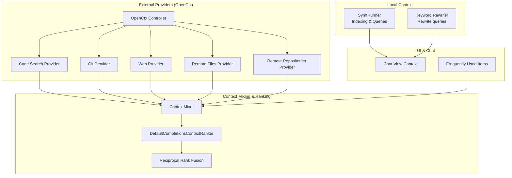
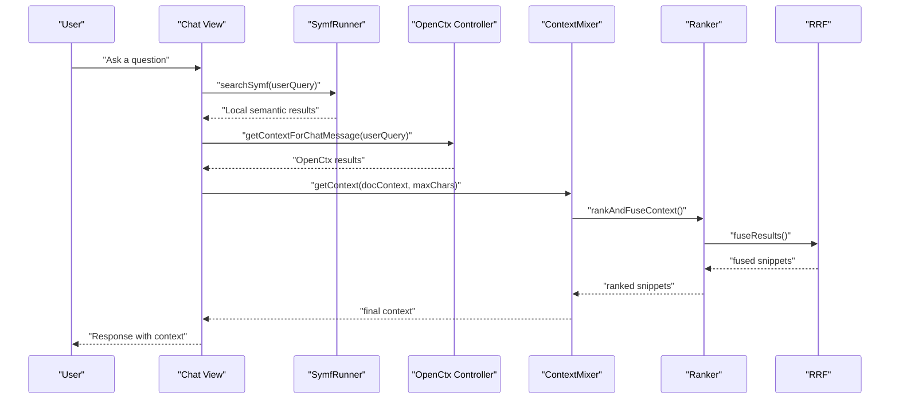
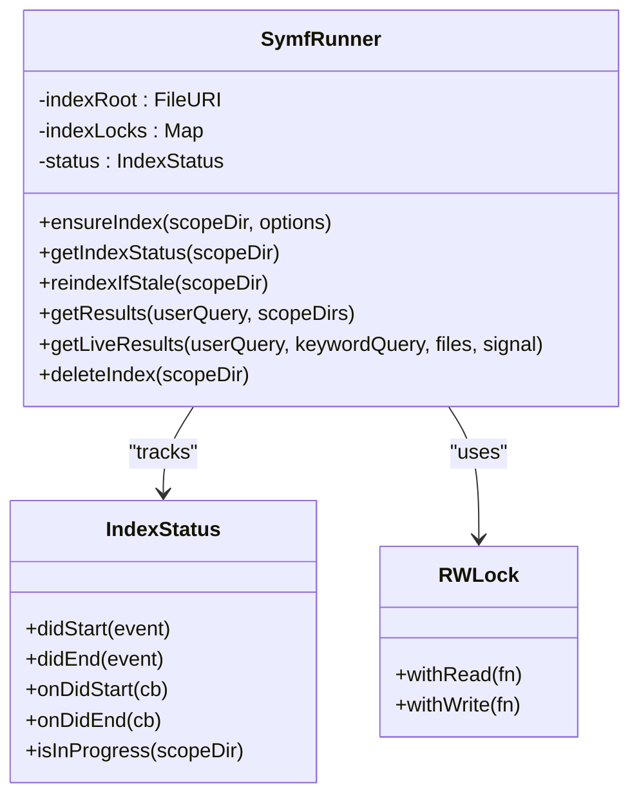
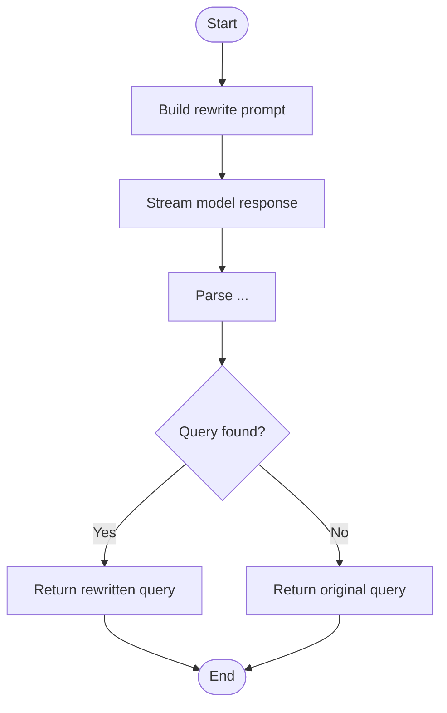
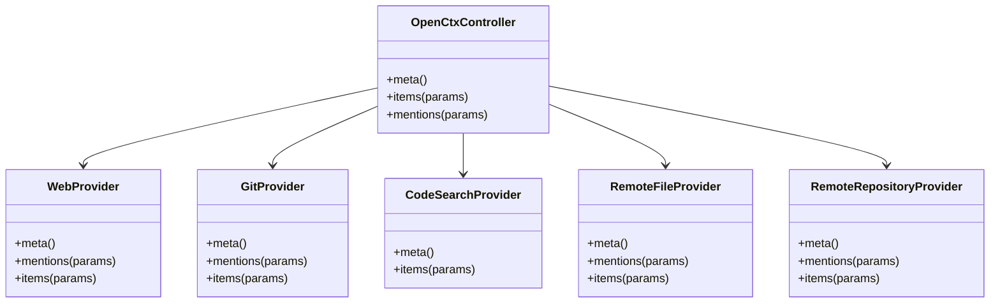
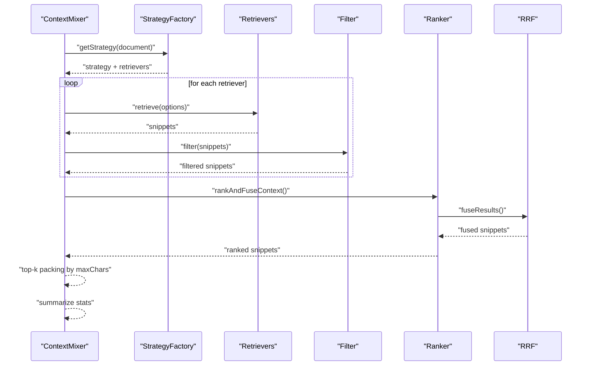
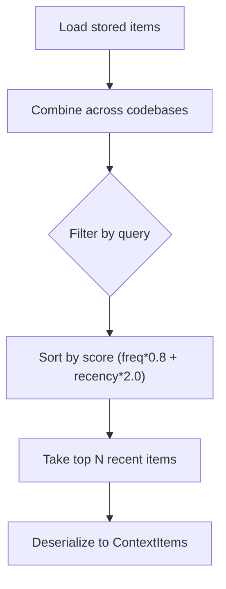
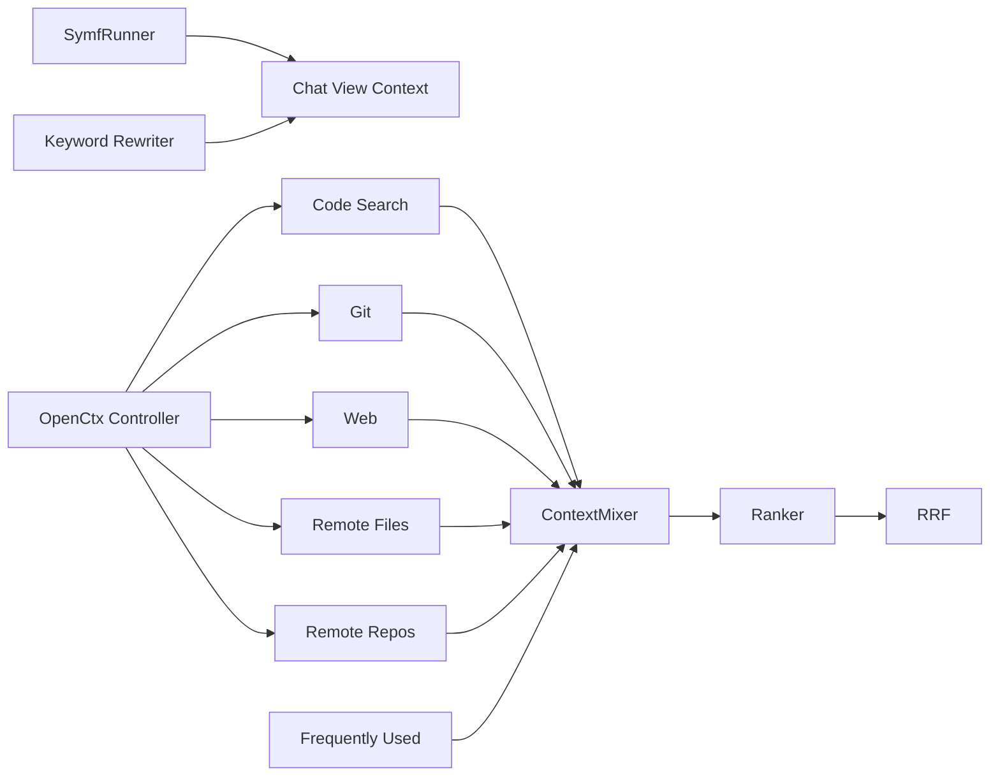

# Context Retrieval

<cite>
**Referenced Files in This Document**
- [openctx.ts](file://vscode/src/context/openctx.ts)
- [openctx/types.ts](file://vscode/src/context/openctx/types.ts)
- [openctx/codeSearch.ts](file://vscode/src/context/openctx/codeSearch.ts)
- [openctx/git.ts](file://vscode/src/context/openctx/git.ts)
- [openctx/web.ts](file://vscode/src/context/openctx/web.ts)
- [openctx/remoteFileSearch.ts](file://vscode/src/context/openctx/remoteFileSearch.ts)
- [openctx/remoteRepositorySearch.ts](file://vscode/src/context/openctx/remoteRepositorySearch.ts)
- [frequentlyUsed.ts](file://vscode/src/context/frequentlyUsed.ts)
- [symf.ts](file://vscode/src/local-context/symf.ts)
- [rewrite-keyword-query.ts](file://vscode/src/local-context/rewrite-keyword-query.ts)
- [context.ts](file://vscode/src/chat/chat-view/context.ts)
- [context-mixer.ts](file://vscode/src/completions/context/context-mixer.ts)
- [completions-context-ranker.ts](file://vscode/src/completions/context/completions-context-ranker.ts)
- [reciprocal-rank-fusion.ts](file://vscode/src/completions/context/reciprocal-rank-fusion.ts)
</cite>

## Table of Contents
1. [Introduction](#introduction)
2. [Project Structure](#project-structure)
3. [Core Components](#core-components)
4. [Architecture Overview](#architecture-overview)
5. [Detailed Component Analysis](#detailed-component-analysis)
6. [Dependency Analysis](#dependency-analysis)
7. [Performance Considerations](#performance-considerations)
8. [Troubleshooting Guide](#troubleshooting-guide)
9. [Conclusion](#conclusion)
10. [Appendices](#appendices)

## Introduction
This document explains the Cody context retrieval system, focusing on semantic search across local and remote codebases, repository integration, and context filtering. It covers the symf local indexing and search pipeline, keyword query rewriting, context ranking via reciprocal rank fusion, and integration with external context providers through the OpenCtx protocol (including code search, git repositories, and web sources). Practical usage scenarios in chat, autocomplete, and code editing are described, along with frequently used context tracking, privacy considerations, and performance optimizations for large codebases.

## Project Structure
The context retrieval system spans several subsystems:
- Local semantic search powered by symf, including indexing, live queries, and index lifecycle management
- Keyword query rewriting to improve search precision
- OpenCtx integration for external providers (web, git, code search, remote repositories, remote files)
- Context mixing and ranking for autocomplete and chat
- Frequently used context tracking persisted locally

**Diagram sources**
- [symf.ts:64-128](file://vscode/src/local-context/symf.ts#L64-L128)
- [rewrite-keyword-query.ts:19-32](file://vscode/src/local-context/rewrite-keyword-query.ts#L19-L32)
- [openctx.ts:50-105](file://vscode/src/context/openctx.ts#L50-L105)
- [openctx/codeSearch.ts:35-65](file://vscode/src/context/openctx/codeSearch.ts#L35-L65)
- [openctx/git.ts:25-130](file://vscode/src/context/openctx/git.ts#L25-L130)
- [openctx/web.ts:8-38](file://vscode/src/context/openctx/web.ts#L8-L38)
- [openctx/remoteFileSearch.ts:17-50](file://vscode/src/context/openctx/remoteFileSearch.ts#L17-L50)
- [openctx/remoteRepositorySearch.ts:14-30](file://vscode/src/context/openctx/remoteRepositorySearch.ts#L14-L30)
- [context-mixer.ts:88-105](file://vscode/src/completions/context/context-mixer.ts#L88-L105)
- [completions-context-ranker.ts:35-47](file://vscode/src/completions/context/completions-context-ranker.ts#L35-L47)
- [reciprocal-rank-fusion.ts:38-91](file://vscode/src/completions/context/reciprocal-rank-fusion.ts#L38-L91)
- [context.ts:24-49](file://vscode/src/chat/chat-view/context.ts#L24-L49)
- [frequentlyUsed.ts:87-134](file://vscode/src/context/frequentlyUsed.ts#L87-L134)

**Section sources**
- [openctx.ts:50-105](file://vscode/src/context/openctx.ts#L50-L105)
- [symf.ts:64-128](file://vscode/src/local-context/symf.ts#L64-L128)
- [context-mixer.ts:88-105](file://vscode/src/completions/context/context-mixer.ts#L88-L105)

## Core Components
- SymfRunner: Manages local semantic indexing and queries, with index lifecycle, locking, and telemetry
- Keyword Rewriter: Transforms user queries into optimized keyword forms using a fast model
- OpenCtx Providers: Integrates external context sources (web, git, code search, remote repos/files)
- ContextMixer: Orchestrates multiple retrievers, filters, and ranking strategies
- DefaultCompletionsContextRanker: Applies ranking strategies (default RRF, time-based, no-ranker)
- Reciprocal Rank Fusion: Fuses results across retrievers using RRF with line-level identities
- Frequently Used Context: Persists and scores context items by frequency and recency

**Section sources**
- [symf.ts:64-128](file://vscode/src/local-context/symf.ts#L64-L128)
- [rewrite-keyword-query.ts:19-32](file://vscode/src/local-context/rewrite-keyword-query.ts#L19-L32)
- [openctx.ts:109-207](file://vscode/src/context/openctx.ts#L109-L207)
- [context-mixer.ts:88-105](file://vscode/src/completions/context/context-mixer.ts#L88-L105)
- [completions-context-ranker.ts:35-47](file://vscode/src/completions/context/completions-context-ranker.ts#L35-L47)
- [reciprocal-rank-fusion.ts:38-91](file://vscode/src/completions/context/reciprocal-rank-fusion.ts#L38-L91)
- [frequentlyUsed.ts:87-134](file://vscode/src/context/frequentlyUsed.ts#L87-L134)

## Architecture Overview
The system integrates local and remote context into a unified, ranked set for autocomplete and chat. Local semantic search uses symf; external sources are provided via OpenCtx. ContextMixer coordinates retrievers, applies filters, and ranks results using configurable strategies.

**Diagram sources**
- [context.ts:24-49](file://vscode/src/chat/chat-view/context.ts#L24-L49)
- [symf.ts:309-336](file://vscode/src/local-context/symf.ts#L309-L336)
- [openctx.ts:50-105](file://vscode/src/context/openctx.ts#L50-L105)
- [context-mixer.ts:107-151](file://vscode/src/completions/context/context-mixer.ts#L107-L151)
- [completions-context-ranker.ts:38-76](file://vscode/src/completions/context/completions-context-ranker.ts#L38-L76)
- [reciprocal-rank-fusion.ts:38-91](file://vscode/src/completions/context/reciprocal-rank-fusion.ts#L38-L91)

## Detailed Component Analysis

### Symf Local Semantic Search
SymfRunner manages indexing and querying:
- Index lifecycle: creation, atomic replacement, failure tracking, and cleanup
- Query execution with boosted keywords and JSON output parsing
- Concurrency control via read/write locks and per-scope directories
- Staleness checks and background reindex triggers
- Telemetry on index size and status

**Diagram sources**
- [symf.ts:64-128](file://vscode/src/local-context/symf.ts#L64-L128)
- [symf.ts:543-574](file://vscode/src/local-context/symf.ts#L543-L574)
- [symf.ts:649-687](file://vscode/src/local-context/symf.ts#L649-L687)

**Section sources**
- [symf.ts:210-263](file://vscode/src/local-context/symf.ts#L210-L263)
- [symf.ts:309-336](file://vscode/src/local-context/symf.ts#L309-L336)
- [symf.ts:414-508](file://vscode/src/local-context/symf.ts#L414-L508)

### Keyword Query Rewriting
The system can rewrite user queries to improve search precision:
- Uses a fast model to extract a structured keyword form
- Falls back to the original query if rewriting fails
- Provides a separate keyword extraction utility for tokenization

**Diagram sources**
- [rewrite-keyword-query.ts:34-82](file://vscode/src/local-context/rewrite-keyword-query.ts#L34-L82)

**Section sources**
- [rewrite-keyword-query.ts:19-32](file://vscode/src/local-context/rewrite-keyword-query.ts#L19-L32)
- [rewrite-keyword-query.ts:89-139](file://vscode/src/local-context/rewrite-keyword-query.ts#L89-L139)

### OpenCtx Protocol Integration
Cody integrates external context providers:
- Web provider: fetches and presents web page content
- Git provider: exposes diffs and commit logs for local repositories
- Code search provider: resolves search results into context items
- Remote repository and file providers: search and fetch content from Sourcegraph instances

**Diagram sources**
- [openctx.ts:109-207](file://vscode/src/context/openctx.ts#L109-L207)
- [openctx/web.ts:8-38](file://vscode/src/context/openctx/web.ts#L8-L38)
- [openctx/git.ts:25-130](file://vscode/src/context/openctx/git.ts#L25-L130)
- [openctx/codeSearch.ts:35-65](file://vscode/src/context/openctx/codeSearch.ts#L35-L65)
- [openctx/remoteFileSearch.ts:17-50](file://vscode/src/context/openctx/remoteFileSearch.ts#L17-L50)
- [openctx/remoteRepositorySearch.ts:14-30](file://vscode/src/context/openctx/remoteRepositorySearch.ts#L14-L30)

**Section sources**
- [openctx.ts:50-105](file://vscode/src/context/openctx.ts#L50-L105)
- [openctx/web.ts:40-94](file://vscode/src/context/openctx/web.ts#L40-L94)
- [openctx/git.ts:59-130](file://vscode/src/context/openctx/git.ts#L59-L130)
- [openctx/codeSearch.ts:67-91](file://vscode/src/context/openctx/codeSearch.ts#L67-L91)
- [openctx/remoteFileSearch.ts:88-112](file://vscode/src/context/openctx/remoteFileSearch.ts#L88-L112)
- [openctx/remoteRepositorySearch.ts:30-54](file://vscode/src/context/openctx/remoteRepositorySearch.ts#L30-L54)

### Context Mixing and Ranking
ContextMixer orchestrates multiple retrievers, applies filters, and produces a final context set:
- Strategy selection and retriever execution
- Filtering of ignored URIs
- Ranking via DefaultCompletionsContextRanker (default RRF, time-based, no-ranker)
- Reciprocal rank fusion with line-level identities for overlapping snippets

**Diagram sources**
- [context-mixer.ts:107-151](file://vscode/src/completions/context/context-mixer.ts#L107-L151)
- [context-mixer.ts:183-185](file://vscode/src/completions/context/context-mixer.ts#L183-L185)
- [completions-context-ranker.ts:38-76](file://vscode/src/completions/context/completions-context-ranker.ts#L38-L76)
- [reciprocal-rank-fusion.ts:38-91](file://vscode/src/completions/context/reciprocal-rank-fusion.ts#L38-L91)

**Section sources**
- [context-mixer.ts:107-244](file://vscode/src/completions/context/context-mixer.ts#L107-L244)
- [completions-context-ranker.ts:35-155](file://vscode/src/completions/context/completions-context-ranker.ts#L35-L155)
- [reciprocal-rank-fusion.ts:38-126](file://vscode/src/completions/context/reciprocal-rank-fusion.ts#L38-L126)

### Frequently Used Context Tracking
Cody tracks frequently used context items locally:
- Stores items per user endpoint, username, and optional codebase
- Scores items by frequency and recency with exponential decay
- Limits stored items and recent items, supports filtering by query

**Diagram sources**
- [frequentlyUsed.ts:87-134](file://vscode/src/context/frequentlyUsed.ts#L87-L134)

**Section sources**
- [frequentlyUsed.ts:16-77](file://vscode/src/context/frequentlyUsed.ts#L16-L77)
- [frequentlyUsed.ts:144-198](file://vscode/src/context/frequentlyUsed.ts#L144-L198)

### Practical Usage Scenarios
- Chat conversations: Local symf results plus OpenCtx web/git/code search results are mixed and ranked before generating a response
- Autocomplete: ContextMixer selects and ranks context snippets respecting max character limits
- Code editing: Context is used to inform edits and transformations

[No sources needed since this section describes usage without analyzing specific files]

## Dependency Analysis
The following diagram highlights key dependencies among context retrieval components:

**Diagram sources**
- [context.ts:24-49](file://vscode/src/chat/chat-view/context.ts#L24-L49)
- [symf.ts:64-128](file://vscode/src/local-context/symf.ts#L64-L128)
- [rewrite-keyword-query.ts:19-32](file://vscode/src/local-context/rewrite-keyword-query.ts#L19-L32)
- [openctx.ts:109-207](file://vscode/src/context/openctx.ts#L109-L207)
- [context-mixer.ts:88-105](file://vscode/src/completions/context/context-mixer.ts#L88-L105)
- [completions-context-ranker.ts:35-47](file://vscode/src/completions/context/completions-context-ranker.ts#L35-L47)
- [reciprocal-rank-fusion.ts:38-91](file://vscode/src/completions/context/reciprocal-rank-fusion.ts#L38-L91)
- [frequentlyUsed.ts:87-134](file://vscode/src/context/frequentlyUsed.ts#L87-L134)

**Section sources**
- [context.ts:24-49](file://vscode/src/chat/chat-view/context.ts#L24-L49)
- [openctx.ts:109-207](file://vscode/src/context/openctx.ts#L109-L207)
- [context-mixer.ts:107-151](file://vscode/src/completions/context/context-mixer.ts#L107-L151)

## Performance Considerations
- Symf indexing:
  - Uses read/write locks to coordinate concurrent access
  - Atomic index updates and temporary directories to minimize downtime
  - CPU limits during indexing and staleness checks to reduce overhead
- Query execution:
  - JSON output parsing and bounded buffers/timeouts
  - Live query limits to constrain results for small file sets
- ContextMixer:
  - Per-retriever timing and retriever stats for observability
  - Top-k packing by maxChars to respect context window limits
- Keyword rewriting:
  - Streaming and early abort support; fallback to original query on failure
- OpenCtx providers:
  - Web provider uses proxy or direct fetch with timeouts and truncation
  - Git provider executes lightweight diffs and logs

[No sources needed since this section provides general guidance]

## Troubleshooting Guide
- Symf errors:
  - Unauthorized or missing binary errors are surfaced with actionable messages
  - Index failures are tracked with sentinel files and retried conditionally
- OpenCtx conflicts:
  - Warns if the external OpenCtx extension is installed alongside Cody
- Context filtering:
  - Ignored URIs are filtered out before ranking
- Privacy:
  - Web provider respects URL protocols and hostnames; content is truncated to fit context windows

**Section sources**
- [symf.ts:689-701](file://vscode/src/local-context/symf.ts#L689-L701)
- [openctx.ts:299-309](file://vscode/src/context/openctx.ts#L299-L309)
- [context-mixer.ts:275-287](file://vscode/src/completions/context/context-mixer.ts#L275-L287)
- [openctx/web.ts:96-132](file://vscode/src/context/openctx/web.ts#L96-L132)

## Conclusion
Cody’s context retrieval system combines local semantic search with external providers to deliver relevant context for chat, autocomplete, and code editing. The symf pipeline ensures efficient local search with robust index lifecycle management, while OpenCtx enables integration with web pages, git repositories, and Sourcegraph-backed code search and repository/file browsing. ContextMixer and ranking strategies (notably RRF) unify heterogeneous sources into a coherent, prioritized set, constrained by character budgets and privacy safeguards.

[No sources needed since this section summarizes without analyzing specific files]

## Appendices

### Privacy and Relevance Notes
- Privacy:
  - Web provider fetches content via proxy when enabled; otherwise direct HTTP(S) with strict hostname checks
  - Content is truncated to fit context windows
- Relevance:
  - Keyword rewriting improves search precision for local and remote sources
  - RRF fuses results across retrievers, emphasizing overlapping snippets
  - Time-based ranking can prioritize recently used context

[No sources needed since this section provides general guidance]