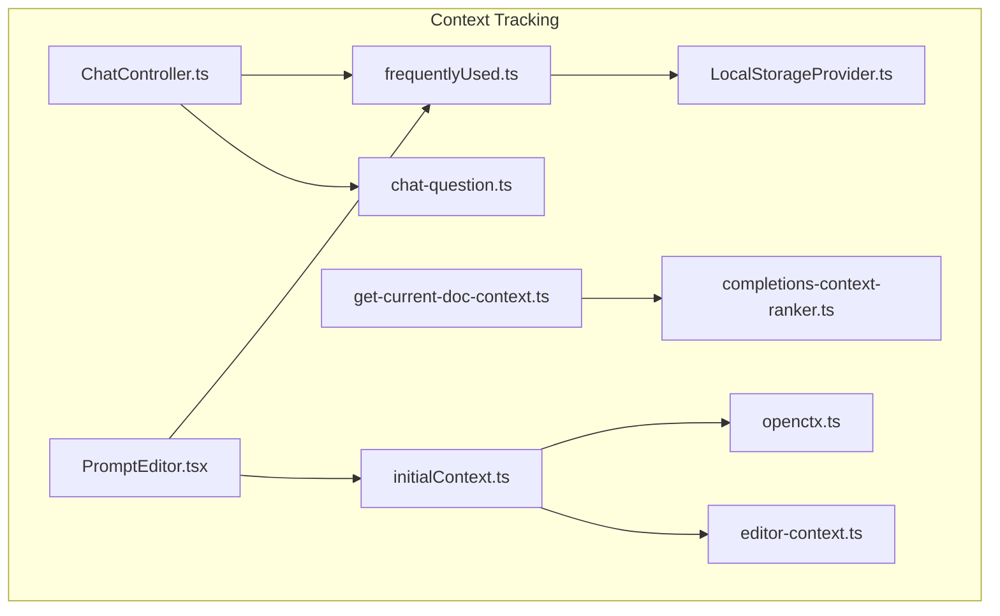
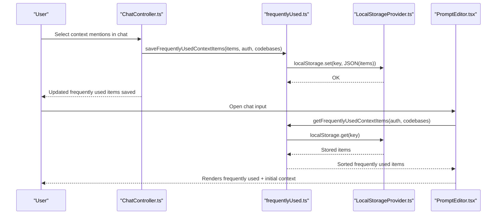
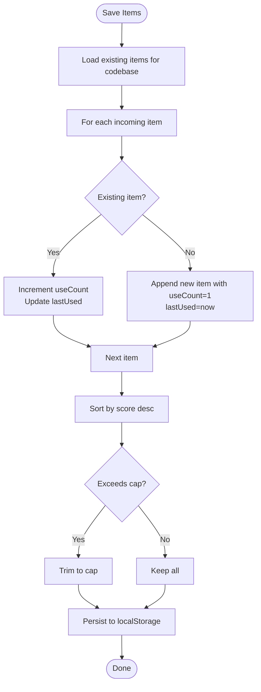
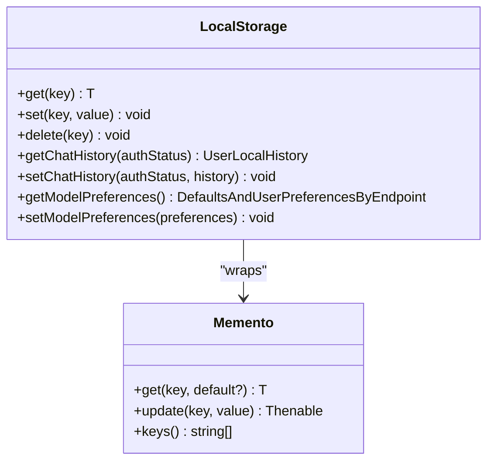
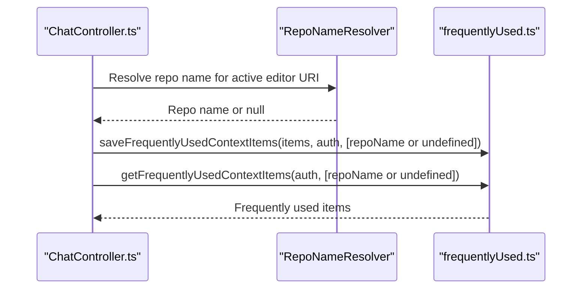
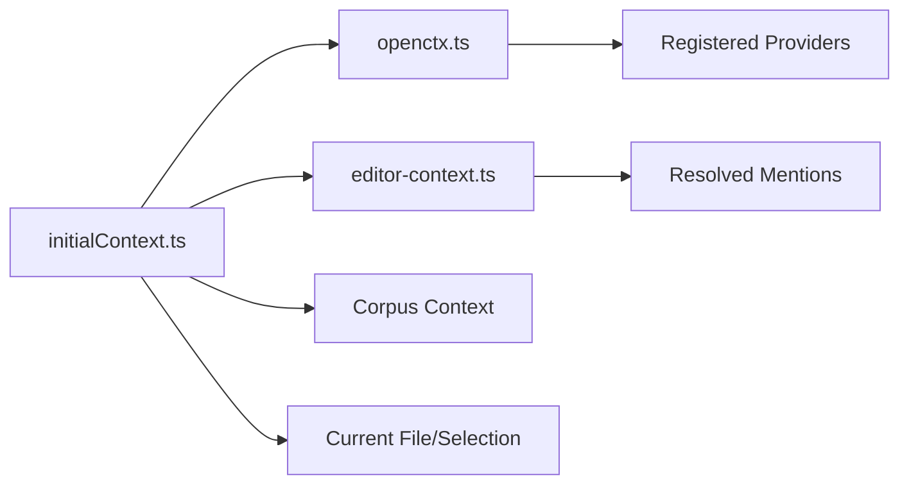
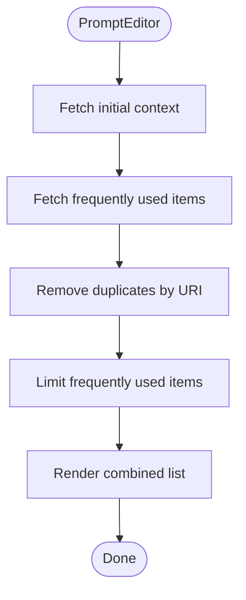
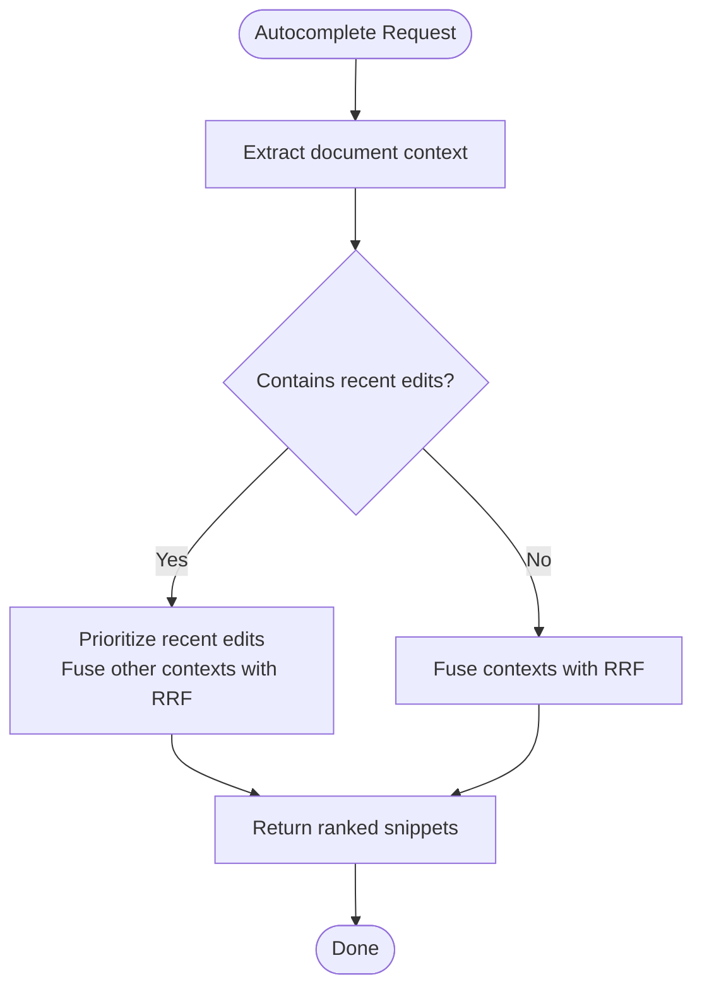
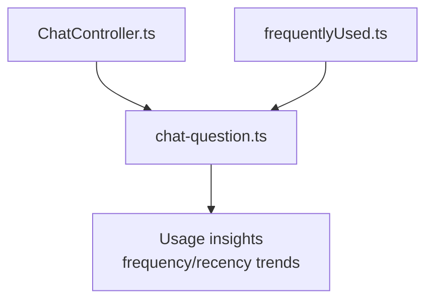
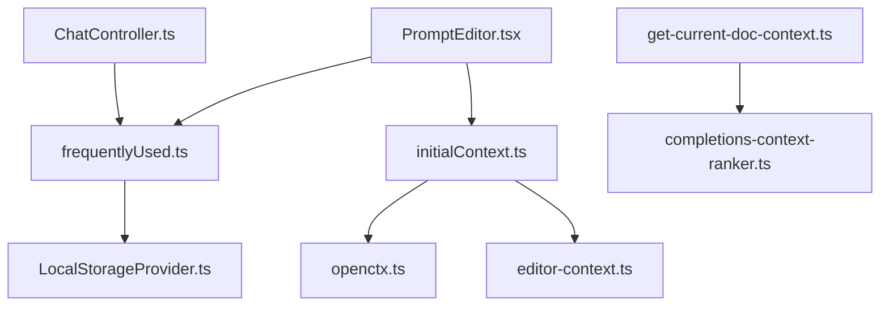

# Context Tracking & Usage

<cite>
**Referenced Files in This Document**
- [frequentlyUsed.ts](file://vscode/src/context/frequentlyUsed.ts)
- [LocalStorageProvider.ts](file://vscode/src/services/LocalStorageProvider.ts)
- [ChatController.ts](file://vscode/src/chat/chat-view/ChatController.ts)
- [initialContext.ts](file://vscode/src/chat/initialContext.ts)
- [openctx.ts](file://vscode/src/context/openctx.ts)
- [editor-context.ts](file://vscode/src/editor/utils/editor-context.ts)
- [PromptEditor.tsx](file://lib/prompt-editor/src/v2/PromptEditor.tsx)
- [get-current-doc-context.ts](file://vscode/src/completions/get-current-doc-context.ts)
- [completions-context-ranker.ts](file://vscode/src/completions/context/completions-context-ranker.ts)
- [chat-question.ts](file://lib/shared/src/telemetry-v2/events/chat-question.ts)
</cite>

## Table of Contents
1. [Introduction](#introduction)
2. [Project Structure](#project-structure)
3. [Core Components](#core-components)
4. [Architecture Overview](#architecture-overview)
5. [Detailed Component Analysis](#detailed-component-analysis)
6. [Dependency Analysis](#dependency-analysis)
7. [Performance Considerations](#performance-considerations)
8. [Troubleshooting Guide](#troubleshooting-guide)
9. [Privacy and Data Retention](#privacy-and-data-retention)
10. [Practical Usage Scenarios](#practical-usage-scenarios)
11. [Conclusion](#conclusion)

## Introduction
This document explains the context tracking and frequently used items system in the project. It covers how frequently used context items are detected, scored, persisted, and recommended; how they integrate with chat history, autocomplete suggestions, and code editing operations; and how personalization emerges from usage patterns. It also documents performance characteristics, caching and storage strategies, and privacy considerations.

## Project Structure
The context tracking system spans several modules:
- Frequently used items: serialization, scoring, persistence, and retrieval
- Local storage provider: centralized persistence backed by VS Code’s Memento
- Chat controller: persists and retrieves frequently used items during chat sessions
- Initial context pipeline: builds default context for chat input, including OpenCtx and corpus context
- OpenCtx integration: dynamic context providers and mentions
- Prompt editor: displays frequently used items alongside initial context
- Autocomplete context: document context extraction and ranking logic
- Telemetry: context usage summaries for analytics

**Diagram sources**
- [frequentlyUsed.ts:1-198](file://vscode/src/context/frequentlyUsed.ts#L1-L198)
- [LocalStorageProvider.ts:1-432](file://vscode/src/services/LocalStorageProvider.ts#L1-L432)
- [ChatController.ts:1044-1086](file://vscode/src/chat/chat-view/ChatController.ts#L1044-L1086)
- [initialContext.ts:68-119](file://vscode/src/chat/initialContext.ts#L68-L119)
- [openctx.ts:109-207](file://vscode/src/context/openctx.ts#L109-L207)
- [editor-context.ts:458-503](file://vscode/src/editor/utils/editor-context.ts#L458-L503)
- [PromptEditor.tsx:169-189](file://lib/prompt-editor/src/v2/PromptEditor.tsx#L169-L189)
- [get-current-doc-context.ts:37-104](file://vscode/src/completions/get-current-doc-context.ts#L37-L104)
- [completions-context-ranker.ts:69-97](file://vscode/src/completions/context/completions-context-ranker.ts#L69-L97)
- [chat-question.ts:177-203](file://lib/shared/src/telemetry-v2/events/chat-question.ts#L177-L203)

**Section sources**
- [frequentlyUsed.ts:1-198](file://vscode/src/context/frequentlyUsed.ts#L1-L198)
- [LocalStorageProvider.ts:1-432](file://vscode/src/services/LocalStorageProvider.ts#L1-L432)
- [ChatController.ts:1044-1086](file://vscode/src/chat/chat-view/ChatController.ts#L1044-L1086)
- [initialContext.ts:68-119](file://vscode/src/chat/initialContext.ts#L68-L119)
- [openctx.ts:109-207](file://vscode/src/context/openctx.ts#L109-L207)
- [editor-context.ts:458-503](file://vscode/src/editor/utils/editor-context.ts#L458-L503)
- [PromptEditor.tsx:169-189](file://lib/prompt-editor/src/v2/PromptEditor.tsx#L169-L189)
- [get-current-doc-context.ts:37-104](file://vscode/src/completions/get-current-doc-context.ts#L37-L104)
- [completions-context-ranker.ts:69-97](file://vscode/src/completions/context/completions-context-ranker.ts#L69-L97)
- [chat-question.ts:177-203](file://lib/shared/src/telemetry-v2/events/chat-question.ts#L177-L203)

## Core Components
- Frequently used items engine
  - Stores serialized context items with timestamps and use counts
  - Computes a composite score balancing frequency and recency
  - Persists per user and per codebase
  - Retrieves and deduplicates items across codebases
- Local storage provider
  - Centralized persistence using VS Code Memento
  - Provides chat history, model preferences, and other settings
- Chat controller integration
  - Saves user-selected context mentions as frequently used items
  - Loads frequently used items for chat input
- Initial context pipeline
  - Builds default context for chat input from current file, selection, corpus, and OpenCtx
- OpenCtx integration
  - Provider registration and dynamic mentions
  - Resolution of context items from providers
- Prompt editor integration
  - Shows frequently used items alongside initial context
  - Avoids duplicates between frequently used and initial context
- Autocomplete context
  - Extracts document context for completions
  - Ranks context snippets, including recent edits prioritization
- Telemetry
  - Summarizes context sources and types for analytics

**Section sources**
- [frequentlyUsed.ts:16-198](file://vscode/src/context/frequentlyUsed.ts#L16-L198)
- [LocalStorageProvider.ts:27-384](file://vscode/src/services/LocalStorageProvider.ts#L27-L384)
- [ChatController.ts:1044-1086](file://vscode/src/chat/chat-view/ChatController.ts#L1044-L1086)
- [initialContext.ts:68-119](file://vscode/src/chat/initialContext.ts#L68-L119)
- [openctx.ts:109-207](file://vscode/src/context/openctx.ts#L109-L207)
- [editor-context.ts:458-503](file://vscode/src/editor/utils/editor-context.ts#L458-L503)
- [PromptEditor.tsx:169-189](file://lib/prompt-editor/src/v2/PromptEditor.tsx#L169-L189)
- [get-current-doc-context.ts:37-104](file://vscode/src/completions/get-current-doc-context.ts#L37-L104)
- [completions-context-ranker.ts:69-97](file://vscode/src/completions/context/completions-context-ranker.ts#L69-L97)
- [chat-question.ts:177-203](file://lib/shared/src/telemetry-v2/events/chat-question.ts#L177-L203)

## Architecture Overview
The system combines local persistence with dynamic context providers to deliver personalized context suggestions.

**Diagram sources**
- [ChatController.ts:1044-1086](file://vscode/src/chat/chat-view/ChatController.ts#L1044-L1086)
- [frequentlyUsed.ts:144-198](file://vscode/src/context/frequentlyUsed.ts#L144-L198)
- [LocalStorageProvider.ts:354-372](file://vscode/src/services/LocalStorageProvider.ts#L354-L372)
- [PromptEditor.tsx:169-189](file://lib/prompt-editor/src/v2/PromptEditor.tsx#L169-L189)

## Detailed Component Analysis

### Frequently Used Items Engine
- Persistence keys
  - Keys are scoped by endpoint, username, and codebase to isolate data per user and repository
- Storage format
  - Serialized context items with lastUsed timestamp and useCount
- Scoring algorithm
  - Balances frequency and recency using a weighted combination
  - Exponential decay applied to recency to favor recent usage while preserving long-term signals
- Retrieval and filtering
  - Combines items across codebases, deduplicates by item identity, filters by query, sorts by score, and limits results
- Saving and eviction
  - Updates useCount and lastUsed for existing items; appends new items; sorts by score; evicts least relevant beyond a fixed cap

**Diagram sources**
- [frequentlyUsed.ts:144-198](file://vscode/src/context/frequentlyUsed.ts#L144-L198)

**Section sources**
- [frequentlyUsed.ts:22-198](file://vscode/src/context/frequentlyUsed.ts#L22-L198)

### Local Storage Provider
- Centralizes persistence using VS Code Memento
- Manages chat history, model preferences, endpoint history, and other settings
- Emits change events for reactive consumers

**Diagram sources**
- [LocalStorageProvider.ts:27-384](file://vscode/src/services/LocalStorageProvider.ts#L27-L384)

**Section sources**
- [LocalStorageProvider.ts:27-384](file://vscode/src/services/LocalStorageProvider.ts#L27-L384)

### Chat Controller Integration
- Saves frequently used items
  - Filters user-provided mentions
  - Serializes items and persists per authenticated user and current repository
- Loads frequently used items
  - Resolves current repository name and loads items scoped to that codebase

**Diagram sources**
- [ChatController.ts:1044-1086](file://vscode/src/chat/chat-view/ChatController.ts#L1044-L1086)
- [frequentlyUsed.ts:87-134](file://vscode/src/context/frequentlyUsed.ts#L87-L134)

**Section sources**
- [ChatController.ts:1044-1086](file://vscode/src/chat/chat-view/ChatController.ts#L1044-L1086)
- [frequentlyUsed.ts:87-134](file://vscode/src/context/frequentlyUsed.ts#L87-L134)

### Initial Context Pipeline and OpenCtx Integration
- Default context composition
  - Combines OpenCtx mentions, current file/selection, and corpus context
  - Applies feature flags to control inclusion of corpus items
- OpenCtx providers
  - Registers providers (web, rules, remote repository/file/directory, code search) depending on configuration and client capabilities
  - Supports merging viewer settings for provider configuration
- Dynamic mentions resolution
  - Resolves OpenCtx items into context items with content for use in chat

**Diagram sources**
- [initialContext.ts:68-119](file://vscode/src/chat/initialContext.ts#L68-L119)
- [openctx.ts:109-207](file://vscode/src/context/openctx.ts#L109-L207)
- [editor-context.ts:458-503](file://vscode/src/editor/utils/editor-context.ts#L458-L503)

**Section sources**
- [initialContext.ts:68-119](file://vscode/src/chat/initialContext.ts#L68-L119)
- [openctx.ts:109-207](file://vscode/src/context/openctx.ts#L109-L207)
- [editor-context.ts:458-503](file://vscode/src/editor/utils/editor-context.ts#L458-L503)

### Prompt Editor Integration
- Frequently used items rendering
  - Filters out frequently used items already present in initial context
  - Limits the number of frequently used items shown
- Search and de-duplication
  - Ensures no duplicate URIs between frequently used and initial context

**Diagram sources**
- [PromptEditor.tsx:169-189](file://lib/prompt-editor/src/v2/PromptEditor.tsx#L169-L189)

**Section sources**
- [PromptEditor.tsx:169-189](file://lib/prompt-editor/src/v2/PromptEditor.tsx#L169-L189)

### Autocomplete Context and Ranking
- Document context extraction
  - Builds prefix/suffix windows around cursor position
  - Handles injected completion text and rewrite scenarios
- Context ranking
  - Prioritizes recent edits when applicable
  - Uses reciprocal rank fusion (RRF) otherwise

**Diagram sources**
- [get-current-doc-context.ts:37-104](file://vscode/src/completions/get-current-doc-context.ts#L37-L104)
- [completions-context-ranker.ts:69-97](file://vscode/src/completions/context/completions-context-ranker.ts#L69-L97)

**Section sources**
- [get-current-doc-context.ts:37-104](file://vscode/src/completions/get-current-doc-context.ts#L37-L104)
- [completions-context-ranker.ts:69-97](file://vscode/src/completions/context/completions-context-ranker.ts#L69-L97)

### Telemetry and Personalization
- Context usage summary
  - Aggregates counts by source and type for analytics
- Personalization signals
  - Frequent items reflect user intent and improve relevance in chat and autocomplete

**Diagram sources**
- [ChatController.ts:1044-1086](file://vscode/src/chat/chat-view/ChatController.ts#L1044-L1086)
- [chat-question.ts:177-203](file://lib/shared/src/telemetry-v2/events/chat-question.ts#L177-L203)
- [frequentlyUsed.ts:64-77](file://vscode/src/context/frequentlyUsed.ts#L64-L77)

**Section sources**
- [chat-question.ts:177-203](file://lib/shared/src/telemetry-v2/events/chat-question.ts#L177-L203)
- [frequentlyUsed.ts:64-77](file://vscode/src/context/frequentlyUsed.ts#L64-L77)

## Dependency Analysis
- Cohesion and coupling
  - Frequently used items are cohesive around scoring and persistence
  - Chat controller depends on frequently used items and repository resolution
  - Initial context pipeline depends on OpenCtx and editor context
  - Prompt editor depends on both initial context and frequently used items
- External dependencies
  - OpenCtx providers and controller
  - VS Code Memento for persistence
  - Observable streams for reactive updates

**Diagram sources**
- [frequentlyUsed.ts:1-198](file://vscode/src/context/frequentlyUsed.ts#L1-L198)
- [LocalStorageProvider.ts:1-432](file://vscode/src/services/LocalStorageProvider.ts#L1-L432)
- [ChatController.ts:1044-1086](file://vscode/src/chat/chat-view/ChatController.ts#L1044-L1086)
- [initialContext.ts:68-119](file://vscode/src/chat/initialContext.ts#L68-L119)
- [openctx.ts:109-207](file://vscode/src/context/openctx.ts#L109-L207)
- [editor-context.ts:458-503](file://vscode/src/editor/utils/editor-context.ts#L458-L503)
- [PromptEditor.tsx:169-189](file://lib/prompt-editor/src/v2/PromptEditor.tsx#L169-L189)
- [get-current-doc-context.ts:37-104](file://vscode/src/completions/get-current-doc-context.ts#L37-L104)
- [completions-context-ranker.ts:69-97](file://vscode/src/completions/context/completions-context-ranker.ts#L69-L97)

**Section sources**
- [frequentlyUsed.ts:1-198](file://vscode/src/context/frequentlyUsed.ts#L1-L198)
- [ChatController.ts:1044-1086](file://vscode/src/chat/chat-view/ChatController.ts#L1044-L1086)
- [initialContext.ts:68-119](file://vscode/src/chat/initialContext.ts#L68-L119)
- [openctx.ts:109-207](file://vscode/src/context/openctx.ts#L109-L207)
- [PromptEditor.tsx:169-189](file://lib/prompt-editor/src/v2/PromptEditor.tsx#L169-L189)
- [get-current-doc-context.ts:37-104](file://vscode/src/completions/get-current-doc-context.ts#L37-L104)
- [completions-context-ranker.ts:69-97](file://vscode/src/completions/context/completions-context-ranker.ts#L69-L97)

## Performance Considerations
- Storage and retrieval
  - Items are stored per user and per codebase to minimize cross-user noise and reduce key scans
  - Retrieval merges across codebases, deduplicates, and sorts; capped results limit UI overhead
- Scoring and sorting
  - Sorting by score is O(n log n); capped results bound worst-case cost
- Autocomplete context
  - Prefix/suffix truncation and derived context computation are linear in window sizes
  - Recent edits prioritization avoids expensive recomputation when recent edits are absent
- Memory and cache
  - Local storage is backed by VS Code Memento; changes emit events for reactive updates
- Large codebases
  - Use codebase scoping to limit frequently used items to the active repository
  - Deduplicate by item identity to avoid redundant processing

[No sources needed since this section provides general guidance]

## Troubleshooting Guide
- Items not persisting
  - Verify authentication status and that the user is authenticated before saving
  - Confirm repository resolution succeeds for the active editor
- Items not appearing in chat input
  - Ensure frequently used items are loaded for the current codebase
  - Check that the prompt editor filters duplicates against initial context
- OpenCtx mentions not included
  - Confirm OpenCtx controller is available and providers are registered
  - Verify that auto-include providers are configured and active
- Autocomplete context anomalies
  - Validate document context extraction for the current cursor position
  - Check recent edits prioritization logic when recent edits are present

**Section sources**
- [ChatController.ts:1044-1086](file://vscode/src/chat/chat-view/ChatController.ts#L1044-L1086)
- [PromptEditor.tsx:169-189](file://lib/prompt-editor/src/v2/PromptEditor.tsx#L169-L189)
- [openctx.ts:109-207](file://vscode/src/context/openctx.ts#L109-L207)
- [get-current-doc-context.ts:37-104](file://vscode/src/completions/get-current-doc-context.ts#L37-L104)

## Privacy and Data Retention
- Data scope
  - Items are stored per authenticated user and per codebase, minimizing cross-user exposure
- Local-first storage
  - Items are persisted locally using VS Code Memento; no server-side synchronization occurs for frequently used items
- User control
  - Items are keyed per endpoint and username; clearing storage removes all items for that user
  - No explicit retention policy is enforced; items persist until storage is cleared
- Recommendations
  - Encourage users to sign out or clear storage to remove personal context data
  - Consider adding a manual clear action for frequently used items in the UI

**Section sources**
- [frequentlyUsed.ts:22-27](file://vscode/src/context/frequentlyUsed.ts#L22-L27)
- [LocalStorageProvider.ts:354-372](file://vscode/src/services/LocalStorageProvider.ts#L354-L372)

## Practical Usage Scenarios
- Bug fixing
  - User selects relevant files and symbols from initial context and OpenCtx
  - Frequently used items surface these selections quickly for subsequent prompts
- Feature development
  - Developer iteratively refines prompts with frequently used items and corpus context
  - Autocomplete context extraction supports incremental code changes
- Code review
  - Reviewer uses frequently used items to recall relevant files and recent edits
  - OpenCtx providers can surface related issues or documentation

[No sources needed since this section doesn't analyze specific files]

## Conclusion
The context tracking and frequently used items system provides a robust, local-first mechanism for personalizing chat and autocomplete experiences. By combining usage-based scoring, per-user and per-codebase persistence, and integration with dynamic context providers, it improves relevance and reduces friction across common development workflows. Performance is optimized through capped results, deduplication, and efficient scoring, while privacy is preserved through local storage and scoped keys.