# External Context Providers

<cite>
**Referenced Files in This Document**
- [openctx.ts](file://vscode/src/context/openctx.ts)
- [openctx.test.ts](file://vscode/src/context/openctx.test.ts)
- [codeSearch.ts](file://vscode/src/context/openctx/codeSearch.ts)
- [git.ts](file://vscode/src/context/openctx/git.ts)
- [web.ts](file://vscode/src/context/openctx/web.ts)
- [remoteRepositorySearch.ts](file://vscode/src/context/openctx/remoteRepositorySearch.ts)
- [remoteDirectorySearch.ts](file://vscode/src/context/openctx/remoteDirectorySearch.ts)
- [remoteFileSearch.ts](file://vscode/src/context/openctx/remoteFileSearch.ts)
- [rules.ts](file://vscode/src/context/openctx/rules.ts)
- [linear-issues.ts](file://vscode/src/context/openctx/linear-issues.ts)
- [get-repository-mentions.ts](file://vscode/src/context/openctx/common/get-repository-mentions.ts)
- [context.ts](file://lib/shared/src/context/openctx/context.ts)
- [api.ts](file://lib/shared/src/context/openctx/api.ts)
- [types.ts](file://vscode/src/context/openctx/types.ts)
</cite>

## Table of Contents
1. [Introduction](#introduction)
2. [Project Structure](#project-structure)
3. [Core Components](#core-components)
4. [Architecture Overview](#architecture-overview)
5. [Detailed Component Analysis](#detailed-component-analysis)
6. [Dependency Analysis](#dependency-analysis)
7. [Performance Considerations](#performance-considerations)
8. [Troubleshooting Guide](#troubleshooting-guide)
9. [Conclusion](#conclusion)
10. [Appendices](#appendices)

## Introduction
This document explains how external context providers integrate with the OpenCtx protocol in the application. It covers the OpenCtx integration architecture, provider registration, context fetching mechanisms, and the built-in providers for code search, Git repository integration, web search, and remote directory access. It also documents provider configuration, authentication handling, rate limiting considerations, practical usage examples, and the relationship between external providers and local indexing for comprehensive codebase search.

## Project Structure
The OpenCtx integration is implemented primarily under the OpenCtx module in the VS Code extension, with shared APIs and context orchestration in the shared library. The key areas are:
- Provider registration and controller lifecycle
- Built-in providers (web, code search, Git, remote repository/file/directory, rules, Linear issues)
- Shared OpenCtx client controller and context retrieval utilities
- Common repository mention utilities

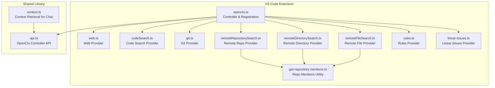

**Diagram sources**
- [openctx.ts:46-105](file://vscode/src/context/openctx.ts#L46-L105)
- [web.ts:8-38](file://vscode/src/context/openctx/web.ts#L8-L38)
- [codeSearch.ts:35-65](file://vscode/src/context/openctx/codeSearch.ts#L35-L65)
- [git.ts:25-130](file://vscode/src/context/openctx/git.ts#L25-L130)
- [remoteRepositorySearch.ts:14-56](file://vscode/src/context/openctx/remoteRepositorySearch.ts#L14-L56)
- [remoteDirectorySearch.ts:12-44](file://vscode/src/context/openctx/remoteDirectorySearch.ts#L12-L44)
- [remoteFileSearch.ts:17-49](file://vscode/src/context/openctx/remoteFileSearch.ts#L17-L49)
- [rules.ts:20-79](file://vscode/src/context/openctx/rules.ts#L20-L79)
- [linear-issues.ts:4-10](file://vscode/src/context/openctx/linear-issues.ts#L4-L10)
- [get-repository-mentions.ts:35-90](file://vscode/src/context/openctx/common/get-repository-mentions.ts#L35-L90)
- [api.ts:6-41](file://lib/shared/src/context/openctx/api.ts#L6-L41)
- [context.ts:6-75](file://lib/shared/src/context/openctx/context.ts#L6-L75)

**Section sources**
- [openctx.ts:46-105](file://vscode/src/context/openctx.ts#L46-L105)
- [api.ts:6-41](file://lib/shared/src/context/openctx/api.ts#L6-L41)
- [context.ts:6-75](file://lib/shared/src/context/openctx/context.ts#L6-L75)

## Core Components
- OpenCtx controller lifecycle and provider registration
- Built-in providers and their capabilities
- Shared OpenCtx controller API and context retrieval pipeline
- Common repository mention utilities

Key responsibilities:
- Register providers based on configuration, authentication status, and feature flags
- Provide context items to the chat pipeline via the shared controller
- Fetch and transform data from GraphQL and external systems

**Section sources**
- [openctx.ts:109-207](file://vscode/src/context/openctx.ts#L109-L207)
- [openctx.ts:209-255](file://vscode/src/context/openctx.ts#L209-L255)
- [api.ts:6-41](file://lib/shared/src/context/openctx/api.ts#L6-L41)
- [context.ts:6-75](file://lib/shared/src/context/openctx/context.ts#L6-L75)

## Architecture Overview
The OpenCtx integration centers on a controller that manages provider lifecycles and exposes meta, mentions, and items APIs. Providers are registered conditionally based on:
- Authentication status and endpoint type (dotCom vs enterprise)
- Client configuration (e.g., omni box enabled)
- Feature flags (e.g., Git mentions)
- Site version compatibility for advanced features

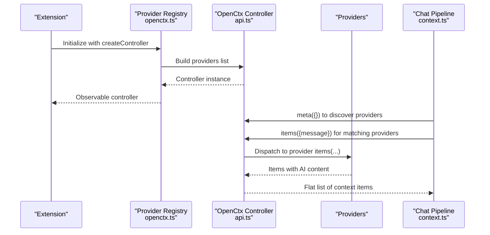

**Diagram sources**
- [openctx.ts:50-105](file://vscode/src/context/openctx.ts#L50-L105)
- [api.ts:6-41](file://lib/shared/src/context/openctx/api.ts#L6-L41)
- [context.ts:7-75](file://lib/shared/src/context/openctx/context.ts#L7-L75)

## Detailed Component Analysis

### OpenCtx Controller and Provider Registration
- Creates the OpenCtx controller with provider configurations
- Merges user-provided configuration from the Sourcegraph instance when enabled
- Registers providers differently for VS Code and Cody Web environments
- Conditionally enables providers based on auth, site version, and feature flags

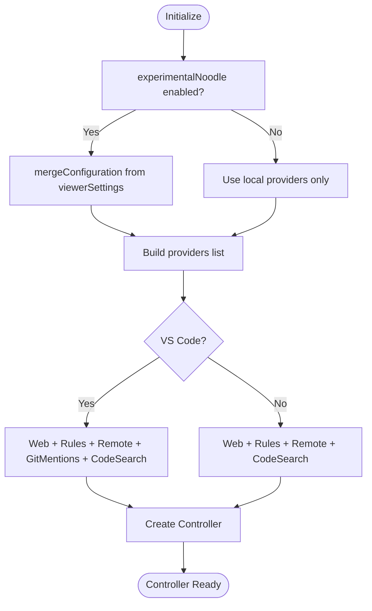

**Diagram sources**
- [openctx.ts:50-105](file://vscode/src/context/openctx.ts#L50-L105)
- [openctx.ts:109-207](file://vscode/src/context/openctx.ts#L109-L207)
- [openctx.ts:209-255](file://vscode/src/context/openctx.ts#L209-L255)
- [openctx.ts:257-297](file://vscode/src/context/openctx.ts#L257-L297)

**Section sources**
- [openctx.ts:50-105](file://vscode/src/context/openctx.ts#L50-L105)
- [openctx.ts:109-207](file://vscode/src/context/openctx.ts#L109-L207)
- [openctx.ts:209-255](file://vscode/src/context/openctx.ts#L209-L255)
- [openctx.ts:257-297](file://vscode/src/context/openctx.ts#L257-L297)

### Built-in Providers

#### Web Provider
- Fetches content from a URL and returns it as an AI-readable item
- Supports proxy mode via GraphQL client and direct fetch mode with sanitization
- Provides mention suggestions for typed URLs

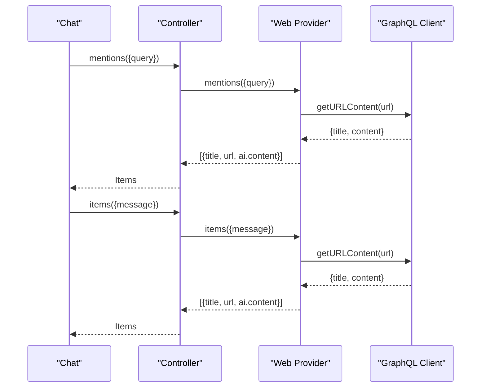

**Diagram sources**
- [web.ts:8-38](file://vscode/src/context/openctx/web.ts#L8-L38)
- [web.ts:40-94](file://vscode/src/context/openctx/web.ts#L40-L94)

**Section sources**
- [web.ts:8-38](file://vscode/src/context/openctx/web.ts#L8-L38)
- [web.ts:40-94](file://vscode/src/context/openctx/web.ts#L40-L94)

#### Code Search Provider
- Converts code search results into context items
- Fetches file content from GraphQL and constructs AI-readable items
- Exposes a context item creator for embedding search results

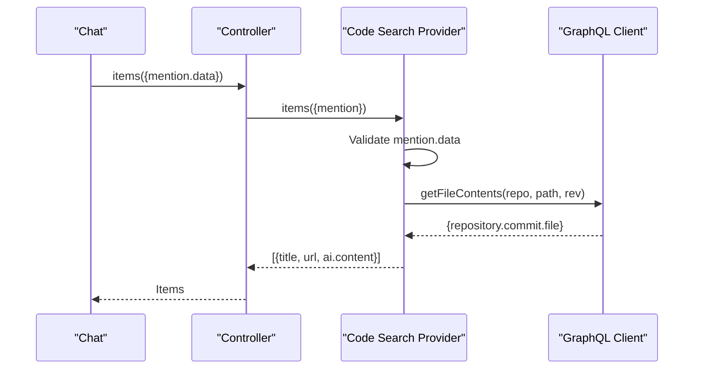

**Diagram sources**
- [codeSearch.ts:35-65](file://vscode/src/context/openctx/codeSearch.ts#L35-L65)
- [codeSearch.ts:67-91](file://vscode/src/context/openctx/codeSearch.ts#L67-L91)

**Section sources**
- [codeSearch.ts:35-65](file://vscode/src/context/openctx/codeSearch.ts#L35-L65)
- [codeSearch.ts:67-91](file://vscode/src/context/openctx/codeSearch.ts#L67-L91)
- [codeSearch.ts:101-127](file://vscode/src/context/openctx/codeSearch.ts#L101-L127)

#### Git Provider
- Generates mentions for Git repository diffs and uncommitted changes
- Executes Git commands to produce diffs and commit logs
- Parses custom mention URIs to route to appropriate handlers

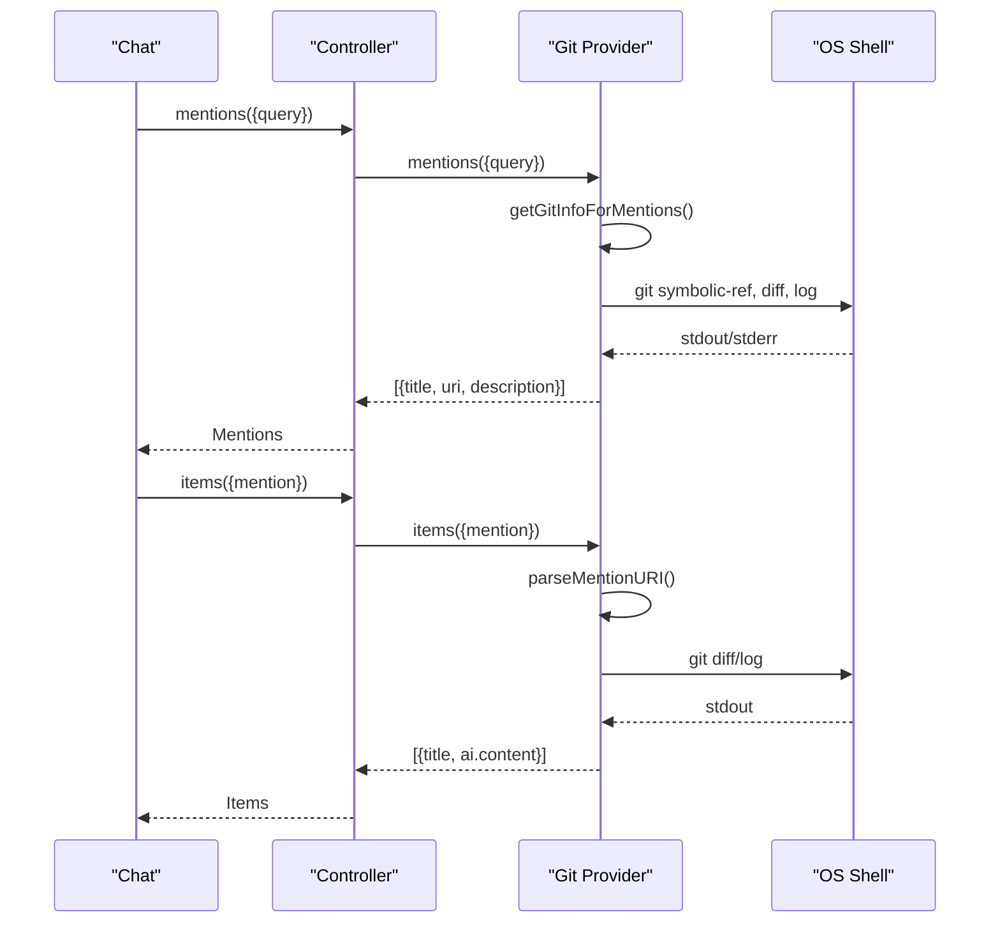

**Diagram sources**
- [git.ts:25-130](file://vscode/src/context/openctx/git.ts#L25-L130)
- [git.ts:147-175](file://vscode/src/context/openctx/git.ts#L147-L175)
- [git.ts:183-225](file://vscode/src/context/openctx/git.ts#L183-L225)

**Section sources**
- [git.ts:25-130](file://vscode/src/context/openctx/git.ts#L25-L130)
- [git.ts:147-175](file://vscode/src/context/openctx/git.ts#L147-L175)
- [git.ts:183-225](file://vscode/src/context/openctx/git.ts#L183-L225)

#### Remote Repository Provider
- Suggests repositories and performs context search within a selected repository
- Uses repository mention utilities and GraphQL context search

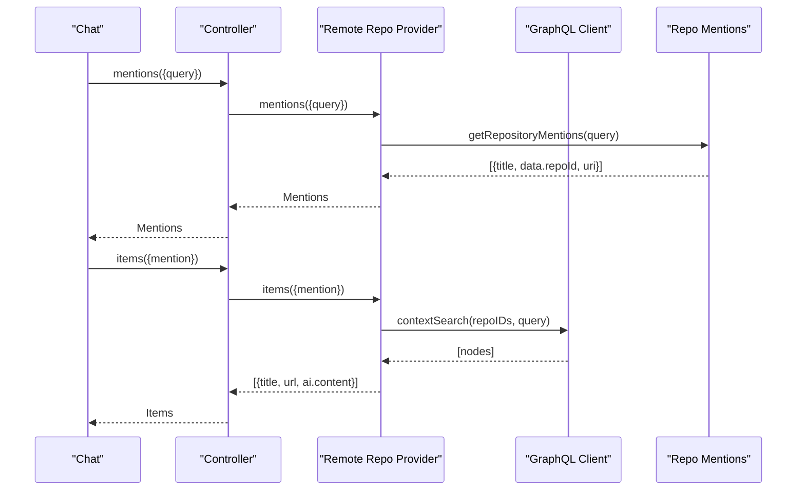

**Diagram sources**
- [remoteRepositorySearch.ts:14-56](file://vscode/src/context/openctx/remoteRepositorySearch.ts#L14-L56)
- [get-repository-mentions.ts:35-90](file://vscode/src/context/openctx/common/get-repository-mentions.ts#L35-L90)

**Section sources**
- [remoteRepositorySearch.ts:14-56](file://vscode/src/context/openctx/remoteRepositorySearch.ts#L14-L56)
- [get-repository-mentions.ts:35-90](file://vscode/src/context/openctx/common/get-repository-mentions.ts#L35-L90)

#### Remote Directory Provider
- Suggests directories within repositories and retrieves directory contents
- Builds file patterns for context search and returns AI-readable items

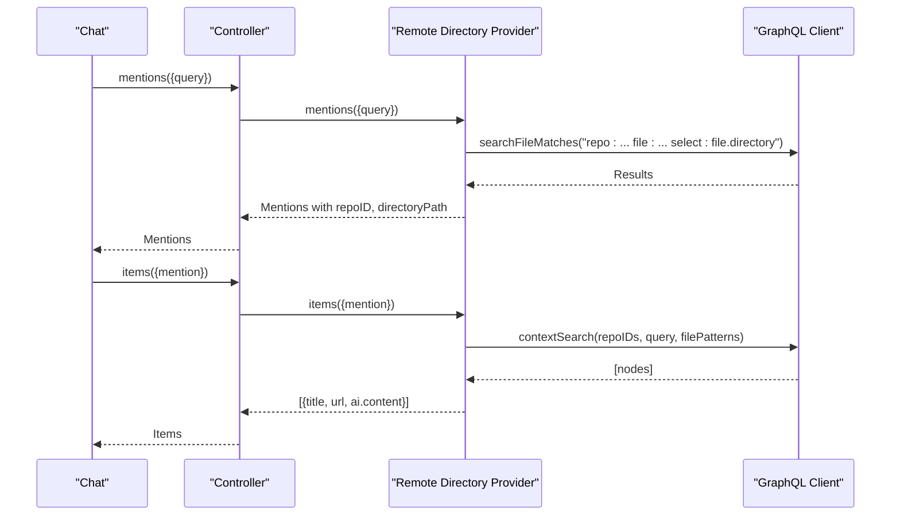

**Diagram sources**
- [remoteDirectorySearch.ts:12-44](file://vscode/src/context/openctx/remoteDirectorySearch.ts#L12-L44)
- [remoteDirectorySearch.ts:84-105](file://vscode/src/context/openctx/remoteDirectorySearch.ts#L84-L105)

**Section sources**
- [remoteDirectorySearch.ts:12-44](file://vscode/src/context/openctx/remoteDirectorySearch.ts#L12-L44)
- [remoteDirectorySearch.ts:84-105](file://vscode/src/context/openctx/remoteDirectorySearch.ts#L84-L105)

#### Remote File Provider
- Suggests files within repositories and fetches file content
- Escapes regex patterns for precise matching

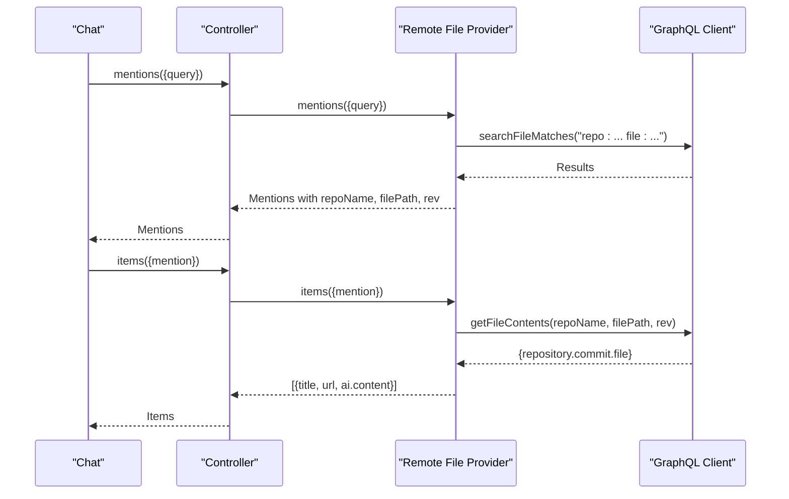

**Diagram sources**
- [remoteFileSearch.ts:17-49](file://vscode/src/context/openctx/remoteFileSearch.ts#L17-L49)
- [remoteFileSearch.ts:88-112](file://vscode/src/context/openctx/remoteFileSearch.ts#L88-L112)

**Section sources**
- [remoteFileSearch.ts:17-49](file://vscode/src/context/openctx/remoteFileSearch.ts#L17-L49)
- [remoteFileSearch.ts:88-112](file://vscode/src/context/openctx/remoteFileSearch.ts#L88-L112)

#### Rules Provider
- Automatically includes applicable rules for the current file or workspace root
- Transforms rules into context items with instructions

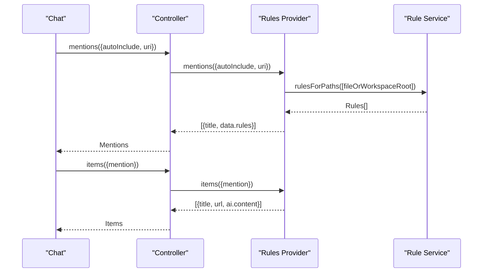

**Diagram sources**
- [rules.ts:20-79](file://vscode/src/context/openctx/rules.ts#L20-L79)

**Section sources**
- [rules.ts:20-79](file://vscode/src/context/openctx/rules.ts#L20-L79)

#### Linear Issues Provider
- Integrates with the external Linear issues OpenCtx provider
- Acts as a thin wrapper exposing the provider with a dedicated provider URI

**Section sources**
- [linear-issues.ts:4-10](file://vscode/src/context/openctx/linear-issues.ts#L4-L10)

### Context Retrieval Pipeline
The shared context retrieval pipeline:
- Discovers providers via controller meta
- Filters providers by message selectors
- Collects items from matching providers
- Normalizes items into context items with AI content

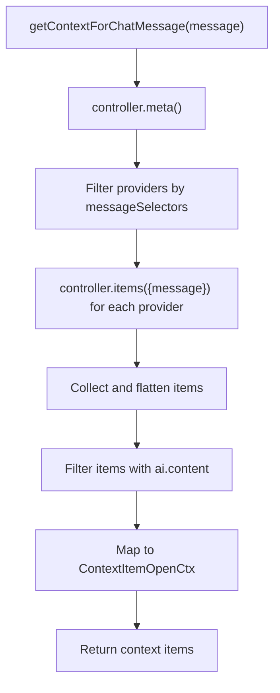

**Diagram sources**
- [context.ts:7-75](file://lib/shared/src/context/openctx/context.ts#L7-L75)

**Section sources**
- [context.ts:7-75](file://lib/shared/src/context/openctx/context.ts#L7-L75)

## Dependency Analysis
- Provider registration depends on:
  - Authentication status and endpoint type
  - Client configuration (omni box enabled)
  - Feature flags (e.g., Git mentions)
  - Site version compatibility for advanced features
- Providers depend on:
  - GraphQL client for remote data
  - Shared utilities for repository mentions and fuzzy matching
  - OS shell for Git operations (in Git provider)
- Context retrieval depends on:
  - Global OpenCtx controller observable
  - Provider message selectors

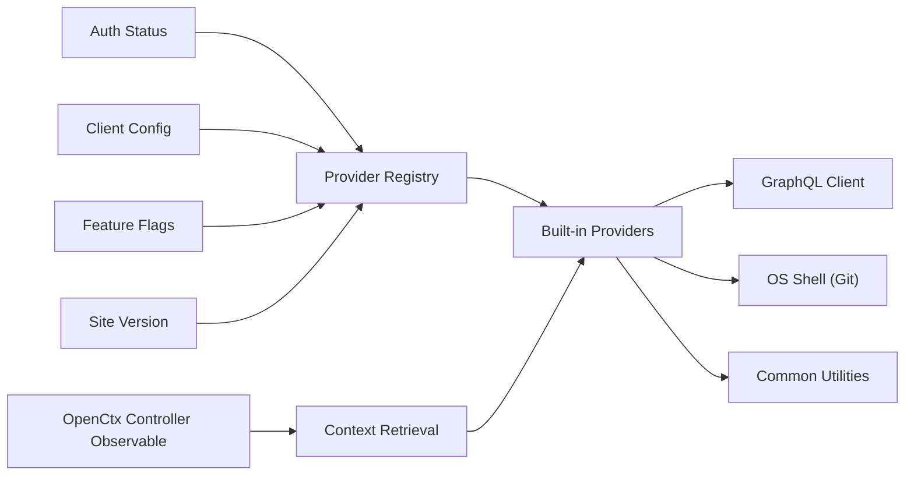

**Diagram sources**
- [openctx.ts:109-207](file://vscode/src/context/openctx.ts#L109-L207)
- [openctx.ts:209-255](file://vscode/src/context/openctx.ts#L209-L255)
- [context.ts:7-75](file://lib/shared/src/context/openctx/context.ts#L7-L75)

**Section sources**
- [openctx.ts:109-207](file://vscode/src/context/openctx.ts#L109-L207)
- [openctx.ts:209-255](file://vscode/src/context/openctx.ts#L209-L255)
- [context.ts:7-75](file://lib/shared/src/context/openctx/context.ts#L7-L75)

## Performance Considerations
- Web provider content truncation: The web provider truncates fetched content to avoid overwhelming the context window for the LLM.
- Repository fuzzy matching: Repository suggestions use fuzzy matching with tiebreakers to prioritize relevant results efficiently.
- Conditional provider loading: Providers are only registered when relevant, reducing overhead.
- Abort handling: The context retrieval pipeline respects abort signals to cancel long-running operations gracefully.

[No sources needed since this section provides general guidance]

## Troubleshooting Guide
- OpenCtx extension conflict: The integration warns and directs users to disable the external OpenCtx extension when both are present.
- Provider initialization failures: Initialization errors are logged and surfaced to aid debugging.
- Mention URI parsing errors: Git provider validates and parses mention URIs, logging invalid URIs for inspection.
- Rate limiting and timeouts: While explicit rate limiting is not implemented in the providers, the web provider uses timeouts for direct fetch mode and relies on GraphQL client error handling for proxy mode.

**Section sources**
- [openctx.ts:299-309](file://vscode/src/context/openctx.ts#L299-L309)
- [git.ts:191-214](file://vscode/src/context/openctx/git.ts#L191-L214)
- [web.ts:40-94](file://vscode/src/context/openctx/web.ts#L40-L94)

## Conclusion
The OpenCtx integration provides a flexible, extensible framework for bringing external context into the chat pipeline. Providers are registered dynamically based on configuration and environment, and the shared controller orchestrates discovery, mentions, and item retrieval. Built-in providers cover web content, code search, Git repository insights, and remote repository/file/directory access, with optional rules and Linear integration. The design supports graceful error handling, abort signals, and performance-conscious content shaping.

[No sources needed since this section summarizes without analyzing specific files]

## Appendices

### Provider Configuration and Authentication
- Provider registration is driven by:
  - Authentication status and endpoint type
  - Client configuration toggles (e.g., omni box)
  - Feature flags (e.g., Git mentions)
  - Site version checks for advanced features
- Authentication affects availability of enterprise-only providers and site version-dependent features.

**Section sources**
- [openctx.ts:109-207](file://vscode/src/context/openctx.ts#L109-L207)
- [openctx.ts:209-255](file://vscode/src/context/openctx.ts#L209-L255)

### Practical Usage Examples
- Web URL context: Type or paste a URL; the Web provider suggests and fetches content for the LLM.
- Code search context: Trigger code search results; the Code Search provider converts results into context items.
- Git diff context: Use Git provider mentions to include diffs vs. default branch or uncommitted changes.
- Remote repository/file/directory context: Select a repository or directory to search and include matching files as context.

**Section sources**
- [web.ts:8-38](file://vscode/src/context/openctx/web.ts#L8-L38)
- [codeSearch.ts:35-65](file://vscode/src/context/openctx/codeSearch.ts#L35-L65)
- [git.ts:25-130](file://vscode/src/context/openctx/git.ts#L25-L130)
- [remoteRepositorySearch.ts:14-56](file://vscode/src/context/openctx/remoteRepositorySearch.ts#L14-L56)
- [remoteDirectorySearch.ts:12-44](file://vscode/src/context/openctx/remoteDirectorySearch.ts#L12-L44)
- [remoteFileSearch.ts:17-49](file://vscode/src/context/openctx/remoteFileSearch.ts#L17-L49)

### Context Filtering, Relevance Scoring, and Result Merging
- Filtering: Providers are filtered by message selectors matched against the chat message.
- Relevance scoring: Repository suggestions use fuzzy matching with tiebreakers to prioritize results.
- Result merging: Items from multiple providers are flattened and normalized into context items with AI content.

**Section sources**
- [context.ts:7-75](file://lib/shared/src/context/openctx/context.ts#L7-L75)
- [get-repository-mentions.ts:20-24](file://vscode/src/context/openctx/common/get-repository-mentions.ts#L20-L24)

### Relationship Between External Providers and Local Indexing
- External providers augment context with remote data (web pages, repositories, files, Git diffs).
- Local indexing complements external providers by enabling fast, offline search within the workspace.
- Together, they provide comprehensive codebase search and contextual awareness across local and remote sources.

[No sources needed since this section provides general guidance]