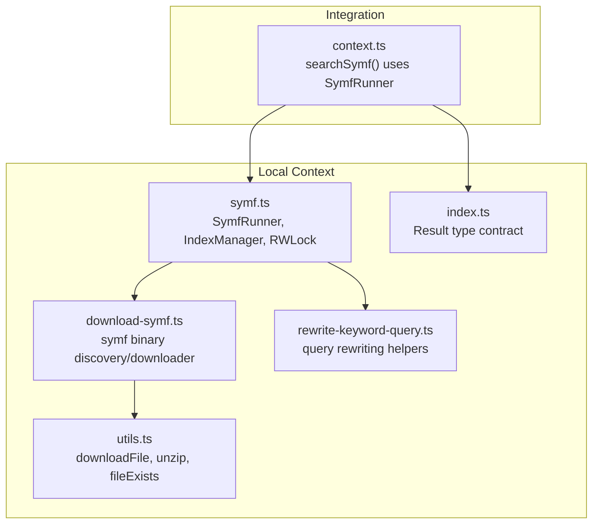
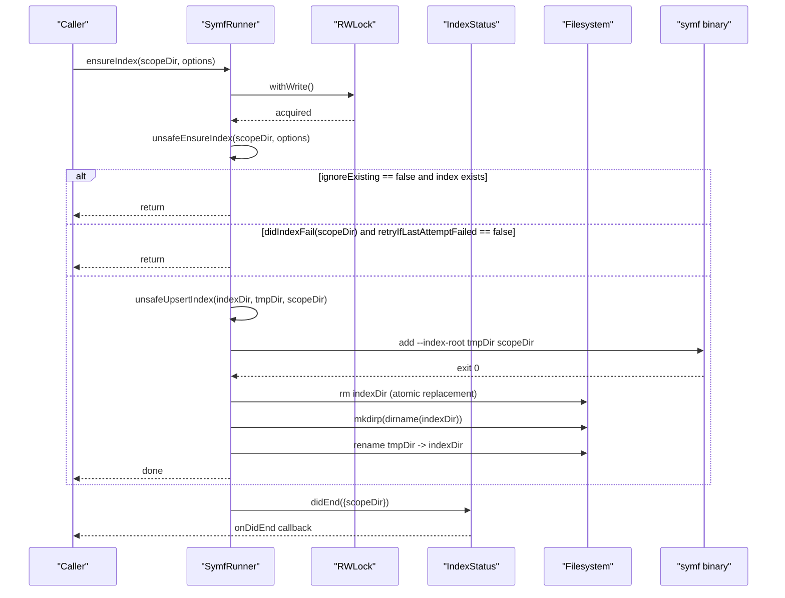
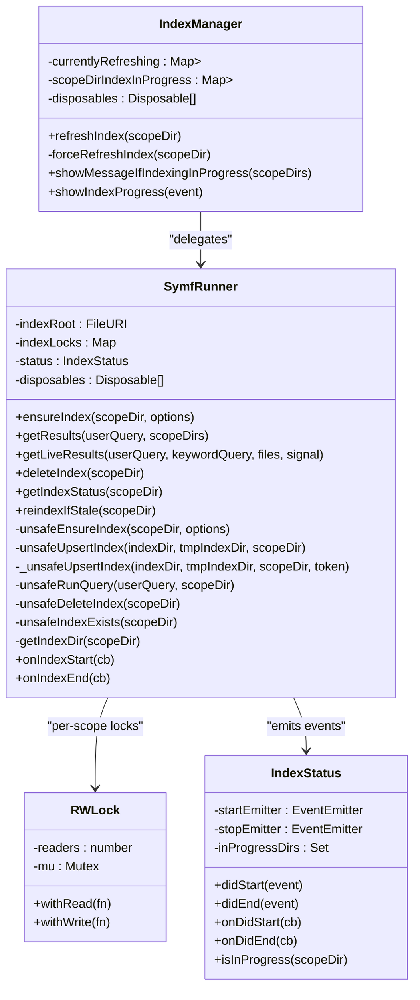
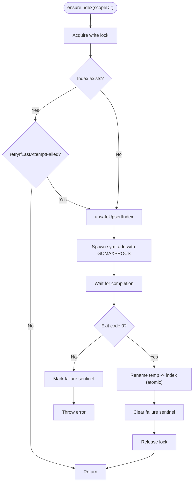
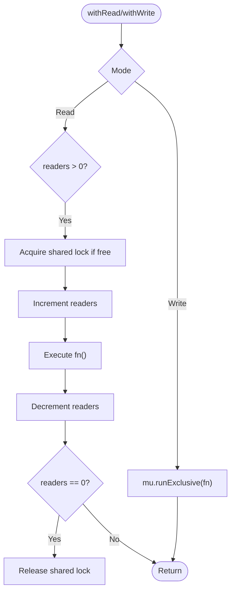
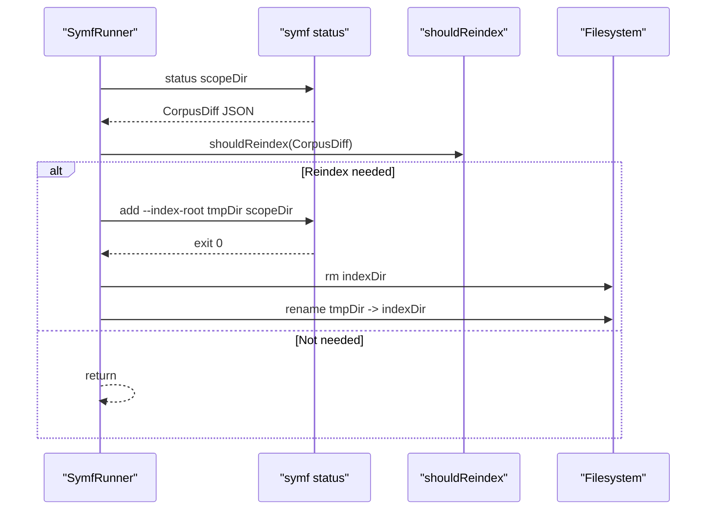
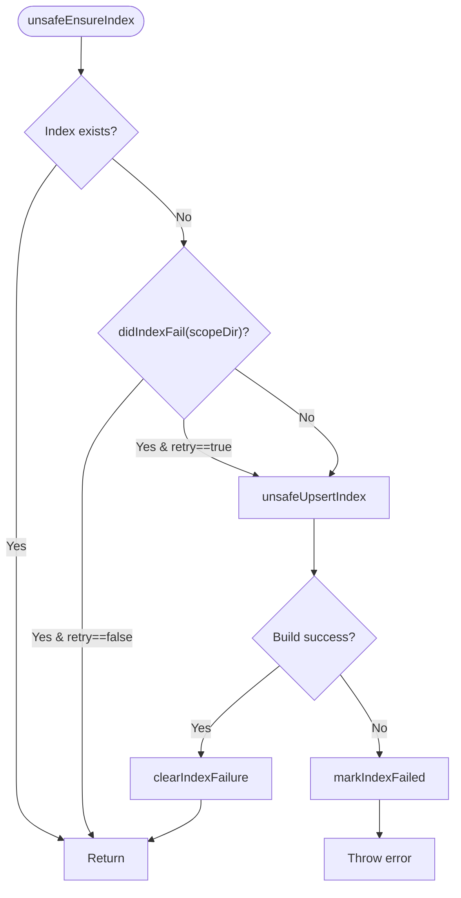
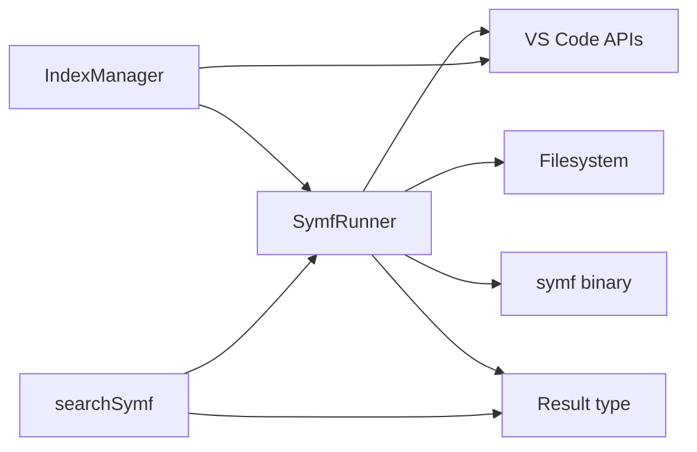

# Local Indexing System

<cite>
**Referenced Files in This Document**
- [symf.ts](file://vscode/src/local-context/symf.ts)
- [download-symf.ts](file://vscode/src/local-context/download-symf.ts)
- [utils.ts](file://vscode/src/local-context/utils.ts)
- [rewrite-keyword-query.ts](file://vscode/src/local-context/rewrite-keyword-query.ts)
- [context.ts](file://vscode/src/chat/chat-view/context.ts)
- [index.ts](file://lib/shared/src/local-context/index.ts)
- [symf.test.ts](file://vscode/src/local-context/symf.test.ts)
</cite>

## Table of Contents
1. [Introduction](#introduction)
2. [Project Structure](#project-structure)
3. [Core Components](#core-components)
4. [Architecture Overview](#architecture-overview)
5. [Detailed Component Analysis](#detailed-component-analysis)
6. [Dependency Analysis](#dependency-analysis)
7. [Performance Considerations](#performance-considerations)
8. [Troubleshooting Guide](#troubleshooting-guide)
9. [Conclusion](#conclusion)
10. [Appendices](#appendices)

## Introduction
This document explains the local indexing system powered by symf. It covers the SymfRunner class architecture, index lifecycle management, concurrent read-write locking, indexing process (file scanning, corpus diff detection, atomic replacement), index status tracking, failure handling and recovery, practical operations (create, delete, maintain), performance optimizations (CPU limiting, memory management, parallelism), workspace folder management and multi-root support, index freshness detection, and the relationship between indexing and context retrieval performance.

## Project Structure
The local indexing system is implemented primarily in the VS Code extension under the local-context module. Supporting modules include download and utility helpers, and the chat context integration that consumes indexed results.

**Diagram sources**
- [symf.ts:64-104](file://vscode/src/local-context/symf.ts#L64-L104)
- [download-symf.ts:28-60](file://vscode/src/local-context/download-symf.ts#L28-L60)
- [utils.ts:38-73](file://vscode/src/local-context/utils.ts#L38-L73)
- [rewrite-keyword-query.ts:19-32](file://vscode/src/local-context/rewrite-keyword-query.ts#L19-L32)
- [context.ts:24-92](file://vscode/src/chat/chat-view/context.ts#L24-L92)
- [index.ts:15-27](file://lib/shared/src/local-context/index.ts#L15-L27)

**Section sources**
- [symf.ts:64-104](file://vscode/src/local-context/symf.ts#L64-L104)
- [download-symf.ts:28-60](file://vscode/src/local-context/download-symf.ts#L28-L60)
- [utils.ts:38-73](file://vscode/src/local-context/utils.ts#L38-L73)
- [rewrite-keyword-query.ts:19-32](file://vscode/src/local-context/rewrite-keyword-query.ts#L19-L32)
- [context.ts:24-92](file://vscode/src/chat/chat-view/context.ts#L24-L92)
- [index.ts:15-27](file://lib/shared/src/local-context/index.ts#L15-L27)

## Core Components
- SymfRunner: orchestrates index creation, querying, deletion, status tracking, and freshness checks. It manages per-scope-directory locks and coordinates with the symf binary.
- IndexManager: surfaces UI commands to refresh indices, tracks in-progress refreshes, and shows progress with cancellation support.
- RWLock: lightweight reader-writer lock enabling concurrent reads and exclusive writes for each index directory.
- IndexStatus: emits lifecycle events for index start/end and tracks in-progress directories.
- Symf binary management: getSymfPath resolves the symf executable path, optionally downloading it for the current platform.
- Utilities: downloadFile, unzip, fileExists support the symf binary acquisition.
- Query rewriting: helpers to improve keyword queries for better index retrieval.
- Context integration: searchSymf integrates with SymfRunner to fetch and format results for chat context.

**Section sources**
- [symf.ts:64-128](file://vscode/src/local-context/symf.ts#L64-L128)
- [symf.ts:289-393](file://vscode/src/local-context/symf.ts#L289-L393)
- [symf.ts:543-574](file://vscode/src/local-context/symf.ts#L543-L574)
- [symf.ts:649-687](file://vscode/src/local-context/symf.ts#L649-L687)
- [download-symf.ts:28-60](file://vscode/src/local-context/download-symf.ts#L28-L60)
- [utils.ts:38-73](file://vscode/src/local-context/utils.ts#L38-L73)
- [rewrite-keyword-query.ts:19-32](file://vscode/src/local-context/rewrite-keyword-query.ts#L19-L32)
- [context.ts:24-92](file://vscode/src/chat/chat-view/context.ts#L24-L92)

## Architecture Overview
The system centers around SymfRunner, which:
- Resolves the symf binary path (download if needed).
- Creates per-scope-directory indexes under a global storage root.
- Uses RWLock to coordinate concurrent reads/writes safely.
- Runs symf add to build/update indexes in a temporary directory.
- Atomically replaces the live index directory with the built index.
- Tracks failures via sentinel files and exposes status for UI and consumers.
- Exposes APIs to query, delete, and refresh indexes, and to check freshness.

**Diagram sources**
- [symf.ts:289-393](file://vscode/src/local-context/symf.ts#L289-L393)
- [symf.ts:414-508](file://vscode/src/local-context/symf.ts#L414-L508)
- [symf.ts:543-574](file://vscode/src/local-context/symf.ts#L543-L574)

**Section sources**
- [symf.ts:289-393](file://vscode/src/local-context/symf.ts#L289-L393)
- [symf.ts:414-508](file://vscode/src/local-context/symf.ts#L414-L508)
- [symf.ts:543-574](file://vscode/src/local-context/symf.ts#L543-L574)

## Detailed Component Analysis

### SymfRunner Class
Responsibilities:
- Index lifecycle: ensure, query, delete, status, reindex-if-stale.
- Per-scope-directory concurrency control via RWLock.
- Failure tracking and recovery prevention.
- Event-driven status tracking for UI progress.
- Workspace folder management and multi-root support via scope directories.

Key methods and behaviors:
- ensureIndex(scopeDir, options): write lock, then unsafeEnsureIndex with options controlling retries and ignoring existing indexes.
- unsafeEnsureIndex: checks existence and failure sentinel; calls unsafeUpsertIndex; marks failure on error; clears failure on success.
- unsafeUpsertIndex/_unsafeUpsertIndex: spawns symf add with GOMAXPROCS limiting, cancellation handling, waits for completion, then atomically replaces index directory.
- getIndexStatus: checks in-progress status, index existence, and failure sentinel to report unindexed/indexing/ready/failed.
- reindexIfStale: runs symf status to compute CorpusDiff, applies shouldReindex thresholds, and rebuilds to a temp directory then replaces atomically.
- getResultsForScopeDir: read lock to ensure index exists, then unsafeRunQuery; loops to handle race conditions where index disappears during read.
- unsafeRunQuery: executes symf query with boosted keywords and JSON output parsing into shared Result type.
- unsafeDeleteIndex: moves index to a trash directory under indexRoot/.trash and schedules background removal.
- getIndexDir: computes index and tmp directories, normalizes Windows drive-letter paths.

Concurrency and locking:
- RWLock: readers increment counter and hold a shared lock; writer acquires exclusive lock; prevents writer starvation by allowing concurrent readers.
- Per-scope-directory locks: Map from indexDir URI string to RWLock instance.

Index status and events:
- IndexStatus: tracks in-progress directories and emits start/end events; used by IndexManager to show progress and handle duplicates.

**Section sources**
- [symf.ts:64-128](file://vscode/src/local-context/symf.ts#L64-L128)
- [symf.ts:175-202](file://vscode/src/local-context/symf.ts#L175-L202)
- [symf.ts:210-263](file://vscode/src/local-context/symf.ts#L210-L263)
- [symf.ts:289-393](file://vscode/src/local-context/symf.ts#L289-L393)
- [symf.ts:309-336](file://vscode/src/local-context/symf.ts#L309-L336)
- [symf.ts:338-359](file://vscode/src/local-context/symf.ts#L338-L359)
- [symf.ts:395-412](file://vscode/src/local-context/symf.ts#L395-L412)
- [symf.ts:543-574](file://vscode/src/local-context/symf.ts#L543-L574)
- [symf.ts:649-687](file://vscode/src/local-context/symf.ts#L649-L687)

#### Class Diagram

**Diagram sources**
- [symf.ts:64-128](file://vscode/src/local-context/symf.ts#L64-L128)
- [symf.ts:289-393](file://vscode/src/local-context/symf.ts#L289-L393)
- [symf.ts:543-574](file://vscode/src/local-context/symf.ts#L543-L574)
- [symf.ts:649-687](file://vscode/src/local-context/symf.ts#L649-L687)
- [symf.ts:792-879](file://vscode/src/local-context/symf.ts#L792-L879)

### Index Lifecycle Management
- Creation: ensureIndex triggers unsafeEnsureIndex which calls unsafeUpsertIndex. The latter spawns symf add with CPU limiting and builds into a temp directory, then renames to the live index directory.
- Deletion: deleteIndex moves the index to a trash directory and schedules background cleanup.
- Atomic replacement: after successful symf add, the system removes the old index directory and renames the temp directory into place.
- Freshness: reindexIfStale runs symf status to compute CorpusDiff and applies thresholds to decide reindexing.

**Diagram sources**
- [symf.ts:289-393](file://vscode/src/local-context/symf.ts#L289-L393)
- [symf.ts:414-508](file://vscode/src/local-context/symf.ts#L414-L508)

**Section sources**
- [symf.ts:289-393](file://vscode/src/local-context/symf.ts#L289-L393)
- [symf.ts:414-508](file://vscode/src/local-context/symf.ts#L414-L508)

### Concurrent Read-Write Locking Mechanisms
- RWLock maintains a reader count and a shared mutex. Multiple readers can hold the lock concurrently; a writer requires exclusive access.
- The implementation spins briefly when readers are present to allow concurrent reads to proceed efficiently, avoiding writer starvation in typical usage patterns.
- SymfRunner uses per-scope-directory locks keyed by the normalized index directory URI string.

**Diagram sources**
- [symf.ts:649-687](file://vscode/src/local-context/symf.ts#L649-L687)

**Section sources**
- [symf.ts:649-687](file://vscode/src/local-context/symf.ts#L649-L687)

### Indexing Process: Scanning, Diff Detection, Atomic Replacement
- File scanning: symf add scans the scope directory recursively to build the index.
- Corpus diff detection: symf status returns a JSON payload describing changed files and timing metrics; shouldReindex evaluates thresholds to decide reindexing.
- Atomic replacement: after building in a temp directory, the system removes the old index directory and renames the temp directory into place.

**Diagram sources**
- [symf.ts:232-263](file://vscode/src/local-context/symf.ts#L232-L263)
- [symf.ts:265-278](file://vscode/src/local-context/symf.ts#L265-L278)
- [symf.ts:885-943](file://vscode/src/local-context/symf.ts#L885-L943)

**Section sources**
- [symf.ts:232-263](file://vscode/src/local-context/symf.ts#L232-L263)
- [symf.ts:265-278](file://vscode/src/local-context/symf.ts#L265-L278)
- [symf.ts:885-943](file://vscode/src/local-context/symf.ts#L885-L943)

### Index Status Tracking, Failure Handling, and Recovery
- Status tracking: IndexStatus tracks in-progress directories and emits start/end events; SymfRunner reports indexing progress and completion.
- Failure handling: unsafeEnsureIndex marks failures by writing a sentinel file under indexRoot/.failed/<normalized-scope-path>; didIndexFail checks for the sentinel; clearIndexFailure removes it on success.
- Recovery: ensureIndex respects retryIfLastAttemptFailed to prevent repeated attempts after known failures; reindexIfStale can still trigger rebuilds based on freshness thresholds.

**Diagram sources**
- [symf.ts:366-393](file://vscode/src/local-context/symf.ts#L366-L393)
- [symf.ts:513-530](file://vscode/src/local-context/symf.ts#L513-L530)

**Section sources**
- [symf.ts:366-393](file://vscode/src/local-context/symf.ts#L366-L393)
- [symf.ts:513-530](file://vscode/src/local-context/symf.ts#L513-L530)

### Practical Operations
- Create index: ensureIndex(scopeDir, { retryIfLastAttemptFailed: false, ignoreExisting: false }) starts indexing if none exists.
- Delete index: deleteIndex(scopeDir) moves the index to trash and schedules cleanup.
- Refresh index: IndexManager.refreshIndex triggers deleteIndex followed by ensureIndex with retry enabled.
- Multi-root support: workspace folders are discovered via VS Code APIs; IndexManager registers commands to refresh a selected folder or all folders.

Example invocation paths:
- Create: [symf.ts:289-296](file://vscode/src/local-context/symf.ts#L289-L296)
- Delete: [symf.ts:204-208](file://vscode/src/local-context/symf.ts#L204-L208)
- Refresh: [symf.ts:852-878](file://vscode/src/local-context/symf.ts#L852-L878)
- Multi-root commands: [symf.ts:714-767](file://vscode/src/local-context/symf.ts#L714-L767)

**Section sources**
- [symf.ts:289-296](file://vscode/src/local-context/symf.ts#L289-L296)
- [symf.ts:204-208](file://vscode/src/local-context/symf.ts#L204-L208)
- [symf.ts:852-878](file://vscode/src/local-context/symf.ts#L852-L878)
- [symf.ts:714-767](file://vscode/src/local-context/symf.ts#L714-L767)

### Relationship Between Indexing and Context Retrieval Performance
- Context retrieval uses SymfRunner to query indexes and convert results to ContextItem. The system avoids blocking by starting background indexing when results are not ready and by truncating long snippets.
- Freshness checks proactively rebuild indexes when needed, reducing latency for later queries.

Example integration:
- searchSymf: [context.ts:24-92](file://vscode/src/chat/chat-view/context.ts#L24-L92)
- Result type contract: [index.ts:15-27](file://lib/shared/src/local-context/index.ts#L15-L27)

**Section sources**
- [context.ts:24-92](file://vscode/src/chat/chat-view/context.ts#L24-L92)
- [index.ts:15-27](file://lib/shared/src/local-context/index.ts#L15-L27)

## Dependency Analysis
- SymfRunner depends on:
  - VS Code extension APIs for workspace folders, progress, commands, and cancellation tokens.
  - Symf binary path resolution and download logic.
  - Local filesystem operations for index directories, temp directories, and trash.
  - Shared Result type for context items.
- IndexManager depends on SymfRunner and VS Code progress API to surface user feedback and handle cancellation.
- Query rewriting helpers depend on the completions client to improve keyword queries.

**Diagram sources**
- [symf.ts:64-128](file://vscode/src/local-context/symf.ts#L64-L128)
- [symf.ts:792-879](file://vscode/src/local-context/symf.ts#L792-L879)
- [context.ts:24-92](file://vscode/src/chat/chat-view/context.ts#L24-L92)
- [index.ts:15-27](file://lib/shared/src/local-context/index.ts#L15-L27)

**Section sources**
- [symf.ts:64-128](file://vscode/src/local-context/symf.ts#L64-L128)
- [symf.ts:792-879](file://vscode/src/local-context/symf.ts#L792-L879)
- [context.ts:24-92](file://vscode/src/chat/chat-view/context.ts#L24-L92)
- [index.ts:15-27](file://lib/shared/src/local-context/index.ts#L15-L27)

## Performance Considerations
- CPU limiting: symf add is spawned with GOMAXPROCS set to a small value (based on CPU count) to cap indexing CPU usage.
- Memory management: symf query and status commands set a generous stdout buffer size; results are truncated when used in chat context.
- Parallelism: concurrent reads are permitted via RWLock; write operations are serialized per scope directory.
- Timeout controls: indexing and query operations specify timeouts to bound resource usage.
- Background cleanup: index deletion schedules asynchronous removal of trash directories.

Practical implications:
- On systems with many CPUs, indexing uses a limited number of threads to reduce contention.
- Query responses are bounded to avoid excessive memory consumption.
- Freshness checks prevent unnecessary rebuilds by applying adaptive thresholds.

**Section sources**
- [symf.ts:442-461](file://vscode/src/local-context/symf.ts#L442-L461)
- [symf.ts:327-335](file://vscode/src/local-context/symf.ts#L327-L335)
- [symf.ts:649-687](file://vscode/src/local-context/symf.ts#L649-L687)
- [symf.ts:155-167](file://vscode/src/local-context/symf.ts#L155-L167)
- [context.ts:113-123](file://vscode/src/chat/chat-view/context.ts#L113-L123)

## Troubleshooting Guide
Common issues and remedies:
- Symf binary not found: ensure the symf path is configured or allow automatic download; feature flags can disable symf retrieval.
- Unauthorized errors: verify authentication status; symf may require valid credentials.
- Index build failures: failure sentinels prevent repeated attempts; reindex-if-stale or explicit refresh can recover.
- Stale indexes: use reindexIfStale or refresh commands to rebuild based on corpus diff thresholds.
- Multi-root workspace: ensure the intended scope directory is selected; commands exist to refresh a single folder or all folders.

Diagnostic aids:
- SymfRunner logs debug messages for key operations (status, query, deletion).
- IndexStatus emits lifecycle events for UI progress.
- Tests validate shouldReindex thresholds and feature-flag behavior.

**Section sources**
- [download-symf.ts:28-60](file://vscode/src/local-context/download-symf.ts#L28-L60)
- [symf.ts:689-701](file://vscode/src/local-context/symf.ts#L689-L701)
- [symf.ts:513-530](file://vscode/src/local-context/symf.ts#L513-L530)
- [symf.ts:885-943](file://vscode/src/local-context/symf.ts#L885-L943)
- [symf.ts:714-767](file://vscode/src/local-context/symf.ts#L714-L767)
- [symf.test.ts:86-124](file://vscode/src/local-context/symf.test.ts#L86-L124)

## Conclusion
The local indexing system provides robust, concurrent, and efficient index management for symf-backed context retrieval. It balances performance with safety through per-scope locking, atomic replacements, and adaptive freshness detection. The design cleanly separates concerns between lifecycle management, concurrency control, and integration with the broader chat context pipeline.

## Appendices

### Appendix A: Workspace Folder Management and Multi-Root Support
- Scope directories are derived from VS Code workspace folders; the active editor’s folder can be prioritized.
- IndexManager registers commands to refresh a single folder or all workspace folders.
- On workspace folder changes, SymfRunner initiates indexing for newly added folders.

**Section sources**
- [symf.ts:772-790](file://vscode/src/local-context/symf.ts#L772-L790)
- [symf.ts:714-767](file://vscode/src/local-context/symf.ts#L714-L767)

### Appendix B: Query Rewriting and Keyword Extraction
- rewriteKeywordQuery uses a fast model to extract keywords and rewrite queries for improved retrieval.
- extractKeywords returns a list of individual keywords extracted from the user query.

**Section sources**
- [rewrite-keyword-query.ts:19-32](file://vscode/src/local-context/rewrite-keyword-query.ts#L19-L32)
- [rewrite-keyword-query.ts:89-139](file://vscode/src/local-context/rewrite-keyword-query.ts#L89-L139)