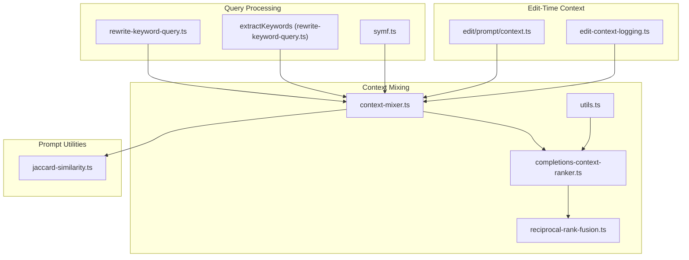
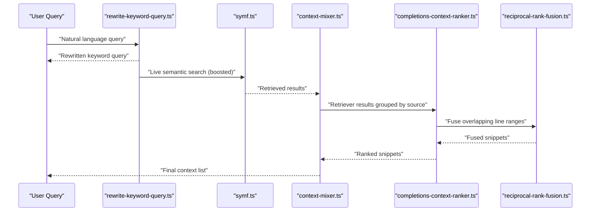
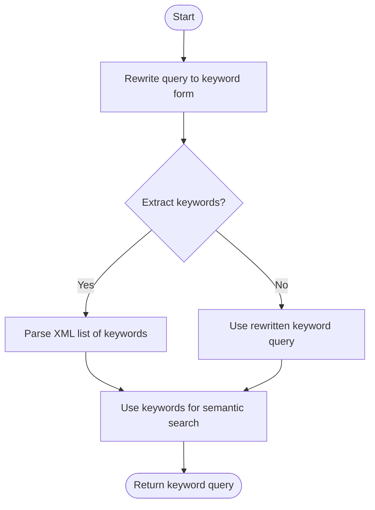
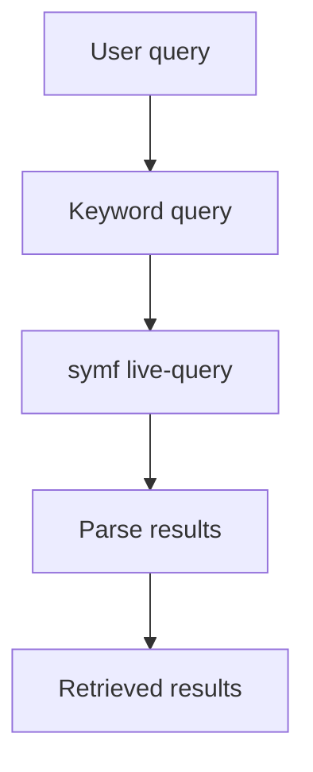
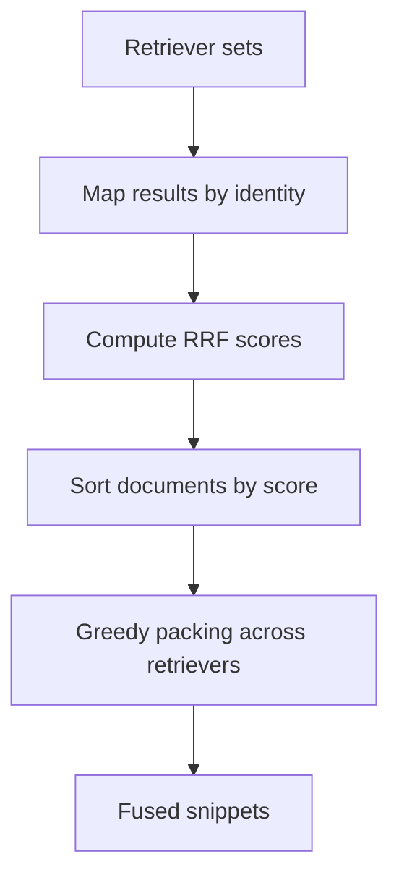
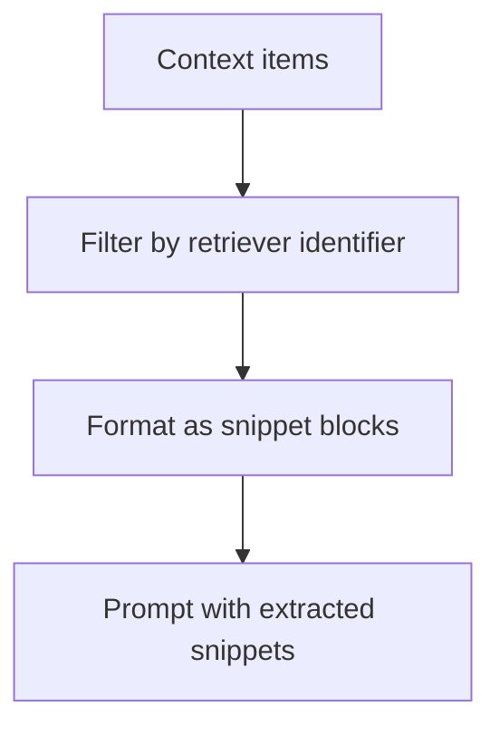
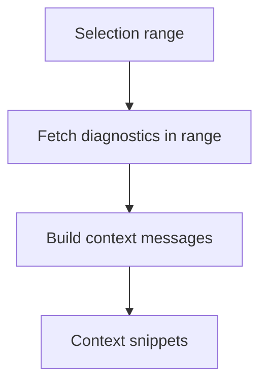
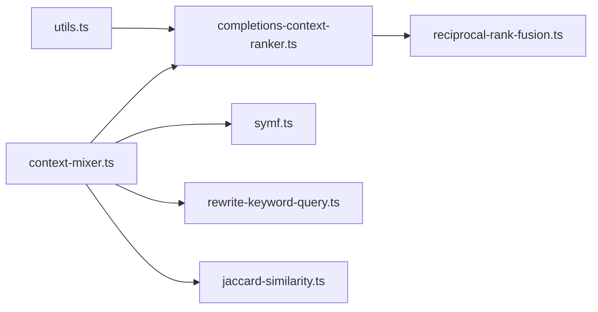

# Query Processing & Ranking

<cite>
**Referenced Files in This Document**
- [rewrite-keyword-query.ts](file://vscode/src/local-context/rewrite-keyword-query.ts)
- [rewrite-keyword-query.test.ts](file://vscode/src/local-context/rewrite-keyword-query.test.ts)
- [symf.ts](file://vscode/src/local-context/symf.ts)
- [reciprocal-rank-fusion.ts](file://vscode/src/completions/context/reciprocal-rank-fusion.ts)
- [reciprocal-rank-fusion.test.ts](file://vscode/src/completions/context/reciprocal-rank-fusion.test.ts)
- [completions-context-ranker.ts](file://vscode/src/completions/context/completions-context-ranker.ts)
- [context-mixer.ts](file://vscode/src/completions/context/context-mixer.ts)
- [utils.ts](file://vscode/src/completions/context/utils.ts)
- [jaccard-similarity.ts](file://vscode/src/autoedits/prompt/prompt-utils/jaccard-similarity.ts)
- [jaccard-simliarity.test.ts](file://vscode/src/autoedits/prompt/prompt-utils/jaccard-simliarity.test.ts)
- [context.ts](file://vscode/src/edit/prompt/context.ts)
- [edit-context-logging.ts](file://vscode/src/edit/edit-context-logging.ts)
</cite>

## Table of Contents
1. [Introduction](#introduction)
2. [Project Structure](#project-structure)
3. [Core Components](#core-components)
4. [Architecture Overview](#architecture-overview)
5. [Detailed Component Analysis](#detailed-component-analysis)
6. [Dependency Analysis](#dependency-analysis)
7. [Performance Considerations](#performance-considerations)
8. [Troubleshooting Guide](#troubleshooting-guide)
9. [Conclusion](#conclusion)

## Introduction
This document explains the query processing and context ranking pipeline used to transform user queries into high-quality, fused context for autocomplete and editing tasks. It covers:
- Keyword query rewriting and semantic expansion
- Reciprocal Rank Fusion (RRF) for multi-source context mixing
- Jaccard similarity extraction for code snippet alignment
- Context ranking heuristics including recency and priority
- Practical workflows, filtering, and performance optimizations
- Query-specific features such as recent edits tracking, diagnostic-based context, and user intent detection

## Project Structure
The query processing and ranking logic spans several modules:
- Local context and query rewriting: keyword extraction and rewriting
- Semantic search integration: live query via symf
- Context mixing and ranking: RRF, priority-based fusion, and character budgeting
- Prompt utilities: Jaccard similarity snippet assembly
- Edit-time context: diagnostics and selection-aware context

**Diagram sources**
- [rewrite-keyword-query.ts:1-140](file://vscode/src/local-context/rewrite-keyword-query.ts#L1-L140)
- [symf.ts:1-944](file://vscode/src/local-context/symf.ts#L1-L944)
- [context-mixer.ts:1-287](file://vscode/src/completions/context/context-mixer.ts#L1-L287)
- [completions-context-ranker.ts:1-155](file://vscode/src/completions/context/completions-context-ranker.ts#L1-L155)
- [reciprocal-rank-fusion.ts:1-126](file://vscode/src/completions/context/reciprocal-rank-fusion.ts#L1-L126)
- [utils.ts:1-37](file://vscode/src/completions/context/utils.ts#L1-L37)
- [jaccard-similarity.ts:1-35](file://vscode/src/autoedits/prompt/prompt-utils/jaccard-similarity.ts#L1-L35)
- [context.ts:107-136](file://vscode/src/edit/prompt/context.ts#L107-L136)
- [edit-context-logging.ts:252-291](file://vscode/src/edit/edit-context-logging.ts#L252-L291)

**Section sources**
- [rewrite-keyword-query.ts:1-140](file://vscode/src/local-context/rewrite-keyword-query.ts#L1-L140)
- [symf.ts:1-944](file://vscode/src/local-context/symf.ts#L1-L944)
- [context-mixer.ts:1-287](file://vscode/src/completions/context/context-mixer.ts#L1-L287)
- [completions-context-ranker.ts:1-155](file://vscode/src/completions/context/completions-context-ranker.ts#L1-L155)
- [reciprocal-rank-fusion.ts:1-126](file://vscode/src/completions/context/reciprocal-rank-fusion.ts#L1-L126)
- [utils.ts:1-37](file://vscode/src/completions/context/utils.ts#L1-L37)
- [jaccard-similarity.ts:1-35](file://vscode/src/autoedits/prompt/prompt-utils/jaccard-similarity.ts#L1-L35)
- [context.ts:107-136](file://vscode/src/edit/prompt/context.ts#L107-L136)
- [edit-context-logging.ts:252-291](file://vscode/src/edit/edit-context-logging.ts#L252-L291)

## Core Components
- Keyword query rewriting: Uses a fast model to extract a concise keyword search string from natural language queries.
- Semantic expansion: Optional keyword extraction into atomic terms for broader coverage.
- Live semantic search: Executes boosted keyword queries against a local symf index for live results.
- Context mixing: Aggregates results from multiple retrievers into a single ranked list.
- Reciprocal Rank Fusion: Combines overlapping line-level segments from multiple sources into a cohesive snippet set.
- Jaccard similarity: Assembles extracted code snippets for similarity-based prompting.
- Edit-time context: Builds context around diagnostics and selection ranges.

**Section sources**
- [rewrite-keyword-query.ts:19-82](file://vscode/src/local-context/rewrite-keyword-query.ts#L19-L82)
- [rewrite-keyword-query.ts:89-139](file://vscode/src/local-context/rewrite-keyword-query.ts#L89-L139)
- [symf.ts:136-168](file://vscode/src/local-context/symf.ts#L136-L168)
- [context-mixer.ts:107-244](file://vscode/src/completions/context/context-mixer.ts#L107-L244)
- [reciprocal-rank-fusion.ts:38-125](file://vscode/src/completions/context/reciprocal-rank-fusion.ts#L38-L125)
- [jaccard-similarity.ts:10-35](file://vscode/src/autoedits/prompt/prompt-utils/jaccard-similarity.ts#L10-L35)
- [context.ts:107-136](file://vscode/src/edit/prompt/context.ts#L107-L136)

## Architecture Overview
The system orchestrates query rewriting, semantic search, and context mixing to produce a compact, high-quality context set.

**Diagram sources**
- [rewrite-keyword-query.ts:19-82](file://vscode/src/local-context/rewrite-keyword-query.ts#L19-L82)
- [symf.ts:136-168](file://vscode/src/local-context/symf.ts#L136-L168)
- [context-mixer.ts:107-244](file://vscode/src/completions/context/context-mixer.ts#L107-L244)
- [completions-context-ranker.ts:69-153](file://vscode/src/completions/context/completions-context-ranker.ts#L69-L153)
- [reciprocal-rank-fusion.ts:38-125](file://vscode/src/completions/context/reciprocal-rank-fusion.ts#L38-L125)

## Detailed Component Analysis

### Keyword Query Rewriting and Semantic Expansion
- Rewriting: A fast model generates a clean keyword query from user input. If rewriting fails, the original query is used.
- Extraction: Optional XML-based extraction of atomic keywords for broader semantic coverage.

**Diagram sources**
- [rewrite-keyword-query.ts:19-82](file://vscode/src/local-context/rewrite-keyword-query.ts#L19-L82)
- [rewrite-keyword-query.ts:89-139](file://vscode/src/local-context/rewrite-keyword-query.ts#L89-L139)

**Section sources**
- [rewrite-keyword-query.ts:19-82](file://vscode/src/local-context/rewrite-keyword-query.ts#L19-L82)
- [rewrite-keyword-query.ts:89-139](file://vscode/src/local-context/rewrite-keyword-query.ts#L89-L139)
- [rewrite-keyword-query.test.ts:18-97](file://vscode/src/local-context/rewrite-keyword-query.test.ts#L18-L97)

### Semantic Search Integration (symf)
- Live query mode: Executes boosted keyword queries against a local symf index for fast, relevant results.
- Index lifecycle: Ensures index readiness, handles failures, and updates stale indices atomically.
- Concurrency and timeouts: Controlled via child process execution and abort signals.

**Diagram sources**
- [symf.ts:136-168](file://vscode/src/local-context/symf.ts#L136-L168)
- [symf.ts:289-393](file://vscode/src/local-context/symf.ts#L289-L393)

**Section sources**
- [symf.ts:136-168](file://vscode/src/local-context/symf.ts#L136-L168)
- [symf.ts:289-393](file://vscode/src/local-context/symf.ts#L289-L393)

### Context Mixing and Reciprocal Rank Fusion
- Multi-source aggregation: Results from multiple retrievers are fused using RRF to emphasize overlapping content.
- Identity mapping: Line-level identities for overlapping ranges ensure proper boosting.
- Priority fusion: Special handling for “recent edits” retriever maintains priority while applying RRF to others.

**Diagram sources**
- [reciprocal-rank-fusion.ts:38-125](file://vscode/src/completions/context/reciprocal-rank-fusion.ts#L38-L125)
- [completions-context-ranker.ts:82-153](file://vscode/src/completions/context/completions-context-ranker.ts#L82-L153)

**Section sources**
- [reciprocal-rank-fusion.ts:38-125](file://vscode/src/completions/context/reciprocal-rank-fusion.ts#L38-L125)
- [reciprocal-rank-fusion.test.ts:1-77](file://vscode/src/completions/context/reciprocal-rank-fusion.test.ts#L1-L77)
- [completions-context-ranker.ts:69-153](file://vscode/src/completions/context/completions-context-ranker.ts#L69-L153)

### Jaccard Similarity Extraction
- Filters context items from a specific retriever and formats them into a structured prompt block for similarity-based reasoning.

**Diagram sources**
- [jaccard-similarity.ts:10-35](file://vscode/src/autoedits/prompt/prompt-utils/jaccard-similarity.ts#L10-L35)
- [jaccard-simliarity.test.ts:7-83](file://vscode/src/autoedits/prompt/prompt-utils/jaccard-simliarity.test.ts#L7-L83)

**Section sources**
- [jaccard-similarity.ts:10-35](file://vscode/src/autoedits/prompt/prompt-utils/jaccard-similarity.ts#L10-L35)
- [jaccard-simliarity.test.ts:7-83](file://vscode/src/autoedits/prompt/prompt-utils/jaccard-simliarity.test.ts#L7-L83)

### Edit-Time Context and Diagnostic-Aware Snippets
- Selection-based context: Builds context around the current selection and augments with diagnostics (errors/warnings) from the selected range.
- Logging context: Captures user query, file path, content, and selection offsets for observability.

**Diagram sources**
- [context.ts:107-136](file://vscode/src/edit/prompt/context.ts#L107-L136)
- [edit-context-logging.ts:272-291](file://vscode/src/edit/edit-context-logging.ts#L272-L291)

**Section sources**
- [context.ts:107-136](file://vscode/src/edit/prompt/context.ts#L107-L136)
- [edit-context-logging.ts:272-291](file://vscode/src/edit/edit-context-logging.ts#L272-L291)

## Dependency Analysis
- Retrieval sources are identified by a retriever identifier enum, enabling prioritization and filtering.
- ContextMixer coordinates strategy selection, retrieval, filtering, ranking, and final composition.
- RRF depends on identity functions that map snippets to unique identifiers (file-level or line-level).

**Diagram sources**
- [utils.ts:4-12](file://vscode/src/completions/context/utils.ts#L4-L12)
- [completions-context-ranker.ts:1-28](file://vscode/src/completions/context/completions-context-ranker.ts#L1-L28)
- [reciprocal-rank-fusion.ts:1-126](file://vscode/src/completions/context/reciprocal-rank-fusion.ts#L1-L126)
- [context-mixer.ts:1-287](file://vscode/src/completions/context/context-mixer.ts#L1-L287)
- [symf.ts:1-944](file://vscode/src/local-context/symf.ts#L1-L944)
- [rewrite-keyword-query.ts:1-140](file://vscode/src/local-context/rewrite-keyword-query.ts#L1-L140)
- [jaccard-similarity.ts:1-35](file://vscode/src/autoedits/prompt/prompt-utils/jaccard-similarity.ts#L1-L35)

**Section sources**
- [utils.ts:4-12](file://vscode/src/completions/context/utils.ts#L4-L12)
- [completions-context-ranker.ts:1-28](file://vscode/src/completions/context/completions-context-ranker.ts#L1-L28)
- [reciprocal-rank-fusion.ts:1-126](file://vscode/src/completions/context/reciprocal-rank-fusion.ts#L1-L126)
- [context-mixer.ts:1-287](file://vscode/src/completions/context/context-mixer.ts#L1-L287)

## Performance Considerations
- Early abort and timeouts: symf live queries enforce timeouts and propagate abort signals to prevent long-running operations.
- Concurrency control: Index creation limits CPU usage and uses read/write locks to coordinate access.
- Budget-aware composition: ContextMixer enforces a character budget and records retriever statistics for analytics.
- Lazy evaluation and filtering: Filtering occurs after retrieval to avoid unnecessary work and to respect ignore lists.

Practical tips:
- Prefer rewriting for noisy queries to reduce index load.
- Use RRF to surface overlapping context efficiently.
- Monitor retriever durations and suggested counts to tune strategies.

**Section sources**
- [symf.ts:154-167](file://vscode/src/local-context/symf.ts#L154-L167)
- [symf.ts:442-478](file://vscode/src/local-context/symf.ts#L442-L478)
- [context-mixer.ts:128-151](file://vscode/src/completions/context/context-mixer.ts#L128-L151)
- [context-mixer.ts:194-228](file://vscode/src/completions/context/context-mixer.ts#L194-L228)

## Troubleshooting Guide
Common issues and remedies:
- Rewriting failures: The system falls back to the original query and logs debug info.
- Empty or low-quality results: Verify retriever identifiers and ensure the strategy factory returns retrievers.
- Index failures: symf marks failures and avoids repeated rebuild attempts unless explicitly requested.
- Timeout or cancellation: symf queries respect abort signals; ensure callers handle cancellations.

Operational checks:
- Confirm symf binary availability and authentication status.
- Review retriever stats in the context summary to identify slow or empty retrievers.
- Inspect logging context for edit operations to validate intent-driven context.

**Section sources**
- [rewrite-keyword-query.ts:24-31](file://vscode/src/local-context/rewrite-keyword-query.ts#L24-L31)
- [symf.ts:513-530](file://vscode/src/local-context/symf.ts#L513-L530)
- [context-mixer.ts:230-237](file://vscode/src/completions/context/context-mixer.ts#L230-L237)

## Conclusion
The query processing and ranking pipeline integrates keyword rewriting, semantic search, and multi-source context fusion to deliver precise, timely context. RRF ensures overlapping content is prioritized, while priority-based fusion preserves recency-sensitive sources. Jaccard similarity extraction and diagnostic-aware context further align results with user intent. With careful attention to timeouts, concurrency, and budgeting, the system remains responsive under real-world workloads.