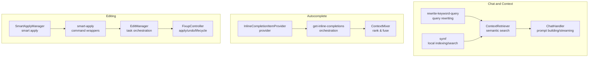
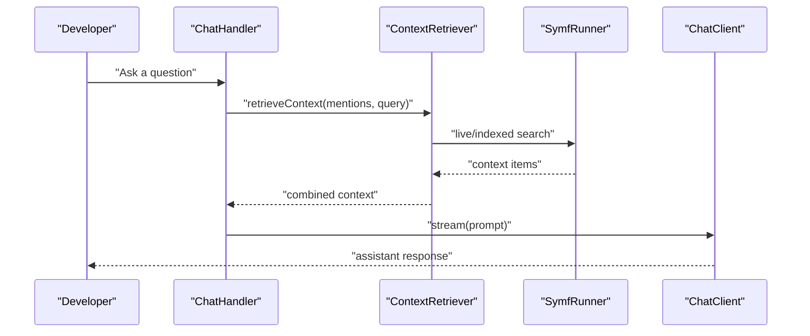
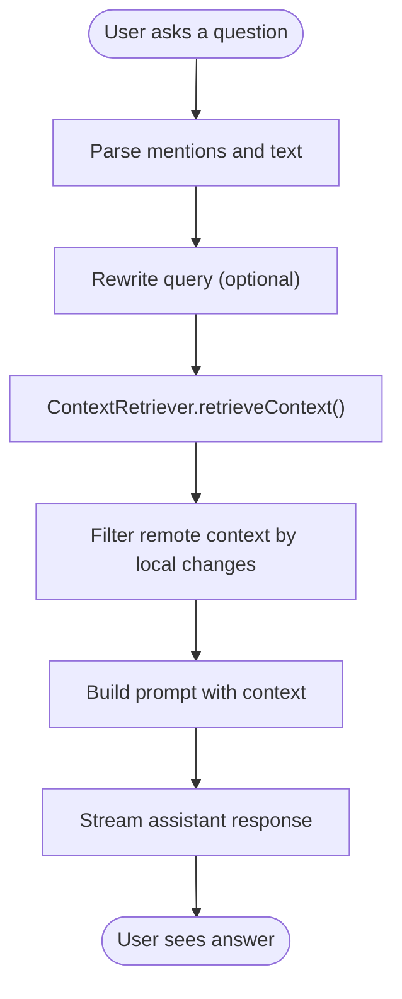
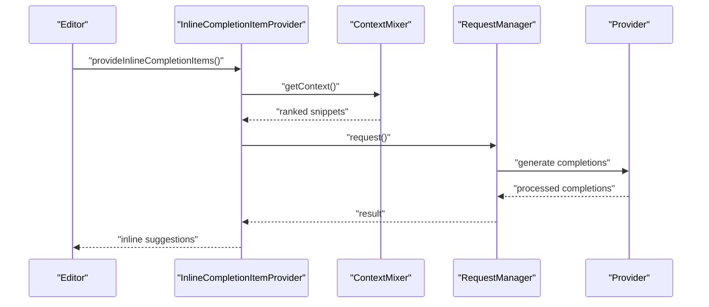
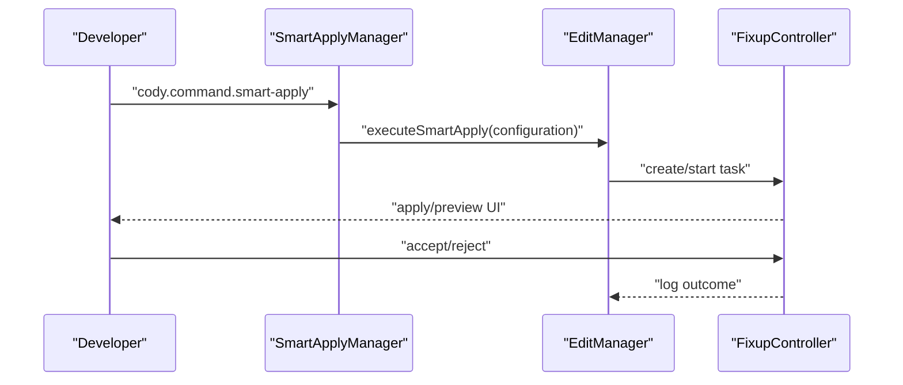
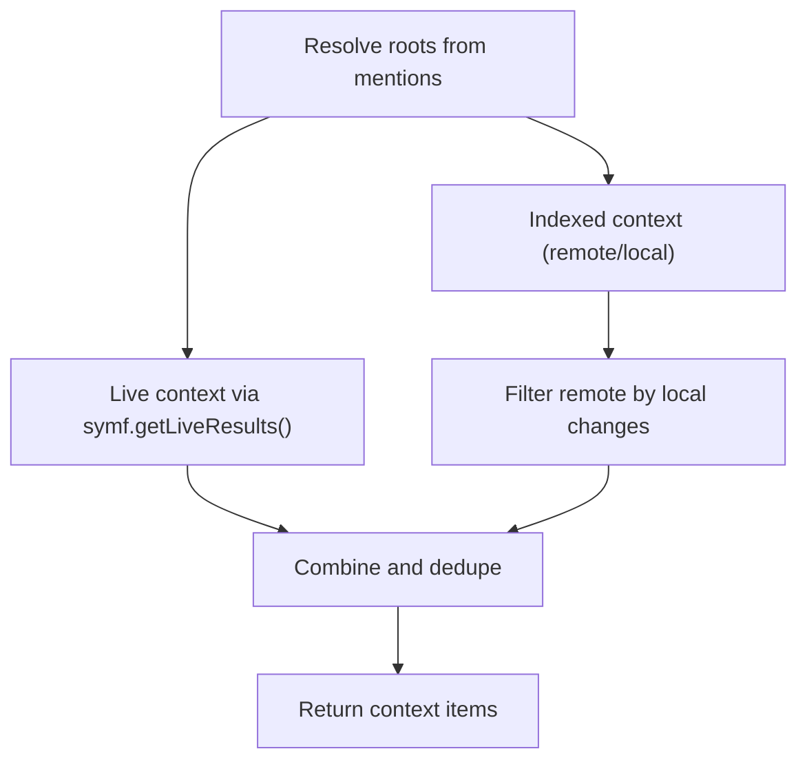
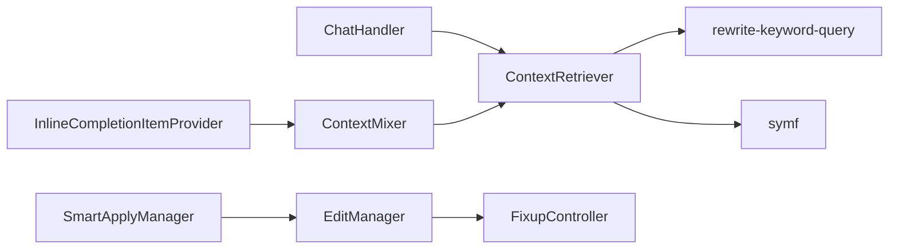

# Core Features

<cite>
**Referenced Files in This Document**
- [ContextRetriever.ts](file://vscode/src/chat/chat-view/ContextRetriever.ts)
- [rewrite-keyword-query.ts](file://vscode/src/local-context/rewrite-keyword-query.ts)
- [symf.ts](file://vscode/src/local-context/symf.ts)
- [ChatHandler.ts](file://vscode/src/chat/chat-view/handlers/ChatHandler.ts)
- [context.test.ts](file://vscode/src/chat/chat-view/context.test.ts)
- [inline-completion-item-provider.ts](file://vscode/src/completions/inline-completion-item-provider.ts)
- [get-inline-completions.ts](file://vscode/src/completions/get-inline-completions.ts)
- [context-mixer.ts](file://vscode/src/completions/context/context-mixer.ts)
- [smart-apply.ts](file://vscode/src/edit/smart-apply.ts)
- [smart-apply-manager.ts](file://vscode/src/edit/smart-apply-manager.ts)
- [codeblock-action-tracker.ts](file://vscode/src/services/utils/codeblock-action-tracker.ts)
- [edit-manager.ts](file://vscode/src/edit/edit-manager.ts)
- [FixupController.ts](file://vscode/src/non-stop/FixupController.ts)
</cite>

## Table of Contents
1. [Introduction](#introduction)
2. [Project Structure](#project-structure)
3. [Core Components](#core-components)
4. [Architecture Overview](#architecture-overview)
5. [Detailed Component Analysis](#detailed-component-analysis)
6. [Dependency Analysis](#dependency-analysis)
7. [Performance Considerations](#performance-considerations)
8. [Troubleshooting Guide](#troubleshooting-guide)
9. [Conclusion](#conclusion)

## Introduction
This document explains the four primary capabilities of the Cody AI platform and how they integrate to deliver a seamless developer experience:
- Intelligent chat system with semantic search and context-aware responses
- Advanced autocomplete engine with inline suggestions and performance optimizations
- Automated code editing with smart apply functionality
- Sophisticated context retrieval across local and remote codebases

It also covers cross-feature integrations, safety mechanisms, and practical workflows such as code completion, chat assistance, automated refactoring, and unit test generation.

## Project Structure
Cody’s core features are implemented primarily in the VS Code extension under the vscode/ directory. The major subsystems are:
- Chat and context retrieval: chat/chat-view and local-context
- Completions: completions
- Code editing and automation: edit, non-stop
- Supporting infrastructure: repository, services, and shared utilities

**Diagram sources**
- [ContextRetriever.ts:171-415](file://vscode/src/chat/chat-view/ContextRetriever.ts#L171-L415)
- [rewrite-keyword-query.ts:19-82](file://vscode/src/local-context/rewrite-keyword-query.ts#L19-L82)
- [symf.ts:64-531](file://vscode/src/local-context/symf.ts#L64-L531)
- [ChatHandler.ts:31-279](file://vscode/src/chat/chat-view/handlers/ChatHandler.ts#L31-L279)
- [inline-completion-item-provider.ts:97-247](file://vscode/src/completions/inline-completion-item-provider.ts#L97-L247)
- [get-inline-completions.ts:184-527](file://vscode/src/completions/get-inline-completions.ts#L184-L527)
- [context-mixer.ts:88-273](file://vscode/src/completions/context/context-mixer.ts#L88-L273)
- [smart-apply-manager.ts:48-315](file://vscode/src/edit/smart-apply-manager.ts#L48-L315)
- [smart-apply.ts:6-34](file://vscode/src/edit/smart-apply.ts#L6-L34)
- [edit-manager.ts:45-333](file://vscode/src/edit/edit-manager.ts#L45-L333)
- [FixupController.ts:72-800](file://vscode/src/non-stop/FixupController.ts#L72-L800)

**Section sources**
- [ContextRetriever.ts:171-415](file://vscode/src/chat/chat-view/ContextRetriever.ts#L171-L415)
- [rewrite-keyword-query.ts:19-82](file://vscode/src/local-context/rewrite-keyword-query.ts#L19-L82)
- [symf.ts:64-531](file://vscode/src/local-context/symf.ts#L64-L531)
- [ChatHandler.ts:31-279](file://vscode/src/chat/chat-view/handlers/ChatHandler.ts#L31-L279)
- [inline-completion-item-provider.ts:97-247](file://vscode/src/completions/inline-completion-item-provider.ts#L97-L247)
- [get-inline-completions.ts:184-527](file://vscode/src/completions/get-inline-completions.ts#L184-L527)
- [context-mixer.ts:88-273](file://vscode/src/completions/context/context-mixer.ts#L88-L273)
- [smart-apply-manager.ts:48-315](file://vscode/src/edit/smart-apply-manager.ts#L48-L315)
- [smart-apply.ts:6-34](file://vscode/src/edit/smart-apply.ts#L6-L34)
- [edit-manager.ts:45-333](file://vscode/src/edit/edit-manager.ts#L45-L333)
- [FixupController.ts:72-800](file://vscode/src/non-stop/FixupController.ts#L72-L800)

## Core Components
- Intelligent chat system with semantic search
  - ContextRetriever orchestrates retrieval from local symf, remote repositories, and explicit mentions; merges results and filters duplicates.
  - rewrite-keyword-query improves search precision by extracting keywords and rewriting queries.
  - symf manages local indexing and live queries for fast, relevant results.
  - ChatHandler builds prompts, streams assistant responses, and surfaces token usage and context.

- Advanced autocomplete engine with inline suggestions
  - InlineCompletionItemProvider coordinates request lifecycle, throttling, caching, and visibility checks.
  - get-inline-completions orchestrates context fetching, provider calls, and result processing.
  - ContextMixer ranks and fuses results from multiple retrievers, respecting size limits and filters.

- Automated code editing with smart apply
  - SmartApplyManager exposes commands to apply or preview changes, integrating with EditManager and FixupController.
  - EditManager creates tasks, selects models, and logs telemetry.
  - FixupController manages the lifecycle of code edits, including apply/undo, persistence tracking, and user interactions.

- Sophisticated context retrieval across local and remote codebases
  - ContextRetriever resolves roots from mentions, detects local modifications, and filters remote context to avoid duplication.
  - SymfRunner maintains indices and executes queries; supports live results and index freshness checks.

**Section sources**
- [ContextRetriever.ts:171-415](file://vscode/src/chat/chat-view/ContextRetriever.ts#L171-L415)
- [rewrite-keyword-query.ts:19-82](file://vscode/src/local-context/rewrite-keyword-query.ts#L19-L82)
- [symf.ts:64-531](file://vscode/src/local-context/symf.ts#L64-L531)
- [ChatHandler.ts:31-279](file://vscode/src/chat/chat-view/handlers/ChatHandler.ts#L31-L279)
- [inline-completion-item-provider.ts:97-247](file://vscode/src/completions/inline-completion-item-provider.ts#L97-L247)
- [get-inline-completions.ts:184-527](file://vscode/src/completions/get-inline-completions.ts#L184-L527)
- [context-mixer.ts:88-273](file://vscode/src/completions/context/context-mixer.ts#L88-L273)
- [smart-apply-manager.ts:48-315](file://vscode/src/edit/smart-apply-manager.ts#L48-L315)
- [smart-apply.ts:6-34](file://vscode/src/edit/smart-apply.ts#L6-L34)
- [edit-manager.ts:45-333](file://vscode/src/edit/edit-manager.ts#L45-L333)
- [FixupController.ts:72-800](file://vscode/src/non-stop/FixupController.ts#L72-L800)

## Architecture Overview
The four features are tightly integrated:
- Chat relies on ContextRetriever to assemble context, which is then embedded into prompts and streamed to the user.
- Autocomplete uses ContextMixer to fetch and rank context snippets, then delegates to providers for completions.
- Smart apply leverages EditManager and FixupController to apply or preview changes, often initiated from chat or autocomplete flows.
- Context retrieval spans local symf indices and remote repositories, with query rewriting and filtering to reduce noise.

**Diagram sources**
- [ChatHandler.ts:249-279](file://vscode/src/chat/chat-view/handlers/ChatHandler.ts#L249-L279)
- [ContextRetriever.ts:182-254](file://vscode/src/chat/chat-view/ContextRetriever.ts#L182-L254)
- [symf.ts:136-168](file://vscode/src/local-context/symf.ts#L136-L168)

## Detailed Component Analysis

### Intelligent Chat System with Semantic Search
- Context composition
  - Mentions are structured into repositories, trees, files, symbols, and media; explicit mentions are resolved and combined with retrieved context.
  - Remote context is filtered to exclude files that are locally modified and overlap by repo name and relative path.
- Query rewriting
  - rewrite-keyword-query extracts keywords and rewrites queries to improve retrieval precision.
- Streaming responses
  - ChatHandler streams assistant responses, updates token usage, and posts partial content on errors.

**Diagram sources**
- [ChatHandler.ts:281-334](file://vscode/src/chat/chat-view/handlers/ChatHandler.ts#L281-L334)
- [ContextRetriever.ts:444-491](file://vscode/src/chat/chat-view/ContextRetriever.ts#L444-L491)
- [rewrite-keyword-query.ts:19-82](file://vscode/src/local-context/rewrite-keyword-query.ts#L19-L82)

**Section sources**
- [ChatHandler.ts:249-279](file://vscode/src/chat/chat-view/handlers/ChatHandler.ts#L249-L279)
- [ContextRetriever.ts:182-254](file://vscode/src/chat/chat-view/ContextRetriever.ts#L182-L254)
- [rewrite-keyword-query.ts:19-82](file://vscode/src/local-context/rewrite-keyword-query.ts#L19-L82)
- [context.test.ts:6-66](file://vscode/src/chat/chat-view/context.test.ts#L6-L66)

### Advanced Autocomplete Engine with Inline Suggestions
- Request lifecycle
  - InlineCompletionItemProvider sets up throttling, caching, and visibility checks; delegates to get-inline-completions.
  - get-inline-completions orchestrates context retrieval, provider calls, and result processing; applies debounce and smart throttle.
  - ContextMixer ranks and fuses results from multiple retrievers, respecting size limits and applying filters.
- Performance optimizations
  - Debounce intervals, smart throttle, preload requests, and caching reduce redundant calls.
  - Trigger kinds differentiate manual, automatic, hover, suggest widget, and preload invocations.

**Diagram sources**
- [inline-completion-item-provider.ts:317-654](file://vscode/src/completions/inline-completion-item-provider.ts#L317-L654)
- [get-inline-completions.ts:184-527](file://vscode/src/completions/get-inline-completions.ts#L184-L527)
- [context-mixer.ts:107-244](file://vscode/src/completions/context/context-mixer.ts#L107-L244)

**Section sources**
- [inline-completion-item-provider.ts:97-247](file://vscode/src/completions/inline-completion-item-provider.ts#L97-L247)
- [get-inline-completions.ts:184-527](file://vscode/src/completions/get-inline-completions.ts#L184-L527)
- [context-mixer.ts:88-273](file://vscode/src/completions/context/context-mixer.ts#L88-L273)

### Automated Code Editing with Smart Apply
- Smart apply workflow
  - SmartApplyManager registers commands to execute or prefetch smart apply, integrates with EditManager and FixupController.
  - EditManager creates tasks, selects models, and logs telemetry; handles guardrails and context filtering.
  - FixupController manages apply/undo, persistence tracking, and user interactions; supports retries and overlapping task handling.
- Safety and UX
  - Guardrails and context filters prevent editing ignored files.
  - Decorations and code lenses guide acceptance/rejection; persistence tracking logs outcomes.

**Diagram sources**
- [smart-apply-manager.ts:256-315](file://vscode/src/edit/smart-apply-manager.ts#L256-L315)
- [smart-apply.ts:22-34](file://vscode/src/edit/smart-apply.ts#L22-L34)
- [edit-manager.ts:137-223](file://vscode/src/edit/edit-manager.ts#L137-L223)
- [FixupController.ts:527-800](file://vscode/src/non-stop/FixupController.ts#L527-L800)

**Section sources**
- [smart-apply-manager.ts:48-315](file://vscode/src/edit/smart-apply-manager.ts#L48-L315)
- [smart-apply.ts:6-34](file://vscode/src/edit/smart-apply.ts#L6-L34)
- [edit-manager.ts:45-333](file://vscode/src/edit/edit-manager.ts#L45-L333)
- [FixupController.ts:72-800](file://vscode/src/non-stop/FixupController.ts#L72-L800)

### Sophisticated Context Retrieval Across Local and Remote Codebases
- Local and remote retrieval
  - ContextRetriever determines roots from mentions, retrieves live context from symf, and indexed context from remote and local sources.
  - Remote context is filtered to avoid duplicating files that are locally modified.
- Index management
  - SymfRunner manages index creation, freshness checks, and live queries; supports read/write locks and progress tracking.

**Diagram sources**
- [ContextRetriever.ts:199-254](file://vscode/src/chat/chat-view/ContextRetriever.ts#L199-L254)
- [symf.ts:136-168](file://vscode/src/local-context/symf.ts#L136-L168)
- [context.test.ts:6-66](file://vscode/src/chat/chat-view/context.test.ts#L6-L66)

**Section sources**
- [ContextRetriever.ts:199-254](file://vscode/src/chat/chat-view/ContextRetriever.ts#L199-L254)
- [symf.ts:64-531](file://vscode/src/local-context/symf.ts#L64-L531)
- [context.test.ts:6-66](file://vscode/src/chat/chat-view/context.test.ts#L6-L66)

## Dependency Analysis
Key dependencies and interactions:
- ChatHandler depends on ContextRetriever and rewrite-keyword-query to assemble context and prompt.
- Autocomplete pipeline depends on ContextMixer and RequestManager to fetch and process context efficiently.
- Smart apply depends on EditManager and FixupController to manage task lifecycles and apply changes safely.
- ContextRetriever depends on symf for local search and GraphQL for remote search.

**Diagram sources**
- [ChatHandler.ts:249-279](file://vscode/src/chat/chat-view/handlers/ChatHandler.ts#L249-L279)
- [ContextRetriever.ts:182-254](file://vscode/src/chat/chat-view/ContextRetriever.ts#L182-L254)
- [rewrite-keyword-query.ts:19-82](file://vscode/src/local-context/rewrite-keyword-query.ts#L19-L82)
- [symf.ts:136-168](file://vscode/src/local-context/symf.ts#L136-L168)
- [inline-completion-item-provider.ts:200-214](file://vscode/src/completions/inline-completion-item-provider.ts#L200-L214)
- [context-mixer.ts:107-151](file://vscode/src/completions/context/context-mixer.ts#L107-L151)
- [smart-apply-manager.ts:256-315](file://vscode/src/edit/smart-apply-manager.ts#L256-L315)
- [edit-manager.ts:137-223](file://vscode/src/edit/edit-manager.ts#L137-L223)
- [FixupController.ts:527-800](file://vscode/src/non-stop/FixupController.ts#L527-L800)

**Section sources**
- [ChatHandler.ts:249-279](file://vscode/src/chat/chat-view/handlers/ChatHandler.ts#L249-L279)
- [ContextRetriever.ts:182-254](file://vscode/src/chat/chat-view/ContextRetriever.ts#L182-L254)
- [rewrite-keyword-query.ts:19-82](file://vscode/src/local-context/rewrite-keyword-query.ts#L19-L82)
- [symf.ts:136-168](file://vscode/src/local-context/symf.ts#L136-L168)
- [inline-completion-item-provider.ts:200-214](file://vscode/src/completions/inline-completion-item-provider.ts#L200-L214)
- [context-mixer.ts:107-151](file://vscode/src/completions/context/context-mixer.ts#L107-L151)
- [smart-apply-manager.ts:256-315](file://vscode/src/edit/smart-apply-manager.ts#L256-L315)
- [edit-manager.ts:137-223](file://vscode/src/edit/edit-manager.ts#L137-L223)
- [FixupController.ts:527-800](file://vscode/src/non-stop/FixupController.ts#L527-L800)

## Performance Considerations
- Autocomplete performance
  - Debounce intervals and smart throttle reduce redundant requests; preload requests anticipate user intent.
  - Caching and last-candidate reuse minimize repeated work.
  - ContextMixer caps total prompt size and ranks results to keep latency low.
- Context retrieval
  - Symf live queries limit results and use read/write locks to coordinate indexing and querying.
  - Query rewriting reduces search scope and improves relevance.
- Streaming and responsiveness
  - ChatHandler streams assistant responses; autocomplete defers rendering until visibility is confirmed.

[No sources needed since this section provides general guidance]

## Troubleshooting Guide
- Context filtering
  - filterLocallyModifiedFilesOutOfRemoteContext removes remote context items whose relative paths match locally modified files for the same repository.
- Guardrails and safety
  - EditManager and SmartApplyManager check context filters and notify users when files are ignored.
  - FixupController supports undo and persistence tracking to mitigate risks.
- Error handling
  - ChatHandler catches retrieval errors and posts partial responses when streaming fails.
  - Autocomplete logs errors and clears status indicators appropriately.

**Section sources**
- [context.test.ts:6-66](file://vscode/src/chat/chat-view/context.test.ts#L6-L66)
- [edit-manager.ts:19-21](file://vscode/src/edit/edit-manager.ts#L19-L21)
- [FixupController.ts:266-317](file://vscode/src/non-stop/FixupController.ts#L266-L317)
- [ChatHandler.ts:176-180](file://vscode/src/chat/chat-view/handlers/ChatHandler.ts#L176-L180)
- [inline-completion-item-provider.ts:364-386](file://vscode/src/completions/inline-completion-item-provider.ts#L364-L386)

## Conclusion
Cody’s four core features form a cohesive system:
- Chat delivers context-aware answers by combining explicit mentions, rewritten queries, and filtered semantic search.
- Autocomplete accelerates coding with fast, ranked context and optimized request scheduling.
- Smart apply automates code changes with safety, transparency, and user control.
- Sophisticated context retrieval spans local and remote codebases, ensuring relevant and non-redundant information.

Together, these capabilities streamline common workflows—code completion, chat-assisted problem solving, automated refactoring, and unit test generation—while maintaining performance, safety, and developer control.