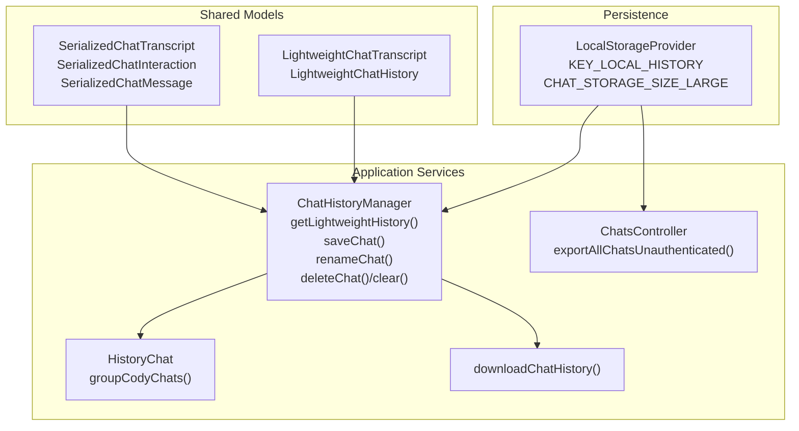
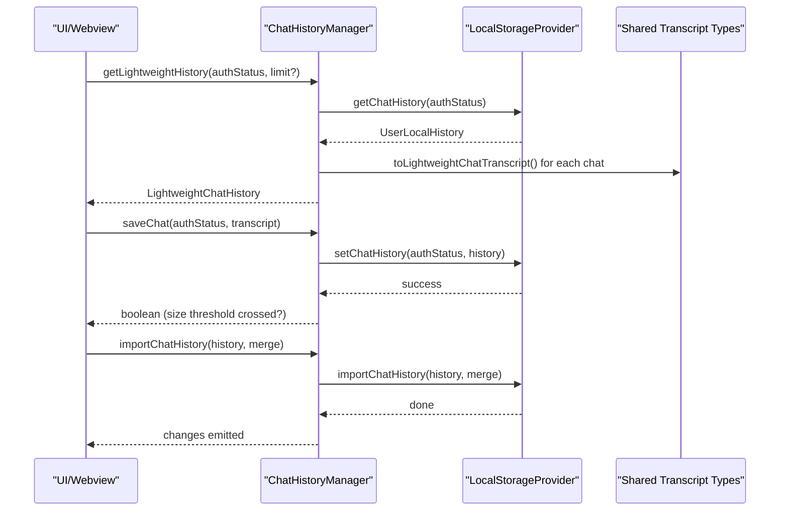
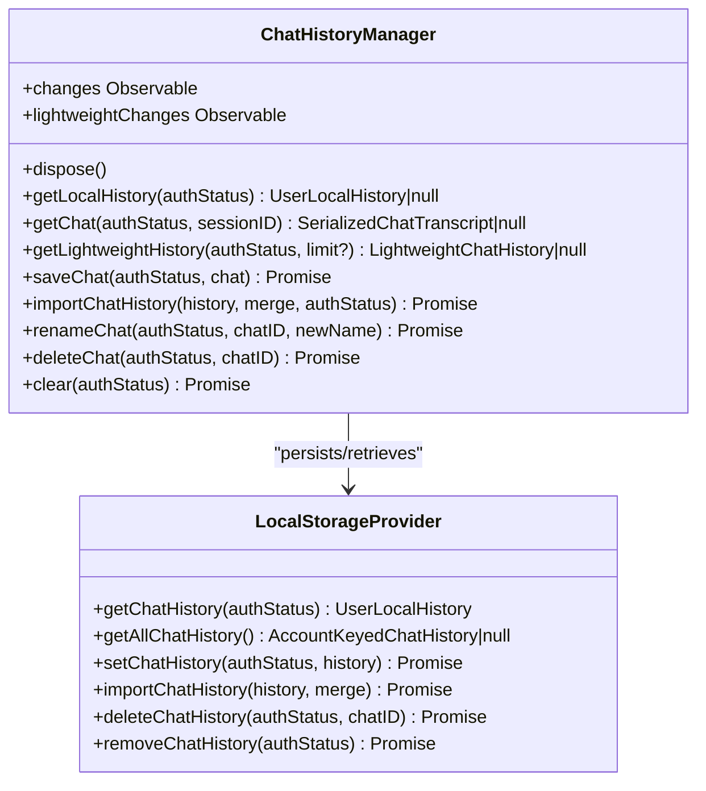
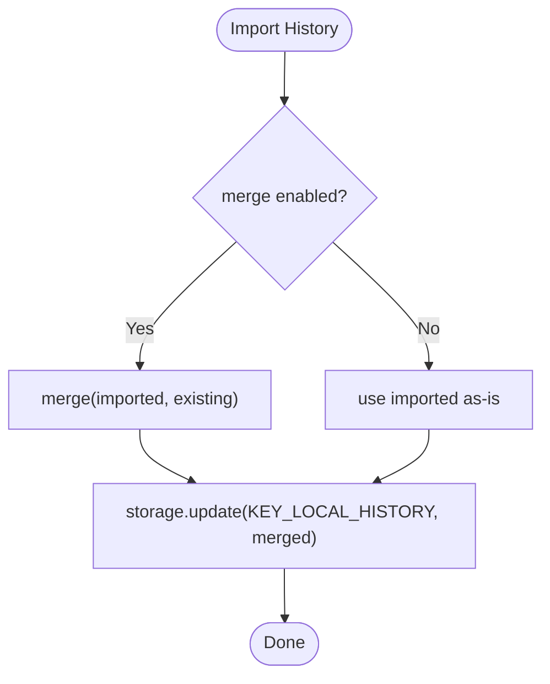
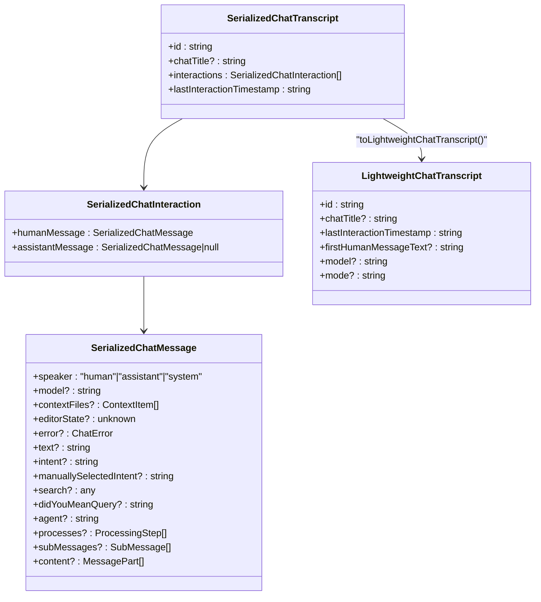
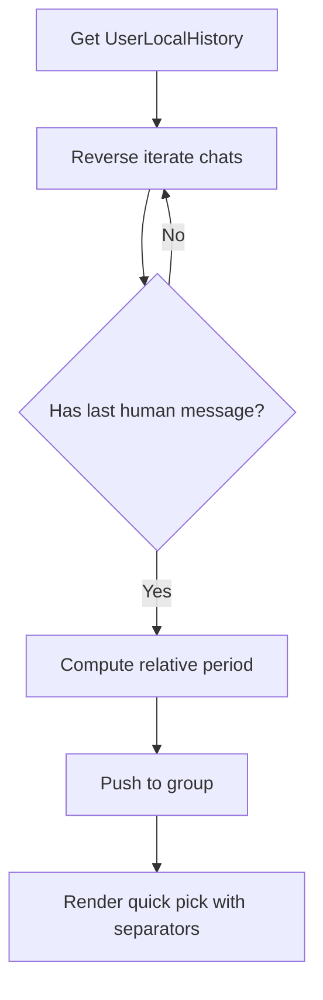
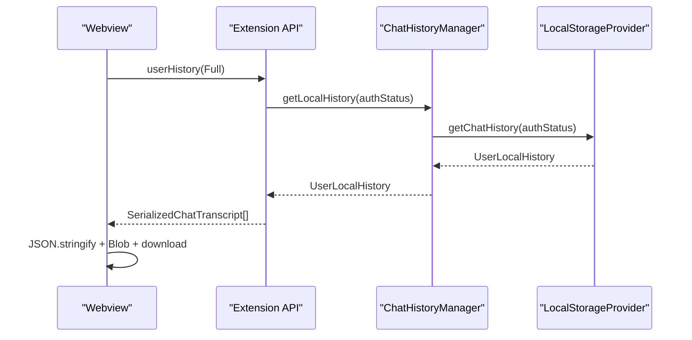
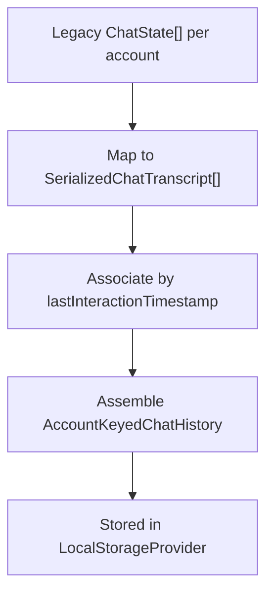
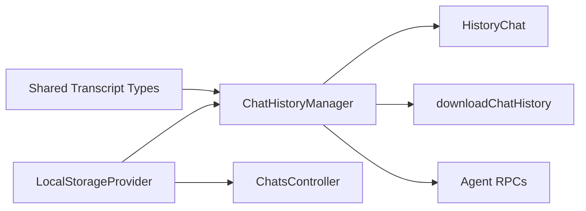

# Chat History Management

<cite>
**Referenced Files in This Document**
- [ChatHistoryManager.ts](file://vscode/src/chat/chat-view/ChatHistoryManager.ts)
- [LocalStorageProvider.ts](file://vscode/src/services/LocalStorageProvider.ts)
- [HistoryChat.ts](file://vscode/src/services/HistoryChat.ts)
- [downloadChatHistory.ts](file://vscode/webviews/chat/downloadChatHistory.ts)
- [index.ts](file://lib/shared/src/chat/transcript/index.ts)
- [lightweight-history.ts](file://lib/shared/src/chat/transcript/lightweight-history.ts)
- [messages.ts](file://lib/shared/src/chat/transcript/messages.ts)
- [time-date.ts](file://vscode/src/common/time-date.ts)
- [ChatsController.ts](file://vscode/src/chat/chat-view/ChatsController.ts)
- [ChatHistoryManager.test.ts](file://vscode/src/chat/chat-view/ChatHistoryManager.test.ts)
- [agent.ts](file://agent/src/agent.ts)
- [SettingsMigrationTest.kt](file://jetbrains/src/test/kotlin/com/sourcegraph/cody/config/SettingsMigrationTest.kt)
- [ChatHistoryMigration.kt](file://jetbrains/src/main/kotlin/com/sourcegraph/cody/config/migration/ChatHistoryMigration.kt)
</cite>

## Table of Contents
1. [Introduction](#introduction)
2. [Project Structure](#project-structure)
3. [Core Components](#core-components)
4. [Architecture Overview](#architecture-overview)
5. [Detailed Component Analysis](#detailed-component-analysis)
6. [Dependency Analysis](#dependency-analysis)
7. [Performance Considerations](#performance-considerations)
8. [Troubleshooting Guide](#troubleshooting-guide)
9. [Conclusion](#conclusion)
10. [Appendices](#appendices)

## Introduction
This document explains the chat history management implementation in the Cody platform. It covers how conversations are persisted locally, how messages are serialized, how history is retrieved and presented, and how sessions are managed across the UI and agent layers. It also documents export and import procedures, migration between versions, pruning and storage optimization, privacy controls, and troubleshooting guidance for large datasets and corruption scenarios.

## Project Structure
The chat history system spans three primary areas:
- Shared data models and lightweight conversion utilities
- Local storage provider for persistence and account-scoped history
- Application services and UI integrations for retrieval, grouping, and export

**Diagram sources**
- [index.ts:1-46](file://lib/shared/src/chat/transcript/index.ts#L1-L46)
- [lightweight-history.ts:1-69](file://lib/shared/src/chat/transcript/lightweight-history.ts#L1-L69)
- [LocalStorageProvider.ts:27-432](file://vscode/src/services/LocalStorageProvider.ts#L27-L432)
- [ChatHistoryManager.ts:21-197](file://vscode/src/chat/chat-view/ChatHistoryManager.ts#L21-L197)
- [HistoryChat.ts:25-69](file://vscode/src/services/HistoryChat.ts#L25-L69)
- [downloadChatHistory.ts:1-31](file://vscode/webviews/chat/downloadChatHistory.ts#L1-L31)
- [ChatsController.ts:435-503](file://vscode/src/chat/chat-view/ChatsController.ts#L435-L503)

**Section sources**
- [ChatHistoryManager.ts:1-197](file://vscode/src/chat/chat-view/ChatHistoryManager.ts#L1-L197)
- [LocalStorageProvider.ts:1-432](file://vscode/src/services/LocalStorageProvider.ts#L1-L432)
- [index.ts:1-46](file://lib/shared/src/chat/transcript/index.ts#L1-L46)
- [lightweight-history.ts:1-69](file://lib/shared/src/chat/transcript/lightweight-history.ts#L1-L69)
- [messages.ts:1-261](file://lib/shared/src/chat/transcript/messages.ts#L1-L261)
- [HistoryChat.ts:1-114](file://vscode/src/services/HistoryChat.ts#L1-L114)
- [downloadChatHistory.ts:1-31](file://vscode/webviews/chat/downloadChatHistory.ts#L1-L31)
- [ChatsController.ts:435-503](file://vscode/src/chat/chat-view/ChatsController.ts#L435-L503)

## Core Components
- ChatHistoryManager: Central orchestrator for retrieving, saving, renaming, deleting, and streaming lightweight history updates.
- LocalStorageProvider: Account-scoped persistence layer with import/export and account keying.
- Lightweight history utilities: Efficient representations for UI lists and reduced payload sizes.
- Message serialization: Structured representation of chat messages for persistence and transport.
- Export/download utilities: Browser-native export and multi-platform controller-based export.
- History grouping and display: UI helpers to present chats grouped by recency.

**Section sources**
- [ChatHistoryManager.ts:21-197](file://vscode/src/chat/chat-view/ChatHistoryManager.ts#L21-L197)
- [LocalStorageProvider.ts:27-432](file://vscode/src/services/LocalStorageProvider.ts#L27-L432)
- [lightweight-history.ts:1-69](file://lib/shared/src/chat/transcript/lightweight-history.ts#L1-L69)
- [messages.ts:156-171](file://lib/shared/src/chat/transcript/messages.ts#L156-L171)
- [downloadChatHistory.ts:1-31](file://vscode/webviews/chat/downloadChatHistory.ts#L1-L31)
- [HistoryChat.ts:25-69](file://vscode/src/services/HistoryChat.ts#L25-L69)

## Architecture Overview
The system uses a layered approach:
- Data models define the canonical serialized forms for transcripts, interactions, and messages.
- Local storage persists account-scoped histories under a single key, merging new data per account.
- The ChatHistoryManager exposes high-level operations and observable streams for UI updates.
- UI services and webviews consume lightweight history for efficient rendering and provide export/download flows.

**Diagram sources**
- [ChatHistoryManager.ts:57-118](file://vscode/src/chat/chat-view/ChatHistoryManager.ts#L57-L118)
- [LocalStorageProvider.ts:174-229](file://vscode/src/services/LocalStorageProvider.ts#L174-L229)
- [lightweight-history.ts:49-68](file://lib/shared/src/chat/transcript/lightweight-history.ts#L49-L68)
- [index.ts:1-46](file://lib/shared/src/chat/transcript/index.ts#L1-L46)

## Detailed Component Analysis

### ChatHistoryManager
Responsibilities:
- Retrieve full or lightweight history for authenticated users.
- Persist chats, optionally emitting change notifications.
- Rename and delete chats, and clear all chats for an account.
- Expose observables for lightweight history and full history changes.

Key behaviors:
- Lightweight history filters out empty chats (no initial human message text), sorts by last interaction timestamp descending, and applies an optional limit.
- Saving skips empty chats and checks whether the serialized history exceeds a size threshold.
- Import supports merge semantics to combine histories.

**Diagram sources**
- [ChatHistoryManager.ts:21-197](file://vscode/src/chat/chat-view/ChatHistoryManager.ts#L21-L197)
- [LocalStorageProvider.ts:174-276](file://vscode/src/services/LocalStorageProvider.ts#L174-L276)

**Section sources**
- [ChatHistoryManager.ts:35-197](file://vscode/src/chat/chat-view/ChatHistoryManager.ts#L35-L197)
- [ChatHistoryManager.test.ts:41-189](file://vscode/src/chat/chat-view/ChatHistoryManager.test.ts#L41-L189)

### LocalStorageProvider
Responsibilities:
- Store account-scoped chat histories under a single key.
- Merge imported histories when requested.
- Provide getters/setters for full and partial histories.
- Enforce a storage size threshold to signal when history is large.

Important constants and keys:
- KEY_LOCAL_HISTORY: central key for account-keyed chat history.
- CHAT_STORAGE_SIZE_LARGE: size threshold in bytes.

Operations:
- getChatHistory: returns a user’s history scoped by endpoint-username key.
- setChatHistory: writes the account-scoped history back to storage.
- importChatHistory: merges or replaces histories depending on merge flag.
- deleteChatHistory/removeChatHistory: targeted deletion or clearing.

**Diagram sources**
- [LocalStorageProvider.ts:215-229](file://vscode/src/services/LocalStorageProvider.ts#L215-L229)

**Section sources**
- [LocalStorageProvider.ts:27-432](file://vscode/src/services/LocalStorageProvider.ts#L27-L432)

### Lightweight History and Serialization
- SerializedChatTranscript: complete transcript with interactions and timestamps.
- SerializedChatInteraction: paired human/assistant messages.
- SerializedChatMessage: serialized message fields suitable for persistence and transport.
- LightweightChatTranscript: minimal fields for UI lists (title, timestamp, first human text, model, mode).

Conversion:
- toLightweightChatTranscript extracts a fallback title from the first human message, infers model and intent from the last assistant message, and preserves the last interaction timestamp.

**Diagram sources**
- [index.ts:7-24](file://lib/shared/src/chat/transcript/index.ts#L7-L24)
- [messages.ts:156-171](file://lib/shared/src/chat/transcript/messages.ts#L156-L171)
- [lightweight-history.ts:18-68](file://lib/shared/src/chat/transcript/lightweight-history.ts#L18-L68)

**Section sources**
- [index.ts:1-46](file://lib/shared/src/chat/transcript/index.ts#L1-L46)
- [lightweight-history.ts:1-69](file://lib/shared/src/chat/transcript/lightweight-history.ts#L1-L69)
- [messages.ts:156-171](file://lib/shared/src/chat/transcript/messages.ts#L156-L171)

### History Grouping and Display
- HistoryChat groups chats by relative time periods (Today, This week, This month) and presents them in a quick pick for restoration.
- Relative time buckets are computed using getRelativeChatPeriod.

**Diagram sources**
- [HistoryChat.ts:25-69](file://vscode/src/services/HistoryChat.ts#L25-L69)
- [time-date.ts:16-28](file://vscode/src/common/time-date.ts#L16-L28)

**Section sources**
- [HistoryChat.ts:25-114](file://vscode/src/services/HistoryChat.ts#L25-L114)
- [time-date.ts:1-28](file://vscode/src/common/time-date.ts#L1-L28)

### Export and Import Procedures
- Webview export: downloadChatHistory fetches full history from the extension API and downloads a JSON file.
- Multi-account export: ChatsController.exportAllChatsUnauthenticated reads all histories regardless of authentication and exports a flattened list.
- Agent integration: The agent exposes chat/export and chat/import RPCs to support cross-process operations.

**Diagram sources**
- [downloadChatHistory.ts:11-30](file://vscode/webviews/chat/downloadChatHistory.ts#L11-L30)
- [ChatHistoryManager.ts:35-47](file://vscode/src/chat/chat-view/ChatHistoryManager.ts#L35-L47)
- [LocalStorageProvider.ts:174-188](file://vscode/src/services/LocalStorageProvider.ts#L174-L188)

**Section sources**
- [downloadChatHistory.ts:1-31](file://vscode/webviews/chat/downloadChatHistory.ts#L1-L31)
- [ChatsController.ts:435-503](file://vscode/src/chat/chat-view/ChatsController.ts#L435-L503)
- [agent.ts:1298-1328](file://agent/src/agent.ts#L1298-L1328)

### Data Migration Between Versions
- JetBrains migration converts legacy chat state to the shared SerializedChatTranscript format and organizes by account key and timestamp.
- Tests validate that migration produces expected structures for downstream processing.

**Diagram sources**
- [ChatHistoryMigration.kt:30-67](file://jetbrains/src/main/kotlin/com/sourcegraph/cody/config/migration/ChatHistoryMigration.kt#L30-L67)
- [SettingsMigrationTest.kt:407-484](file://jetbrains/src/test/kotlin/com/sourcegraph/cody/config/SettingsMigrationTest.kt#L407-L484)

**Section sources**
- [ChatHistoryMigration.kt:30-67](file://jetbrains/src/main/kotlin/com/sourcegraph/cody/config/migration/ChatHistoryMigration.kt#L30-L67)
- [SettingsMigrationTest.kt:407-484](file://jetbrains/src/test/kotlin/com/sourcegraph/cody/config/SettingsMigrationTest.kt#L407-L484)

## Dependency Analysis
- ChatHistoryManager depends on LocalStorageProvider for persistence and on shared transcript types for serialization.
- HistoryChat depends on ChatHistoryManager and time utilities for grouping.
- Download and export flows depend on ChatHistoryManager and LocalStorageProvider for data access.
- Agent layer integrates with ChatHistoryManager via RPCs for import/export.

**Diagram sources**
- [ChatHistoryManager.ts:1-197](file://vscode/src/chat/chat-view/ChatHistoryManager.ts#L1-L197)
- [LocalStorageProvider.ts:1-432](file://vscode/src/services/LocalStorageProvider.ts#L1-L432)
- [HistoryChat.ts:1-114](file://vscode/src/services/HistoryChat.ts#L1-L114)
- [downloadChatHistory.ts:1-31](file://vscode/webviews/chat/downloadChatHistory.ts#L1-L31)
- [ChatsController.ts:435-503](file://vscode/src/chat/chat-view/ChatsController.ts#L435-L503)
- [agent.ts:1298-1328](file://agent/src/agent.ts#L1298-L1328)

**Section sources**
- [ChatHistoryManager.ts:1-197](file://vscode/src/chat/chat-view/ChatHistoryManager.ts#L1-L197)
- [LocalStorageProvider.ts:1-432](file://vscode/src/services/LocalStorageProvider.ts#L1-L432)
- [HistoryChat.ts:1-114](file://vscode/src/services/HistoryChat.ts#L1-L114)
- [downloadChatHistory.ts:1-31](file://vscode/webviews/chat/downloadChatHistory.ts#L1-L31)
- [ChatsController.ts:435-503](file://vscode/src/chat/chat-view/ChatsController.ts#L435-L503)
- [agent.ts:1298-1328](file://agent/src/agent.ts#L1298-L1328)

## Performance Considerations
- Lightweight history reduces payload size by excluding full interactions and limiting fields to UI needs.
- Sorting and filtering occur client-side; for very large histories, consider pagination or virtualization in the UI.
- Storage size threshold triggers a boolean response indicating the history is large; this can be used to warn users or trigger cleanup.
- Merge during import can increase memory usage; prefer non-merge when importing large datasets to avoid duplication.

[No sources needed since this section provides general guidance]

## Troubleshooting Guide
Common issues and remedies:
- Empty chats not appearing: Lightweight history excludes chats without an initial human message text; ensure the first interaction has a human message.
- History appears unordered: Verify sorting by lastInteractionTimestamp; confirm timestamps are valid ISO strings.
- Export yields nothing: Ensure history is present and not filtered (empty chats excluded by default); use unauthenticated export to include all accounts.
- Large history warnings: If saving returns true due to size threshold, consider deleting older chats or exporting and re-importing selectively.
- Corruption symptoms: If JSON parsing fails or history looks truncated, reset storage for the affected account and re-import backups.

**Section sources**
- [ChatHistoryManager.ts:69-92](file://vscode/src/chat/chat-view/ChatHistoryManager.ts#L69-L92)
- [LocalStorageProvider.ts:104-132](file://vscode/src/services/LocalStorageProvider.ts#L104-L132)
- [ChatsController.ts:435-503](file://vscode/src/chat/chat-view/ChatsController.ts#L435-L503)

## Conclusion
Cody’s chat history management centers on a robust, account-scoped persistence layer with efficient lightweight representations for UI rendering, comprehensive export/import flows, and straightforward lifecycle operations. The design balances usability with performance, offering clear pathways for pruning, migration, and privacy controls.

[No sources needed since this section summarizes without analyzing specific files]

## Appendices

### Data Structures and Storage Formats
- AccountKeyedChatHistory: map of account keys to user histories.
- UserLocalHistory: per-user chat map keyed by chat ID.
- SerializedChatTranscript: complete conversation with interactions and timestamps.
- LightweightChatTranscript: minimal fields for list rendering.

**Section sources**
- [messages.ts:194-204](file://lib/shared/src/chat/transcript/messages.ts#L194-L204)
- [index.ts:7-14](file://lib/shared/src/chat/transcript/index.ts#L7-L14)
- [lightweight-history.ts:18-36](file://lib/shared/src/chat/transcript/lightweight-history.ts#L18-L36)

### Retrieval Patterns
- Full history retrieval: getLocalHistory → UserLocalHistory.chat.
- Lightweight history retrieval: filter non-empty chats, sort by timestamp, limit count, convert to lightweight.
- Export patterns: webview-based JSON export and controller-based multi-account export.

**Section sources**
- [ChatHistoryManager.ts:35-92](file://vscode/src/chat/chat-view/ChatHistoryManager.ts#L35-L92)
- [downloadChatHistory.ts:11-30](file://vscode/webviews/chat/downloadChatHistory.ts#L11-L30)
- [ChatsController.ts:435-503](file://vscode/src/chat/chat-view/ChatsController.ts#L435-L503)