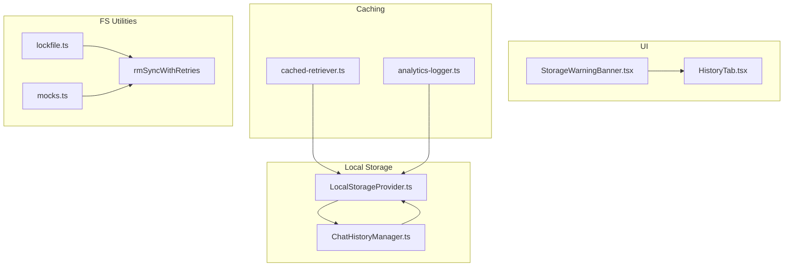
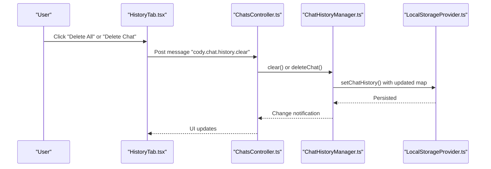
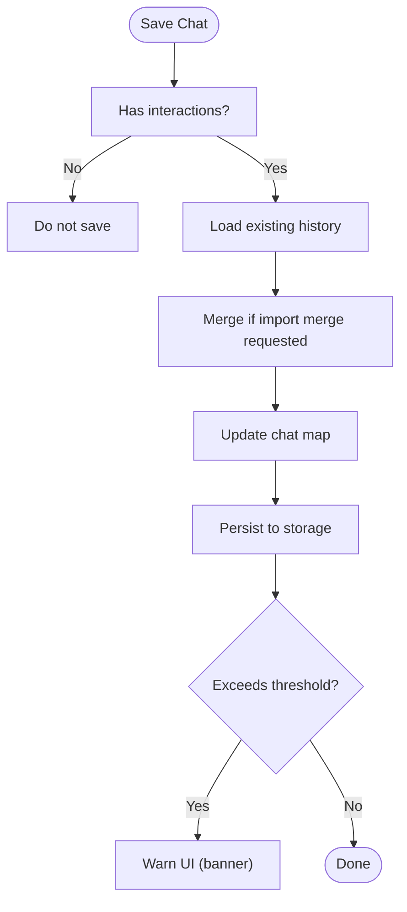
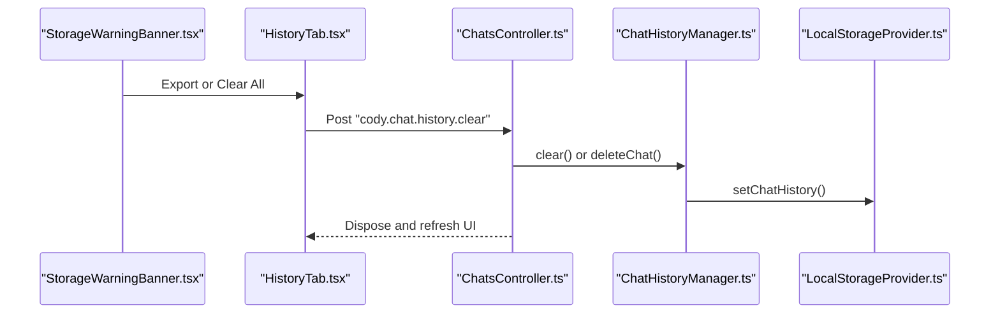
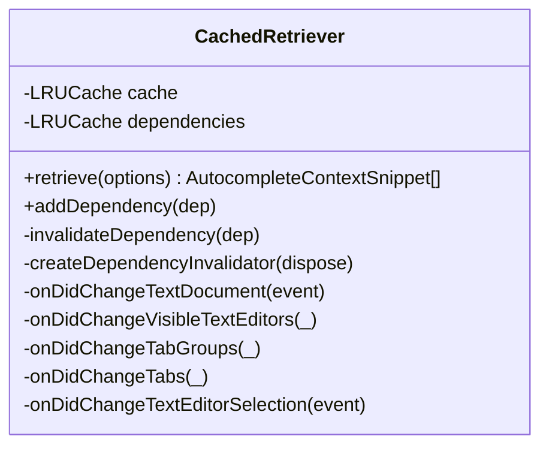
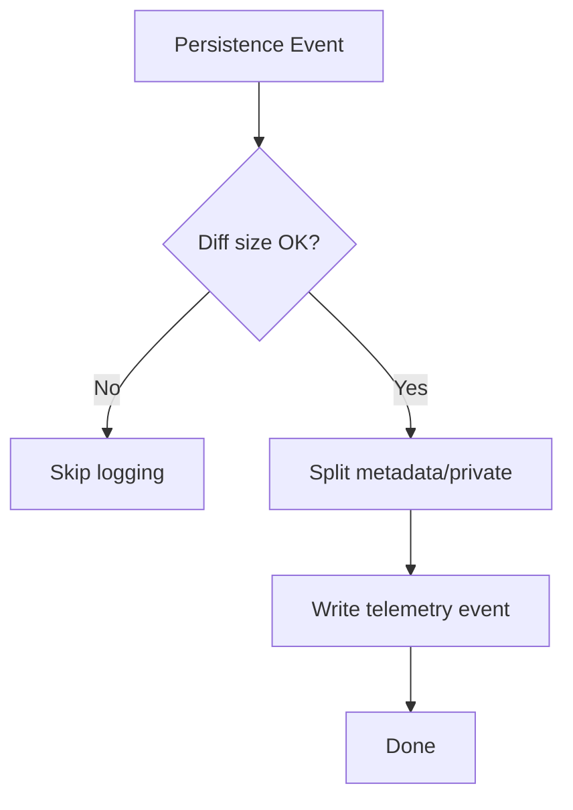
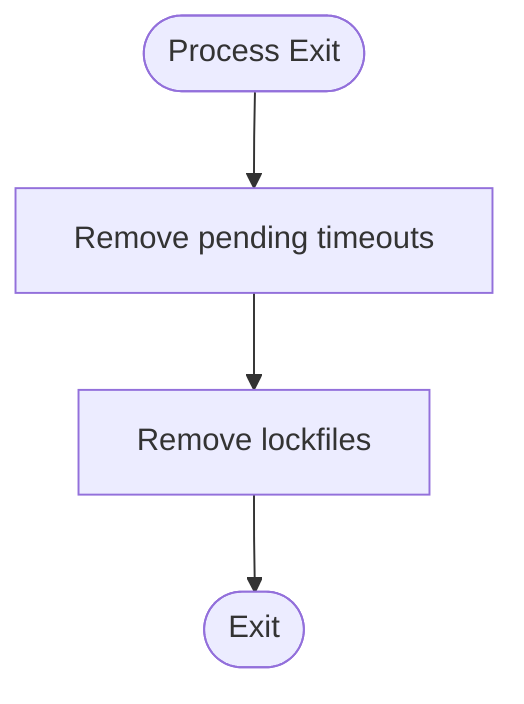
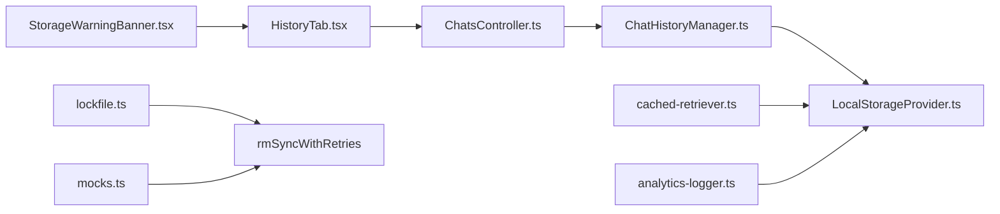

# Data Lifecycle & Cleanup

<cite>
**Referenced Files in This Document**
- [LocalStorageProvider.ts](file://vscode/src/services/LocalStorageProvider.ts)
- [ChatHistoryManager.ts](file://vscode/src/chat/chat-view/ChatHistoryManager.ts)
- [ChatsController.ts](file://vscode/src/chat/chat-view/ChatsController.ts)
- [StorageWarningBanner.tsx](file://vscode/webviews/chat/StorageWarningBanner.tsx)
- [HistoryTab.tsx](file://vscode/webviews/tabs/HistoryTab.tsx)
- [cached-retriever.ts](file://vscode/src/completions/context/retrievers/cached-retriever.ts)
- [analytics-logger.ts](file://vscode/src/completions/analytics-logger.ts)
- [time-date.ts](file://vscode/src/common/time-date.ts)
- [lockfile.ts](file://vscode/src/lockfile.ts)
- [rmSyncWithRetries](file://vscode/test/e2e/helpers.ts)
- [mocks.ts](file://vscode/src/testutils/mocks.ts)
- [ClientConfigCleanupMigrationTest.kt](file://jetbrains/src/test/kotlin/com/sourcegraph/cody/config/migration/ClientConfigCleanupMigrationTest.kt)
</cite>

## Table of Contents
1. [Introduction](#introduction)
2. [Project Structure](#project-structure)
3. [Core Components](#core-components)
4. [Architecture Overview](#architecture-overview)
5. [Detailed Component Analysis](#detailed-component-analysis)
6. [Dependency Analysis](#dependency-analysis)
7. [Performance Considerations](#performance-considerations)
8. [Troubleshooting Guide](#troubleshooting-guide)
9. [Conclusion](#conclusion)
10. [Appendices](#appendices)

## Introduction
This document describes data lifecycle management and cleanup procedures in the Cody platform. It covers retention policies, automatic cleanup, manual deletion, temporary file handling, cache invalidation, storage optimization, log management, workspace cleanup, orphaned data removal, storage monitoring, user-initiated deletion, bulk operations, compliance considerations, backup and restore, migration, and recovery from storage corruption. Guidance is grounded in the repository’s actual implementation.

## Project Structure
Cody’s data lifecycle spans:
- Local storage for user preferences, chat history, and device metadata
- In-memory caches for autocomplete context and telemetry bookkeeping
- Webview-driven UI for storage warnings and history operations
- Lockfiles and filesystem utilities for safe cleanup
- Retention-aware history grouping and lightweight listing

**Diagram sources**
- [LocalStorageProvider.ts:1-432](file://vscode/src/services/LocalStorageProvider.ts#L1-L432)
- [ChatHistoryManager.ts:49-118](file://vscode/src/chat/chat-view/ChatHistoryManager.ts#L49-L118)
- [StorageWarningBanner.tsx:1-81](file://vscode/webviews/chat/StorageWarningBanner.tsx#L1-L81)
- [HistoryTab.tsx:1-474](file://vscode/webviews/tabs/HistoryTab.tsx#L1-L474)
- [cached-retriever.ts:1-290](file://vscode/src/completions/context/retrievers/cached-retriever.ts#L1-L290)
- [analytics-logger.ts:1-800](file://vscode/src/completions/analytics-logger.ts#L1-L800)
- [lockfile.ts:495-520](file://vscode/src/lockfile.ts#L495-L520)
- [rmSyncWithRetries:381-404](file://vscode/test/e2e/helpers.ts#L381-L404)
- [mocks.ts:600-640](file://vscode/src/testutils/mocks.ts#L600-L640)

**Section sources**
- [LocalStorageProvider.ts:1-432](file://vscode/src/services/LocalStorageProvider.ts#L1-L432)
- [ChatHistoryManager.ts:49-118](file://vscode/src/chat/chat-view/ChatHistoryManager.ts#L49-L118)
- [StorageWarningBanner.tsx:1-81](file://vscode/webviews/chat/StorageWarningBanner.tsx#L1-L81)
- [HistoryTab.tsx:1-474](file://vscode/webviews/tabs/HistoryTab.tsx#L1-L474)
- [cached-retriever.ts:1-290](file://vscode/src/completions/context/retrievers/cached-retriever.ts#L1-L290)
- [analytics-logger.ts:1-800](file://vscode/src/completions/analytics-logger.ts#L1-L800)
- [lockfile.ts:495-520](file://vscode/src/lockfile.ts#L495-L520)
- [rmSyncWithRetries:381-404](file://vscode/test/e2e/helpers.ts#L381-L404)
- [mocks.ts:600-640](file://vscode/src/testutils/mocks.ts#L600-L640)

## Core Components
- Local storage provider: centralizes persisted keys, chat history, and device metadata; supports deletion and reset.
- Chat history manager: lightweight listing, saving, and import/export; enforces storage size thresholds.
- Webview UI: storage warning banner and history tab for user-driven cleanup.
- Caching layer: LRU caches with dependency-aware invalidation for autocomplete context.
- Telemetry persistence events: structured logs for persistence lifecycle.
- FS utilities: safe lockfile cleanup and robust file deletion with retries.

**Section sources**
- [LocalStorageProvider.ts:174-276](file://vscode/src/services/LocalStorageProvider.ts#L174-L276)
- [ChatHistoryManager.ts:49-118](file://vscode/src/chat/chat-view/ChatHistoryManager.ts#L49-L118)
- [StorageWarningBanner.tsx:14-80](file://vscode/webviews/chat/StorageWarningBanner.tsx#L14-L80)
- [HistoryTab.tsx:119-141](file://vscode/webviews/tabs/HistoryTab.tsx#L119-L141)
- [cached-retriever.ts:27-151](file://vscode/src/completions/context/retrievers/cached-retriever.ts#L27-L151)
- [analytics-logger.ts:322-381](file://vscode/src/completions/analytics-logger.ts#L322-L381)
- [lockfile.ts:495-520](file://vscode/src/lockfile.ts#L495-L520)
- [rmSyncWithRetries:381-404](file://vscode/test/e2e/helpers.ts#L381-L404)

## Architecture Overview
The data lifecycle integrates UI, storage, and caching:

**Diagram sources**
- [HistoryTab.tsx:119-141](file://vscode/webviews/tabs/HistoryTab.tsx#L119-L141)
- [ChatsController.ts:511-536](file://vscode/src/chat/chat-view/ChatsController.ts#L511-L536)
- [ChatHistoryManager.ts:94-118](file://vscode/src/chat/chat-view/ChatHistoryManager.ts#L94-L118)
- [LocalStorageProvider.ts:190-241](file://vscode/src/services/LocalStorageProvider.ts#L190-L241)

## Detailed Component Analysis

### Local Storage Provider
Responsibilities:
- Stores chat history keyed by endpoint and username
- Enforces a storage size threshold for chat history
- Provides deletion, reset, and import/export
- Maintains device metadata and feature enrollment history

Key behaviors:
- Chat history size check during save triggers UI warnings
- Reset clears all keys via storage keys enumeration
- Deprecated keys are cleared on initialization

**Diagram sources**
- [ChatHistoryManager.ts:94-109](file://vscode/src/chat/chat-view/ChatHistoryManager.ts#L94-L109)
- [LocalStorageProvider.ts:190-229](file://vscode/src/services/LocalStorageProvider.ts#L190-L229)

**Section sources**
- [LocalStorageProvider.ts:27-80](file://vscode/src/services/LocalStorageProvider.ts#L27-L80)
- [LocalStorageProvider.ts:174-276](file://vscode/src/services/LocalStorageProvider.ts#L174-L276)
- [ChatHistoryManager.ts:49-118](file://vscode/src/chat/chat-view/ChatHistoryManager.ts#L49-L118)

### Chat History Manager and UI
- Lightweight listing: filters empty chats, sorts by timestamp, applies optional limit
- History UI groups chats by relative time periods
- Banner warns when history exceeds a configured size
- Bulk delete confirms with modal; single chat delete removes and disposes session

**Diagram sources**
- [StorageWarningBanner.tsx:14-80](file://vscode/webviews/chat/StorageWarningBanner.tsx#L14-L80)
- [HistoryTab.tsx:119-141](file://vscode/webviews/tabs/HistoryTab.tsx#L119-L141)
- [ChatsController.ts:511-536](file://vscode/src/chat/chat-view/ChatsController.ts#L511-L536)
- [ChatHistoryManager.ts:94-118](file://vscode/src/chat/chat-view/ChatHistoryManager.ts#L94-L118)
- [LocalStorageProvider.ts:190-241](file://vscode/src/services/LocalStorageProvider.ts#L190-L241)

**Section sources**
- [time-date.ts:16-28](file://vscode/src/common/time-date.ts#L16-L28)
- [StorageWarningBanner.tsx:14-80](file://vscode/webviews/chat/StorageWarningBanner.tsx#L14-L80)
- [HistoryTab.tsx:316-351](file://vscode/webviews/tabs/HistoryTab.tsx#L316-L351)
- [ChatsController.ts:511-536](file://vscode/src/chat/chat-view/ChatsController.ts#L511-L536)

### Cache Invalidation and Automatic Cleanup
- Autocomplete context caching with LRU and dependency invalidation
- Automatic eviction on document changes, editor visibility changes, and tab changes
- Preload on cursor movement with throttling

**Diagram sources**
- [cached-retriever.ts:27-290](file://vscode/src/completions/context/retrievers/cached-retriever.ts#L27-L290)

**Section sources**
- [cached-retriever.ts:27-151](file://vscode/src/completions/context/retrievers/cached-retriever.ts#L27-L151)

### Telemetry Persistence Events and Logs
- Structured persistence lifecycle events for completions
- Large diffs are excluded from logging to protect privacy and reduce overhead
- Telemetry is split safely into metadata and private metadata

**Diagram sources**
- [analytics-logger.ts:322-381](file://vscode/src/completions/analytics-logger.ts#L322-L381)

**Section sources**
- [analytics-logger.ts:322-381](file://vscode/src/completions/analytics-logger.ts#L322-L381)

### Temporary File Handling and Lock Cleanup
- Lockfiles are removed on process exit
- Robust filesystem deletion with retry logic to handle locked files
- Mock filesystem helpers for tests

**Diagram sources**
- [lockfile.ts:495-520](file://vscode/src/lockfile.ts#L495-L520)

**Section sources**
- [lockfile.ts:495-520](file://vscode/src/lockfile.ts#L495-L520)
- [rmSyncWithRetries:381-404](file://vscode/test/e2e/helpers.ts#L381-L404)
- [mocks.ts:600-640](file://vscode/src/testutils/mocks.ts#L600-L640)

### Migration and Cleanup (JetBrains)
- Temporary client configuration cleanup during migration
- Safe handling when settings file does not exist

**Section sources**
- [ClientConfigCleanupMigrationTest.kt:29-128](file://jetbrains/src/test/kotlin/com/sourcegraph/cody/config/migration/ClientConfigCleanupMigrationTest.kt#L29-L128)

## Dependency Analysis
- UI depends on controller for actions and on history manager for data
- History manager depends on local storage for persistence
- Caching layer depends on VS Code APIs and LRU caches
- Telemetry depends on persistence tracker and safe metadata splitting
- FS utilities support safe cleanup and robust deletion

**Diagram sources**
- [StorageWarningBanner.tsx:14-80](file://vscode/webviews/chat/StorageWarningBanner.tsx#L14-L80)
- [HistoryTab.tsx:119-141](file://vscode/webviews/tabs/HistoryTab.tsx#L119-L141)
- [ChatsController.ts:511-536](file://vscode/src/chat/chat-view/ChatsController.ts#L511-L536)
- [ChatHistoryManager.ts:94-118](file://vscode/src/chat/chat-view/ChatHistoryManager.ts#L94-L118)
- [LocalStorageProvider.ts:190-241](file://vscode/src/services/LocalStorageProvider.ts#L190-L241)
- [cached-retriever.ts:27-151](file://vscode/src/completions/context/retrievers/cached-retriever.ts#L27-L151)
- [analytics-logger.ts:322-381](file://vscode/src/completions/analytics-logger.ts#L322-L381)
- [lockfile.ts:495-520](file://vscode/src/lockfile.ts#L495-L520)
- [rmSyncWithRetries:381-404](file://vscode/test/e2e/helpers.ts#L381-L404)
- [mocks.ts:600-640](file://vscode/src/testutils/mocks.ts#L600-L640)

**Section sources**
- [LocalStorageProvider.ts:174-276](file://vscode/src/services/LocalStorageProvider.ts#L174-L276)
- [ChatHistoryManager.ts:49-118](file://vscode/src/chat/chat-view/ChatHistoryManager.ts#L49-L118)
- [cached-retriever.ts:27-151](file://vscode/src/completions/context/retrievers/cached-retriever.ts#L27-L151)
- [analytics-logger.ts:322-381](file://vscode/src/completions/analytics-logger.ts#L322-L381)
- [lockfile.ts:495-520](file://vscode/src/lockfile.ts#L495-L520)
- [rmSyncWithRetries:381-404](file://vscode/test/e2e/helpers.ts#L381-L404)
- [mocks.ts:600-640](file://vscode/src/testutils/mocks.ts#L600-L640)

## Performance Considerations
- LRU caches cap memory usage for autocomplete context and telemetry bookkeeping
- Dependency-aware invalidation avoids stale results and reduces recomputation
- Lightweight history listing prevents loading full transcripts into memory
- Diff logging excludes large diffs to minimize overhead and protect privacy
- Batch operations (bulk delete) supported via UI and controller

[No sources needed since this section provides general guidance]

## Troubleshooting Guide
Common storage-related issues and resolutions:
- Large chat history causing performance problems
  - Use the storage warning banner to export old chats and clear history
  - Use the history tab to bulk-delete or rename chats
- Locked files preventing cleanup
  - Use retry-based deletion helpers to handle concurrent locks
- Stale autocomplete context
  - Invalidate caches on document/tab changes; rely on dependency invalidation
- Storage reset
  - Use resetStorage to clear all keys; note this is a destructive operation

**Section sources**
- [StorageWarningBanner.tsx:14-80](file://vscode/webviews/chat/StorageWarningBanner.tsx#L14-L80)
- [HistoryTab.tsx:119-141](file://vscode/webviews/tabs/HistoryTab.tsx#L119-L141)
- [rmSyncWithRetries:381-404](file://vscode/test/e2e/helpers.ts#L381-L404)
- [cached-retriever.ts:102-151](file://vscode/src/completions/context/retrievers/cached-retriever.ts#L102-L151)
- [LocalStorageProvider.ts:252-256](file://vscode/src/services/LocalStorageProvider.ts#L252-L256)

## Conclusion
Cody implements a layered approach to data lifecycle management:
- UI-driven controls for user-initiated cleanup and export
- Automatic cache invalidation and lightweight history listing
- Safe filesystem operations and lockfile cleanup
- Telemetry safeguards for privacy and performance
These mechanisms collectively support efficient storage usage, compliance with data protection principles, and operational reliability.

[No sources needed since this section summarizes without analyzing specific files]

## Appendices

### Data Retention Policies and Automatic Cleanup
- Chat history size threshold triggers UI warnings; bulk deletion clears storage
- Lightweight history listing ensures minimal memory footprint
- Dependency-aware caches automatically evict stale context

**Section sources**
- [ChatHistoryManager.ts:94-109](file://vscode/src/chat/chat-view/ChatHistoryManager.ts#L94-L109)
- [LocalStorageProvider.ts:190-241](file://vscode/src/services/LocalStorageProvider.ts#L190-L241)
- [cached-retriever.ts:102-151](file://vscode/src/completions/context/retrievers/cached-retriever.ts#L102-L151)

### Manual Deletion Procedures
- Single chat deletion via controller and history manager
- Bulk deletion confirmed by modal; UI updates on completion
- Export chats prior to deletion using webview actions

**Section sources**
- [ChatsController.ts:511-536](file://vscode/src/chat/chat-view/ChatsController.ts#L511-L536)
- [HistoryTab.tsx:316-351](file://vscode/webviews/tabs/HistoryTab.tsx#L316-L351)
- [StorageWarningBanner.tsx:14-80](file://vscode/webviews/chat/StorageWarningBanner.tsx#L14-L80)

### Temporary File Handling and Orphaned Data Removal
- Lockfiles cleaned on process exit
- Retry-based deletion handles locked files
- Mock filesystem helpers for deterministic tests

**Section sources**
- [lockfile.ts:495-520](file://vscode/src/lockfile.ts#L495-L520)
- [rmSyncWithRetries:381-404](file://vscode/test/e2e/helpers.ts#L381-L404)
- [mocks.ts:600-640](file://vscode/src/testutils/mocks.ts#L600-L640)

### Storage Optimization Techniques
- LRU caches for autocomplete context and telemetry bookkeeping
- Lightweight history listings and filtered empty chats
- Exclusion of large diffs from logs

**Section sources**
- [cached-retriever.ts:27-151](file://vscode/src/completions/context/retrievers/cached-retriever.ts#L27-L151)
- [ChatHistoryManager.ts:57-92](file://vscode/src/chat/chat-view/ChatHistoryManager.ts#L57-L92)
- [analytics-logger.ts:322-342](file://vscode/src/completions/analytics-logger.ts#L322-L342)

### Log Management (Rotation, Compression, Archival)
- Large diffs excluded from persistence logs
- Metadata split into public and private categories
- Persistence lifecycle events recorded for diagnostics

**Section sources**
- [analytics-logger.ts:322-381](file://vscode/src/completions/analytics-logger.ts#L322-L381)

### Backup and Restore, Migration, Recovery
- Import/export of chat history supports backup and restore
- Migration tests demonstrate cleanup of temporary client configuration
- Reset storage provides recovery from corrupted state

**Section sources**
- [LocalStorageProvider.ts:215-229](file://vscode/src/services/LocalStorageProvider.ts#L215-L229)
- [ClientConfigCleanupMigrationTest.kt:29-128](file://jetbrains/src/test/kotlin/com/sourcegraph/cody/config/migration/ClientConfigCleanupMigrationTest.kt#L29-L128)
- [LocalStorageProvider.ts:252-256](file://vscode/src/services/LocalStorageProvider.ts#L252-L256)

### Monitoring Storage Usage and Identifying Cleanup Opportunities
- Storage warning banner alerts when history exceeds threshold
- Lightweight history listing enables quick assessment
- Relative time grouping helps prioritize cleanup

**Section sources**
- [StorageWarningBanner.tsx:14-80](file://vscode/webviews/chat/StorageWarningBanner.tsx#L14-L80)
- [ChatHistoryManager.ts:57-92](file://vscode/src/chat/chat-view/ChatHistoryManager.ts#L57-L92)
- [time-date.ts:16-28](file://vscode/src/common/time-date.ts#L16-L28)