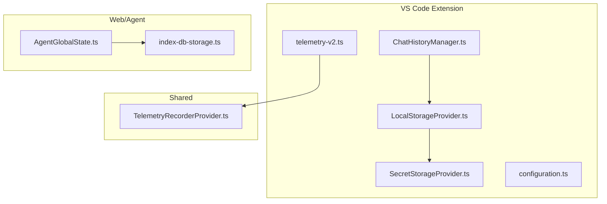
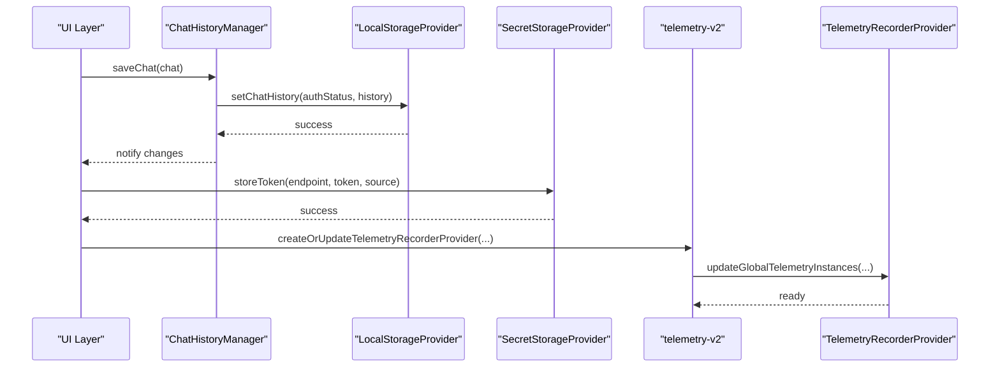
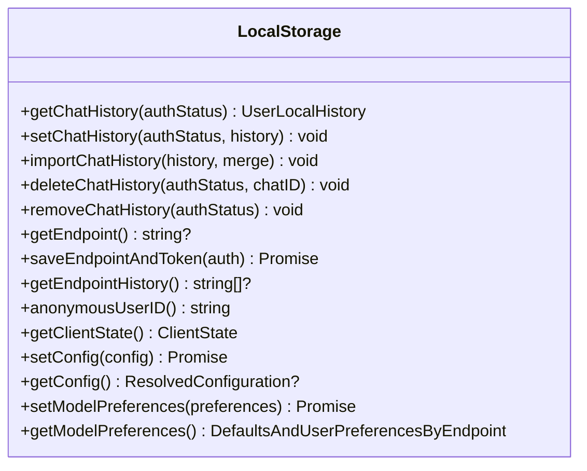
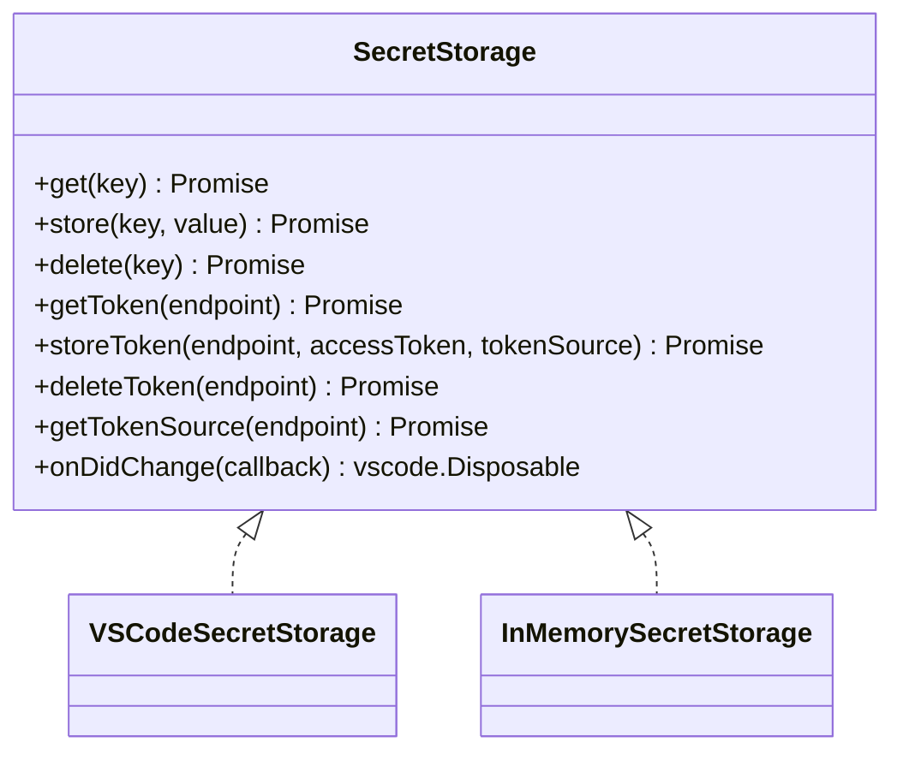
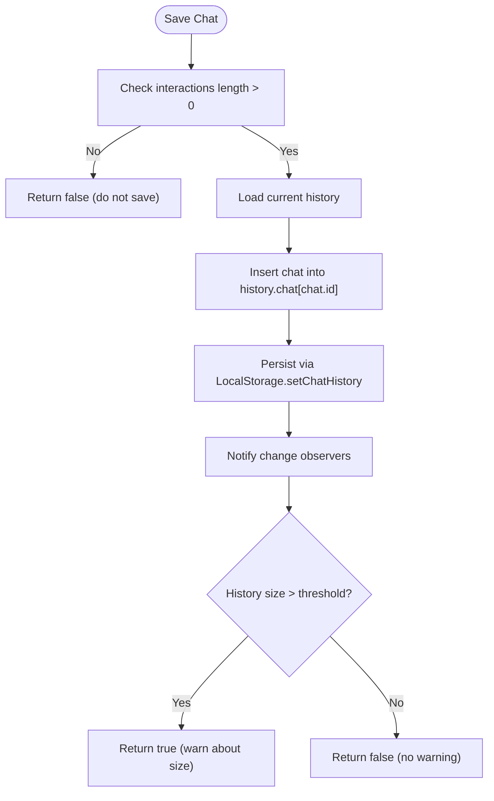
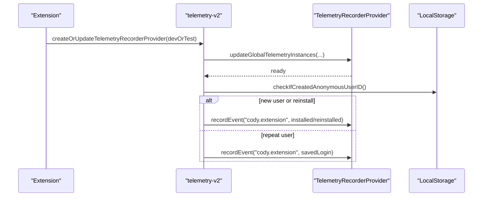
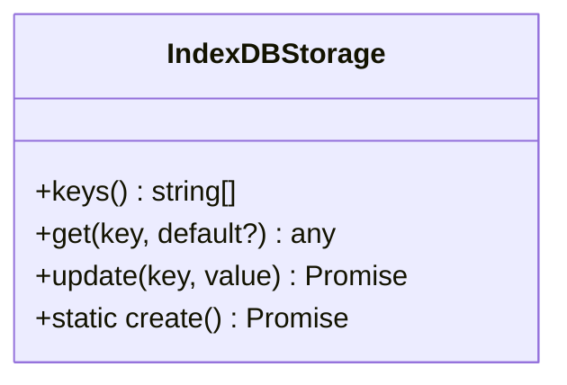
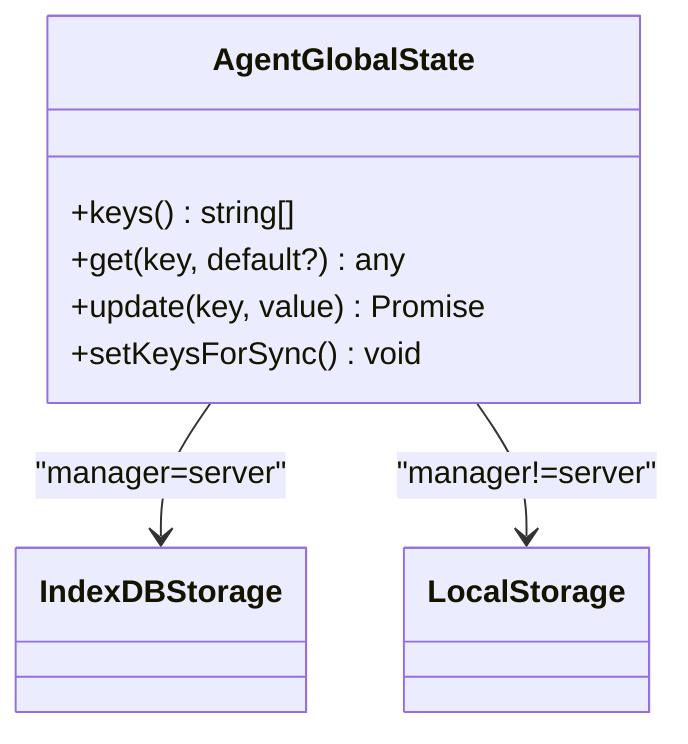
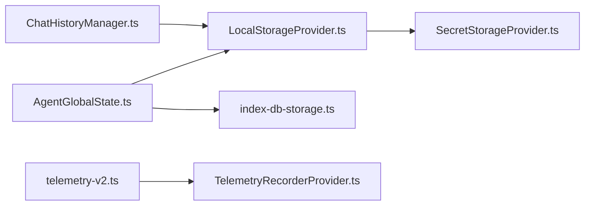

# Data Management

<cite>
**Referenced Files in This Document**
- [LocalStorageProvider.ts](file://vscode/src/services/LocalStorageProvider.ts)
- [SecretStorageProvider.ts](file://vscode/src/services/SecretStorageProvider.ts)
- [ChatHistoryManager.ts](file://vscode/src/chat/chat-view/ChatHistoryManager.ts)
- [index-db-storage.ts](file://web/lib/agent/index-db-storage.ts)
- [telemetry-v2.ts](file://vscode/src/services/telemetry-v2.ts)
- [TelemetryRecorderProvider.ts](file://lib/shared/src/telemetry-v2/TelemetryRecorderProvider.ts)
- [configuration.ts](file://vscode/src/configuration.ts)
- [AgentGlobalState.ts](file://agent/src/global-state/AgentGlobalState.ts)
- [AgentSecretStorage.ts](file://agent/src/AgentSecretStorage.ts)
- [AgentWorkspaceDocuments.ts](file://agent/src/AgentWorkspaceDocuments.ts)
- [AgentWorkspaceConfiguration.ts](file://agent/src/AgentWorkspaceConfiguration.ts)
- [AgentAuthHandler.ts](file://agent/src/AgentAuthHandler.ts)
- [AgentTextDocument.ts](file://agent/src/AgentTextDocument.ts)
- [AgentTextEditor.ts](file://agent/src/AgentTextEditor.ts)
- [AgentTabGroups.ts](file://agent/src/AgentTabGroups.ts)
- [AgentWebviewPanel.ts](file://agent/src/AgentWebviewPanel.ts)
- [AgentProviders.ts](file://agent/src/AgentProviders.ts)
- [AgentQuickPick.ts](file://agent/src/AgentQuickPick.ts)
- [AgentDiagnostics.ts](file://agent/src/AgentDiagnostics.ts)
- [AgentFixupControls.ts](file://agent/src/AgentFixupControls.ts)
- [AgentWorkspaceConfiguration.test.ts](file://agent/src/AgentWorkspaceConfiguration.test.ts)
- [AgentWorkspaceDocuments.test.ts](file://agent/src/AgentWorkspaceDocuments.test.ts)
- [AgentWorkspaceConfiguration.test.ts](file://agent/src/AgentWorkspaceConfiguration.test.ts)
- [AgentWorkspaceDocuments.test.ts](file://agent/src/AgentWorkspaceDocuments.test.ts)
- [AgentSecretStorage.test.ts](file://agent/src/AgentSecretStorage.test.ts)
- [AgentAuthHandler.test.ts](file://agent/src/AgentAuthHandler.test.ts)
- [AgentTextDocument.test.ts](file://agent/src/AgentTextDocument.test.ts)
- [AgentTextEditor.test.ts](file://agent/src/AgentTextEditor.test.ts)
- [AgentTabGroups.test.ts](file://agent/src/AgentTabGroups.test.ts)
- [AgentWebviewPanel.test.ts](file://agent/src/AgentWebviewPanel.test.ts)
- [AgentProviders.test.ts](file://agent/src/AgentProviders.test.ts)
- [AgentQuickPick.test.ts](file://agent/src/AgentQuickPick.test.ts)
- [AgentDiagnostics.test.ts](file://agent/src/AgentDiagnostics.test.ts)
- [AgentFixupControls.test.ts](file://agent/src/AgentFixupControls.test.ts)
- [AgentGlobalState.test.ts](file://agent/src/GlobalState.test.ts)
- [AgentGlobalState.test.ts](file://agent/src/AgentGlobalState.test.ts)
- [AgentWorkspaceConfiguration.test.ts](file://agent/src/AgentWorkspaceConfiguration.test.ts)
- [AgentWorkspaceDocuments.test.ts](file://agent/src/AgentWorkspaceDocuments.test.ts)
- [AgentSecretStorage.test.ts](file://agent/src/AgentSecretStorage.test.ts)
- [AgentAuthHandler.test.ts](file://agent/src/AgentAuthHandler.test.ts)
- [AgentTextDocument.test.ts](file://agent/src/AgentTextDocument.test.ts)
- [AgentTextEditor.test.ts](file://agent/src/AgentTextEditor.test.ts)
- [AgentTabGroups.test.ts](file://agent/src/AgentTabGroups.test.ts)
- [AgentWebviewPanel.test.ts](file://agent/src/AgentWebviewPanel.test.ts)
- [AgentProviders.test.ts](file://agent/src/AgentProviders.test.ts)
- [AgentQuickPick.test.ts](file://agent/src/AgentQuickPick.test.ts)
- [AgentDiagnostics.test.ts](file://agent/src/AgentDiagnostics.test.ts)
- [AgentFixupControls.test.ts](file://agent/src/AgentFixupControls.test.ts)
- [AgentGlobalState.test.ts](file://agent/src/GlobalState.test.ts)
- [AgentGlobalState.test.ts](file://agent/src/AgentGlobalState.test.ts)
- [AgentWorkspaceConfiguration.test.ts](file://agent/src/AgentWorkspaceConfiguration.test.ts)
- [AgentWorkspaceDocuments.test.ts](file://agent/src/AgentWorkspaceDocuments.test.ts)
- [AgentSecretStorage.test.ts](file://agent/src/AgentSecretStorage.test.ts)
- [AgentAuthHandler.test.ts](file://agent/src/AgentAuthHandler.test.ts)
- [AgentTextDocument.test.ts](file://agent/src/AgentTextDocument.test.ts)
- [AgentTextEditor.test.ts](file://agent/src/AgentTextEditor.test.ts)
- [AgentTabGroups.test.ts](file://agent/src/AgentTabGroups.test.ts)
- [AgentWebviewPanel.test.ts](file://agent/src/AgentWebviewPanel.test.ts)
- [AgentProviders.test.ts](file://agent/src/AgentProviders.test.ts)
- [AgentQuickPick.test.ts](file://agent/src/AgentQuickPick.test.ts)
- [AgentDiagnostics.test.ts](file://agent/src/AgentDiagnostics.test.ts)
- [AgentFixupControls.test.ts](file://agent/src/AgentFixupControls.test.ts)
- [AgentGlobalState.test.ts](file://agent/src/GlobalState.test.ts)
- [AgentGlobalState.test.ts](file://agent/src/AgentGlobalState.test.ts)
- [AgentWorkspaceConfiguration.test.ts](file://agent/src/AgentWorkspaceConfiguration.test.ts)
- [AgentWorkspaceDocuments.test.ts](file://agent/src/AgentWorkspaceDocuments.test.ts)
- [AgentSecretStorage.test.ts](file://agent/src/AgentSecretStorage.test.ts)
- [AgentAuthHandler.test.ts](file://agent/src/AgentAuthHandler.test.ts)
- [AgentTextDocument.test.ts](file://agent/src/AgentTextDocument.test.ts)
- [AgentTextEditor.test.ts](file://agent/src/AgentTextEditor.test.ts)
- [AgentTabGroups.test.ts](file://agent/src/AgentTabGroups.test.ts)
- [AgentWebviewPanel.test.ts](file://agent/src/AgentWebviewPanel.test.ts)
- [AgentProviders.test.ts](file://agent/src/AgentProviders.test.ts)
- [AgentQuickPick.test.ts](file://agent/src/AgentQuickPick.test.ts)
- [AgentDiagnostics.test.ts](file://agent/src/AgentDiagnostics.test.ts)
- [AgentFixupControls.test.ts](file://agent/src/AgentFixupControls.test.ts)
- [AgentGlobalState.test.ts](file://agent/src/GlobalState.test.ts)
- [AgentGlobalState.test.ts](file://agent/src/AgentGlobalState.test.ts)
- [AgentWorkspaceConfiguration.test.ts](file://agent/src/AgentWorkspaceConfiguration.test.ts)
- [AgentWorkspaceDocuments.test.ts](file://agent/src/AgentWorkspaceDocuments.test.ts)
- [AgentSecretStorage.test.ts](file://agent/src/AgentSecretStorage.test.ts)
- [AgentAuthHandler.test.ts](file://agent/src/AgentAuthHandler.test.ts)
- [AgentTextDocument.test.ts](file://agent/src/AgentTextDocument.test.ts)
- [AgentTextEditor.test.ts](file://agent/src/AgentTextEditor.test.ts)
- [AgentTabGroups.test.ts](file://agent/src/AgentTabGroups.test.ts)
- [AgentWebviewPanel.test.ts](file://agent/src/AgentWebviewPanel.test.ts)
- [AgentProviders.test.ts](file://agent/src/AgentProviders.test.ts)
- [AgentQuickPick.test.ts](file://agent/src/AgentQuickPick.test.ts)
- [AgentDiagnostics.test.ts](file://agent/src/AgentDiagnostics.test.ts)
- [AgentFixupControls.test.ts](file://agent/src/AgentFixupControls.test.ts)
- [AgentGlobalState.test.ts](file://agent/src/GlobalState.test.ts)
- [AgentGlobalState.test.ts](file://agent/src/AgentGlobalState.test.ts)
- [AgentWorkspaceConfiguration.test.ts](file://agent/src/AgentWorkspaceConfiguration.test.ts)
- [AgentWorkspaceDocuments.test.ts](file://agent/src/AgentWorkspaceDocuments.test.ts)
- [AgentSecretStorage.test.ts](file://agent/src/AgentSecretStorage.test.ts)
- [AgentAuthHandler.test.ts](file://agent/src/AgentAuthHandler.test.ts)
- [AgentTextDocument.test.ts](file://agent/src/AgentTextDocument.test.ts)
- [AgentTextEditor.test.ts](file://agent/src/AgentTextEditor.test.ts)
- [AgentTabGroups.test.ts](file://agent/src/AgentTabGroups.test.ts)
- [AgentWebviewPanel.test.ts](file://agent/src/AgentWebviewPanel.test.ts)
- [AgentProviders.test.ts](file://agent/src/AgentProviders.test.ts)
- [AgentQuickPick.test.ts](file://agent/src/AgentQuickPick.test.ts)
- [AgentDiagnostics.test.ts](file://agent/src/AgentDiagnostics.test.ts)
- [AgentFixupControls.test.ts](file://agent/src/AgentFixupControls.test.ts)
- [AgentGlobalState.test.ts](file://agent/src/GlobalState.test.ts)
- [AgentGlobalState.test.ts](file://agent/src/AgentGlobalState.test.ts)
- [AgentWorkspaceConfiguration.test.ts](file://agent/src/AgentWorkspaceConfiguration.test.ts)
- [AgentWorkspaceDocuments.test.ts](file://agent/src/AgentWorkspaceDocuments.test.ts)
- [AgentSecretStorage.test.ts](file://agent/src/AgentSecretStorage.test.ts)
- [AgentAuthHandler.test.ts](file://agent/src/AgentAuthHandler.test.ts)
- [AgentTextDocument.test.ts](file://agent/src/AgentTextDocument.test.ts)
- [AgentTextEditor.test.ts](file://agent/src/AgentTextEditor.test.ts)
- [AgentTabGroups.test.ts](file://agent/src/AgentTabGroups.test......)
</cite>

## Table of Contents
1. [Introduction](#introduction)
2. [Project Structure](#project-structure)
3. [Core Components](#core-components)
4. [Architecture Overview](#architecture-overview)
5. [Detailed Component Analysis](#detailed-component-analysis)
6. [Dependency Analysis](#dependency-analysis)
7. [Performance Considerations](#performance-considerations)
8. [Troubleshooting Guide](#troubleshooting-guide)
9. [Conclusion](#conclusion)
10. [Appendices](#appendices)

## Introduction
This document explains how the Cody platform manages data across local storage, secrets, chat history, telemetry, and agent-side persistence. It covers:
- Persistent data storage and configuration persistence
- Telemetry and analytics collection, including privacy controls
- Secret storage for authentication tokens and API keys
- Chat history management, context caching, and temporary file handling
- Data lifecycle, retention, and cleanup
- Cross-platform data synchronization and offline capabilities
- Privacy and compliance guidance, plus troubleshooting and performance tips

## Project Structure
The data management system spans multiple layers:
- VS Code extension layer: local storage, secret storage, chat history, telemetry
- Web/Agent layer: IndexedDB-backed storage for web workers and agent environments
- Shared telemetry framework: event recording and metadata processing
- Configuration subsystem: runtime configuration and telemetry level

**Diagram sources**
- [LocalStorageProvider.ts:27-385](file://vscode/src/services/LocalStorageProvider.ts#L27-L385)
- [SecretStorageProvider.ts:26-133](file://vscode/src/services/SecretStorageProvider.ts#L26-L133)
- [ChatHistoryManager.ts:21-197](file://vscode/src/chat/chat-view/ChatHistoryManager.ts#L21-L197)
- [index-db-storage.ts:9-77](file://web/lib/agent/index-db-storage.ts#L9-L77)
- [telemetry-v2.ts:26-99](file://vscode/src/services/telemetry-v2.ts#L26-L99)
- [TelemetryRecorderProvider.ts:182-207](file://lib/shared/src/telemetry-v2/TelemetryRecorderProvider.ts#L182-L207)
- [AgentGlobalState.ts:50-93](file://agent/src/global-state/AgentGlobalState.ts#L50-L93)

**Section sources**
- [LocalStorageProvider.ts:1-432](file://vscode/src/services/LocalStorageProvider.ts#L1-L432)
- [SecretStorageProvider.ts:1-256](file://vscode/src/services/SecretStorageProvider.ts#L1-L256)
- [ChatHistoryManager.ts:1-197](file://vscode/src/chat/chat-view/ChatHistoryManager.ts#L1-L197)
- [index-db-storage.ts:1-78](file://web/lib/agent/index-db-storage.ts#L1-L78)
- [telemetry-v2.ts:1-172](file://vscode/src/services/telemetry-v2.ts#L1-L172)
- [TelemetryRecorderProvider.ts:182-207](file://lib/shared/src/telemetry-v2/TelemetryRecorderProvider.ts#L182-L207)
- [configuration.ts:1-200](file://vscode/src/configuration.ts#L1-L200)
- [AgentGlobalState.ts:50-93](file://agent/src/global-state/AgentGlobalState.ts#L50-L93)

## Core Components
- Local storage provider: centralized persistence for chat history, configuration, endpoint history, model preferences, and device pixel ratio. Supports ephemeral in-memory and no-op modes for testing.
- Secret storage provider: secure token storage with fallback to filesystem for environments without native secret storage. Provides token source metadata and change notifications.
- Chat history manager: lightweight history projection, saving, importing, renaming, deleting, and clearing chat sessions with observable updates.
- Telemetry v2: initializes and updates telemetry recorder providers, attaches configuration metadata, and enforces privacy-safe metadata splitting.
- Web/Agent IndexedDB storage: synchronous Memento-compatible wrapper around IndexedDB for web worker contexts.
- Agent global state: bridges agent-side storage and configuration, delegating to IndexedDB or local storage depending on environment.

**Section sources**
- [LocalStorageProvider.ts:27-385](file://vscode/src/services/LocalStorageProvider.ts#L27-L385)
- [SecretStorageProvider.ts:26-133](file://vscode/src/services/SecretStorageProvider.ts#L26-L133)
- [ChatHistoryManager.ts:21-197](file://vscode/src/chat/chat-view/ChatHistoryManager.ts#L21-L197)
- [telemetry-v2.ts:26-99](file://vscode/src/services/telemetry-v2.ts#L26-L99)
- [index-db-storage.ts:9-77](file://web/lib/agent/index-db-storage.ts#L9-L77)
- [AgentGlobalState.ts:50-93](file://agent/src/global-state/AgentGlobalState.ts#L50-L93)

## Architecture Overview
The data management architecture separates concerns:
- Local storage persists user data and configuration
- Secret storage isolates tokens and sensitive credentials
- Chat history manager coordinates history lifecycle and projections
- Telemetry framework records events with privacy safeguards
- Agent environments use IndexedDB for persistence in web workers

**Diagram sources**
- [ChatHistoryManager.ts:94-109](file://vscode/src/chat/chat-view/ChatHistoryManager.ts#L94-L109)
- [LocalStorageProvider.ts:190-213](file://vscode/src/services/LocalStorageProvider.ts#L190-L213)
- [SecretStorageProvider.ts:97-112](file://vscode/src/services/SecretStorageProvider.ts#L97-L112)
- [telemetry-v2.ts:32-99](file://vscode/src/services/telemetry-v2.ts#L32-L99)
- [TelemetryRecorderProvider.ts:182-207](file://lib/shared/src/telemetry-v2/TelemetryRecorderProvider.ts#L182-L207)

## Detailed Component Analysis

### Local Storage Provider
Responsibilities:
- Persist chat history per authenticated account key
- Store configuration, endpoint history, model preferences, and device pixel ratio
- Generate and manage anonymous user IDs
- Provide observable client state and change notifications
- Support ephemeral in-memory and no-op modes for testing

Key behaviors:
- Account-scoped chat history keyed by endpoint and username
- Endpoint history deduplication and pruning
- Deprecated key cleanup
- Size-aware chat history threshold for warnings

**Diagram sources**
- [LocalStorageProvider.ts:27-385](file://vscode/src/services/LocalStorageProvider.ts#L27-L385)

**Section sources**
- [LocalStorageProvider.ts:27-385](file://vscode/src/services/LocalStorageProvider.ts#L27-L385)

### Secret Storage Provider
Responsibilities:
- Securely store and retrieve access tokens per endpoint
- Store token source metadata alongside tokens
- Provide change notifications for token updates
- Fallback to filesystem for environments without native secret storage
- Expose shorthand APIs for token CRUD operations

Security highlights:
- Tokens are stored per endpoint to isolate credentials
- Token source metadata is persisted separately
- Change events filtered to current endpoint token key

**Diagram sources**
- [SecretStorageProvider.ts:8-133](file://vscode/src/services/SecretStorageProvider.ts#L8-L133)
- [SecretStorageProvider.ts:135-223](file://vscode/src/services/SecretStorageProvider.ts#L135-L223)

**Section sources**
- [SecretStorageProvider.ts:26-133](file://vscode/src/services/SecretStorageProvider.ts#L26-L133)
- [SecretStorageProvider.ts:135-223](file://vscode/src/services/SecretStorageProvider.ts#L135-L223)

### Chat History Manager
Responsibilities:
- Provide lightweight history for UI lists
- Save, import, rename, delete, and clear chat sessions
- Emit observable streams for full and lightweight histories
- Enforce non-empty chats before saving
- Warn when history exceeds a configured size threshold

**Diagram sources**
- [ChatHistoryManager.ts:94-109](file://vscode/src/chat/chat-view/ChatHistoryManager.ts#L94-L109)
- [LocalStorageProvider.ts:190-213](file://vscode/src/services/LocalStorageProvider.ts#L190-L213)

**Section sources**
- [ChatHistoryManager.ts:49-118](file://vscode/src/chat/chat-view/ChatHistoryManager.ts#L49-L118)

### Telemetry and Analytics
Responsibilities:
- Initialize telemetry recorder providers based on environment
- Attach configuration metadata (including tier derived from auth status)
- Split metadata into safe and private categories for privacy
- Record initial extension events (installation, reinstallation, saved login)

Privacy controls:
- Metadata splitting ensures sensitive data goes to private metadata
- Transcript data restrictions apply for non-dotcom users
- Dev/test mode limits exported events

**Diagram sources**
- [telemetry-v2.ts:26-99](file://vscode/src/services/telemetry-v2.ts#L26-L99)
- [TelemetryRecorderProvider.ts:182-207](file://lib/shared/src/telemetry-v2/TelemetryRecorderProvider.ts#L182-L207)

**Section sources**
- [telemetry-v2.ts:26-99](file://vscode/src/services/telemetry-v2.ts#L26-L99)
- [TelemetryRecorderProvider.ts:182-207](file://lib/shared/src/telemetry-v2/TelemetryRecorderProvider.ts#L182-L207)

### Web/Agent IndexedDB Storage
Responsibilities:
- Provide a synchronous Memento-like interface backed by IndexedDB
- Hydrate in-memory map on initialization
- Persist updates to IndexedDB and keep in-memory cache in sync
- Used in web worker contexts where only IndexedDB is available

**Diagram sources**
- [index-db-storage.ts:9-77](file://web/lib/agent/index-db-storage.ts#L9-L77)

**Section sources**
- [index-db-storage.ts:9-77](file://web/lib/agent/index-db-storage.ts#L9-L77)

### Agent Global State and Cross-Platform Persistence
Responsibilities:
- Bridge agent-side storage and configuration
- Delegate to IndexedDB or local storage depending on environment
- Expose keys and values consistently across managers

**Diagram sources**
- [AgentGlobalState.ts:50-93](file://agent/src/global-state/AgentGlobalState.ts#L50-L93)
- [index-db-storage.ts:9-77](file://web/lib/agent/index-db-storage.ts#L9-L77)
- [LocalStorageProvider.ts:27-385](file://vscode/src/services/LocalStorageProvider.ts#L27-L385)

**Section sources**
- [AgentGlobalState.ts:50-93](file://agent/src/global-state/AgentGlobalState.ts#L50-L93)

## Dependency Analysis
- Local storage depends on VS Code Memento and is initialized with global state
- Secret storage depends on VS Code SecretStorage and optionally falls back to filesystem
- Chat history manager depends on local storage and observable auth state
- Telemetry v2 depends on resolved configuration and auth state
- Agent global state depends on environment to choose IndexedDB vs local storage

**Diagram sources**
- [LocalStorageProvider.ts:27-385](file://vscode/src/services/LocalStorageProvider.ts#L27-L385)
- [SecretStorageProvider.ts:26-133](file://vscode/src/services/SecretStorageProvider.ts#L26-L133)
- [ChatHistoryManager.ts:21-197](file://vscode/src/chat/chat-view/ChatHistoryManager.ts#L21-L197)
- [telemetry-v2.ts:26-99](file://vscode/src/services/telemetry-v2.ts#L26-L99)
- [TelemetryRecorderProvider.ts:182-207](file://lib/shared/src/telemetry-v2/TelemetryRecorderProvider.ts#L182-L207)
- [AgentGlobalState.ts:50-93](file://agent/src/global-state/AgentGlobalState.ts#L50-L93)
- [index-db-storage.ts:9-77](file://web/lib/agent/index-db-storage.ts#L9-L77)

**Section sources**
- [LocalStorageProvider.ts:27-385](file://vscode/src/services/LocalStorageProvider.ts#L27-L385)
- [SecretStorageProvider.ts:26-133](file://vscode/src/services/SecretStorageProvider.ts#L26-L133)
- [ChatHistoryManager.ts:21-197](file://vscode/src/chat/chat-view/ChatHistoryManager.ts#L21-L197)
- [telemetry-v2.ts:26-99](file://vscode/src/services/telemetry-v2.ts#L26-L99)
- [TelemetryRecorderProvider.ts:182-207](file://lib/shared/src/telemetry-v2/TelemetryRecorderProvider.ts#L182-L207)
- [AgentGlobalState.ts:50-93](file://agent/src/global-state/AgentGlobalState.ts#L50-L93)
- [index-db-storage.ts:9-77](file://web/lib/agent/index-db-storage.ts#L9-L77)

## Performance Considerations
- Chat history size threshold: when history exceeds a configured size, the system warns to encourage cleanup. Persist less frequently and avoid empty chats to reduce overhead.
- Local storage operations: batch updates where possible and avoid excessive writes during rapid UI interactions.
- Secret storage fallback: filesystem fallback is slower than native secret storage; prefer native storage when available.
- IndexedDB in web workers: synchronous Memento interface is backed by asynchronous IndexedDB; ensure minimal blocking and cache in-memory for frequent reads.
- Telemetry metadata splitting: keep metadata numeric/binary-safe to avoid large private metadata payloads.

[No sources needed since this section provides general guidance]

## Troubleshooting Guide
Common issues and resolutions:
- Chat history not saving
  - Ensure chat has interactions; empty chats are ignored.
  - Verify local storage initialization and that the change event fires.
  - Check history size threshold warnings and prune old sessions.
  - References: [ChatHistoryManager.ts:94-109](file://vscode/src/chat/chat-view/ChatHistoryManager.ts#L94-L109), [LocalStorageProvider.ts:190-213](file://vscode/src/services/LocalStorageProvider.ts#L190-L213)

- Token not found or invalid
  - Confirm endpoint-specific token is stored under the correct key.
  - Check token source metadata and change notifications.
  - If native secret storage is unavailable, verify filesystem fallback path and permissions.
  - References: [SecretStorageProvider.ts:89-118](file://vscode/src/services/SecretStorageProvider.ts#L89-L118), [SecretStorageProvider.ts:225-240](file://vscode/src/services/SecretStorageProvider.ts#L225-L240)

- Telemetry events not recorded
  - Verify telemetry recorder provider initialization and environment mode.
  - Ensure metadata splitting and privacy rules are followed.
  - References: [telemetry-v2.ts:32-99](file://vscode/src/services/telemetry-v2.ts#L32-L99), [TelemetryRecorderProvider.ts:182-207](file://lib/shared/src/telemetry-v2/TelemetryRecorderProvider.ts#L182-L207)

- IndexedDB storage errors in web worker
  - Confirm IndexedDB creation and object store initialization.
  - Check in-memory hydration and update synchronization.
  - References: [index-db-storage.ts:37-77](file://web/lib/agent/index-db-storage.ts#L37-L77)

- Data cleanup and retention
  - Use local storage deletion APIs to remove endpoint history and tokens.
  - Clear chat history per account and reset storage when necessary.
  - References: [LocalStorageProvider.ts:134-155](file://vscode/src/services/LocalStorageProvider.ts#L134-L155), [LocalStorageProvider.ts:252-276](file://vscode/src/services/LocalStorageProvider.ts#L252-L276)

**Section sources**
- [ChatHistoryManager.ts:94-109](file://vscode/src/chat/chat-view/ChatHistoryManager.ts#L94-L109)
- [LocalStorageProvider.ts:134-155](file://vscode/src/services/LocalStorageProvider.ts#L134-L155)
- [LocalStorageProvider.ts:190-213](file://vscode/src/services/LocalStorageProvider.ts#L190-L213)
- [LocalStorageProvider.ts:252-276](file://vscode/src/services/LocalStorageProvider.ts#L252-L276)
- [SecretStorageProvider.ts:89-118](file://vscode/src/services/SecretStorageProvider.ts#L89-L118)
- [SecretStorageProvider.ts:225-240](file://vscode/src/services/SecretStorageProvider.ts#L225-L240)
- [telemetry-v2.ts:32-99](file://vscode/src/services/telemetry-v2.ts#L32-L99)
- [TelemetryRecorderProvider.ts:182-207](file://lib/shared/src/telemetry-v2/TelemetryRecorderProvider.ts#L182-L207)
- [index-db-storage.ts:37-77](file://web/lib/agent/index-db-storage.ts#L37-L77)

## Conclusion
Cody’s data management system is layered and privacy-conscious:
- Local storage centralizes user data and configuration
- Secret storage isolates tokens securely
- Chat history manager provides lifecycle control and efficient UI projections
- Telemetry framework enforces privacy-safe metadata handling
- Agent environments use IndexedDB for persistence in web workers

Adhering to the documented patterns and troubleshooting steps helps maintain reliability, performance, and user privacy across platforms.

[No sources needed since this section summarizes without analyzing specific files]

## Appendices

### Data Lifecycle and Retention
- Chat history: stored per account, pruned by deletion and size thresholds; import supports merging
- Endpoint history: maintained as a set, deduplicated, and cleared when endpoints change
- Anonymous user ID: generated once and reused across sessions
- Configuration: persisted and observable; deprecated keys are cleaned up

**Section sources**
- [LocalStorageProvider.ts:174-296](file://vscode/src/services/LocalStorageProvider.ts#L174-L296)

### Cross-Platform Synchronization and Offline Capabilities
- VS Code: relies on VS Code Memento and SecretStorage
- Web/Agent: uses IndexedDB for persistence in web workers
- Agent global state switches between managers based on environment

**Section sources**
- [index-db-storage.ts:9-77](file://web/lib/agent/index-db-storage.ts#L9-L77)
- [AgentGlobalState.ts:50-93](file://agent/src/global-state/AgentGlobalState.ts#L50-L93)

### Privacy and Compliance Guidance
- Use telemetry metadata splitting to keep sensitive data in private metadata
- Restrict transcript data collection to allowed tiers and contexts
- Respect user telemetry level settings and opt-out mechanisms
- Avoid storing personal data in safe metadata; prefer private metadata for sensitive attributes

**Section sources**
- [telemetry-v2.ts:126-171](file://vscode/src/services/telemetry-v2.ts#L126-L171)
- [TelemetryRecorderProvider.ts:182-207](file://lib/shared/src/telemetry-v2/TelemetryRecorderProvider.ts#L182-L207)
- [configuration.ts:95-95](file://vscode/src/configuration.ts#L95-L95)