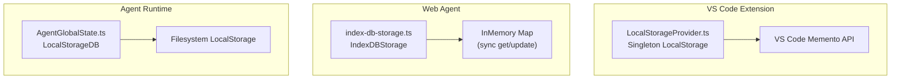
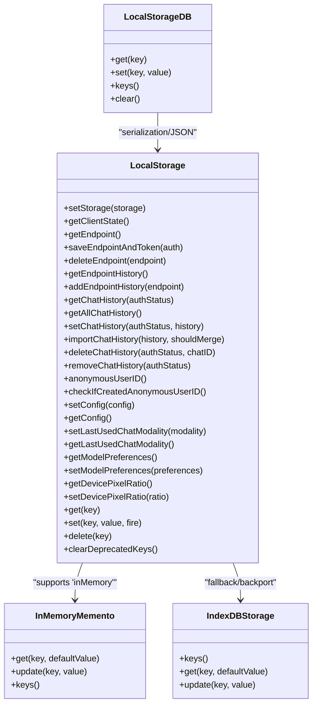
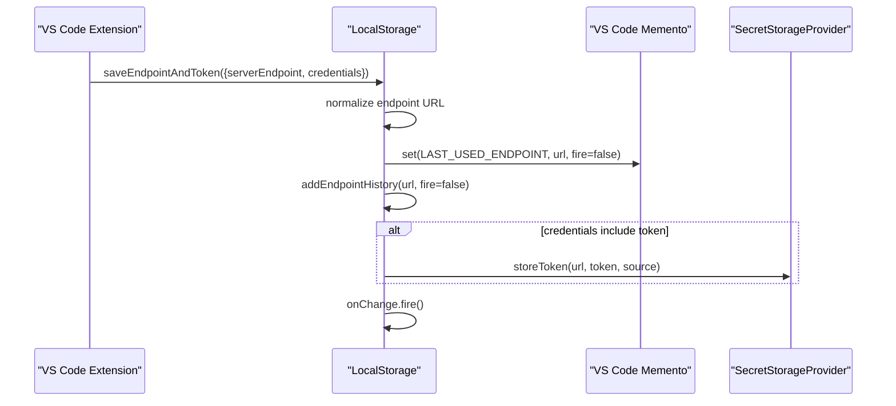
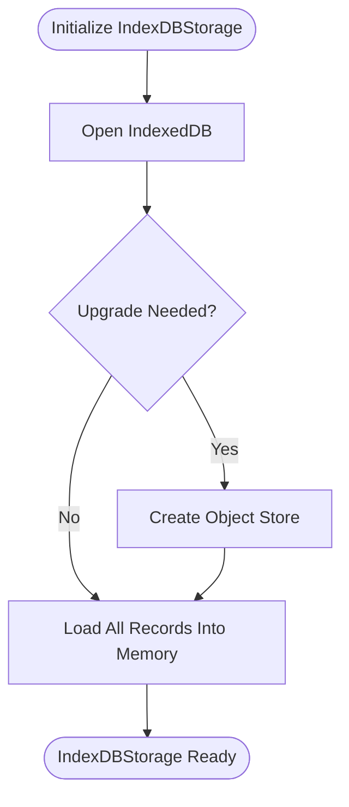
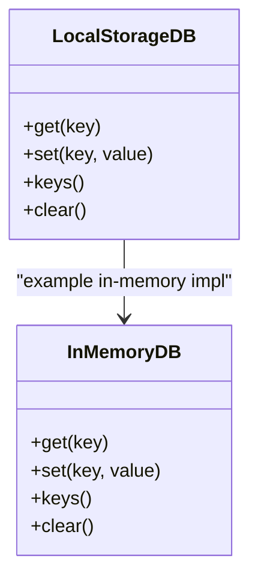
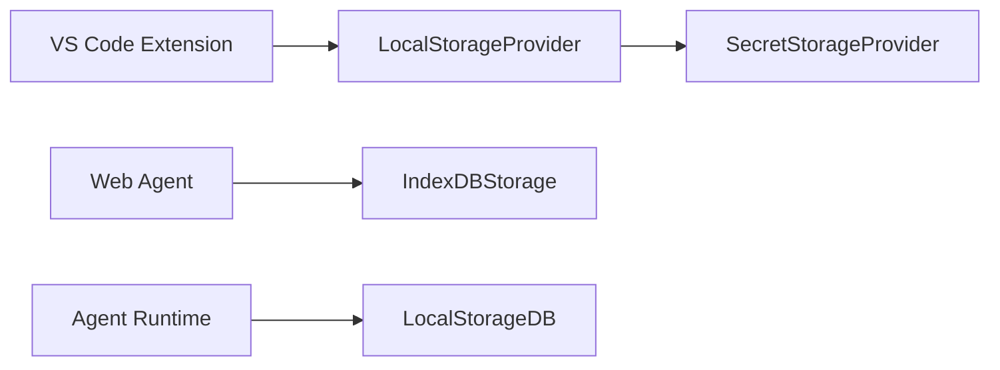

# Local Storage

<cite>
**Referenced Files in This Document**
- [LocalStorageProvider.ts](file://vscode/src/services/LocalStorageProvider.ts)
- [LocalStorageProvider.test.ts](file://vscode/src/services/LocalStorageProvider.test.ts)
- [index-db-storage.ts](file://web/lib/agent/index-db-storage.ts)
- [AgentGlobalState.ts](file://agent/src/global-state/AgentGlobalState.ts)
- [AgentGlobalState.test.ts](file://agent/src/global-state/AgentGlobalState.test.ts)
</cite>

## Table of Contents
1. [Introduction](#introduction)
2. [Project Structure](#project-structure)
3. [Core Components](#core-components)
4. [Architecture Overview](#architecture-overview)
5. [Detailed Component Analysis](#detailed-component-analysis)
6. [Dependency Analysis](#dependency-analysis)
7. [Performance Considerations](#performance-considerations)
8. [Troubleshooting Guide](#troubleshooting-guide)
9. [Conclusion](#conclusion)

## Introduction
This document explains the local storage mechanisms used by the Cody platform across VS Code and web environments. It focuses on the LocalStorageProvider implementation, which persists user preferences, chat history, authentication-related metadata, and model preferences. The document also covers the Memento pattern implementation with both in-memory and IndexedDB storage backends, storage key management, serialization behavior, cross-platform compatibility, storage limits, cleanup procedures, migration strategies, and fallback mechanisms.

## Project Structure
The local storage implementation spans three primary areas:
- VS Code extension: LocalStorageProvider wraps VS Code’s Memento API and exposes a singleton for configuration and history persistence.
- Web agent: IndexDBStorage provides an asynchronous IndexedDB-backed Memento-compatible adapter for web workers.
- Agent runtime: LocalStorageDB provides a filesystem-backed persistence layer for the native agent with explicit JSON serialization and quotas.

**Diagram sources**
- [LocalStorageProvider.ts:387-391](file://vscode/src/services/LocalStorageProvider.ts#L387-L391)
- [index-db-storage.ts:9-77](file://web/lib/agent/index-db-storage.ts#L9-L77)
- [AgentGlobalState.ts:115-149](file://agent/src/global-state/AgentGlobalState.ts#L115-L149)

**Section sources**
- [LocalStorageProvider.ts:1-432](file://vscode/src/services/LocalStorageProvider.ts#L1-L432)
- [index-db-storage.ts:1-77](file://web/lib/agent/index-db-storage.ts#L1-L77)
- [AgentGlobalState.ts:115-149](file://agent/src/global-state/AgentGlobalState.ts#L115-L149)

## Core Components
- LocalStorageProvider (VS Code):
  - Provides typed getters/setters for configuration, chat history, endpoint history, anonymous user ID, device pixel ratio, model preferences, and enrollment history.
  - Exposes a singleton instance initialized with VS Code’s Memento during activation.
  - Supports in-memory and “noop” modes for testing and environments without persistent storage.
  - Emits observable client state updates on changes.

- IndexDBStorage (Web):
  - Implements a Memento-compatible interface backed by IndexedDB.
  - Maintains an in-memory cache to satisfy synchronous get/update semantics required by the agent.
  - Hydrates from IndexedDB on initialization and writes updates asynchronously.

- LocalStorageDB (Agent):
  - Wraps a filesystem-backed LocalStorage with JSON serialization and a 256 MB quota.
  - Provides a DB-like interface with explicit handling of null/undefined values.

**Section sources**
- [LocalStorageProvider.ts:27-385](file://vscode/src/services/LocalStorageProvider.ts#L27-L385)
- [index-db-storage.ts:9-77](file://web/lib/agent/index-db-storage.ts#L9-L77)
- [AgentGlobalState.ts:115-149](file://agent/src/global-state/AgentGlobalState.ts#L115-L149)

## Architecture Overview
The platform uses a Memento pattern abstraction to decouple storage backends from application logic. The VS Code extension uses VS Code’s Memento, the web agent uses IndexedDB via a Memento-compatible adapter, and the native agent uses a filesystem-backed storage with JSON serialization.

**Diagram sources**
- [LocalStorageProvider.ts:27-385](file://vscode/src/services/LocalStorageProvider.ts#L27-L385)
- [index-db-storage.ts:9-77](file://web/lib/agent/index-db-storage.ts#L9-L77)
- [AgentGlobalState.ts:115-149](file://agent/src/global-state/AgentGlobalState.ts#L115-L149)

## Detailed Component Analysis

### LocalStorageProvider (VS Code)
- Purpose: Centralized persistence for configuration, chat history, endpoint history, anonymous user identity, model preferences, and enrollment history.
- Keys and data:
  - Endpoint and endpoint history: stores last used endpoint and recent endpoints; filters out tokens from endpoint history.
  - Chat history: per-account keyed storage of conversations.
  - Configuration: resolved configuration object.
  - Anonymous user ID: UUID generated on first access.
  - Model preferences: endpoint-scoped defaults and user preferences.
  - Enrollment history: first-enrollment logging for features.
  - Device pixel ratio: optional UI metric.
- Serialization: Uses VS Code Memento’s built-in serialization; values are persisted as-is.
- Change notifications: Emits observable client state updates when keys change.
- Initialization: Accepts a Memento instance or special modes ('inMemory', 'noop').
- Cleanup: Clears deprecated keys on initialization.

**Diagram sources**
- [LocalStorageProvider.ts:108-132](file://vscode/src/services/LocalStorageProvider.ts#L108-L132)

**Section sources**
- [LocalStorageProvider.ts:27-385](file://vscode/src/services/LocalStorageProvider.ts#L27-L385)
- [LocalStorageProvider.test.ts:8-33](file://vscode/src/services/LocalStorageProvider.test.ts#L8-L33)

### IndexDBStorage (Web)
- Purpose: Provide a Memento-compatible storage backend for web workers using IndexedDB.
- Behavior:
  - Synchronous get/update APIs satisfied by an in-memory cache.
  - Asynchronous IndexedDB writes occur alongside in-memory updates.
  - On creation, hydrates the in-memory cache from IndexedDB.
- Fallback: If IndexedDB fails, logs an error and throws to surface failure to callers.

**Diagram sources**
- [index-db-storage.ts:37-54](file://web/lib/agent/index-db-storage.ts#L37-L54)

**Section sources**
- [index-db-storage.ts:9-77](file://web/lib/agent/index-db-storage.ts#L9-L77)

### LocalStorageDB (Agent)
- Purpose: Persist agent state on the filesystem with explicit JSON serialization and a 256 MB quota.
- Behavior:
  - get: JSON.parse stored values; returns undefined on parse errors.
  - set: JSON.stringify non-null/undefined values; removes keys otherwise.
  - keys: Iterates through stored keys.
  - clear: Removes all items.

**Diagram sources**
- [AgentGlobalState.ts:95-149](file://agent/src/global-state/AgentGlobalState.ts#L95-L149)

**Section sources**
- [AgentGlobalState.ts:115-149](file://agent/src/global-state/AgentGlobalState.ts#L115-L149)
- [AgentGlobalState.test.ts:43-115](file://agent/src/global-state/AgentGlobalState.test.ts#L43-L115)

## Dependency Analysis
- VS Code extension depends on VS Code’s Memento API via LocalStorageProvider.
- Web agent depends on IndexDBStorage to satisfy Memento semantics in web workers.
- Agent runtime depends on a filesystem-backed LocalStorage with JSON serialization.
- Cross-cutting concerns:
  - SecretStorageProvider complements LocalStorage for tokens.
  - Observable client state updates coordinate UI and feature logic.

**Diagram sources**
- [LocalStorageProvider.ts:23](file://vscode/src/services/LocalStorageProvider.ts#L23)
- [index-db-storage.ts:9](file://web/lib/agent/index-db-storage.ts#L9)
- [AgentGlobalState.ts:115](file://agent/src/global-state/AgentGlobalState.ts#L115)

**Section sources**
- [LocalStorageProvider.ts:23](file://vscode/src/services/LocalStorageProvider.ts#L23)
- [index-db-storage.ts:9](file://web/lib/agent/index-db-storage.ts#L9)
- [AgentGlobalState.ts:115](file://agent/src/global-state/AgentGlobalState.ts#L115)

## Performance Considerations
- VS Code Memento:
  - Uses VS Code’s optimized persistence; minimal overhead.
  - Change notifications are emitted after batched updates to avoid redundant reactions.
- IndexDBStorage:
  - Synchronous get/update satisfied by an in-memory cache to match Memento expectations.
  - Writes are asynchronous; consider batching updates to reduce IndexedDB transactions.
- Agent LocalStorageDB:
  - JSON serialization adds CPU overhead; avoid storing excessively large objects.
  - 256 MB quota helps bound memory pressure; monitor usage to prevent eviction.

[No sources needed since this section provides general guidance]

## Troubleshooting Guide
- LocalStorage not initialized:
  - Symptom: Error thrown when accessing storage before initialization.
  - Resolution: Ensure LocalStorageProvider is initialized with a Memento instance or a supported mode.
  - Reference: [LocalStorageProvider.ts:55-61](file://vscode/src/services/LocalStorageProvider.ts#L55-L61)

- Endpoint history contains tokens:
  - Symptom: Tokens saved as endpoints.
  - Resolution: Endpoint setter filters tokens; ensure tokens are not passed as endpoints.
  - Reference: [LocalStorageProvider.ts:92-100](file://vscode/src/services/LocalStorageProvider.ts#L92-L100), [LocalStorageProvider.ts:115-117](file://vscode/src/services/LocalStorageProvider.ts#L115-L117)

- Chat history import conflicts:
  - Symptom: Overwriting or merging behavior unclear.
  - Resolution: Use import with merge flag to combine histories; otherwise replace.
  - Reference: [LocalStorageProvider.ts:215-229](file://vscode/src/services/LocalStorageProvider.ts#L215-L229)

- IndexedDB initialization failures:
  - Symptom: Error opening IndexedDB; storage unavailable.
  - Resolution: Verify browser support and permissions; inspect logs for detailed errors.
  - Reference: [index-db-storage.ts:50-53](file://web/lib/agent/index-db-storage.ts#L50-L53)

- JSON parsing errors in agent storage:
  - Symptom: get returns undefined unexpectedly.
  - Resolution: Ensure set is used with serializable values; avoid circular references.
  - Reference: [AgentGlobalState.ts:128-132](file://agent/src/global-state/AgentGlobalState.ts#L128-L132)

**Section sources**
- [LocalStorageProvider.ts:55-61](file://vscode/src/services/LocalStorageProvider.ts#L55-L61)
- [LocalStorageProvider.ts:92-100](file://vscode/src/services/LocalStorageProvider.ts#L92-L100)
- [LocalStorageProvider.ts:115-117](file://vscode/src/services/LocalStorageProvider.ts#L115-L117)
- [LocalStorageProvider.ts:215-229](file://vscode/src/services/LocalStorageProvider.ts#L215-L229)
- [index-db-storage.ts:50-53](file://web/lib/agent/index-db-storage.ts#L50-L53)
- [AgentGlobalState.ts:128-132](file://agent/src/global-state/AgentGlobalState.ts#L128-L132)

## Conclusion
Cody’s local storage strategy leverages the Memento pattern to maintain a consistent API across VS Code, web, and agent runtimes. VS Code uses VS Code’s Memento; the web uses an IndexedDB-backed Memento-compatible adapter; and the agent uses filesystem-backed JSON-serialized storage. The design supports configuration persistence, chat history, endpoint and enrollment tracking, and model preferences, with careful handling of serialization, change notifications, and cleanup. For robustness, ensure proper initialization, avoid saving tokens as endpoints, and monitor storage quotas and IndexedDB availability.