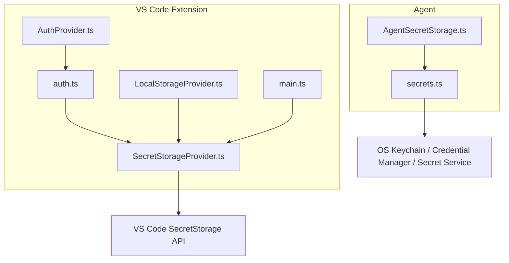
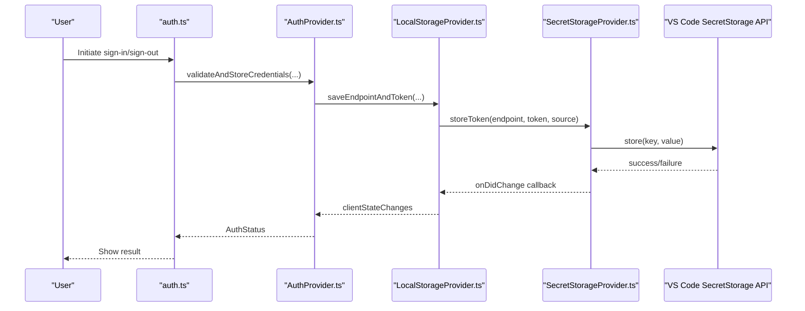
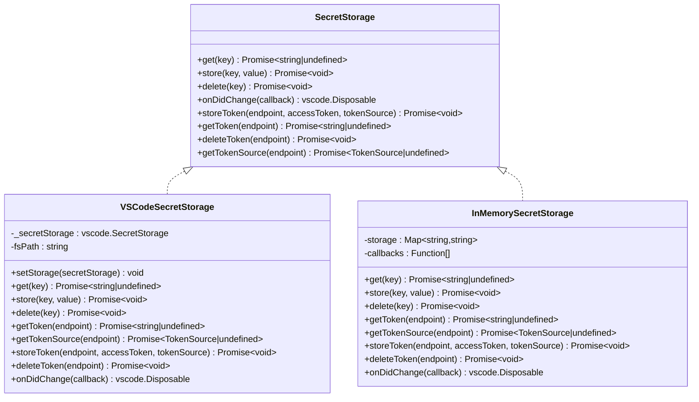
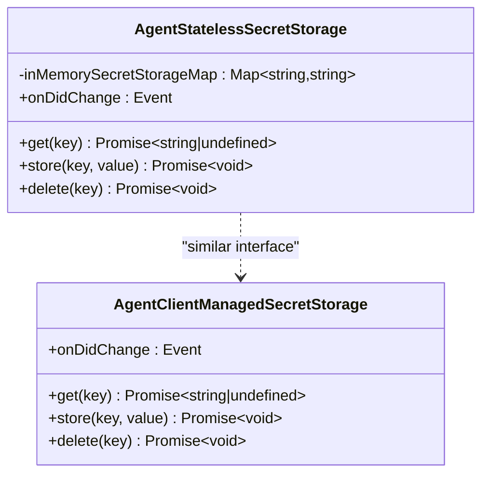
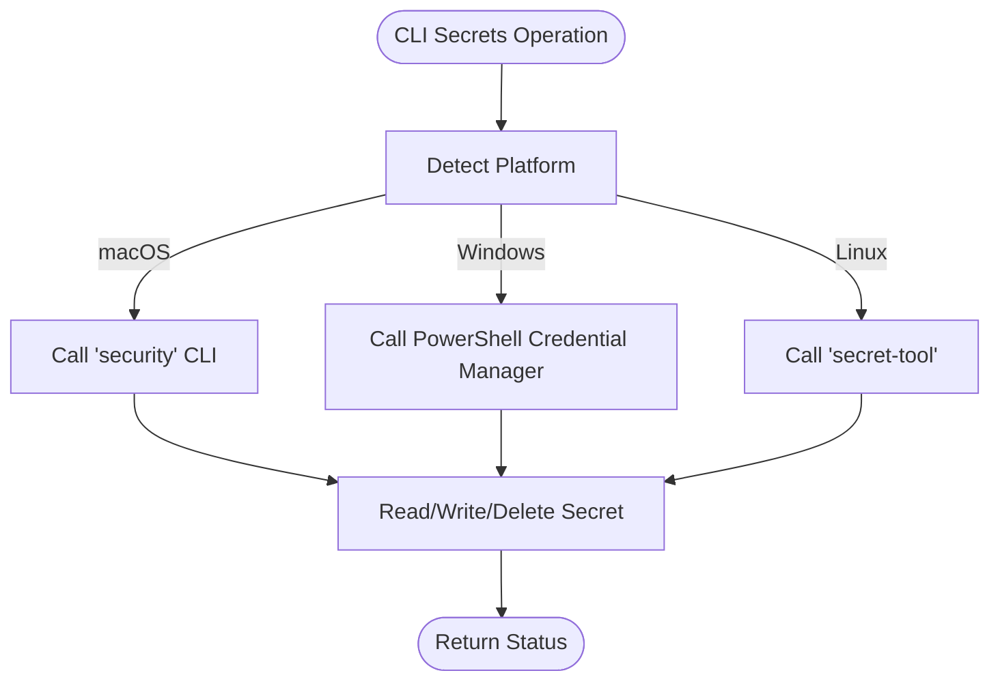
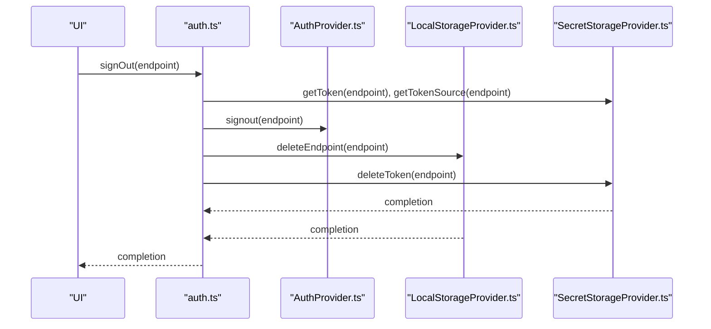
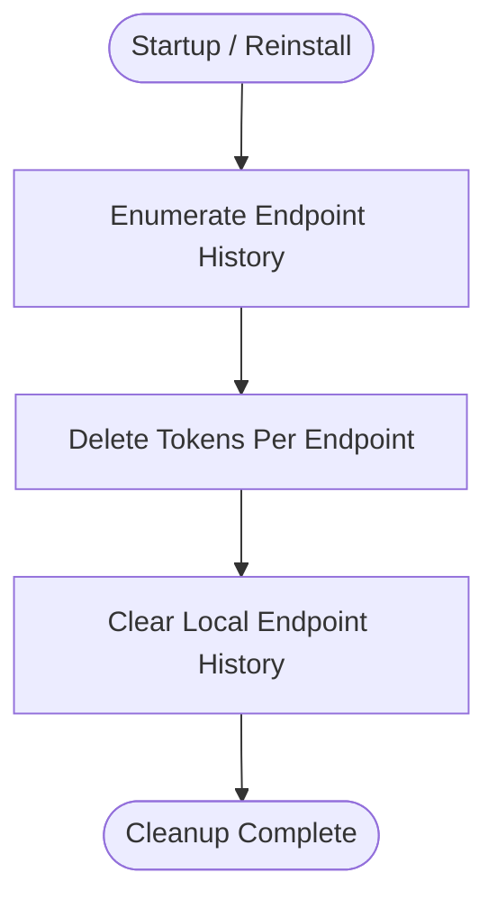
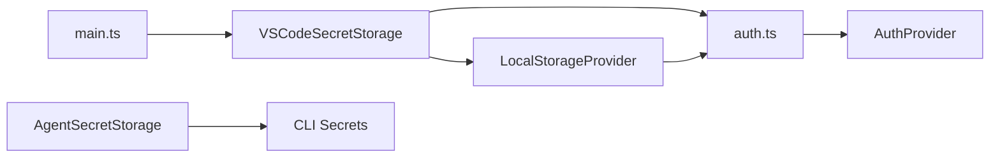

# Secret Storage

<cite>
**Referenced Files in This Document**
- [SecretStorageProvider.ts](file://vscode/src/services/SecretStorageProvider.ts)
- [auth.ts](file://vscode/src/auth/auth.ts)
- [main.ts](file://vscode/src/main.ts)
- [AuthProvider.ts](file://vscode/src/services/AuthProvider.ts)
- [LocalStorageProvider.ts](file://vscode/src/services/LocalStorageProvider.ts)
- [AgentSecretStorage.ts](file://agent/src/AgentSecretStorage.ts)
- [secrets.ts](file://agent/src/cli/command-auth/secrets.ts)
- [auth.test.ts](file://vscode/src/auth/auth.test.ts)
</cite>

## Table of Contents
1. [Introduction](#introduction)
2. [Project Structure](#project-structure)
3. [Core Components](#core-components)
4. [Architecture Overview](#architecture-overview)
5. [Detailed Component Analysis](#detailed-component-analysis)
6. [Dependency Analysis](#dependency-analysis)
7. [Performance Considerations](#performance-considerations)
8. [Troubleshooting Guide](#troubleshooting-guide)
9. [Conclusion](#conclusion)

## Introduction
This document explains the secret storage management in the Cody platform, focusing on secure authentication token and API key storage. It covers the SecretStorageProvider implementation, encryption mechanisms, platform-specific security integrations, cross-platform compatibility strategies, and operational procedures for token refresh, authentication state persistence, session management, and secure deletion. It also documents security best practices, compliance considerations, and audit logging for security events, along with troubleshooting guidance for authentication failures and secure storage corruption issues.

## Project Structure
Secret storage spans multiple modules:
- VS Code extension: SecretStorageProvider manages tokens via VS Code’s SecretStorage API and a fallback filesystem path for environments without secret storage.
- Agent: Provides agent-side secret storage abstractions and implementations for client-managed and stateless storage.
- CLI: Integrates with OS-native secret stores (macOS Keychain, Windows Credential Manager, Linux Secret Service) for secure token management.
- Services: AuthProvider, LocalStorageProvider, and main.ts orchestrate authentication, persistence, and lifecycle events.

**Diagram sources**
- [SecretStorageProvider.ts:1-256](file://vscode/src/services/SecretStorageProvider.ts#L1-L256)
- [auth.ts:1-603](file://vscode/src/auth/auth.ts#L1-L603)
- [AuthProvider.ts:1-380](file://vscode/src/services/AuthProvider.ts#L1-L380)
- [LocalStorageProvider.ts:1-432](file://vscode/src/services/LocalStorageProvider.ts#L1-L432)
- [main.ts:95-294](file://vscode/src/main.ts#L95-L294)
- [AgentSecretStorage.ts:1-60](file://agent/src/AgentSecretStorage.ts#L1-L60)
- [secrets.ts:1-283](file://agent/src/cli/command-auth/secrets.ts#L1-L283)

**Section sources**
- [SecretStorageProvider.ts:1-256](file://vscode/src/services/SecretStorageProvider.ts#L1-L256)
- [AgentSecretStorage.ts:1-60](file://agent/src/AgentSecretStorage.ts#L1-L60)
- [secrets.ts:1-283](file://agent/src/cli/command-auth/secrets.ts#L1-L283)

## Core Components
- VSCodeSecretStorage: Implements SecretStorage interface backed by VS Code’s SecretStorage API with a fallback to a configurable filesystem path for tokens. It supports storing, retrieving, deleting, and observing token changes.
- InMemorySecretStorage: A test/profiling-friendly in-memory implementation mirroring the SecretStorage interface for development and testing.
- AgentStatelessSecretStorage and AgentClientManagedSecretStorage: Agent-side abstractions for stateless and client-managed secret storage, enabling agent-hosted secret operations and JSON-RPC integration.
- OS Keychain Integration (CLI): Cross-platform secret management via native OS tools for macOS, Windows, and Linux.

Key responsibilities:
- Secure token storage and retrieval per endpoint.
- Token source tracking (redirect vs paste).
- Automatic cleanup on reinstall and logout.
- Event-driven change notifications for token updates.

**Section sources**
- [SecretStorageProvider.ts:26-133](file://vscode/src/services/SecretStorageProvider.ts#L26-L133)
- [SecretStorageProvider.ts:135-223](file://vscode/src/services/SecretStorageProvider.ts#L135-L223)
- [AgentSecretStorage.ts:5-33](file://agent/src/AgentSecretStorage.ts#L5-L33)
- [AgentSecretStorage.ts:35-59](file://agent/src/AgentSecretStorage.ts#L35-L59)
- [secrets.ts:38-68](file://agent/src/cli/command-auth/secrets.ts#L38-L68)

## Architecture Overview
The secret storage architecture integrates three layers:
- Application Layer: AuthProvider and LocalStorageProvider coordinate authentication state and persistence.
- Secret Storage Layer: VSCodeSecretStorage (VS Code), AgentStatelessSecretStorage/AgentClientManagedSecretStorage (Agent), and OS keychain integrations (CLI).
- Platform APIs: VS Code SecretStorage, OS-native keychain tools, and JSON-RPC for agent communication.

**Diagram sources**
- [auth.ts:248-280](file://vscode/src/auth/auth.ts#L248-L280)
- [AuthProvider.ts:248-280](file://vscode/src/services/AuthProvider.ts#L248-L280)
- [LocalStorageProvider.ts:108-132](file://vscode/src/services/LocalStorageProvider.ts#L108-L132)
- [SecretStorageProvider.ts:79-112](file://vscode/src/services/SecretStorageProvider.ts#L79-L112)
- [main.ts:164-167](file://vscode/src/main.ts#L164-L167)

## Detailed Component Analysis

### VSCodeSecretStorage
Responsibilities:
- Store, retrieve, and delete tokens per endpoint.
- Track token source (redirect vs paste) for policy decisions (e.g., automatic deletion on logout).
- Observe secret changes and notify higher layers.
- Fallback to a filesystem path for environments without secret storage.

Implementation highlights:
- Uses VS Code SecretStorage API for secure storage.
- Stores a default token key and a token-source key derived from the endpoint.
- Provides onDidChange to subscribe to token changes for the current endpoint.
- Includes a fallback to read/write tokens from a configured filesystem path.

**Diagram sources**
- [SecretStorageProvider.ts:8-24](file://vscode/src/services/SecretStorageProvider.ts#L8-L24)
- [SecretStorageProvider.ts:26-133](file://vscode/src/services/SecretStorageProvider.ts#L26-L133)
- [SecretStorageProvider.ts:135-223](file://vscode/src/services/SecretStorageProvider.ts#L135-L223)

**Section sources**
- [SecretStorageProvider.ts:26-133](file://vscode/src/services/SecretStorageProvider.ts#L26-L133)
- [SecretStorageProvider.ts:58-73](file://vscode/src/services/SecretStorageProvider.ts#L58-L73)
- [SecretStorageProvider.ts:97-118](file://vscode/src/services/SecretStorageProvider.ts#L97-L118)
- [SecretStorageProvider.ts:124-132](file://vscode/src/services/SecretStorageProvider.ts#L124-L132)

### Agent Secret Storage
Two agent-side implementations:
- Stateless in-memory storage for ephemeral or isolated contexts.
- Client-managed storage that proxies requests to the host via JSON-RPC.

**Diagram sources**
- [AgentSecretStorage.ts:5-33](file://agent/src/AgentSecretStorage.ts#L5-L33)
- [AgentSecretStorage.ts:35-59](file://agent/src/AgentSecretStorage.ts#L35-L59)

**Section sources**
- [AgentSecretStorage.ts:5-33](file://agent/src/AgentSecretStorage.ts#L5-L33)
- [AgentSecretStorage.ts:35-59](file://agent/src/AgentSecretStorage.ts#L35-L59)

### OS Keychain Integration (CLI)
The CLI integrates with OS-native secret stores:
- macOS: uses the security command-line tool.
- Windows: uses PowerShell Credential Manager module.
- Linux: uses secret-tool with GNOME Keyring.

**Diagram sources**
- [secrets.ts:70-81](file://agent/src/cli/command-auth/secrets.ts#L70-L81)
- [secrets.ts:126-160](file://agent/src/cli/command-auth/secrets.ts#L126-L160)
- [secrets.ts:164-201](file://agent/src/cli/command-auth/secrets.ts#L164-L201)
- [secrets.ts:203-256](file://agent/src/cli/command-auth/secrets.ts#L203-L256)

**Section sources**
- [secrets.ts:38-68](file://agent/src/cli/command-auth/secrets.ts#L38-L68)
- [secrets.ts:126-160](file://agent/src/cli/command-auth/secrets.ts#L126-L160)
- [secrets.ts:164-201](file://agent/src/cli/command-auth/secrets.ts#L164-L201)
- [secrets.ts:203-256](file://agent/src/cli/command-auth/secrets.ts#L203-L256)

### Authentication State Persistence and Session Management
- AuthProvider validates and stores credentials, emitting status changes and serializing uninstaller info.
- LocalStorageProvider persists endpoint history and last-used endpoint, coordinating with SecretStorageProvider to store tokens atomically.
- On sign-out, tokens are removed from secret storage and local storage, with optional server-side deletion for tokens created via redirect.

**Diagram sources**
- [auth.ts:423-444](file://vscode/src/auth/auth.ts#L423-L444)
- [AuthProvider.ts:236-246](file://vscode/src/services/AuthProvider.ts#L236-L246)
- [LocalStorageProvider.ts:134-155](file://vscode/src/services/LocalStorageProvider.ts#L134-L155)
- [SecretStorageProvider.ts:114-118](file://vscode/src/services/SecretStorageProvider.ts#L114-L118)

**Section sources**
- [auth.ts:423-444](file://vscode/src/auth/auth.ts#L423-L444)
- [AuthProvider.ts:236-246](file://vscode/src/services/AuthProvider.ts#L236-L246)
- [LocalStorageProvider.ts:108-132](file://vscode/src/services/LocalStorageProvider.ts#L108-L132)
- [LocalStorageProvider.ts:134-155](file://vscode/src/services/LocalStorageProvider.ts#L134-L155)

### Token Refresh Cycles and Automatic Cleanup
- AuthProvider periodically attempts revalidation when encountering availability-related errors, emitting periodic refresh signals.
- On reinstall, main.ts orchestrates cleanup by enumerating endpoints and deleting tokens from secret storage.

**Diagram sources**
- [AuthProvider.ts:148-170](file://vscode/src/services/AuthProvider.ts#L148-L170)
- [main.ts:186-196](file://vscode/src/main.ts#L186-L196)

**Section sources**
- [AuthProvider.ts:148-170](file://vscode/src/services/AuthProvider.ts#L148-L170)
- [main.ts:186-196](file://vscode/src/main.ts#L186-L196)

## Dependency Analysis
- SecretStorageProvider is consumed by LocalStorageProvider for atomic endpoint/token persistence and by AuthProvider for validation and sign-out flows.
- main.ts wires up VSCodeSecretStorage with VS Code’s SecretStorage API and subscribes to secret changes to rebuild configuration observables.
- AgentSecretStorage is used by agent components to manage secrets in agent contexts.

**Diagram sources**
- [SecretStorageProvider.ts:26-133](file://vscode/src/services/SecretStorageProvider.ts#L26-L133)
- [LocalStorageProvider.ts:108-132](file://vscode/src/services/LocalStorageProvider.ts#L108-L132)
- [auth.ts:248-280](file://vscode/src/auth/auth.ts#L248-L280)
- [AuthProvider.ts:248-280](file://vscode/src/services/AuthProvider.ts#L248-L280)
- [main.ts:138-140](file://vscode/src/main.ts#L138-L140)
- [AgentSecretStorage.ts:5-33](file://agent/src/AgentSecretStorage.ts#L5-L33)
- [secrets.ts:38-68](file://agent/src/cli/command-auth/secrets.ts#L38-L68)

**Section sources**
- [SecretStorageProvider.ts:26-133](file://vscode/src/services/SecretStorageProvider.ts#L26-L133)
- [LocalStorageProvider.ts:108-132](file://vscode/src/services/LocalStorageProvider.ts#L108-L132)
- [auth.ts:248-280](file://vscode/src/auth/auth.ts#L248-L280)
- [AuthProvider.ts:248-280](file://vscode/src/services/AuthProvider.ts#L248-L280)
- [main.ts:138-140](file://vscode/src/main.ts#L138-L140)
- [AgentSecretStorage.ts:5-33](file://agent/src/AgentSecretStorage.ts#L5-L33)
- [secrets.ts:38-68](file://agent/src/cli/command-auth/secrets.ts#L38-L68)

## Performance Considerations
- Minimize synchronous I/O: SecretStorage operations are asynchronous; batch writes and avoid blocking UI threads.
- Debounce change notifications: onDidChange is used to react to token changes; ensure handlers are efficient and idempotent.
- Fallback path efficiency: When using the filesystem fallback, cache decoded tokens and avoid repeated file reads.
- Agent-managed storage: Prefer client-managed secret storage in agent contexts to reduce IPC overhead.

## Troubleshooting Guide
Common issues and resolutions:
- Authentication failures due to invalid tokens:
  - The system detects invalid access tokens and prompts the user to paste a new token. See [auth.ts:130-142](file://vscode/src/auth/auth.ts#L130-L142).
- Network or availability errors:
  - The system retries periodically for availability-related errors. See [AuthProvider.ts:148-170](file://vscode/src/services/AuthProvider.ts#L148-L170).
- Secret storage corruption or inaccessible:
  - The fallback filesystem path allows reading tokens from a configured file. If secret storage fails, the system logs and falls back. See [SecretStorageProvider.ts:58-73](file://vscode/src/services/SecretStorageProvider.ts#L58-L73).
- Logout behavior:
  - Tokens created via redirect are optionally deleted from the server; local and secret storage removal is performed atomically. See [auth.ts:423-444](file://vscode/src/auth/auth.ts#L423-L444).
- Reinstall cleanup:
  - On reinstall, the extension enumerates endpoints and deletes tokens from secret storage to ensure clean state. See [main.ts:186-196](file://vscode/src/main.ts#L186-L196).
- CLI OS keychain issues:
  - Verify platform-specific tools are installed and accessible; the CLI reports installation instructions for missing tools. See [secrets.ts:161-168](file://agent/src/cli/command-auth/secrets.ts#L161-L168) and [secrets.ts:204-209](file://agent/src/cli/command-auth/secrets.ts#L204-L209).

**Section sources**
- [auth.ts:130-142](file://vscode/src/auth/auth.ts#L130-L142)
- [AuthProvider.ts:148-170](file://vscode/src/services/AuthProvider.ts#L148-L170)
- [SecretStorageProvider.ts:58-73](file://vscode/src/services/SecretStorageProvider.ts#L58-L73)
- [auth.ts:423-444](file://vscode/src/auth/auth.ts#L423-L444)
- [main.ts:186-196](file://vscode/src/main.ts#L186-L196)
- [secrets.ts:161-168](file://agent/src/cli/command-auth/secrets.ts#L161-L168)
- [secrets.ts:204-209](file://agent/src/cli/command-auth/secrets.ts#L204-L209)

## Security Best Practices
- Encryption and confidentiality:
  - Tokens are stored in platform-provided secure keystores (VS Code SecretStorage, OS keychains). No explicit in-transit encryption is implemented in the referenced code; rely on platform APIs and HTTPS for transport security.
- Least privilege and separation:
  - Tokens are keyed by endpoint to minimize cross-instance leakage. Token source tracking enables policy decisions (e.g., automatic server-side deletion for redirect-created tokens).
- Secure deletion:
  - On logout, tokens are removed from both secret storage and local storage. Server-side deletion is attempted for redirect-created tokens.
- Audit and telemetry:
  - Authentication events are recorded for telemetry. Consider augmenting with structured audit logs for compliance requirements.
- Compliance and enterprise:
  - Use OS keychain integration for environments requiring centralized secret management. Ensure policies restrict access to keychain entries and enforce least-privilege access.

## Conclusion
The Cody platform implements a layered secret storage strategy:
- VS Code extension uses VS Code’s SecretStorage API with a filesystem fallback.
- Agent provides stateless and client-managed secret storage for agent contexts.
- CLI integrates with OS-native keychains for cross-platform secure token management.
Operational safeguards include token source tracking, automatic cleanup on reinstall, periodic authentication refresh, and secure deletion on logout. The design balances security, cross-platform compatibility, and enterprise compliance while maintaining a robust authentication lifecycle.