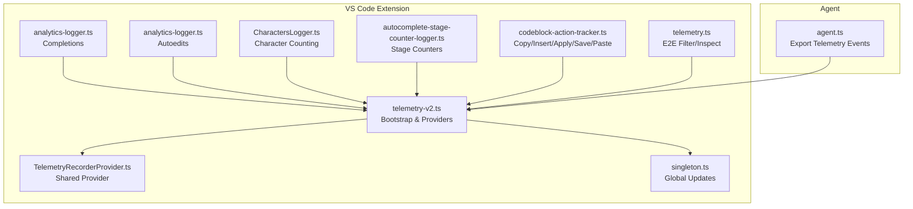
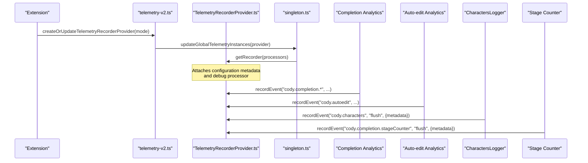
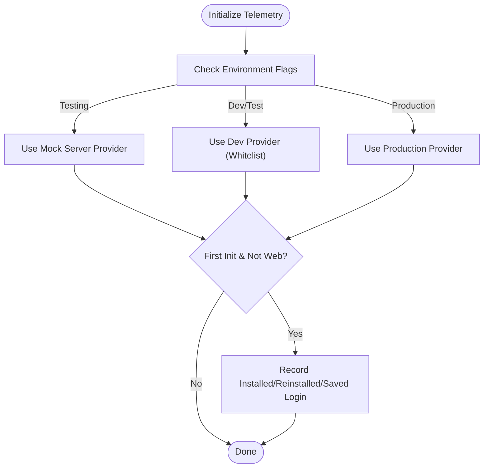
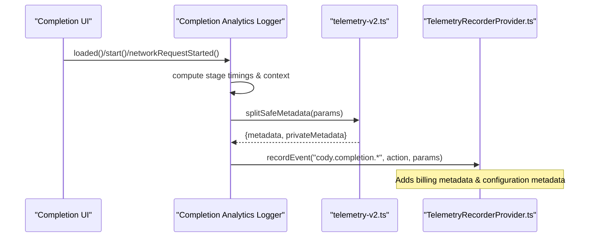
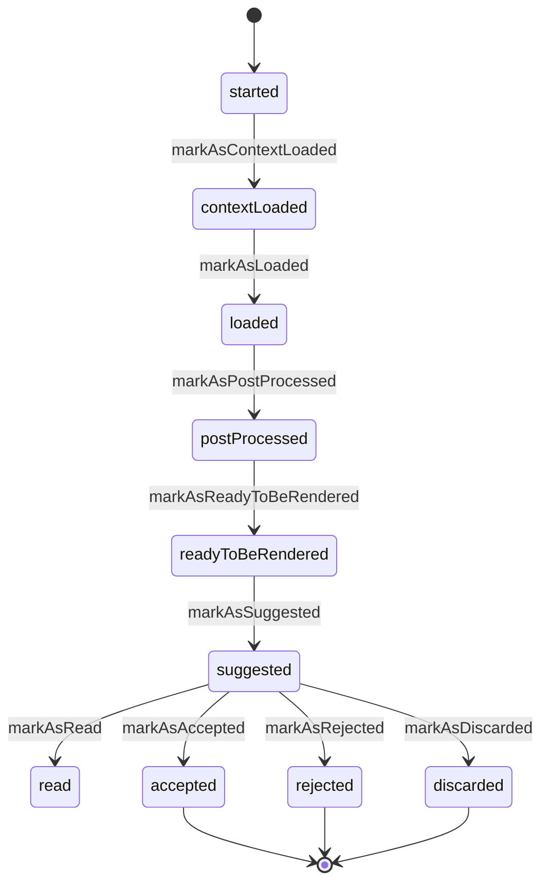
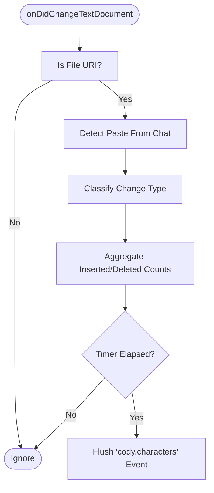
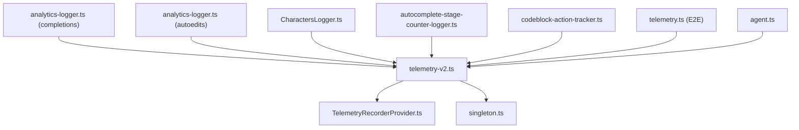

# Telemetry & Analytics

<cite>
**Referenced Files in This Document**
- [telemetry-v2.ts](file://vscode/src/services/telemetry-v2.ts)
- [telemetry-v2.test.ts](file://vscode/src/services/telemetry-v2.test.ts)
- [analytics-logger.ts](file://vscode/src/completions/analytics-logger.ts)
- [analytics-logger.ts](file://vscode/src/autoedits/analytics-logger/analytics-logger.ts)
- [CharactersLogger.ts](file://vscode/src/services/CharactersLogger.ts)
- [autocomplete-stage-counter-logger.ts](file://vscode/src/services/autocomplete-stage-counter-logger.ts)
- [codeblock-action-tracker.ts](file://vscode/src/services/utils/codeblock-action-tracker.ts)
- [TelemetryRecorderProvider.ts](file://lib/shared/src/telemetry-v2/TelemetryRecorderProvider.ts)
- [singleton.ts](file://lib/shared/src/telemetry-v2/singleton.ts)
- [telemetry.ts](file://vscode/e2e/utils/vscody/uix/telemetry.ts)
- [agent.ts](file://agent/src/agent.ts)
</cite>

## Table of Contents
1. [Introduction](#introduction)
2. [Project Structure](#project-structure)
3. [Core Components](#core-components)
4. [Architecture Overview](#architecture-overview)
5. [Detailed Component Analysis](#detailed-component-analysis)
6. [Dependency Analysis](#dependency-analysis)
7. [Performance Considerations](#performance-considerations)
8. [Troubleshooting Guide](#troubleshooting-guide)
9. [Conclusion](#conclusion)
10. [Appendices](#appendices)

## Introduction
This document explains the telemetry and analytics collection architecture for the Cody platform, focusing on the telemetry-v2 framework. It covers event tracking, performance monitoring, usage analytics, character counting, feature usage tracking, privacy-preserving data handling, configuration options, opt-out mechanisms, and data retention. It also provides guidance on interpreting telemetry data, setting up custom event tracking, and debugging telemetry issues, along with examples of common telemetry events and their data structures.

## Project Structure
The telemetry system is implemented across several modules:
- Telemetry v2 bootstrap and metadata processing
- Completion analytics and timing
- Auto-edit analytics and lifecycle
- Character counting and change classification
- Autocomplete stage counters
- Code block action tracking (copy/insert/apply/save/paste)
- Shared telemetry provider and singleton updates
- E2E telemetry filtering and inspection utilities
- Agent-side telemetry export for testing

**Diagram sources**
- [telemetry-v2.ts:26-99](file://vscode/src/services/telemetry-v2.ts#L26-L99)
- [TelemetryRecorderProvider.ts:182-207](file://lib/shared/src/telemetry-v2/TelemetryRecorderProvider.ts#L182-L207)
- [singleton.ts:34-54](file://lib/shared/src/telemetry-v2/singleton.ts#L34-L54)
- [analytics-logger.ts:505-530](file://vscode/src/completions/analytics-logger.ts#L505-L530)
- [analytics-logger.ts:526-541](file://vscode/src/autoedits/analytics-logger/analytics-logger.ts#L526-L541)
- [CharactersLogger.ts:160-173](file://vscode/src/services/CharactersLogger.ts#L160-L173)
- [autocomplete-stage-counter-logger.ts:53-57](file://vscode/src/services/autocomplete-stage-counter-logger.ts#L53-L57)
- [codeblock-action-tracker.ts:99-114](file://vscode/src/services/utils/codeblock-action-tracker.ts#L99-L114)
- [telemetry.ts:48-80](file://vscode/e2e/utils/vscody/uix/telemetry.ts#L48-L80)
- [agent.ts:800-822](file://agent/src/agent.ts#L800-L822)

**Section sources**
- [telemetry-v2.ts:1-172](file://vscode/src/services/telemetry-v2.ts#L1-L172)
- [TelemetryRecorderProvider.ts:182-207](file://lib/shared/src/telemetry-v2/TelemetryRecorderProvider.ts#L182-L207)
- [singleton.ts:34-54](file://lib/shared/src/telemetry-v2/singleton.ts#L34-L54)

## Core Components
- Telemetry v2 bootstrap and provider selection
  - Initializes telemetry recorder provider based on environment and configuration, supports dev/test modes, and records initial extension lifecycle events.
- Completion analytics logger
  - Tracks suggestion, acceptance, partial acceptance, no-response, error, and formatting events with timing, context, and billing metadata.
- Auto-edit analytics logger
  - Tracks auto-edit lifecycle transitions, suggestion, acceptance, rejection, discard, and feedback submission with billing metadata.
- Character counting and change classification
  - Aggregates character insert/delete counts and categorizes document changes (e.g., undo, redo, disjoint, rapid, stale) and flushes periodic telemetry.
- Autocomplete stage counters
  - Counts occurrences of pipeline stages and flushes periodic telemetry with provider model context.
- Code block action tracker
  - Records copy/insert/apply/save/paste actions with line/char counts and billing metadata.
- Shared telemetry provider and singleton
  - Provides a shared telemetry recorder provider and updates global telemetry instances with processors and debug logging.
- E2E telemetry utilities
  - Filters and inspects recorded telemetry events during end-to-end tests.
- Agent telemetry export
  - Exposes exported telemetry events for testing and debugging.

**Section sources**
- [telemetry-v2.ts:26-99](file://vscode/src/services/telemetry-v2.ts#L26-L99)
- [analytics-logger.ts:268-530](file://vscode/src/completions/analytics-logger.ts#L268-L530)
- [analytics-logger.ts:476-541](file://vscode/src/autoedits/analytics-logger/analytics-logger.ts#L476-L541)
- [CharactersLogger.ts:100-173](file://vscode/src/services/CharactersLogger.ts#L100-L173)
- [autocomplete-stage-counter-logger.ts:23-60](file://vscode/src/services/autocomplete-stage-counter-logger.ts#L23-L60)
- [codeblock-action-tracker.ts:99-114](file://vscode/src/services/utils/codeblock-action-tracker.ts#L99-L114)
- [TelemetryRecorderProvider.ts:182-207](file://lib/shared/src/telemetry-v2/TelemetryRecorderProvider.ts#L182-L207)
- [singleton.ts:34-54](file://lib/shared/src/telemetry-v2/singleton.ts#L34-L54)
- [telemetry.ts:48-80](file://vscode/e2e/utils/vscody/uix/telemetry.ts#L48-L80)
- [agent.ts:800-822](file://agent/src/agent.ts#L800-L822)

## Architecture Overview
The telemetry-v2 architecture centers around a shared telemetry recorder provider that attaches configuration metadata globally and routes events to exporters. The extension initializes the provider based on environment flags and client state, and components record events with structured parameters, including metadata and private metadata. Privacy controls ensure sensitive attributes are separated and handled according to policy.

**Diagram sources**
- [telemetry-v2.ts:33-65](file://vscode/src/services/telemetry-v2.ts#L33-L65)
- [singleton.ts:34-54](file://lib/shared/src/telemetry-v2/singleton.ts#L34-L54)
- [TelemetryRecorderProvider.ts:182-207](file://lib/shared/src/telemetry-v2/TelemetryRecorderProvider.ts#L182-L207)
- [analytics-logger.ts:505-530](file://vscode/src/completions/analytics-logger.ts#L505-L530)
- [analytics-logger.ts:526-541](file://vscode/src/autoedits/analytics-logger/analytics-logger.ts#L526-L541)
- [CharactersLogger.ts:160-173](file://vscode/src/services/CharactersLogger.ts#L160-L173)
- [autocomplete-stage-counter-logger.ts:53-57](file://vscode/src/services/autocomplete-stage-counter-logger.ts#L53-L57)

## Detailed Component Analysis

### Telemetry v2 Bootstrap and Metadata Processing
- Provider selection
  - Uses environment flags and dev/test mode to select a mock server provider, a dev-mode provider with whitelisted events, or the production provider.
- Initial lifecycle events
  - On first initialization, records extension installation/reinstallation and saved-login events for non-web clients.
- Metadata separation
  - Splits typed parameters into numeric/boolean metadata and private metadata to enforce privacy and reduce risk of exporting sensitive attributes.

**Diagram sources**
- [telemetry-v2.ts:33-96](file://vscode/src/services/telemetry-v2.ts#L33-L96)

**Section sources**
- [telemetry-v2.ts:26-99](file://vscode/src/services/telemetry-v2.ts#L26-L99)
- [telemetry-v2.test.ts:8-184](file://vscode/src/services/telemetry-v2.test.ts#L8-L184)

### Completion Analytics Logger
- Event categories
  - Suggested, accepted, partially accepted, no response, error, format, and persistence-related events.
- Timing and context
  - Tracks latency, display duration, stage timings, upstream latencies, and optional inline context for DotCom users.
- Billing metadata
  - Adds billable/core categories depending on action.
- Privacy controls
  - Uses split-safe metadata to separate numeric/boolean metadata from private metadata; selectively records transcripts based on user tier and repository visibility.

**Diagram sources**
- [analytics-logger.ts:268-530](file://vscode/src/completions/analytics-logger.ts#L268-L530)
- [telemetry-v2.ts:126-171](file://vscode/src/services/telemetry-v2.ts#L126-L171)
- [TelemetryRecorderProvider.ts:182-207](file://lib/shared/src/telemetry-v2/TelemetryRecorderProvider.ts#L182-L207)

**Section sources**
- [analytics-logger.ts:205-530](file://vscode/src/completions/analytics-logger.ts#L205-L530)

### Auto-edit Analytics Logger
- Lifecycle tracking
  - Tracks request creation, context loading, loading, post-processing, ready-to-render, suggested, read, accepted, rejected, discarded, and feedback submission.
- Billing metadata
  - Assigns billable/core categories based on action.
- Privacy controls
  - Uses split-safe metadata and conditionally records transcripts for DotCom users.

**Diagram sources**
- [analytics-logger.ts:425-474](file://vscode/src/autoedits/analytics-logger/analytics-logger.ts#L425-L474)

**Section sources**
- [analytics-logger.ts:80-541](file://vscode/src/autoedits/analytics-logger/analytics-logger.ts#L80-L541)

### Character Counting and Classification
- Change classification
  - Classifies changes as undo, redo, disjoint, rapid, stale, outside visible ranges, etc., and aggregates inserted/deleted character counts per category.
- Periodic flushing
  - Emits a "cody.characters" event every 30 minutes with aggregated counters.
- Paste detection
  - Detects paste operations from chat code blocks and records a dedicated "cody.keyDown:paste" event.

**Diagram sources**
- [CharactersLogger.ts:175-217](file://vscode/src/services/CharactersLogger.ts#L175-L217)
- [CharactersLogger.ts:160-173](file://vscode/src/services/CharactersLogger.ts#L160-L173)
- [codeblock-action-tracker.ts:283-299](file://vscode/src/services/utils/codeblock-action-tracker.ts#L283-L299)

**Section sources**
- [CharactersLogger.ts:100-389](file://vscode/src/services/CharactersLogger.ts#L100-L389)
- [codeblock-action-tracker.ts:283-321](file://vscode/src/services/utils/codeblock-action-tracker.ts#L283-L321)

### Autocomplete Stage Counters
- Pipeline stages
  - Tracks stages like pre-cache, pre-smart-throttle, pre-debounce, pre-context-retrieval, pre-network-request, etc.
- Periodic flushing
  - Emits a "cody.completion.stageCounter" event every 30 minutes with stage counts and provider model metadata.

**Section sources**
- [autocomplete-stage-counter-logger.ts:23-91](file://vscode/src/services/autocomplete-stage-counter-logger.ts#L23-L91)

### Code Block Action Tracker
- Actions
  - Records copy, insert, apply, and save actions with line/char counts and billing metadata.
- Paste detection
  - Detects paste events and records a dedicated "cody.keyDown:paste" event with counts and source.

**Section sources**
- [codeblock-action-tracker.ts:99-114](file://vscode/src/services/utils/codeblock-action-tracker.ts#L99-L114)
- [codeblock-action-tracker.ts:283-299](file://vscode/src/services/utils/codeblock-action-tracker.ts#L283-L299)

### Shared Telemetry Provider and Singleton Updates
- Global provider
  - Provides a shared telemetry recorder provider and attaches configuration metadata processors.
- Global updates
  - Updates global telemetry instances and registers a callback processor for debug logging.

**Section sources**
- [TelemetryRecorderProvider.ts:182-207](file://lib/shared/src/telemetry-v2/TelemetryRecorderProvider.ts#L182-L207)
- [singleton.ts:34-54](file://lib/shared/src/telemetry-v2/singleton.ts#L34-L54)

### E2E Telemetry Utilities
- Filtering and inspection
  - Provides utilities to filter recorded telemetry events by feature/action/signature and to inspect snapshots during tests.

**Section sources**
- [telemetry.ts:48-102](file://vscode/e2e/utils/vscody/uix/telemetry.ts#L48-L102)

### Agent Telemetry Export
- Export endpoint
  - Exposes an authenticated endpoint to export telemetry events for testing and debugging.

**Section sources**
- [agent.ts:800-822](file://agent/src/agent.ts#L800-L822)

## Dependency Analysis
- Coupling and cohesion
  - Components are loosely coupled via the shared telemetry recorder provider and rely on centralized metadata processing.
- External dependencies
  - Relies on the shared telemetry-v2 library for provider and singleton management.
- Privacy and security
  - Uses split-safe metadata to separate sensitive attributes and applies conditional inclusion for transcripts based on user tier and repository visibility.

**Diagram sources**
- [telemetry-v2.ts:1-172](file://vscode/src/services/telemetry-v2.ts#L1-L172)
- [TelemetryRecorderProvider.ts:182-207](file://lib/shared/src/telemetry-v2/TelemetryRecorderProvider.ts#L182-L207)
- [singleton.ts:34-54](file://lib/shared/src/telemetry-v2/singleton.ts#L34-L54)
- [analytics-logger.ts:505-530](file://vscode/src/completions/analytics-logger.ts#L505-L530)
- [analytics-logger.ts:526-541](file://vscode/src/autoedits/analytics-logger/analytics-logger.ts#L526-L541)
- [CharactersLogger.ts:160-173](file://vscode/src/services/CharactersLogger.ts#L160-L173)
- [autocomplete-stage-counter-logger.ts:53-57](file://vscode/src/services/autocomplete-stage-counter-logger.ts#L53-L57)
- [codeblock-action-tracker.ts:99-114](file://vscode/src/services/utils/codeblock-action-tracker.ts#L99-L114)
- [telemetry.ts:48-80](file://vscode/e2e/utils/vscody/uix/telemetry.ts#L48-L80)
- [agent.ts:800-822](file://agent/src/agent.ts#L800-L822)

**Section sources**
- [telemetry-v2.ts:1-172](file://vscode/src/services/telemetry-v2.ts#L1-L172)

## Performance Considerations
- Event batching and throttling
  - Auto-edit error logging uses rate limiting to avoid spamming logs.
- Periodic flushing
  - Character counters and stage counters flush periodically to balance accuracy and overhead.
- Conditional transcript recording
  - Inline completion item context and auto-edit predictions are recorded only for DotCom users and public repositories to minimize data volume.

**Section sources**
- [analytics-logger.ts:91-91](file://vscode/src/autoedits/analytics-logger/analytics-logger.ts#L91-L91)
- [CharactersLogger.ts:14-16](file://vscode/src/services/CharactersLogger.ts#L14-L16)
- [autocomplete-stage-counter-logger.ts:5-5](file://vscode/src/services/autocomplete-stage-counter-logger.ts#L5-L5)

## Troubleshooting Guide
- Debugging telemetry events
  - The global telemetry singleton registers a callback processor that logs all recorded events with parameters and timestamps for reference.
- E2E telemetry inspection
  - Use the E2E telemetry utilities to filter and inspect recorded events by feature/action/signature.
- Agent telemetry export
  - Use the agent’s authenticated endpoint to export telemetry events for testing and debugging.

**Section sources**
- [singleton.ts:41-52](file://lib/shared/src/telemetry-v2/singleton.ts#L41-L52)
- [telemetry.ts:48-102](file://vscode/e2e/utils/vscody/uix/telemetry.ts#L48-L102)
- [agent.ts:800-822](file://agent/src/agent.ts#L800-L822)

## Conclusion
The Cody telemetry-v2 system provides a robust, privacy-aware foundation for event tracking, performance monitoring, and usage analytics. It centralizes provider configuration, enforces metadata separation, and enables detailed lifecycle tracking across completions, auto-edits, character changes, and stage counters. With E2E inspection and agent export capabilities, developers can confidently interpret telemetry data, debug issues, and optimize the platform’s performance and user experience.

## Appendices

### Event Schema Design and Examples
- Completion events
  - Feature: cody.completion or cody.completion.<subfeature>
  - Actions: suggested, accepted, partiallyAccepted, noResponse, error, format
  - Parameters:
    - metadata: numeric/boolean values (e.g., latency, displayDuration, read, accepted, stage timings, counts)
    - privateMetadata: arbitrary values (e.g., context, headers, trace IDs)
    - billingMetadata: product, category (billable/core)
- Auto-edit events
  - Feature: cody.autoedit
  - Actions: suggested, accepted, discarded, error, feedback-submitted
  - Parameters: similar structure with billing metadata applied based on action
- Character events
  - Feature: cody.characters
  - Action: flush
  - Parameters: aggregated counters for change types and inserted/deleted character counts
- Stage counter events
  - Feature: cody.completion.stageCounter
  - Action: flush
  - Parameters: stage counts and provider model metadata
- Code block action events
  - Features: cody.copyButton, cody.keyDown.Copy, cody.insertButton, cody.applyButton, cody.saveButton
  - Actions: clicked
  - Parameters: lineCount, charCount, source, op, billingMetadata

**Section sources**
- [analytics-logger.ts:268-530](file://vscode/src/completions/analytics-logger.ts#L268-L530)
- [analytics-logger.ts:476-541](file://vscode/src/autoedits/analytics-logger/analytics-logger.ts#L476-L541)
- [CharactersLogger.ts:160-173](file://vscode/src/services/CharactersLogger.ts#L160-L173)
- [autocomplete-stage-counter-logger.ts:53-57](file://vscode/src/services/autocomplete-stage-counter-logger.ts#L53-L57)
- [codeblock-action-tracker.ts:99-114](file://vscode/src/services/utils/codeblock-action-tracker.ts#L99-L114)

### Privacy-Preserving Data Handling
- Metadata separation
  - splitSafeMetadata converts numeric/boolean values to metadata and preserves others in privateMetadata.
- Conditional inclusion
  - Inline context and transcripts are recorded only for DotCom users and public repositories.
- Configuration metadata
  - Global provider attaches configuration-derived metadata (e.g., tier) to all events.

**Section sources**
- [telemetry-v2.ts:126-171](file://vscode/src/services/telemetry-v2.ts#L126-L171)
- [TelemetryRecorderProvider.ts:182-207](file://lib/shared/src/telemetry-v2/TelemetryRecorderProvider.ts#L182-L207)
- [analytics-logger.ts:193-194](file://vscode/src/completions/analytics-logger.ts#L193-L194)
- [analytics-logger.ts:134-135](file://vscode/src/autoedits/analytics-logger/analytics-logger.ts#L134-L135)

### Telemetry Configuration Options and Opt-out Mechanisms
- Provider selection
  - Environment flags and dev/test mode control provider instantiation and event export behavior.
- Allowed dev events
  - Whitelisted events in dev mode restrict exports to approved actions.
- Billing metadata
  - Billing category is set per action to categorize billable vs core usage.

**Section sources**
- [telemetry-v2.ts:33-65](file://vscode/src/services/telemetry-v2.ts#L33-L65)
- [telemetry-v2.ts:17-19](file://vscode/src/services/telemetry-v2.ts#L17-L19)

### Data Retention Policies
- Periodic flushing
  - Character counters and stage counters flush every 30 minutes; adjust intervals as needed to align with retention goals.
- Private metadata handling
  - Private metadata is subject to instance-specific policies; sensitive attributes are not exported unless explicitly allowed.

**Section sources**
- [CharactersLogger.ts:14-16](file://vscode/src/services/CharactersLogger.ts#L14-L16)
- [autocomplete-stage-counter-logger.ts:5-5](file://vscode/src/services/autocomplete-stage-counter-logger.ts#L5-L5)
- [TelemetryRecorderProvider.ts:182-207](file://lib/shared/src/telemetry-v2/TelemetryRecorderProvider.ts#L182-L207)

### Guidance on Interpreting Telemetry Data
- Use E2E telemetry utilities to filter events by feature/action/signature and analyze trends.
- Monitor stage counters to identify bottlenecks in the autocomplete pipeline.
- Review completion events to understand suggestion/read/acceptance rates and latency distributions.

**Section sources**
- [telemetry.ts:48-102](file://vscode/e2e/utils/vscody/uix/telemetry.ts#L48-L102)
- [autocomplete-stage-counter-logger.ts:53-57](file://vscode/src/services/autocomplete-stage-counter-logger.ts#L53-L57)
- [analytics-logger.ts:505-530](file://vscode/src/completions/analytics-logger.ts#L505-L530)

### Setting Up Custom Event Tracking
- Use the shared telemetry recorder to record events with structured parameters.
- Apply split-safe metadata to separate numeric/boolean metadata from private metadata.
- Attach billing metadata to categorize usage appropriately.

**Section sources**
- [telemetry-v2.ts:126-171](file://vscode/src/services/telemetry-v2.ts#L126-L171)
- [TelemetryRecorderProvider.ts:182-207](file://lib/shared/src/telemetry-v2/TelemetryRecorderProvider.ts#L182-L207)

### Debugging Telemetry Issues
- Enable debug logging via the global telemetry singleton callback processor.
- Inspect recorded events during E2E tests using the telemetry utilities.
- Export agent telemetry events for targeted debugging.

**Section sources**
- [singleton.ts:41-52](file://lib/shared/src/telemetry-v2/singleton.ts#L41-L52)
- [telemetry.ts:48-102](file://vscode/e2e/utils/vscody/uix/telemetry.ts#L48-L102)
- [agent.ts:800-822](file://agent/src/agent.ts#L800-L822)