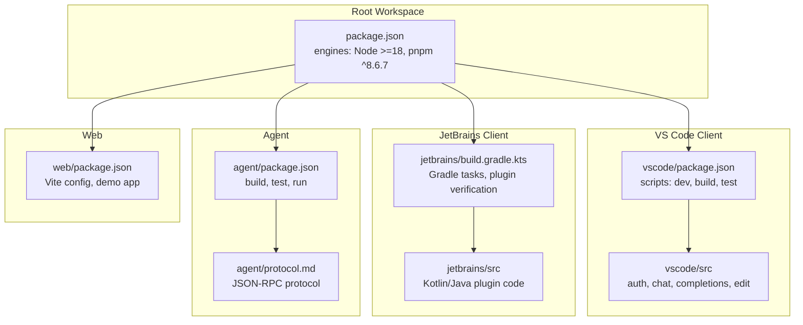
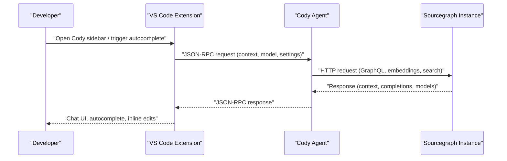
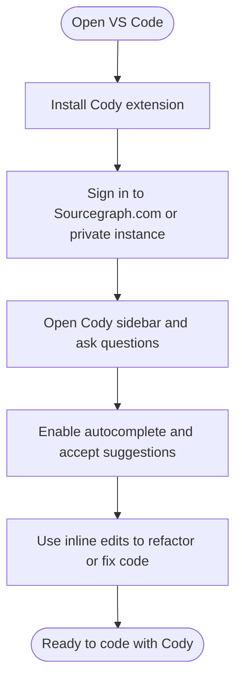
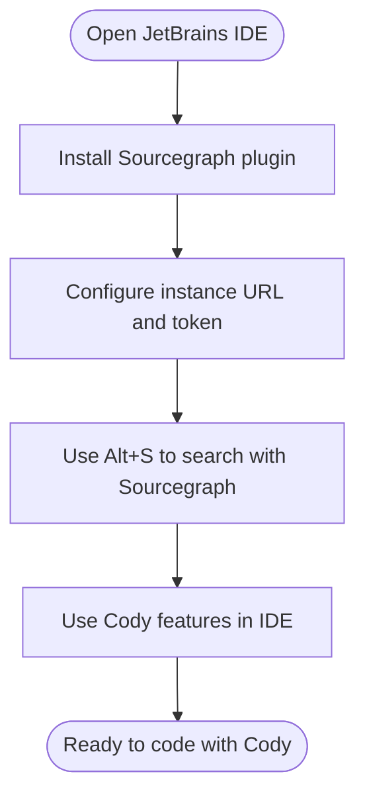
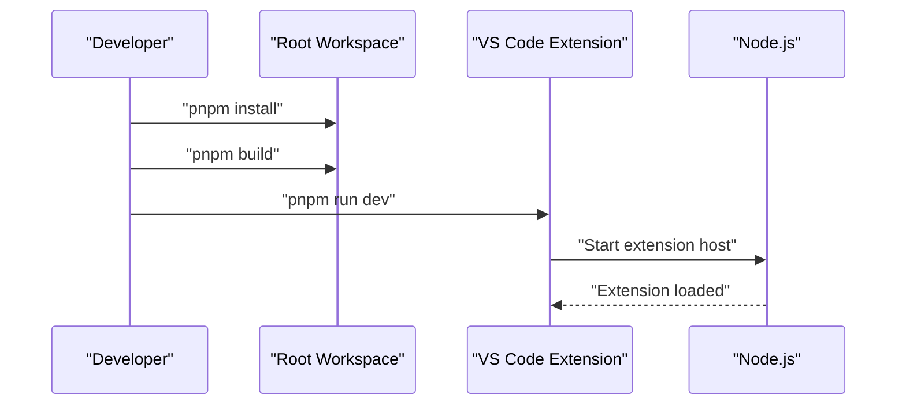
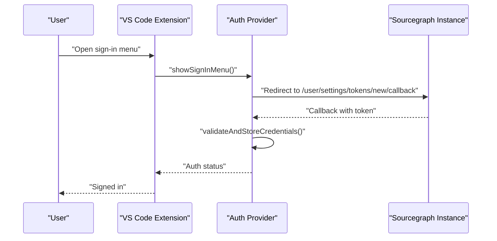
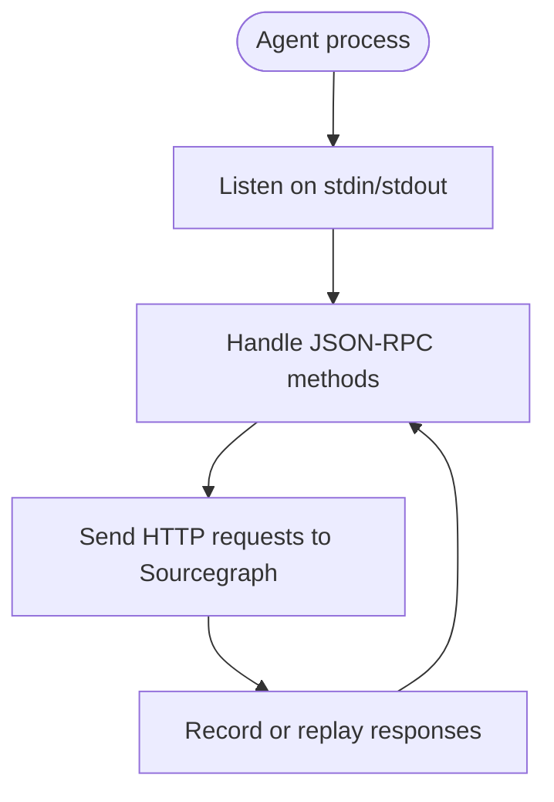
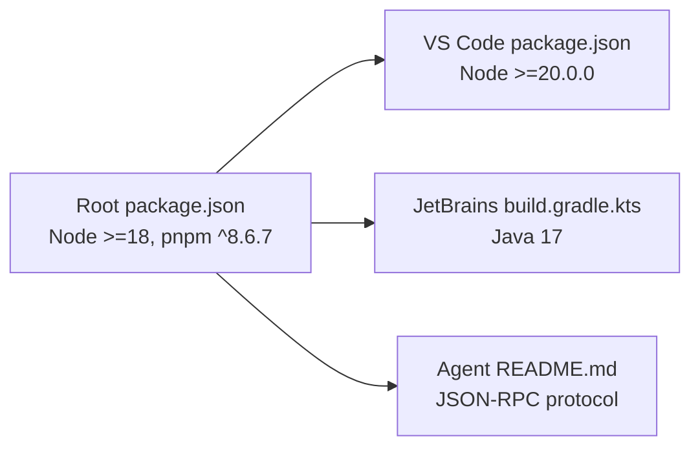

# Getting Started

<cite>
**Referenced Files in This Document**
- [README.md](file://README.md)
- [doc/dev/index.md](file://doc/dev/index.md)
- [vscode/README.md](file://vscode/README.md)
- [jetbrains/README.md](file://jetbrains/README.md)
- [agent/README.md](file://agent/README.md)
- [cli/README.md](file://cli/README.md)
- [package.json](file://package.json)
- [vscode/package.json](file://vscode/package.json)
- [jetbrains/build.gradle.kts](file://jetbrains/build.gradle.kts)
- [vscode/src/auth/auth.ts](file://vscode/src/auth/auth.ts)
- [vscode/src/configuration.ts](file://vscode/src/configuration.ts)
- [vscode/CONTRIBUTING.md](file://vscode/CONTRIBUTING.md)
- [jetbrains/CONTRIBUTING.md](file://jetbrains/CONTRIBUTING.md)
</cite>

## Table of Contents
1. [Introduction](#introduction)
2. [Project Structure](#project-structure)
3. [Core Components](#core-components)
4. [Architecture Overview](#architecture-overview)
5. [Detailed Component Analysis](#detailed-component-analysis)
6. [Dependency Analysis](#dependency-analysis)
7. [Performance Considerations](#performance-considerations)
8. [Troubleshooting Guide](#troubleshooting-guide)
9. [Conclusion](#conclusion)
10. [Appendices](#appendices)

## Introduction
This guide helps you install and get started with the Cody AI development assistant across supported platforms. You will learn how to:
- Install the VS Code extension from the marketplace and the JetBrains plugin from the JetBrains Marketplace
- Build and run the VS Code extension locally using pnpm
- Authenticate with Sourcegraph.com or a private Sourcegraph instance
- Explore basic features such as chat, autocomplete, and smart edits
- Understand prerequisites and platform-specific notes
- Troubleshoot common setup issues

Cody is available for VS Code, JetBrains IDEs, and the web. The repository provides development tooling to build and run the VS Code extension locally and includes the Cody Agent for non-ECMAScript clients.

## Project Structure
Cody is a monorepo with multiple first-class clients and shared libraries:
- Root workspace manages shared tooling, linting, and scripts
- vscode: VS Code extension source and build pipeline
- jetbrains: JetBrains plugin source and Gradle build
- agent: JSON-RPC server and protocol for non-ECMAScript clients
- web: Web UI demo and library
- cli: CLI documentation and historical context

**Diagram sources**
- [package.json:11-14](file://package.json#L11-L14)
- [vscode/package.json:11-19](file://vscode/package.json#L11-L19)
- [jetbrains/build.gradle.kts:59-67](file://jetbrains/build.gradle.kts#L59-L67)
- [agent/README.md:1-13](file://agent/README.md#L1-L13)

**Section sources**
- [README.md:26-34](file://README.md#L26-L34)
- [package.json:11-14](file://package.json#L11-L14)
- [vscode/package.json:11-19](file://vscode/package.json#L11-L19)
- [jetbrains/build.gradle.kts:59-67](file://jetbrains/build.gradle.kts#L59-L67)
- [agent/README.md:1-13](file://agent/README.md#L1-L13)

## Core Components
- VS Code extension: Provides chat, autocomplete, inline edits, and commands. Built with TypeScript and Vite for webviews.
- JetBrains plugin: Integrates with JetBrains IDEs via Gradle, includes agent binaries, and supports debugging workflows.
- Agent: JSON-RPC server for non-ECMAScript clients (e.g., JetBrains, Neovim). Includes protocol and testing utilities.
- Web demo: Standalone web UI for rapid iteration on chat UI and connectivity to Sourcegraph instances.

Prerequisites:
- Node.js version aligned with engines in the root package.json
- pnpm version aligned with engines in the root package.json
- For VS Code: VS Code with supported engine versions
- For JetBrains: Java 17 and Gradle-based build system

**Section sources**
- [README.md:26-34](file://README.md#L26-L34)
- [package.json:11-14](file://package.json#L11-L14)
- [vscode/package.json:116-119](file://vscode/package.json#L116-L119)
- [jetbrains/build.gradle.kts:18-21](file://jetbrains/build.gradle.kts#L18-L21)
- [agent/README.md:35-46](file://agent/README.md#L35-L46)

## Architecture Overview
Cody integrates with Sourcegraph instances (cloud or self-hosted) to provide:
- Authentication and token management
- Context retrieval from codebases
- Model selection and usage
- UI surfaces in VS Code and JetBrains IDEs
- Agent-based communication for non-ECMAScript clients

**Diagram sources**
- [agent/README.md:16-28](file://agent/README.md#L16-L28)
- [vscode/src/auth/auth.ts:458-569](file://vscode/src/auth/auth.ts#L458-L569)

**Section sources**
- [agent/README.md:16-28](file://agent/README.md#L16-L28)
- [vscode/src/auth/auth.ts:458-569](file://vscode/src/auth/auth.ts#L458-L569)

## Detailed Component Analysis

### VS Code Extension: Installation and Quick Start
- Install from marketplace: Follow the marketplace links in the repository README.
- Local development:
  - Install dependencies and build the workspace
  - Build and run the VS Code extension in development mode
  - Use the provided launch task or scripts to start the extension host

Authentication:
- Sign in to Sourcegraph.com or a private instance
- The extension validates credentials and handles redirects and callbacks
- Supports switching accounts and signing out

Basic usage patterns:
- Chat: Ask questions about your codebase; use @-mentions to target specific files
- Autocomplete: Accept suggestions or trigger manual autocomplete
- Smart edits: Use inline edits to refactor or fix code

**Diagram sources**
- [README.md:26-34](file://README.md#L26-L34)
- [vscode/src/auth/auth.ts:81-146](file://vscode/src/auth/auth.ts#L81-L146)
- [vscode/src/configuration.ts:25-204](file://vscode/src/configuration.ts#L25-L204)

**Section sources**
- [README.md:26-34](file://README.md#L26-L34)
- [vscode/README.md:40-53](file://vscode/README.md#L40-L53)
- [vscode/src/auth/auth.ts:81-146](file://vscode/src/auth/auth.ts#L81-L146)
- [vscode/src/configuration.ts:25-204](file://vscode/src/configuration.ts#L25-L204)
- [vscode/CONTRIBUTING.md:5-8](file://vscode/CONTRIBUTING.md#L5-L8)

### JetBrains Plugin: Installation and Quick Start
- Install from JetBrains Marketplace: Search for Sourcegraph and install the plugin.
- Prerequisites:
  - Java 17
  - Ensure git is available in PATH as required by the plugin
- Configure private instances: Enter your Sourcegraph URL and access token in plugin settings
- Supported IDEs: IntelliJ IDEA, WebStorm, PyCharm, RubyMine, CLion, GoLand, DataGrip, Rider, Android Studio, and more (versions 2022+ recommended)

**Diagram sources**
- [jetbrains/README.md:114-128](file://jetbrains/README.md#L114-L128)

**Section sources**
- [jetbrains/README.md:114-128](file://jetbrains/README.md#L114-L128)
- [jetbrains/README.md:94-113](file://jetbrains/README.md#L94-L113)
- [jetbrains/CONTRIBUTING.md:14-18](file://jetbrains/CONTRIBUTING.md#L14-L18)

### Local Development: Building and Running the VS Code Extension
- Prerequisites:
  - Node.js and pnpm versions as defined in the root package.json engines
- Steps:
  - Install dependencies at the root
  - Build the workspace
  - Run the VS Code extension in development mode using the provided scripts or tasks
- Optional: Use the web build for rapid UI iteration

**Diagram sources**
- [doc/dev/index.md:3-13](file://doc/dev/index.md#L3-L13)
- [package.json:18-38](file://package.json#L18-L38)
- [vscode/package.json:11-21](file://vscode/package.json#L11-L21)

**Section sources**
- [doc/dev/index.md:3-13](file://doc/dev/index.md#L3-L13)
- [package.json:18-38](file://package.json#L18-L38)
- [vscode/package.json:11-21](file://vscode/package.json#L11-L21)
- [vscode/CONTRIBUTING.md:5-8](file://vscode/CONTRIBUTING.md#L5-L8)

### Authentication Flow (VS Code)

**Diagram sources**
- [vscode/src/auth/auth.ts:81-146](file://vscode/src/auth/auth.ts#L81-L146)
- [vscode/src/auth/auth.ts:283-310](file://vscode/src/auth/auth.ts#L283-L310)
- [vscode/src/auth/auth.ts:336-378](file://vscode/src/auth/auth.ts#L336-L378)

**Section sources**
- [vscode/src/auth/auth.ts:81-146](file://vscode/src/auth/auth.ts#L81-L146)
- [vscode/src/auth/auth.ts:283-310](file://vscode/src/auth/auth.ts#L283-L310)
- [vscode/src/auth/auth.ts:336-378](file://vscode/src/auth/auth.ts#L336-L378)

### Agent: Protocol and Testing
- The Agent implements a JSON-RPC server for non-ECMAScript clients
- Protocol is defined in the agent module; updates require editing the TypeScript source
- Testing includes recording and replaying HTTP requests; environment variables control recording modes

**Diagram sources**
- [agent/README.md:16-28](file://agent/README.md#L16-L28)
- [agent/README.md:90-113](file://agent/README.md#L90-L113)

**Section sources**
- [agent/README.md:16-28](file://agent/README.md#L16-L28)
- [agent/README.md:90-113](file://agent/README.md#L90-L113)

## Dependency Analysis
- Root workspace enforces Node.js and pnpm versions
- VS Code extension defines its own Node.js engine requirement
- JetBrains plugin uses Gradle with Java 17 and platform-specific tasks
- Agent provides a JSON-RPC protocol and testing utilities

**Diagram sources**
- [package.json:11-14](file://package.json#L11-L14)
- [vscode/package.json:116-119](file://vscode/package.json#L116-L119)
- [jetbrains/build.gradle.kts:18-21](file://jetbrains/build.gradle.kts#L18-L21)
- [agent/README.md:16-28](file://agent/README.md#L16-L28)

**Section sources**
- [package.json:11-14](file://package.json#L11-L14)
- [vscode/package.json:116-119](file://vscode/package.json#L116-L119)
- [jetbrains/build.gradle.kts:18-21](file://jetbrains/build.gradle.kts#L18-L21)
- [agent/README.md:16-28](file://agent/README.md#L16-L28)

## Performance Considerations
- Use the web build for rapid UI iteration when developing chat UI
- Enable source maps for webviews to improve debugging
- For VS Code, use the provided watch tasks to speed up rebuilds
- For JetBrains, leverage continuous rebuilds and debug configurations to reduce iteration time

[No sources needed since this section provides general guidance]

## Troubleshooting Guide
Common setup issues and resolutions:
- VS Code
  - Enable verbose logging for debugging autocomplete and authentication
  - Use the autocomplete trace view for real-time request inspection
  - Download WASM tree-sitter modules if missing
  - Capture network traffic using a proxy when needed
- JetBrains
  - Ensure Java 17 is installed and Gradle daemon is restarted after changing Node/pnpm versions
  - On Windows ARM64, skip downloading certain binaries if necessary
  - Use provided run configurations to debug the Agent and plugin simultaneously

**Section sources**
- [vscode/CONTRIBUTING.md:28-36](file://vscode/CONTRIBUTING.md#L28-L36)
- [vscode/CONTRIBUTING.md:88-105](file://vscode/CONTRIBUTING.md#L88-L105)
- [vscode/CONTRIBUTING.md:107-122](file://vscode/CONTRIBUTING.md#L107-L122)
- [jetbrains/CONTRIBUTING.md:90-102](file://jetbrains/CONTRIBUTING.md#L90-L102)
- [jetbrains/CONTRIBUTING.md:104-117](file://jetbrains/CONTRIBUTING.md#L104-L117)
- [jetbrains/CONTRIBUTING.md:228-356](file://jetbrains/CONTRIBUTING.md#L228-L356)

## Conclusion
You now have the essentials to install Cody on VS Code and JetBrains IDEs, authenticate with Sourcegraph, and run the VS Code extension locally. Use the provided scripts and run configurations to iterate quickly, and consult the troubleshooting section for platform-specific pitfalls. Explore chat, autocomplete, and smart edits to accelerate your development workflow.

[No sources needed since this section summarizes without analyzing specific files]

## Appendices

### Platform-Specific Installation Notes
- VS Code
  - Install from the marketplace links in the repository README
  - Use the development scripts to run locally
- JetBrains
  - Install from the JetBrains Marketplace
  - Ensure Java 17 and git are available in PATH
  - Configure private instances via plugin settings

**Section sources**
- [README.md:26-34](file://README.md#L26-L34)
- [vscode/README.md:69-73](file://vscode/README.md#L69-L73)
- [jetbrains/README.md:114-128](file://jetbrains/README.md#L114-L128)

### Prerequisites Checklist
- Node.js and pnpm versions as defined in the root package.json
- VS Code with supported engine versions
- Java 17 for JetBrains plugin development
- Git available in PATH for JetBrains plugin

**Section sources**
- [package.json:11-14](file://package.json#L11-L14)
- [vscode/package.json:116-119](file://vscode/package.json#L116-L119)
- [jetbrains/build.gradle.kts:18-21](file://jetbrains/build.gradle.kts#L18-L21)
- [jetbrains/README.md:121-123](file://jetbrains/README.md#L121-L123)