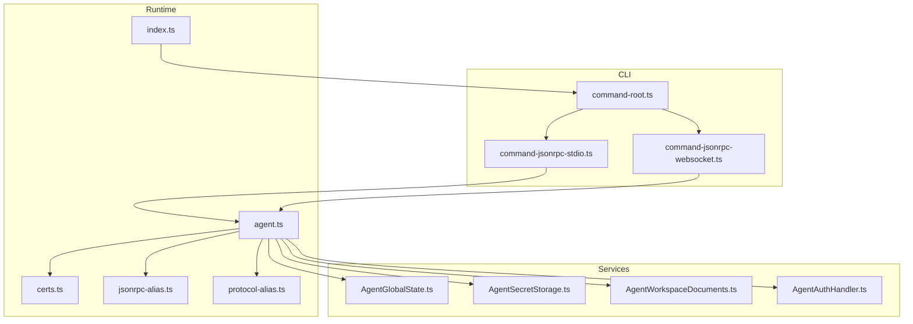
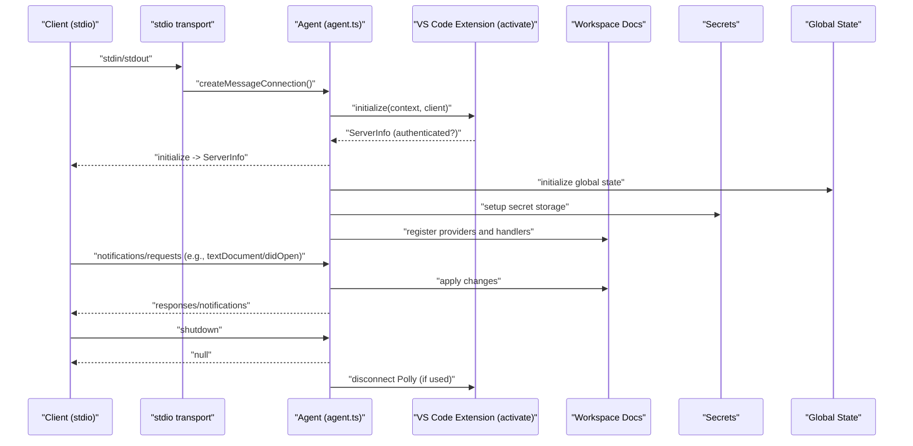
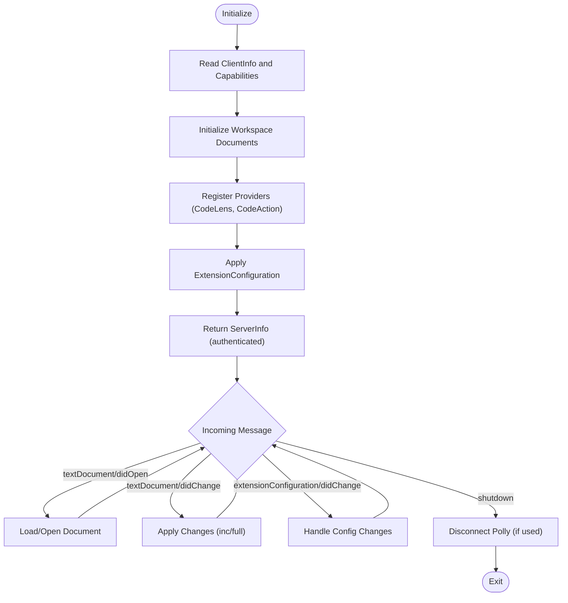
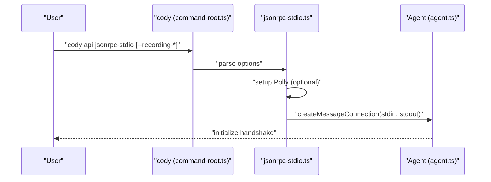
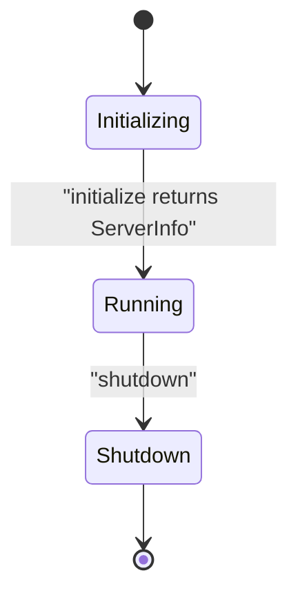
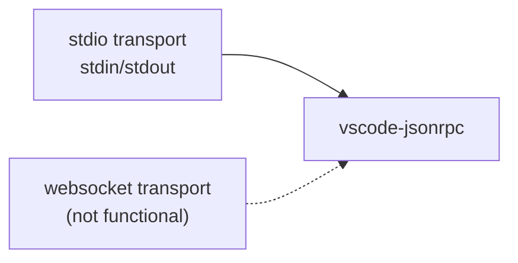
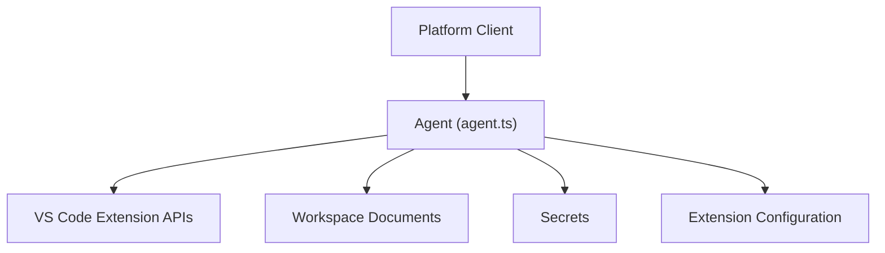
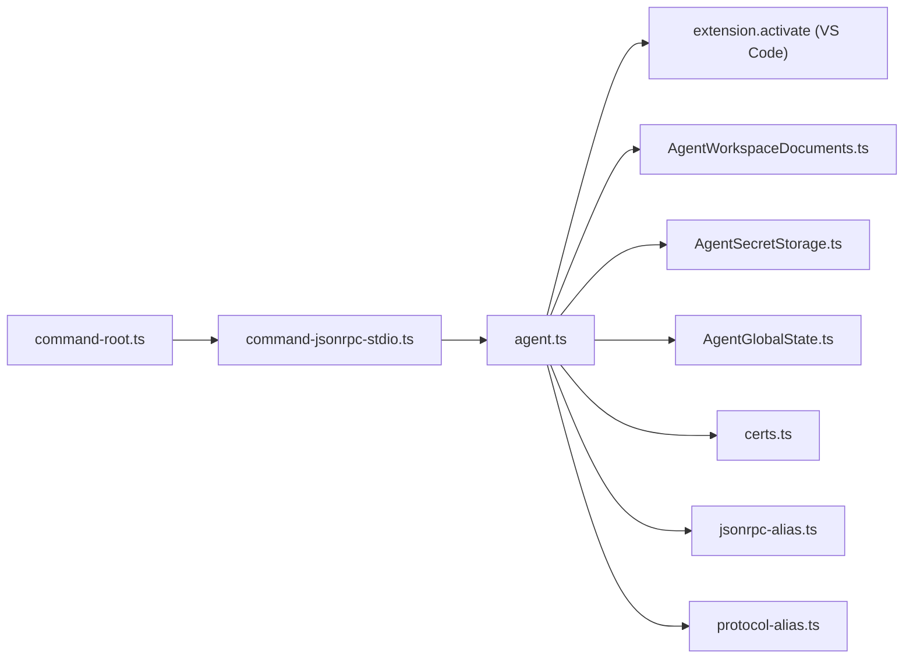

# Agent Runtime

<cite>
**Referenced Files in This Document**
- [agent/README.md](file://agent/README.md)
- [agent/package.json](file://agent/package.json)
- [agent/protocol.md](file://agent/protocol.md)
- [agent/src/index.ts](file://agent/src/index.ts)
- [agent/src/agent.ts](file://agent/src/agent.ts)
- [agent/src/cli/command-root.ts](file://agent/src/cli/command-root.ts)
- [agent/src/cli/command-jsonrpc-stdio.ts](file://agent/src/cli/command-jsonrpc-stdio.ts)
- [agent/src/cli/command-jsonrpc-websocket.ts](file://agent/src/cli/command-jsonrpc-websocket.ts)
- [agent/src/jsonrpc-alias.ts](file://agent/src/jsonrpc-alias.ts)
- [agent/src/protocol-alias.ts](file://agent/src/protocol-alias.ts)
- [agent/src/certs.ts](file://agent/src/certs.ts)
- [agent/src/global-state/AgentGlobalState.ts](file://agent/src/global-state/AgentGlobalState.ts)
- [agent/src/AgentSecretStorage.ts](file://agent/src/AgentSecretStorage.ts)
- [agent/src/AgentWorkspaceDocuments.ts](file://agent/src/AgentWorkspaceDocuments.ts)
- [agent/src/AgentAuthHandler.ts](file://agent/src/AgentAuthHandler.ts)
</cite>

## Table of Contents
1. [Introduction](#introduction)
2. [Project Structure](#project-structure)
3. [Core Components](#core-components)
4. [Architecture Overview](#architecture-overview)
5. [Detailed Component Analysis](#detailed-component-analysis)
6. [Dependency Analysis](#dependency-analysis)
7. [Performance Considerations](#performance-considerations)
8. [Troubleshooting Guide](#troubleshooting-guide)
9. [Conclusion](#conclusion)
10. [Appendices](#appendices)

## Introduction
This document describes the agent runtime system that powers cross-platform AI functionality for Cody. The agent exposes a JSON-RPC protocol over stdio for clients such as JetBrains and Neovim plugins. It embeds the VS Code extension logic into a standalone Node.js process, manages lifecycle events (initialize, initialized, shutdown, exit), and provides abstractions for documents, secrets, configuration, and authentication. It also includes a CLI for running the agent in headless mode and a websocket server command (currently non-functional) for future use.

## Project Structure
The agent package is organized around:
- CLI entrypoint and commands
- JSON-RPC server implementation
- Protocol definitions and aliases
- Workspace/document management
- Secrets and global state
- Certificate handling and authentication

**Diagram sources**
- [agent/src/cli/command-root.ts:1-23](file://agent/src/cli/command-root.ts#L1-L23)
- [agent/src/cli/command-jsonrpc-stdio.ts:1-208](file://agent/src/cli/command-jsonrpc-stdio.ts#L1-L208)
- [agent/src/cli/command-jsonrpc-websocket.ts:1-55](file://agent/src/cli/command-jsonrpc-websocket.ts#L1-L55)
- [agent/src/index.ts:1-34](file://agent/src/index.ts#L1-L34)
- [agent/src/agent.ts:1-800](file://agent/src/agent.ts#L1-L800)
- [agent/src/certs.ts:1-72](file://agent/src/certs.ts#L1-L72)
- [agent/src/jsonrpc-alias.ts:1-2](file://agent/src/jsonrpc-alias.ts#L1-L2)
- [agent/src/protocol-alias.ts:1-2](file://agent/src/protocol-alias.ts#L1-L2)
- [agent/src/global-state/AgentGlobalState.ts:1-150](file://agent/src/global-state/AgentGlobalState.ts#L1-L150)
- [agent/src/AgentSecretStorage.ts:1-60](file://agent/src/AgentSecretStorage.ts#L1-L60)
- [agent/src/AgentWorkspaceDocuments.ts:1-262](file://agent/src/AgentWorkspaceDocuments.ts#L1-L262)
- [agent/src/AgentAuthHandler.ts:1-171](file://agent/src/AgentAuthHandler.ts#L1-L171)

**Section sources**
- [agent/src/index.ts:1-34](file://agent/src/index.ts#L1-L34)
- [agent/src/cli/command-root.ts:1-23](file://agent/src/cli/command-root.ts#L1-L23)
- [agent/src/cli/command-jsonrpc-stdio.ts:1-208](file://agent/src/cli/command-jsonrpc-stdio.ts#L1-L208)
- [agent/src/cli/command-jsonrpc-websocket.ts:1-55](file://agent/src/cli/command-jsonrpc-websocket.ts#L1-L55)
- [agent/src/agent.ts:1-800](file://agent/src/agent.ts#L1-L800)
- [agent/src/certs.ts:1-72](file://agent/src/certs.ts#L1-L72)
- [agent/src/jsonrpc-alias.ts:1-2](file://agent/src/jsonrpc-alias.ts#L1-L2)
- [agent/src/protocol-alias.ts:1-2](file://agent/src/protocol-alias.ts#L1-L2)
- [agent/src/global-state/AgentGlobalState.ts:1-150](file://agent/src/global-state/AgentGlobalState.ts#L1-L150)
- [agent/src/AgentSecretStorage.ts:1-60](file://agent/src/AgentSecretStorage.ts#L1-L60)
- [agent/src/AgentWorkspaceDocuments.ts:1-262](file://agent/src/AgentWorkspaceDocuments.ts#L1-L262)
- [agent/src/AgentAuthHandler.ts:1-171](file://agent/src/AgentAuthHandler.ts#L1-L171)

## Core Components
- CLI entrypoint and commands:
  - Root command aggregates subcommands for auth, chat, models, API (stdio and websocket), and internal benchmarks.
  - stdio command sets up JSON-RPC over stdin/stdout, optionally with Polly-based HTTP recording/replay.
  - websocket command is present but marked as not functional in its description.
- JSON-RPC server:
  - Implements the Agent class that registers handlers for initialization, document lifecycle, configuration changes, diagnostics, code actions, and testing helpers.
  - Provides embedded and spawned client modes for integration and testing.
- Protocol and aliases:
  - Protocol methods and types are defined in the VS Code extension and aliased for agent usage.
  - The protocol spec enumerates all JSON-RPC methods for both directions.
- Workspace and documents:
  - Manages in-memory document state, incremental/full sync, selection, visible range, and tab groups.
- Secrets and global state:
  - Provides in-memory and persistent secret storages and a global state Memento implementation.
- Certificates:
  - Registers local CA roots on macOS, Windows, and Linux to ensure HTTPS requests succeed across platforms.

**Section sources**
- [agent/src/cli/command-root.ts:1-23](file://agent/src/cli/command-root.ts#L1-L23)
- [agent/src/cli/command-jsonrpc-stdio.ts:1-208](file://agent/src/cli/command-jsonrpc-stdio.ts#L1-L208)
- [agent/src/cli/command-jsonrpc-websocket.ts:1-55](file://agent/src/cli/command-jsonrpc-websocket.ts#L1-L55)
- [agent/src/agent.ts:1-800](file://agent/src/agent.ts#L1-L800)
- [agent/protocol.md:1-482](file://agent/protocol.md#L1-L482)
- [agent/src/AgentWorkspaceDocuments.ts:1-262](file://agent/src/AgentWorkspaceDocuments.ts#L1-L262)
- [agent/src/AgentSecretStorage.ts:1-60](file://agent/src/AgentSecretStorage.ts#L1-L60)
- [agent/src/global-state/AgentGlobalState.ts:1-150](file://agent/src/global-state/AgentGlobalState.ts#L1-L150)
- [agent/src/certs.ts:1-72](file://agent/src/certs.ts#L1-L72)

## Architecture Overview
The agent runtime is a JSON-RPC server that bridges platform-specific clients to the core VS Code extension logic. Clients can connect via stdio or, in the future, via websocket. The agent initializes the extension context, registers providers, and forwards notifications and requests to the extension’s APIs.

**Diagram sources**
- [agent/src/cli/command-jsonrpc-stdio.ts:181-208](file://agent/src/cli/command-jsonrpc-stdio.ts#L181-L208)
- [agent/src/agent.ts:381-513](file://agent/src/agent.ts#L381-L513)
- [agent/src/agent.ts:503-513](file://agent/src/agent.ts#L503-L513)
- [agent/src/agent.ts:593-615](file://agent/src/agent.ts#L593-L615)
- [agent/src/agent.ts:550-584](file://agent/src/agent.ts#L550-L584)

## Detailed Component Analysis

### JSON-RPC Protocol Implementation
- The agent implements a JSON-RPC server using vscode-jsonrpc and registers handlers for:
  - Initialization handshake and capability negotiation
  - Document lifecycle (open, change, save, close, rename)
  - Configuration updates and status queries
  - Diagnostics publishing and code actions
  - Testing helpers (await pending promises, memory usage, network requests)
- The protocol specification defines all methods and their signatures, including server-initiated requests and notifications.

**Diagram sources**
- [agent/src/agent.ts:381-513](file://agent/src/agent.ts#L381-L513)
- [agent/src/agent.ts:550-584](file://agent/src/agent.ts#L550-L584)
- [agent/src/agent.ts:593-615](file://agent/src/agent.ts#L593-L615)
- [agent/src/agent.ts:503-513](file://agent/src/agent.ts#L503-L513)

**Section sources**
- [agent/protocol.md:37-482](file://agent/protocol.md#L37-L482)
- [agent/src/agent.ts:381-800](file://agent/src/agent.ts#L381-L800)

### CLI Interface and Startup Procedures
- The CLI entrypoint parses subcommands and routes to stdio or websocket servers.
- The stdio server sets up JSON-RPC over stdin/stdout, optionally with Polly recording/replay for HTTP traffic.
- The websocket server command exists but is marked as not functional; it demonstrates the intent to support websocket transport.

**Diagram sources**
- [agent/src/cli/command-root.ts:12-23](file://agent/src/cli/command-root.ts#L12-L23)
- [agent/src/cli/command-jsonrpc-stdio.ts:115-179](file://agent/src/cli/command-jsonrpc-stdio.ts#L115-L179)
- [agent/src/cli/command-jsonrpc-stdio.ts:181-208](file://agent/src/cli/command-jsonrpc-stdio.ts#L181-L208)

**Section sources**
- [agent/src/index.ts:1-34](file://agent/src/index.ts#L1-L34)
- [agent/src/cli/command-root.ts:1-23](file://agent/src/cli/command-root.ts#L1-L23)
- [agent/src/cli/command-jsonrpc-stdio.ts:1-208](file://agent/src/cli/command-jsonrpc-stdio.ts#L1-L208)
- [agent/src/cli/command-jsonrpc-websocket.ts:1-55](file://agent/src/cli/command-jsonrpc-websocket.ts#L1-L55)

### Agent Lifecycle, Startup, and Shutdown
- Startup:
  - Initialize global state and secrets
  - Register providers (code lens, code actions)
  - Apply workspace folders and configuration
  - Set up webview handlers (native or agentic)
- Shutdown:
  - Disconnect Polly (if used)
  - Exit process cleanly

**Diagram sources**
- [agent/src/agent.ts:381-513](file://agent/src/agent.ts#L381-L513)
- [agent/src/agent.ts:503-513](file://agent/src/agent.ts#L503-L513)

**Section sources**
- [agent/src/agent.ts:381-513](file://agent/src/agent.ts#L381-L513)
- [agent/src/agent.ts:503-513](file://agent/src/agent.ts#L503-L513)

### Protocol Specifications: stdio and websocket
- stdio:
  - Uses stdin/stdout streams with vscode-jsonrpc MessageConnection.
  - Supports Polly recording/replay for HTTP traffic in testing scenarios.
- websocket:
  - Present in CLI but marked as not functional; intended for future transport.

**Diagram sources**
- [agent/src/cli/command-jsonrpc-stdio.ts:181-208](file://agent/src/cli/command-jsonrpc-stdio.ts#L181-L208)
- [agent/src/cli/command-jsonrpc-websocket.ts:12-55](file://agent/src/cli/command-jsonrpc-websocket.ts#L12-L55)

**Section sources**
- [agent/src/cli/command-jsonrpc-stdio.ts:181-208](file://agent/src/cli/command-jsonrpc-stdio.ts#L181-L208)
- [agent/src/cli/command-jsonrpc-websocket.ts:12-55](file://agent/src/cli/command-jsonrpc-websocket.ts#L12-L55)

### Agent as a Bridge Between Platform Extensions and Core AI
- The agent embeds the VS Code extension activation and routes JSON-RPC requests to extension APIs.
- It manages document state, secrets, and configuration, acting as a bridge between platform clients and the core AI logic.

**Diagram sources**
- [agent/src/agent.ts:153-193](file://agent/src/agent.ts#L153-L193)
- [agent/src/agent.ts:381-513](file://agent/src/agent.ts#L381-L513)

**Section sources**
- [agent/src/agent.ts:153-193](file://agent/src/agent.ts#L153-L193)
- [agent/src/agent.ts:381-513](file://agent/src/agent.ts#L381-L513)

### Agent Configuration, Environment Setup, and Debugging
- Configuration:
  - ExtensionConfiguration updates trigger authentication and feature flag refresh.
  - Capabilities control provider registration and webview mode.
- Environment:
  - Local certificates are registered for HTTPS trust on macOS, Windows, and Linux.
  - Debug mode and remote debug port can be controlled via environment variables.
- Debugging:
  - Trace path environment variable captures JSON-RPC traffic for inspection.
  - Remote debug server can be attached for development.

**Section sources**
- [agent/src/agent.ts:482-498](file://agent/src/agent.ts#L482-L498)
- [agent/src/agent.ts:593-615](file://agent/src/agent.ts#L593-L615)
- [agent/src/certs.ts:1-72](file://agent/src/certs.ts#L1-L72)
- [agent/README.md:62-79](file://agent/README.md#L62-L79)
- [agent/src/cli/command-jsonrpc-stdio.ts:56-59](file://agent/src/cli/command-jsonrpc-stdio.ts#L56-L59)

### Security, Sandboxing, and Resource Management
- Security:
  - Authentication flow managed by an embedded HTTP server for token callbacks.
  - Loopback binding and automatic timeout reduce exposure.
- Sandboxing:
  - The agent runs as a separate process; stdio transport limits inter-process boundary to JSON-RPC messages.
- Resource management:
  - Global state persisted to local storage when a directory is provided.
  - Secrets are either client-managed via JSON-RPC or held in-memory.

**Section sources**
- [agent/src/AgentAuthHandler.ts:1-171](file://agent/src/AgentAuthHandler.ts#L1-L171)
- [agent/src/global-state/AgentGlobalState.ts:115-150](file://agent/src/global-state/AgentGlobalState.ts#L115-L150)
- [agent/src/AgentSecretStorage.ts:1-60](file://agent/src/AgentSecretStorage.ts#L1-L60)

## Dependency Analysis
The agent composes components through clear boundaries:
- CLI depends on command parsers and subcommands.
- stdio command constructs the JSON-RPC connection and instantiates the Agent.
- Agent depends on extension activation, workspace documents, secrets, and global state.
- Aliases forward protocol definitions from the VS Code extension.

**Diagram sources**
- [agent/src/cli/command-root.ts:1-23](file://agent/src/cli/command-root.ts#L1-L23)
- [agent/src/cli/command-jsonrpc-stdio.ts:181-208](file://agent/src/cli/command-jsonrpc-stdio.ts#L181-L208)
- [agent/src/agent.ts:1-800](file://agent/src/agent.ts#L1-L800)
- [agent/src/AgentWorkspaceDocuments.ts:1-262](file://agent/src/AgentWorkspaceDocuments.ts#L1-L262)
- [agent/src/AgentSecretStorage.ts:1-60](file://agent/src/AgentSecretStorage.ts#L1-L60)
- [agent/src/global-state/AgentGlobalState.ts:1-150](file://agent/src/global-state/AgentGlobalState.ts#L1-L150)
- [agent/src/certs.ts:1-72](file://agent/src/certs.ts#L1-L72)
- [agent/src/jsonrpc-alias.ts:1-2](file://agent/src/jsonrpc-alias.ts#L1-L2)
- [agent/src/protocol-alias.ts:1-2](file://agent/src/protocol-alias.ts#L1-L2)

**Section sources**
- [agent/src/cli/command-root.ts:1-23](file://agent/src/cli/command-root.ts#L1-L23)
- [agent/src/cli/command-jsonrpc-stdio.ts:181-208](file://agent/src/cli/command-jsonrpc-stdio.ts#L181-L208)
- [agent/src/agent.ts:1-800](file://agent/src/agent.ts#L1-L800)

## Performance Considerations
- Document synchronization:
  - Incremental changes are applied efficiently; full sync falls back when incremental data is missing.
- Provider registration:
  - Providers are registered conditionally based on client capabilities to avoid unnecessary overhead.
- Memory usage:
  - Testing helpers expose memory usage and heap dump triggers for diagnostics.
- Network recording:
  - Polly-based recording/replay reduces test flakiness and speeds up iteration.

[No sources needed since this section provides general guidance]

## Troubleshooting Guide
- Enable JSON-RPC tracing:
  - Set the trace path environment variable and observe the captured traffic.
- Debug exceptions:
  - Uncaught exceptions are logged and do not crash the process.
- Authentication issues:
  - Use the embedded HTTP server to receive tokens securely.
- Websocket transport:
  - The websocket command is not functional; use stdio for now.

**Section sources**
- [agent/README.md:62-79](file://agent/README.md#L62-L79)
- [agent/src/index.ts:16-24](file://agent/src/index.ts#L16-L24)
- [agent/src/AgentAuthHandler.ts:38-99](file://agent/src/AgentAuthHandler.ts#L38-L99)
- [agent/src/cli/command-jsonrpc-websocket.ts:12-15](file://agent/src/cli/command-jsonrpc-websocket.ts#L12-L15)

## Conclusion
The agent runtime provides a robust, cross-platform bridge between platform-specific clients and the core VS Code extension logic. It implements a comprehensive JSON-RPC protocol over stdio, manages lifecycle and document state, and offers secure authentication and flexible configuration. While websocket transport is reserved for future use, the stdio implementation is production-ready and includes powerful debugging and testing capabilities.

## Appendices

### Protocol Methods Reference
- Initialization and lifecycle:
  - initialize, initialized, shutdown, exit
- Document lifecycle:
  - textDocument/didOpen, textDocument/didChange, textDocument/didSave, textDocument/didClose, textDocument/didRename
- Configuration:
  - extensionConfiguration/didChange, extensionConfiguration/change, extensionConfiguration/status
- Diagnostics and code actions:
  - diagnostics/publish, codeActions/provide, codeActions/trigger
- Testing helpers:
  - testing/awaitPendingPromises, testing/memoryUsage, testing/networkRequests, testing/closestPostData, testing/exportedTelemetryEvents

**Section sources**
- [agent/protocol.md:37-482](file://agent/protocol.md#L37-L482)