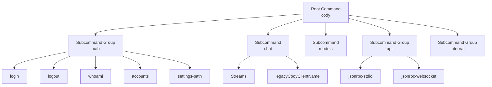
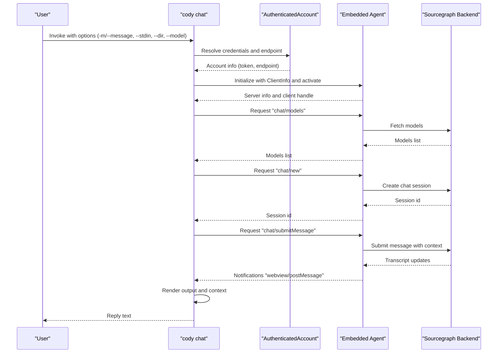
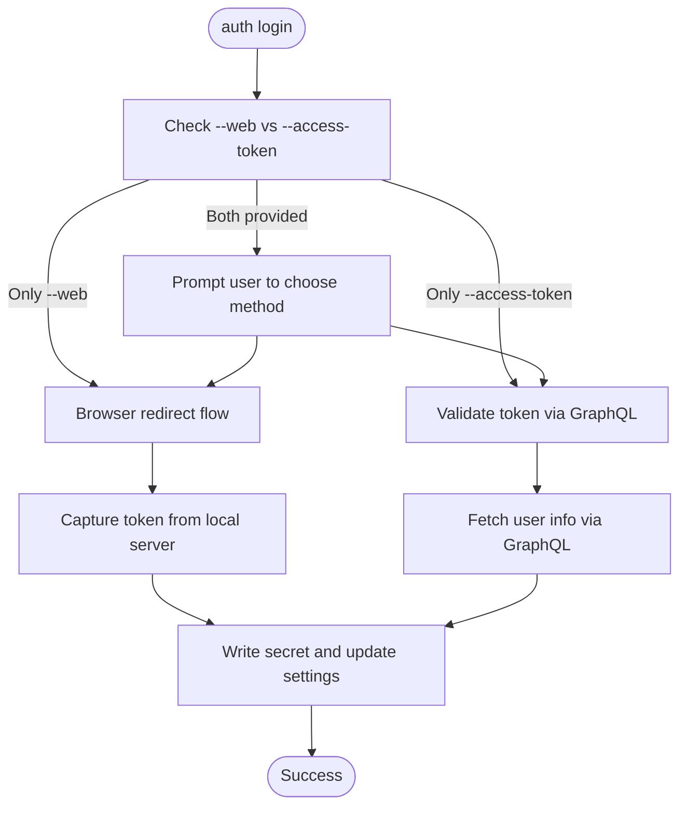
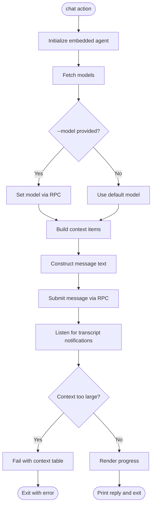
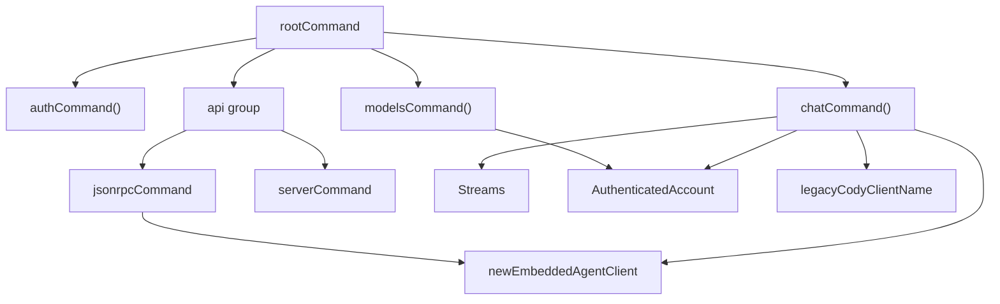

# CLI Command Interface

<cite>
**Referenced Files in This Document**
- [command-root.ts](file://agent/src/cli/command-root.ts)
- [command-chat.ts](file://agent/src/cli/command-chat.ts)
- [command-jsonrpc-stdio.ts](file://agent/src/cli/command-jsonrpc-stdio.ts)
- [command-jsonrpc-websocket.ts](file://agent/src/cli/command-jsonrpc-websocket.ts)
- [command-auth.ts](file://agent/src/cli/command-auth/command-auth.ts)
- [command-login.ts](file://agent/src/cli/command-auth/command-login.ts)
- [command-logout.ts](file://agent/src/cli/command-auth/command-logout.ts)
- [command-whoami.ts](file://agent/src/cli/command-auth/command-whoami.ts)
- [command-accounts.ts](file://agent/src/cli/command-auth/command-accounts.ts)
- [command-models.ts](file://agent/src/cli/command-models.ts)
- [Streams.ts](file://agent/src/cli/Streams.ts)
- [legacyCodyClientName.ts](file://agent/src/cli/legacyCodyClientName.ts)
- [package.json](file://agent/package.json)
</cite>

## Table of Contents
1. [Introduction](#introduction)
2. [Project Structure](#project-structure)
3. [Core Components](#core-components)
4. [Architecture Overview](#architecture-overview)
5. [Detailed Component Analysis](#detailed-component-analysis)
6. [Dependency Analysis](#dependency-analysis)
7. [Performance Considerations](#performance-considerations)
8. [Troubleshooting Guide](#troubleshooting-guide)
9. [Conclusion](#conclusion)
10. [Appendices](#appendices)

## Introduction
This document describes the agent’s CLI command interface and command-line operations. It explains the root command structure, argument parsing, and subcommand organization. It details the JSON-RPC stdio and websocket communication modes, their use cases, and configuration options. It documents each CLI command including authentication, configuration management, and debugging utilities. It covers command execution flow, error handling, and output formatting. Practical examples illustrate usage for development, testing, and production deployment. Environment variable configuration, logging levels, and troubleshooting commands are included.

## Project Structure
The CLI is organized under agent/src/cli with a root command that aggregates subcommands:
- Root command defines the program name, version, and description, and adds subcommands for auth, chat, models, api, and internal benchmarks.
- Subcommands are grouped by responsibility:
  - Authentication: login, logout, whoami, accounts, settings-path
  - Chat: interactive chat with optional context and model selection
  - Models: list supported models on the configured endpoint
  - API: JSON-RPC stdio and websocket servers
  - Internal: benchmarking utilities

**Diagram sources**
- [command-root.ts:12-23](file://agent/src/cli/command-root.ts#L12-L23)
- [command-auth.ts:8-27](file://agent/src/cli/command-auth/command-auth.ts#L8-L27)
- [command-chat.ts:45-110](file://agent/src/cli/command-chat.ts#L45-L110)
- [command-models.ts:14-51](file://agent/src/cli/command-models.ts#L14-L51)
- [command-jsonrpc-stdio.ts:61-179](file://agent/src/cli/command-jsonrpc-stdio.ts#L61-L179)
- [command-jsonrpc-websocket.ts:12-55](file://agent/src/cli/command-jsonrpc-websocket.ts#L12-L55)
- [Streams.ts](file://agent/src/cli/Streams.ts)
- [legacyCodyClientName.ts](file://agent/src/cli/legacyCodyClientName.ts)

**Section sources**
- [command-root.ts:12-23](file://agent/src/cli/command-root.ts#L12-L23)
- [package.json](file://agent/package.json)

## Core Components
- Root command: sets program metadata and registers subcommands.
- Authentication group: manages user sessions and settings.
- Chat command: orchestrates embedded agent initialization, context assembly, and chat interactions.
- Models command: lists available models via the Sourcegraph endpoint.
- JSON-RPC stdio server: exposes agent over stdin/stdout for plugin integrations.
- JSON-RPC websocket server: experimental server for websocket-based JSON-RPC.

Key implementation patterns:
- Argument parsing with commander Options and env() bindings.
- Streams abstraction for stdout/stderr handling.
- Embedded agent lifecycle management with reuse semantics.
- Polly-based network recording/replay for deterministic tests.

**Section sources**
- [command-root.ts:12-23](file://agent/src/cli/command-root.ts#L12-L23)
- [command-chat.ts:28-43](file://agent/src/cli/command-chat.ts#L28-L43)
- [command-chat.ts:128-336](file://agent/src/cli/command-chat.ts#L128-L336)
- [command-models.ts:14-51](file://agent/src/cli/command-models.ts#L14-L51)
- [command-jsonrpc-stdio.ts:13-27](file://agent/src/cli/command-jsonrpc-stdio.ts#L13-L27)
- [command-jsonrpc-stdio.ts:115-179](file://agent/src/cli/command-jsonrpc-stdio.ts#L115-L179)
- [command-jsonrpc-websocket.ts:12-55](file://agent/src/cli/command-jsonrpc-websocket.ts#L12-L55)
- [Streams.ts](file://agent/src/cli/Streams.ts)

## Architecture Overview
The CLI integrates with the embedded agent and the Sourcegraph backend. The chat command initializes the agent with client info and handles notifications for progress and transcript updates. Authentication options are passed through to the agent and used to configure model listing and chat requests.

**Diagram sources**
- [command-chat.ts:82-110](file://agent/src/cli/command-chat.ts#L82-L110)
- [command-chat.ts:128-336](file://agent/src/cli/command-chat.ts#L128-L336)
- [command-login.ts:24-37](file://agent/src/cli/command-auth/command-login.ts#L24-L37)
- [command-models.ts:20-50](file://agent/src/cli/command-models.ts#L20-L50)

## Detailed Component Analysis

### Root Command and Subcommand Organization
- Program name and version are derived from package metadata.
- Subcommands:
  - auth: login, logout, whoami, accounts, settings-path
  - chat: interactive chat with context and model selection
  - models: list models on the configured endpoint
  - api: jsonrpc-stdio and jsonrpc-websocket
  - internal: benchmarking utilities

Environment and version:
- Version flag uses the package version.
- Description encourages getting started with chat.

**Section sources**
- [command-root.ts:12-23](file://agent/src/cli/command-root.ts#L12-L23)
- [package.json](file://agent/package.json)

### Authentication Commands
- login: Supports web-based browser flow or manual token/endpoint. Validates credentials and writes secrets and user settings.
- logout: Removes stored credentials for the active account.
- whoami: Prints the currently authenticated user and endpoint.
- accounts: Manages multiple accounts and active selection.
- settings-path: Prints the path to the user settings JSON file.

Key behaviors:
- Options bind to environment variables for automation.
- Browser flow opens a local HTTP server to receive the token via redirect.
- CLI flow validates the provided token against the endpoint.

**Diagram sources**
- [command-login.ts:39-86](file://agent/src/cli/command-auth/command-login.ts#L39-L86)
- [command-login.ts:93-145](file://agent/src/cli/command-auth/command-login.ts#L93-L145)
- [command-login.ts:154-194](file://agent/src/cli/command-auth/command-login.ts#L154-L194)
- [command-login.ts:248-274](file://agent/src/cli/command-auth/command-login.ts#L248-L274)

**Section sources**
- [command-auth.ts:8-27](file://agent/src/cli/command-auth/command-auth.ts#L8-L27)
- [command-login.ts:24-37](file://agent/src/cli/command-auth/command-login.ts#L24-L37)
- [command-login.ts:39-86](file://agent/src/cli/command-auth/command-login.ts#L39-L86)
- [command-login.ts:93-145](file://agent/src/cli/command-auth/command-login.ts#L93-L145)
- [command-login.ts:154-194](file://agent/src/cli/command-auth/command-login.ts#L154-L194)
- [command-login.ts:248-274](file://agent/src/cli/command-auth/command-login.ts#L248-L274)

### Chat Command
Purpose:
- Enable interactive chat with optional codebase context and model selection.
- Support stdin piping and flexible message construction.

Key options:
- -m/--message: primary message text.
- --stdin: read message from stdin.
- -C/--dir: working directory for context resolution.
- --model: override default chat model.
- --context-repo: enterprise-only repository context.
- --context-file: local file context.
- --show-context: print resolved context items.
- --ignore-context-window-errors: bypass context size checks.
- --silent: disable streaming output.
- --debug: subscribe to debug notifications.

Execution flow:
- Authenticate and initialize the embedded agent.
- Resolve models and optionally set a model.
- Assemble context items (repositories and files).
- Submit message and render transcript updates.
- Optionally print context items and compute throughput.

Error handling:
- Fails early if no directory is provided.
- Validates context size and cancels the request if oversized.
- Handles unexpected response types and errors in replies.

Output formatting:
- Progress spinner indicates steps.
- Streaming updates to stderr via Streams.
- Final reply printed to stdout.

**Diagram sources**
- [command-chat.ts:128-336](file://agent/src/cli/command-chat.ts#L128-L336)
- [command-chat.ts:393-421](file://agent/src/cli/command-chat.ts#L393-L421)
- [Streams.ts](file://agent/src/cli/Streams.ts)

**Section sources**
- [command-chat.ts:29-43](file://agent/src/cli/command-chat.ts#L29-L43)
- [command-chat.ts:45-110](file://agent/src/cli/command-chat.ts#L45-L110)
- [command-chat.ts:128-336](file://agent/src/cli/command-chat.ts#L128-L336)
- [command-chat.ts:393-421](file://agent/src/cli/command-chat.ts#L393-L421)
- [Streams.ts](file://agent/src/cli/Streams.ts)

### Models Command
Purpose:
- List supported model IDs on the configured Sourcegraph endpoint.

Behavior:
- Reads authentication from user settings or exits.
- Sets client identification headers for the request.
- Fetches models from the endpoint and prints IDs to stdout.

**Section sources**
- [command-models.ts:14-51](file://agent/src/cli/command-models.ts#L14-L51)

### JSON-RPC Stdio Server
Purpose:
- Provide a JSON-RPC server over stdin/stdout for plugin integrations (JetBrains, Neovim).

Features:
- Polly-based network recording/replay for deterministic tests.
- Optional debug server over TCP socket for remote debugging.
- Environment-variable-backed options for recording configuration.

Options:
- Recording directory and mode.
- Recording name and expiry strategy.
- Keep unused recordings and record-if-missing.
- Debug mode and port.

Communication:
- Creates a message connection using StreamMessageReader/Writer.
- Initializes the Agent with the connection and extension activation.

**Section sources**
- [command-jsonrpc-stdio.ts:13-27](file://agent/src/cli/command-jsonrpc-stdio.ts#L13-L27)
- [command-jsonrpc-stdio.ts:28-54](file://agent/src/cli/command-jsonrpc-stdio.ts#L28-L54)
- [command-jsonrpc-stdio.ts:61-179](file://agent/src/cli/command-jsonrpc-stdio.ts#L61-L179)
- [command-jsonrpc-stdio.ts:181-208](file://agent/src/cli/command-jsonrpc-stdio.ts#L181-L208)

### JSON-RPC Websocket Server
Purpose:
- Experimental server that accepts JSON-RPC over websockets.

Behavior:
- Starts a WebSocket server on a configurable port.
- On first message, initializes an agent client and applies extension configuration.
- Logs received messages and errors.

Note:
- The implementation comments indicate future migration to vscode-jsonrpc and placeholder handling for message encoding.

**Section sources**
- [command-jsonrpc-websocket.ts:12-55](file://agent/src/cli/command-jsonrpc-websocket.ts#L12-L55)

## Dependency Analysis
The CLI depends on:
- Commander for argument parsing and subcommand registration.
- VS Code JSON-RPC for stdio communication.
- Polly for network recording/replay.
- Embedded agent initialization and client creation.
- Authentication utilities for resolving credentials.

**Diagram sources**
- [command-root.ts:12-23](file://agent/src/cli/command-root.ts#L12-L23)
- [command-auth.ts:8-27](file://agent/src/cli/command-auth/command-auth.ts#L8-L27)
- [command-chat.ts:16-164](file://agent/src/cli/command-chat.ts#L16-L164)
- [command-models.ts:20-50](file://agent/src/cli/command-models.ts#L20-L50)
- [command-jsonrpc-stdio.ts:181-208](file://agent/src/cli/command-jsonrpc-stdio.ts#L181-L208)
- [Streams.ts](file://agent/src/cli/Streams.ts)
- [legacyCodyClientName.ts](file://agent/src/cli/legacyCodyClientName.ts)

**Section sources**
- [command-root.ts:12-23](file://agent/src/cli/command-root.ts#L12-L23)
- [command-chat.ts:16-164](file://agent/src/cli/command-chat.ts#L16-L164)
- [command-models.ts:20-50](file://agent/src/cli/command-models.ts#L20-L50)
- [command-jsonrpc-stdio.ts:181-208](file://agent/src/cli/command-jsonrpc-stdio.ts#L181-L208)

## Performance Considerations
- Chat throughput: token count divided by elapsed time is computed and displayed to indicate tokens per second.
- Context validation: oversized context items cause immediate failure to avoid wasted computation.
- Silent mode: disables streaming progress to reduce I/O overhead.
- Embedded agent reuse: a singleton client prevents contention and hangs caused by global singletons.

Recommendations:
- Prefer silent mode in automated pipelines.
- Limit context files to those necessary to avoid context window errors.
- Use recording modes judiciously in CI to balance determinism and runtime.

**Section sources**
- [command-chat.ts:314-321](file://agent/src/cli/command-chat.ts#L314-L321)
- [command-chat.ts:393-421](file://agent/src/cli/command-chat.ts#L393-L421)
- [command-chat.ts:112-126](file://agent/src/cli/command-chat.ts#L112-L126)

## Troubleshooting Guide
Common issues and resolutions:
- Not authenticated:
  - Use auth login with --web or --access-token to establish credentials.
  - Verify settings-path to locate the user settings JSON.
- Chat failures:
  - Ensure a message is provided via --message or stdin.
  - Check context size; use --ignore-context-window-errors to bypass checks.
  - Enable --debug to observe debug notifications.
- JSON-RPC stdio:
  - If the agent process does not exit after client disconnect, ensure stdin/stdout close properly.
  - Use debug server mode to inspect traffic on the configured port.
- JSON-RPC websocket:
  - The server is experimental; expect limited functionality until reimplemented with vscode-jsonrpc.

Environment variables:
- SRC_ACCESS_TOKEN and SRC_ENDPOINT: supply credentials for login and model listing.
- CODY_RECORDING_DIRECTORY, CODY_RECORDING_MODE, CODY_RECORDING_NAME, CODY_RECORDING_EXPIRY_STRATEGY, CODY_RECORDING_EXPIRES_IN, CODY_KEEP_UNUSED_RECORDINGS, CODY_RECORD_IF_MISSING: configure Polly recording/replay.
- CODY_AGENT_DEBUG_REMOTE and CODY_AGENT_DEBUG_PORT: enable debug server over TCP.

**Section sources**
- [command-login.ts:24-37](file://agent/src/cli/command-auth/command-login.ts#L24-L37)
- [command-chat.ts:82-110](file://agent/src/cli/command-chat.ts#L82-L110)
- [command-chat.ts:268-274](file://agent/src/cli/command-chat.ts#L268-L274)
- [command-chat.ts:393-421](file://agent/src/cli/command-chat.ts#L393-L421)
- [command-jsonrpc-stdio.ts:56-108](file://agent/src/cli/command-jsonrpc-stdio.ts#L56-L108)
- [command-jsonrpc-stdio.ts:155-179](file://agent/src/cli/command-jsonrpc-stdio.ts#L155-L179)
- [command-jsonrpc-websocket.ts:12-55](file://agent/src/cli/command-jsonrpc-websocket.ts#L12-L55)

## Conclusion
The CLI provides a cohesive interface for authentication, chat, model management, and JSON-RPC integration. It supports both headless operation and plugin-driven workflows. Proper use of environment variables, context controls, and recording modes enables effective development, testing, and production usage.

## Appendices

### Command Reference

- cody
  - Version: displays version from package metadata.
  - Description: encourages getting started with chat.

- cody auth
  - cody auth login
    - Options: --web, --access-token, --endpoint
    - Behavior: browser-based or token-based login; writes secrets and settings.
  - cody auth logout
    - Behavior: removes stored credentials for the active account.
  - cody auth whoami
    - Behavior: prints current user and endpoint.
  - cody auth accounts
    - Behavior: manage multiple accounts and active selection.
  - cody auth settings-path
    - Behavior: prints path to user settings JSON.

- cody chat
  - Options: -m/--message, --stdin, -C/--dir, --model, --context-repo, --context-file, --show-context, --ignore-context-window-errors, --silent, --debug
  - Behavior: initialize agent, assemble context, submit message, render transcript, optionally print context.

- cody models list
  - Options: --access-token, --endpoint
  - Behavior: list model IDs from the Sourcegraph endpoint.

- cody api jsonrpc-stdio
  - Options: recording directory/mode/name/expiry and related flags; debug mode/port
  - Behavior: JSON-RPC over stdin/stdout; optional debug server; Polly recording/replay.

- cody api jsonrpc-websocket
  - Options: --port
  - Behavior: experimental websocket JSON-RPC server; logs messages and errors.

### Practical Examples

- Development
  - Interactive chat with context: cody chat -m "Explain this" --context-file README.md --dir .
  - Pipe stdin: echo "Fix this bug" | cody chat --stdin -m "See attached"
  - List models: cody models list --endpoint https://cody.enterprise.example.com

- Testing
  - Record network traffic: CODY_RECORDING_DIRECTORY=./recordings CODY_RECORDING_MODE=record cody chat -m "Test"
  - Replay traffic: CODY_RECORDING_DIRECTORY=./recordings CODY_RECORDING_MODE=replay cody chat -m "Test"

- Production
  - Headless chat with explicit credentials: cody chat -m "Summarize" --dir . --access-token $SRC_ACCESS_TOKEN --endpoint $SRC_ENDPOINT
  - Quiet execution: cody chat -m "Report" --silent --dir .

### Environment Variables
- Authentication: SRC_ACCESS_TOKEN, SRC_ENDPOINT
- Recording: CODY_RECORDING_DIRECTORY, CODY_RECORDING_MODE, CODY_RECORDING_NAME, CODY_RECORDING_EXPIRY_STRATEGY, CODY_RECORDING_EXPIRES_IN, CODY_KEEP_UNUSED_RECORDINGS, CODY_RECORD_IF_MISSING
- Debugging: CODY_AGENT_DEBUG_REMOTE, CODY_AGENT_DEBUG_PORT