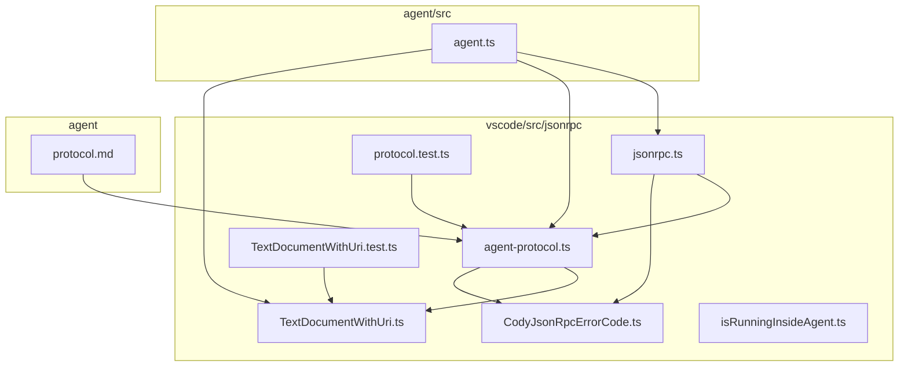
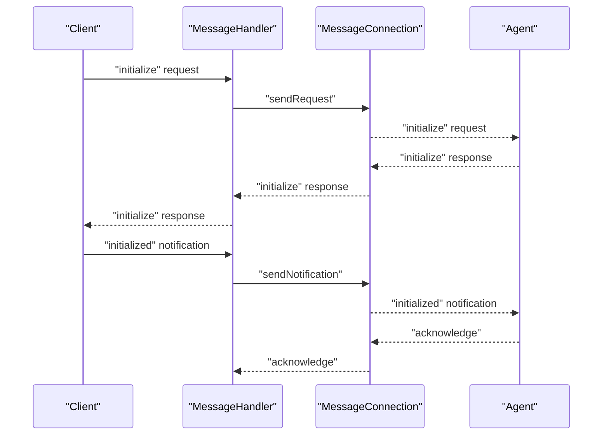
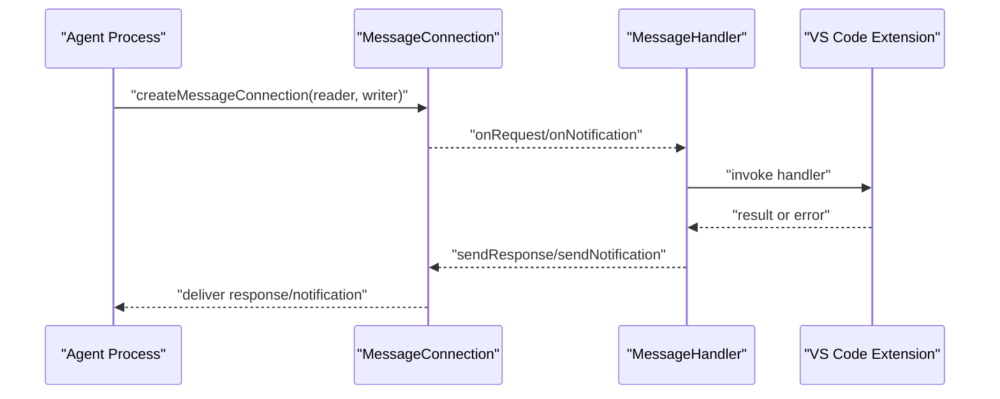
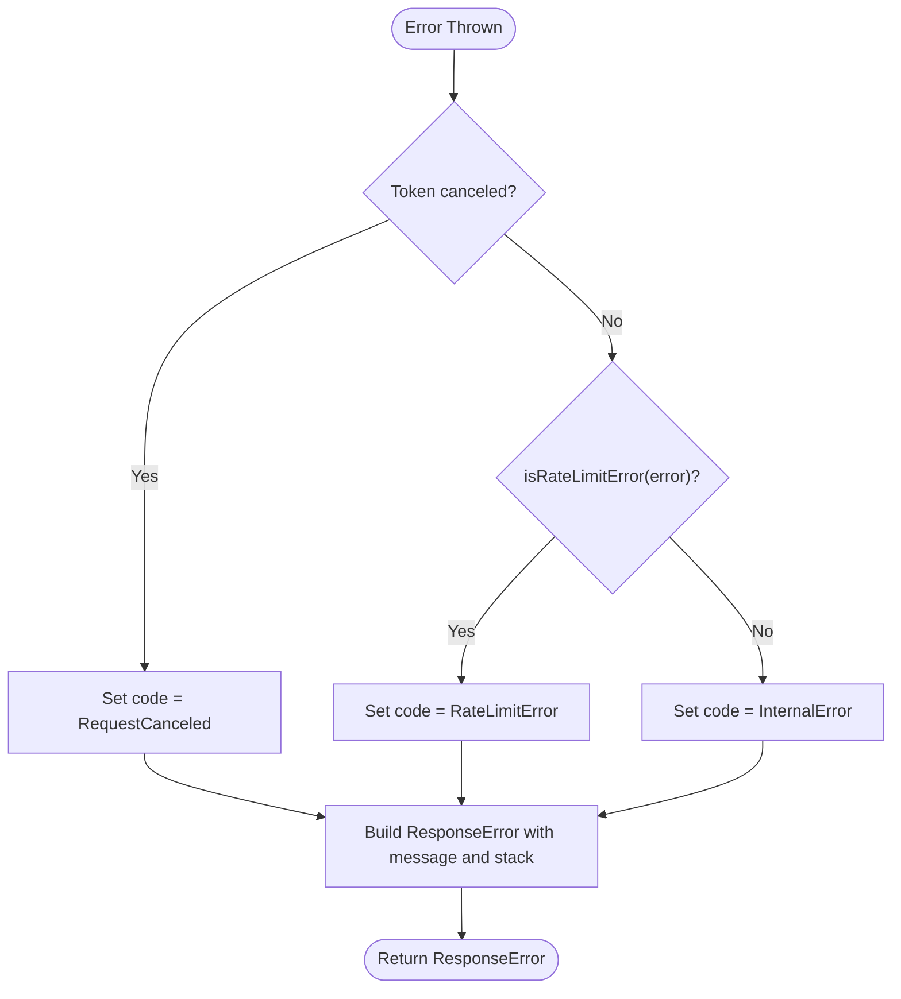
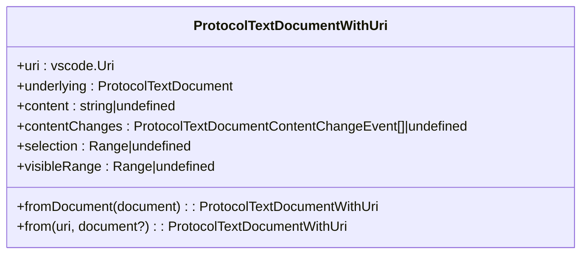
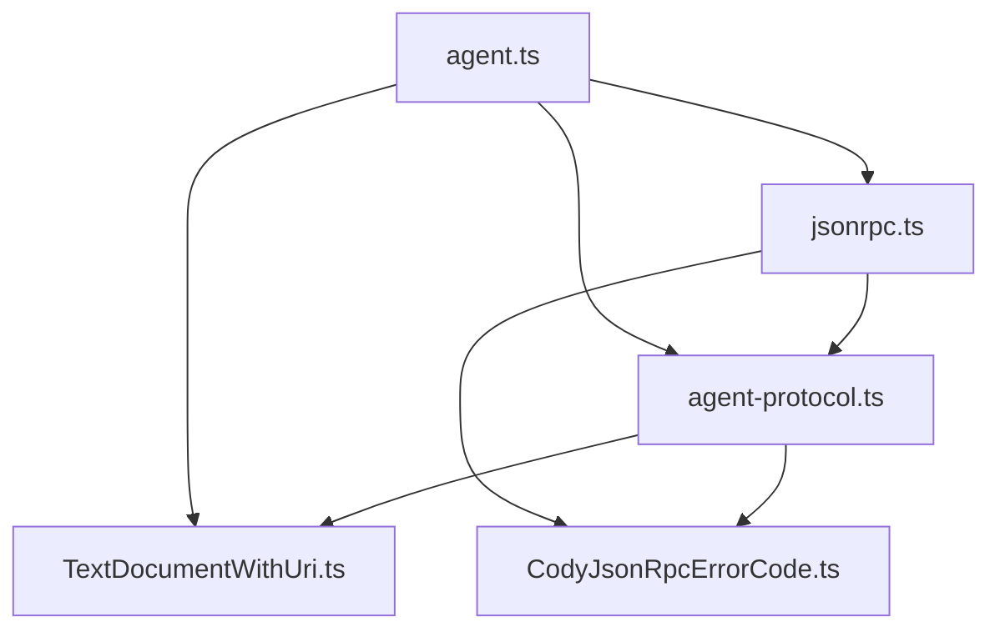

# JSON-RPC Protocol Implementation

<cite>
**Referenced Files in This Document**
- [agent-protocol.ts](file://vscode/src/jsonrpc/agent-protocol.ts)
- [CodyJsonRpcErrorCode.ts](file://vscode/src/jsonrpc/CodyJsonRpcErrorCode.ts)
- [TextDocumentWithUri.ts](file://vscode/src/jsonrpc/TextDocumentWithUri.ts)
- [jsonrpc.ts](file://vscode/src/jsonrpc/jsonrpc.ts)
- [isRunningInsideAgent.ts](file://vscode/src/jsonrpc/isRunningInsideAgent.ts)
- [protocol.md](file://agent/protocol.md)
- [protocol.test.ts](file://vscode/src/jsonrpc/protocol.test.ts)
- [TextDocumentWithUri.test.ts](file://vscode/src/jsonrpc/TextDocumentWithUri.test.ts)
- [agent.ts](file://agent/src/agent.ts)
</cite>

## Table of Contents
1. [Introduction](#introduction)
2. [Project Structure](#project-structure)
3. [Core Components](#core-components)
4. [Architecture Overview](#architecture-overview)
5. [Detailed Component Analysis](#detailed-component-analysis)
6. [Dependency Analysis](#dependency-analysis)
7. [Performance Considerations](#performance-considerations)
8. [Troubleshooting Guide](#troubleshooting-guide)
9. [Conclusion](#conclusion)
10. [Appendices](#appendices)

## Introduction
This document describes the JSON-RPC protocol implementation used by the agent runtime. It covers the protocol specification, method definitions, parameter schemas, response formats, transport mechanisms, error handling, and text document representation. It also explains the agent-protocol.ts interface definitions and their JSON-RPC method mappings, protocol versioning and backward compatibility considerations, security measures, and practical examples of common RPC calls and error scenarios.

## Project Structure
The JSON-RPC protocol is defined and implemented primarily in the vscode/src/jsonrpc directory, with the agent runtime wiring in agent/src/agent.ts. The protocol specification is documented in agent/protocol.md.



**Diagram sources**
- [agent-protocol.ts:1-1081](file://vscode/src/jsonrpc/agent-protocol.ts#L1-L1081)
- [CodyJsonRpcErrorCode.ts:1-10](file://vscode/src/jsonrpc/CodyJsonRpcErrorCode.ts#L1-L10)
- [TextDocumentWithUri.ts:1-66](file://vscode/src/jsonrpc/TextDocumentWithUri.ts#L1-L66)
- [jsonrpc.ts:1-191](file://vscode/src/jsonrpc/jsonrpc.ts#L1-L191)
- [isRunningInsideAgent.ts:1-10](file://vscode/src/jsonrpc/isRunningInsideAgent.ts#L1-L10)
- [protocol.md:1-482](file://agent/protocol.md#L1-L482)
- [protocol.test.ts:1-98](file://vscode/src/jsonrpc/protocol.test.ts#L1-L98)
- [TextDocumentWithUri.test.ts:1-15](file://vscode/src/jsonrpc/TextDocumentWithUri.test.ts#L1-L15)
- [agent.ts:1-1758](file://agent/src/agent.ts#L1-L1758)

**Section sources**
- [agent-protocol.ts:1-1081](file://vscode/src/jsonrpc/agent-protocol.ts#L1-L1081)
- [protocol.md:1-482](file://agent/protocol.md#L1-L482)

## Core Components
- Protocol definition and method schemas: agent-protocol.ts
- JSON-RPC error codes: CodyJsonRpcErrorCode.ts
- Text document representation: TextDocumentWithUri.ts
- Transport and message handling: jsonrpc.ts
- Runtime detection: isRunningInsideAgent.ts
- Protocol tests and validation: protocol.test.ts, TextDocumentWithUri.test.ts
- Agent runtime integration: agent.ts

**Section sources**
- [agent-protocol.ts:24-472](file://vscode/src/jsonrpc/agent-protocol.ts#L24-L472)
- [CodyJsonRpcErrorCode.ts:1-10](file://vscode/src/jsonrpc/CodyJsonRpcErrorCode.ts#L1-L10)
- [TextDocumentWithUri.ts:10-66](file://vscode/src/jsonrpc/TextDocumentWithUri.ts#L10-L66)
- [jsonrpc.ts:13-191](file://vscode/src/jsonrpc/jsonrpc.ts#L13-L191)
- [isRunningInsideAgent.ts:1-10](file://vscode/src/jsonrpc/isRunningInsideAgent.ts#L1-L10)
- [protocol.test.ts:5-98](file://vscode/src/jsonrpc/protocol.test.ts#L5-L98)
- [TextDocumentWithUri.test.ts:1-15](file://vscode/src/jsonrpc/TextDocumentWithUri.test.ts#L1-L15)
- [agent.ts:195-283](file://agent/src/agent.ts#L195-L283)

## Architecture Overview
The agent runtime uses JSON-RPC over stdin/stdout transport. The protocol defines requests (with responses) and notifications (fire-and-forget). The MessageHandler class registers handlers for requests and notifications, manages tracing, and converts errors to standardized JSON-RPC error codes. The agent integrates with the VS Code extension ecosystem and exposes protocol methods for chat, autocomplete, code actions, diagnostics, webviews, and more.



**Diagram sources**
- [agent.ts:381-499](file://agent/src/agent.ts#L381-L499)
- [jsonrpc.ts:121-136](file://vscode/src/jsonrpc/jsonrpc.ts#L121-L136)

**Section sources**
- [agent.ts:195-251](file://agent/src/agent.ts#L195-L251)
- [jsonrpc.ts:1-191](file://vscode/src/jsonrpc/jsonrpc.ts#L1-L191)

## Detailed Component Analysis

### Protocol Specification and Method Definitions
The protocol defines:
- Requests: asynchronous methods that return a value
- Notifications: fire-and-forget messages
- Client-to-server methods (requests/notifications)
- Server-to-client methods (requests/notifications)

Key method categories include initialization, chat, commands, autocomplete, GraphQL queries, diagnostics, webview messaging, progress reporting, and configuration.

```mermaid
classDiagram
class Requests {
+initialize(ClientInfo, ServerInfo)
+shutdown(null, null)
+"chat/new"(null, string)
+"chat/web/new"(null, {panelId, chatId})
+"chat/sidebar/new"(null, {panelId, chatId})
+"chat/delete"({chatId}, ChatExportResult[])
+"chat/models"({modelUsage}, {readOnly, models})
+"chat/export"(null|{fullHistory}, ChatExportResult[])
+"chat/import"({history, merge}, null)
+"chat/submitMessage"({id, message}, ExtensionMessage)
+"chat/editMessage"({id, message}, ExtensionMessage)
+"chat/setModel"({id, model}, null)
+"commands/explain"(null, string)
+"commands/smell"(null, string)
+"commands/custom"({key}, CustomCommandResult)
+"customCommands/list"(null, CodyCommand[])
+"editTask/start"(null, FixupTaskID|undefined|null)
+"editTask/accept"(FixupTaskID, null)
+"editTask/undo"(FixupTaskID, null)
+"editTask/cancel"(FixupTaskID, null)
+"editTask/retry"(FixupTaskID, FixupTaskID|undefined|null)
+"editTask/getTaskDetails"(FixupTaskID, EditTask)
+"editTask/getFoldingRanges"(GetFoldingRangeParams, GetFoldingRangeResult)
+"command/execute"(ExecuteCommandParams, any)
+"codeActions/provide"({location, triggerKind}, {codeActions})
+"codeActions/trigger"(FixupTaskID, FixupTaskID|undefined|null)
+"autocomplete/execute"(AutocompleteParams, AutocompleteResult)
+"graphql/getRepoIds"({names, first}, {repos})
+"graphql/currentUserId"(null, string)
+"graphql/currentUserIsPro"(null, boolean)
+"featureFlags/getFeatureFlag"({flagName}, boolean|null)
+"graphql/getCurrentUserCodySubscription"(null, CurrentUserCodySubscription|null)
+"telemetry/recordEvent"(TelemetryEvent, null)
+"graphql/getRepoIdIfEmbeddingExists"({repoName}, string|null)
+"graphql/getRepoId"({repoName}, string|null)
+"git/codebaseName"({url}, string|null)
+"webview/didDispose"({id}, null)
+"webview/resolveWebviewView"({viewId, webviewHandle}, null)
+"webview/receiveMessage"({id, message}, null)
+"webview/receiveMessageStringEncoded"({id, messageStringEncoded}, null)
+"diagnostics/publish"({diagnostics}, null)
+"testing/progress"({title}, {result})
+"testing/exportedTelemetryEvents"(null, {events})
+"testing/networkRequests"(null, {requests})
+"testing/requestErrors"(null, {errors})
+"testing/closestPostData"({url, postData}, {closestBody})
+"testing/memoryUsage"(null, {usage})
+"testing/heapdump"(null, null)
+"testing/awaitPendingPromises"(null, null)
+"testing/workspaceDocuments"(GetDocumentsParams, GetDocumentsResult)
+"testing/diagnostics"({uri}, {diagnostics})
+"testing/progressCancelation"({title}, {result})
+"testing/reset"(null, null)
+"testing/autocomplete/completionEvent"(CompletionItemParams, CompletionBookkeepingEvent|undefined|null)
+"testing/autocomplete/autoeditEvent"(CompletionItemParams, AutoeditRequestStateForAgentTesting|undefined|null)
+"testing/autocomplete/awaitPendingVisibilityTimeout"(null, CompletionItemID|undefined)
+"testing/autocomplete/setCompletionVisibilityDelay"({delay}, null)
+"testing/autocomplete/providerConfig"(null, {id, legacyModel, configSource}|undefined|null)
+"extensionConfiguration/change"(ExtensionConfiguration, ProtocolAuthStatus|null)
+"extensionConfiguration/status"(null, ProtocolAuthStatus|null)
+"extensionConfiguration/getSettingsSchema"(null, string)
+"textDocument/change"(ProtocolTextDocument, {success})
+"attribution/search"({id, snippet}, {error?, repoNames, limitHit})
+"ignore/test"({uri}, {policy})
+"testing/ignore/overridePolicy"(ContextFilters|null, null)
+"extension/reset"(null, null)
+"internal/getAuthHeaders"(string, Record<string,string>)
}
class Notifications {
+initialized([null])
+exit([null])
+"extensionConfiguration/didChange"([ExtensionConfiguration])
+"workspaceFolder/didChange"([{uris}])
+"textDocument/didOpen"([ProtocolTextDocument])
+"textDocument/didChange"([ProtocolTextDocument])
+"textDocument/didFocus"([{uri}])
+"textDocument/didSave"([{uri}])
+"textDocument/didRename"([{oldUri, newUri}])
+"textDocument/didClose"([ProtocolTextDocument])
+"workspace/didDeleteFiles"([DeleteFilesParams])
+"workspace/didCreateFiles"([CreateFilesParams])
+"workspace/didRenameFiles"([RenameFilesParams])
+"$/cancelRequest"([CancelParams])
+"autocomplete/clearLastCandidate"([null])
+"autocomplete/completionSuggested"([CompletionItemParams])
+"autocomplete/completionAccepted"([CompletionItemParams])
+"progress/cancel"([{id}])
+"testing/runInAgent"([string])
+"webview/didDisposeNative"([{handle}])
+"secrets/didChange"([{key}])
+"window/didChangeFocus"([{focused}])
+"testing/resetStorage"(null)
}
class ServerRequests {
+"window/showMessage"(ShowWindowMessageParams, string|null)
+"window/showSaveDialog"(SaveDialogOptionsParams, string|undefined|null)
+"textDocument/edit"(TextDocumentEditParams, boolean)
+"textDocument/show"({uri, options?}, boolean)
+"textEditor/selection"({uri, selection}, null)
+"textEditor/revealRange"({uri, range}, null)
+"workspace/edit"(WorkspaceEditParams, boolean)
+"secrets/get"({key}, string|null|undefined)
+"secrets/store"({key, value}, null|undefined)
+"secrets/delete"({key}, null|undefined)
+"env/openExternal"({uri}, boolean)
+"editTask/getUserInput"(UserEditPromptRequest, UserEditPromptResult|undefined|null)
}
class ServerNotifications {
+"autocomplete/didHide"([null])
+"autocomplete/didTrigger"([null])
+"debug/message"[DebugMessage]
+"extensionConfiguration/didUpdate"([{key, value?}])
+"extensionConfiguration/openSettings"([null])
+"codeLenses/display"(DisplayCodeLensParams)
+"ignore/didChange"([null])
+"webview/postMessage"(WebviewPostMessageParams)
+"webview/postMessageStringEncoded"([{id, stringEncodedMessage}])
+"progress/start"(ProgressStartParams)
+"progress/report"(ProgressReportParams)
+"progress/end"([{id}])
+"webview/registerWebviewViewProvider"([{viewId, retainContextWhenHidden}])
+"webview/createWebviewPanel"([{handle, viewType, title, showOptions, options}])
+"webview/dispose"([{handle}])
+"webview/reveal"([{handle, viewColumn, preserveFocus}])
+"webview/setTitle"([{handle, title}])
+"webview/setIconPath"([{handle, iconPath?}])
+"webview/setOptions"([{handle, options}])
+"webview/setHtml"([{handle, html}])
+"window/didChangeContext"([{key, value?}])
+"window/focusSidebar"([null])
+"authStatus/didUpdate"(ProtocolAuthStatus)
}
```

**Diagram sources**
- [agent-protocol.ts:30-472](file://vscode/src/jsonrpc/agent-protocol.ts#L30-L472)

**Section sources**
- [agent-protocol.ts:24-472](file://vscode/src/jsonrpc/agent-protocol.ts#L24-L472)

### JSON-RPC Transport Mechanisms
Transport is via stdin/stdout using the vscode-jsonrpc library. The agent establishes a MessageConnection and listens for requests and notifications. The MessageHandler wraps the connection, registers handlers, traces messages, and converts errors to standardized codes.



**Diagram sources**
- [agent.ts:227-239](file://agent/src/agent.ts#L227-L239)
- [jsonrpc.ts:40-191](file://vscode/src/jsonrpc/jsonrpc.ts#L40-L191)

**Section sources**
- [agent.ts:195-251](file://agent/src/agent.ts#L195-L251)
- [jsonrpc.ts:1-191](file://vscode/src/jsonrpc/jsonrpc.ts#L1-L191)

### Error Handling Through CodyJsonRpcErrorCode
Standardized error codes are defined for JSON-RPC responses. The MessageHandler maps thrown errors to ResponseError with appropriate codes, including cancellation and rate-limit errors.



**Diagram sources**
- [jsonrpc.ts:69-88](file://vscode/src/jsonrpc/jsonrpc.ts#L69-L88)
- [CodyJsonRpcErrorCode.ts:1-10](file://vscode/src/jsonrpc/CodyJsonRpcErrorCode.ts#L1-L10)

**Section sources**
- [jsonrpc.ts:69-88](file://vscode/src/jsonrpc/jsonrpc.ts#L69-L88)
- [CodyJsonRpcErrorCode.ts:1-10](file://vscode/src/jsonrpc/CodyJsonRpcErrorCode.ts#L1-L10)

### Text Document Representation via TextDocumentWithUri
TextDocumentWithUri wraps ProtocolTextDocument and provides a parsed vscode.Uri, ensuring consistency between string-encoded URIs and parsed URIs. It also exposes content, contentChanges, selection, and visibleRange.



**Diagram sources**
- [TextDocumentWithUri.ts:16-66](file://vscode/src/jsonrpc/TextDocumentWithUri.ts#L16-L66)

**Section sources**
- [TextDocumentWithUri.ts:10-66](file://vscode/src/jsonrpc/TextDocumentWithUri.ts#L10-L66)
- [TextDocumentWithUri.test.ts:1-15](file://vscode/src/jsonrpc/TextDocumentWithUri.test.ts#L1-L15)

### Protocol Versioning and Backward Compatibility
- The protocol uses string literal method names and strict parameter schemas to maintain compatibility across clients.
- Optional fields consistently accept null, undefined, and are marked optional to avoid ambiguity across languages.
- Tests enforce null/undefined robustness to prevent cross-language interoperability issues.

**Section sources**
- [protocol.test.ts:5-98](file://vscode/src/jsonrpc/protocol.test.ts#L5-L98)
- [agent-protocol.ts:588-763](file://vscode/src/jsonrpc/agent-protocol.ts#L588-L763)

### Security Measures
- Authentication status is exposed via ProtocolAuthStatus with explicit fields for endpoint, username, verified email, and pending validation.
- Access tokens and custom headers are part of ExtensionConfiguration; clients should avoid logging sensitive data.
- Rate limiting is handled with a dedicated error code and response wrapping.

**Section sources**
- [agent-protocol.ts:620-740](file://vscode/src/jsonrpc/agent-protocol.ts#L620-L740)
- [jsonrpc.ts:69-88](file://vscode/src/jsonrpc/jsonrpc.ts#L69-L88)

### Examples of Common RPC Calls
- Initialize agent and acknowledge:
  - Client sends "initialize" with ClientInfo
  - Agent responds with ServerInfo
  - Client sends "initialized" notification
- Open a document:
  - Client sends "textDocument/didOpen" with ProtocolTextDocument
  - Agent loads document and fires events
- Submit a chat message:
  - Client sends "chat/submitMessage" with {id, message}
  - Agent forwards to webview and streams replies via "webview/postMessage"
- Trigger autocomplete:
  - Client sends "autocomplete/execute" with {uri, position}
  - Agent returns AutocompleteResult with items and decoratedEditItems

**Section sources**
- [agent.ts:542-560](file://agent/src/agent.ts#L542-L560)
- [agent.ts:593-611](file://agent/src/agent.ts#L593-L611)
- [agent-protocol.ts:130-131](file://vscode/src/jsonrpc/agent-protocol.ts#L130-L131)
- [agent-protocol.ts:78-78](file://vscode/src/jsonrpc/agent-protocol.ts#L78-L78)

### Error Scenarios and Debugging Techniques
- Parse errors, invalid requests, method not found, invalid params, internal errors, and request canceled are mapped to standardized codes.
- Rate limit errors are detected and returned with a dedicated code.
- Debug tracing can be enabled via CODY_AGENT_TRACE_PATH to log all JSON messages.
- Use "testing/*" methods for diagnostics and memory usage checks.

**Section sources**
- [CodyJsonRpcErrorCode.ts:1-10](file://vscode/src/jsonrpc/CodyJsonRpcErrorCode.ts#L1-L10)
- [jsonrpc.ts:25-68](file://vscode/src/jsonrpc/jsonrpc.ts#L25-L68)
- [agent.ts:758-764](file://agent/src/agent.ts#L758-L764)

## Dependency Analysis
The agent runtime depends on the protocol definitions and JSON-RPC utilities. The MessageHandler depends on the protocol types and error codes. The agent integrates with VS Code extension APIs and handles document lifecycle and webview panels.



**Diagram sources**
- [agent-protocol.ts:1-1081](file://vscode/src/jsonrpc/agent-protocol.ts#L1-L1081)
- [TextDocumentWithUri.ts:1-66](file://vscode/src/jsonrpc/TextDocumentWithUri.ts#L1-L66)
- [CodyJsonRpcErrorCode.ts:1-10](file://vscode/src/jsonrpc/CodyJsonRpcErrorCode.ts#L1-L10)
- [jsonrpc.ts:1-191](file://vscode/src/jsonrpc/jsonrpc.ts#L1-L191)
- [agent.ts:1-1758](file://agent/src/agent.ts#L1-L1758)

**Section sources**
- [agent.ts:1-1758](file://agent/src/agent.ts#L1-L1758)
- [jsonrpc.ts:1-191](file://vscode/src/jsonrpc/jsonrpc.ts#L1-L191)

## Performance Considerations
- Minimize frequent "textDocument/didChange" notifications to reduce overhead.
- Batch workspace edits using "workspace/edit" when possible.
- Use "progress/start/report/end" to keep clients informed without blocking.
- Leverage "testing/awaitPendingPromises" in tests to synchronize asynchronous operations deterministically.

## Troubleshooting Guide
- Enable tracing with CODY_AGENT_TRACE_PATH to capture raw JSON messages.
- Verify protocol null/undefined handling by running protocol tests.
- Validate URI encoding for special characters using TextDocumentWithUri tests.
- Monitor authentication status via "authStatus/didUpdate" and "extensionConfiguration/didUpdate".
- Use "testing/memoryUsage" and "testing/heapdump" to diagnose memory issues.

**Section sources**
- [jsonrpc.ts:25-68](file://vscode/src/jsonrpc/jsonrpc.ts#L25-L68)
- [protocol.test.ts:5-98](file://vscode/src/jsonrpc/protocol.test.ts#L5-L98)
- [TextDocumentWithUri.test.ts:1-15](file://vscode/src/jsonrpc/TextDocumentWithUri.test.ts#L1-L15)
- [agent.ts:758-768](file://agent/src/agent.ts#L758-L768)

## Conclusion
The JSON-RPC protocol implementation provides a robust, cross-platform communication layer between the agent and client applications. It leverages strict typing, standardized error codes, and clear method schemas to ensure reliability and interoperability. The agent runtime integrates seamlessly with VS Code extension APIs and offers comprehensive tooling for diagnostics and debugging.

## Appendices
- Cross-platform transport: JSON-RPC over stdin/stdout
- Protocol documentation: agent/protocol.md
- Runtime detection: isRunningInsideAgent.ts

**Section sources**
- [protocol.md:1-482](file://agent/protocol.md#L1-L482)
- [isRunningInsideAgent.ts:1-10](file://vscode/src/jsonrpc/isRunningInsideAgent.ts#L1-L10)