# Process Management & Lifecycle

<cite>
**Referenced Files in This Document**
- [index.ts](file://agent/src/index.ts)
- [command-root.ts](file://agent/src/cli/command-root.ts)
- [command-jsonrpc-stdio.ts](file://agent/src/cli/command-jsonrpc-stdio.ts)
- [command-jsonrpc-websocket.ts](file://agent/src/cli/command-jsonrpc-websocket.ts)
- [agent.ts](file://agent/src/agent.ts)
- [certs.ts](file://agent/src/certs.ts)
- [AgentWorkspaceDocuments.ts](file://agent/src/AgentWorkspaceDocuments.ts)
- [AgentTextEditor.ts](file://agent/src/AgentTextEditor.ts)
- [panicWhenClientIsOutOfSync.ts](file://agent/src/panicWhenClientIsOutOfSync.ts)
- [AgentGlobalState.ts](file://agent/src/global-state/AgentGlobalState.ts)
- [AgentSecretStorage.ts](file://agent/src/AgentSecretStorage.ts)
- [AgentAuthHandler.ts](file://agent/src/AgentAuthHandler.ts)
- [vscode-shim.ts](file://agent/src/vscode-shim.ts)
- [AgentDiagnostics.ts](file://agent/src/AgentDiagnostics.ts)
</cite>

## Table of Contents
1. [Introduction](#introduction)
2. [Project Structure](#project-structure)
3. [Core Components](#core-components)
4. [Architecture Overview](#architecture-overview)
5. [Detailed Component Analysis](#detailed-component-analysis)
6. [Dependency Analysis](#dependency-analysis)
7. [Performance Considerations](#performance-considerations)
8. [Troubleshooting Guide](#troubleshooting-guide)
9. [Conclusion](#conclusion)

## Introduction
This document explains how the agent manages its own process lifecycle, initializes the embedded extension runtime, registers certificates for secure HTTPS requests, supervises process health, monitors and synchronizes with clients, and shuts down gracefully. It also covers error handling strategies, resource management, performance monitoring, debugging and logging, security considerations around certificates and process isolation, and operational troubleshooting.

## Project Structure
The agent exposes a CLI entrypoint that routes to subcommands. The primary JSON-RPC communication path runs over stdio, with optional network recording and a debug server mode. The agent embeds a minimal VS Code-compatible shim to host the extension logic and manages documents, editors, secrets, diagnostics, and authentication.

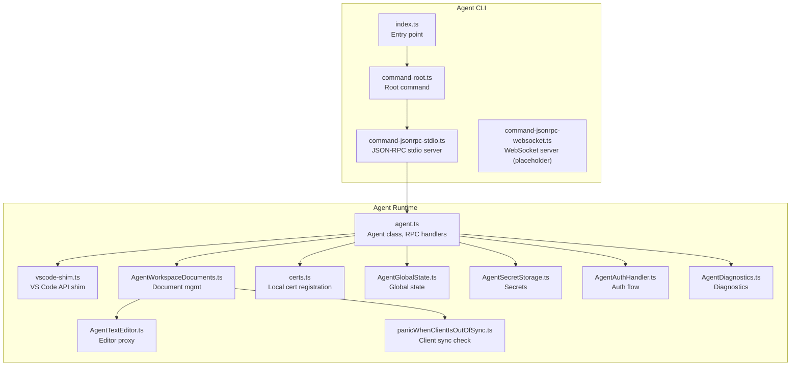

**Diagram sources**
- [index.ts:1-34](file://agent/src/index.ts#L1-L34)
- [command-root.ts:12-23](file://agent/src/cli/command-root.ts#L12-L23)
- [command-jsonrpc-stdio.ts:115-208](file://agent/src/cli/command-jsonrpc-stdio.ts#L115-L208)
- [agent.ts:295-514](file://agent/src/agent.ts#L295-L514)
- [vscode-shim.ts:494-500](file://agent/src/vscode-shim.ts#L494-L500)
- [AgentWorkspaceDocuments.ts:29-118](file://agent/src/AgentWorkspaceDocuments.ts#L29-L118)
- [AgentTextEditor.ts:7-133](file://agent/src/AgentTextEditor.ts#L7-L133)
- [panicWhenClientIsOutOfSync.ts:17-88](file://agent/src/panicWhenClientIsOutOfSync.ts#L17-L88)
- [certs.ts:13-29](file://agent/src/certs.ts#L13-L29)
- [AgentGlobalState.ts:12-86](file://agent/src/global-state/AgentGlobalState.ts#L12-L86)
- [AgentSecretStorage.ts:5-60](file://agent/src/AgentSecretStorage.ts#L5-L60)
- [AgentAuthHandler.ts:17-147](file://agent/src/AgentAuthHandler.ts#L17-L147)
- [AgentDiagnostics.ts:4-15](file://agent/src/AgentDiagnostics.ts#L4-L15)

**Section sources**
- [index.ts:1-34](file://agent/src/index.ts#L1-L34)
- [command-root.ts:12-23](file://agent/src/cli/command-root.ts#L12-L23)
- [command-jsonrpc-stdio.ts:115-208](file://agent/src/cli/command-jsonrpc-stdio.ts#L115-L208)

## Core Components
- Entry point and CLI routing: Initializes logging redirection, sets up uncaught exception handling, registers local certificates, and parses CLI commands.
- JSON-RPC stdio server: Creates a message connection over stdin/stdout, optionally wraps network traffic with Polly for recording/replay, and spawns the Agent.
- Agent class: Implements JSON-RPC handlers for initialization, document lifecycle, configuration changes, diagnostics, testing utilities, and shutdown.
- VS Code shim: Provides a minimal API surface to host extension logic without importing the heavy vscode module.
- Document and editor subsystems: Manage document state, incremental/full sync, selection/visible range, and client synchronization checks.
- Secrets and global state: Provide secret storage abstractions and persistent global state for the agent.
- Certificate registration: Adds platform-specific root certificates to the global HTTPS agent.
- Authentication handler: Manages local HTTP server for token callbacks and redirects users to the login page.
- Diagnostics: Publishes and retrieves diagnostics per URI.

**Section sources**
- [index.ts:6-34](file://agent/src/index.ts#L6-L34)
- [command-jsonrpc-stdio.ts:115-208](file://agent/src/cli/command-jsonrpc-stdio.ts#L115-L208)
- [agent.ts:295-514](file://agent/src/agent.ts#L295-L514)
- [vscode-shim.ts:130-143](file://agent/src/vscode-shim.ts#L130-L143)
- [AgentWorkspaceDocuments.ts:29-118](file://agent/src/AgentWorkspaceDocuments.ts#L29-L118)
- [AgentTextEditor.ts:7-133](file://agent/src/AgentTextEditor.ts#L7-L133)
- [AgentSecretStorage.ts:5-60](file://agent/src/AgentSecretStorage.ts#L5-L60)
- [AgentGlobalState.ts:12-86](file://agent/src/global-state/AgentGlobalState.ts#L12-L86)
- [certs.ts:13-29](file://agent/src/certs.ts#L13-L29)
- [AgentAuthHandler.ts:17-147](file://agent/src/AgentAuthHandler.ts#L17-L147)
- [AgentDiagnostics.ts:4-15](file://agent/src/AgentDiagnostics.ts#L4-L15)

## Architecture Overview
The agent process is a long-running JSON-RPC server over stdio. It initializes the extension runtime, registers providers, and forwards notifications/requests to the embedded extension logic. Optional Polly recording captures network traffic for deterministic testing. The process exits when stdin/stdout close (unless in debug mode), and supports explicit shutdown via JSON-RPC.

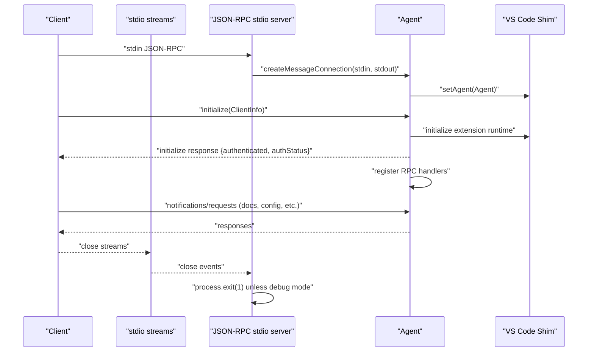

**Diagram sources**
- [command-jsonrpc-stdio.ts:181-208](file://agent/src/cli/command-jsonrpc-stdio.ts#L181-L208)
- [agent.ts:381-499](file://agent/src/agent.ts#L381-L499)
- [vscode-shim.ts:494-497](file://agent/src/vscode-shim.ts#L494-L497)

## Detailed Component Analysis

### Startup Sequence and Initialization
- Entry point:
  - Redirects console.log to console.error to avoid breaking JSON-RPC stdio.
  - Registers platform-specific root certificates globally.
  - Parses CLI commands and dispatches to subcommands.
- Root command:
  - Declares subcommands including API subcommands for JSON-RPC servers.
- JSON-RPC stdio server:
  - Supports Polly recording/replay configuration.
  - Optionally starts a TCP debug server for remote debugging.
  - Creates a message connection and constructs the Agent with the extension activation function.
  - Exits the process when stdin/stdout close (except in debug mode).
- Agent initialization:
  - Registers folding range provider and global state.
  - Configures webview mode and native webview handlers.
  - Initializes the embedded extension runtime and authentication handler if enabled.
  - Returns authentication status to the client.

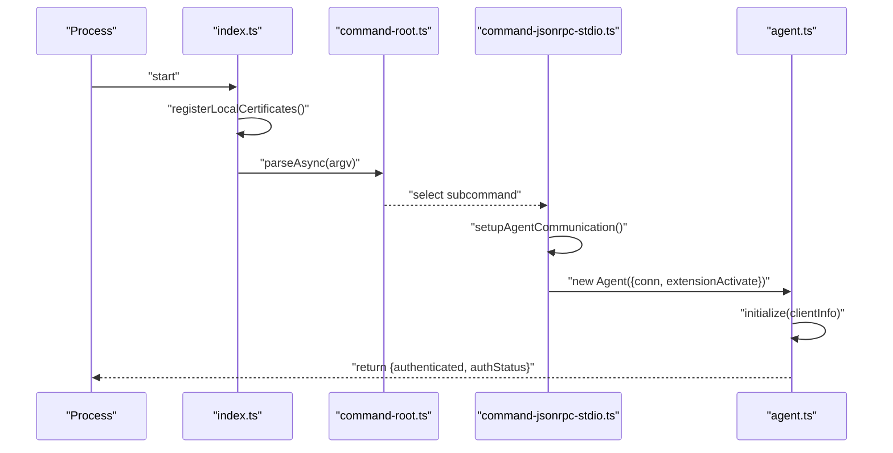

**Diagram sources**
- [index.ts:26-34](file://agent/src/index.ts#L26-L34)
- [command-root.ts:12-23](file://agent/src/cli/command-root.ts#L12-L23)
- [command-jsonrpc-stdio.ts:115-208](file://agent/src/cli/command-jsonrpc-stdio.ts#L115-L208)
- [agent.ts:381-499](file://agent/src/agent.ts#L381-L499)

**Section sources**
- [index.ts:6-34](file://agent/src/index.ts#L6-L34)
- [command-root.ts:12-23](file://agent/src/cli/command-root.ts#L12-L23)
- [command-jsonrpc-stdio.ts:115-208](file://agent/src/cli/command-jsonrpc-stdio.ts#L115-L208)
- [agent.ts:381-499](file://agent/src/agent.ts#L381-L499)

### Certificate Registration
- Registers macOS, Windows, and Linux root certificates onto the global HTTPS agent to ensure outbound HTTPS requests trust platform roots.
- On Linux, reads CA bundles from common locations and deduplicates entries before updating the global agent’s CA list.

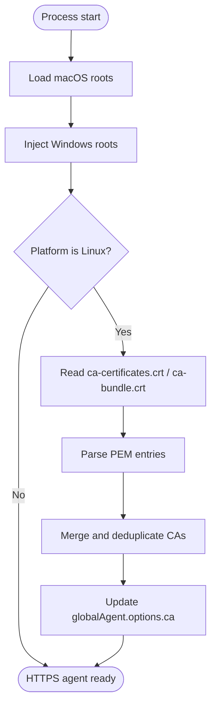

**Diagram sources**
- [certs.ts:13-72](file://agent/src/certs.ts#L13-L72)

**Section sources**
- [certs.ts:13-72](file://agent/src/certs.ts#L13-L72)

### Process Supervision and Health Monitoring
- Stdio close handling:
  - The stdio server attaches listeners to stdin/stdout close events and exits the process to prevent zombie processes.
- Debug server mode:
  - When enabled, a TCP server listens on a fixed port and proxies debug sessions; the process does not exit on stream close in this mode.
- Shutdown:
  - The Agent registers a shutdown handler that disconnects Polly and returns a response to the client.
  - An exit notification triggers immediate process exit.

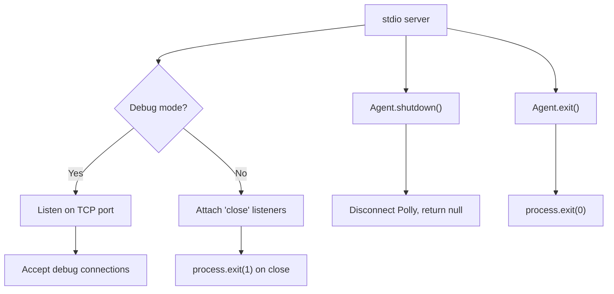

**Diagram sources**
- [command-jsonrpc-stdio.ts:156-208](file://agent/src/cli/command-jsonrpc-stdio.ts#L156-L208)
- [agent.ts:503-514](file://agent/src/agent.ts#L503-L514)

**Section sources**
- [command-jsonrpc-stdio.ts:156-208](file://agent/src/cli/command-jsonrpc-stdio.ts#L156-L208)
- [agent.ts:503-514](file://agent/src/agent.ts#L503-L514)

### Client Synchronization Checks
- During document updates, the agent compares the client-provided “source of truth” document against the server-side state.
- If content or selection mismatches are detected, the agent can panic and exit the process or invoke a custom panic function for testing scenarios.
- This mechanism helps catch and diagnose synchronization bugs early.

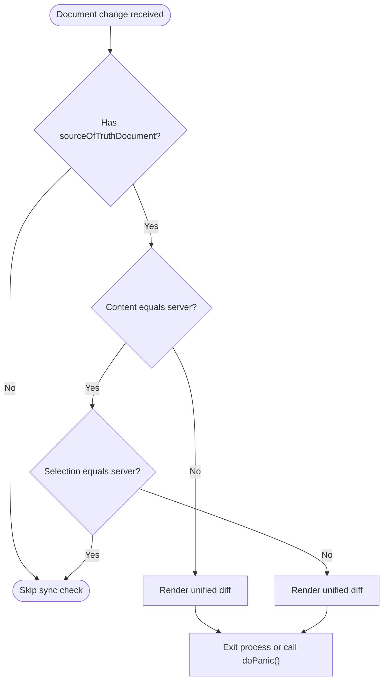

**Diagram sources**
- [panicWhenClientIsOutOfSync.ts:17-88](file://agent/src/panicWhenClientIsOutOfSync.ts#L17-L88)
- [AgentWorkspaceDocuments.ts:113-118](file://agent/src/AgentWorkspaceDocuments.ts#L113-L118)

**Section sources**
- [panicWhenClientIsOutOfSync.ts:17-88](file://agent/src/panicWhenClientIsOutOfSync.ts#L17-L88)
- [AgentWorkspaceDocuments.ts:113-118](file://agent/src/AgentWorkspaceDocuments.ts#L113-L118)

### Document Lifecycle and Editing
- Document management:
  - Maintains a map of AgentTextDocument and AgentTextEditor instances keyed by URI string.
  - Applies incremental changes or recalculates diffs for full content updates.
  - Emits VS Code events for visible editors and workspace folders.
- Editor proxy:
  - Mirrors selection, visible ranges, and supports asynchronous editing requests to the client.
- Client sync:
  - Validates content and selection against client-provided truth and panics on mismatch.

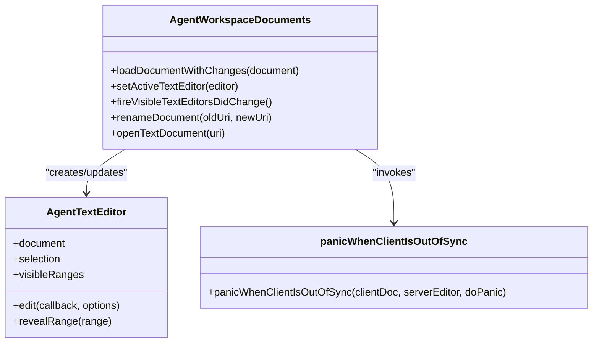

**Diagram sources**
- [AgentWorkspaceDocuments.ts:29-262](file://agent/src/AgentWorkspaceDocuments.ts#L29-L262)
- [AgentTextEditor.ts:7-133](file://agent/src/AgentTextEditor.ts#L7-L133)
- [panicWhenClientIsOutOfSync.ts:17-88](file://agent/src/panicWhenClientIsOutOfSync.ts#L17-L88)

**Section sources**
- [AgentWorkspaceDocuments.ts:29-262](file://agent/src/AgentWorkspaceDocuments.ts#L29-L262)
- [AgentTextEditor.ts:7-133](file://agent/src/AgentTextEditor.ts#L7-L133)

### Authentication Flow
- The Agent can create a local HTTP server to receive token callbacks from the browser-based login flow.
- Validates and normalizes the callback URI, starts the server bound to localhost, and opens the login page with updated parameters.
- After receiving a token, notifies registered handlers and closes the server.

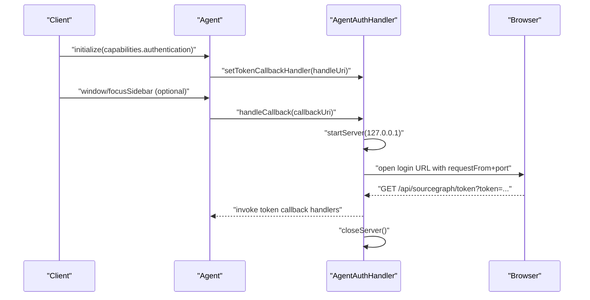

**Diagram sources**
- [agent.ts:431-433](file://agent/src/agent.ts#L431-L433)
- [AgentAuthHandler.ts:26-99](file://agent/src/AgentAuthHandler.ts#L26-L99)
- [AgentAuthHandler.ts:118-142](file://agent/src/AgentAuthHandler.ts#L118-L142)

**Section sources**
- [agent.ts:431-433](file://agent/src/agent.ts#L431-L433)
- [AgentAuthHandler.ts:26-99](file://agent/src/AgentAuthHandler.ts#L26-L99)
- [AgentAuthHandler.ts:118-142](file://agent/src/AgentAuthHandler.ts#L118-L142)

### Secrets and Global State
- Secret storage:
  - Stateless in-memory storage seeded from configuration.
  - Client-managed storage that proxies requests to the client for get/store/delete.
- Global state:
  - In-memory or persisted LocalStorage-backed Memento with migration support.
  - Provides default keys and merges client/server perspectives.

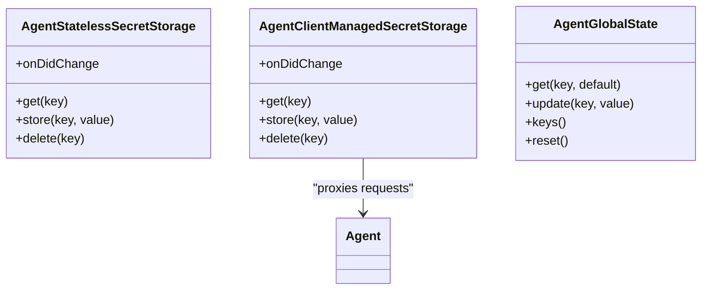

**Diagram sources**
- [AgentSecretStorage.ts:5-60](file://agent/src/AgentSecretStorage.ts#L5-L60)
- [AgentGlobalState.ts:12-150](file://agent/src/global-state/AgentGlobalState.ts#L12-L150)

**Section sources**
- [AgentSecretStorage.ts:5-60](file://agent/src/AgentSecretStorage.ts#L5-L60)
- [AgentGlobalState.ts:12-150](file://agent/src/global-state/AgentGlobalState.ts#L12-L150)

### Logging, Debugging, and Diagnostics
- Logging:
  - The VS Code shim wraps output channels and forwards log messages to the client via JSON-RPC notifications.
  - Debug messages are emitted on the debug channel with appropriate levels.
- Diagnostics:
  - The agent publishes diagnostics per URI and exposes a simple accessor to retrieve them.
- Testing utilities:
  - Exposes endpoints for awaiting pending promises, memory usage, heap dumps, and network request introspection.

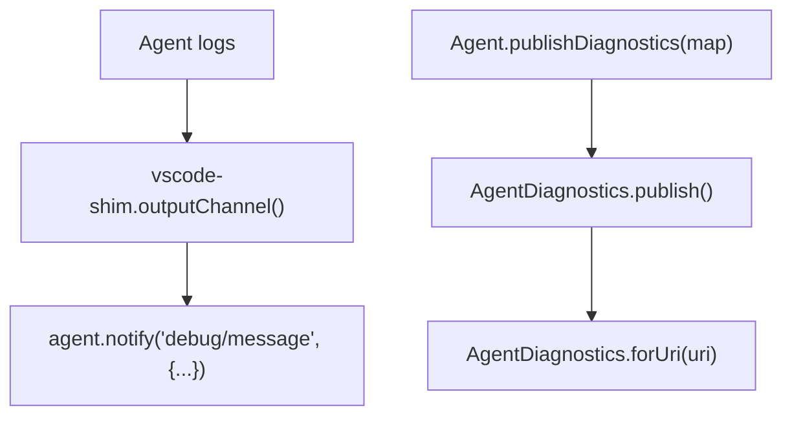

**Diagram sources**
- [vscode-shim.ts:570-616](file://agent/src/vscode-shim.ts#L570-L616)
- [AgentDiagnostics.ts:4-15](file://agent/src/AgentDiagnostics.ts#L4-L15)
- [agent.ts:707-734](file://agent/src/agent.ts#L707-L734)

**Section sources**
- [vscode-shim.ts:570-616](file://agent/src/vscode-shim.ts#L570-L616)
- [AgentDiagnostics.ts:4-15](file://agent/src/AgentDiagnostics.ts#L4-L15)
- [agent.ts:707-734](file://agent/src/agent.ts#L707-L734)

### Security Considerations
- Certificate handling:
  - Adds platform-specific root certificates to the global HTTPS agent to improve trust on macOS, Windows, and Linux.
- Process isolation and sandboxing:
  - The agent process is a long-running JSON-RPC server. While the codebase does not implement OS-level sandboxing, it restricts the authentication server to localhost and validates callback URLs.
- Client capability gating:
  - Certain features (webviews, code actions, code lenses, secrets) are conditionally enabled based on client capabilities.

**Section sources**
- [certs.ts:13-72](file://agent/src/certs.ts#L13-L72)
- [AgentAuthHandler.ts:38-99](file://agent/src/AgentAuthHandler.ts#L38-L99)
- [agent.ts:431-433](file://agent/src/agent.ts#L431-L433)

## Dependency Analysis
The agent’s runtime depends on the CLI wiring, the Agent class, the VS Code shim, and supporting subsystems for documents, secrets, diagnostics, and authentication.

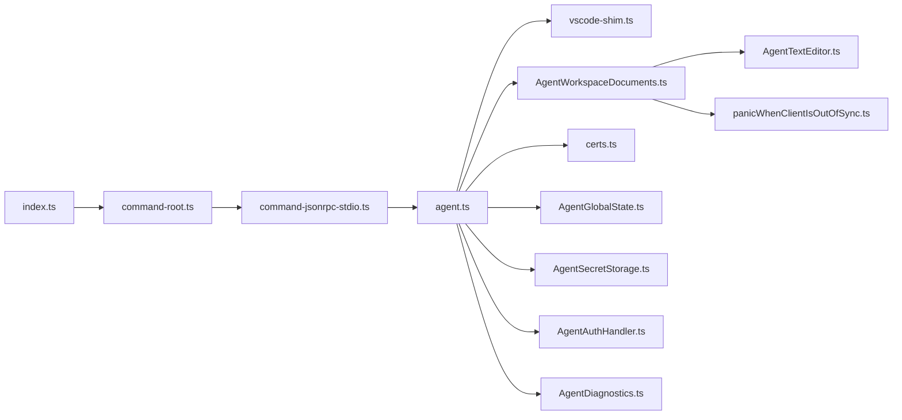

**Diagram sources**
- [index.ts:1-34](file://agent/src/index.ts#L1-L34)
- [command-root.ts:12-23](file://agent/src/cli/command-root.ts#L12-L23)
- [command-jsonrpc-stdio.ts:115-208](file://agent/src/cli/command-jsonrpc-stdio.ts#L115-L208)
- [agent.ts:295-514](file://agent/src/agent.ts#L295-L514)
- [vscode-shim.ts:494-500](file://agent/src/vscode-shim.ts#L494-L500)
- [AgentWorkspaceDocuments.ts:29-118](file://agent/src/AgentWorkspaceDocuments.ts#L29-L118)
- [AgentTextEditor.ts:7-133](file://agent/src/AgentTextEditor.ts#L7-L133)
- [panicWhenClientIsOutOfSync.ts:17-88](file://agent/src/panicWhenClientIsOutOfSync.ts#L17-L88)
- [certs.ts:13-29](file://agent/src/certs.ts#L13-L29)
- [AgentGlobalState.ts:12-86](file://agent/src/global-state/AgentGlobalState.ts#L12-L86)
- [AgentSecretStorage.ts:5-60](file://agent/src/AgentSecretStorage.ts#L5-L60)
- [AgentAuthHandler.ts:17-147](file://agent/src/AgentAuthHandler.ts#L17-L147)
- [AgentDiagnostics.ts:4-15](file://agent/src/AgentDiagnostics.ts#L4-L15)

**Section sources**
- [index.ts:1-34](file://agent/src/index.ts#L1-L34)
- [command-root.ts:12-23](file://agent/src/cli/command-root.ts#L12-L23)
- [command-jsonrpc-stdio.ts:115-208](file://agent/src/cli/command-jsonrpc-stdio.ts#L115-L208)
- [agent.ts:295-514](file://agent/src/agent.ts#L295-L514)

## Performance Considerations
- Memory usage:
  - The agent exposes a testing endpoint to trigger garbage collection and return memory usage metrics when running with the appropriate Node flags.
- Network recording:
  - Polly can capture and replay network traffic to reduce flakiness in tests and speed up CI runs.
- Event-driven updates:
  - The VS Code shim emits events for document changes and workspace updates to minimize polling and keep the agent responsive.

**Section sources**
- [agent.ts:758-764](file://agent/src/agent.ts#L758-L764)
- [command-jsonrpc-stdio.ts:116-154](file://agent/src/cli/command-jsonrpc-stdio.ts#L116-L154)
- [vscode-shim.ts:162-168](file://agent/src/vscode-shim.ts#L162-L168)

## Troubleshooting Guide
- Uncaught exceptions:
  - The process registers an uncaughtException handler that logs the error and continues execution to avoid abrupt termination.
- Stdio close and zombie processes:
  - The stdio server exits the process on stream close to prevent zombies; in debug mode, the process remains alive.
- Client sync panics:
  - If the client document content or selection drifts, the agent panics and exits. Use the testing sync checker to diagnose differences.
- Authentication issues:
  - Ensure the local auth server is reachable on localhost and that the callback URL is valid. The handler validates and normalizes the URL and binds to 127.0.0.1.
- Logging:
  - Use the debug channel to inspect agent logs and verify that messages are forwarded to the client.

**Section sources**
- [index.ts:16-24](file://agent/src/index.ts#L16-L24)
- [command-jsonrpc-stdio.ts:195-204](file://agent/src/cli/command-jsonrpc-stdio.ts#L195-L204)
- [panicWhenClientIsOutOfSync.ts:90-99](file://agent/src/panicWhenClientIsOutOfSync.ts#L90-L99)
- [AgentAuthHandler.ts:38-99](file://agent/src/AgentAuthHandler.ts#L38-L99)
- [vscode-shim.ts:570-616](file://agent/src/vscode-shim.ts#L570-L616)

## Conclusion
The agent’s lifecycle is centered on a robust JSON-RPC over stdio server, a carefully orchestrated initialization routine, and strong safeguards for process health and client synchronization. It integrates secure certificate handling, conditional feature gating, and comprehensive logging and diagnostics. Operational stability is reinforced by explicit shutdown handling, structured error reporting, and testing utilities for memory and network behavior.