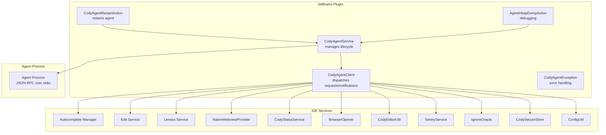
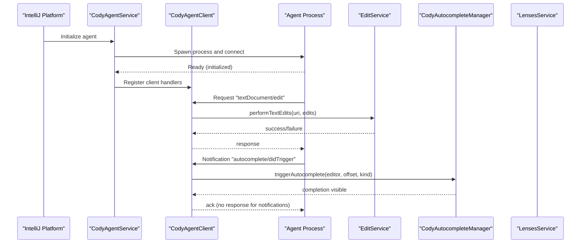
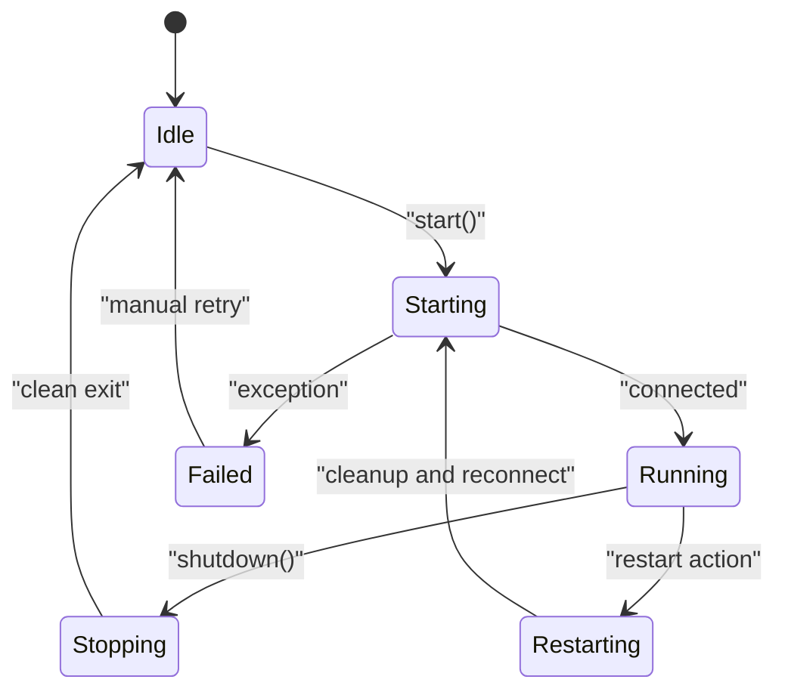
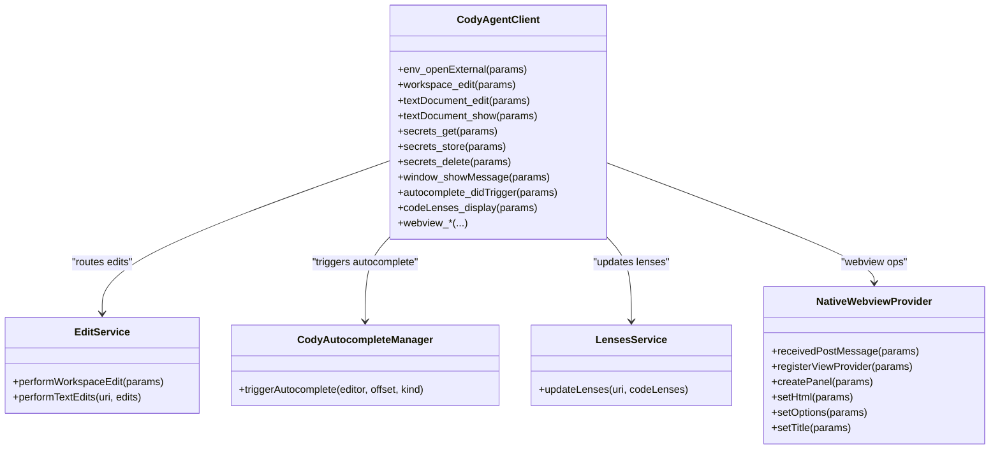
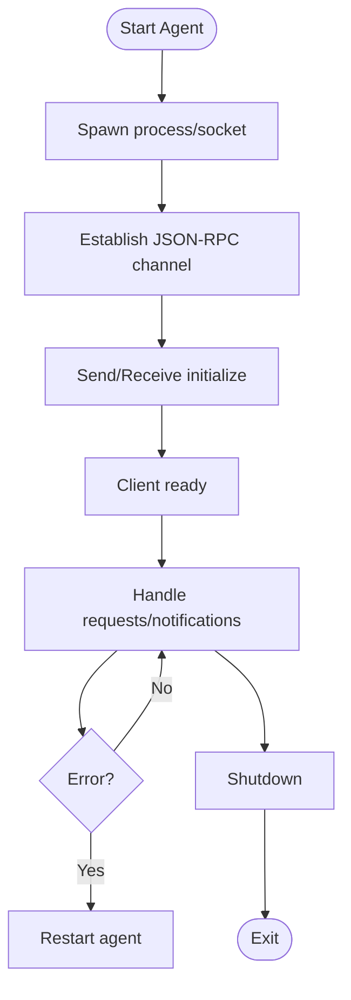
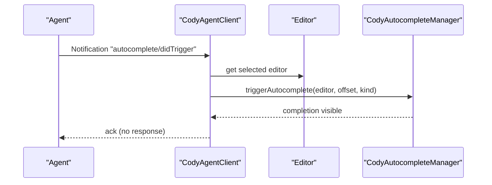
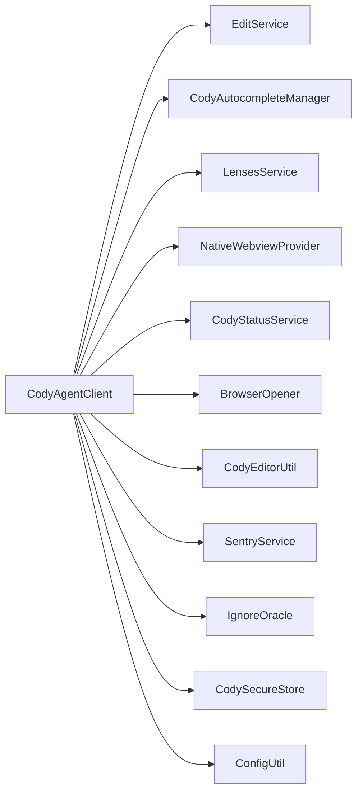

# Agent Integration

<cite>
**Referenced Files in This Document**
- [agent/README.md](file://agent/README.md)
- [agent/protocol.md](file://agent/protocol.md)
- [jetbrains/src/main/kotlin/com/sourcegraph/cody/agent/CodyAgent.kt](file://jetbrains/src/main/kotlin/com/sourcegraph/cody/agent/CodyAgent.kt)
- [jetbrains/src/main/kotlin/com/sourcegraph/cody/agent/CodyAgentClient.kt](file://jetbrains/src/main/kotlin/com/sourcegraph/cody/agent/CodyAgentClient.kt)
- [jetbrains/src/main/kotlin/com/sourcegraph/cody/agent/CodyAgentService.kt](file://jetbrains/src/main/kotlin/com/sourcegraph/cody/agent/CodyAgentService.kt)
- [jetbrains/src/main/kotlin/com/sourcegraph/cody/agent/CodyAgentException.kt](file://jetbrains/src/main/kotlin/com/sourcegraph/cody/agent/CodyAgentException.kt)
- [jetbrains/src/main/kotlin/com/sourcegraph/cody/agent/action/CodyAgentRestartAction.kt](file://jetbrains/src/main/kotlin/com/sourcegraph/cody/agent/action/CodyAgentRestartAction.kt)
- [jetbrains/src/main/kotlin/com/sourcegraph/cody/agent/debugging/AgentHeapDumpAction.kt](file://jetbrains/src/main/kotlin/com/sourcegraph/cody/agent/debugging/AgentHeapDumpAction.kt)
- [jetbrains/src/main/kotlin/com/sourcegraph/cody/vscode/InlineCompletionTriggerKind.kt](file://jetbrains/src/main/kotlin/com/sourcegraph/cody/vscode/InlineCompletionTriggerKind.kt)
- [jetbrains/src/main/kotlin/com/sourcegraph/cody/autocompletion/CodyAutocompleteManager.kt](file://jetbrains/src/main/kotlin/com/sourcegraph/cody/autocompletion/CodyAutocompleteManager.kt)
- [jetbrains/src/main/kotlin/com/sourcegraph/cody/edit/EditService.kt](file://jetbrains/src/main/kotlin/com/sourcegraph/cody/edit/EditService.kt)
- [jetbrains/src/main/kotlin/com/sourcegraph/cody/lenses/LensesService.kt](file://jetbrains/src/main/kotlin/com/sourcegraph/cody/lenses/LensesService.kt)
- [jetbrains/src/main/kotlin/com/sourcegraph/cody/statusbar/CodyStatusService.kt](file://jetbrains/src/main/kotlin/com/sourcegraph/cody/statusbar/CodyStatusService.kt)
- [jetbrains/src/main/kotlin/com/sourcegraph/cody/ui/web/NativeWebviewProvider.kt](file://jetbrains/src/main/kotlin/com/sourcegraph/cody/ui/web/NativeWebviewProvider.kt)
- [jetbrains/src/main/kotlin/com/sourcegraph/cody/utils/CodyEditorUtil.kt](file://jetbrains/src/main/kotlin/com/sourcegraph/cody/utils/CodyEditorUtil.kt)
- [jetbrains/src/main/kotlin/com/sourcegraph/cody/common/BrowserOpener.kt](file://jetbrains/src/main/kotlin/com/sourcegraph/cody/common/BrowserOpener.kt)
- [jetbrains/src/main/kotlin/com/sourcegraph/cody/config/ConfigUtil.kt](file://jetbrains/src/main/kotlin/com/sourcegraph/cody/config/ConfigUtil.kt)
- [jetbrains/src/main/kotlin/com/sourcegraph/cody/error/SentryService.kt](file://jetbrains/src/main/kotlin/com/sourcegraph/cody/error/SentryService.kt)
- [jetbrains/src/main/kotlin/com/sourcegraph/cody/ignore/IgnoreOracle.kt](file://jetbrains/src/main/kotlin/com/sourcegraph/cody/ignore/IgnoreOracle.kt)
- [jetbrains/src/main/kotlin/com/sourcegraph/cody/secrets/CodySecureStore.kt](file://jetbrains/src/main/kotlin/com/sourcegraph/cody/secrets/CodySecureStore.kt)
- [jetbrains/src/main/kotlin/com/sourcegraph/cody/vscode/ProtocolAuthStatus.kt](file://jetbrains/src/main/kotlin/com/sourcegraph/cody/vscode/ProtocolAuthStatus.kt)
- [jetbrains/src/main/kotlin/com/sourcegraph/cody/vscode/SourcegraphServerPath.kt](file://jetbrains/src/main/kotlin/com/sourcegraph/cody/vscode/SourcegraphServerPath.kt)
</cite>

## Table of Contents
1. [Introduction](#introduction)
2. [Project Structure](#project-structure)
3. [Core Components](#core-components)
4. [Architecture Overview](#architecture-overview)
5. [Detailed Component Analysis](#detailed-component-analysis)
6. [Dependency Analysis](#dependency-analysis)
7. [Performance Considerations](#performance-considerations)
8. [Troubleshooting Guide](#troubleshooting-guide)
9. [Conclusion](#conclusion)

## Introduction
This document explains the JetBrains plugin’s agent integration system. It covers the agent lifecycle, connection management, JSON-RPC protocol handling, action dispatching, and message routing between the IDE and the agent process. It also documents startup sequences, health monitoring, recovery mechanisms, and practical examples of agent actions and response processing.

## Project Structure
The JetBrains plugin integrates with the Cody Agent via a generated Kotlin client interface and a service that manages the agent process and JSON-RPC transport. The agent itself defines the protocol and is used by non-ECMAScript clients such as JetBrains and Neovim.

**Diagram sources**
- [jetbrains/src/main/kotlin/com/sourcegraph/cody/agent/CodyAgent.kt](file://jetbrains/src/main/kotlin/com/sourcegraph/cody/agent/CodyAgent.kt)
- [jetbrains/src/main/kotlin/com/sourcegraph/cody/agent/CodyAgentClient.kt](file://jetbrains/src/main/kotlin/com/sourcegraph/cody/agent/CodyAgentClient.kt)
- [jetbrains/src/main/kotlin/com/sourcegraph/cody/agent/CodyAgentService.kt](file://jetbrains/src/main/kotlin/com/sourcegraph/cody/agent/CodyAgentService.kt)
- [jetbrains/src/main/kotlin/com/sourcegraph/cody/agent/CodyAgentException.kt](file://jetbrains/src/main/kotlin/com/sourcegraph/cody/agent/CodyAgentException.kt)
- [jetbrains/src/main/kotlin/com/sourcegraph/cody/agent/action/CodyAgentRestartAction.kt](file://jetbrains/src/main/kotlin/com/sourcegraph/cody/agent/action/CodyAgentRestartAction.kt)
- [jetbrains/src/main/kotlin/com/sourcegraph/cody/agent/debugging/AgentHeapDumpAction.kt](file://jetbrains/src/main/kotlin/com/sourcegraph/cody/agent/debugging/AgentHeapDumpAction.kt)
- [jetbrains/src/main/kotlin/com/sourcegraph/cody/autocompletion/CodyAutocompleteManager.kt](file://jetbrains/src/main/kotlin/com/sourcegraph/cody/autocompletion/CodyAutocompleteManager.kt)
- [jetbrains/src/main/kotlin/com/sourcegraph/cody/edit/EditService.kt](file://jetbrains/src/main/kotlin/com/sourcegraph/cody/edit/EditService.kt)
- [jetbrains/src/main/kotlin/com/sourcegraph/cody/lenses/LensesService.kt](file://jetbrains/src/main/kotlin/com/sourcegraph/cody/lenses/LensesService.kt)
- [jetbrains/src/main/kotlin/com/sourcegraph/cody/ui/web/NativeWebviewProvider.kt](file://jetbrains/src/main/kotlin/com/sourcegraph/cody/ui/web/NativeWebviewProvider.kt)
- [jetbrains/src/main/kotlin/com/sourcegraph/cody/statusbar/CodyStatusService.kt](file://jetbrains/src/main/kotlin/com/sourcegraph/cody/statusbar/CodyStatusService.kt)
- [jetbrains/src/main/kotlin/com/sourcegraph/cody/common/BrowserOpener.kt](file://jetbrains/src/main/kotlin/com/sourcegraph/cody/common/BrowserOpener.kt)
- [jetbrains/src/main/kotlin/com/sourcegraph/cody/utils/CodyEditorUtil.kt](file://jetbrains/src/main/kotlin/com/sourcegraph/cody/utils/CodyEditorUtil.kt)
- [jetbrains/src/main/kotlin/com/sourcegraph/cody/error/SentryService.kt](file://jetbrains/src/main/kotlin/com/sourcegraph/cody/error/SentryService.kt)
- [jetbrains/src/main/kotlin/com/sourcegraph/cody/ignore/IgnoreOracle.kt](file://jetbrains/src/main/kotlin/com/sourcegraph/cody/ignore/IgnoreOracle.kt)
- [jetbrains/src/main/kotlin/com/sourcegraph/cody/secrets/CodySecureStore.kt](file://jetbrains/src/main/kotlin/com/sourcegraph/cody/secrets/CodySecureStore.kt)
- [jetbrains/src/main/kotlin/com/sourcegraph/cody/config/ConfigUtil.kt](file://jetbrains/src/main/kotlin/com/sourcegraph/cody/config/ConfigUtil.kt)

**Section sources**
- [agent/README.md:1-180](file://agent/README.md#L1-L180)
- [agent/protocol.md:1-482](file://agent/protocol.md#L1-L482)

## Core Components
- Agent client interface: The JetBrains plugin implements the generated Kotlin client interface to receive JSON-RPC requests and notifications from the agent.
- Agent service: Manages the agent process lifecycle, including starting, connecting, and restarting the agent.
- Agent exceptions: Centralized exception type for agent-related failures.
- Restart and debugging actions: UI actions to restart the agent and trigger diagnostics.

Key responsibilities:
- Dispatch JSON-RPC requests (e.g., editing, messaging, secrets) to IDE services.
- Handle notifications (e.g., autocomplete triggers, progress updates, webview messages).
- Manage agent process lifecycle and recovery.

**Section sources**
- [jetbrains/src/main/kotlin/com/sourcegraph/cody/agent/CodyAgentClient.kt:46-345](file://jetbrains/src/main/kotlin/com/sourcegraph/cody/agent/CodyAgentClient.kt#L46-L345)
- [jetbrains/src/main/kotlin/com/sourcegraph/cody/agent/CodyAgentService.kt:30](file://jetbrains/src/main/kotlin/com/sourcegraph/cody/agent/CodyAgentService.kt#L30)
- [jetbrains/src/main/kotlin/com/sourcegraph/cody/agent/CodyAgentException.kt:2](file://jetbrains/src/main/kotlin/com/sourcegraph/cody/agent/CodyAgentException.kt#L2)
- [jetbrains/src/main/kotlin/com/sourcegraph/cody/agent/action/CodyAgentRestartAction.kt:8](file://jetbrains/src/main/kotlin/com/sourcegraph/cody/agent/action/CodyAgentRestartAction.kt#L8)
- [jetbrains/src/main/kotlin/com/sourcegraph/cody/agent/debugging/AgentHeapDumpAction.kt:6](file://jetbrains/src/main/kotlin/com/sourcegraph/cody/agent/debugging/AgentHeapDumpAction.kt#L6)

## Architecture Overview
The JetBrains plugin communicates with the agent over JSON-RPC via stdio. The agent defines the protocol and the plugin implements the client side. The service manages the process and routes JSON-RPC messages to appropriate IDE services.

**Diagram sources**
- [jetbrains/src/main/kotlin/com/sourcegraph/cody/agent/CodyAgentService.kt:30](file://jetbrains/src/main/kotlin/com/sourcegraph/cody/agent/CodyAgentService.kt#L30)
- [jetbrains/src/main/kotlin/com/sourcegraph/cody/agent/CodyAgentClient.kt:89-98](file://jetbrains/src/main/kotlin/com/sourcegraph/cody/agent/CodyAgentClient.kt#L89-L98)
- [jetbrains/src/main/kotlin/com/sourcegraph/cody/agent/CodyAgentClient.kt:247-255](file://jetbrains/src/main/kotlin/com/sourcegraph/cody/agent/CodyAgentClient.kt#L247-L255)
- [jetbrains/src/main/kotlin/com/sourcegraph/cody/edit/EditService.kt](file://jetbrains/src/main/kotlin/com/sourcegraph/cody/edit/EditService.kt)
- [jetbrains/src/main/kotlin/com/sourcegraph/cody/autocompletion/CodyAutocompleteManager.kt](file://jetbrains/src/main/kotlin/com/sourcegraph/cody/autocompletion/CodyAutocompleteManager.kt)

## Detailed Component Analysis

### Agent Lifecycle and Connection Management
- Process vs socket connections: The agent can connect via stdio (process) or socket depending on configuration.
- Lifecycle phases: Start agent process, establish JSON-RPC channel, initialize protocol handshake, route messages, and handle shutdown.
- Recovery: Restart action and exception handling to recover from transient failures.

**Diagram sources**
- [jetbrains/src/main/kotlin/com/sourcegraph/cody/agent/CodyAgent.kt:62-83](file://jetbrains/src/main/kotlin/com/sourcegraph/cody/agent/CodyAgent.kt#L62-L83)
- [jetbrains/src/main/kotlin/com/sourcegraph/cody/agent/CodyAgentService.kt:30](file://jetbrains/src/main/kotlin/com/sourcegraph/cody/agent/CodyAgentService.kt#L30)
- [jetbrains/src/main/kotlin/com/sourcegraph/cody/agent/action/CodyAgentRestartAction.kt:8](file://jetbrains/src/main/kotlin/com/sourcegraph/cody/agent/action/CodyAgentRestartAction.kt#L8)

**Section sources**
- [jetbrains/src/main/kotlin/com/sourcegraph/cody/agent/CodyAgent.kt:34-83](file://jetbrains/src/main/kotlin/com/sourcegraph/cody/agent/CodyAgent.kt#L34-L83)
- [jetbrains/src/main/kotlin/com/sourcegraph/cody/agent/CodyAgentService.kt:30](file://jetbrains/src/main/kotlin/com/sourcegraph/cody/agent/CodyAgentService.kt#L30)
- [jetbrains/src/main/kotlin/com/sourcegraph/cody/agent/CodyAgentException.kt:2](file://jetbrains/src/main/kotlin/com/sourcegraph/cody/agent/CodyAgentException.kt#L2)

### Protocol Handling and Message Routing
- Requests: The client implements request handlers for operations like editing text documents, performing workspace edits, showing messages, opening external URIs, and managing secrets.
- Notifications: Handlers for autocomplete triggers, code lens display, progress updates, and webview messages.
- Webviews: Forwarded to the native webview provider for rendering and interaction.

**Diagram sources**
- [jetbrains/src/main/kotlin/com/sourcegraph/cody/agent/CodyAgentClient.kt:61-171](file://jetbrains/src/main/kotlin/com/sourcegraph/cody/agent/CodyAgentClient.kt#L61-L171)
- [jetbrains/src/main/kotlin/com/sourcegraph/cody/agent/CodyAgentClient.kt:243-343](file://jetbrains/src/main/kotlin/com/sourcegraph/cody/agent/CodyAgentClient.kt#L243-L343)
- [jetbrains/src/main/kotlin/com/sourcegraph/cody/edit/EditService.kt](file://jetbrains/src/main/kotlin/com/sourcegraph/cody/edit/EditService.kt)
- [jetbrains/src/main/kotlin/com/sourcegraph/cody/autocompletion/CodyAutocompleteManager.kt](file://jetbrains/src/main/kotlin/com/sourcegraph/cody/autocompletion/CodyAutocompleteManager.kt)
- [jetbrains/src/main/kotlin/com/sourcegraph/cody/lenses/LensesService.kt](file://jetbrains/src/main/kotlin/com/sourcegraph/cody/lenses/LensesService.kt)
- [jetbrains/src/main/kotlin/com/sourcegraph/cody/ui/web/NativeWebviewProvider.kt](file://jetbrains/src/main/kotlin/com/sourcegraph/cody/ui/web/NativeWebviewProvider.kt)

**Section sources**
- [jetbrains/src/main/kotlin/com/sourcegraph/cody/agent/CodyAgentClient.kt:46-345](file://jetbrains/src/main/kotlin/com/sourcegraph/cody/agent/CodyAgentClient.kt#L46-L345)

### Agent Startup Sequence and Health Monitoring
- Startup: The service starts the agent process and waits for initialization. During initialization, the client receives configuration updates and authentication status changes.
- Health monitoring: Status service resets application state upon auth updates; progress notifications are placeholders for future UI updates.
- Recovery: Restart action triggers a full lifecycle restart; heap dump action assists with diagnosing long-running issues.

**Diagram sources**
- [jetbrains/src/main/kotlin/com/sourcegraph/cody/agent/CodyAgentService.kt:30](file://jetbrains/src/main/kotlin/com/sourcegraph/cody/agent/CodyAgentService.kt#L30)
- [jetbrains/src/main/kotlin/com/sourcegraph/cody/agent/action/CodyAgentRestartAction.kt:8](file://jetbrains/src/main/kotlin/com/sourcegraph/cody/agent/action/CodyAgentRestartAction.kt#L8)
- [jetbrains/src/main/kotlin/com/sourcegraph/cody/statusbar/CodyStatusService.kt](file://jetbrains/src/main/kotlin/com/sourcegraph/cody/statusbar/CodyStatusService.kt)

**Section sources**
- [jetbrains/src/main/kotlin/com/sourcegraph/cody/agent/CodyAgentService.kt:30](file://jetbrains/src/main/kotlin/com/sourcegraph/cody/agent/CodyAgentService.kt#L30)
- [jetbrains/src/main/kotlin/com/sourcegraph/cody/statusbar/CodyStatusService.kt](file://jetbrains/src/main/kotlin/com/sourcegraph/cody/statusbar/CodyStatusService.kt)
- [jetbrains/src/main/kotlin/com/sourcegraph/cody/agent/action/CodyAgentRestartAction.kt:8](file://jetbrains/src/main/kotlin/com/sourcegraph/cody/agent/action/CodyAgentRestartAction.kt#L8)

### Examples of Agent Actions and Response Processing
- Editing a text document: The agent sends a request to edit a URI with a set of edits. The client delegates to the edit service and returns a boolean result.
- Triggering autocomplete: The agent notifies the client to trigger autocomplete; the client invokes the autocomplete manager with the current editor and caret position.
- Showing a message: The agent requests the IDE to show a message with optional items; the client displays a notification and returns the selected item.
- Webview operations: The agent requests to create or update a webview panel; the client forwards to the native webview provider.

**Diagram sources**
- [jetbrains/src/main/kotlin/com/sourcegraph/cody/agent/CodyAgentClient.kt:247-255](file://jetbrains/src/main/kotlin/com/sourcegraph/cody/agent/CodyAgentClient.kt#L247-L255)
- [jetbrains/src/main/kotlin/com/sourcegraph/cody/autocompletion/CodyAutocompleteManager.kt](file://jetbrains/src/main/kotlin/com/sourcegraph/cody/autocompletion/CodyAutocompleteManager.kt)
- [jetbrains/src/main/kotlin/com/sourcegraph/cody/vscode/InlineCompletionTriggerKind.kt](file://jetbrains/src/main/kotlin/com/sourcegraph/cody/vscode/InlineCompletionTriggerKind.kt)

**Section sources**
- [jetbrains/src/main/kotlin/com/sourcegraph/cody/agent/CodyAgentClient.kt:89-98](file://jetbrains/src/main/kotlin/com/sourcegraph/cody/agent/CodyAgentClient.kt#L89-L98)
- [jetbrains/src/main/kotlin/com/sourcegraph/cody/agent/CodyAgentClient.kt:197-237](file://jetbrains/src/main/kotlin/com/sourcegraph/cody/agent/CodyAgentClient.kt#L197-L237)
- [jetbrains/src/main/kotlin/com/sourcegraph/cody/agent/CodyAgentClient.kt:307-343](file://jetbrains/src/main/kotlin/com/sourcegraph/cody/agent/CodyAgentClient.kt#L307-L343)

## Dependency Analysis
The client depends on several IDE services to fulfill agent requests and notifications. The service orchestrates the agent lifecycle and ensures proper routing.

**Diagram sources**
- [jetbrains/src/main/kotlin/com/sourcegraph/cody/agent/CodyAgentClient.kt:46-345](file://jetbrains/src/main/kotlin/com/sourcegraph/cody/agent/CodyAgentClient.kt#L46-L345)
- [jetbrains/src/main/kotlin/com/sourcegraph/cody/edit/EditService.kt](file://jetbrains/src/main/kotlin/com/sourcegraph/cody/edit/EditService.kt)
- [jetbrains/src/main/kotlin/com/sourcegraph/cody/autocompletion/CodyAutocompleteManager.kt](file://jetbrains/src/main/kotlin/com/sourcegraph/cody/autocompletion/CodyAutocompleteManager.kt)
- [jetbrains/src/main/kotlin/com/sourcegraph/cody/lenses/LensesService.kt](file://jetbrains/src/main/kotlin/com/sourcegraph/cody/lenses/LensesService.kt)
- [jetbrains/src/main/kotlin/com/sourcegraph/cody/ui/web/NativeWebviewProvider.kt](file://jetbrains/src/main/kotlin/com/sourcegraph/cody/ui/web/NativeWebviewProvider.kt)
- [jetbrains/src/main/kotlin/com/sourcegraph/cody/statusbar/CodyStatusService.kt](file://jetbrains/src/main/kotlin/com/sourcegraph/cody/statusbar/CodyStatusService.kt)
- [jetbrains/src/main/kotlin/com/sourcegraph/cody/common/BrowserOpener.kt](file://jetbrains/src/main/kotlin/com/sourcegraph/cody/common/BrowserOpener.kt)
- [jetbrains/src/main/kotlin/com/sourcegraph/cody/utils/CodyEditorUtil.kt](file://jetbrains/src/main/kotlin/com/sourcegraph/cody/utils/CodyEditorUtil.kt)
- [jetbrains/src/main/kotlin/com/sourcegraph/cody/error/SentryService.kt](file://jetbrains/src/main/kotlin/com/sourcegraph/cody/error/SentryService.kt)
- [jetbrains/src/main/kotlin/com/sourcegraph/cody/ignore/IgnoreOracle.kt](file://jetbrains/src/main/kotlin/com/sourcegraph/cody/ignore/IgnoreOracle.kt)
- [jetbrains/src/main/kotlin/com/sourcegraph/cody/secrets/CodySecureStore.kt](file://jetbrains/src/main/kotlin/com/sourcegraph/cody/secrets/CodySecureStore.kt)
- [jetbrains/src/main/kotlin/com/sourcegraph/cody/config/ConfigUtil.kt](file://jetbrains/src/main/kotlin/com/sourcegraph/cody/config/ConfigUtil.kt)

**Section sources**
- [jetbrains/src/main/kotlin/com/sourcegraph/cody/agent/CodyAgentClient.kt:46-345](file://jetbrains/src/main/kotlin/com/sourcegraph/cody/agent/CodyAgentClient.kt#L46-L345)

## Performance Considerations
- UI thread safety: Operations that modify editors or UI are dispatched to EDT or background threads appropriately to avoid blocking the UI.
- Asynchronous responses: Requests return futures to keep the JSON-RPC channel responsive.
- Minimal allocations: Webview and editor operations are routed through dedicated services to reduce overhead.

[No sources needed since this section provides general guidance]

## Troubleshooting Guide
- Restart the agent: Use the restart action to fully tear down and relaunch the agent process.
- Enable tracing: The agent supports tracing of JSON-RPC traffic to diagnose protocol mismatches.
- Exceptions: Catch and log agent exceptions centrally to surface actionable errors.
- Debugging: Trigger a heap dump action to capture runtime state for long-lived issues.

**Section sources**
- [jetbrains/src/main/kotlin/com/sourcegraph/cody/agent/action/CodyAgentRestartAction.kt:8](file://jetbrains/src/main/kotlin/com/sourcegraph/cody/agent/action/CodyAgentRestartAction.kt#L8)
- [jetbrains/src/main/kotlin/com/sourcegraph/cody/agent/debugging/AgentHeapDumpAction.kt:6](file://jetbrains/src/main/kotlin/com/sourcegraph/cody/agent/debugging/AgentHeapDumpAction.kt#L6)
- [jetbrains/src/main/kotlin/com/sourcegraph/cody/agent/CodyAgentException.kt:2](file://jetbrains/src/main/kotlin/com/sourcegraph/cody/agent/CodyAgentException.kt#L2)
- [agent/README.md:62-78](file://agent/README.md#L62-L78)

## Conclusion
The JetBrains plugin’s agent integration provides a robust JSON-RPC bridge between the IDE and the agent process. The client handles protocol requests and notifications, the service manages lifecycle and recovery, and IDE services fulfill operations like editing, autocomplete, and webview rendering. The documented patterns and diagrams should help contributors extend or debug the integration effectively.