# Configuration & Settings

<cite>
**Referenced Files in This Document**
- [vscode/src/configuration.ts](file://vscode/src/configuration.ts)
- [vscode/src/configuration-keys.ts](file://vscode/src/configuration-keys.ts)
- [vscode/src/configuration.test.ts](file://vscode/src/configuration.test.ts)
- [vscode/src/services/LocalStorageProvider.ts](file://vscode/src/services/LocalStorageProvider.ts)
- [vscode/src/net/DelegatingAgent.ts](file://vscode/src/net/DelegatingAgent.ts)
- [vscode/package.json](file://vscode/package.json)
- [vscode/src/commands/utils/config-file.ts](file://vscode/src/commands/utils/config-file.ts)
- [agent/src/global-state/AgentGlobalState.ts](file://agent/src/global-state/AgentGlobalState.ts)
- [jetbrains/src/main/kotlin/com/sourcegraph/cody/config/migration/SettingsMigration.kt](file://jetbrains/src/main/kotlin/com/sourcegraph/cody/config/migration/SettingsMigration.kt)
- [jetbrains/src/test/kotlin/com/sourcegraph/cody/config/migration/ClientConfigCleanupMigrationTest.kt](file://jetbrains/src/test/kotlin/com/sourcegraph/cody/config/migration/ClientConfigCleanupMigrationTest.kt)
</cite>

## Table of Contents
1. [Introduction](#introduction)
2. [Project Structure](#project-structure)
3. [Core Components](#core-components)
4. [Architecture Overview](#architecture-overview)
5. [Detailed Component Analysis](#detailed-component-analysis)
6. [Dependency Analysis](#dependency-analysis)
7. [Performance Considerations](#performance-considerations)
8. [Troubleshooting Guide](#troubleshooting-guide)
9. [Conclusion](#conclusion)
10. [Appendices](#appendices)

## Introduction
This document explains the plugin configuration and settings management across the application and project. It covers the settings architecture, preference storage, configuration persistence, UI exposure, validation and migration strategies, authentication and proxy configuration, advanced options, and programmatic access patterns. It also documents change notifications, configuration synchronization, and import/export capabilities.

## Project Structure
The settings system spans three primary areas:
- Application-level settings: defined and exposed via VS Code contributions and consumed by the extension runtime.
- Preference storage: persisted client state and user preferences using a local storage provider.
- Network/proxy configuration: derived from settings and environment variables, normalized and applied by a delegating agent.

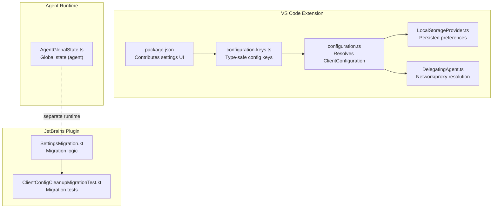

**Diagram sources**
- [vscode/package.json:123-800](file://vscode/package.json#L123-L800)
- [vscode/src/configuration-keys.ts:1-55](file://vscode/src/configuration-keys.ts#L1-L55)
- [vscode/src/configuration.ts:1-233](file://vscode/src/configuration.ts#L1-L233)
- [vscode/src/services/LocalStorageProvider.ts:1-432](file://vscode/src/services/LocalStorageProvider.ts#L1-L432)
- [vscode/src/net/DelegatingAgent.ts:179-473](file://vscode/src/net/DelegatingAgent.ts#L179-L473)
- [agent/src/global-state/AgentGlobalState.ts:1-150](file://agent/src/global-state/AgentGlobalState.ts#L1-L150)
- [jetbrains/src/main/kotlin/com/sourcegraph/cody/config/migration/SettingsMigration.kt:415-448](file://jetbrains/src/main/kotlin/com/sourcegraph/cody/config/migration/SettingsMigration.kt#L415-L448)
- [jetbrains/src/test/kotlin/com/sourcegraph/cody/config/migration/ClientConfigCleanupMigrationTest.kt:1-128](file://jetbrains/src/test/kotlin/com/sourcegraph/cody/config/migration/ClientConfigCleanupMigrationTest.kt#L1-L128)

**Section sources**
- [vscode/package.json:123-800](file://vscode/package.json#L123-L800)
- [vscode/src/configuration-keys.ts:1-55](file://vscode/src/configuration-keys.ts#L1-L55)
- [vscode/src/configuration.ts:1-233](file://vscode/src/configuration.ts#L1-L233)
- [vscode/src/services/LocalStorageProvider.ts:1-432](file://vscode/src/services/LocalStorageProvider.ts#L1-L432)
- [vscode/src/net/DelegatingAgent.ts:179-473](file://vscode/src/net/DelegatingAgent.ts#L179-L473)
- [agent/src/global-state/AgentGlobalState.ts:1-150](file://agent/src/global-state/AgentGlobalState.ts#L1-L150)
- [jetbrains/src/main/kotlin/com/sourcegraph/cody/config/migration/SettingsMigration.kt:415-448](file://jetbrains/src/main/kotlin/com/sourcegraph/cody/config/migration/SettingsMigration.kt#L415-L448)
- [jetbrains/src/test/kotlin/com/sourcegraph/cody/config/migration/ClientConfigCleanupMigrationTest.kt:1-128](file://jetbrains/src/test/kotlin/com/sourcegraph/cody/config/migration/ClientConfigCleanupMigrationTest.kt#L1-L128)

## Core Components
- Type-safe configuration keys: Derived from the extension manifest to ensure compile-time safety and automatic updates when settings change.
- Configuration resolver: Reads VS Code settings, sanitizes values, applies defaults, and exposes a normalized ClientConfiguration object.
- Local storage provider: Persists user preferences, chat history, endpoint history, and model preferences; emits change notifications.
- Network/proxy delegation: Normalizes network settings and environment variables into a runtime configuration for outbound requests.
- Agent global state: Manages persistent client state for agent environments with default values and migration support.
- JetBrains settings migration: Handles migration of application settings and cleanup of temporary client-side configuration.

**Section sources**
- [vscode/src/configuration-keys.ts:1-55](file://vscode/src/configuration-keys.ts#L1-L55)
- [vscode/src/configuration.ts:1-233](file://vscode/src/configuration.ts#L1-L233)
- [vscode/src/services/LocalStorageProvider.ts:1-432](file://vscode/src/services/LocalStorageProvider.ts#L1-L432)
- [vscode/src/net/DelegatingAgent.ts:179-473](file://vscode/src/net/DelegatingAgent.ts#L179-L473)
- [agent/src/global-state/AgentGlobalState.ts:1-150](file://agent/src/global-state/AgentGlobalState.ts#L1-L150)
- [jetbrains/src/main/kotlin/com/sourcegraph/cody/config/migration/SettingsMigration.kt:415-448](file://jetbrains/src/main/kotlin/com/sourcegraph/cody/config/migration/SettingsMigration.kt#L415-L448)

## Architecture Overview
The settings architecture integrates VS Code configuration, local storage, and runtime normalization. The configuration resolver centralizes defaults, sanitization, and hidden/internal toggles. Local storage persists user preferences and emits change events. Network/proxy resolution is derived from configuration and environment variables. Agent and JetBrains environments maintain separate persistence and migration logic.

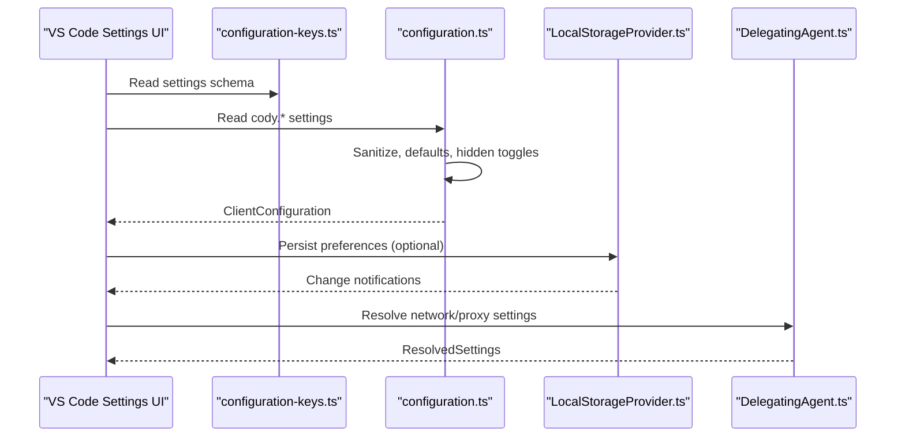

**Diagram sources**
- [vscode/src/configuration-keys.ts:1-55](file://vscode/src/configuration-keys.ts#L1-L55)
- [vscode/src/configuration.ts:1-233](file://vscode/src/configuration.ts#L1-L233)
- [vscode/src/services/LocalStorageProvider.ts:1-432](file://vscode/src/services/LocalStorageProvider.ts#L1-L432)
- [vscode/src/net/DelegatingAgent.ts:179-473](file://vscode/src/net/DelegatingAgent.ts#L179-L473)

## Detailed Component Analysis

### Settings Model and Resolution
- The configuration resolver reads VS Code settings via a ConfigGetter interface, applies sanitization, and returns a normalized ClientConfiguration object.
- Hidden/internal settings are supported for debugging and unstable features.
- Backward compatibility adjustments are handled during resolution (for example, suggestion mode normalization).
- Codebase sanitization ensures consistent formatting.
- Advanced agent flags are exposed for agent-aware behavior.

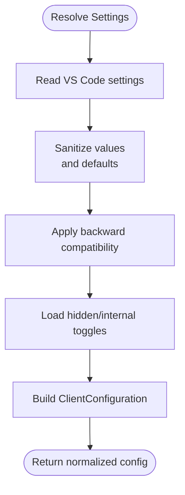

**Diagram sources**
- [vscode/src/configuration.ts:25-204](file://vscode/src/configuration.ts#L25-L204)

**Section sources**
- [vscode/src/configuration.ts:25-204](file://vscode/src/configuration.ts#L25-L204)

### Configuration Keys and Schema
- Configuration keys are inferred automatically from the extension manifest to ensure type safety and reduce maintenance overhead.
- Default values are read from the manifest and used when no user setting is present.
- The configuration keys module maps cody.* keys to camelCase identifiers for convenient access.

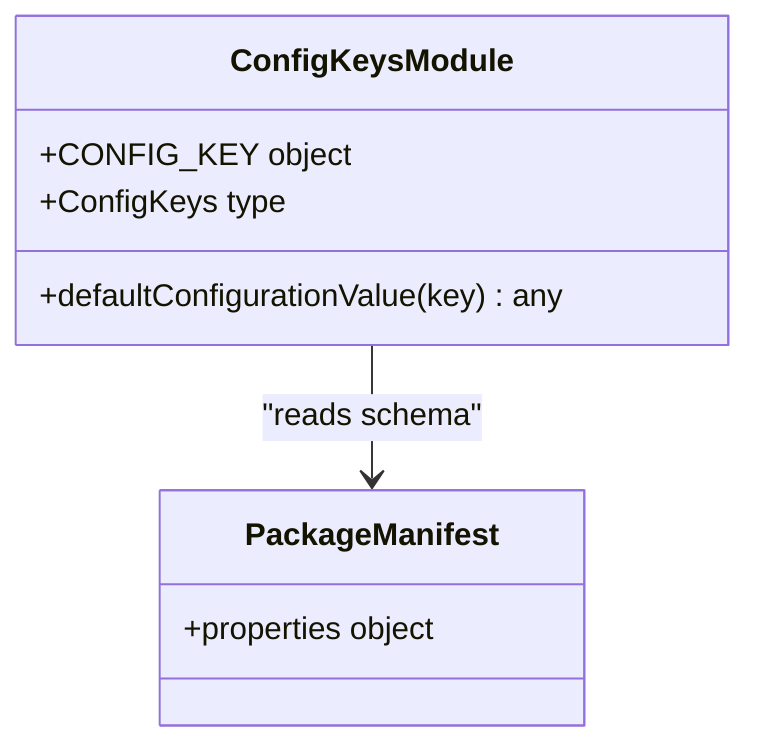

**Diagram sources**
- [vscode/src/configuration-keys.ts:1-55](file://vscode/src/configuration-keys.ts#L1-L55)
- [vscode/package.json:123-800](file://vscode/package.json#L123-L800)

**Section sources**
- [vscode/src/configuration-keys.ts:1-55](file://vscode/src/configuration-keys.ts#L1-L55)
- [vscode/package.json:123-800](file://vscode/package.json#L123-L800)

### Preference Storage and Persistence
- Local storage persists chat history, endpoint history, model preferences, anonymous user ID, and other client state.
- Change notifications are emitted via an event emitter and exposed as an observable stream for downstream consumers.
- Deprecated keys are cleaned up on initialization.
- Import/export of chat history supports merging or replacing existing data.

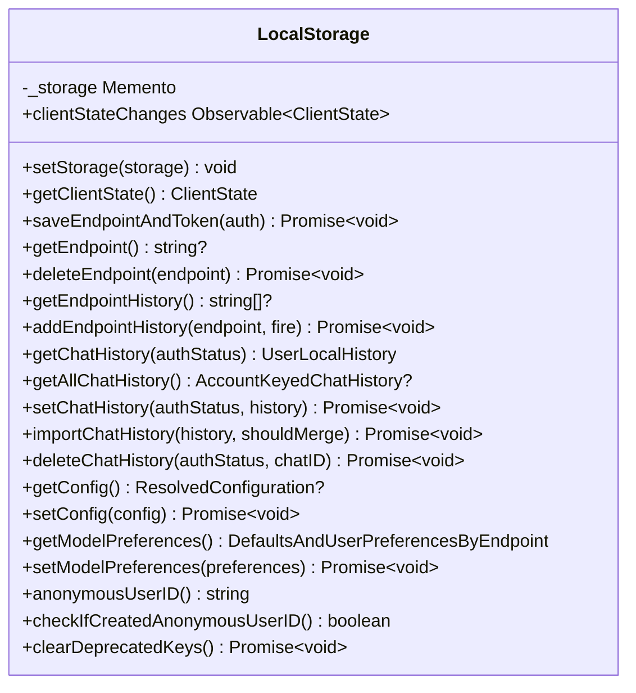

**Diagram sources**
- [vscode/src/services/LocalStorageProvider.ts:27-385](file://vscode/src/services/LocalStorageProvider.ts#L27-L385)

**Section sources**
- [vscode/src/services/LocalStorageProvider.ts:27-385](file://vscode/src/services/LocalStorageProvider.ts#L27-L385)

### Network and Proxy Configuration
- Network mode and proxy settings are read from configuration and environment variables.
- Proxy endpoint can be a URL or a Unix domain socket path.
- CA certificates can be provided inline or via a file path.
- Certificate validation can be skipped based on configuration or environment.
- The delegating agent normalizes and validates settings, building a runtime configuration for outbound requests.

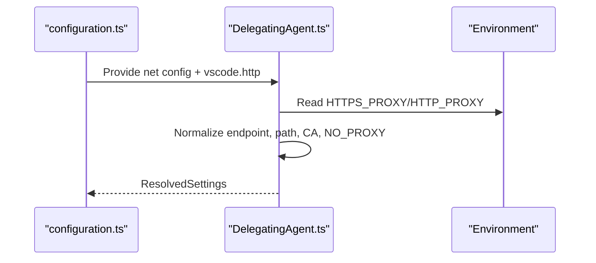

**Diagram sources**
- [vscode/src/configuration.ts:75-89](file://vscode/src/configuration.ts#L75-L89)
- [vscode/src/net/DelegatingAgent.ts:179-473](file://vscode/src/net/DelegatingAgent.ts#L179-L473)

**Section sources**
- [vscode/src/configuration.ts:75-89](file://vscode/src/configuration.ts#L75-L89)
- [vscode/src/net/DelegatingAgent.ts:179-473](file://vscode/src/net/DelegatingAgent.ts#L179-L473)

### Agent Global State
- AgentGlobalState manages persistent client state for agent environments.
- Initializes default values for client-managed keys.
- Supports in-memory and local-storage-backed databases.
- Provides getters and setters for keys and synchronizes with local storage for specific keys.

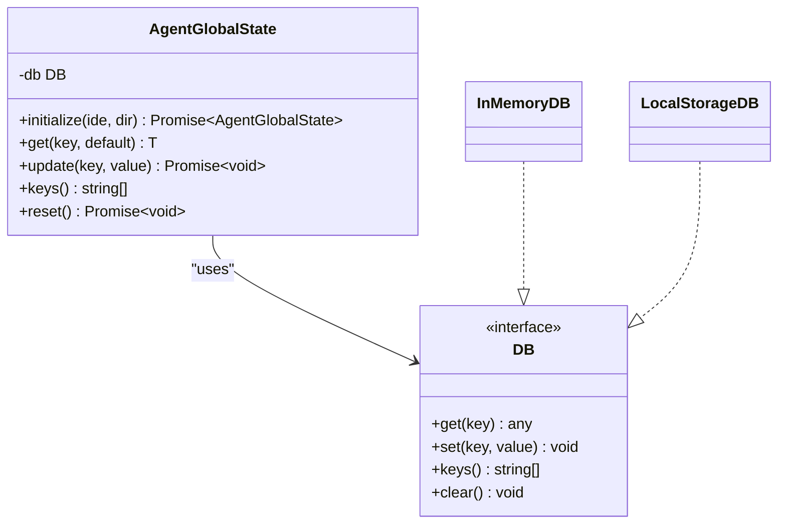

**Diagram sources**
- [agent/src/global-state/AgentGlobalState.ts:12-149](file://agent/src/global-state/AgentGlobalState.ts#L12-L149)

**Section sources**
- [agent/src/global-state/AgentGlobalState.ts:12-149](file://agent/src/global-state/AgentGlobalState.ts#L12-L149)

### JetBrains Settings Migration
- Migration logic transfers application settings from legacy service state to new settings classes.
- Cleanup migration removes temporary client-side configuration entries if present.
- Tests verify behavior when the settings file is missing or lacks temporary configuration.

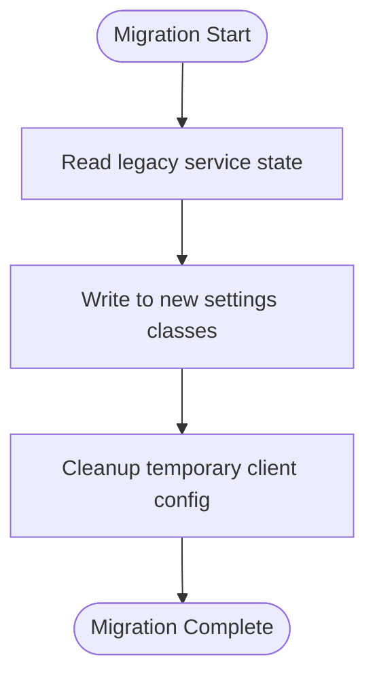

**Diagram sources**
- [jetbrains/src/main/kotlin/com/sourcegraph/cody/config/migration/SettingsMigration.kt:415-448](file://jetbrains/src/main/kotlin/com/sourcegraph/cody/config/migration/SettingsMigration.kt#L415-L448)
- [jetbrains/src/test/kotlin/com/sourcegraph/cody/config/migration/ClientConfigCleanupMigrationTest.kt:1-128](file://jetbrains/src/test/kotlin/com/sourcegraph/cody/config/migration/ClientConfigCleanupMigrationTest.kt#L1-L128)

**Section sources**
- [jetbrains/src/main/kotlin/com/sourcegraph/cody/config/migration/SettingsMigration.kt:415-448](file://jetbrains/src/main/kotlin/com/sourcegraph/cody/config/migration/SettingsMigration.kt#L415-L448)
- [jetbrains/src/test/kotlin/com/sourcegraph/cody/config/migration/ClientConfigCleanupMigrationTest.kt:1-128](file://jetbrains/src/test/kotlin/com/sourcegraph/cody/config/migration/ClientConfigCleanupMigrationTest.kt#L1-L128)

### Settings UI Exposure and Validation
- Settings are contributed via the extension manifest, exposing categories, commands, and keybindings that depend on configuration values.
- Validation occurs at runtime when parsing regex filters and ensuring proxy endpoints are valid URLs or Unix sockets.
- Tests assert default values and expected transformations for various settings.

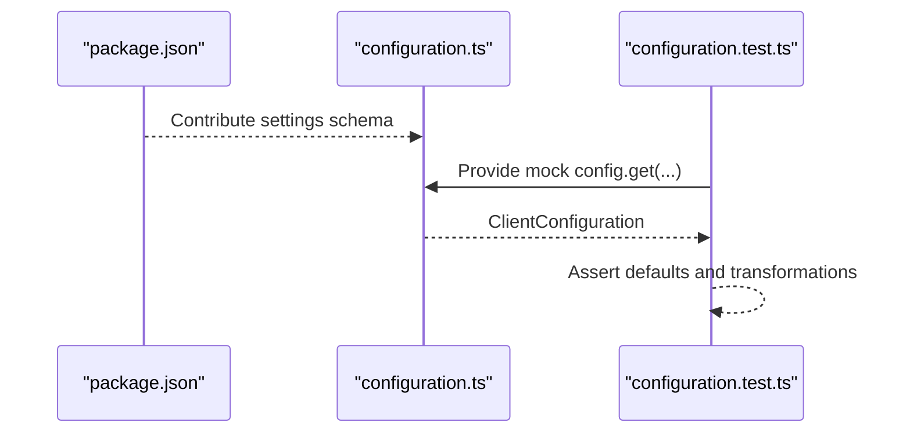

**Diagram sources**
- [vscode/package.json:123-800](file://vscode/package.json#L123-L800)
- [vscode/src/configuration.ts:25-204](file://vscode/src/configuration.ts#L25-L204)
- [vscode/src/configuration.test.ts:15-221](file://vscode/src/configuration.test.ts#L15-L221)

**Section sources**
- [vscode/package.json:123-800](file://vscode/package.json#L123-L800)
- [vscode/src/configuration.ts:25-204](file://vscode/src/configuration.ts#L25-L204)
- [vscode/src/configuration.test.ts:15-221](file://vscode/src/configuration.test.ts#L15-L221)

### Programmatic Access, Change Notifications, and Synchronization
- Programmatic access to settings is centralized in the configuration resolver, which reads from VS Code configuration and returns a normalized object.
- Local storage emits change notifications via an event stream, enabling reactive updates across the UI and services.
- Endpoint and token persistence is coordinated to ensure consistent state before emitting changes.
- Agent global state provides synchronized keys and default values for agent-managed environments.

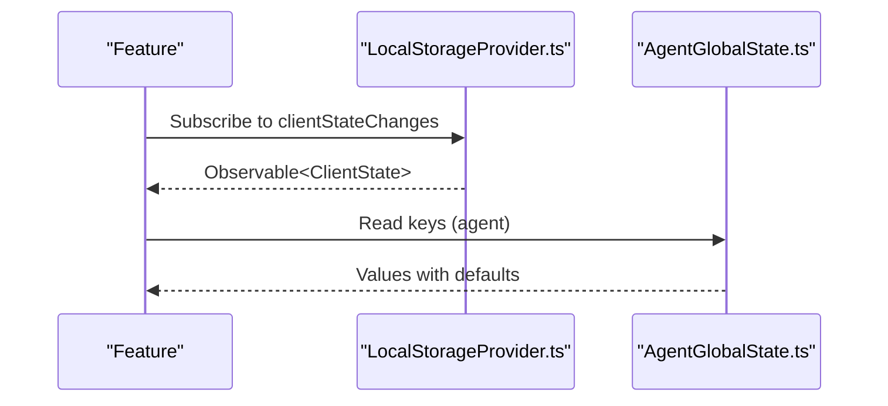

**Diagram sources**
- [vscode/src/services/LocalStorageProvider.ts:84-90](file://vscode/src/services/LocalStorageProvider.ts#L84-L90)
- [agent/src/global-state/AgentGlobalState.ts:61-76](file://agent/src/global-state/AgentGlobalState.ts#L61-L76)

**Section sources**
- [vscode/src/services/LocalStorageProvider.ts:84-90](file://vscode/src/services/LocalStorageProvider.ts#L84-L90)
- [agent/src/global-state/AgentGlobalState.ts:61-76](file://agent/src/global-state/AgentGlobalState.ts#L61-L76)

### Authentication Settings
- Authentication settings include server endpoint, custom headers, and external providers.
- Endpoint history and anonymous user ID are managed in local storage.
- Token storage is delegated to secret storage, coordinated with endpoint persistence.

**Section sources**
- [vscode/src/configuration.ts:90-93](file://vscode/src/configuration.ts#L90-L93)
- [vscode/src/configuration.ts:126-126](file://vscode/src/configuration.ts#L126-L126)
- [vscode/src/services/LocalStorageProvider.ts:108-132](file://vscode/src/services/LocalStorageProvider.ts#L108-L132)

### Advanced Options
- Internal/unstable toggles and debug flags are exposed via hidden settings for development and diagnostics.
- Agent-specific flags indicate runtime environment characteristics and capabilities.
- Provider limits and developer model configurations are configurable via hidden settings.

**Section sources**
- [vscode/src/configuration.ts:132-138](file://vscode/src/configuration.ts#L132-L138)
- [vscode/src/configuration.ts:180-191](file://vscode/src/configuration.ts#L180-L191)

### Settings Import/Export Capabilities
- Chat history import supports merging with existing data or replacing it.
- Export functionality allows exporting chats as JSON, including scenarios where authentication is not required.
- Custom commands configuration file creation and writing are supported for user-defined commands.

**Section sources**
- [vscode/src/services/LocalStorageProvider.ts:215-229](file://vscode/src/services/LocalStorageProvider.ts#L215-L229)
- [vscode/src/commands/utils/config-file.ts:26-60](file://vscode/src/commands/utils/config-file.ts#L26-L60)

## Dependency Analysis
The configuration system exhibits low coupling and high cohesion:
- configuration.ts depends on configuration-keys.ts for type-safe keys and on VS Code configuration APIs.
- Local storage provider encapsulates persistence and change notifications.
- DelegatingAgent depends on configuration and environment variables for network resolution.
- AgentGlobalState is isolated for agent environments and interacts minimally with the extension runtime.
- JetBrains migration logic is self-contained and tested independently.

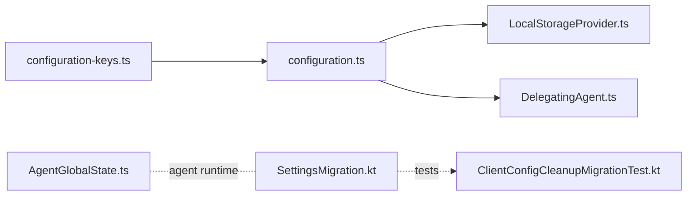

**Diagram sources**
- [vscode/src/configuration-keys.ts:1-55](file://vscode/src/configuration-keys.ts#L1-L55)
- [vscode/src/configuration.ts:1-233](file://vscode/src/configuration.ts#L1-L233)
- [vscode/src/services/LocalStorageProvider.ts:1-432](file://vscode/src/services/LocalStorageProvider.ts#L1-L432)
- [vscode/src/net/DelegatingAgent.ts:179-473](file://vscode/src/net/DelegatingAgent.ts#L179-L473)
- [agent/src/global-state/AgentGlobalState.ts:1-150](file://agent/src/global-state/AgentGlobalState.ts#L1-L150)
- [jetbrains/src/main/kotlin/com/sourcegraph/cody/config/migration/SettingsMigration.kt:415-448](file://jetbrains/src/main/kotlin/com/sourcegraph/cody/config/migration/SettingsMigration.kt#L415-L448)
- [jetbrains/src/test/kotlin/com/sourcegraph/cody/config/migration/ClientConfigCleanupMigrationTest.kt:1-128](file://jetbrains/src/test/kotlin/com/sourcegraph/cody/config/migration/ClientConfigCleanupMigrationTest.kt#L1-L128)

**Section sources**
- [vscode/src/configuration-keys.ts:1-55](file://vscode/src/configuration-keys.ts#L1-L55)
- [vscode/src/configuration.ts:1-233](file://vscode/src/configuration.ts#L1-L233)
- [vscode/src/services/LocalStorageProvider.ts:1-432](file://vscode/src/services/LocalStorageProvider.ts#L1-L432)
- [vscode/src/net/DelegatingAgent.ts:179-473](file://vscode/src/net/DelegatingAgent.ts#L179-L473)
- [agent/src/global-state/AgentGlobalState.ts:1-150](file://agent/src/global-state/AgentGlobalState.ts#L1-L150)
- [jetbrains/src/main/kotlin/com/sourcegraph/cody/config/migration/SettingsMigration.kt:415-448](file://jetbrains/src/main/kotlin/com/sourcegraph/cody/config/migration/SettingsMigration.kt#L415-L448)
- [jetbrains/src/test/kotlin/com/sourcegraph/cody/config/migration/ClientConfigCleanupMigrationTest.kt:1-128](file://jetbrains/src/test/kotlin/com/sourcegraph/cody/config/migration/ClientConfigCleanupMigrationTest.kt#L1-L128)

## Performance Considerations
- Minimize repeated reads of large configuration sections; cache resolved ClientConfiguration per activation cycle.
- Debounce change notifications when updating UI to avoid excessive re-renders.
- Prefer incremental updates to local storage to reduce write amplification.
- Validate proxy endpoints and CA certificates once during initialization rather than on every request.

## Troubleshooting Guide
- Regex filter errors: If the debug filter regex fails to parse, the resolver falls back to a default pattern and displays an error message.
- Proxy endpoint validation: Invalid proxy URLs or non-existent Unix socket paths produce errors; verify endpoint format and permissions.
- Deprecated keys: Local storage automatically clears deprecated keys on initialization.
- Migration failures: JetBrains migration tests ensure robustness when settings files are missing or lack temporary configuration.

**Section sources**
- [vscode/src/configuration.ts:42-48](file://vscode/src/configuration.ts#L42-L48)
- [vscode/src/net/DelegatingAgent.ts:391-395](file://vscode/src/net/DelegatingAgent.ts#L391-L395)
- [vscode/src/net/DelegatingAgent.ts:438-457](file://vscode/src/net/DelegatingAgent.ts#L438-L457)
- [vscode/src/services/LocalStorageProvider.ts:374-384](file://vscode/src/services/LocalStorageProvider.ts#L374-L384)
- [jetbrains/src/test/kotlin/com/sourcegraph/cody/config/migration/ClientConfigCleanupMigrationTest.kt:93-104](file://jetbrains/src/test/kotlin/com/sourcegraph/cody/config/migration/ClientConfigCleanupMigrationTest.kt#L93-L104)

## Conclusion
The settings system combines a type-safe configuration resolver, robust local storage persistence, and environment-aware network/proxy resolution. It supports advanced options, change notifications, and migration strategies across multiple IDE environments. The architecture emphasizes separation of concerns, testability, and maintainability while providing a consistent developer experience.

## Appendices

### Example: Programmatic Settings Access
- Read normalized configuration: [vscode/src/configuration.ts:25-204](file://vscode/src/configuration.ts#L25-L204)
- Access configuration keys: [vscode/src/configuration-keys.ts:52-55](file://vscode/src/configuration-keys.ts#L52-L55)
- Observe client state changes: [vscode/src/services/LocalStorageProvider.ts:84-90](file://vscode/src/services/LocalStorageProvider.ts#L84-L90)

### Example: Default Value Handling
- Defaults are provided by the configuration resolver and validated against tests: [vscode/src/configuration.test.ts:16-21](file://vscode/src/configuration.test.ts#L16-L21)

### Example: Settings Import/Export
- Import chat history (merge or replace): [vscode/src/services/LocalStorageProvider.ts:215-229](file://vscode/src/services/LocalStorageProvider.ts#L215-L229)
- Export chat history: [vscode/src/services/LocalStorageProvider.ts:186-188](file://vscode/src/services/LocalStorageProvider.ts#L186-L188)
- Create/write custom commands config file: [vscode/src/commands/utils/config-file.ts:26-60](file://vscode/src/commands/utils/config-file.ts#L26-L60)