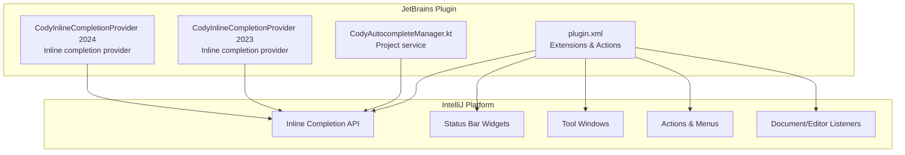
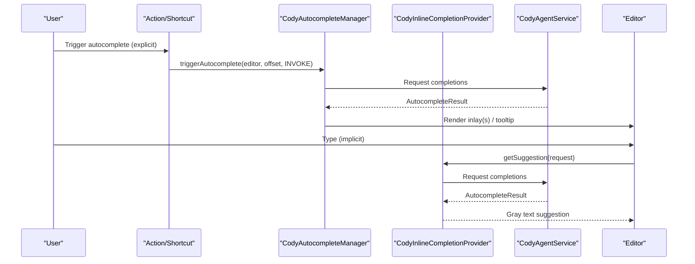
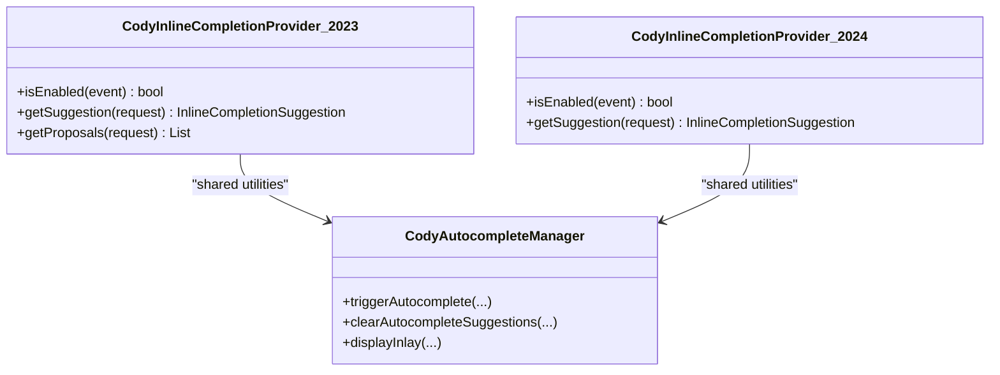
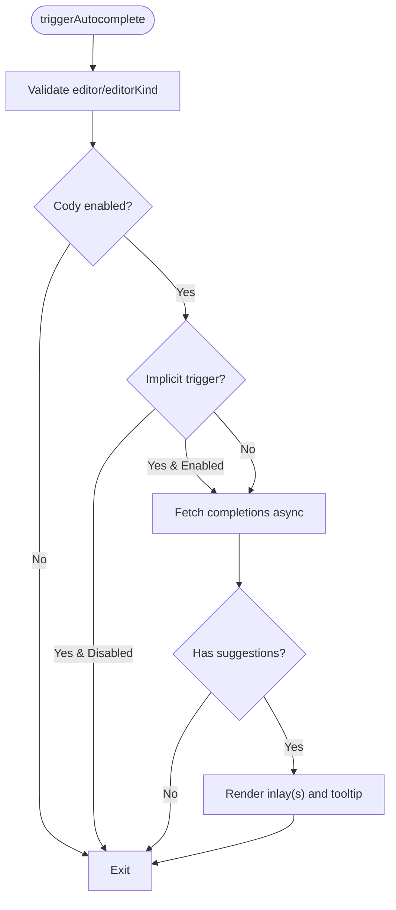
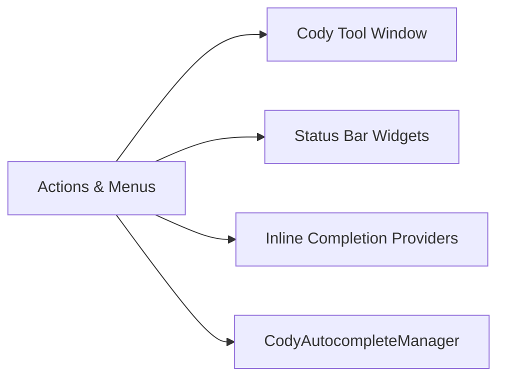
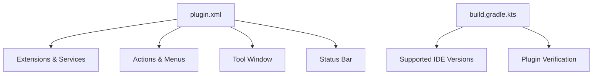

# IDE Adaptations

<cite>
**Referenced Files in This Document**
- [jetbrains/README.md](file://jetbrains/README.md)
- [jetbrains/build.gradle.kts](file://jetbrains/build.gradle.kts)
- [jetbrains/src/main/resources/META-INF/plugin.xml](file://jetbrains/src/main/resources/META-INF/plugin.xml)
- [jetbrains/src/main/kotlin/com/sourcegraph/cody/autocomplete/CodyAutocompleteManager.kt](file://jetbrains/src/main/kotlin/com/sourcegraph/cody/autocomplete/CodyAutocompleteManager.kt)
- [jetbrains/src/intellij2023/kotlin/com/sourcegraph/cody/autocomplete/CodyInlineCompletionProvider.kt](file://jetbrains/src/intellij2023/kotlin/com/sourcegraph/cody/autocomplete/CodyInlineCompletionProvider.kt)
- [jetbrains/src/intellij2024/kotlin/com/sourcegraph/cody/autocomplete/CodyInlineCompletionProvider.kt](file://jetbrains/src/intellij2024/kotlin/com/sourcegraph/cody/autocomplete/CodyInlineCompletionProvider.kt)
</cite>

## Table of Contents
1. [Introduction](#introduction)
2. [Project Structure](#project-structure)
3. [Core Components](#core-components)
4. [Architecture Overview](#architecture-overview)
5. [Detailed Component Analysis](#detailed-component-analysis)
6. [Dependency Analysis](#dependency-analysis)
7. [Performance Considerations](#performance-considerations)
8. [Troubleshooting Guide](#troubleshooting-guide)
9. [Conclusion](#conclusion)

## Introduction
This document explains how the JetBrains plugin adapts to different IDEs (IntelliJ IDEA, WebStorm, PyCharm, and others) and integrates with their platform APIs. It covers:
- IDE-specific autocomplete providers and UI rendering
- Chat interface integration and status bar widgets
- Document listeners and editor integrations
- Platform-specific APIs, compatibility, and version support matrices

The plugin targets JetBrains IDEs and leverages the IntelliJ Platform’s extension points, inline completion APIs, and status bar widgets to deliver a consistent Cody experience across IDE families.

## Project Structure
The JetBrains plugin is organized into:
- Versioned inline completion providers for 2023 and 2024+
- A project-level autocomplete manager coordinating requests and rendering
- Extension registry wiring actions, tool windows, status bar widgets, and listeners
- Build configuration defining supported IDE versions and verification matrix

**Diagram sources**
- [jetbrains/src/main/resources/META-INF/plugin.xml:19-136](file://jetbrains/src/main/resources/META-INF/plugin.xml#L19-L136)
- [jetbrains/src/main/kotlin/com/sourcegraph/cody/autocomplete/CodyAutocompleteManager.kt:58-193](file://jetbrains/src/main/kotlin/com/sourcegraph/cody/autocomplete/CodyAutocompleteManager.kt#L58-L193)
- [jetbrains/src/intellij2023/kotlin/com/sourcegraph/cody/autocomplete/CodyInlineCompletionProvider.kt:33-157](file://jetbrains/src/intellij2023/kotlin/com/sourcegraph/cody/autocomplete/CodyInlineCompletionProvider.kt#L33-L157)
- [jetbrains/src/intellij2024/kotlin/com/sourcegraph/cody/autocomplete/CodyInlineCompletionProvider.kt:33-148](file://jetbrains/src/intellij2024/kotlin/com/sourcegraph/cody/autocomplete/CodyInlineCompletionProvider.kt#L33-L148)

**Section sources**
- [jetbrains/src/main/resources/META-INF/plugin.xml:1-455](file://jetbrains/src/main/resources/META-INF/plugin.xml#L1-L455)
- [jetbrains/build.gradle.kts:28-58](file://jetbrains/build.gradle.kts#L28-L58)

## Core Components
- Inline completion providers:
  - Versioned providers for 2023 and 2024+ use the IntelliJ Platform’s inline completion APIs to fetch and present suggestions.
- Project-level autocomplete manager:
  - Central coordinator for autocomplete lifecycle, cancellation, rendering, and user feedback.
- Actions and UI:
  - Actions for autocomplete, chat, editing, and settings; tool window for chat; status bar widgets for plugin state.
- Document/editor listeners:
  - Listeners for lookup and command events to integrate with editor state and context.

**Section sources**
- [jetbrains/src/intellij2023/kotlin/com/sourcegraph/cody/autocomplete/CodyInlineCompletionProvider.kt:33-157](file://jetbrains/src/intellij2023/kotlin/com/sourcegraph/cody/autocomplete/CodyInlineCompletionProvider.kt#L33-L157)
- [jetbrains/src/intellij2024/kotlin/com/sourcegraph/cody/autocomplete/CodyInlineCompletionProvider.kt:33-148](file://jetbrains/src/intellij2024/kotlin/com/sourcegraph/cody/autocomplete/CodyInlineCompletionProvider.kt#L33-L148)
- [jetbrains/src/main/kotlin/com/sourcegraph/cody/autocomplete/CodyAutocompleteManager.kt:58-384](file://jetbrains/src/main/kotlin/com/sourcegraph/cody/autocomplete/CodyAutocompleteManager.kt#L58-L384)
- [jetbrains/src/main/resources/META-INF/plugin.xml:148-453](file://jetbrains/src/main/resources/META-INF/plugin.xml#L148-L453)

## Architecture Overview
The plugin integrates with the IntelliJ Platform through extension points and services. Autocomplete requests flow through either:
- The project-level manager for explicit triggers and multi-line inlay rendering, or
- The inline completion providers for implicit, gray-text suggestions.

**Diagram sources**
- [jetbrains/src/main/kotlin/com/sourcegraph/cody/autocomplete/CodyAutocompleteManager.kt:113-193](file://jetbrains/src/main/kotlin/com/sourcegraph/cody/autocomplete/CodyAutocompleteManager.kt#L113-L193)
- [jetbrains/src/intellij2024/kotlin/com/sourcegraph/cody/autocomplete/CodyInlineCompletionProvider.kt:39-95](file://jetbrains/src/intellij2024/kotlin/com/sourcegraph/cody/autocomplete/CodyInlineCompletionProvider.kt#L39-L95)

## Detailed Component Analysis

### Inline Completion Providers (2023 vs 2024+)
- Purpose:
  - Provide implicit, automatic inline suggestions using the IDE’s inline completion framework.
- Differences:
  - 2023 provider includes a legacy proposal method retained for compilation compatibility.
  - 2024+ provider uses the updated inline completion API and renders gray text suggestions.
- Compatibility:
  - Both providers check IDE baseline version thresholds and plugin configuration before enabling.

**Diagram sources**
- [jetbrains/src/intellij2023/kotlin/com/sourcegraph/cody/autocomplete/CodyInlineCompletionProvider.kt:33-157](file://jetbrains/src/intellij2023/kotlin/com/sourcegraph/cody/autocomplete/CodyInlineCompletionProvider.kt#L33-L157)
- [jetbrains/src/intellij2024/kotlin/com/sourcegraph/cody/autocomplete/CodyInlineCompletionProvider.kt:33-148](file://jetbrains/src/intellij2024/kotlin/com/sourcegraph/cody/autocomplete/CodyInlineCompletionProvider.kt#L33-L148)
- [jetbrains/src/main/kotlin/com/sourcegraph/cody/autocomplete/CodyAutocompleteManager.kt:58-105](file://jetbrains/src/main/kotlin/com/sourcegraph/cody/autocomplete/CodyAutocompleteManager.kt#L58-L105)

**Section sources**
- [jetbrains/src/intellij2023/kotlin/com/sourcegraph/cody/autocomplete/CodyInlineCompletionProvider.kt:132-157](file://jetbrains/src/intellij2023/kotlin/com/sourcegraph/cody/autocomplete/CodyInlineCompletionProvider.kt#L132-L157)
- [jetbrains/src/intellij2024/kotlin/com/sourcegraph/cody/autocomplete/CodyInlineCompletionProvider.kt:132-146](file://jetbrains/src/intellij2024/kotlin/com/sourcegraph/cody/autocomplete/CodyInlineCompletionProvider.kt#L132-L146)

### Project-Level Autocomplete Manager
- Responsibilities:
  - Validate editor/editor kind, activation, and implicit/implicit toggles.
  - Cancel previous jobs and clear existing inlays.
  - Format and render single-line and block inlay suggestions.
  - Show “Got It” tooltips and integrate with Auto-edit when applicable.
- Rendering:
  - Uses inlay model to attach inline and block elements.
  - Applies formatting based on document context and a system property toggle.

**Diagram sources**
- [jetbrains/src/main/kotlin/com/sourcegraph/cody/autocomplete/CodyAutocompleteManager.kt:113-237](file://jetbrains/src/main/kotlin/com/sourcegraph/cody/autocomplete/CodyAutocompleteManager.kt#L113-L237)

**Section sources**
- [jetbrains/src/main/kotlin/com/sourcegraph/cody/autocomplete/CodyAutocompleteManager.kt:58-384](file://jetbrains/src/main/kotlin/com/sourcegraph/cody/autocomplete/CodyAutocompleteManager.kt#L58-L384)

### Actions, Menus, and Tool Windows
- Actions:
  - Autocomplete actions (trigger, accept, cycle).
  - Chat actions (new chat, open chat, export chats).
  - Edit actions (generate unit tests, document code, edit code).
  - Other actions (restart agent, open log, open DevTools).
- Tool Window:
  - A right-side “Cody” tool window factory is registered for chat and related views.
- Status Bar Widgets:
  - Two status bar factories are registered for internal diagnostics and user-facing status.

**Diagram sources**
- [jetbrains/src/main/resources/META-INF/plugin.xml:78-136](file://jetbrains/src/main/resources/META-INF/plugin.xml#L78-L136)
- [jetbrains/src/main/resources/META-INF/plugin.xml:148-453](file://jetbrains/src/main/resources/META-INF/plugin.xml#L148-L453)

**Section sources**
- [jetbrains/src/main/resources/META-INF/plugin.xml:148-453](file://jetbrains/src/main/resources/META-INF/plugin.xml#L148-L453)

### Document and Editor Integrations
- Lookup and command listeners:
  - Listeners for lookup and command events are registered at the project level to integrate with editor state and context.
- Inline completion integration:
  - Providers hook into the inline completion framework to offer gray text suggestions during typing.

**Section sources**
- [jetbrains/src/main/resources/META-INF/plugin.xml:448-453](file://jetbrains/src/main/resources/META-INF/plugin.xml#L448-L453)
- [jetbrains/src/intellij2023/kotlin/com/sourcegraph/cody/autocomplete/CodyInlineCompletionProvider.kt:39-96](file://jetbrains/src/intellij2023/kotlin/com/sourcegraph/cody/autocomplete/CodyInlineCompletionProvider.kt#L39-L96)
- [jetbrains/src/intellij2024/kotlin/com/sourcegraph/cody/autocomplete/CodyInlineCompletionProvider.kt:39-95](file://jetbrains/src/intellij2024/kotlin/com/sourcegraph/cody/autocomplete/CodyInlineCompletionProvider.kt#L39-L95)

## Dependency Analysis
- Extension registry:
  - plugin.xml declares services, tool windows, status bar widgets, actions, and listeners.
- Versioned providers:
  - Separate providers per major IDE year to align with API changes in the inline completion subsystem.
- Build-time compatibility:
  - Gradle defines supported IDE versions and verification policy.

**Diagram sources**
- [jetbrains/src/main/resources/META-INF/plugin.xml:19-136](file://jetbrains/src/main/resources/META-INF/plugin.xml#L19-L136)
- [jetbrains/build.gradle.kts:28-58](file://jetbrains/build.gradle.kts#L28-L58)

**Section sources**
- [jetbrains/src/main/resources/META-INF/plugin.xml:1-455](file://jetbrains/src/main/resources/META-INF/plugin.xml#L1-L455)
- [jetbrains/build.gradle.kts:28-58](file://jetbrains/build.gradle.kts#L28-L58)

## Performance Considerations
- Formatting toggle:
  - A system property controls whether document-aware formatting is applied to autocomplete suggestions.
- Async completion fetching:
  - Completion requests are asynchronous with timeouts to avoid blocking the UI thread.
- Inlay rendering:
  - Rendering occurs on the write action to ensure thread safety and correctness.

**Section sources**
- [jetbrains/src/main/kotlin/com/sourcegraph/cody/autocomplete/CodyAutocompleteManager.kt:255-261](file://jetbrains/src/main/kotlin/com/sourcegraph/cody/autocomplete/CodyAutocompleteManager.kt#L255-L261)
- [jetbrains/src/intellij2024/kotlin/com/sourcegraph/cody/autocomplete/CodyInlineCompletionProvider.kt:61-62](file://jetbrains/src/intellij2024/kotlin/com/sourcegraph/cody/autocomplete/CodyInlineCompletionProvider.kt#L61-L62)

## Troubleshooting Guide
- Autocomplete not appearing:
  - Verify Cody is enabled and the editor is valid for autocomplete.
  - Confirm implicit autocomplete is enabled for the editor and the provider is enabled for the IDE version.
- Suggestions not accepted:
  - Use the explicit trigger action or keyboard shortcuts to accept/cycle suggestions.
- Status bar widget issues:
  - Restart the agent action is available to refresh state.
- IDE version compatibility:
  - The plugin supports a defined matrix of IDE versions; failures are filtered during verification.

**Section sources**
- [jetbrains/src/main/kotlin/com/sourcegraph/cody/autocomplete/CodyAutocompleteManager.kt:129-159](file://jetbrains/src/main/kotlin/com/sourcegraph/cody/autocomplete/CodyAutocompleteManager.kt#L129-L159)
- [jetbrains/src/intellij2023/kotlin/com/sourcegraph/cody/autocomplete/CodyInlineCompletionProvider.kt:150-156](file://jetbrains/src/intellij2023/kotlin/com/sourcegraph/cody/autocomplete/CodyInlineCompletionProvider.kt#L150-L156)
- [jetbrains/src/intellij2024/kotlin/com/sourcegraph/cody/autocomplete/CodyInlineCompletionProvider.kt:140-146](file://jetbrains/src/intellij2024/kotlin/com/sourcegraph/cody/autocomplete/CodyInlineCompletionProvider.kt#L140-L146)
- [jetbrains/src/main/resources/META-INF/plugin.xml:391-422](file://jetbrains/src/main/resources/META-INF/plugin.xml#L391-L422)
- [jetbrains/build.gradle.kts:32-57](file://jetbrains/build.gradle.kts#L32-L57)

## Conclusion
The JetBrains plugin adapts to multiple IDEs by:
- Using versioned inline completion providers aligned with IntelliJ Platform API changes
- Coordinating autocomplete through a project-level manager that handles rendering, formatting, and user feedback
- Integrating actions, tool windows, and status bar widgets for a cohesive UX
- Leveraging platform listeners and services for robust editor integration

Compatibility is maintained through a defined IDE version matrix and verification policies.