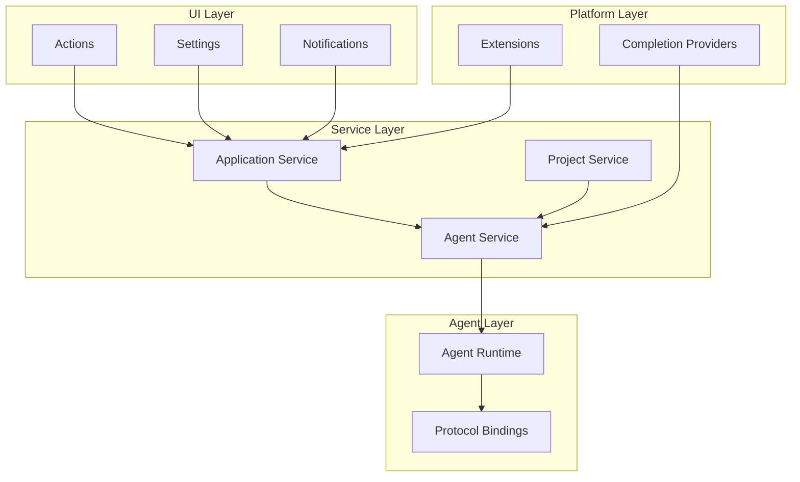
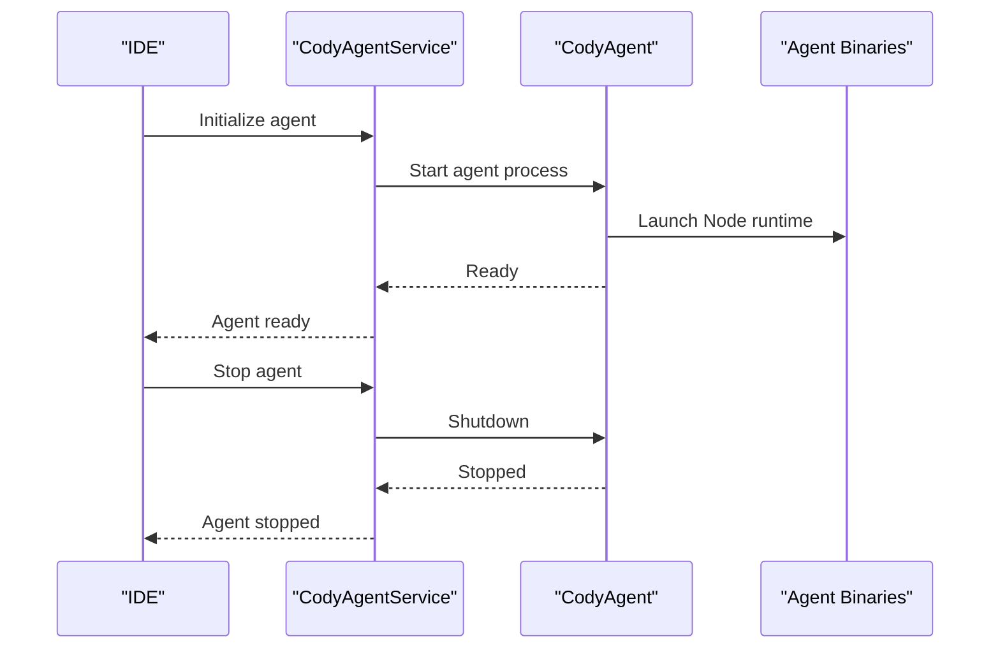
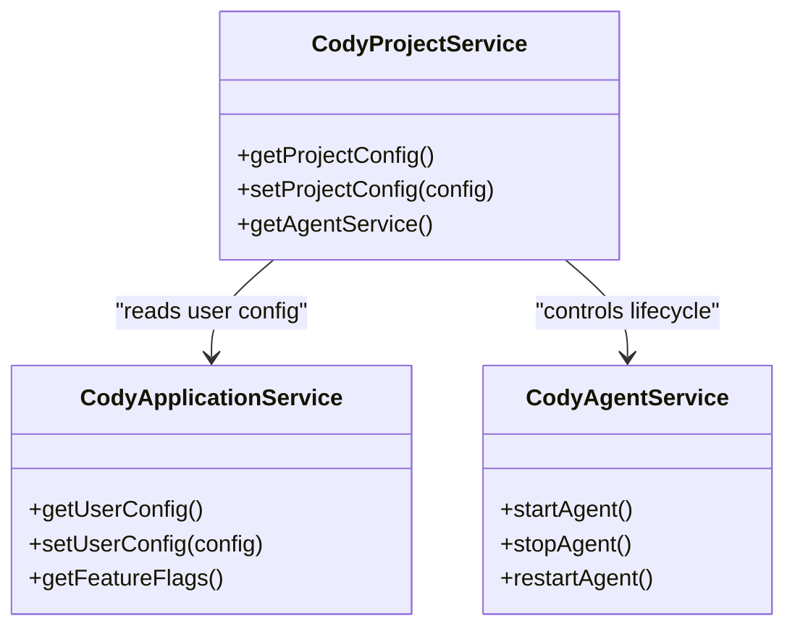
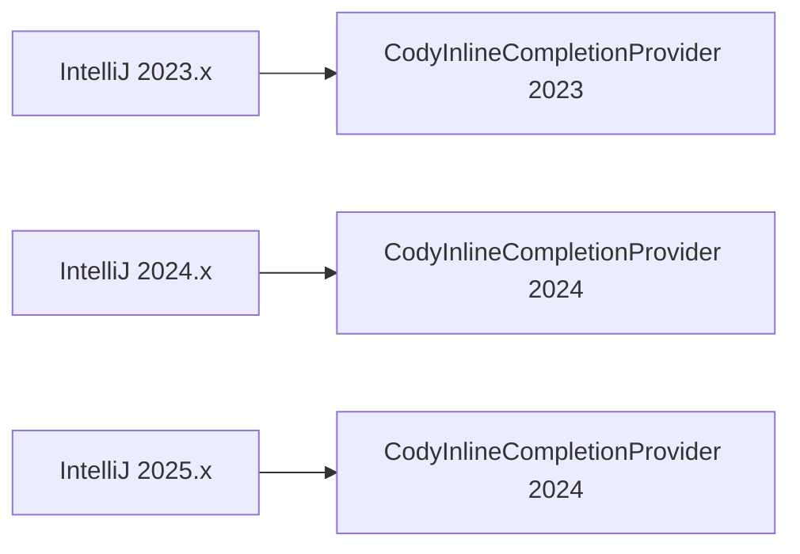
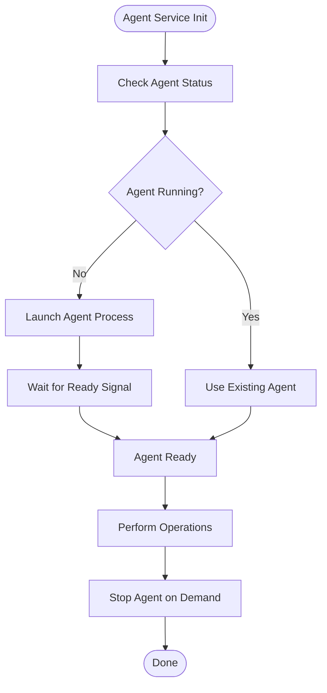
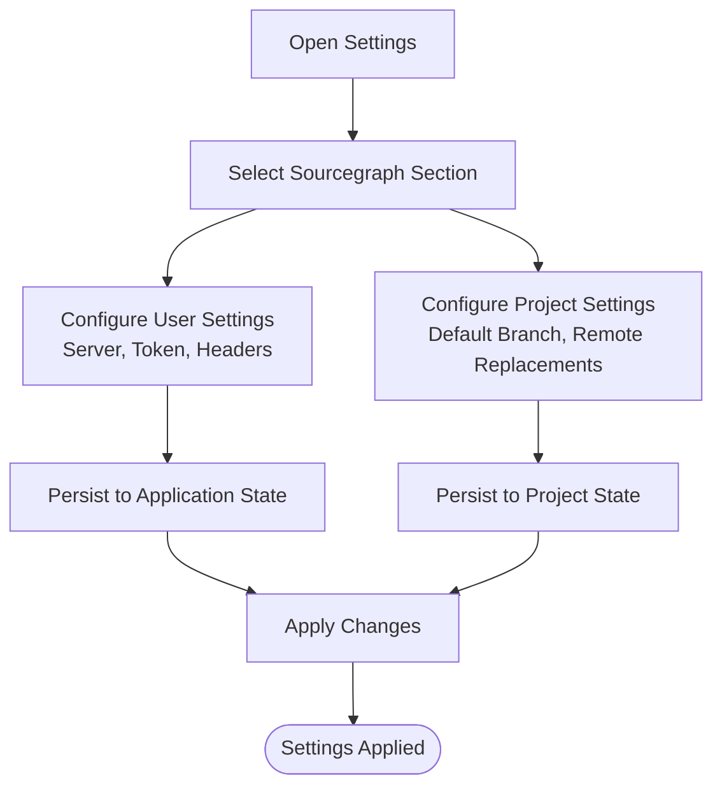
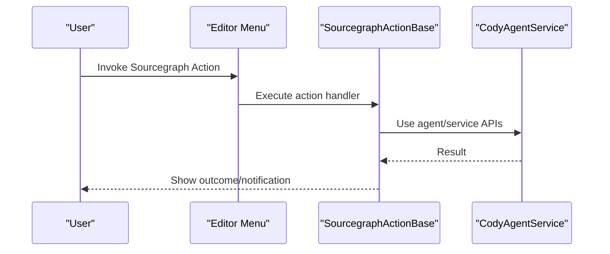
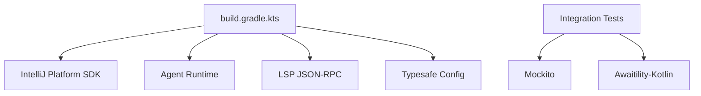
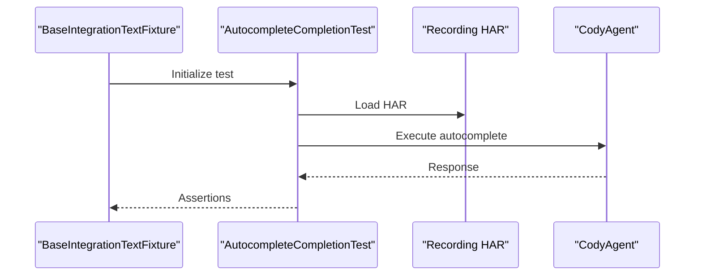

# JetBrains Plugin

<cite>
**Referenced Files in This Document**
- [jetbrains/README.md](file://jetbrains/README.md)
- [jetbrains/build.gradle.kts](file://jetbrains/build.gradle.kts)
- [jetbrains/settings.gradle.kts](file://jetbrains/settings.gradle.kts)
- [jetbrains/src/main/resources/META-INF/plugin.xml](file://jetbrains/src/main/resources/META-INF/plugin.xml)
- [jetbrains/src/main/kotlin/com/sourcegraph/cody/agent/CodyAgent.kt](file://jetbrains/src/main/kotlin/com/sourcegraph/cody/agent/CodyAgent.kt)
- [jetbrains/src/main/kotlin/com/sourcegraph/cody/agent/CodyAgentService.kt](file://jetbrains/src/main/kotlin/com/sourcegraph/cody/agent/CodyAgentService.kt)
- [jetbrains/src/main/kotlin/com/sourcegraph/cody/actions/SourcegraphActionBase.kt](file://jetbrains/src/main/kotlin/com/sourcegraph/cody/actions/SourcegraphActionBase.kt)
- [jetbrains/src/main/kotlin/com/sourcegraph/cody/actions/SourcegraphActionGroup.kt](file://jetbrains/src/main/kotlin/com/sourcegraph/cody/actions/SourcegraphActionGroup.kt)
- [jetbrains/src/main/kotlin/com/sourcegraph/cody/config/CodyApplicationService.kt](file://jetbrains/src/main/kotlin/com/sourcegraph/cody/config/CodyApplicationService.kt)
- [jetbrains/src/main/kotlin/com/sourcegraph/cody/config/CodyProjectService.kt](file://jetbrains/src/main/kotlin/com/sourcegraph/cody/config/CodyProjectService.kt)
- [jetbrains/src/main/kotlin/com/sourcegraph/cody/config/UserLevelConfig.kt](file://jetbrains/src/main/kotlin/com/sourcegraph/cody/config/UserLevelConfig.kt)
- [jetbrains/src/main/kotlin/com/sourcegraph/cody/editor/EditorCommands.kt](file://jetbrains/src/main/kotlin/com/sourcegraph/cody/editor/EditorCommands.kt)
- [jetbrains/src/main/kotlin/com/sourcegraph/cody/ui/notifications/NotificationActionFactory.kt](file://jetbrains/src/main/kotlin/com/sourcegraph/cody/ui/notifications/NotificationActionFactory.kt)
- [jetbrains/src/main/kotlin/com/sourcegraph/cody/ui/settings/SettingsConfigurable.kt](file://jetbrains/src/main/kotlin/com/sourcegraph/cody/ui/settings/SettingsConfigurable.kt)
- [jetbrains/src/main/kotlin/com/sourcegraph/cody/vcs/VCSActions.kt](file://jetbrains/src/main/kotlin/com/sourcegraph/cody/vcs/VCSActions.kt)
- [jetbrains/src/main/kotlin/com/sourcegraph/cody/website/WebsiteActions.kt](file://jetbrains/src/main/kotlin/com/sourcegraph/cody/website/WebsiteActions.kt)
- [jetbrains/src/integrationTest/kotlin/com/sourcegraph/cody/AutocompleteCompletionTest.kt](file://jetbrains/src/integrationTest/kotlin/com/sourcegraph/cody/AutocompleteCompletionTest.kt)
- [jetbrains/src/integrationTest/kotlin/com/sourcegraph/cody/edit/DocumentCodeTest.kt](file://jetbrains/src/integrationTest/kotlin/com/sourcegraph/cody/edit/DocumentCodeTest.kt)
- [jetbrains/src/integrationTest/kotlin/com/sourcegraph/cody/util/BaseIntegrationTextFixture.kt](file://jetbrains/src/integrationTest/kotlin/com/sourcegraph/cody/util/BaseIntegrationTextFixture.kt)
- [jetbrains/src/integrationTest/kotlin/com/sourcegraph/cody/util/EditCodeFixture.kt](file://jetbrains/src/integrationTest/kotlin/com/sourcegraph/cody/util/EditCodeFixture.kt)
- [jetbrains/src/integrationTest/kotlin/com/sourcegraph/cody/util/TestingCredentials.kt](file://jetbrains/src/integrationTest/kotlin/com/sourcegraph/cody/util/TestingCredentials.kt)
- [jetbrains/src/integrationTest/resources/testProjects/autocompleteCompletion/src/main/kotlin/AutocompleteCompletionTest.kt](file://jetbrains/src/integrationTest/resources/testProjects/autocompleteCompletion/src/main/kotlin/AutocompleteCompletionTest.kt)
- [jetbrains/src/integrationTest/resources/testProjects/documentCode/src/main/kotlin/DocumentCodeTest.kt](file://jetbrains/src/integrationTest/resources/testProjects/documentCode/src/main/kotlin/DocumentCodeTest.kt)
- [jetbrains/src/integrationTest/resources/recordings/autocomplete_2136217965/recording.har.yaml](file://jetbrains/src/integrationTest/resources/recordings/autocomplete_2136217965/recording.har.yaml)
- [jetbrains/src/integrationTest/resources/recordings/documentCode_2994921345/recording.har.yaml](file://jetbrains/src/integrationTest/resources/recordings/documentCode_2994921345/recording.har.yaml)
- [jetbrains/src/integrationTest/resources/recordings/autocompleteEdit_3787598409/recording.har.yaml](file://jetbrains/src/integrationTest/resources/recordings/autocompleteEdit_3787598409/recording.har.yaml)
- [jetbrains/features.json5](file://jetbrains/features.json5)
- [jetbrains/src/main/kotlin/com/sourcegraph/cody/autocomplete/CodyInlineCompletionProvider.kt](file://jetbrains/src/main/kotlin/com/sourcegraph/cody/autocomplete/CodyInlineCompletionProvider.kt)
- [jetbrains/src/intellij2024/kotlin/com/sourcegraph/cody/autocomplete/CodyInlineCompletionProvider.kt](file://jetbrains/src/intellij2024/kotlin/com/sourcegraph/cody/autocomplete/CodyInlineCompletionProvider.kt)
- [jetbrains/src/integrationTest/kotlin/com/sourcegraph/cody/autocomplete/BaseAutocompleteTest.kt](file://jetbrains/src/integrationTest/kotlin/com/sourcegraph/cody/autocomplete/BaseAutocompleteTest.kt)
- [jetbrains/src/integrationTest/kotlin/com/sourcegraph/cody/autocomplete/AutocompleteCompletionTest.kt](file://jetbrains/src/integrationTest/kotlin/com/sourcegraph/cody/autocomplete/AutocompleteCompletionTest.kt)
- [jetbrains/src/integrationTest/kotlin/com/sourcegraph/cody/autocomplete/AutocompleteEditTest.kt](file://jetbrains/src/integrationTest/kotlin/com/sourcegraph/cody/autocomplete/AutocompleteEditTest.kt)
</cite>

## Table of Contents
1. [Introduction](#introduction)
2. [Project Structure](#project-structure)
3. [Core Components](#core-components)
4. [Architecture Overview](#architecture-overview)
5. [Detailed Component Analysis](#detailed-component-analysis)
6. [Dependency Analysis](#dependency-analysis)
7. [Performance Considerations](#performance-considerations)
8. [Troubleshooting Guide](#troubleshooting-guide)
9. [Conclusion](#conclusion)
10. [Appendices](#appendices)

## Introduction
This document explains the JetBrains plugin implementation for IntelliJ IDEA, WebStorm, and other JetBrains IDEs. It covers the plugin architecture, agent integration, service management, platform-specific adaptations, multi-IDE support, configuration and settings, UI actions, and lifecycle and distribution. It also documents installation, compatibility, and update mechanisms through the JetBrains Marketplace.

## Project Structure
The JetBrains plugin is implemented as a Gradle-based IntelliJ Platform plugin. The build integrates the agent runtime and bundles platform-specific completion providers. The plugin exposes actions, settings, and services that integrate with JetBrains’ framework.

```mermaid
graph TB
A["jetbrains/build.gradle.kts"] --> B["Plugin Packaging<br/>Agent binaries included"]
A --> C["IDE Versions Matrix<br/>2023.2–2025.1"]
A --> D["Tasks: buildCody, copyProtocol, buildCodeSearch"]
E["jetbrains/src/main/resources/META-INF/plugin.xml"] --> F["Actions, Services, Extensions"]
G["jetbrains/src/main/kotlin/com/sourcegraph/cody/agent/CodyAgent.kt"] --> H["Agent Lifecycle<br/>Start/Stop/Restart"]
I["jetbrains/src/main/kotlin/com/sourcegraph/cody/agent/CodyAgentService.kt"] --> J["Service Layer<br/>Project/Application"]
K["jetbrains/src/main/kotlin/com/sourcegraph/cody/autocomplete/CodyInlineCompletionProvider.kt"] --> L["Platform Completion Provider"]
M["jetbrains/src/main/kotlin/com/sourcegraph/cody/ui/settings/SettingsConfigurable.kt"] --> N["Settings UI"]
O["jetbrains/src/main/kotlin/com/sourcegraph/cody/actions/*"] --> P["Editor/VCS/Website Actions"]
```

**Diagram sources**
- [jetbrains/build.gradle.kts](file://jetbrains/build.gradle.kts)
- [jetbrains/src/main/resources/META-INF/plugin.xml](file://jetbrains/src/main/resources/META-INF/plugin.xml)
- [jetbrains/src/main/kotlin/com/sourcegraph/cody/agent/CodyAgent.kt](file://jetbrains/src/main/kotlin/com/sourcegraph/cody/agent/CodyAgent.kt)
- [jetbrains/src/main/kotlin/com/sourcegraph/cody/agent/CodyAgentService.kt](file://jetbrains/src/main/kotlin/com/sourcegraph/cody/agent/CodyAgentService.kt)
- [jetbrains/src/main/kotlin/com/sourcegraph/cody/autocomplete/CodyInlineCompletionProvider.kt](file://jetbrains/src/main/kotlin/com/sourcegraph/cody/autocomplete/CodyInlineCompletionProvider.kt)
- [jetbrains/src/main/kotlin/com/sourcegraph/cody/ui/settings/SettingsConfigurable.kt](file://jetbrains/src/main/kotlin/com/sourcegraph/cody/ui/settings/SettingsConfigurable.kt)
- [jetbrains/src/main/kotlin/com/sourcegraph/cody/actions/SourcegraphActionBase.kt](file://jetbrains/src/main/kotlin/com/sourcegraph/cody/actions/SourcegraphActionBase.kt)

**Section sources**
- [jetbrains/README.md](file://jetbrains/README.md)
- [jetbrains/build.gradle.kts](file://jetbrains/build.gradle.kts)
- [jetbrains/settings.gradle.kts](file://jetbrains/settings.gradle.kts)

## Core Components
- Agent integration: The plugin embeds and manages the agent runtime, including Node binaries per platform and protocol-generated Kotlin bindings. The agent is started/stopped via the agent service and is used for autocomplete, chat, and related operations.
- Service management: Application and project-level services manage configuration, authentication, and state. Services expose APIs for actions and UI components.
- Platform-specific adaptations: The plugin ships separate inline completion providers for different IDE versions (e.g., 2023 vs 2024) and selects the appropriate provider at runtime.
- Actions and UI: Actions are registered for editor commands, VCS operations, and website navigation. Settings are exposed via a configurable UI.
- Tests and recordings: Integration tests use recorded HAR files to validate behavior without hitting live servers.

**Section sources**
- [jetbrains/src/main/kotlin/com/sourcegraph/cody/agent/CodyAgent.kt](file://jetbrains/src/main/kotlin/com/sourcegraph/cody/agent/CodyAgent.kt)
- [jetbrains/src/main/kotlin/com/sourcegraph/cody/agent/CodyAgentService.kt](file://jetbrains/src/main/kotlin/com/sourcegraph/cody/agent/CodyAgentService.kt)
- [jetbrains/src/main/kotlin/com/sourcegraph/cody/config/CodyApplicationService.kt](file://jetbrains/src/main/kotlin/com/sourcegraph/cody/config/CodyApplicationService.kt)
- [jetbrains/src/main/kotlin/com/sourcegraph/cody/config/CodyProjectService.kt](file://jetbrains/src/main/kotlin/com/sourcegraph/cody/config/CodyProjectService.kt)
- [jetbrains/src/main/kotlin/com/sourcegraph/cody/autocomplete/CodyInlineCompletionProvider.kt](file://jetbrains/src/main/kotlin/com/sourcegraph/cody/autocomplete/CodyInlineCompletionProvider.kt)
- [jetbrains/src/main/kotlin/com/sourcegraph/cody/actions/SourcegraphActionBase.kt](file://jetbrains/src/main/kotlin/com/sourcegraph/cody/actions/SourcegraphActionBase.kt)
- [jetbrains/src/main/kotlin/com/sourcegraph/cody/ui/settings/SettingsConfigurable.kt](file://jetbrains/src/main/kotlin/com/sourcegraph/cody/ui/settings/SettingsConfigurable.kt)

## Architecture Overview
The plugin architecture follows a layered design:
- UI layer: Actions, settings, and notifications.
- Service layer: Application/project services and agent service.
- Agent layer: Embedded Node runtime and protocol handlers.
- Platform layer: IDE-specific completion providers and extensions.

**Diagram sources**
- [jetbrains/src/main/kotlin/com/sourcegraph/cody/agent/CodyAgentService.kt](file://jetbrains/src/main/kotlin/com/sourcegraph/cody/agent/CodyAgentService.kt)
- [jetbrains/src/main/kotlin/com/sourcegraph/cody/agent/CodyAgent.kt](file://jetbrains/src/main/kotlin/com/sourcegraph/cody/agent/CodyAgent.kt)
- [jetbrains/src/main/kotlin/com/sourcegraph/cody/autocomplete/CodyInlineCompletionProvider.kt](file://jetbrains/src/main/kotlin/com/sourcegraph/cody/autocomplete/CodyInlineCompletionProvider.kt)
- [jetbrains/src/main/resources/META-INF/plugin.xml](file://jetbrains/src/main/resources/META-INF/plugin.xml)

## Detailed Component Analysis

### Agent Integration and Lifecycle
The agent is embedded and managed by the plugin. The build pipeline downloads and packages platform-specific Node binaries and copies protocol-generated Kotlin bindings into the plugin. The agent service starts/stops the agent and coordinates with the IDE.

**Diagram sources**
- [jetbrains/src/main/kotlin/com/sourcegraph/cody/agent/CodyAgentService.kt](file://jetbrains/src/main/kotlin/com/sourcegraph/cody/agent/CodyAgentService.kt)
- [jetbrains/src/main/kotlin/com/sourcegraph/cody/agent/CodyAgent.kt](file://jetbrains/src/main/kotlin/com/sourcegraph/cody/agent/CodyAgent.kt)
- [jetbrains/build.gradle.kts](file://jetbrains/build.gradle.kts)

**Section sources**
- [jetbrains/src/main/kotlin/com/sourcegraph/cody/agent/CodyAgent.kt](file://jetbrains/src/main/kotlin/com/sourcegraph/cody/agent/CodyAgent.kt)
- [jetbrains/src/main/kotlin/com/sourcegraph/cody/agent/CodyAgentService.kt](file://jetbrains/src/main/kotlin/com/sourcegraph/cody/agent/CodyAgentService.kt)
- [jetbrains/build.gradle.kts](file://jetbrains/build.gradle.kts)

### Service Management (Application and Project)
Application and project services encapsulate configuration and state. They expose APIs for actions and UI components and coordinate with the agent service.

**Diagram sources**
- [jetbrains/src/main/kotlin/com/sourcegraph/cody/config/CodyApplicationService.kt](file://jetbrains/src/main/kotlin/com/sourcegraph/cody/config/CodyApplicationService.kt)
- [jetbrains/src/main/kotlin/com/sourcegraph/cody/config/CodyProjectService.kt](file://jetbrains/src/main/kotlin/com/sourcegraph/cody/config/CodyProjectService.kt)
- [jetbrains/src/main/kotlin/com/sourcegraph/cody/agent/CodyAgentService.kt](file://jetbrains/src/main/kotlin/com/sourcegraph/cody/agent/CodyAgentService.kt)

**Section sources**
- [jetbrains/src/main/kotlin/com/sourcegraph/cody/config/CodyApplicationService.kt](file://jetbrains/src/main/kotlin/com/sourcegraph/cody/config/CodyApplicationService.kt)
- [jetbrains/src/main/kotlin/com/sourcegraph/cody/config/CodyProjectService.kt](file://jetbrains/src/main/kotlin/com/sourcegraph/cody/config/CodyProjectService.kt)
- [jetbrains/src/main/kotlin/com/sourcegraph/cody/agent/CodyAgentService.kt](file://jetbrains/src/main/kotlin/com/sourcegraph/cody/agent/CodyAgentService.kt)

### Multi-IDE Support and Platform Adaptations
The plugin targets multiple IDEs and maintains separate completion providers for different platform versions. The build selects the appropriate Kotlin source set based on the major IDE version.

**Diagram sources**
- [jetbrains/src/intellij2024/kotlin/com/sourcegraph/cody/autocomplete/CodyInlineCompletionProvider.kt](file://jetbrains/src/intellij2024/kotlin/com/sourcegraph/cody/autocomplete/CodyInlineCompletionProvider.kt)
- [jetbrains/src/main/kotlin/com/sourcegraph/cody/autocomplete/CodyInlineCompletionProvider.kt](file://jetbrains/src/main/kotlin/com/sourcegraph/cody/autocomplete/CodyInlineCompletionProvider.kt)

**Section sources**
- [jetbrains/build.gradle.kts](file://jetbrains/build.gradle.kts)
- [jetbrains/src/main/kotlin/com/sourcegraph/cody/autocomplete/CodyInlineCompletionProvider.kt](file://jetbrains/src/main/kotlin/com/sourcegraph/cody/autocomplete/CodyInlineCompletionProvider.kt)
- [jetbrains/src/intellij2024/kotlin/com/sourcegraph/cody/autocomplete/CodyInlineCompletionProvider.kt](file://jetbrains/src/intellij2024/kotlin/com/sourcegraph/cody/autocomplete/CodyInlineCompletionProvider.kt)

### Agent Service Implementation, Connection Management, and Protocol Handling
The agent service manages the agent lifecycle and exposes methods to start, stop, and restart the agent. Protocol bindings are generated and copied into the plugin to handle JSON-RPC communication with the agent.

**Diagram sources**
- [jetbrains/src/main/kotlin/com/sourcegraph/cody/agent/CodyAgentService.kt](file://jetbrains/src/main/kotlin/com/sourcegraph/cody/agent/CodyAgentService.kt)
- [jetbrains/src/main/kotlin/com/sourcegraph/cody/agent/CodyAgent.kt](file://jetbrains/src/main/kotlin/com/sourcegraph/cody/agent/CodyAgent.kt)
- [jetbrains/build.gradle.kts](file://jetbrains/build.gradle.kts)

**Section sources**
- [jetbrains/src/main/kotlin/com/sourcegraph/cody/agent/CodyAgentService.kt](file://jetbrains/src/main/kotlin/com/sourcegraph/cody/agent/CodyAgentService.kt)
- [jetbrains/src/main/kotlin/com/sourcegraph/cody/agent/CodyAgent.kt](file://jetbrains/src/main/kotlin/com/sourcegraph/cody/agent/CodyAgent.kt)
- [jetbrains/build.gradle.kts](file://jetbrains/build.gradle.kts)

### Plugin Configuration, Settings Management, and User Preferences
Settings are exposed via a configurable UI and persisted at application and project levels. User-level configuration includes server URL, tokens, and custom headers. Project-level settings include default branch and remote URL replacements.

**Diagram sources**
- [jetbrains/src/main/kotlin/com/sourcegraph/cody/ui/settings/SettingsConfigurable.kt](file://jetbrains/src/main/kotlin/com/sourcegraph/cody/ui/settings/SettingsConfigurable.kt)
- [jetbrains/src/main/kotlin/com/sourcegraph/cody/config/CodyApplicationService.kt](file://jetbrains/src/main/kotlin/com/sourcegraph/cody/config/CodyApplicationService.kt)
- [jetbrains/src/main/kotlin/com/sourcegraph/cody/config/CodyProjectService.kt](file://jetbrains/src/main/kotlin/com/sourcegraph/cody/config/CodyProjectService.kt)

**Section sources**
- [jetbrains/src/main/kotlin/com/sourcegraph/cody/ui/settings/SettingsConfigurable.kt](file://jetbrains/src/main/kotlin/com/sourcegraph/cody/ui/settings/SettingsConfigurable.kt)
- [jetbrains/src/main/kotlin/com/sourcegraph/cody/config/CodyApplicationService.kt](file://jetbrains/src/main/kotlin/com/sourcegraph/cody/config/CodyApplicationService.kt)
- [jetbrains/src/main/kotlin/com/sourcegraph/cody/config/CodyProjectService.kt](file://jetbrains/src/main/kotlin/com/sourcegraph/cody/config/CodyProjectService.kt)
- [jetbrains/README.md](file://jetbrains/README.md)

### Integration with JetBrains APIs, Actions, and UI Components
Actions are registered for editor commands, VCS operations, and website navigation. Notifications are handled through dedicated factories. The plugin integrates with the IDE’s extension points and contributes to menus and tool windows.

**Diagram sources**
- [jetbrains/src/main/kotlin/com/sourcegraph/cody/actions/SourcegraphActionBase.kt](file://jetbrains/src/main/kotlin/com/sourcegraph/cody/actions/SourcegraphActionBase.kt)
- [jetbrains/src/main/kotlin/com/sourcegraph/cody/agent/CodyAgentService.kt](file://jetbrains/src/main/kotlin/com/sourcegraph/cody/agent/CodyAgentService.kt)
- [jetbrains/src/main/resources/META-INF/plugin.xml](file://jetbrains/src/main/resources/META-INF/plugin.xml)

**Section sources**
- [jetbrains/src/main/kotlin/com/sourcegraph/cody/actions/SourcegraphActionBase.kt](file://jetbrains/src/main/kotlin/com/sourcegraph/cody/actions/SourcegraphActionBase.kt)
- [jetbrains/src/main/kotlin/com/sourcegraph/cody/actions/SourcegraphActionGroup.kt](file://jetbrains/src/main/kotlin/com/sourcegraph/cody/actions/SourcegraphActionGroup.kt)
- [jetbrains/src/main/kotlin/com/sourcegraph/cody/editor/EditorCommands.kt](file://jetbrains/src/main/kotlin/com/sourcegraph/cody/editor/EditorCommands.kt)
- [jetbrains/src/main/kotlin/com/sourcegraph/cody/vcs/VCSActions.kt](file://jetbrains/src/main/kotlin/com/sourcegraph/cody/vcs/VCSActions.kt)
- [jetbrains/src/main/kotlin/com/sourcegraph/cody/website/WebsiteActions.kt](file://jetbrains/src/main/kotlin/com/sourcegraph/cody/website/WebsiteActions.kt)
- [jetbrains/src/main/kotlin/com/sourcegraph/cody/ui/notifications/NotificationActionFactory.kt](file://jetbrains/src/main/kotlin/com/sourcegraph/cody/ui/notifications/NotificationActionFactory.kt)

### Installation Procedures, Compatibility, and IDE-Specific Features
- Installation: Users install from the JetBrains Marketplace, then configure credentials and preferences.
- Compatibility: The plugin targets IntelliJ Platform versions 2023.2 through 2025.1 and includes platform-specific completion providers.
- IDE-specific features: The plugin supports multiple JetBrains IDEs and adapts to their frameworks.

**Section sources**
- [jetbrains/README.md](file://jetbrains/README.md)
- [jetbrains/build.gradle.kts](file://jetbrains/build.gradle.kts)

### Plugin Lifecycle, Updates, and Distribution
- Lifecycle: The plugin initializes services, starts the agent, and exposes actions and settings.
- Updates: The build supports publishing to JetBrains Marketplace with release channels derived from version strings.
- Distribution: The build task packages agent binaries and resources into the plugin artifact.

**Section sources**
- [jetbrains/build.gradle.kts](file://jetbrains/build.gradle.kts)
- [jetbrains/src/main/resources/META-INF/plugin.xml](file://jetbrains/src/main/resources/META-INF/plugin.xml)

## Dependency Analysis
The plugin depends on the IntelliJ Platform SDK and integrates the agent runtime. The build script defines IDE versions, bundled plugins, and test frameworks. Dependencies include LSP JSON-RPC and configuration libraries.

**Diagram sources**
- [jetbrains/build.gradle.kts](file://jetbrains/build.gradle.kts)

**Section sources**
- [jetbrains/build.gradle.kts](file://jetbrains/build.gradle.kts)

## Performance Considerations
- Agent startup cost: The agent is launched on demand and reused across operations to minimize overhead.
- Platform-specific providers: Using version-adapted completion providers ensures optimal performance per IDE version.
- Resource bundling: Embedding platform-specific Node binaries avoids runtime downloads and improves reliability.

[No sources needed since this section provides general guidance]

## Troubleshooting Guide
Common issues and resolutions:
- Agent not starting: Verify agent binaries are present in the plugin package and environment variables are set correctly during testing.
- Settings not applied: Confirm settings are saved at the correct level (application or project) and that the service reflects the updated configuration.
- Actions not visible: Ensure actions are registered in the plugin descriptor and that the correct platform version is selected.

**Section sources**
- [jetbrains/src/main/resources/META-INF/plugin.xml](file://jetbrains/src/main/resources/META-INF/plugin.xml)
- [jetbrains/src/main/kotlin/com/sourcegraph/cody/agent/CodyAgentService.kt](file://jetbrains/src/main/kotlin/com/sourcegraph/cody/agent/CodyAgentService.kt)
- [jetbrains/src/main/kotlin/com/sourcegraph/cody/ui/settings/SettingsConfigurable.kt](file://jetbrains/src/main/kotlin/com/sourcegraph/cody/ui/settings/SettingsConfigurable.kt)

## Conclusion
The JetBrains plugin integrates an embedded agent with JetBrains IDEs, exposing actions, settings, and services across multiple platforms. The build system packages agent binaries and protocol bindings, while platform-specific adaptations ensure compatibility. The plugin supports installation, configuration, and lifecycle management through the JetBrains Marketplace.

[No sources needed since this section summarizes without analyzing specific files]

## Appendices

### Integration Tests and Recordings
The plugin includes integration tests that use HAR recordings to validate autocomplete and document code flows. Test fixtures provide setup and credentials for reproducible runs.

**Diagram sources**
- [jetbrains/src/integrationTest/kotlin/com/sourcegraph/cody/util/BaseIntegrationTextFixture.kt](file://jetbrains/src/integrationTest/kotlin/com/sourcegraph/cody/util/BaseIntegrationTextFixture.kt)
- [jetbrains/src/integrationTest/kotlin/com/sourcegraph/cody/AutocompleteCompletionTest.kt](file://jetbrains/src/integrationTest/kotlin/com/sourcegraph/cody/AutocompleteCompletionTest.kt)
- [jetbrains/src/integrationTest/resources/recordings/autocomplete_2136217965/recording.har.yaml](file://jetbrains/src/integrationTest/resources/recordings/autocomplete_2136217965/recording.har.yaml)

**Section sources**
- [jetbrains/src/integrationTest/kotlin/com/sourcegraph/cody/AutocompleteCompletionTest.kt](file://jetbrains/src/integrationTest/kotlin/com/sourcegraph/cody/AutocompleteCompletionTest.kt)
- [jetbrains/src/integrationTest/kotlin/com/sourcegraph/cody/edit/DocumentCodeTest.kt](file://jetbrains/src/integrationTest/kotlin/com/sourcegraph/cody/edit/DocumentCodeTest.kt)
- [jetbrains/src/integrationTest/kotlin/com/sourcegraph/cody/util/BaseIntegrationTextFixture.kt](file://jetbrains/src/integrationTest/kotlin/com/sourcegraph/cody/util/BaseIntegrationTextFixture.kt)
- [jetbrains/src/integrationTest/kotlin/com/sourcegraph/cody/util/EditCodeFixture.kt](file://jetbrains/src/integrationTest/kotlin/com/sourcegraph/cody/util/EditCodeFixture.kt)
- [jetbrains/src/integrationTest/kotlin/com/sourcegraph/cody/util/TestingCredentials.kt](file://jetbrains/src/integrationTest/kotlin/com/sourcegraph/cody/util/TestingCredentials.kt)
- [jetbrains/src/integrationTest/resources/testProjects/autocompleteCompletion/src/main/kotlin/AutocompleteCompletionTest.kt](file://jetbrains/src/integrationTest/resources/testProjects/autocompleteCompletion/src/main/kotlin/AutocompleteCompletionTest.kt)
- [jetbrains/src/integrationTest/resources/testProjects/documentCode/src/main/kotlin/DocumentCodeTest.kt](file://jetbrains/src/integrationTest/resources/testProjects/documentCode/src/main/kotlin/DocumentCodeTest.kt)
- [jetbrains/src/integrationTest/resources/recordings/autocomplete_2136217965/recording.har.yaml](file://jetbrains/src/integrationTest/resources/recordings/autocomplete_2136217965/recording.har.yaml)
- [jetbrains/src/integrationTest/resources/recordings/documentCode_2994921345/recording.har.yaml](file://jetbrains/src/integrationTest/resources/recordings/documentCode_2994921345/recording.har.yaml)
- [jetbrains/src/integrationTest/resources/recordings/autocompleteEdit_3787598409/recording.har.yaml](file://jetbrains/src/integrationTest/resources/recordings/autocompleteEdit_3787598409/recording.har.yaml)