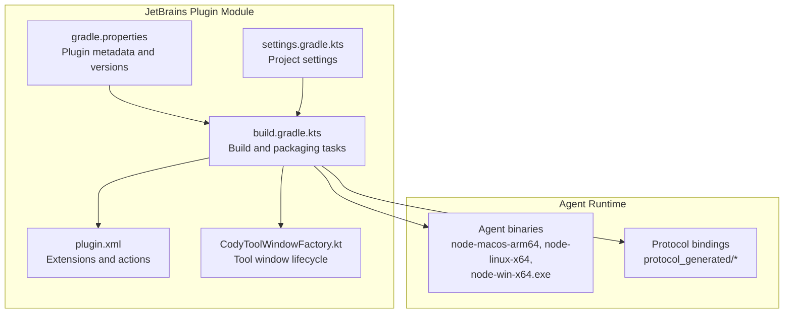
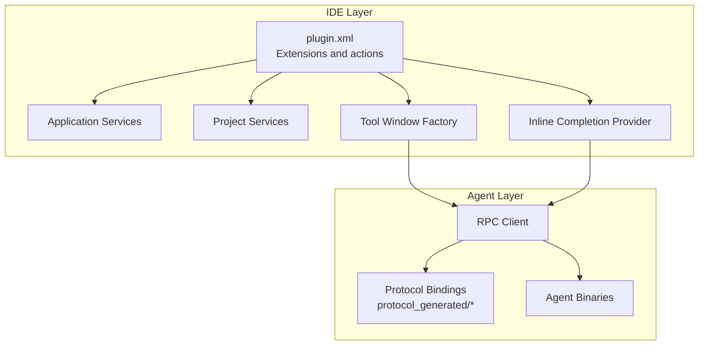
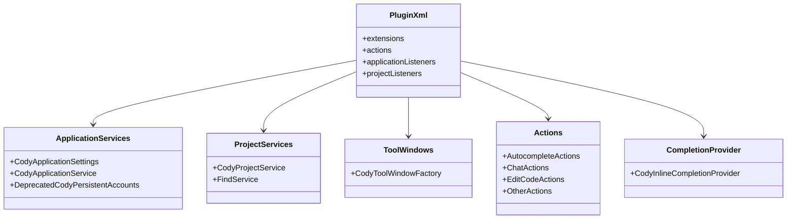
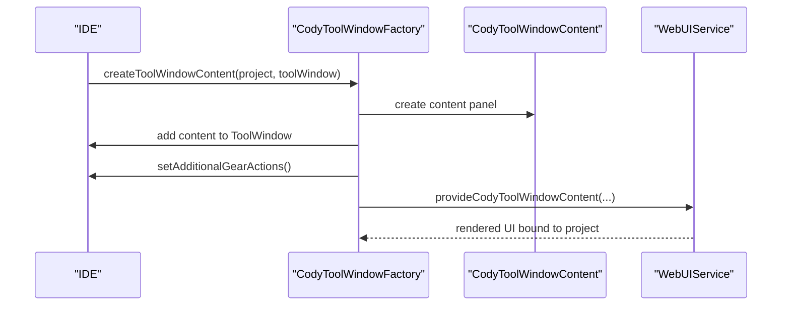
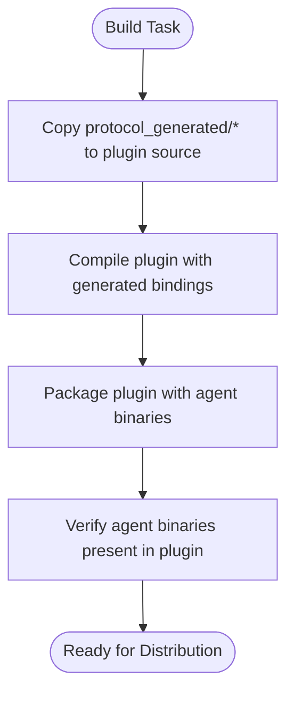
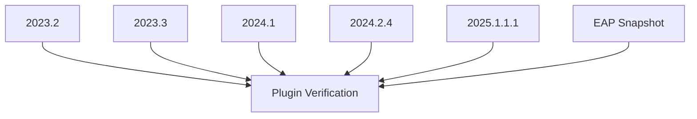
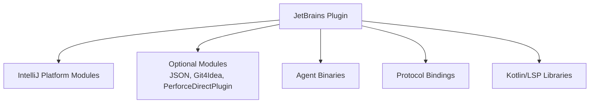

# Plugin Architecture

<cite>
**Referenced Files in This Document**
- [jetbrains/build.gradle.kts](file://jetbrains/build.gradle.kts)
- [jetbrains/settings.gradle.kts](file://jetbrains/settings.gradle.kts)
- [jetbrains/gradle.properties](file://jetbrains/gradle.properties)
- [jetbrains/src/main/resources/META-INF/plugin.xml](file://jetbrains/src/main/resources/META-INF/plugin.xml)
- [jetbrains/src/main/kotlin/com/sourcegraph/cody/CodyToolWindowFactory.kt](file://jetbrains/src/main/kotlin/com/sourcegraph/cody/CodyToolWindowFactory.kt)
- [agent/bindings/kotlin/lib/src/main/kotlin/com/sourcegraph/cody/agent/protocol_generated/AutocompleteParams.kt](file://agent/bindings/kotlin/lib/src/main/kotlin/com/sourcegraph/cody/agent/protocol_generated/AutocompleteParams.kt)
- [agent/bindings/kotlin/lib/src/main/kotlin/com/sourcegraph/cody/agent/protocol_generated/AutocompleteResult.kt](file://agent/bindings/kotlin/lib/src/main/kotlin/com/sourcegraph/cody/agent/protocol_generated/AutocompleteResult.kt)
</cite>

## Table of Contents
1. [Introduction](#introduction)
2. [Project Structure](#project-structure)
3. [Core Components](#core-components)
4. [Architecture Overview](#architecture-overview)
5. [Detailed Component Analysis](#detailed-component-analysis)
6. [Dependency Analysis](#dependency-analysis)
7. [Performance Considerations](#performance-considerations)
8. [Troubleshooting Guide](#troubleshooting-guide)
9. [Conclusion](#conclusion)

## Introduction
This document explains the JetBrains plugin architecture for the Cody AI assistant. It covers the overall plugin structure, component relationships, design patterns, agent service architecture, client-server communication patterns, plugin lifecycle management, plugin.xml configuration and extension points, service registrations, and multi-IDE compatibility. Architectural diagrams illustrate component interactions and data flow.

## Project Structure
The JetBrains plugin is implemented as a Kotlin/Java module built with the IntelliJ Platform Gradle Plugin. The build integrates the Cody agent runtime and bundles platform-specific binaries. The plugin declares extensions and actions via plugin.xml and registers services for application and project lifecycles.

**Diagram sources**
- [jetbrains/build.gradle.kts:502-531](file://jetbrains/build.gradle.kts#L502-L531)
- [jetbrains/src/main/resources/META-INF/plugin.xml:1-455](file://jetbrains/src/main/resources/META-INF/plugin.xml#L1-L455)
- [jetbrains/src/main/kotlin/com/sourcegraph/cody/CodyToolWindowFactory.kt:16-42](file://jetbrains/src/main/kotlin/com/sourcegraph/cody/CodyToolWindowFactory.kt#L16-L42)

**Section sources**
- [jetbrains/build.gradle.kts:1-632](file://jetbrains/build.gradle.kts#L1-L632)
- [jetbrains/settings.gradle.kts:1-8](file://jetbrains/settings.gradle.kts#L1-L8)
- [jetbrains/gradle.properties:1-27](file://jetbrains/gradle.properties#L1-L27)

## Core Components
- Build and packaging: Gradle builds the agent runtime, copies protocol bindings, and packages agent binaries into the plugin artifact. It also configures verification against multiple IDE versions.
- Plugin descriptor: plugin.xml defines services, tool windows, actions, listeners, and inline completion providers.
- Lifecycle factories: Tool window and startup activities manage UI and initialization.
- Agent integration: Protocol bindings define typed JSON-RPC messages exchanged with the embedded agent.

**Section sources**
- [jetbrains/build.gradle.kts:487-531](file://jetbrains/build.gradle.kts#L487-L531)
- [jetbrains/src/main/resources/META-INF/plugin.xml:19-136](file://jetbrains/src/main/resources/META-INF/plugin.xml#L19-L136)
- [jetbrains/src/main/kotlin/com/sourcegraph/cody/CodyToolWindowFactory.kt:16-42](file://jetbrains/src/main/kotlin/com/sourcegraph/cody/CodyToolWindowFactory.kt#L16-L42)
- [agent/bindings/kotlin/lib/src/main/kotlin/com/sourcegraph/cody/agent/protocol_generated/AutocompleteParams.kt](file://agent/bindings/kotlin/lib/src/main/kotlin/com/sourcegraph/cody/agent/protocol_generated/AutocompleteParams.kt)
- [agent/bindings/kotlin/lib/src/main/kotlin/com/sourcegraph/cody/agent/protocol_generated/AutocompleteResult.kt](file://agent/bindings/kotlin/lib/src/main/kotlin/com/sourcegraph/cody/agent/protocol_generated/AutocompleteResult.kt)

## Architecture Overview
The plugin architecture follows IntelliJ Platform patterns:
- Extension points register services, tool windows, actions, and inline completion providers.
- Application and project services encapsulate global and per-project state.
- The agent is launched and communicates via JSON-RPC using generated protocol types.
- Multi-IDE compatibility is achieved by targeting specific platform versions and using optional module dependencies.

**Diagram sources**
- [jetbrains/src/main/resources/META-INF/plugin.xml:19-136](file://jetbrains/src/main/resources/META-INF/plugin.xml#L19-L136)
- [jetbrains/src/main/kotlin/com/sourcegraph/cody/CodyToolWindowFactory.kt:16-42](file://jetbrains/src/main/kotlin/com/sourcegraph/cody/CodyToolWindowFactory.kt#L16-L42)
- [agent/bindings/kotlin/lib/src/main/kotlin/com/sourcegraph/cody/agent/protocol_generated/AutocompleteParams.kt](file://agent/bindings/kotlin/lib/src/main/kotlin/com/sourcegraph/cody/agent/protocol_generated/AutocompleteParams.kt)
- [agent/bindings/kotlin/lib/src/main/kotlin/com/sourcegraph/cody/agent/protocol_generated/AutocompleteResult.kt](file://agent/bindings/kotlin/lib/src/main/kotlin/com/sourcegraph/cody/agent/protocol_generated/AutocompleteResult.kt)

## Detailed Component Analysis

### Plugin Descriptor and Extension Points
The plugin.xml registers:
- Application and project services for configuration and state.
- Tool windows, status bar widgets, and file editor integrations.
- Actions grouped by functionality (autocomplete, chat, edit code, other).
- Inline completion provider for AI-assisted completions.
- Listeners for performance monitoring and editor events.
- Optional dependencies for Git and Perforce modules.

**Diagram sources**
- [jetbrains/src/main/resources/META-INF/plugin.xml:19-136](file://jetbrains/src/main/resources/META-INF/plugin.xml#L19-L136)

**Section sources**
- [jetbrains/src/main/resources/META-INF/plugin.xml:1-455](file://jetbrains/src/main/resources/META-INF/plugin.xml#L1-L455)

### Tool Window Lifecycle Management
The tool window factory creates and manages the Cody panel content, wires additional gear actions, and ensures availability based on feature flags and configuration.

**Diagram sources**
- [jetbrains/src/main/kotlin/com/sourcegraph/cody/CodyToolWindowFactory.kt:16-42](file://jetbrains/src/main/kotlin/com/sourcegraph/cody/CodyToolWindowFactory.kt#L16-L42)

**Section sources**
- [jetbrains/src/main/kotlin/com/sourcegraph/cody/CodyToolWindowFactory.kt:16-42](file://jetbrains/src/main/kotlin/com/sourcegraph/cody/CodyToolWindowFactory.kt#L16-L42)

### Agent Service Architecture and Protocol Bindings
The plugin embeds agent binaries and uses generated protocol bindings to communicate with the agent via JSON-RPC. The build task copies protocol-generated Kotlin types into the plugin’s source tree and ensures agent binaries are packaged into the plugin artifact.

**Diagram sources**
- [jetbrains/build.gradle.kts:420-462](file://jetbrains/build.gradle.kts#L420-L462)
- [jetbrains/build.gradle.kts:502-531](file://jetbrains/build.gradle.kts#L502-L531)

**Section sources**
- [jetbrains/build.gradle.kts:420-462](file://jetbrains/build.gradle.kts#L420-L462)
- [jetbrains/build.gradle.kts:502-531](file://jetbrains/build.gradle.kts#L502-L531)
- [agent/bindings/kotlin/lib/src/main/kotlin/com/sourcegraph/cody/agent/protocol_generated/AutocompleteParams.kt](file://agent/bindings/kotlin/lib/src/main/kotlin/com/sourcegraph/cody/agent/protocol_generated/AutocompleteParams.kt)
- [agent/bindings/kotlin/lib/src/main/kotlin/com/sourcegraph/cody/agent/protocol_generated/AutocompleteResult.kt](file://agent/bindings/kotlin/lib/src/main/kotlin/com/sourcegraph/cody/agent/protocol_generated/AutocompleteResult.kt)

### Multi-IDE Compatibility Layer
The build targets multiple IntelliJ Platform versions and configures optional module dependencies. Verification runs against a curated set of IDE versions to maintain compatibility.

**Diagram sources**
- [jetbrains/build.gradle.kts:32-43](file://jetbrains/build.gradle.kts#L32-L43)
- [jetbrains/build.gradle.kts:117-121](file://jetbrains/build.gradle.kts#L117-L121)

**Section sources**
- [jetbrains/build.gradle.kts:32-43](file://jetbrains/build.gradle.kts#L32-L43)
- [jetbrains/build.gradle.kts:117-121](file://jetbrains/build.gradle.kts#L117-L121)
- [jetbrains/gradle.properties:9-13](file://jetbrains/gradle.properties#L9-L13)

## Dependency Analysis
The plugin depends on:
- IntelliJ Platform modules and optional modules (JSON, Git4Idea, PerforceDirectPlugin).
- Bundled agent binaries and protocol bindings.
- Kotlin and LSP libraries for RPC and language features.

**Diagram sources**
- [jetbrains/src/main/resources/META-INF/plugin.xml:12-17](file://jetbrains/src/main/resources/META-INF/plugin.xml#L12-L17)
- [jetbrains/build.gradle.kts:123-150](file://jetbrains/build.gradle.kts#L123-L150)

**Section sources**
- [jetbrains/src/main/resources/META-INF/plugin.xml:12-17](file://jetbrains/src/main/resources/META-INF/plugin.xml#L12-L17)
- [jetbrains/build.gradle.kts:123-150](file://jetbrains/build.gradle.kts#L123-L150)

## Performance Considerations
- Use inline completion provider judiciously to avoid heavy computation on the UI thread.
- Minimize agent RPC overhead by batching requests and caching results where appropriate.
- Ensure agent binaries are cached locally to reduce distribution overhead during development.
- Keep protocol binding updates minimal to reduce recompilation churn.

## Troubleshooting Guide
- Missing agent binaries in plugin: The build verifies that agent binaries are included in the plugin artifact. Confirm the packaging task executed successfully.
- Compatibility failures: Use plugin verification against target IDE versions to identify and address compatibility issues.
- Action visibility: Ensure actions are registered under the correct groups and that keymaps are configured for the target OS.
- Tool window availability: Confirm feature flags and configuration gating before expecting the tool window to appear.

**Section sources**
- [jetbrains/build.gradle.kts:514-530](file://jetbrains/build.gradle.kts#L514-L530)
- [jetbrains/build.gradle.kts:117-121](file://jetbrains/build.gradle.kts#L117-L121)
- [jetbrains/src/main/resources/META-INF/plugin.xml:148-446](file://jetbrains/src/main/resources/META-INF/plugin.xml#L148-L446)

## Conclusion
The JetBrains plugin architecture leverages IntelliJ Platform extension points and services, integrates a packaged agent runtime with generated protocol bindings, and targets multiple IDE versions through careful build configuration. The plugin.xml declarative model, combined with lifecycle factories and service registrations, provides a robust foundation for autocomplete, chat, and editing features across IntelliJ-based IDEs.