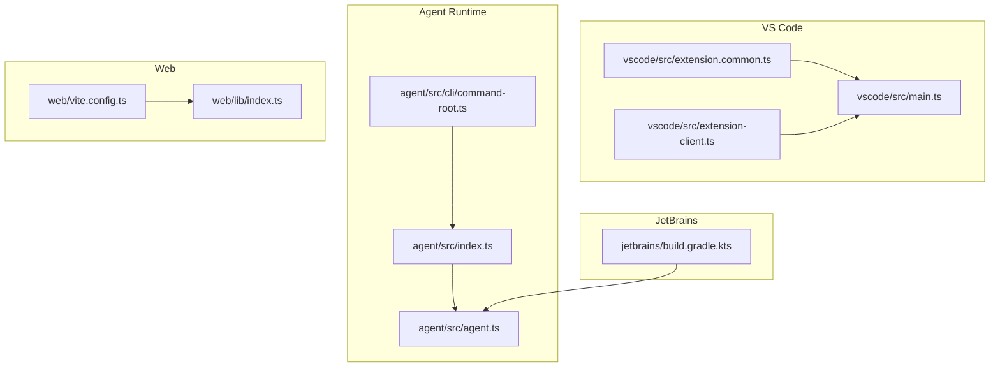
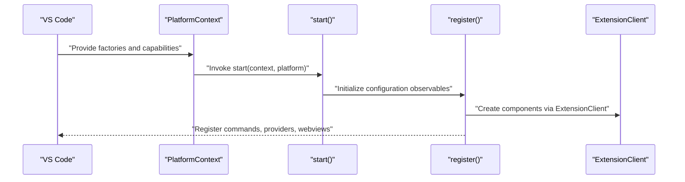
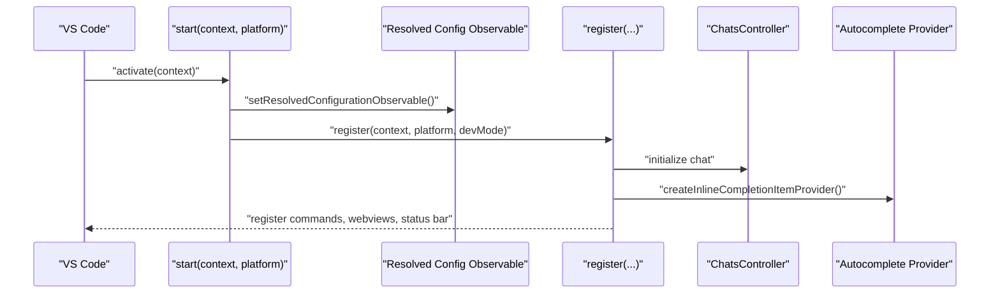
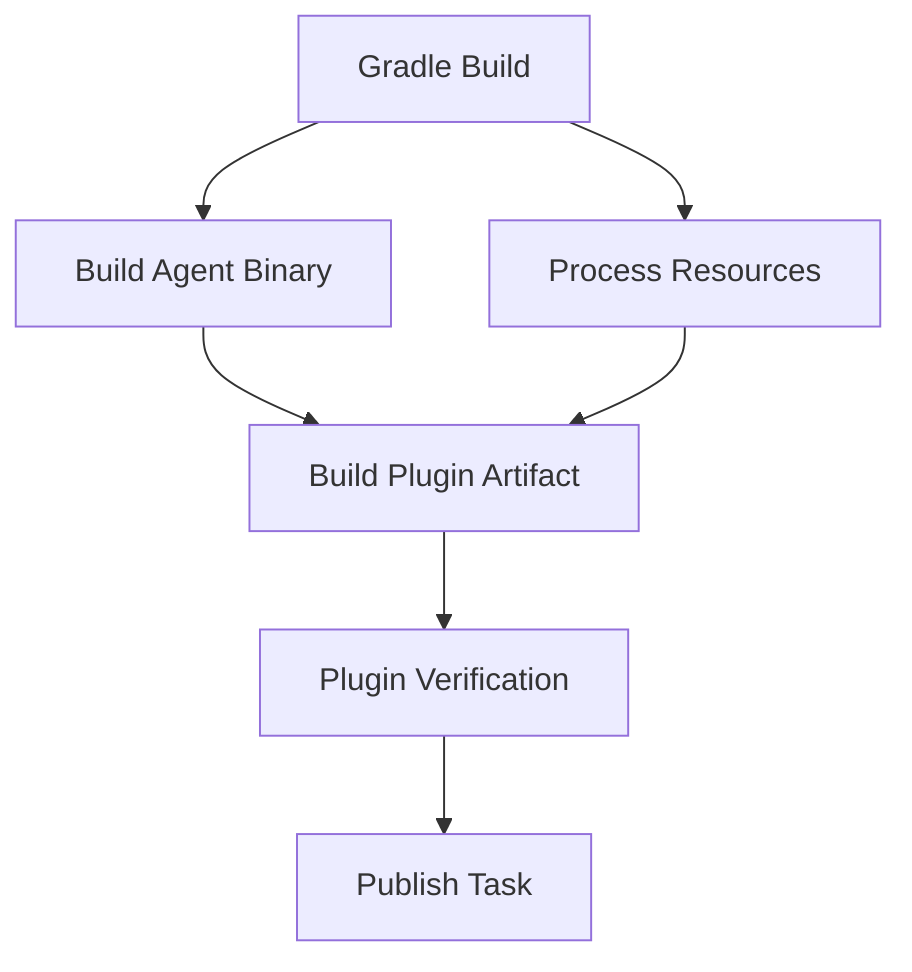
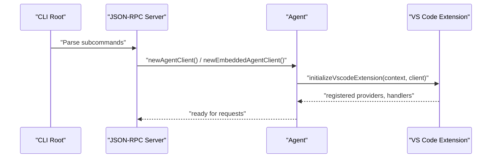
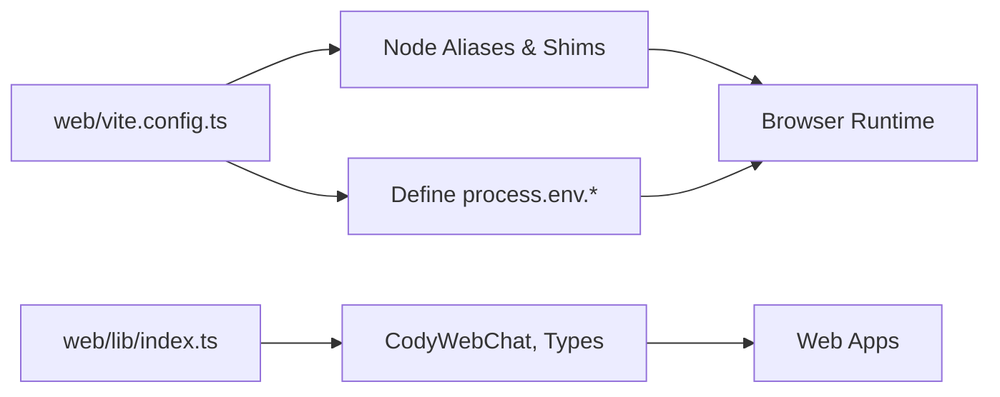
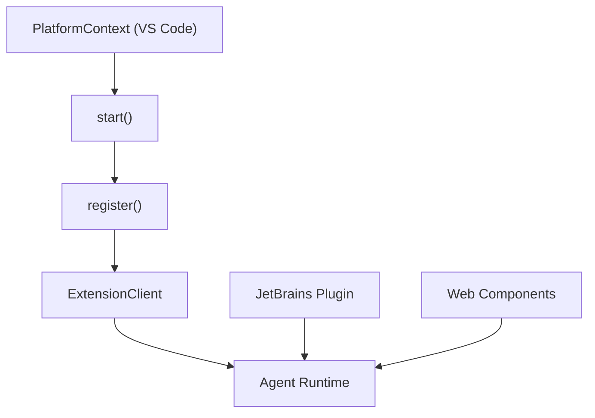

# Platform Integration

<cite>
**Referenced Files in This Document**
- [main.ts](file://vscode/src/main.ts)
- [extension.common.ts](file://vscode/src/extension.common.ts)
- [extension-client.ts](file://vscode/src/extension-client.ts)
- [index.ts](file://agent/src/index.ts)
- [agent.ts](file://agent/src/agent.ts)
- [command-root.ts](file://agent/src/cli/command-root.ts)
- [build.gradle.kts](file://jetbrains/build.gradle.kts)
- [vite.config.ts](file://web/vite.config.ts)
- [index.ts](file://web/lib/index.ts)
- [package.json](file://agent/package.json)
- [package.json](file://web/package.json)
</cite>

## Table of Contents
1. [Introduction](#introduction)
2. [Project Structure](#project-structure)
3. [Core Components](#core-components)
4. [Architecture Overview](#architecture-overview)
5. [Detailed Component Analysis](#detailed-component-analysis)
6. [Dependency Analysis](#dependency-analysis)
7. [Performance Considerations](#performance-considerations)
8. [Troubleshooting Guide](#troubleshooting-guide)
9. [Conclusion](#conclusion)
10. [Appendices](#appendices)

## Introduction
This document explains the multi-platform architecture that delivers consistent AI functionality across VS Code, JetBrains IDEs, the agent runtime, and web components. It details how platform-specific entry points, activation lifecycles, and abstractions enable feature parity while accommodating platform-specific capabilities. It also covers the agent runtime’s CLI interface, cross-platform communication, and web integration.

## Project Structure
The repository organizes platform integrations into focused packages:
- VS Code extension: activation, command registration, webview integration, and platform-specific features
- JetBrains plugin: Gradle-based build, multi-version support, and agent bundling
- Agent runtime: CLI entrypoint, JSON-RPC server, embedded agent, and VS Code extension shim
- Web components: Vite-based build, browser shims, and exported web chat APIs

**Diagram sources**
- [main.ts:122-214](file://vscode/src/main.ts#L122-L214)
- [extension.common.ts:44-77](file://vscode/src/extension.common.ts#L44-L77)
- [extension-client.ts:11-43](file://vscode/src/extension-client.ts#L11-L43)
- [index.ts:1-34](file://agent/src/index.ts#L1-L34)
- [agent.ts:195-283](file://agent/src/agent.ts#L195-L283)
- [command-root.ts:12-23](file://agent/src/cli/command-root.ts#L12-L23)
- [build.gradle.kts:502-531](file://jetbrains/build.gradle.kts#L502-L531)
- [vite.config.ts:25-136](file://web/vite.config.ts#L25-L136)
- [index.ts:1-20](file://web/lib/index.ts#L1-L20)

**Section sources**
- [main.ts:122-214](file://vscode/src/main.ts#L122-L214)
- [extension.common.ts:44-77](file://vscode/src/extension.common.ts#L44-L77)
- [extension-client.ts:11-43](file://vscode/src/extension-client.ts#L11-L43)
- [index.ts:1-34](file://agent/src/index.ts#L1-L34)
- [agent.ts:195-283](file://agent/src/agent.ts#L195-L283)
- [command-root.ts:12-23](file://agent/src/cli/command-root.ts#L12-L23)
- [build.gradle.kts:502-531](file://jetbrains/build.gradle.kts#L502-L531)
- [vite.config.ts:25-136](file://web/vite.config.ts#L25-L136)
- [index.ts:1-20](file://web/lib/index.ts#L1-L20)

## Core Components
- VS Code activation and registration: orchestrates configuration observables, external services, chat, autocomplete, commands, and platform-specific features
- Platform abstraction: a PlatformContext interface supplies platform-specific factories and capabilities to the shared activation routine
- Extension client: defines client capabilities and component creation delegated to the host (VS Code, Agent, etc.)
- Agent runtime: CLI entrypoint, JSON-RPC server, embedded agent, and VS Code extension initialization within the agent
- JetBrains plugin: Gradle build with multi-IDE support, agent bundling, and verification tasks
- Web components: Vite build with browser shims, exported web chat API, and demo mode

**Section sources**
- [main.ts:122-214](file://vscode/src/main.ts#L122-L214)
- [extension.common.ts:24-37](file://vscode/src/extension.common.ts#L24-L37)
- [extension-client.ts:11-43](file://vscode/src/extension-client.ts#L11-L43)
- [index.ts:1-34](file://agent/src/index.ts#L1-L34)
- [agent.ts:195-283](file://agent/src/agent.ts#L195-L283)
- [build.gradle.kts:502-531](file://jetbrains/build.gradle.kts#L502-L531)
- [vite.config.ts:25-136](file://web/vite.config.ts#L25-L136)
- [index.ts:1-20](file://web/lib/index.ts#L1-L20)

## Architecture Overview
The system uses a layered approach:
- Platform entry points initialize platform-specific contexts and capabilities
- Shared activation routines consume configuration observables and register features
- The agent runtime exposes a JSON-RPC interface for cross-platform communication
- Web components provide a browser-based integration with platform-specific shims

**Diagram sources**
- [extension.common.ts:44-77](file://vscode/src/extension.common.ts#L44-L77)
- [main.ts:122-214](file://vscode/src/main.ts#L122-L214)
- [extension-client.ts:11-43](file://vscode/src/extension-client.ts#L11-L43)

## Detailed Component Analysis

### VS Code Extension Architecture
- Activation lifecycle: sets logger, client capabilities, resolved configuration observable, and registers commands and providers
- Command registration: centralizes command execution, chat commands, auth commands, and debug commands
- Webview integration: manages chat panels, status bar, and MCP manager based on feature flags
- Platform-specific features: VS Code-only commands and terminal integration

**Diagram sources**
- [main.ts:122-214](file://vscode/src/main.ts#L122-L214)
- [main.ts:257-356](file://vscode/src/main.ts#L257-L356)
- [main.ts:731-784](file://vscode/src/main.ts#L731-L784)

**Section sources**
- [main.ts:122-214](file://vscode/src/main.ts#L122-L214)
- [main.ts:257-356](file://vscode/src/main.ts#L257-L356)
- [main.ts:731-784](file://vscode/src/main.ts#L731-L784)
- [extension.common.ts:44-77](file://vscode/src/extension.common.ts#L44-L77)
- [extension-client.ts:11-43](file://vscode/src/extension-client.ts#L11-L43)

### JetBrains Plugin Implementation
- Multi-IDE support: Gradle configuration targets multiple IntelliJ platform versions
- Plugin packaging: builds and bundles the agent runtime and webviews into the plugin artifact
- Testing and verification: integration tests and plugin verifier configuration

**Diagram sources**
- [build.gradle.kts:394-419](file://jetbrains/build.gradle.kts#L394-L419)
- [build.gradle.kts:502-531](file://jetbrains/build.gradle.kts#L502-L531)
- [build.gradle.kts:577-631](file://jetbrains/build.gradle.kts#L577-L631)

**Section sources**
- [build.gradle.kts:32-631](file://jetbrains/build.gradle.kts#L32-L631)

### Agent Runtime System
- CLI interface: root command groups authentication, chat, models, and API subcommands
- JSON-RPC server: initializes the VS Code extension inside the agent, handles workspace/document events, and exposes authenticated requests
- Embedded agent: creates a message connection to embed the agent within another process
- Cross-platform communication: uses JSON-RPC stdio and websocket variants

**Diagram sources**
- [command-root.ts:12-23](file://agent/src/cli/command-root.ts#L12-L23)
- [index.ts:1-34](file://agent/src/index.ts#L1-L34)
- [agent.ts:195-283](file://agent/src/agent.ts#L195-L283)

**Section sources**
- [index.ts:1-34](file://agent/src/index.ts#L1-L34)
- [agent.ts:195-283](file://agent/src/agent.ts#L195-L283)
- [command-root.ts:12-23](file://agent/src/cli/command-root.ts#L12-L23)
- [package.json:13-26](file://agent/package.json#L13-L26)

### Web Components Architecture
- Browser integration: Vite configuration aliases Node built-ins and provides browser shims for FS, OS, streams, and more
- Exported API: web library exports chat components and types for embedding in browsers
- Demo mode: development server with demo flags and standalone mode support

**Diagram sources**
- [vite.config.ts:25-136](file://web/vite.config.ts#L25-L136)
- [index.ts:1-20](file://web/lib/index.ts#L1-L20)

**Section sources**
- [vite.config.ts:25-136](file://web/vite.config.ts#L25-L136)
- [index.ts:1-20](file://web/lib/index.ts#L1-L20)
- [package.json:15-21](file://web/package.json#L15-L21)

## Dependency Analysis
- VS Code relies on a shared PlatformContext to supply platform-specific factories and capabilities, enabling a single activation routine to adapt to different hosts
- Agent runtime depends on the VS Code extension’s activation entrypoint and JSON-RPC protocol to expose IDE-like functionality to non-IDE clients
- JetBrains plugin depends on the agent build artifacts and bundles them into the plugin distribution
- Web components depend on Vite aliases and browser shims to emulate Node APIs and integrate with the shared VS Code UI components

**Diagram sources**
- [extension.common.ts:24-37](file://vscode/src/extension.common.ts#L24-L37)
- [main.ts:122-214](file://vscode/src/main.ts#L122-L214)
- [extension-client.ts:11-43](file://vscode/src/extension-client.ts#L11-L43)
- [agent.ts:195-283](file://agent/src/agent.ts#L195-L283)
- [build.gradle.kts:502-531](file://jetbrains/build.gradle.kts#L502-L531)
- [vite.config.ts:25-136](file://web/vite.config.ts#L25-L136)

**Section sources**
- [extension.common.ts:24-37](file://vscode/src/extension.common.ts#L24-L37)
- [main.ts:122-214](file://vscode/src/main.ts#L122-L214)
- [extension-client.ts:11-43](file://vscode/src/extension-client.ts#L11-L43)
- [agent.ts:195-283](file://agent/src/agent.ts#L195-L283)
- [build.gradle.kts:502-531](file://jetbrains/build.gradle.kts#L502-L531)
- [vite.config.ts:25-136](file://web/vite.config.ts#L25-L136)

## Performance Considerations
- Lazy initialization: features are enabled conditionally based on resolved configuration and feature flags to avoid unnecessary overhead
- Streaming and caching: autocomplete and context retrieval are optimized through providers and caches
- Agent bundling: the JetBrains plugin bundles agent binaries per platform to reduce startup overhead
- Web build: Vite aliases and shims minimize bundle size and improve load performance in browsers

[No sources needed since this section provides general guidance]

## Troubleshooting Guide
- Activation errors: exceptions during activation are captured and logged; verify network agent initialization and platform context setup
- Configuration observables: ensure resolved configuration observable is set before initializing external services
- Agent runtime: confirm JSON-RPC stdio connections and initialize the VS Code extension within the agent
- Web components: validate Vite aliases and process.env overrides for browser compatibility

**Section sources**
- [extension.common.ts:72-76](file://vscode/src/extension.common.ts#L72-L76)
- [main.ts:151-203](file://vscode/src/main.ts#L151-L203)
- [agent.ts:434-498](file://agent/src/agent.ts#L434-L498)
- [vite.config.ts:94-113](file://web/vite.config.ts#L94-L113)

## Conclusion
The platform integration architecture achieves feature parity across VS Code, JetBrains IDEs, the agent runtime, and web components by:
- Using a shared activation routine with a platform abstraction
- Providing a JSON-RPC interface for cross-platform communication
- Bundling and distributing the agent runtime with platform-specific artifacts
- Enabling browser-based integration through Vite and Node shims

[No sources needed since this section summarizes without analyzing specific files]

## Appendices
- Platform-specific configuration options:
  - VS Code: configuration observables, feature flags, and client capabilities
  - JetBrains: Gradle properties for versions, plugins, and verification
  - Agent: CLI commands for authentication, chat, models, and API
  - Web: Vite define directives and demo flags
- Compatibility requirements:
  - VS Code: extension activation lifecycle and command registration
  - JetBrains: multi-IDE platform versions and plugin verification
  - Agent: Node.js runtime and JSON-RPC protocol
  - Web: browser shims and Vite build pipeline
- Deployment considerations:
  - VS Code: extension packaging and marketplace publishing
  - JetBrains: plugin build, signing, and publishing
  - Agent: binary bundling and distribution
  - Web: static asset generation and demo mode

**Section sources**
- [main.ts:144-147](file://vscode/src/main.ts#L144-L147)
- [build.gradle.kts:32-631](file://jetbrains/build.gradle.kts#L32-L631)
- [command-root.ts:12-23](file://agent/src/cli/command-root.ts#L12-L23)
- [vite.config.ts:94-113](file://web/vite.config.ts#L94-L113)
- [package.json:28-36](file://agent/package.json#L28-L36)
- [package.json:15-21](file://web/package.json#L15-L21)