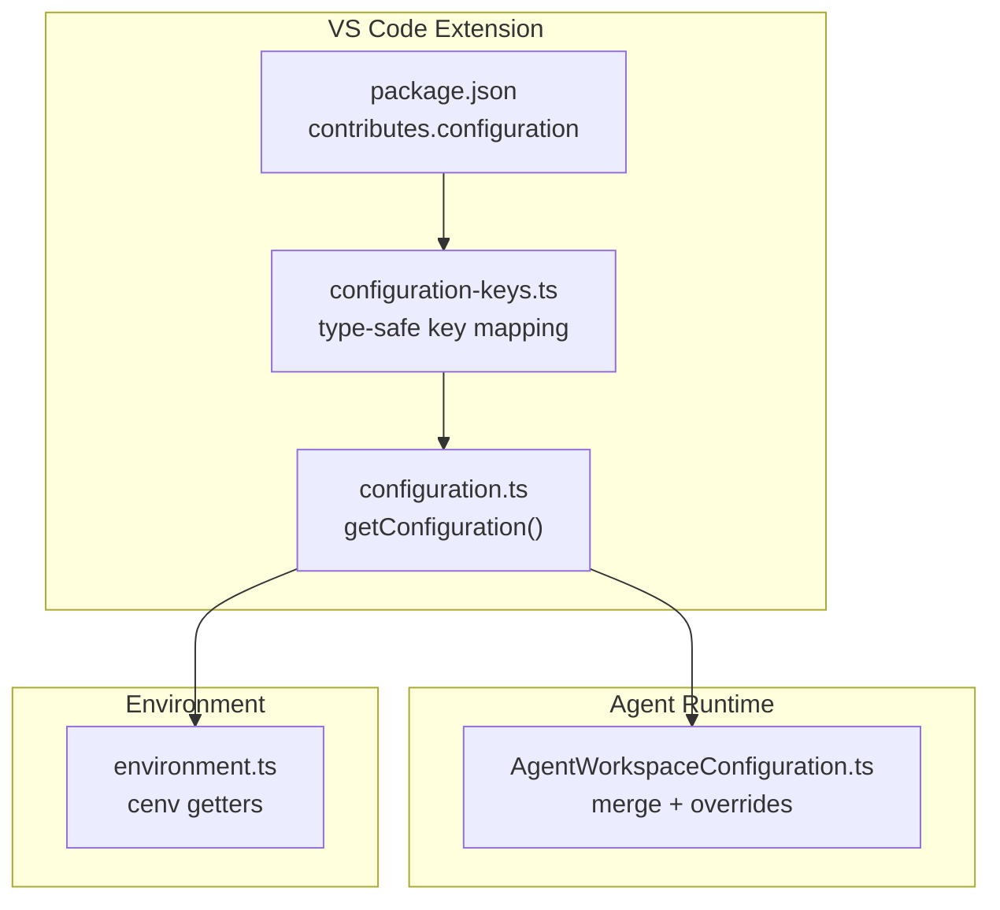
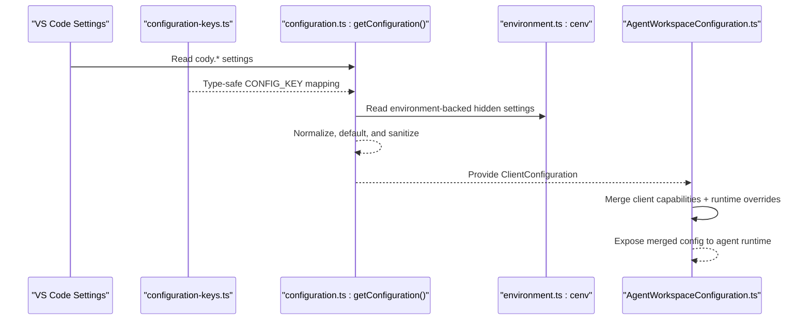
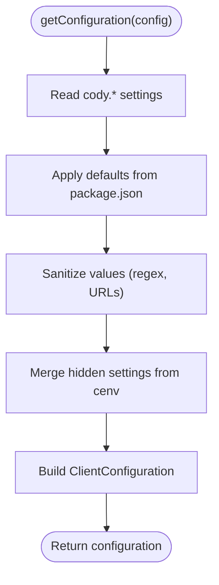
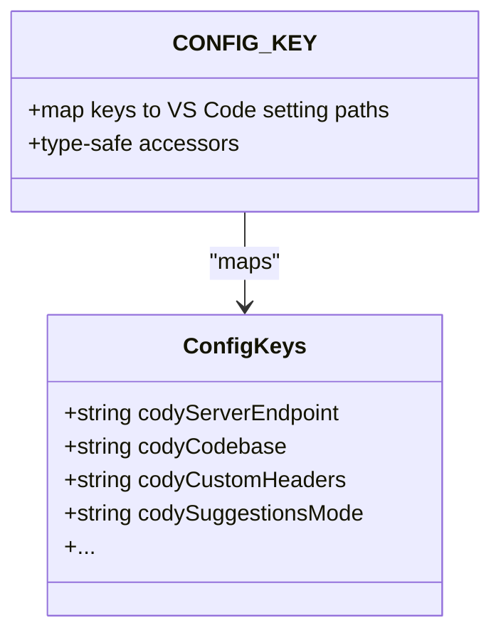
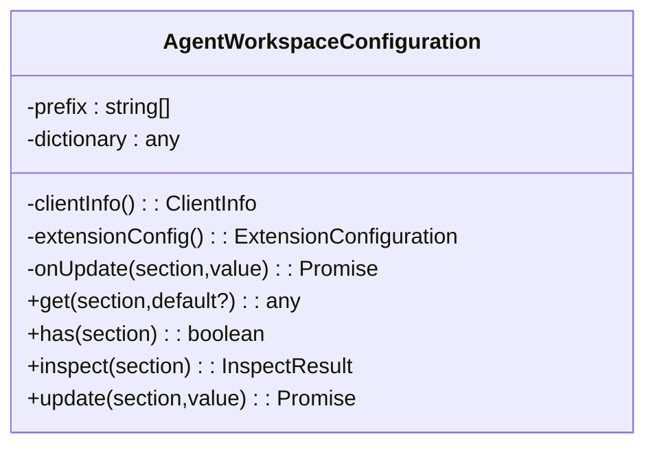
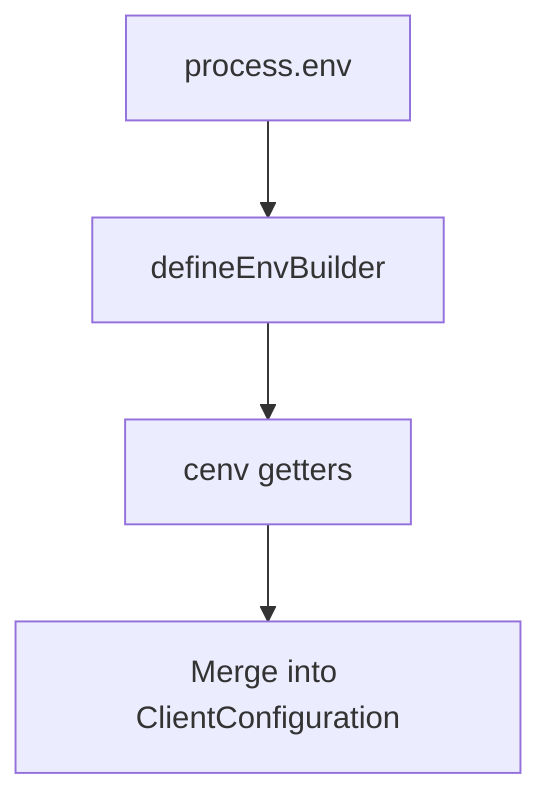
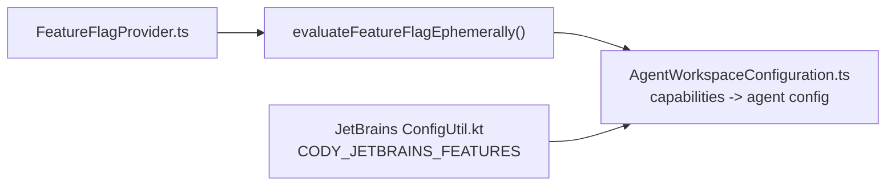
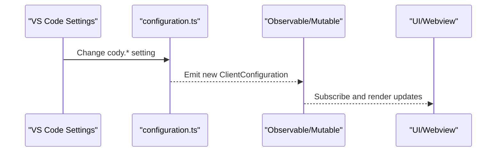
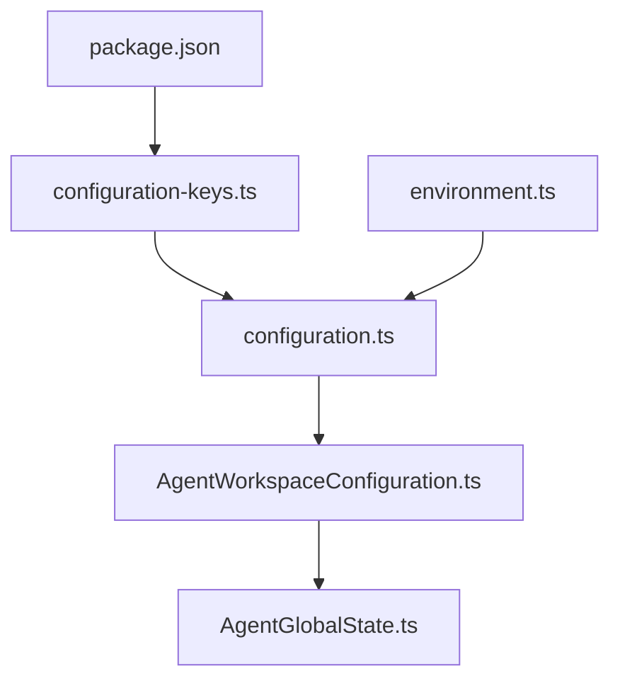

# Configuration Management

<cite>
**Referenced Files in This Document**
- [configuration.ts](file://vscode/src/configuration.ts)
- [configuration-keys.ts](file://vscode/src/configuration-keys.ts)
- [package.json](file://vscode/package.json)
- [AgentWorkspaceConfiguration.ts](file://agent/src/AgentWorkspaceConfiguration.ts)
- [environment.ts](file://lib/shared/src/configuration/environment.ts)
- [configuration.test.ts](file://vscode/src/configuration.test.ts)
- [configuration.test.ts](file://agent/src/configuration.test.ts)
- [FeatureFlagProvider.ts](file://lib/shared/src/experimentation/FeatureFlagProvider.ts)
- [ConfigUtil.kt](file://jetbrains/src/main/kotlin/com/sourcegraph/config/ConfigUtil.kt)
- [AgentGlobalState.ts](file://agent/src/global-state/AgentGlobalState.ts)
</cite>

## Table of Contents
1. [Introduction](#introduction)
2. [Project Structure](#project-structure)
3. [Core Components](#core-components)
4. [Architecture Overview](#architecture-overview)
5. [Detailed Component Analysis](#detailed-component-analysis)
6. [Dependency Analysis](#dependency-analysis)
7. [Performance Considerations](#performance-considerations)
8. [Troubleshooting Guide](#troubleshooting-guide)
9. [Conclusion](#conclusion)

## Introduction
This document explains the configuration management system for the VS Code extension, detailing how user/workspace settings, environment variables, and agent runtime settings are unified into a single typed configuration surface. It covers validation, defaults, type safety, observability, feature flags, capability detection, environment-specific behavior, migration strategies, and troubleshooting.

## Project Structure
The configuration system spans three primary areas:
- VS Code extension configuration: user/workspace settings and defaults defined in package.json, consumed and sanitized in the extension.
- Agent runtime configuration: a specialized workspace configuration adapter used by the agent to merge extension settings, client capabilities, and dynamic overrides.
- Environment variables: a controlled layer for platform-level and testing overrides.

**Diagram sources**
- [package.json:877-1271](file://vscode/package.json#L877-L1271)
- [configuration-keys.ts:18-54](file://vscode/src/configuration-keys.ts#L18-L54)
- [configuration.ts:25-204](file://vscode/src/configuration.ts#L25-L204)
- [AgentWorkspaceConfiguration.ts:10-160](file://agent/src/AgentWorkspaceConfiguration.ts#L10-L160)
- [environment.ts:22-85](file://lib/shared/src/configuration/environment.ts#L22-L85)

**Section sources**
- [package.json:877-1271](file://vscode/package.json#L877-L1271)
- [configuration-keys.ts:18-54](file://vscode/src/configuration-keys.ts#L18-L54)
- [configuration.ts:25-204](file://vscode/src/configuration.ts#L25-L204)
- [AgentWorkspaceConfiguration.ts:10-160](file://agent/src/AgentWorkspaceConfiguration.ts#L10-L160)
- [environment.ts:22-85](file://lib/shared/src/configuration/environment.ts#L22-L85)

## Core Components
- Type-safe configuration keys: derived from package.json to prevent drift and ensure compile-time safety.
- Configuration sanitizer: reads VS Code settings, applies defaults, normalizes values, and merges hidden/internal settings from environment variables.
- Agent workspace configuration: merges extension configuration, client capabilities, and runtime overrides into a single configuration surface for the agent.
- Environment variable layer: controlled getters for platform-level and testing overrides.

Key responsibilities:
- Validation and defaults: enforced by package.json and applied in getConfiguration().
- Type safety: CONFIG_KEY maps keys to strongly-typed accessors.
- Observability: configuration changes can be observed via reactive streams (see Detailed Component Analysis).
- Feature flags: server-side evaluation and environment-based toggles.
- Environment-specific behavior: proxy settings, UI kind overrides, and testing flags.

**Section sources**
- [configuration.ts:25-204](file://vscode/src/configuration.ts#L25-L204)
- [configuration-keys.ts:18-54](file://vscode/src/configuration-keys.ts#L18-L54)
- [package.json:877-1271](file://vscode/package.json#L877-L1271)
- [AgentWorkspaceConfiguration.ts:10-160](file://agent/src/AgentWorkspaceConfiguration.ts#L10-L160)
- [environment.ts:22-85](file://lib/shared/src/configuration/environment.ts#L22-L85)

## Architecture Overview
The configuration pipeline integrates VS Code settings, environment variables, and agent runtime context into a unified ClientConfiguration object.

**Diagram sources**
- [configuration.ts:25-204](file://vscode/src/configuration.ts#L25-L204)
- [configuration-keys.ts:18-54](file://vscode/src/configuration-keys.ts#L18-L54)
- [environment.ts:22-85](file://lib/shared/src/configuration/environment.ts#L22-L85)
- [AgentWorkspaceConfiguration.ts:10-160](file://agent/src/AgentWorkspaceConfiguration.ts#L10-L160)

## Detailed Component Analysis

### VS Code Configuration Reader
- Reads user/workspace settings via a ConfigGetter abstraction.
- Applies defaults from package.json and sanitizes values (e.g., debug filter regex, codebase normalization).
- Merges hidden/internal settings from environment variables via cenv.
- Produces a ClientConfiguration object consumed across the extension.

**Diagram sources**
- [configuration.ts:25-204](file://vscode/src/configuration.ts#L25-L204)
- [package.json:877-1271](file://vscode/package.json#L877-L1271)
- [environment.ts:22-85](file://lib/shared/src/configuration/environment.ts#L22-L85)

**Section sources**
- [configuration.ts:25-204](file://vscode/src/configuration.ts#L25-L204)
- [configuration.test.ts:15-220](file://vscode/src/configuration.test.ts#L15-L220)

### Type-Safe Configuration Keys
- Derives configuration keys from package.json contributes.configuration.
- Provides CONFIG_KEY for strongly-typed access, preventing typos and ensuring alignment with defaults.

**Diagram sources**
- [configuration-keys.ts:18-54](file://vscode/src/configuration-keys.ts#L18-L54)
- [package.json:877-1271](file://vscode/package.json#L877-L1271)

**Section sources**
- [configuration-keys.ts:18-54](file://vscode/src/configuration-keys.ts#L18-L54)
- [package.json:877-1271](file://vscode/package.json#L877-L1271)

### Agent Workspace Configuration
- Merges extension configuration, client capabilities, and runtime overrides into a single workspace configuration surface for the agent.
- Supports nested merging, dictionary overrides, and inspection of effective values.
- Converts client info (IDE, capabilities) into agent-readable shapes.

**Diagram sources**
- [AgentWorkspaceConfiguration.ts:10-160](file://agent/src/AgentWorkspaceConfiguration.ts#L10-L160)

**Section sources**
- [AgentWorkspaceConfiguration.ts:10-160](file://agent/src/AgentWorkspaceConfiguration.ts#L10-L160)

### Environment Variables and Hidden Settings
- Controlled environment-backed settings via cenv getters.
- Used for proxy defaults, UI kind overrides, testing flags, and internal unstable features.
- Hidden settings (prefixed with cody.internal.*) are merged into ClientConfiguration.

**Diagram sources**
- [environment.ts:22-85](file://lib/shared/src/configuration/environment.ts#L22-L85)
- [configuration.ts:132-202](file://vscode/src/configuration.ts#L132-L202)

**Section sources**
- [environment.ts:22-85](file://lib/shared/src/configuration/environment.ts#L22-L85)
- [configuration.ts:132-202](file://vscode/src/configuration.ts#L132-L202)

### Feature Flags and Capability Detection
- Server-side feature flags are evaluated and exposed via a provider; agent runtime can also use environment-based toggles.
- Client capabilities (e.g., globalState, webview) influence agent configuration.

**Diagram sources**
- [FeatureFlagProvider.ts:334-358](file://lib/shared/src/experimentation/FeatureFlagProvider.ts#L334-L358)
- [AgentWorkspaceConfiguration.ts:64-91](file://agent/src/AgentWorkspaceConfiguration.ts#L64-L91)
- [ConfigUtil.kt:69-93](file://jetbrains/src/main/kotlin/com/sourcegraph/config/ConfigUtil.kt#L69-L93)

**Section sources**
- [FeatureFlagProvider.ts:334-358](file://lib/shared/src/experimentation/FeatureFlagProvider.ts#L334-L358)
- [AgentWorkspaceConfiguration.ts:64-91](file://agent/src/AgentWorkspaceConfiguration.ts#L64-L91)
- [ConfigUtil.kt:69-93](file://jetbrains/src/main/kotlin/com/sourcegraph/config/ConfigUtil.kt#L69-L93)

### Reactive Updates and Observability
- Configuration changes can be observed via reactive streams (e.g., mutable.ts, observable.ts) to drive UI updates and feature toggles.
- Example patterns:
  - Mutable<T> with a changes observable for change detection.
  - Observable utilities for distinct updates, debouncing, and subscription lifecycle.

**Diagram sources**
- [configuration.ts:25-204](file://vscode/src/configuration.ts#L25-L204)
- [lib/shared/src/misc/mutable.ts:40-61](file://lib/shared/src/misc/mutable.ts#L40-L61)
- [lib/shared/src/misc/observable.ts:622-1062](file://lib/shared/src/misc/observable.ts#L622-L1062)

**Section sources**
- [configuration.ts:25-204](file://vscode/src/configuration.ts#L25-L204)
- [lib/shared/src/misc/mutable.ts:40-61](file://lib/shared/src/misc/mutable.ts#L40-L61)
- [lib/shared/src/misc/observable.ts:622-1062](file://lib/shared/src/misc/observable.ts#L622-L1062)

### Configuration Usage Examples
- Reading configuration in extension code:
  - Use getConfiguration() to obtain a typed ClientConfiguration.
  - Access nested fields like autocomplete settings, proxy configuration, and telemetry level.
- Agent runtime usage:
  - AgentWorkspaceConfiguration.get() resolves effective values from extension config, client capabilities, and runtime overrides.
  - AgentWorkspaceConfiguration.update() persists runtime overrides and notifies subscribers.

**Section sources**
- [configuration.ts:25-204](file://vscode/src/configuration.ts#L25-L204)
- [AgentWorkspaceConfiguration.ts:59-160](file://agent/src/AgentWorkspaceConfiguration.ts#L59-L160)

### Migration Strategies
- VS Code settings migration:
  - Backward compatibility handling (e.g., renaming auto-edit suggestion mode) is performed during configuration read.
  - Unit tests validate default and migrated values.
- JetBrains client migration:
  - Temporary client configuration cleanup and migration logic exists to maintain clean settings across upgrades.

**Section sources**
- [configuration.ts:59-72](file://vscode/src/configuration.ts#L59-L72)
- [configuration.test.ts:15-220](file://vscode/src/configuration.test.ts#L15-L220)
- [ClientConfigCleanupMigrationTest.kt:1-128](file://jetbrains/src/test/kotlin/com/sourcegraph/cody/config/migration/ClientConfigCleanupMigrationTest.kt#L1-L128)

## Dependency Analysis
- VS Code extension depends on:
  - package.json for schema and defaults.
  - configuration-keys.ts for type-safe key mapping.
  - configuration.ts for reading and sanitizing settings.
  - environment.ts for environment-backed hidden settings.
- Agent runtime depends on:
  - AgentWorkspaceConfiguration.ts to merge extension config, client capabilities, and runtime overrides.
  - AgentGlobalState.ts for persistent state management in agent contexts.

**Diagram sources**
- [package.json:877-1271](file://vscode/package.json#L877-L1271)
- [configuration-keys.ts:18-54](file://vscode/src/configuration-keys.ts#L18-L54)
- [configuration.ts:25-204](file://vscode/src/configuration.ts#L25-L204)
- [environment.ts:22-85](file://lib/shared/src/configuration/environment.ts#L22-L85)
- [AgentWorkspaceConfiguration.ts:10-160](file://agent/src/AgentWorkspaceConfiguration.ts#L10-L160)
- [AgentGlobalState.ts](file://agent/src/global-state/AgentGlobalState.ts)

**Section sources**
- [package.json:877-1271](file://vscode/package.json#L877-L1271)
- [configuration-keys.ts:18-54](file://vscode/src/configuration-keys.ts#L18-L54)
- [configuration.ts:25-204](file://vscode/src/configuration.ts#L25-L204)
- [environment.ts:22-85](file://lib/shared/src/configuration/environment.ts#L22-L85)
- [AgentWorkspaceConfiguration.ts:10-160](file://agent/src/AgentWorkspaceConfiguration.ts#L10-L160)
- [AgentGlobalState.ts](file://agent/src/global-state/AgentGlobalState.ts)

## Performance Considerations
- Avoid excessive recomputation: cache sanitized values and use distinctUntilChanged in observables.
- Minimize deep merges: prefer targeted updates and shallow merges where possible.
- Network stack choice: cody.net.mode allows bypassing VS Code’s network stack for performance-sensitive environments.

## Troubleshooting Guide
Common issues and resolutions:
- Regex debug filter errors:
  - The system catches invalid regex patterns and falls back to a default filter. Check the error message and correct the pattern.
- Proxy configuration problems:
  - Validate cody.net.proxy.endpoint and related fields. Consider cody.net.mode to bypass or use VS Code’s network stack.
- Hidden settings not taking effect:
  - Ensure environment variables are set before launching the extension. Hidden settings are merged from cenv.
- Agent runtime mismatch:
  - Verify client capabilities and IDE metadata are correctly passed to AgentWorkspaceConfiguration. Use inspect() to compare effective values against defaults.

**Section sources**
- [configuration.ts:32-48](file://vscode/src/configuration.ts#L32-L48)
- [package.json:1153-1175](file://vscode/package.json#L1153-L1175)
- [AgentWorkspaceConfiguration.ts:162-191](file://agent/src/AgentWorkspaceConfiguration.ts#L162-L191)

## Conclusion
The configuration system provides a robust, type-safe, and extensible foundation for managing VS Code and agent runtime settings. By combining VS Code settings, environment variables, and client capabilities, it delivers a unified configuration surface with strong validation, defaults, and observability. Feature flags and capability detection further tailor behavior across environments, while migration strategies ensure smooth upgrades.