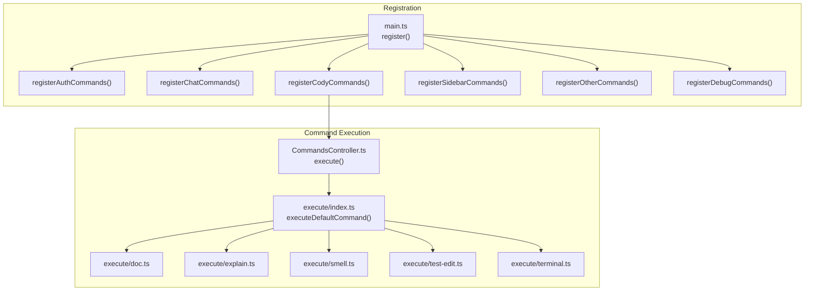
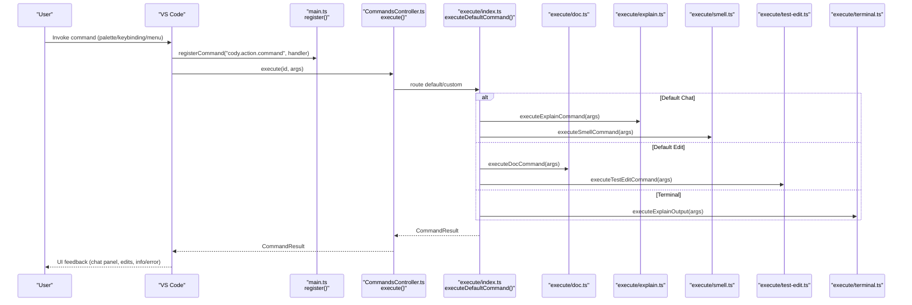
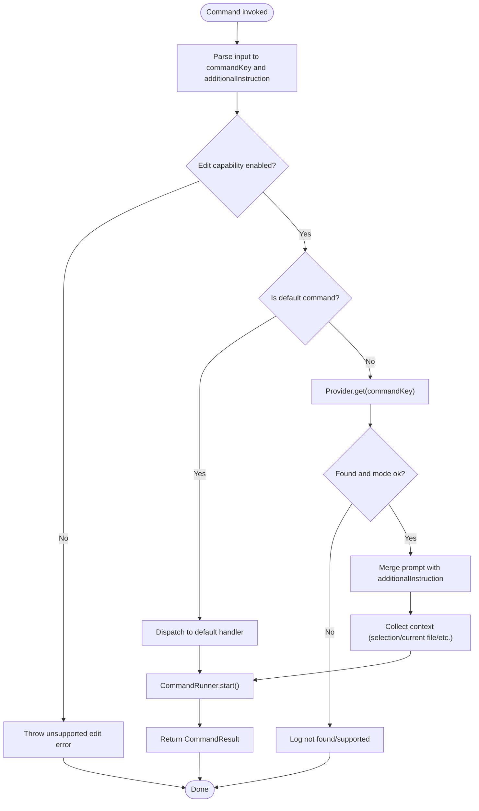
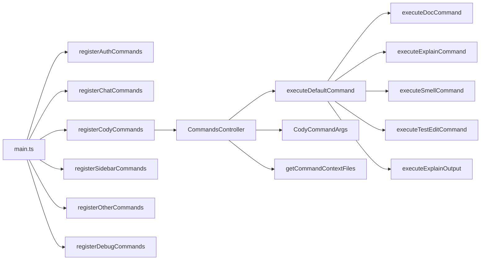

# Extension API Surface

<cite>
**Referenced Files in This Document**
- [main.ts](file://vscode/src/main.ts)
- [extension-api.ts](file://vscode/src/extension-api.ts)
- [commands/index.ts](file://vscode/src/commands/index.ts)
- [commands/CommandsController.ts](file://vscode/src/commands/CommandsController.ts)
- [commands/types.ts](file://vscode/src/commands/types.ts)
- [commands/execute/index.ts](file://vscode/src/commands/execute/index.ts)
- [commands/execute/doc.ts](file://vscode/src/commands/execute/doc.ts)
- [commands/execute/explain.ts](file://vscode/src/commands/execute/explain.ts)
- [commands/execute/smell.ts](file://vscode/src/commands/execute/smell.ts)
- [commands/execute/test-edit.ts](file://vscode/src/commands/execute/test-edit.ts)
- [commands/execute/terminal.ts](file://vscode/src/commands/execute/terminal.ts)
- [commands/context/index.ts](file://vscode/src/commands/context/index.ts)
- [services/SidebarCommands.ts](file://vscode/src/services/SidebarCommands.ts)
</cite>

## Table of Contents
1. [Introduction](#introduction)
2. [Project Structure](#project-structure)
3. [Core Components](#core-components)
4. [Architecture Overview](#architecture-overview)
5. [Detailed Component Analysis](#detailed-component-analysis)
6. [Dependency Analysis](#dependency-analysis)
7. [Performance Considerations](#performance-considerations)
8. [Troubleshooting Guide](#troubleshooting-guide)
9. [Conclusion](#conclusion)

## Introduction
This document describes the VS Code extension API surface for the Cody extension. It covers all registered commands, including Cody commands, authentication commands, chat commands, and utility commands. It explains command registration patterns, parameter handling, return value specifications, the command execution pipeline, error handling, and user feedback mechanisms. It also details how commands integrate with the VS Code command palette, context menus, and keybindings, and how they relate to underlying services.

## Project Structure
The extension’s command surface is primarily implemented under the vscode/src directory. Key areas:
- Registration and orchestration: main.ts
- Public extension API surface: extension-api.ts
- Command menu items and built-in commands: commands/index.ts
- Command execution controller: commands/CommandsController.ts
- Command argument types: commands/types.ts
- Default command handlers: commands/execute/*
- Context collection utilities: commands/context/index.ts
- Sidebar command integrations: services/SidebarCommands.ts

**Diagram sources**
- [main.ts:217-357](file://vscode/src/main.ts#L217-L357)
- [commands/CommandsController.ts:54-99](file://vscode/src/commands/CommandsController.ts#L54-L99)
- [commands/execute/index.ts:49-69](file://vscode/src/commands/execute/index.ts#L49-L69)
- [commands/execute/doc.ts:204-259](file://vscode/src/commands/execute/doc.ts#L204-L259)
- [commands/execute/explain.ts:62-108](file://vscode/src/commands/execute/explain.ts#L62-L108)
- [commands/execute/smell.ts:62-107](file://vscode/src/commands/execute/smell.ts#L62-L107)
- [commands/execute/test-edit.ts:79-147](file://vscode/src/commands/execute/test-edit.ts#L79-L147)
- [commands/execute/terminal.ts:16-71](file://vscode/src/commands/execute/terminal.ts#L16-L71)

**Section sources**
- [main.ts:217-357](file://vscode/src/main.ts#L217-L357)
- [commands/index.ts:18-90](file://vscode/src/commands/index.ts#L18-L90)

## Core Components
- ExtensionApi: Exposes a minimal public API surface for other extensions, including optional testing hooks.
- CommandsController: Central command executor that routes default and custom commands, manages prompt composition, and integrates with CommandRunner.
- Command argument types: Standardized CodyCommandArgs used across command handlers.
- Default command handlers: Specialized handlers for explain, smell, doc, test-edit, and terminal explain.
- Context utilities: Helpers to collect context from selection, current file, file path, directory, and open tabs.
- Sidebar command integrations: Handlers for sidebar actions that delegate to core commands.

**Section sources**
- [extension-api.ts:4-18](file://vscode/src/extension-api.ts#L4-L18)
- [commands/CommandsController.ts:27-108](file://vscode/src/commands/CommandsController.ts#L27-L108)
- [commands/types.ts:27-46](file://vscode/src/commands/types.ts#L27-L46)
- [commands/execute/index.ts:49-69](file://vscode/src/commands/execute/index.ts#L49-L69)
- [commands/context/index.ts:23-77](file://vscode/src/commands/context/index.ts#L23-L77)
- [services/SidebarCommands.ts:30-101](file://vscode/src/services/SidebarCommands.ts#L30-L101)

## Architecture Overview
The command pipeline starts at registration in main.ts, which registers commands for authentication, chat, Cody actions, sidebar navigation, and utilities. Users trigger commands via the palette, context menus, or keybindings. The CommandsController resolves the command key, merges additional instructions, validates capabilities, and either executes default commands or custom commands via CommandRunner. Handlers compute prompts and context, then invoke chat or edit flows.

**Diagram sources**
- [main.ts:405-526](file://vscode/src/main.ts#L405-L526)
- [commands/CommandsController.ts:54-99](file://vscode/src/commands/CommandsController.ts#L54-L99)
- [commands/execute/index.ts:49-69](file://vscode/src/commands/execute/index.ts#L49-L69)
- [commands/execute/doc.ts:204-259](file://vscode/src/commands/execute/doc.ts#L204-L259)
- [commands/execute/explain.ts:62-108](file://vscode/src/commands/execute/explain.ts#L62-L108)
- [commands/execute/smell.ts:62-107](file://vscode/src/commands/execute/smell.ts#L62-L107)
- [commands/execute/test-edit.ts:79-147](file://vscode/src/commands/execute/test-edit.ts#L79-L147)
- [commands/execute/terminal.ts:16-71](file://vscode/src/commands/execute/terminal.ts#L16-L71)

## Detailed Component Analysis

### Command Registration Patterns
- Authentication commands: Registered under cody.auth.* namespace.
- Chat commands: Settings, history, pop-out, and version copy.
- Cody action command: cody.action.command delegates to CommandsController.
- Default Cody commands: cody.command.explain-code, cody.command.smell-code, cody.command.document-code, cody.command.unit-tests, cody.command.prompt-document-code, cody.command.explain-output, cody.command.tests-cases.
- Custom commands: cody.action.command routed through CommandsController.
- Sidebar commands: cody.sidebar.* commands delegate to core commands or open external pages.
- Other utilities: cody.show-rate-limit-modal, cody.feedback.
- Debug commands: cody.debug.* for logs, output channel, enable verbose mode, report issue, heap dump.

**Section sources**
- [main.ts:592-652](file://vscode/src/main.ts#L592-L652)
- [main.ts:567-590](file://vscode/src/main.ts#L567-L590)
- [main.ts:405-526](file://vscode/src/main.ts#L405-L526)
- [services/SidebarCommands.ts:30-101](file://vscode/src/services/SidebarCommands.ts#L30-L101)

### Parameter Handling and Return Values
- Command arguments: CodyCommandArgs includes requestID, source, runInChatMode, userContextFiles, additionalInstruction, and editor context (uri, range). These are standardized across handlers.
- Return values: CommandResult unions include chat sessions and edit tasks. Handlers return either ChatCommandResult or EditCommandResult depending on execution path.
- Validation: Handlers validate presence of selections, context, and URIs; they surface user-facing errors via information messages or throw for critical conditions.

**Section sources**
- [commands/types.ts:27-46](file://vscode/src/commands/types.ts#L27-L46)
- [commands/execute/doc.ts:204-259](file://vscode/src/commands/execute/doc.ts#L204-L259)
- [commands/execute/explain.ts:62-108](file://vscode/src/commands/execute/explain.ts#L62-L108)
- [commands/execute/smell.ts:62-107](file://vscode/src/commands/execute/smell.ts#L62-L107)
- [commands/execute/test-edit.ts:79-147](file://vscode/src/commands/execute/test-edit.ts#L79-L147)
- [commands/execute/terminal.ts:16-71](file://vscode/src/commands/execute/terminal.ts#L16-L71)

### Command Execution Pipeline
- Route resolution: CommandsController converts default keys to PromptString, extracts commandKey and additionalInstruction, validates edit capability, and dispatches to default or custom execution.
- Default command mapping: executeDefaultCommand maps keys to handlers (explain, smell, doc, test, edit).
- Custom commands: Providers supply prompts and context; CommandRunner executes with merged context and additional instructions.
- Context enrichment: Handlers compose prompts and collect context items from selection, current file, and related files.

**Diagram sources**
- [commands/CommandsController.ts:54-99](file://vscode/src/commands/CommandsController.ts#L54-L99)
- [commands/execute/index.ts:49-69](file://vscode/src/commands/execute/index.ts#L49-L69)

**Section sources**
- [commands/CommandsController.ts:54-99](file://vscode/src/commands/CommandsController.ts#L54-L99)
- [commands/execute/index.ts:49-69](file://vscode/src/commands/execute/index.ts#L49-L69)

### Error Handling and User Feedback
- Rate limit modal: cody.show-rate-limit-modal displays a modal with learn more link.
- Feedback: cody.feedback opens the feedback URL.
- Explain/smell/doc/test handlers show information messages when context is missing.
- Terminal explain: Validates non-empty selection and constructs a prompt from terminal output.
- Logging: Centralized logging via logError/logDebug; telemetry events recorded for command executions.

**Section sources**
- [main.ts:379-403](file://vscode/src/main.ts#L379-L403)
- [commands/execute/explain.ts:95-100](file://vscode/src/commands/execute/explain.ts#L95-L100)
- [commands/execute/smell.ts:94-99](file://vscode/src/commands/execute/smell.ts#L94-L99)
- [commands/execute/doc.ts:186-191](file://vscode/src/commands/execute/doc.ts#L186-L191)
- [commands/execute/test-edit.ts:103-105](file://vscode/src/commands/execute/test-edit.ts#L103-L105)
- [commands/execute/terminal.ts:42-45](file://vscode/src/commands/execute/terminal.ts#L42-L45)

### Integration with VS Code
- Command palette: All commands are registered for palette invocation.
- Context menus: Right-click actions include “Explain Terminal Output” and “Generate Additional Test Cases.”
- Keybindings: Built-in menu items define OS-specific keybindings for quick access.
- Sidebar integration: Sidebar commands delegate to core commands or open external help/support pages.

**Section sources**
- [commands/index.ts:18-90](file://vscode/src/commands/index.ts#L18-L90)
- [main.ts:528-543](file://vscode/src/main.ts#L528-L543)
- [services/SidebarCommands.ts:30-101](file://vscode/src/services/SidebarCommands.ts#L30-L101)

### Examples and Callback Handling
- Example usage patterns:
  - Open chat with a new editor panel via cody.chat.newEditorPanel.
  - Start a code edit with cody.command.edit-code.
  - Document code with cody.command.document-code or cody.command.prompt-document-code.
  - Explain code with cody.command.explain-code.
  - Find smells with cody.command.smell-code.
  - Generate unit tests with cody.command.unit-tests.
  - Explain terminal output with cody.command.explain-output.
  - Access custom commands via cody.menu.custom-commands and execute via cody.action.command.
- Callback handling:
  - Handlers return CommandResult to drive UI updates (chat panels, edit tasks).
  - Telemetry callbacks record usage metrics.
  - Sidebar commands log clicks and navigate to external pages.

**Section sources**
- [commands/index.ts:18-90](file://vscode/src/commands/index.ts#L18-L90)
- [main.ts:405-526](file://vscode/src/main.ts#L405-L526)
- [services/SidebarCommands.ts:30-101](file://vscode/src/services/SidebarCommands.ts#L30-L101)

## Dependency Analysis
- Registration depends on platform capabilities and configuration observables.
- CommandsController depends on CommandsProvider and client capabilities to filter edit commands.
- Default command handlers depend on context utilities and editor selection/range.
- Sidebar commands depend on telemetry recorder and external URLs.

**Diagram sources**
- [main.ts:217-357](file://vscode/src/main.ts#L217-L357)
- [commands/CommandsController.ts:27-108](file://vscode/src/commands/CommandsController.ts#L27-L108)
- [commands/execute/index.ts:49-69](file://vscode/src/commands/execute/index.ts#L49-L69)
- [commands/context/index.ts:23-77](file://vscode/src/commands/context/index.ts#L23-L77)

**Section sources**
- [main.ts:217-357](file://vscode/src/main.ts#L217-L357)
- [commands/CommandsController.ts:27-108](file://vscode/src/commands/CommandsController.ts#L27-L108)
- [commands/context/index.ts:23-77](file://vscode/src/commands/context/index.ts#L23-L77)

## Performance Considerations
- Debounce and distinctUntilChanged patterns are used in configuration and auth observables to avoid redundant initialization.
- Feature flags gate expensive features (autoedits, MCP) and dispose them when disabled.
- Context retrieval is guarded by ignore lists and validated before use to prevent unnecessary work.

[No sources needed since this section provides general guidance]

## Troubleshooting Guide
- Missing selection errors: Handlers for explain, smell, doc, and test-edit show information messages when no selection is present.
- Empty selection errors: Test-edit throws when selection is empty.
- Context filtering: If a file is ignored by context filters, handlers return early to avoid processing.
- Rate limit modal: Use cody.show-rate-limit-modal to inform users and link to limits documentation.
- Export logs and diagnostics: Use cody.debug.* commands to export logs, open output channels, enable verbose mode, report issues, and capture heap snapshots.

**Section sources**
- [commands/execute/explain.ts:95-100](file://vscode/src/commands/execute/explain.ts#L95-L100)
- [commands/execute/smell.ts:94-99](file://vscode/src/commands/execute/smell.ts#L94-L99)
- [commands/execute/doc.ts:231-233](file://vscode/src/commands/execute/doc.ts#L231-L233)
- [commands/execute/test-edit.ts:103-105](file://vscode/src/commands/execute/test-edit.ts#L103-L105)
- [main.ts:379-403](file://vscode/src/main.ts#L379-L403)
- [main.ts:641-652](file://vscode/src/main.ts#L641-L652)

## Conclusion
The Cody extension exposes a comprehensive command API surface integrated with VS Code’s palette, menus, and keybindings. Commands are centrally orchestrated by CommandsController, with specialized handlers for default actions and robust context collection. Error handling and user feedback are consistent, and debugging utilities are available for diagnostics. The design cleanly separates concerns between registration, routing, execution, and UI updates, enabling maintainability and extensibility.