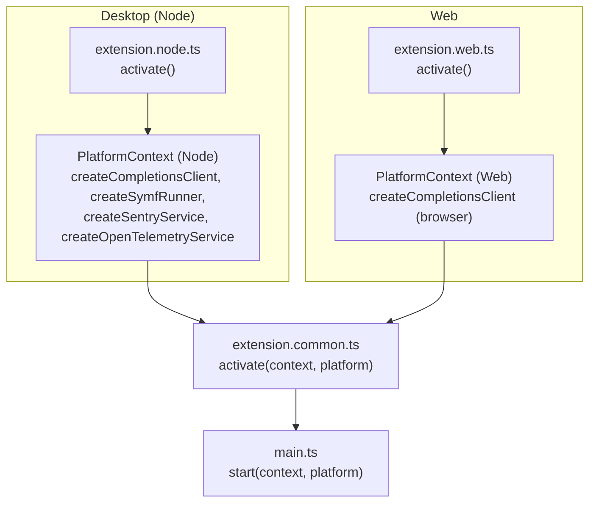
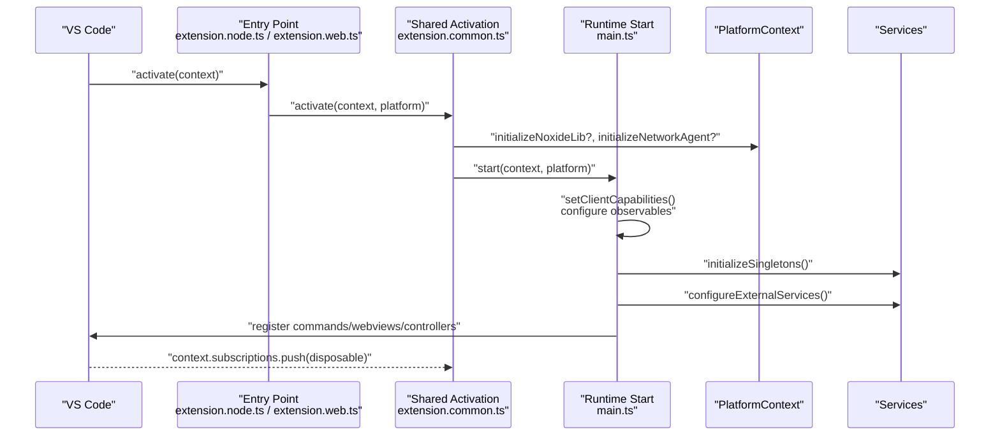
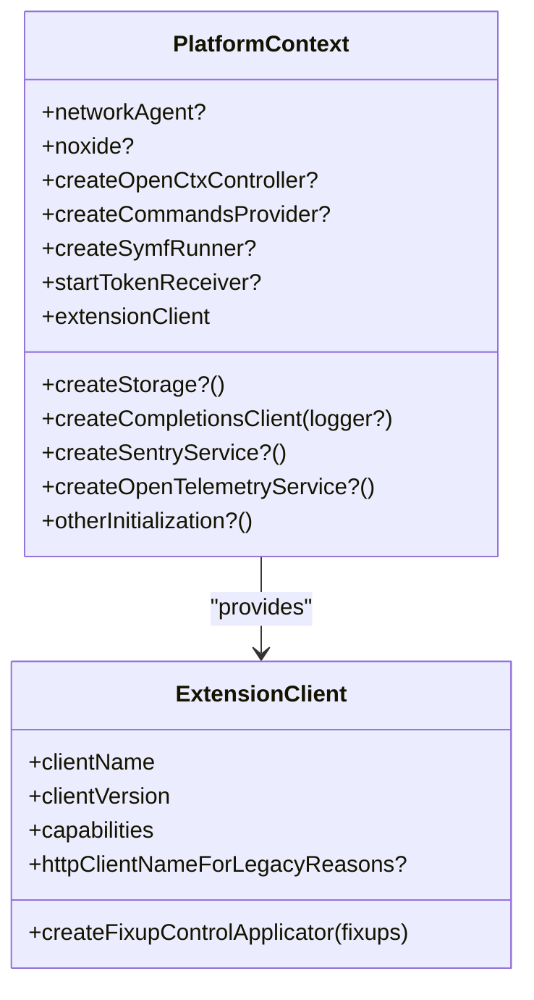
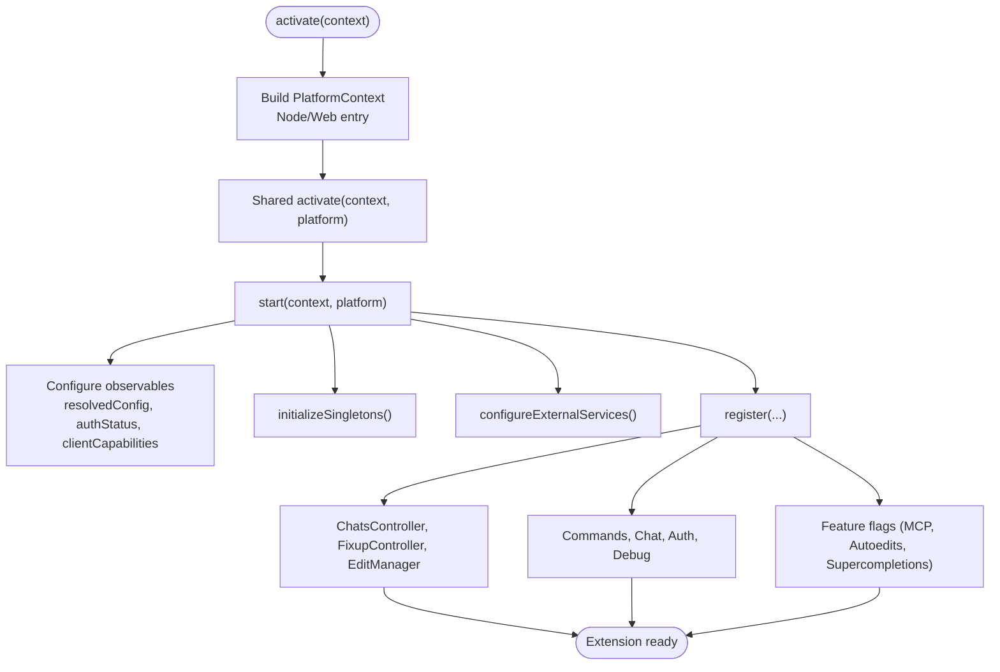
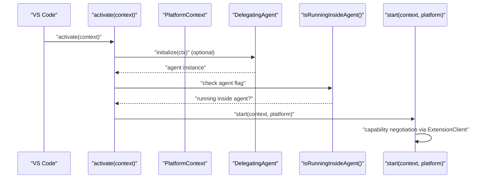
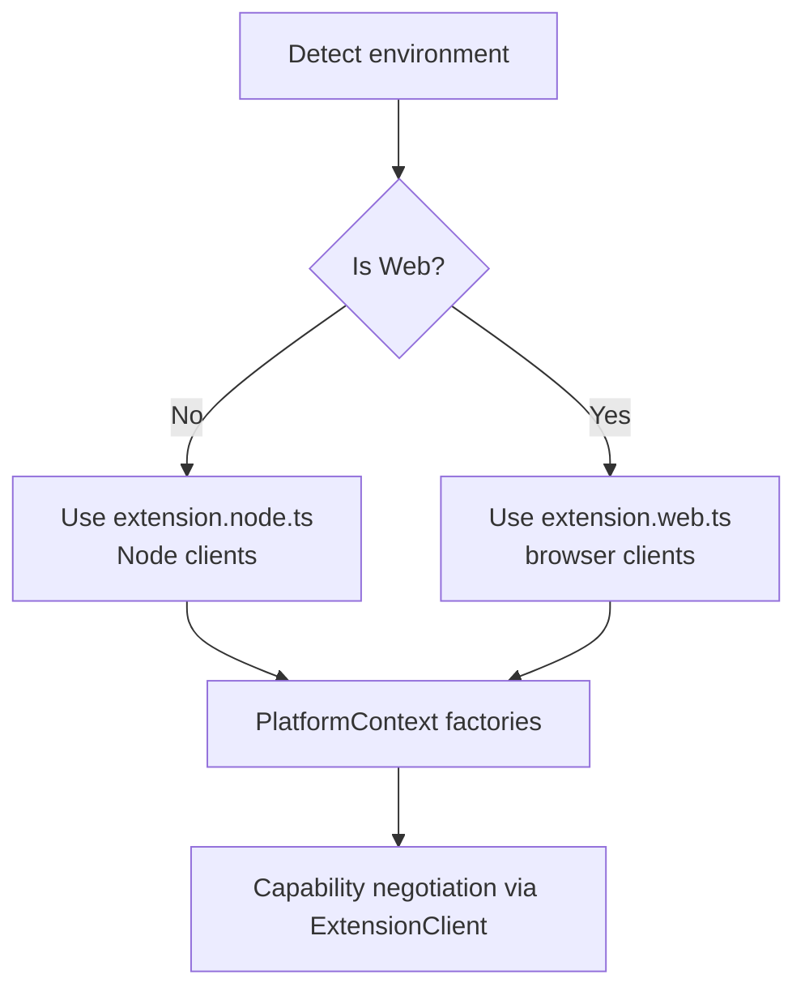
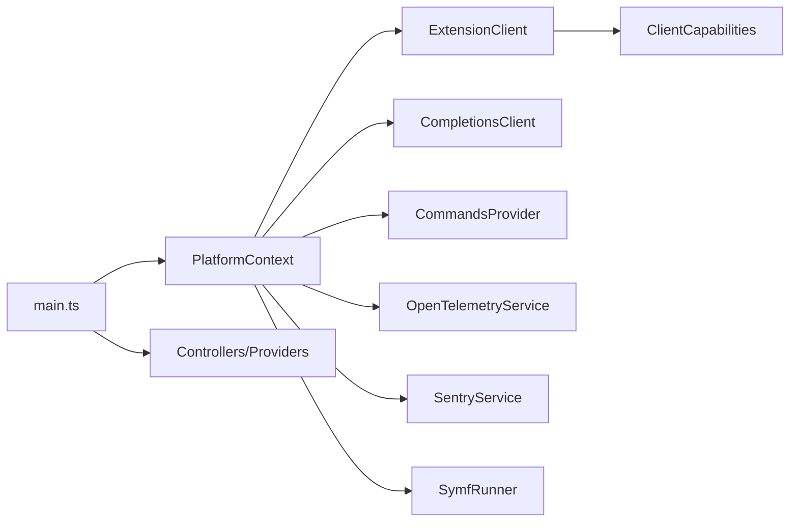

# Extension Architecture

<cite>
**Referenced Files in This Document**
- [main.ts](file://vscode/src/main.ts)
- [extension.common.ts](file://vscode/src/extension.common.ts)
- [extension.node.ts](file://vscode/src/extension.node.ts)
- [extension.web.ts](file://vscode/src/extension.web.ts)
- [extension-api.ts](file://vscode/src/extension-api.ts)
- [extension-client.ts](file://vscode/src/extension-client.ts)
- [package.json](file://vscode/package.json)
- [telemetry-v2.ts](file://vscode/src/services/telemetry-v2.ts)
- [AuthProvider.ts](file://vscode/src/services/AuthProvider.ts)
- [provider.ts](file://vscode/src/commands/services/provider.ts)
- [isRunningInsideAgent.ts](file://vscode/src/jsonrpc/isRunningInsideAgent.ts)
- [DelegatingAgent.ts](file://vscode/src/net/DelegatingAgent.ts)
- [platform.ts](file://lib/shared/src/common/platform.ts)
- [os.ts](file://web/lib/agent/shims/os.ts)
</cite>

## Table of Contents
1. [Introduction](#introduction)
2. [Project Structure](#project-structure)
3. [Core Components](#core-components)
4. [Architecture Overview](#architecture-overview)
5. [Detailed Component Analysis](#detailed-component-analysis)
6. [Dependency Analysis](#dependency-analysis)
7. [Performance Considerations](#performance-considerations)
8. [Troubleshooting Guide](#troubleshooting-guide)
9. [Conclusion](#conclusion)

## Introduction
This document explains the VS Code extension architecture with a focus on multi-platform design, platform abstractions, and the relationship to the underlying agent runtime. It covers the main entry points, activation lifecycle, dependency injection via PlatformContext, singleton initialization, service registration, disposable management, and environment adaptation strategies such as platform detection and capability negotiation.

## Project Structure
The extension is organized into platform-specific entry points and a shared common layer:
- Desktop (Node/Electron) entry point initializes platform-specific services and clients.
- Web entry point adapts to browser constraints and uses browser-compatible clients.
- A shared common activation orchestrates initialization, configuration observables, and service registration.

**Diagram sources**
- [extension.node.ts:25-58](file://vscode/src/extension.node.ts#L25-L58)
- [extension.web.ts:14-23](file://vscode/src/extension.web.ts#L14-L23)
- [extension.common.ts:44-77](file://vscode/src/extension.common.ts#L44-L77)
- [main.ts:122-214](file://vscode/src/main.ts#L122-L214)

**Section sources**
- [extension.node.ts:25-58](file://vscode/src/extension.node.ts#L25-L58)
- [extension.web.ts:14-23](file://vscode/src/extension.web.ts#L14-L23)
- [extension.common.ts:44-77](file://vscode/src/extension.common.ts#L44-L77)
- [main.ts:122-214](file://vscode/src/main.ts#L122-L214)

## Core Components
- PlatformContext: A dependency injection container that abstracts platform differences. It defines factories for clients, services, and optional platform helpers, plus the ExtensionClient that encapsulates client-specific capabilities.
- ExtensionClient: Encapsulates client identity and capabilities (e.g., VS Code desktop vs. web), enabling capability negotiation and client-specific UI/UX behavior.
- Activation pipeline: Desktop and web entry points construct a PlatformContext and pass it to the shared activation, which starts the extension runtime and registers services.

Key responsibilities:
- PlatformContext: Provide platform-specific implementations (e.g., completion client, storage, telemetry, Sentry, Symf runner).
- ExtensionClient: Define client capabilities and HTTP client naming for compatibility.
- Activation: Configure observables, initialize singletons, register commands/webviews, and wire platform services.

**Section sources**
- [extension.common.ts:24-37](file://vscode/src/extension.common.ts#L24-L37)
- [extension.common.ts:44-77](file://vscode/src/extension.common.ts#L44-L77)
- [extension-client.ts:11-43](file://vscode/src/extension-client.ts#L11-L43)
- [extension.node.ts:45-57](file://vscode/src/extension.node.ts#L45-L57)
- [extension.web.ts:18-22](file://vscode/src/extension.web.ts#L18-L22)

## Architecture Overview
The extension follows a layered architecture:
- Entry points (Node/Web) construct PlatformContext and call shared activation.
- Activation sets client capabilities, configuration observables, and logs.
- Registration phase creates singletons, external services, editors, and controllers.
- Services are wired into disposables for lifecycle management.
- Capability negotiation influences feature availability and UI.

**Diagram sources**
- [extension.node.ts:25-58](file://vscode/src/extension.node.ts#L25-L58)
- [extension.web.ts:14-23](file://vscode/src/extension.web.ts#L14-L23)
- [extension.common.ts:44-77](file://vscode/src/extension.common.ts#L44-L77)
- [main.ts:122-214](file://vscode/src/main.ts#L122-L214)

## Detailed Component Analysis

### PlatformContext Abstraction
PlatformContext is the core dependency injection contract. It exposes:
- Optional platform helpers: createStorage, createOpenCtxController, otherInitialization.
- Factories for platform-specific services: createCompletionsClient, createSymfRunner, createCommandsProvider, createSentryService, createOpenTelemetryService.
- ExtensionClient: client identity and capabilities.
- Optional network agent and Noxide integration for desktop.

**Diagram sources**
- [extension.common.ts:24-37](file://vscode/src/extension.common.ts#L24-L37)
- [extension-client.ts:11-43](file://vscode/src/extension-client.ts#L11-L43)

**Section sources**
- [extension.common.ts:24-37](file://vscode/src/extension.common.ts#L24-L37)
- [extension-client.ts:11-43](file://vscode/src/extension-client.ts#L11-L43)

### Activation Lifecycle and Initialization
- Desktop entry point constructs PlatformContext with Node-specific factories and optional Noxide/Symf/Telemetry integrations.
- Web entry point constructs a PlatformContext tailored to browser constraints.
- Shared activation sets up:
  - Logger and client capabilities.
  - Resolved configuration observable combining workspace config, secrets, and local state.
  - Editor window focus observable.
  - Telemetry recorder provider.
  - Singleton initialization and external service configuration.
  - Chat, edit, autocomplete, and command registrations.
  - MCP manager initialization gated by feature flags.
  - Debug and test commands.

**Diagram sources**
- [extension.node.ts:45-57](file://vscode/src/extension.node.ts#L45-L57)
- [extension.web.ts:18-22](file://vscode/src/extension.web.ts#L18-L22)
- [extension.common.ts:44-77](file://vscode/src/extension.common.ts#L44-L77)
- [main.ts:122-357](file://vscode/src/main.ts#L122-L357)

**Section sources**
- [extension.node.ts:45-57](file://vscode/src/extension.node.ts#L45-L57)
- [extension.web.ts:18-22](file://vscode/src/extension.web.ts#L18-L22)
- [extension.common.ts:44-77](file://vscode/src/extension.common.ts#L44-L77)
- [main.ts:122-357](file://vscode/src/main.ts#L122-L357)

### Dependency Injection Patterns
- Factories in PlatformContext decouple consumers from platform specifics.
- ExtensionClient encapsulates client identity and capabilities, enabling capability negotiation.
- Services are initialized once and stored in singletons or injected into controllers/providers.

Examples:
- Completion client factory: Node vs. browser implementations.
- Commands provider factory: Node-only custom commands store.
- Telemetry/Sentry services: Platform-specific implementations.

**Section sources**
- [extension.common.ts:24-37](file://vscode/src/extension.common.ts#L24-L37)
- [extension-client.ts:11-43](file://vscode/src/extension-client.ts#L11-L43)
- [extension.node.ts:48-54](file://vscode/src/extension.node.ts#L48-L54)
- [extension.web.ts:19-20](file://vscode/src/extension.web.ts#L19-L20)

### Modular Structure, Singletons, and Disposables
- Singletons are initialized early to ensure availability across the extension lifecycle.
- External services (chat, completions, guardrails, symf) are configured and disposed via a dedicated disposable.
- Controllers and providers are created and pushed into disposables for lifecycle management.
- Telemetry and auth services are wired into observables and disposed via subscriptions.

**Section sources**
- [main.ts:359-370](file://vscode/src/main.ts#L359-L370)
- [main.ts:244-252](file://vscode/src/main.ts#L244-L252)
- [telemetry-v2.ts:26-99](file://vscode/src/services/telemetry-v2.ts#L26-L99)
- [AuthProvider.ts:45-206](file://vscode/src/services/AuthProvider.ts#L45-L206)

### Relationship to Agent Runtime
- The extension can run inside an agent host. A configuration flag determines whether it is running inside an agent.
- When inside an agent, certain behaviors adapt (e.g., auth handling, context updates).
- A delegating agent manages network configuration and can be initialized during activation for desktop builds.

**Diagram sources**
- [extension.common.ts:58-62](file://vscode/src/extension.common.ts#L58-L62)
- [isRunningInsideAgent.ts:4-8](file://vscode/src/jsonrpc/isRunningInsideAgent.ts#L4-L8)
- [DelegatingAgent.ts:128-137](file://vscode/src/net/DelegatingAgent.ts#L128-L137)

**Section sources**
- [isRunningInsideAgent.ts:4-8](file://vscode/src/jsonrpc/isRunningInsideAgent.ts#L4-L8)
- [DelegatingAgent.ts:128-137](file://vscode/src/net/DelegatingAgent.ts#L128-L137)
- [extension.common.ts:58-62](file://vscode/src/extension.common.ts#L58-L62)

### Platform Detection and Environment Adaptation
- Desktop vs. Web: Different entry points select platform-specific factories.
- OS detection utilities exist for platform-aware behavior.
- Web shim for agent environments reports a web platform identifier.

**Diagram sources**
- [extension.node.ts:25-58](file://vscode/src/extension.node.ts#L25-L58)
- [extension.web.ts:14-23](file://vscode/src/extension.web.ts#L14-L23)
- [platform.ts:35-46](file://lib/shared/src/common/platform.ts#L35-L46)
- [os.ts:1-13](file://web/lib/agent/shims/os.ts#L1-L13)

**Section sources**
- [extension.node.ts:25-58](file://vscode/src/extension.node.ts#L25-L58)
- [extension.web.ts:14-23](file://vscode/src/extension.web.ts#L14-L23)
- [platform.ts:35-46](file://lib/shared/src/common/platform.ts#L35-L46)
- [os.ts:1-13](file://web/lib/agent/shims/os.ts#L1-L13)

### Capability Negotiation and Feature Flags
- Client capabilities are set during activation and influence feature availability (e.g., MCP, unified prompts).
- Feature flags gate optional features and adapt UI/command visibility.
- Auth status and resolved configuration drive feature toggles and telemetry.

**Section sources**
- [main.ts:144-147](file://vscode/src/main.ts#L144-L147)
- [main.ts:464-525](file://vscode/src/main.ts#L464-L525)
- [main.ts:318-334](file://vscode/src/main.ts#L318-L334)
- [AuthProvider.ts:172-196](file://vscode/src/services/AuthProvider.ts#L172-L196)

### Extension API Surface
- The public API exposed to other extensions is minimal and guarded by testing flags.

**Section sources**
- [extension-api.ts:5-18](file://vscode/src/extension-api.ts#L5-L18)

## Dependency Analysis
The extension’s dependency graph centers on PlatformContext and ExtensionClient, with services and controllers consuming these abstractions.

**Diagram sources**
- [extension.common.ts:24-37](file://vscode/src/extension.common.ts#L24-L37)
- [extension-client.ts:11-43](file://vscode/src/extension-client.ts#L11-L43)
- [main.ts:244-252](file://vscode/src/main.ts#L244-L252)

**Section sources**
- [extension.common.ts:24-37](file://vscode/src/extension.common.ts#L24-L37)
- [extension-client.ts:11-43](file://vscode/src/extension-client.ts#L11-L43)
- [main.ts:244-252](file://vscode/src/main.ts#L244-L252)

## Performance Considerations
- Avoid awaiting long-running UI prompts during activation to prevent activation timeouts.
- Use observables for configuration and auth changes to minimize redundant work.
- Defer feature initialization until feature flags and auth status are evaluated.
- Dispose of subscriptions and disposables promptly to avoid leaks.

[No sources needed since this section provides general guidance]

## Troubleshooting Guide
- Authentication state and context updates are managed by the AuthProvider, which emits status changes and updates VS Code context keys.
- Telemetry initialization depends on resolved configuration and dev/test modes; verify configuration and environment variables.
- If running inside an agent, verify the agent flag and adjust behavior accordingly.

**Section sources**
- [AuthProvider.ts:45-206](file://vscode/src/services/AuthProvider.ts#L45-L206)
- [telemetry-v2.ts:26-99](file://vscode/src/services/telemetry-v2.ts#L26-L99)
- [isRunningInsideAgent.ts:4-8](file://vscode/src/jsonrpc/isRunningInsideAgent.ts#L4-L8)

## Conclusion
The extension architecture cleanly separates platform concerns via PlatformContext and ExtensionClient, enabling a shared activation and runtime while supporting both desktop and web environments. The registration pattern centralizes service initialization and disposable management, and capability negotiation ensures features adapt to client environments. Integration with the agent runtime is explicit and configurable, allowing the extension to operate consistently across diverse hosts.