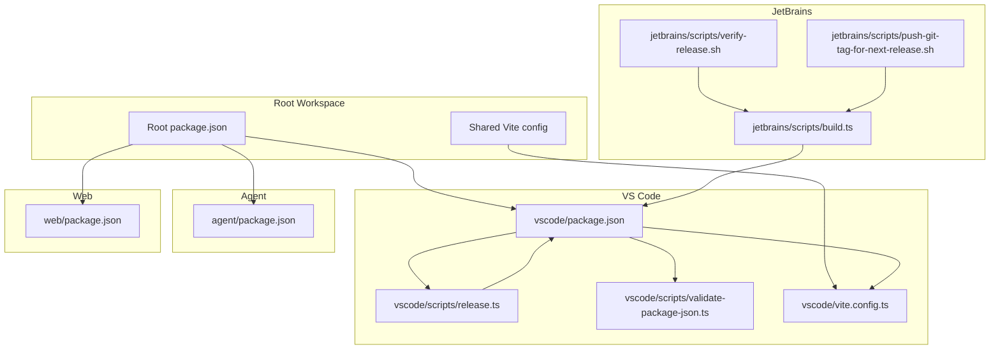
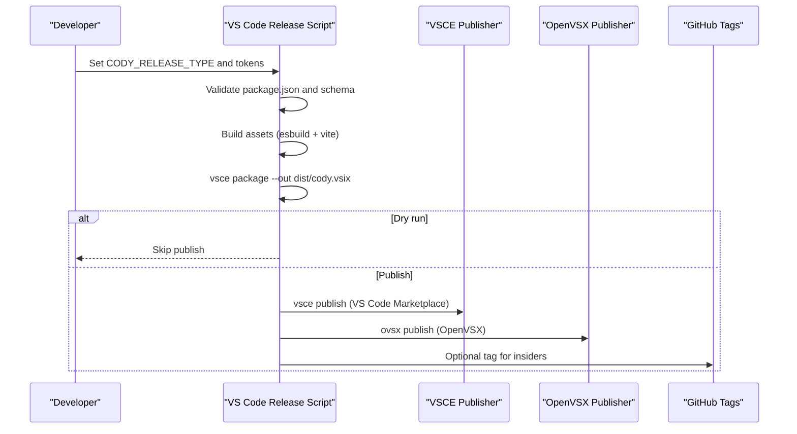
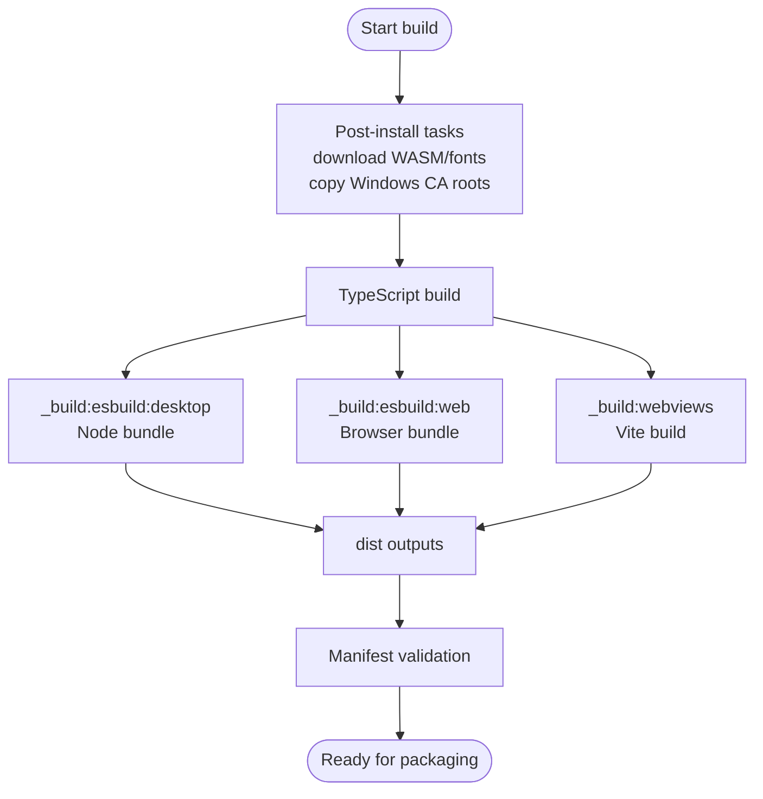
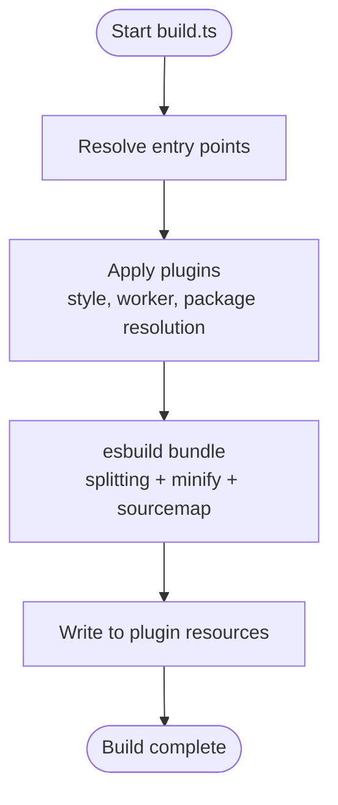
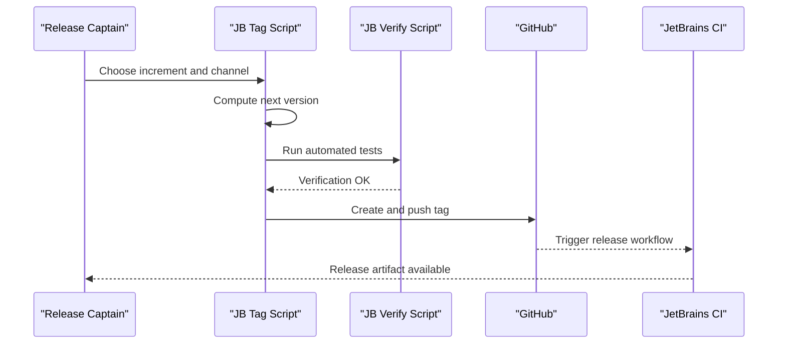
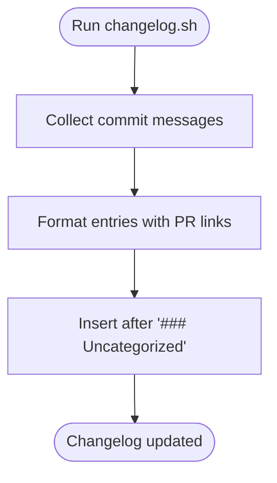
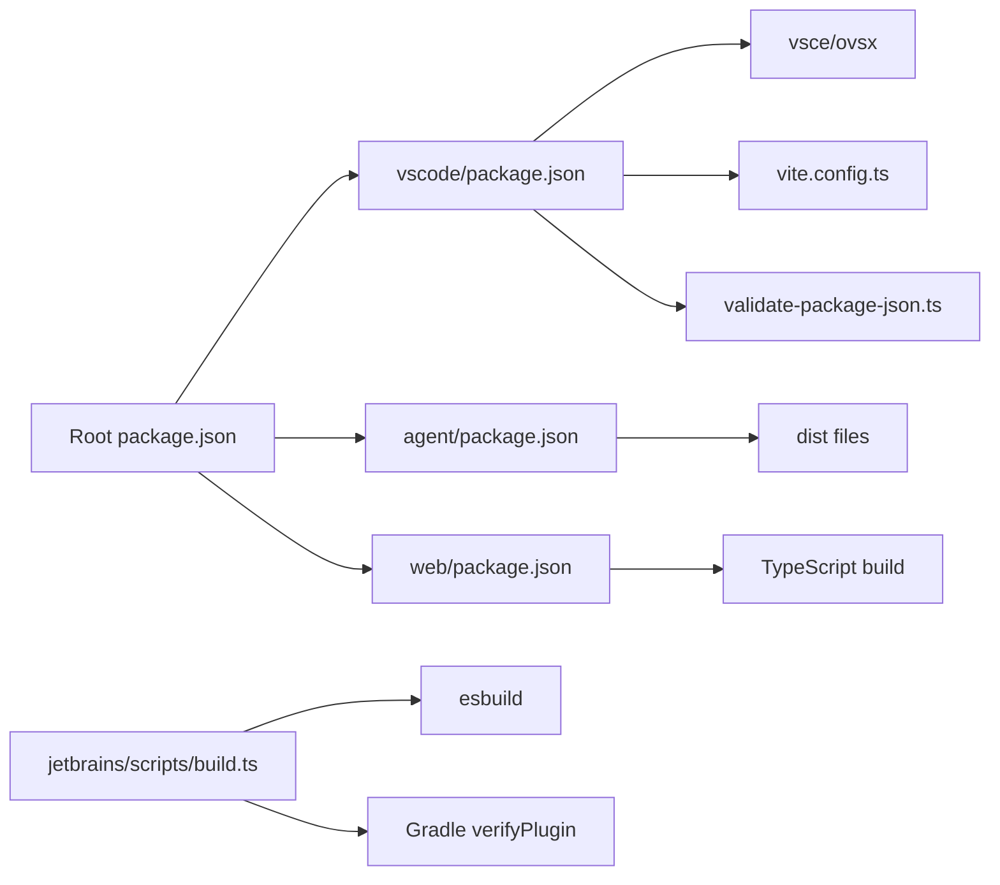

# Extension Packaging & Distribution

<cite>
**Referenced Files in This Document**
- [package.json](file://package.json)
- [vscode/package.json](file://vscode/package.json)
- [vscode/vite.config.ts](file://vscode/vite.config.ts)
- [vscode/scripts/release.ts](file://vscode/scripts/release.ts)
- [vscode/scripts/validate-package-json.ts](file://vscode/scripts/validate-package-json.ts)
- [vscode/scripts/changelog.sh](file://vscode/scripts/changelog.sh)
- [vscode/features.json5](file://vscode/features.json5)
- [jetbrains/scripts/build.ts](file://jetbrains/scripts/build.ts)
- [jetbrains/scripts/verify-release.sh](file://jetbrains/scripts/verify-release.sh)
- [jetbrains/scripts/push-git-tag-for-next-release.sh](file://jetbrains/scripts/push-git-tag-for-next-release.sh)
- [jetbrains/features.json5](file://jetbrains/features.json5)
- [release/release-captain.sh](file://release/release-captain.sh)
- [agent/package.json](file://agent/package.json)
- [web/package.json](file://web/package.json)
</cite>

## Table of Contents
1. [Introduction](#introduction)
2. [Project Structure](#project-structure)
3. [Core Components](#core-components)
4. [Architecture Overview](#architecture-overview)
5. [Detailed Component Analysis](#detailed-component-analysis)
6. [Dependency Analysis](#dependency-analysis)
7. [Performance Considerations](#performance-considerations)
8. [Troubleshooting Guide](#troubleshooting-guide)
9. [Conclusion](#conclusion)
10. [Appendices](#appendices)

## Introduction
This document explains how the Cody extension is packaged, built, validated, released, and distributed across platforms. It covers:
- package.json configuration and dependency management
- Asset bundling and build pipelines
- Version management and release automation
- Signing and marketplace submission
- Platform-specific packaging (VS Code, JetBrains, Web)
- Release workflows, changelog generation, and distribution channels
- Troubleshooting common packaging issues

## Project Structure
The repository is a monorepo with multiple packages and editors:
- Root workspace defines shared tooling and scripts
- vscode: VS Code extension package and build pipeline
- jetbrains: JetBrains plugin build and release scripts
- agent: CLI agent package and distribution files
- web: Standalone web app package
- release: Release captain automation for coordinated releases

**Diagram sources**
- [package.json:1-99](file://package.json#L1-L99)
- [vscode/package.json:1-1526](file://vscode/package.json#L1-L1526)
- [vscode/vite.config.ts:1-16](file://vscode/vite.config.ts#L1-L16)
- [vscode/scripts/release.ts:1-229](file://vscode/scripts/release.ts#L1-L229)
- [vscode/scripts/validate-package-json.ts:1-66](file://vscode/scripts/validate-package-json.ts#L1-L66)
- [jetbrains/scripts/build.ts:1-65](file://jetbrains/scripts/build.ts#L1-L65)
- [jetbrains/scripts/verify-release.sh:1-14](file://jetbrains/scripts/verify-release.sh#L1-L14)
- [jetbrains/scripts/push-git-tag-for-next-release.sh:1-100](file://jetbrains/scripts/push-git-tag-for-next-release.sh#L1-L100)
- [agent/package.json:1-112](file://agent/package.json#L1-L112)
- [web/package.json:1-52](file://web/package.json#L1-L52)

**Section sources**
- [package.json:1-99](file://package.json#L1-L99)
- [vscode/package.json:1-1526](file://vscode/package.json#L1-L1526)
- [vscode/vite.config.ts:1-16](file://vscode/vite.config.ts#L1-L16)
- [jetbrains/scripts/build.ts:1-65](file://jetbrains/scripts/build.ts#L1-L65)

## Core Components
- VS Code extension package and build:
  - Defines main and browser entry points, activation events, and contributes commands/views
  - Uses esbuild for desktop and web bundles and Vite for webviews
  - Validates manifest against a schema and enforces typehacks
- JetBrains plugin build:
  - Bundles webviews via esbuild into the plugin resources
  - Automated verification and tagging for prereleases and stable releases
- Agent CLI package:
  - Defines binary entrypoint and files included in published package
- Web app package:
  - Standalone web build with TypeScript declaration outputs
- Release automation:
  - VS Code release script supports stable, insiders, experimental, nightly channels
  - JetBrains release tagging and verification scripts
  - Release captain shell script coordinates milestones and workflows

**Section sources**
- [vscode/package.json:1-1526](file://vscode/package.json#L1-L1526)
- [vscode/scripts/release.ts:1-229](file://vscode/scripts/release.ts#L1-L229)
- [jetbrains/scripts/build.ts:1-65](file://jetbrains/scripts/build.ts#L1-L65)
- [jetbrains/scripts/push-git-tag-for-next-release.sh:1-100](file://jetbrains/scripts/push-git-tag-for-next-release.sh#L1-L100)
- [agent/package.json:1-112](file://agent/package.json#L1-L112)
- [web/package.json:1-52](file://web/package.json#L1-L52)

## Architecture Overview
The packaging and distribution pipeline integrates build, validation, packaging, and publication across VS Code and JetBrains.

**Diagram sources**
- [vscode/scripts/release.ts:1-229](file://vscode/scripts/release.ts#L1-L229)

**Section sources**
- [vscode/scripts/release.ts:1-229](file://vscode/scripts/release.ts#L1-L229)

## Detailed Component Analysis

### VS Code Packaging and Build Pipeline
- Entry points and targets:
  - Desktop bundle: Node target with externalized vscode and typescript
  - Web bundle: Browser target with polyfills and externalized vscode
  - Webviews: Built via Vite with test setup and environment overrides
- Validation:
  - Manifest validation against a JSON schema
  - Typehacks compilation step to ensure compatibility
- Scripts orchestrate:
  - Root build, WASM/font downloads, Windows CA roots copy
  - Development and production builds for desktop and web
  - E2E packaging and testing

**Diagram sources**
- [vscode/package.json:11-56](file://vscode/package.json#L11-L56)
- [vscode/vite.config.ts:1-16](file://vscode/vite.config.ts#L1-L16)

**Section sources**
- [vscode/package.json:11-56](file://vscode/package.json#L11-L56)
- [vscode/vite.config.ts:1-16](file://vscode/vite.config.ts#L1-L16)
- [vscode/scripts/validate-package-json.ts:1-66](file://vscode/scripts/validate-package-json.ts#L1-L66)

### JetBrains Webviews Build
- Bundles multiple web entry points (search, bridge mock, styles)
- Minified and sourcemapped outputs placed into plugin resources
- Injects browser shims and resolves Node polyfills

**Diagram sources**
- [jetbrains/scripts/build.ts:1-65](file://jetbrains/scripts/build.ts#L1-L65)

**Section sources**
- [jetbrains/scripts/build.ts:1-65](file://jetbrains/scripts/build.ts#L1-L65)

### Release Automation and Channels
- VS Code release script supports:
  - Stable, Insiders, Experimental, Nightly channels
  - Version computation for insiders using minor increment and timestamp
  - Publishing to VS Code Marketplace and OpenVSX
  - Optional dry runs and custom default settings injection
- JetBrains release tagging:
  - Computes next version based on existing tags and branch base
  - Supports major/minor/patch increments and channel suffixes
  - Verifies plugin before tagging and pushing

**Diagram sources**
- [jetbrains/scripts/push-git-tag-for-next-release.sh:1-100](file://jetbrains/scripts/push-git-tag-for-next-release.sh#L1-L100)
- [jetbrains/scripts/verify-release.sh:1-14](file://jetbrains/scripts/verify-release.sh#L1-L14)

**Section sources**
- [vscode/scripts/release.ts:1-229](file://vscode/scripts/release.ts#L1-L229)
- [jetbrains/scripts/push-git-tag-for-next-release.sh:1-100](file://jetbrains/scripts/push-git-tag-for-next-release.sh#L1-L100)
- [jetbrains/scripts/verify-release.sh:1-14](file://jetbrains/scripts/verify-release.sh#L1-L14)

### Changelog Generation
- Script generates a list of commits between two versions and appends them to the changelog under an “Uncategorized” section
- Requires manual review and merging of the resulting PR

**Diagram sources**
- [vscode/scripts/changelog.sh:1-22](file://vscode/scripts/changelog.sh#L1-L22)

**Section sources**
- [vscode/scripts/changelog.sh:1-22](file://vscode/scripts/changelog.sh#L1-L22)

### Feature Flags and Product Lines
- Feature matrices define statuses per editor and product line
- Helps coordinate feature availability across VS Code and JetBrains

**Section sources**
- [vscode/features.json5:1-91](file://vscode/features.json5#L1-L91)
- [jetbrains/features.json5:1-69](file://jetbrains/features.json5#L1-L69)

## Dependency Analysis
- Root workspace manages shared tooling and scripts
- VS Code package depends on:
  - esbuild for bundling
  - Vite for webviews
  - VSCE/OVSX for publishing
- JetBrains build depends on:
  - esbuild and custom plugins for bundling webviews
  - Gradle for plugin verification and packaging
- Agent and Web packages define their own entry points and files included in distribution

**Diagram sources**
- [package.json:1-99](file://package.json#L1-L99)
- [vscode/package.json:1-1526](file://vscode/package.json#L1-L1526)
- [vscode/vite.config.ts:1-16](file://vscode/vite.config.ts#L1-L16)
- [vscode/scripts/validate-package-json.ts:1-66](file://vscode/scripts/validate-package-json.ts#L1-L66)
- [agent/package.json:1-112](file://agent/package.json#L1-L112)
- [web/package.json:1-52](file://web/package.json#L1-L52)
- [jetbrains/scripts/build.ts:1-65](file://jetbrains/scripts/build.ts#L1-L65)

**Section sources**
- [package.json:1-99](file://package.json#L1-L99)
- [vscode/package.json:1-1526](file://vscode/package.json#L1-L1526)
- [agent/package.json:1-112](file://agent/package.json#L1-L112)
- [web/package.json:1-52](file://web/package.json#L1-L52)
- [jetbrains/scripts/build.ts:1-65](file://jetbrains/scripts/build.ts#L1-L65)

## Performance Considerations
- Prefer incremental builds and watch mode during development
- Minimize external dependencies and use browser-compatible shims to reduce bundle size
- Split webview bundles to improve load performance
- Cache and reuse WASM and font assets across builds

## Troubleshooting Guide
Common packaging issues and resolutions:
- Manifest validation failures:
  - Ensure package.json conforms to the schema; update cached schema if needed
  - Run validation script to identify errors
- Missing tokens for publishing:
  - Provide marketplace tokens via environment variables for VS Code and OpenVSX
- Version mismatches:
  - Validate semantic versioning and ensure correct channel logic for insiders
- JetBrains build failures:
  - Confirm Gradle clean and verifyPlugin steps pass before tagging
  - Ensure working tree is clean before tagging

**Section sources**
- [vscode/scripts/validate-package-json.ts:1-66](file://vscode/scripts/validate-package-json.ts#L1-L66)
- [vscode/scripts/release.ts:122-129](file://vscode/scripts/release.ts#L122-L129)
- [jetbrains/scripts/verify-release.sh:1-14](file://jetbrains/scripts/verify-release.sh#L1-L14)
- [jetbrains/scripts/push-git-tag-for-next-release.sh:18-22](file://jetbrains/scripts/push-git-tag-for-next-release.sh#L18-L22)

## Conclusion
The Cody repository implements a robust, multi-platform packaging and distribution system:
- Centralized build and validation for VS Code and JetBrains
- Automated release pipelines with multiple channels
- Coordinated release captain workflows for milestones and patches
- Clear separation of concerns across packages (VS Code, JetBrains, Agent, Web)

## Appendices

### Packaging Strategy by Platform
- VS Code:
  - Desktop bundle: Node target with externalized vscode and typescript
  - Web bundle: Browser target with polyfills and externalized vscode
  - Webviews: Vite build with test setup
- JetBrains:
  - Webviews bundled via esbuild into plugin resources
  - Automated verification and tagging for prereleases and stable releases
- Agent CLI:
  - Binary entrypoint with included WASM, fonts, and platform-specific binaries
- Web:
  - Standalone web app with TypeScript declarations

**Section sources**
- [vscode/package.json:34-37](file://vscode/package.json#L34-L37)
- [jetbrains/scripts/build.ts:21-56](file://jetbrains/scripts/build.ts#L21-L56)
- [agent/package.json:28-36](file://agent/package.json#L28-L36)
- [web/package.json:1-52](file://web/package.json#L1-L52)

### Version Management and Release Automation
- VS Code:
  - Stable: publishes from tagged releases
  - Insiders: computes version using minor increment and timestamp
  - Experimental/Nightly: publishes testing variants
- JetBrains:
  - Tagging script computes next version and pushes tags to trigger CI
- Release captain:
  - Coordinates milestone-based releases, prereleases, and emergency patches

**Section sources**
- [vscode/scripts/release.ts:131-152](file://vscode/scripts/release.ts#L131-L152)
- [jetbrains/scripts/push-git-tag-for-next-release.sh:54-75](file://jetbrains/scripts/push-git-tag-for-next-release.sh#L54-L75)
- [release/release-captain.sh:89-172](file://release/release-captain.sh#L89-L172)

### Distribution Channels
- VS Code Marketplace and OpenVSX via VSCE/OVSX
- JetBrains Marketplace via CI-triggered releases
- Web app distribution handled separately

**Section sources**
- [vscode/scripts/release.ts:174-209](file://vscode/scripts/release.ts#L174-L209)