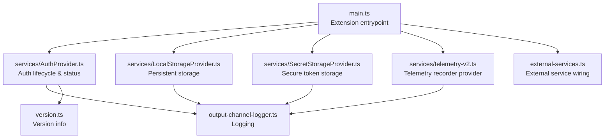
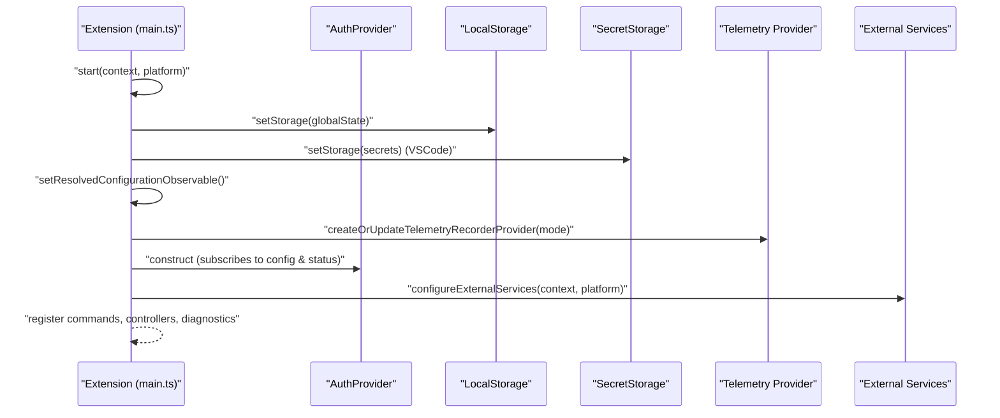
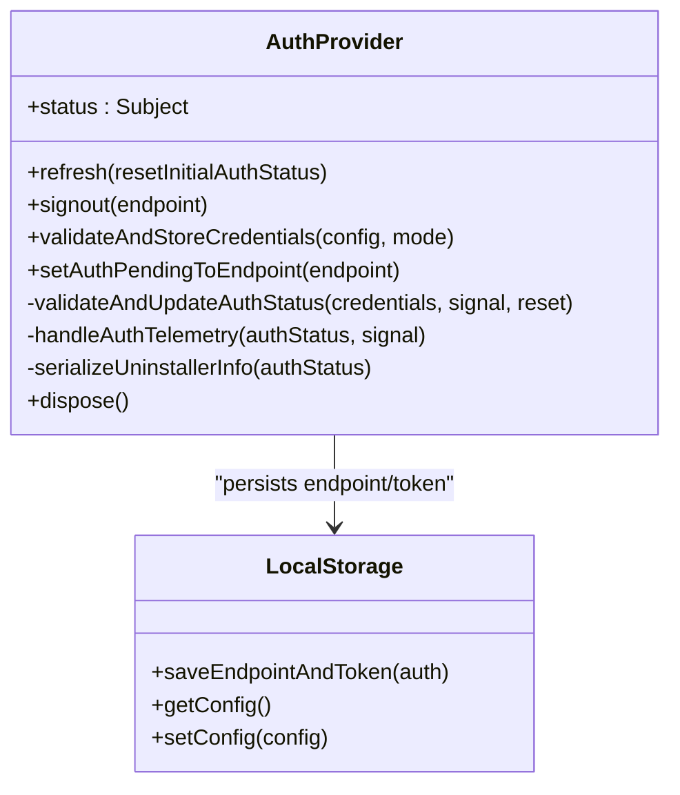
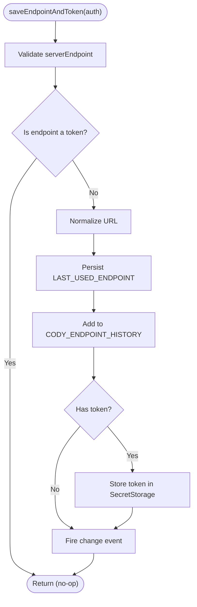
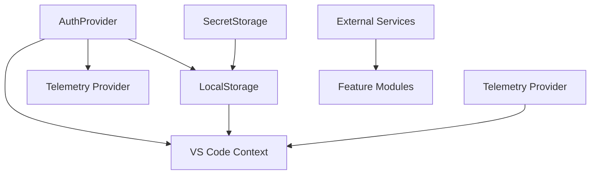

# Service Integration

<cite>
**Referenced Files in This Document**
- [main.ts](file://vscode/src/main.ts)
- [AuthProvider.ts](file://vscode/src/services/AuthProvider.ts)
- [LocalStorageProvider.ts](file://vscode/src/services/LocalStorageProvider.ts)
- [SecretStorageProvider.ts](file://vscode/src/services/SecretStorageProvider.ts)
- [telemetry-v2.ts](file://vscode/src/services/telemetry-v2.ts)
- [external-services.ts](file://vscode/src/external-services.ts)
- [output-channel-logger.ts](file://vscode/src/output-channel-logger.ts)
- [version.ts](file://vscode/src/version.ts)
</cite>

## Table of Contents
1. [Introduction](#introduction)
2. [Project Structure](#project-structure)
3. [Core Components](#core-components)
4. [Architecture Overview](#architecture-overview)
5. [Detailed Component Analysis](#detailed-component-analysis)
6. [Dependency Analysis](#dependency-analysis)
7. [Performance Considerations](#performance-considerations)
8. [Troubleshooting Guide](#troubleshooting-guide)
9. [Conclusion](#conclusion)

## Introduction
This document explains the service integration architecture for the VS Code extension. It focuses on the service layer that powers authentication, telemetry, and persistent storage, and how these services integrate with external systems such as Sourcegraph APIs, authentication providers, and telemetry platforms. It covers initialization, configuration, lifecycle management, error handling, fallback mechanisms, and practical usage patterns.

## Project Structure
The service layer resides primarily under the services directory and integrates with the extension’s activation and external service configuration.

**Diagram sources**
- [main.ts:122-214](file://vscode/src/main.ts#L122-L214)
- [AuthProvider.ts:45-206](file://vscode/src/services/AuthProvider.ts#L45-L206)
- [LocalStorageProvider.ts:27-90](file://vscode/src/services/LocalStorageProvider.ts#L27-L90)
- [SecretStorageProvider.ts:26-133](file://vscode/src/services/SecretStorageProvider.ts#L26-L133)
- [telemetry-v2.ts:26-99](file://vscode/src/services/telemetry-v2.ts#L26-L99)
- [external-services.ts](file://vscode/src/external-services.ts)
- [output-channel-logger.ts](file://vscode/src/output-channel-logger.ts)
- [version.ts](file://vscode/src/version.ts)

**Section sources**
- [main.ts:122-214](file://vscode/src/main.ts#L122-L214)

## Core Components
- Authentication Provider: Manages authentication state, validates credentials, emits auth status, and coordinates telemetry and context updates.
- Local Storage Provider: Provides persistent storage for configuration, chat history, endpoint history, model preferences, and other client state.
- Secret Storage Provider: Handles secure token storage and retrieval, with optional fallback to a local file path.
- Telemetry Provider: Initializes and updates the telemetry recorder provider based on configuration and environment, and records extension lifecycle events.

**Section sources**
- [AuthProvider.ts:45-206](file://vscode/src/services/AuthProvider.ts#L45-L206)
- [LocalStorageProvider.ts:27-90](file://vscode/src/services/LocalStorageProvider.ts#L27-L90)
- [SecretStorageProvider.ts:26-133](file://vscode/src/services/SecretStorageProvider.ts#L26-L133)
- [telemetry-v2.ts:26-99](file://vscode/src/services/telemetry-v2.ts#L26-L99)

## Architecture Overview
The extension initializes services at activation, wires configuration observables, and registers providers for authentication, storage, and telemetry. External services (chat, completions, guardrails, symf) are configured and made available to feature modules.

**Diagram sources**
- [main.ts:122-214](file://vscode/src/main.ts#L122-L214)
- [main.ts:217-357](file://vscode/src/main.ts#L217-L357)
- [AuthProvider.ts:90-206](file://vscode/src/services/AuthProvider.ts#L90-L206)
- [LocalStorageProvider.ts:63-72](file://vscode/src/services/LocalStorageProvider.ts#L63-L72)
- [SecretStorageProvider.ts:44-46](file://vscode/src/services/SecretStorageProvider.ts#L44-L46)
- [telemetry-v2.ts:33-99](file://vscode/src/services/telemetry-v2.ts#L33-L99)
- [external-services.ts](file://vscode/src/external-services.ts)

## Detailed Component Analysis

### Authentication Provider
Responsibilities:
- Validates credentials against the configured endpoint.
- Emits observable auth status and updates VS Code context flags.
- Handles periodic revalidation after transient failures.
- Integrates with telemetry to record auth events and first-ever login.
- Serializes uninstaller configuration snapshot on successful auth.

Key behaviors:
- Subscribes to resolved configuration changes and triggers validation when credentials change.
- Emits a pending-validation state immediately upon initiating validation.
- Reacts to availability errors by scheduling periodic retries.
- Updates VS Code context variables for activation and endpoint.
- Records telemetry events for auth status transitions.

**Diagram sources**
- [AuthProvider.ts:45-335](file://vscode/src/services/AuthProvider.ts#L45-L335)
- [LocalStorageProvider.ts:108-132](file://vscode/src/services/LocalStorageProvider.ts#L108-L132)

**Section sources**
- [AuthProvider.ts:61-88](file://vscode/src/services/AuthProvider.ts#L61-L88)
- [AuthProvider.ts:90-206](file://vscode/src/services/AuthProvider.ts#L90-L206)
- [AuthProvider.ts:248-280](file://vscode/src/services/AuthProvider.ts#L248-L280)
- [AuthProvider.ts:282-304](file://vscode/src/services/AuthProvider.ts#L282-L304)
- [AuthProvider.ts:312-332](file://vscode/src/services/AuthProvider.ts#L312-L332)

### Local Storage Provider
Responsibilities:
- Singleton persistent storage backed by VS Code’s Memento.
- Stores configuration snapshots, endpoint history, chat history keyed by endpoint and username, model preferences, anonymous user ID, and device pixel ratio.
- Provides observable client state changes for downstream consumers.
- Clears deprecated keys on initialization.

Important operations:
- saveEndpointAndToken: Persists endpoint and token atomically and fires a change event.
- Endpoint history management: maintains a set of recent endpoints.
- Chat history management: account-keyed storage for chat transcripts.
- Anonymous user ID generation and detection of newly created IDs.

**Diagram sources**
- [LocalStorageProvider.ts:108-132](file://vscode/src/services/LocalStorageProvider.ts#L108-L132)

**Section sources**
- [LocalStorageProvider.ts:63-72](file://vscode/src/services/LocalStorageProvider.ts#L63-L72)
- [LocalStorageProvider.ts:108-132](file://vscode/src/services/LocalStorageProvider.ts#L108-L132)
- [LocalStorageProvider.ts:157-172](file://vscode/src/services/LocalStorageProvider.ts#L157-L172)
- [LocalStorageProvider.ts:174-213](file://vscode/src/services/LocalStorageProvider.ts#L174-L213)
- [LocalStorageProvider.ts:322-328](file://vscode/src/services/LocalStorageProvider.ts#L322-L328)

### Secret Storage Provider
Responsibilities:
- Wraps VS Code SecretStorage with a thin abstraction.
- Supports a local fallback file path for environments without secret storage.
- Stores and retrieves access tokens per endpoint, plus token source metadata.
- Listens for token changes and filters to current endpoint.

Notable fallback:
- If a local path is configured, reads/writes tokens from a JSON file instead of secret storage.

**Section sources**
- [SecretStorageProvider.ts:44-57](file://vscode/src/services/SecretStorageProvider.ts#L44-L57)
- [SecretStorageProvider.ts:79-132](file://vscode/src/services/SecretStorageProvider.ts#L79-L132)
- [SecretStorageProvider.ts:225-243](file://vscode/src/services/SecretStorageProvider.ts#L225-L243)

### Telemetry Provider
Responsibilities:
- Creates or updates the global telemetry recorder provider based on resolved configuration and environment.
- In development/test modes, restricts exported events to a whitelist.
- On first initialization, records extension lifecycle events (installed, reinstalled, savedLogin).
- Provides a helper to split metadata into safe and private categories for export policies.

Integration:
- Subscribes to resolved configuration to reinitialize telemetry on config changes.
- Uses client capabilities to skip initialization for non-VSCode clients.

**Section sources**
- [telemetry-v2.ts:26-99](file://vscode/src/services/telemetry-v2.ts#L26-L99)
- [telemetry-v2.ts:126-171](file://vscode/src/services/telemetry-v2.ts#L126-L171)

### External Services Integration
The extension configures external services (chat client, completions client, guardrails, symf runner) and exposes them to feature modules. This is orchestrated during registration after configuration is established.

**Section sources**
- [main.ts:244-252](file://vscode/src/main.ts#L244-L252)
- [external-services.ts](file://vscode/src/external-services.ts)

## Dependency Analysis
High-level dependencies among services and their integration points:

**Diagram sources**
- [AuthProvider.ts:90-206](file://vscode/src/services/AuthProvider.ts#L90-L206)
- [LocalStorageProvider.ts:108-132](file://vscode/src/services/LocalStorageProvider.ts#L108-L132)
- [SecretStorageProvider.ts:89-118](file://vscode/src/services/SecretStorageProvider.ts#L89-L118)
- [telemetry-v2.ts:33-99](file://vscode/src/services/telemetry-v2.ts#L33-L99)
- [main.ts:244-252](file://vscode/src/main.ts#L244-L252)

**Section sources**
- [AuthProvider.ts:90-206](file://vscode/src/services/AuthProvider.ts#L90-L206)
- [LocalStorageProvider.ts:108-132](file://vscode/src/services/LocalStorageProvider.ts#L108-L132)
- [SecretStorageProvider.ts:89-118](file://vscode/src/services/SecretStorageProvider.ts#L89-L118)
- [telemetry-v2.ts:33-99](file://vscode/src/services/telemetry-v2.ts#L33-L99)
- [main.ts:244-252](file://vscode/src/main.ts#L244-L252)

## Performance Considerations
- Debounce and coalesce configuration updates: The configuration observable merges VS Code configuration changes, secret storage changes, and local client state changes to minimize redundant work.
- Avoid blocking UI: Initialization steps that may trigger user prompts are not awaited during activation to prevent timeouts.
- Efficient retries: Authentication revalidation uses a short interval for transient conditions, reducing unnecessary long waits.
- Atomic writes: Endpoint and token persistence is coordinated to avoid inconsistent state.

[No sources needed since this section provides general guidance]

## Troubleshooting Guide
Common integration issues and remedies:
- Authentication fails intermittently
  - Symptom: Periodic “availability” or “invalid token” errors.
  - Behavior: Auth provider schedules periodic retries; ensure network connectivity and that the endpoint is reachable.
  - Action: Verify endpoint URL normalization and that the token is stored securely.
  - Section sources
    - [AuthProvider.ts:148-170](file://vscode/src/services/AuthProvider.ts#L148-L170)
    - [AuthProvider.ts:352-368](file://vscode/src/services/AuthProvider.ts#L352-L368)

- Token not persisted or lost after reinstall
  - Symptom: Need to re-authenticate after reinstall.
  - Behavior: Reinstall triggers cleanup of tokens for discovered endpoints; ensure uninstaller snapshot is serialized on successful auth.
  - Action: Confirm that uninstaller serialization runs and that the endpoint history is populated.
  - Section sources
    - [main.ts:176-199](file://vscode/src/main.ts#L176-L199)
    - [AuthProvider.ts:312-332](file://vscode/src/services/AuthProvider.ts#L312-L332)

- Telemetry events not recorded in development
  - Symptom: Events not visible in production exports.
  - Behavior: Dev/test mode restricts exports to a whitelist; ensure allowed events are used.
  - Action: Review allowed dev events and confirm environment flags.
  - Section sources
    - [telemetry-v2.ts:17-19](file://vscode/src/services/telemetry-v2.ts#L17-L19)
    - [telemetry-v2.ts:48-65](file://vscode/src/services/telemetry-v2.ts#L48-L65)

- Logging and debugging
  - Use the output channel logger to capture errors and debug logs across services.
  - Section sources
    - [output-channel-logger.ts](file://vscode/src/output-channel-logger.ts)

- Version and client metadata
  - Ensure client name/version is set during initialization for accurate telemetry attribution.
  - Section sources
    - [main.ts:223-228](file://vscode/src/main.ts#L223-L228)
    - [version.ts](file://vscode/src/version.ts)

## Conclusion
The service integration layer in the VS Code extension is built around three pillars: authentication, storage, and telemetry. These services are initialized at activation, wired to configuration observables, and integrated with external systems to deliver a robust, observable, and resilient user experience. Proper initialization, error handling, and fallback mechanisms ensure reliable operation across diverse environments and failure scenarios.