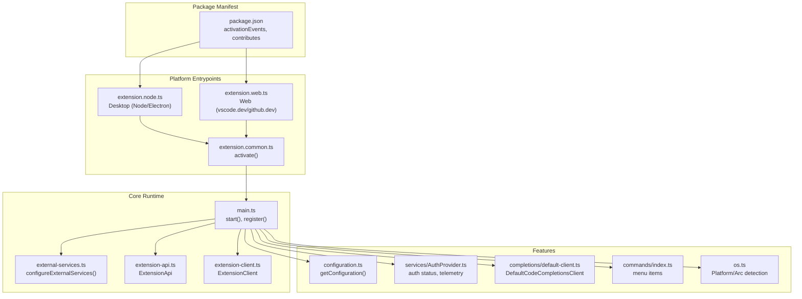
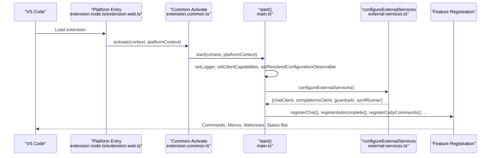
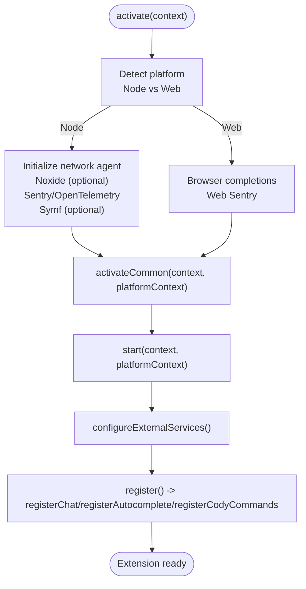
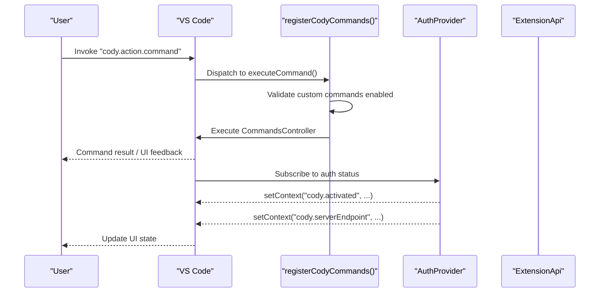
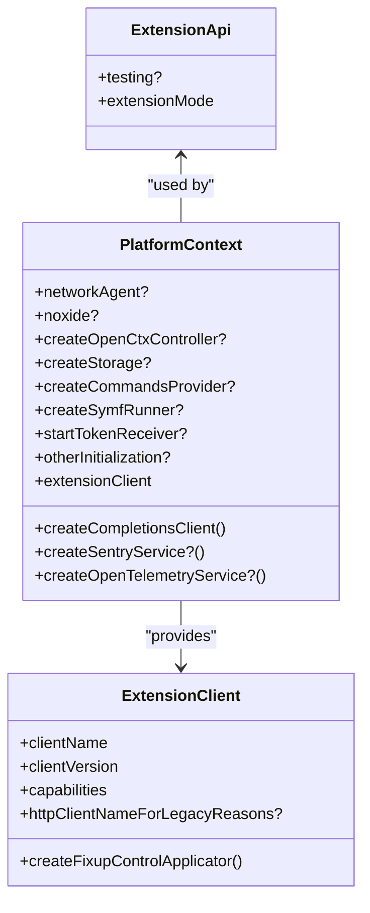
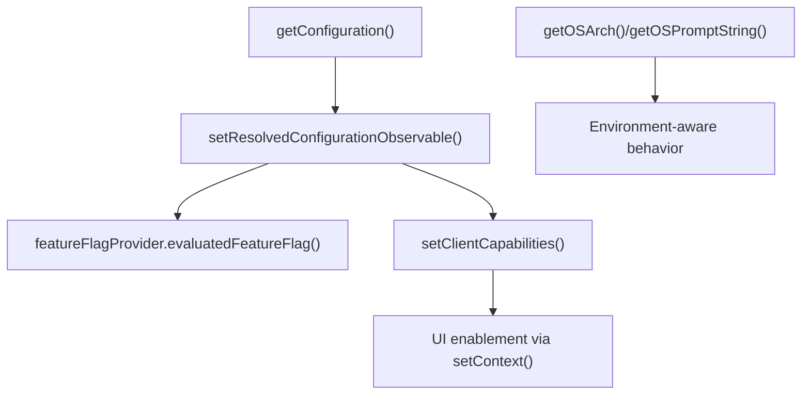
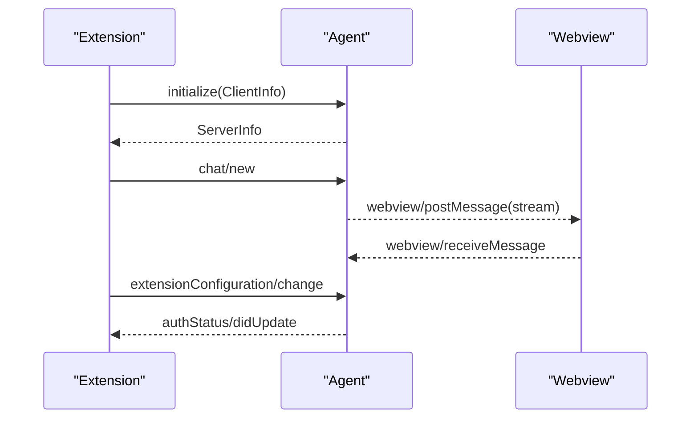
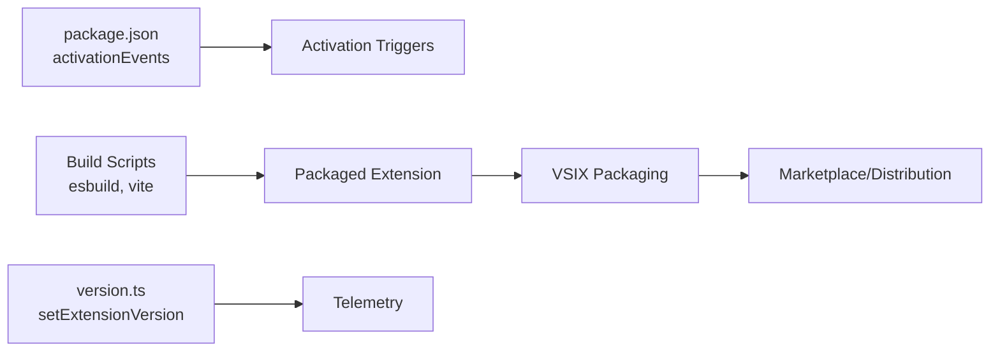
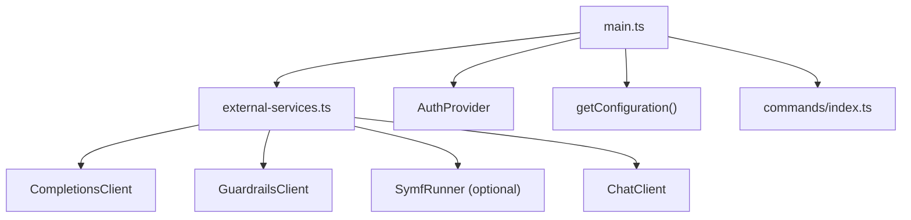

# VS Code Extension

<cite>
**Referenced Files in This Document**
- [main.ts](file://vscode/src/main.ts)
- [extension.common.ts](file://vscode/src/extension.common.ts)
- [extension.node.ts](file://vscode/src/extension.node.ts)
- [extension.web.ts](file://vscode/src/extension.web.ts)
- [extension-api.ts](file://vscode/src/extension-api.ts)
- [extension-client.ts](file://vscode/src/extension-client.ts)
- [configuration.ts](file://vscode/src/configuration.ts)
- [version.ts](file://vscode/src/version.ts)
- [os.ts](file://vscode/src/os.ts)
- [commands/index.ts](file://vscode/src/commands/index.ts)
- [services/AuthProvider.ts](file://vscode/src/services/AuthProvider.ts)
- [completions/default-client.ts](file://vscode/src/completions/default-client.ts)
- [jsonrpc/agent-protocol.ts](file://vscode/src/jsonrpc/agent-protocol.ts)
- [external-services.ts](file://vscode/src/external-services.ts)
- [package.json](file://vscode/package.json)
</cite>

## Table of Contents
1. [Introduction](#introduction)
2. [Project Structure](#project-structure)
3. [Core Components](#core-components)
4. [Architecture Overview](#architecture-overview)
5. [Detailed Component Analysis](#detailed-component-analysis)
6. [Dependency Analysis](#dependency-analysis)
7. [Performance Considerations](#performance-considerations)
8. [Troubleshooting Guide](#troubleshooting-guide)
9. [Conclusion](#conclusion)
10. [Appendices](#appendices)

## Introduction
This document describes the VS Code extension implementation for the Cody AI assistant. It explains the extension architecture, activation lifecycle, platform-specific implementations, API surface, configuration and capability detection, environment adaptation, installation and activation triggers, performance optimization strategies, the relationship to the agent runtime, and packaging/distribution/update mechanisms.

## Project Structure
The VS Code extension is organized into platform entry points, a shared activation layer, and feature modules. The package manifest defines activation events and contributes commands, menus, and keybindings.

**Diagram sources**
- [package.json:122-122](file://vscode/package.json#L122-L122)
- [extension.node.ts:25-58](file://vscode/src/extension.node.ts#L25-L58)
- [extension.web.ts:14-23](file://vscode/src/extension.web.ts#L14-L23)
- [extension.common.ts:44-77](file://vscode/src/extension.common.ts#L44-L77)
- [main.ts:122-357](file://vscode/src/main.ts#L122-L357)
- [external-services.ts:21-60](file://vscode/src/external-services.ts#L21-L60)
- [configuration.ts:25-204](file://vscode/src/configuration.ts#L25-L204)
- [services/AuthProvider.ts:45-206](file://vscode/src/services/AuthProvider.ts#L45-L206)
- [completions/default-client.ts:48-314](file://vscode/src/completions/default-client.ts#L48-L314)
- [commands/index.ts:18-90](file://vscode/src/commands/index.ts#L18-L90)
- [os.ts:4-67](file://vscode/src/os.ts#L4-L67)
- [extension-api.ts:5-19](file://vscode/src/extension-api.ts#L5-L19)
- [extension-client.ts:11-43](file://vscode/src/extension-client.ts#L11-L43)

**Section sources**
- [package.json:122-122](file://vscode/package.json#L122-L122)
- [extension.node.ts:25-58](file://vscode/src/extension.node.ts#L25-L58)
- [extension.web.ts:14-23](file://vscode/src/extension.web.ts#L14-L23)
- [extension.common.ts:44-77](file://vscode/src/extension.common.ts#L44-L77)
- [main.ts:122-357](file://vscode/src/main.ts#L122-L357)

## Core Components
- Platform entry points:
  - Desktop (Node/Electron): initializes network agent, optional Noxide library, Sentry/OpenTelemetry, and registers platform-specific services.
  - Web: browser-based client using browser-based completions and web Sentry.
- Shared activation:
  - Centralized activation orchestrator wires configuration, secrets, telemetry, external services, and feature registration.
- Extension API surface:
  - Exposes a minimal ExtensionApi for test support and extension mode.
- Extension client:
  - Delegates component creation to the client (VSCode, Agent, etc.) based on capabilities.

**Section sources**
- [extension.node.ts:25-58](file://vscode/src/extension.node.ts#L25-L58)
- [extension.web.ts:14-23](file://vscode/src/extension.web.ts#L14-L23)
- [extension.common.ts:44-77](file://vscode/src/extension.common.ts#L44-L77)
- [extension-api.ts:5-19](file://vscode/src/extension-api.ts#L5-L19)
- [extension-client.ts:11-43](file://vscode/src/extension-client.ts#L11-L43)

## Architecture Overview
The extension follows a layered architecture:
- Platform entry points select platform-specific factories and pass them to the shared activation.
- The shared activation constructs external services (Sentry, OpenTelemetry, completions, guardrails, symf), initializes configuration observables, and registers commands and features.
- Feature modules (auth, completions, chat, edits) integrate with VS Code APIs and the agent protocol.

**Diagram sources**
- [extension.node.ts:25-58](file://vscode/src/extension.node.ts#L25-L58)
- [extension.web.ts:14-23](file://vscode/src/extension.web.ts#L14-L23)
- [extension.common.ts:44-77](file://vscode/src/extension.common.ts#L44-L77)
- [main.ts:122-357](file://vscode/src/main.ts#L122-L357)
- [external-services.ts:21-60](file://vscode/src/external-services.ts#L21-L60)

## Detailed Component Analysis

### Activation Lifecycle and Platform-Specific Implementations
- Desktop (Node):
  - Initializes a delegating network agent, optional Noxide logging, Sentry, OpenTelemetry, and Symf runner based on configuration.
  - Creates a Node-based completions client and registers platform-specific features.
- Web:
  - Uses browser-based completions and web Sentry.
  - Exposes a factory to override platform context for dynamic activation scenarios.
- Shared activation:
  - Applies logger, client capabilities, and resolved configuration observables.
  - Initializes singletons, Git API, parsers, external services, and registers commands and features.

**Diagram sources**
- [extension.node.ts:25-58](file://vscode/src/extension.node.ts#L25-L58)
- [extension.web.ts:14-23](file://vscode/src/extension.web.ts#L14-L23)
- [extension.common.ts:44-77](file://vscode/src/extension.common.ts#L44-L77)
- [main.ts:122-357](file://vscode/src/main.ts#L122-L357)
- [external-services.ts:21-60](file://vscode/src/external-services.ts#L21-L60)

**Section sources**
- [extension.node.ts:25-58](file://vscode/src/extension.node.ts#L25-L58)
- [extension.web.ts:14-23](file://vscode/src/extension.web.ts#L14-L23)
- [extension.common.ts:44-77](file://vscode/src/extension.common.ts#L44-L77)
- [main.ts:122-357](file://vscode/src/main.ts#L122-L357)

### Extension API Surface: Commands, Events, and VS Code Integration
- Commands:
  - Chat, auth, debug, and Cody command families are registered with contextual enablement and keybindings.
- Events:
  - AuthProvider emits authentication status and updates context keys for UI enablement.
- VS Code integration:
  - Commands leverage VS Code APIs for settings, clipboard, env, windows, and webview panels.

**Diagram sources**
- [main.ts:405-526](file://vscode/src/main.ts#L405-L526)
- [services/AuthProvider.ts:172-196](file://vscode/src/services/AuthProvider.ts#L172-L196)
- [extension-api.ts:5-19](file://vscode/src/extension-api.ts#L5-L19)

**Section sources**
- [main.ts:405-526](file://vscode/src/main.ts#L405-L526)
- [services/AuthProvider.ts:172-196](file://vscode/src/services/AuthProvider.ts#L172-L196)
- [extension-api.ts:5-19](file://vscode/src/extension-api.ts#L5-L19)

### Multi-Platform Architecture: Common, Node, and Web
- Common:
  - Defines PlatformContext contract and shared activation logic.
- Node:
  - Adds Node-specific services (network agent, Noxide, Sentry, OpenTelemetry, Symf).
- Web:
  - Uses browser-compatible clients and services.

**Diagram sources**
- [extension.common.ts:24-37](file://vscode/src/extension.common.ts#L24-L37)
- [extension-client.ts:11-43](file://vscode/src/extension-client.ts#L11-L43)
- [extension-api.ts:5-19](file://vscode/src/extension-api.ts#L5-L19)

**Section sources**
- [extension.common.ts:24-37](file://vscode/src/extension.common.ts#L24-L37)
- [extension.node.ts:45-57](file://vscode/src/extension.node.ts#L45-L57)
- [extension.web.ts:18-23](file://vscode/src/extension.web.ts#L18-L23)
- [extension-client.ts:11-43](file://vscode/src/extension-client.ts#L11-L43)
- [extension-api.ts:5-19](file://vscode/src/extension-api.ts#L5-L19)

### Configuration, Capability Detection, and Environment Adaptation
- Configuration:
  - Centralized getter normalizes and sanitizes settings, including autocomplete modes, network/proxy, telemetry, and hidden/internal flags.
- Capability detection:
  - Client capabilities are set during activation and influence feature availability and UI enablement.
- Environment adaptation:
  - OS/arch detection and platform-specific behaviors (e.g., streaming SSE in Node).

**Diagram sources**
- [configuration.ts:25-204](file://vscode/src/configuration.ts#L25-L204)
- [main.ts:144-203](file://vscode/src/main.ts#L144-L203)
- [os.ts:18-67](file://vscode/src/os.ts#L18-L67)

**Section sources**
- [configuration.ts:25-204](file://vscode/src/configuration.ts#L25-L204)
- [main.ts:144-203](file://vscode/src/main.ts#L144-L203)
- [os.ts:18-67](file://vscode/src/os.ts#L18-L67)

### Relationship to Agent Runtime
- The extension communicates with the agent via a JSON-RPC protocol, including initialization, chat, commands, autocomplete, diagnostics, and webview messaging.
- The agent can control capabilities and UI context, and the extension adapts accordingly.

**Diagram sources**
- [jsonrpc/agent-protocol.ts:35-271](file://vscode/src/jsonrpc/agent-protocol.ts#L35-L271)
- [jsonrpc/agent-protocol.ts:313-472](file://vscode/src/jsonrpc/agent-protocol.ts#L313-L472)

**Section sources**
- [jsonrpc/agent-protocol.ts:35-271](file://vscode/src/jsonrpc/agent-protocol.ts#L35-L271)
- [jsonrpc/agent-protocol.ts:313-472](file://vscode/src/jsonrpc/agent-protocol.ts#L313-L472)

### Installation Procedures, Activation Triggers, and Packaging
- Activation triggers:
  - Defined in the package manifest to activate on language events, startup, and webview panel creation.
- Packaging and distribution:
  - Build scripts bundle Node and Web variants, webviews, and assets; post-install steps download WASM and fonts; uninstall script is configured.
- Update mechanisms:
  - The extension version is exposed and used for telemetry identification.

**Diagram sources**
- [package.json:122-122](file://vscode/package.json#L122-L122)
- [package.json:34-37](file://vscode/package.json#L34-L37)
- [package.json:54-54](file://vscode/package.json#L54-L54)
- [version.ts:9-14](file://vscode/src/version.ts#L9-L14)

**Section sources**
- [package.json:122-122](file://vscode/package.json#L122-L122)
- [package.json:34-37](file://vscode/package.json#L34-L37)
- [package.json:54-54](file://vscode/package.json#L54-L54)
- [version.ts:9-14](file://vscode/src/version.ts#L9-L14)

## Dependency Analysis
- External services:
  - Completions client, chat client, guardrails, and optional Symf runner are wired via a factory pattern.
- Feature registration:
  - Commands, menus, and keybindings are contributed through the package manifest and registered at runtime.
- Auth and telemetry:
  - AuthProvider manages status and context keys; telemetry recorder is initialized during activation.

**Diagram sources**
- [external-services.ts:21-60](file://vscode/src/external-services.ts#L21-L60)
- [main.ts:244-252](file://vscode/src/main.ts#L244-L252)
- [services/AuthProvider.ts:45-206](file://vscode/src/services/AuthProvider.ts#L45-L206)
- [configuration.ts:25-204](file://vscode/src/configuration.ts#L25-L204)
- [commands/index.ts:18-90](file://vscode/src/commands/index.ts#L18-L90)

**Section sources**
- [external-services.ts:21-60](file://vscode/src/external-services.ts#L21-L60)
- [main.ts:244-252](file://vscode/src/main.ts#L244-L252)
- [services/AuthProvider.ts:45-206](file://vscode/src/services/AuthProvider.ts#L45-L206)
- [configuration.ts:25-204](file://vscode/src/configuration.ts#L25-L204)
- [commands/index.ts:18-90](file://vscode/src/commands/index.ts#L18-L90)

## Performance Considerations
- Streaming completions:
  - SSE streaming is enabled in Node environments to reduce latency.
- Feature toggles:
  - Feature flags gate expensive features (e.g., autoedits, supercompletions) and allow gradual rollout.
- Observables and change detection:
  - DistinctUntilChanged and switchMap minimize unnecessary recomputation and provider recreation.
- Network and telemetry:
  - Optional OpenTelemetry and Sentry services are conditionally initialized to avoid overhead.

[No sources needed since this section provides general guidance]

## Troubleshooting Guide
- Authentication:
  - AuthProvider updates context keys and telemetry; use debug commands to export logs and report issues.
- Rate limits and errors:
  - Completions client surfaces rate limit and network errors; the extension logs and surfaces actionable UI.
- Setup notifications:
  - On first activation, a setup notification is shown; address configuration prompts to enable features.

**Section sources**
- [services/AuthProvider.ts:172-196](file://vscode/src/services/AuthProvider.ts#L172-L196)
- [completions/default-client.ts:149-165](file://vscode/src/completions/default-client.ts#L149-L165)
- [main.ts:313-313](file://vscode/src/main.ts#L313-L313)
- [main.ts:641-652](file://vscode/src/main.ts#L641-L652)

## Conclusion
The VS Code extension is structured around a shared activation layer with platform-specific entry points. It integrates tightly with VS Code APIs, manages configuration and capabilities dynamically, and exposes a focused API surface for commands and testing. Its architecture supports both desktop and web environments, leverages observables for responsive UI, and provides robust mechanisms for authentication, telemetry, and agent communication.

## Appendices
- Key configuration keys and feature flags are defined and sanitized in the configuration module.
- Commands and menus are declared in the package manifest and registered at runtime.
- The extension version is propagated to telemetry for accurate attribution.

**Section sources**
- [configuration.ts:25-204](file://vscode/src/configuration.ts#L25-L204)
- [package.json:192-539](file://vscode/package.json#L192-L539)
- [version.ts:9-14](file://vscode/src/version.ts#L9-L14)