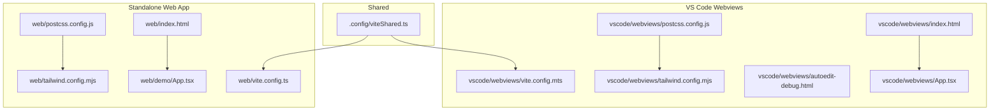
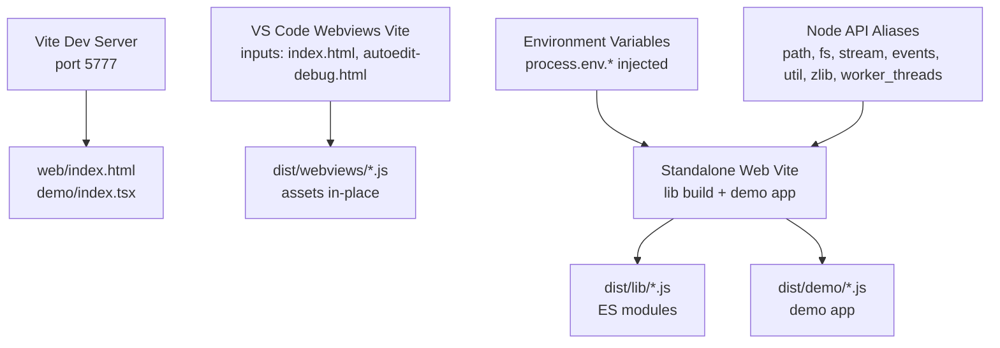
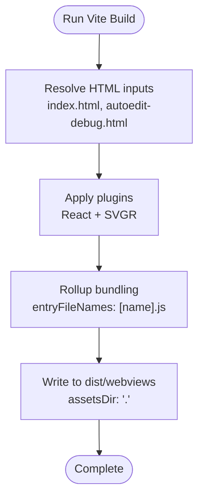
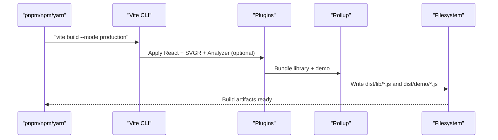
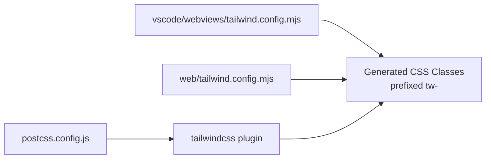
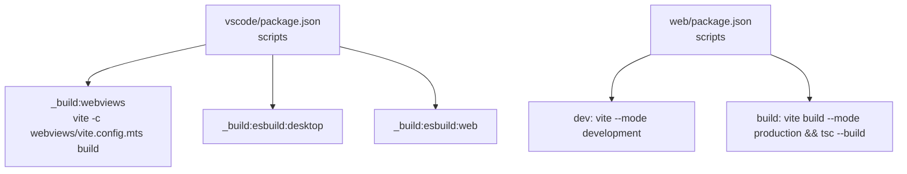

# Build & Deployment

<cite>
**Referenced Files in This Document**
- [.config/viteShared.ts](file://.config/viteShared.ts)
- [vscode/webviews/vite.config.mts](file://vscode/webviews/vite.config.mts)
- [vscode/webviews/postcss.config.js](file://vscode/webviews/postcss.config.js)
- [vscode/webviews/tailwind.config.mjs](file://vscode/webviews/tailwind.config.mjs)
- [vscode/webviews/index.html](file://vscode/webviews/index.html)
- [vscode/webviews/autoedit-debug.html](file://vscode/webviews/autoedit-debug.html)
- [vscode/webviews/App.tsx](file://vscode/webviews/App.tsx)
- [web/vite.config.ts](file://web/vite.config.ts)
- [web/postcss.config.js](file://web/postcss.config.js)
- [web/tailwind.config.mjs](file://web/tailwind.config.mjs)
- [web/index.html](file://web/index.html)
- [web/demo/App.tsx](file://web/demo/App.tsx)
- [vscode/package.json](file://vscode/package.json)
- [web/package.json](file://web/package.json)
</cite>

## Table of Contents
1. [Introduction](#introduction)
2. [Project Structure](#project-structure)
3. [Core Components](#core-components)
4. [Architecture Overview](#architecture-overview)
5. [Detailed Component Analysis](#detailed-component-analysis)
6. [Dependency Analysis](#dependency-analysis)
7. [Performance Considerations](#performance-considerations)
8. [Troubleshooting Guide](#troubleshooting-guide)
9. [Conclusion](#conclusion)
10. [Appendices](#appendices)

## Introduction
This document explains the build system and deployment pipeline for the web components powering both the VS Code extension webviews and the standalone Cody web application. It covers Vite configuration, bundling strategies, asset optimization, Tailwind CSS and PostCSS integration, development server setup, hot reloading, production builds, minification, bundle analysis, environment configuration, and deployment workflows. It also includes guidance for debugging, performance monitoring, and resolving common build issues.

## Project Structure
The build system is split across two primary Vite configurations:
- VS Code webviews build: Produces extension-hosted webviews assets under the VS Code package.
- Standalone web application build: Produces a distributable library and demo application under the web package.

Key elements:
- Shared Vite defaults and project scaffolding live in a shared configuration module.
- Each build defines its own Vite configuration, PostCSS pipeline, and Tailwind configuration.
- HTML entry points define the runtime bootstrap for each webview and demo app.
- Scripts orchestrate development and production builds for both targets.

**Diagram sources**
- [.config/viteShared.ts:1-51](file://.config/viteShared.ts#L1-L51)
- [vscode/webviews/vite.config.mts:1-37](file://vscode/webviews/vite.config.mts#L1-L37)
- [vscode/webviews/postcss.config.js:1-8](file://vscode/webviews/postcss.config.js#L1-L8)
- [vscode/webviews/tailwind.config.mjs:1-167](file://vscode/webviews/tailwind.config.mjs#L1-L167)
- [vscode/webviews/index.html:1-23](file://vscode/webviews/index.html#L1-L23)
- [vscode/webviews/autoedit-debug.html:1-18](file://vscode/webviews/autoedit-debug.html#L1-L18)
- [vscode/webviews/App.tsx:1-273](file://vscode/webviews/App.tsx#L1-L273)
- [web/vite.config.ts:1-137](file://web/vite.config.ts#L1-L137)
- [web/postcss.config.js:1-8](file://web/postcss.config.js#L1-L8)
- [web/tailwind.config.mjs:1-15](file://web/tailwind.config.mjs#L1-L15)
- [web/index.html:1-14](file://web/index.html#L1-L14)
- [web/demo/App.tsx:1-53](file://web/demo/App.tsx#L1-L53)

**Section sources**
- [.config/viteShared.ts:1-51](file://.config/viteShared.ts#L1-L51)
- [vscode/webviews/vite.config.mts:1-37](file://vscode/webviews/vite.config.mts#L1-L37)
- [web/vite.config.ts:1-137](file://web/vite.config.ts#L1-L137)

## Core Components
- Shared Vite defaults: Provides consistent project-level defaults, CSS modules behavior, and Vitest configuration for workspace projects.
- VS Code webviews build: Defines React + SVG-R support, Rollup inputs for multiple HTML entries, output layout for extension hosting, and watch mode exclusions.
- Standalone web build: Defines a development server, extensive aliasing for Node APIs and modules, environment variable injection, library build for ES modules, and optional bundle analysis.
- Tailwind CSS: Two configurations—one for webviews and one for the standalone app—sharing common theme tokens and extending them for the demo and web contexts.
- PostCSS: Nested and mixins support plus Tailwind integration configured per project.
- HTML entry points: Minimal, CSP-compliant pages that mount the React application bundles.

**Section sources**
- [.config/viteShared.ts:9-27](file://.config/viteShared.ts#L9-L27)
- [vscode/webviews/vite.config.mts:9-36](file://vscode/webviews/vite.config.mts#L9-L36)
- [web/vite.config.ts:25-136](file://web/vite.config.ts#L25-L136)
- [vscode/webviews/postcss.config.js:1-8](file://vscode/webviews/postcss.config.js#L1-L8)
- [web/postcss.config.js:1-8](file://web/postcss.config.js#L1-L8)
- [vscode/webviews/tailwind.config.mjs:1-167](file://vscode/webviews/tailwind.config.mjs#L1-L167)
- [web/tailwind.config.mjs:1-15](file://web/tailwind.config.mjs#L1-L15)
- [vscode/webviews/index.html:1-23](file://vscode/webviews/index.html#L1-L23)
- [vscode/webviews/autoedit-debug.html:1-18](file://vscode/webviews/autoedit-debug.html#L1-L18)
- [web/index.html:1-14](file://web/index.html#L1-L14)

## Architecture Overview
The build architecture separates concerns between:
- VS Code webviews: Built with Vite, emitting assets consumed by the extension host. Inputs include the main chat webview and an auto-edit debug page.
- Standalone web app: Built as an ES module library plus a demo application. It aliases Node APIs to browser-compatible shims and injects environment variables at build time.

**Diagram sources**
- [web/vite.config.ts:29-136](file://web/vite.config.ts#L29-L136)
- [vscode/webviews/vite.config.mts:13-36](file://vscode/webviews/vite.config.mts#L13-L36)
- [web/index.html:1-14](file://web/index.html#L1-L14)

## Detailed Component Analysis

### Shared Vite Defaults
- Purpose: Centralize common Vite and Vitest defaults for workspace projects.
- Highlights:
  - TypeScript aliasing for internal packages to source entry points.
  - CSS modules camelCase convention.
  - Test environment enhancements and timeouts.

**Section sources**
- [.config/viteShared.ts:9-27](file://.config/viteShared.ts#L9-L27)

### VS Code Webviews Build
- Plugins: React and SVG-R.
- Inputs: Two HTML entry points mapped to separate JS outputs.
- Output: Non-empty output directory, custom assets directory, and explicit entry naming.
- Watch mode: Watches all sources except node_modules and src directories to avoid unnecessary rebuilds.
- Externalization: Externals node:https for compatibility.

**Diagram sources**
- [vscode/webviews/vite.config.mts:9-36](file://vscode/webviews/vite.config.mts#L9-L36)

**Section sources**
- [vscode/webviews/vite.config.mts:9-36](file://vscode/webviews/vite.config.mts#L9-L36)
- [vscode/webviews/index.html:1-23](file://vscode/webviews/index.html#L1-L23)
- [vscode/webviews/autoedit-debug.html:1-18](file://vscode/webviews/autoedit-debug.html#L1-L18)

### Standalone Web Application Build
- Dev server: Strict port binding and fixed port for deterministic local development.
- Plugins: React (SWC), SVG-R, optional bundle analyzer.
- Aliasing: Extensive browserify and shim replacements for Node APIs and modules.
- Define: Injects a controlled subset of environment variables at build time, excluding test-time leakage.
- Library build: Produces ES modules for both the main library and a dedicated worker.
- Minification: Disabled in favor of stability in inline web workers on Safari.
- Watch mode: Watches demo and library sources while excluding node_modules.

**Diagram sources**
- [web/vite.config.ts:25-136](file://web/vite.config.ts#L25-L136)

**Section sources**
- [web/vite.config.ts:25-136](file://web/vite.config.ts#L25-L136)

### Tailwind CSS Integration
- Webviews Tailwind:
  - Scans TS/TSX sources across webviews and shared libraries.
  - Prefixes generated classes to avoid conflicts.
  - Extends theme tokens to align with VS Code color variables and spacing.
  - Adds custom variants for high-contrast themes.
- Standalone Tailwind:
  - Reuses webviews Tailwind configuration and extends content scanning to include demo and library sources.

**Diagram sources**
- [vscode/webviews/tailwind.config.mjs:1-167](file://vscode/webviews/tailwind.config.mjs#L1-L167)
- [web/tailwind.config.mjs:1-15](file://web/tailwind.config.mjs#L1-L15)
- [vscode/webviews/postcss.config.js:1-8](file://vscode/webviews/postcss.config.js#L1-L8)
- [web/postcss.config.js:1-8](file://web/postcss.config.js#L1-L8)

**Section sources**
- [vscode/webviews/tailwind.config.mjs:5-166](file://vscode/webviews/tailwind.config.mjs#L5-L166)
- [web/tailwind.config.mjs:3-14](file://web/tailwind.config.mjs#L3-L14)
- [vscode/webviews/postcss.config.js:1-8](file://vscode/webviews/postcss.config.js#L1-L8)
- [web/postcss.config.js:1-8](file://web/postcss.config.js#L1-L8)

### PostCSS Processing
- Webviews: Uses nested SCSS-like syntax and Tailwind with a dedicated config path.
- Standalone: Adds mixins support alongside nested rules and Tailwind.

**Section sources**
- [vscode/webviews/postcss.config.js:1-8](file://vscode/webviews/postcss.config.js#L1-L8)
- [web/postcss.config.js:1-8](file://web/postcss.config.js#L1-L8)

### HTML Entry Points and App Bootstrap
- VS Code webviews:
  - Minimal CSP-compliant HTML pages that mount the React application.
  - One entry for the main chat panel and another for the auto-edit debug panel.
- Standalone web:
  - Demo app mounts the library’s chat component and worker.

**Section sources**
- [vscode/webviews/index.html:1-23](file://vscode/webviews/index.html#L1-L23)
- [vscode/webviews/autoedit-debug.html:1-18](file://vscode/webviews/autoedit-debug.html#L1-L18)
- [web/index.html:1-14](file://web/index.html#L1-L14)
- [vscode/webviews/App.tsx:1-273](file://vscode/webviews/App.tsx#L1-L273)
- [web/demo/App.tsx:1-53](file://web/demo/App.tsx#L1-L53)

## Dependency Analysis
- VS Code package orchestrates builds for desktop and web, including webviews via Vite.
- Web package exposes scripts for development and production builds, and TypeScript compilation.
- Both builds rely on shared Vite defaults for consistency.

**Diagram sources**
- [vscode/package.json:37-37](file://vscode/package.json#L37-L37)
- [web/package.json:15-21](file://web/package.json#L15-L21)

**Section sources**
- [vscode/package.json:11-56](file://vscode/package.json#L11-L56)
- [web/package.json:15-21](file://web/package.json#L15-L21)

## Performance Considerations
- Minification disabled in the standalone build to prevent issues with inline web workers on Safari.
- Bundle analysis can be enabled via an environment flag to inspect bundle composition.
- Watch mode excludes node_modules and src directories to reduce rebuild overhead.
- CSS modules camelCaseOnly reduces selector verbosity and improves maintainability.
- Aliasing Node APIs to lightweight browser shims avoids pulling heavy polyfills.

Recommendations:
- Prefer enabling the analyzer during CI to track bundle regressions.
- Keep watch exclusions aligned with actual source trees to avoid unnecessary rebuilds.
- Monitor CSS class bloat by reviewing Tailwind content globs and purging unused styles in production.

**Section sources**
- [web/vite.config.ts:115-116](file://web/vite.config.ts#L115-L116)
- [web/vite.config.ts:37-37](file://web/vite.config.ts#L37-L37)
- [web/vite.config.ts:126-129](file://web/vite.config.ts#L126-L129)
- [.config/viteShared.ts:20-20](file://.config/viteShared.ts#L20-L20)

## Troubleshooting Guide
Common issues and resolutions:
- Inline web worker errors on Safari:
  - Cause: Minification transforms code in ways that break inline workers.
  - Resolution: Keep minification disabled in the standalone build.
  - Reference: [web/vite.config.ts:115-116](file://web/vite.config.ts#L115-L116)
- Missing CSS classes or broken styling:
  - Verify Tailwind content globs include all relevant TS/TSX files.
  - Confirm PostCSS plugins are present and Tailwind config paths are correct.
  - References: [vscode/webviews/tailwind.config.mjs:5-12](file://vscode/webviews/tailwind.config.mjs#L5-L12), [web/tailwind.config.mjs:5-12](file://web/tailwind.config.mjs#L5-L12), [vscode/webviews/postcss.config.js:1-8](file://vscode/webviews/postcss.config.js#L1-L8), [web/postcss.config.js:1-8](file://web/postcss.config.js#L1-L8)
- CSP violations in webviews:
  - Ensure CSP meta tag allows required sources and disallows inline scripts/styles.
  - References: [vscode/webviews/index.html:8-15](file://vscode/webviews/index.html#L8-L15), [vscode/webviews/autoedit-debug.html:8-10](file://vscode/webviews/autoedit-debug.html#L8-L10)
- Node API usage in browser bundle:
  - Use provided aliases and shims; avoid importing Node-only modules directly.
  - References: [web/vite.config.ts:39-93](file://web/vite.config.ts#L39-L93)
- Environment variables leaking into tests:
  - The build intentionally avoids injecting define values during Vitest runs.
  - Reference: [web/vite.config.ts:94-113](file://web/vite.config.ts#L94-L113)
- Slow dev rebuilds:
  - Adjust watch exclusions and ensure only necessary directories are included.
  - Reference: [web/vite.config.ts:126-129](file://web/vite.config.ts#L126-L129), [vscode/webviews/vite.config.mts:23-26](file://vscode/webviews/vite.config.mts#L23-L26)

**Section sources**
- [web/vite.config.ts:115-116](file://web/vite.config.ts#L115-L116)
- [vscode/webviews/tailwind.config.mjs:5-12](file://vscode/webviews/tailwind.config.mjs#L5-L12)
- [web/tailwind.config.mjs:5-12](file://web/tailwind.config.mjs#L5-L12)
- [vscode/webviews/postcss.config.js:1-8](file://vscode/webviews/postcss.config.js#L1-L8)
- [web/postcss.config.js:1-8](file://web/postcss.config.js#L1-L8)
- [vscode/webviews/index.html:8-15](file://vscode/webviews/index.html#L8-L15)
- [vscode/webviews/autoedit-debug.html:8-10](file://vscode/webviews/autoedit-debug.html#L8-L10)
- [web/vite.config.ts:39-93](file://web/vite.config.ts#L39-L93)
- [web/vite.config.ts:94-113](file://web/vite.config.ts#L94-L113)
- [web/vite.config.ts:126-129](file://web/vite.config.ts#L126-L129)
- [vscode/webviews/vite.config.mts:23-26](file://vscode/webviews/vite.config.mts#L23-L26)

## Conclusion
The build and deployment pipeline combines shared Vite defaults with project-specific configurations to deliver robust, maintainable assets for both VS Code webviews and the standalone web application. Tailwind and PostCSS provide a scalable styling architecture, while careful environment configuration and aliasing ensure compatibility across platforms. The development server and watch modes streamline iteration, and production builds emphasize correctness and observability via bundle analysis.

## Appendices

### Development Server Setup and Hot Reloading
- Standalone web app dev server runs on a fixed port with strict port binding to avoid conflicts.
- Watch mode monitors demo and library sources, excluding node_modules for performance.

**Section sources**
- [web/vite.config.ts:29-32](file://web/vite.config.ts#L29-L32)
- [web/vite.config.ts:126-129](file://web/vite.config.ts#L126-L129)

### Production Builds and Bundle Analysis
- Production builds disable minification for Safari compatibility.
- Optional bundle analysis can be enabled via an environment flag.
- Library builds emit ES modules suitable for downstream consumption.

**Section sources**
- [web/vite.config.ts:115-116](file://web/vite.config.ts#L115-L116)
- [web/vite.config.ts:37-37](file://web/vite.config.ts#L37-L37)
- [web/vite.config.ts:120-123](file://web/vite.config.ts#L120-L123)

### Deployment for VS Code Extension Webviews
- Webviews are built with Vite and emitted under the extension’s distribution directory for embedding in the VS Code webview panel.
- HTML entries define CSP and mount points for the React application.

**Section sources**
- [vscode/webviews/vite.config.mts:13-36](file://vscode/webviews/vite.config.mts#L13-L36)
- [vscode/webviews/index.html:1-23](file://vscode/webviews/index.html#L1-L23)
- [vscode/webviews/autoedit-debug.html:1-18](file://vscode/webviews/autoedit-debug.html#L1-L18)

### Deployment for Standalone Web Application
- The standalone app builds an ES module library and a demo application.
- Scripts orchestrate development and production builds, with TypeScript compilation after bundling.

**Section sources**
- [web/package.json:15-21](file://web/package.json#L15-L21)
- [web/vite.config.ts:114-136](file://web/vite.config.ts#L114-L136)

### Environment Configuration and Build Optimization
- Controlled environment variables are injected at build time, avoiding test-time leakage.
- Aliasing replaces Node APIs with browser-friendly alternatives to reduce bundle size and avoid runtime errors.

**Section sources**
- [web/vite.config.ts:94-113](file://web/vite.config.ts#L94-L113)
- [web/vite.config.ts:39-93](file://web/vite.config.ts#L39-L93)