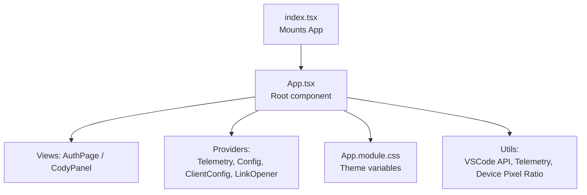
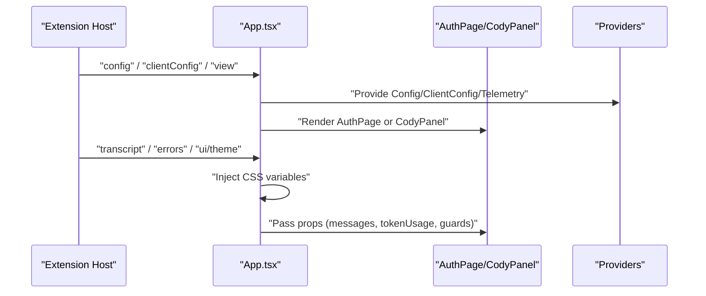
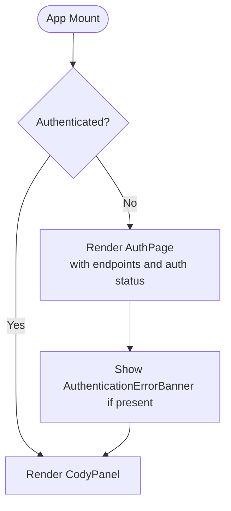
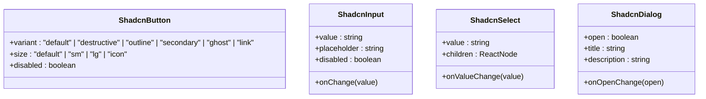
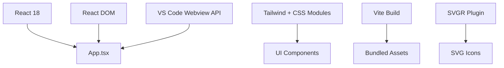

# Component Library

<cite>
**Referenced Files in This Document**
- [App.tsx](file://vscode/webviews/App.tsx)
- [index.tsx](file://vscode/webviews/index.tsx)
- [vite.config.mts](file://vscode/webviews/vite.config.mts)
- [package.json](file://vscode/package.json)
- [App.module.css](file://vscode/webviews/App.module.css)
- [LoadingPage.tsx](file://vscode/webviews/LoadingPage.tsx)
- [AuthPage.tsx](file://vscode/webviews/AuthPage.tsx)
- [CodyPanel.tsx](file://vscode/webviews/CodyPanel.tsx)
- [AuthenticationErrorBanner.tsx](file://vscode/webviews/components/AuthenticationErrorBanner.tsx)
- [hooks.ts](file://vscode/webviews/components/hooks.ts)
- [RichCodeBlock.tsx](file://vscode/webviews/components/RichCodeBlock.tsx)
- [HighlightedCode.tsx](file://vscode/webviews/components/HighlightedCode.tsx)
- [MarkdownFromCody.tsx](file://vscode/webviews/components/MarkdownFromCody.tsx)
- [Kbd.tsx](file://vscode/webviews/components/Kbd.tsx)
- [UserAvatar.tsx](file://vscode/webviews/components/UserAvatar.tsx)
- [UserMenu.tsx](file://vscode/webviews/components/UserMenu.tsx)
- [CollapsiblePanel.tsx](file://vscode/webviews/components/CollapsiblePanel.tsx)
- [ScrollDown.tsx](file://vscode/webviews/components/ScrollDown.tsx)
- [Notices.tsx](file://vscode/webviews/components/Notices.tsx)
- [GuardrailsStatus.tsx](file://vscode/webviews/components/GuardrailsStatus.tsx)
- [promptList](file://vscode/webviews/components/promptList)
- [promptSelectField](file://vscode/webviews/components/promptSelectField)
- [modelSelectField](file://vscode/webviews/components/modelSelectField)
- [shadcn](file://vscode/webviews/components/shadcn)
- [icons](file://vscode/webviews/icons)
- [components.json](file://vscode/components.json)
</cite>

## Table of Contents
1. [Introduction](#introduction)
2. [Project Structure](#project-structure)
3. [Core Components](#core-components)
4. [Architecture Overview](#architecture-overview)
5. [Detailed Component Analysis](#detailed-component-analysis)
6. [Dependency Analysis](#dependency-analysis)
7. [Performance Considerations](#performance-considerations)
8. [Troubleshooting Guide](#troubleshooting-guide)
9. [Conclusion](#conclusion)
10. [Appendices](#appendices)

## Introduction
This document describes the React component library that powers the web interface of the Cody extension. It explains the design system architecture, component hierarchy, and reusable UI elements. It covers shadcn-inspired UI components, code snippet viewers, prompt selectors, and icon systems. It also documents component props, styling patterns, customization options, composition examples, state management patterns, accessibility, responsiveness, cross-browser compatibility, and integration guidelines.

## Project Structure
The web interface is a React application built with Vite and served via a VS Code webview. The entry point initializes the app and mounts it under a root element. The App component orchestrates views, configuration, telemetry, and providers. It conditionally renders either an authentication page or the main chat panel.

**Diagram sources**
- [index.tsx:11-17](file://vscode/webviews/index.tsx#L11-L17)
- [App.tsx:32-233](file://vscode/webviews/App.tsx#L32-L233)
- [App.module.css](file://vscode/webviews/App.module.css)

**Section sources**
- [index.tsx:1-18](file://vscode/webviews/index.tsx#L1-L18)
- [App.tsx:32-233](file://vscode/webviews/App.tsx#L32-L233)
- [vite.config.mts:9-36](file://vscode/webviews/vite.config.mts#L9-L36)

## Core Components
This section outlines the primary building blocks of the UI:

- App: Orchestrates configuration, client configuration, theme injection, telemetry, and view selection. It composes providers and renders either the login or chat view.
- AuthPage: Handles authentication flows and displays authentication-related errors.
- LoadingPage: Renders while configuration and view state are initializing.
- CodyPanel: Hosts the chat experience, including transcript rendering, token usage display, notices, and guardrails integration.
- Reusable UI elements: RichCodeBlock, HighlightedCode, MarkdownFromCody, Kbd, UserAvatar, UserMenu, CollapsiblePanel, ScrollDown, Notices, GuardrailsStatus.
- Prompts and selectors: promptList, promptSelectField, promptTagsFilter, promptOwnerFilter, modelSelectField.
- Icons: SVG-based icon system integrated via SSG and Vite SVGR plugin.
- Providers: TelemetryRecorderContext, ConfigProvider, ClientConfigProvider, LinkOpenerProvider.

**Section sources**
- [App.tsx:32-233](file://vscode/webviews/App.tsx#L32-L233)
- [AuthPage.tsx](file://vscode/webviews/AuthPage.tsx)
- [LoadingPage.tsx](file://vscode/webviews/LoadingPage.tsx)
- [CodyPanel.tsx](file://vscode/webviews/CodyPanel.tsx)
- [RichCodeBlock.tsx](file://vscode/webviews/components/RichCodeBlock.tsx)
- [HighlightedCode.tsx](file://vscode/webviews/components/HighlightedCode.tsx)
- [MarkdownFromCody.tsx](file://vscode/webviews/components/MarkdownFromCody.tsx)
- [Kbd.tsx](file://vscode/webviews/components/Kbd.tsx)
- [UserAvatar.tsx](file://vscode/webviews/components/UserAvatar.tsx)
- [UserMenu.tsx](file://vscode/webviews/components/UserMenu.tsx)
- [CollapsiblePanel.tsx](file://vscode/webviews/components/CollapsiblePanel.tsx)
- [ScrollDown.tsx](file://vscode/webviews/components/ScrollDown.tsx)
- [Notices.tsx](file://vscode/webviews/components/Notices.tsx)
- [GuardrailsStatus.tsx](file://vscode/webviews/components/GuardrailsStatus.tsx)
- [promptList](file://vscode/webviews/components/promptList)
- [promptSelectField](file://vscode/webviews/components/promptSelectField)
- [modelSelectField](file://vscode/webviews/components/modelSelectField)
- [icons](file://vscode/webviews/icons)

## Architecture Overview
The architecture centers on a single-page app pattern inside a VS Code webview. The App component listens to messages from the extension host to update configuration, client configuration, transcripts, and attribution. It injects theme CSS variables and coordinates telemetry and device pixel ratio updates. Providers wrap the rendered view to supply configuration and services.

**Diagram sources**
- [App.tsx:67-136](file://vscode/webviews/App.tsx#L67-L136)
- [App.tsx:192-233](file://vscode/webviews/App.tsx#L192-L233)

## Detailed Component Analysis

### App Component
Responsibilities:
- Manage configuration and client configuration state.
- Listen to messages from the extension host to update UI state.
- Inject theme CSS variables into the document root.
- Compose providers and render the appropriate view.
- Initialize telemetry and device pixel ratio notifier.

Key props and state:
- Props: vscodeAPI
- State: config, clientConfig, view, transcript, messageInProgress, tokenUsage, errorMessages
- Providers: TelemetryRecorderContext, ConfigProvider, ClientConfigProvider, LinkOpenerProvider

Composition pattern:
- Uses a wrapper composition utility to apply multiple providers around the rendered view.

Accessibility and responsiveness:
- Uses CSS variables for theming and supports dark/light modes via injected variables.
- No explicit ARIA attributes observed in the analyzed files; ensure consumers add ARIA roles and labels as needed.

Cross-browser compatibility:
- Built with modern ESNext target and React 18 Strict Mode; tested in VS Code webview runtime.

**Section sources**
- [App.tsx:32-273](file://vscode/webviews/App.tsx#L32-L273)
- [App.module.css](file://vscode/webviews/App.module.css)

### Authentication and Login Flow
The App component conditionally renders AuthPage when the user is not authenticated. It passes down simplified login redirect handlers and configuration flags to control endpoint history and UI behavior.

**Diagram sources**
- [App.tsx:192-233](file://vscode/webviews/App.tsx#L192-L233)
- [AuthenticationErrorBanner.tsx](file://vscode/webviews/components/AuthenticationErrorBanner.tsx)

**Section sources**
- [App.tsx:192-233](file://vscode/webviews/App.tsx#L192-L233)
- [AuthenticationErrorBanner.tsx](file://vscode/webviews/components/AuthenticationErrorBanner.tsx)

### Chat Experience (CodyPanel)
CodyPanel hosts the chat transcript, token usage display, notices, and guardrails integration. It receives props from App such as transcript, messageInProgress, tokenUsage, and guardrails implementation.

Integration points:
- Receives attribution results and errors from the extension host via guardrails.
- Supports toggling chat features via clientConfig flags.

**Section sources**
- [CodyPanel.tsx](file://vscode/webviews/CodyPanel.tsx)
- [App.tsx:214-229](file://vscode/webviews/App.tsx#L214-L229)

### Code Snippet Viewers
Two components handle code presentation:
- RichCodeBlock: Renders highlighted code blocks with rich formatting and interactive features.
- HighlightedCode: Provides syntax-highlighted code rendering suitable for diffs and inline contexts.

Styling patterns:
- Both components rely on theme CSS variables and Tailwind-like class names applied via CSS modules.

**Section sources**
- [RichCodeBlock.tsx](file://vscode/webviews/components/RichCodeBlock.tsx)
- [HighlightedCode.tsx](file://vscode/webviews/components/HighlightedCode.tsx)

### Markdown Rendering
MarkdownFromCody renders markdown content produced by Cody, ensuring safe rendering and proper styling within the webview.

**Section sources**
- [MarkdownFromCody.tsx](file://vscode/webviews/components/MarkdownFromCody.tsx)

### Keyboard Shortcuts Display
Kbd renders keyboard shortcut hints consistently across the UI, using semantic markup and theme-aware styling.

**Section sources**
- [Kbd.tsx](file://vscode/webviews/components/Kbd.tsx)

### User Interface Elements
- UserAvatar: Displays user avatar with optional fallbacks.
- UserMenu: Provides user-related actions and settings.
- CollapsiblePanel: Encapsulates collapsible sections with consistent spacing and borders.
- ScrollDown: Indicates when new messages are available and allows quick scrolling to the bottom.

**Section sources**
- [UserAvatar.tsx](file://vscode/webviews/components/UserAvatar.tsx)
- [UserMenu.tsx](file://vscode/webviews/components/UserMenu.tsx)
- [CollapsiblePanel.tsx](file://vscode/webviews/components/CollapsiblePanel.tsx)
- [ScrollDown.tsx](file://vscode/webviews/components/ScrollDown.tsx)

### Notices and Guardrails
- Notices: Displays instance-wide notices to users.
- GuardrailsStatus: Integrates with guardrails attribution results and errors.

**Section sources**
- [Notices.tsx](file://vscode/webviews/components/Notices.tsx)
- [GuardrailsStatus.tsx](file://vscode/webviews/components/GuardrailsStatus.tsx)

### Prompt Selectors and Filters
Prompt-related components enable users to select and filter prompts:
- promptList: Renders lists of prompts with metadata and actions.
- promptSelectField: Dropdown/select field for choosing prompts.
- promptTagsFilter: Filter prompts by tags.
- promptOwnerFilter: Filter prompts by owner.
- modelSelectField: Dropdown/select field for model selection.

These components integrate with the prompt editor and extension APIs to hydrate and manage prompt data.

**Section sources**
- [promptList](file://vscode/webviews/components/promptList)
- [promptSelectField](file://vscode/webviews/components/promptSelectField)
- [modelSelectField](file://vscode/webviews/components/modelSelectField)

### Icon System
Icons are SVG-based and integrated via the SSG and Vite SVGR plugin. They are used across components for actions, status indicators, and branding.

**Section sources**
- [icons](file://vscode/webviews/icons)
- [vite.config.mts:10](file://vscode/webviews/vite.config.mts#L10)

### Shadcn-Inspired UI Components
The library includes shadcn-inspired UI components for forms, inputs, buttons, and layouts. These components are configured via components.json and styled with Tailwind classes.

**Diagram sources**
- [shadcn](file://vscode/webviews/components/shadcn)
- [components.json](file://vscode/components.json)

**Section sources**
- [shadcn](file://vscode/webviews/components/shadcn)
- [components.json](file://vscode/components.json)

## Dependency Analysis
The component library relies on:
- React 18 and React DOM for rendering.
- VS Code webview APIs for messaging and state synchronization.
- Tailwind CSS and CSS modules for styling.
- Vite for bundling and SVGR for SVG handling.

**Diagram sources**
- [index.tsx:11-17](file://vscode/webviews/index.tsx#L11-L17)
- [vite.config.mts:9-36](file://vscode/webviews/vite.config.mts#L9-L36)

**Section sources**
- [package.json:11-56](file://vscode/package.json#L11-L56)
- [vite.config.mts:9-36](file://vscode/webviews/vite.config.mts#L9-L36)

## Performance Considerations
- Prefer memoization for derived values and provider values to avoid unnecessary re-renders.
- Use CSS variables for theming to minimize style recalculations.
- Keep heavy computations off the UI thread; leverage useEffect and async patterns.
- Minimize bundle size by tree-shaking unused components and icons.

## Troubleshooting Guide
Common issues and resolutions:
- Authentication errors: Displayed via AuthenticationErrorBanner; ensure config.authStatus.error is passed correctly.
- Missing theme variables: Verify ui/theme messages are received and CSS variables are applied to the document root.
- Chat not rendering: Confirm view state transitions and transcript updates are handled; check for errors array updates.
- Telemetry not reporting: Ensure TelemetryRecorderContext is properly composed and configured.

**Section sources**
- [App.tsx:201-203](file://vscode/webviews/App.tsx#L201-L203)
- [App.tsx:71-78](file://vscode/webviews/App.tsx#L71-L78)
- [App.tsx:111-113](file://vscode/webviews/App.tsx#L111-L113)

## Conclusion
The component library provides a cohesive, theme-aware, and extensible UI foundation for the Cody web interface. It integrates tightly with VS Code webview APIs, supports robust authentication and chat experiences, and offers reusable components for prompts, code viewing, and UI controls. By following the composition patterns and provider architecture outlined here, teams can extend the UI safely and consistently.

## Appendices

### Accessibility Checklist
- Ensure all interactive elements have accessible names and roles.
- Provide keyboard navigation and focus management.
- Use sufficient color contrast and avoid color-only communication.
- Add ARIA live regions for dynamic content updates.

### Responsive Design Notes
- Components should adapt to narrow widths typical of sidebar panels.
- Avoid fixed widths; use relative units and flexbox/grid layouts.
- Test on various screen sizes and zoom levels.

### Cross-Browser Compatibility
- Target modern browsers supported by VS Code webview runtime.
- Avoid deprecated APIs; polyfill only when necessary.
- Validate layout and interaction across supported environments.