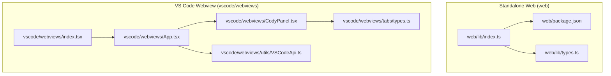
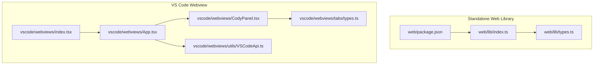
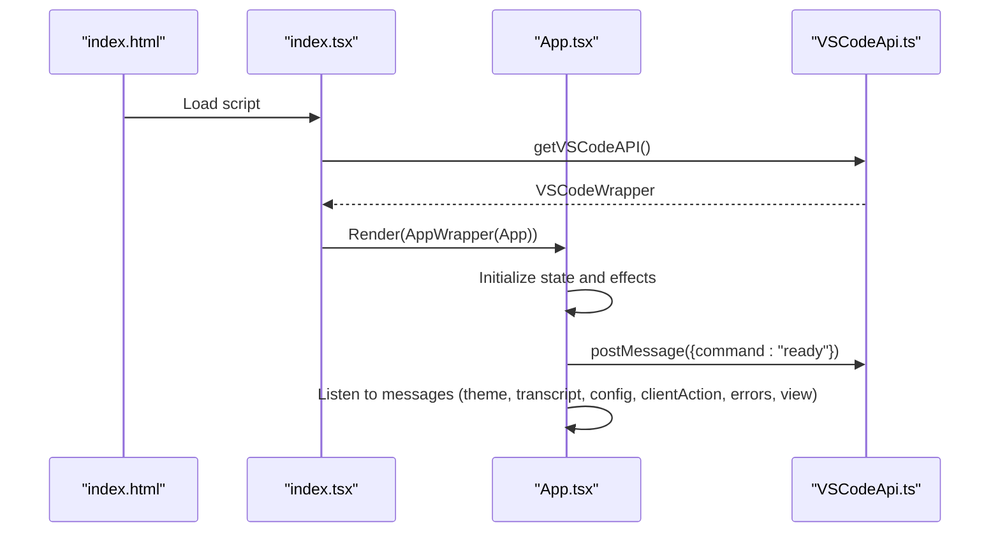
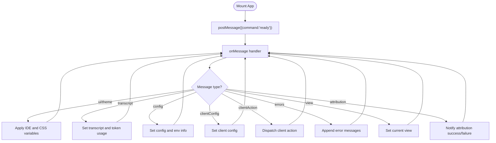
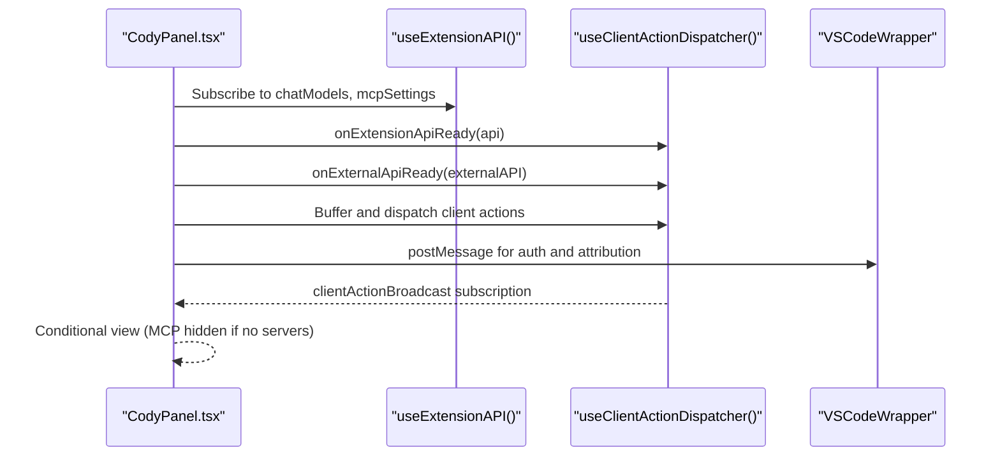
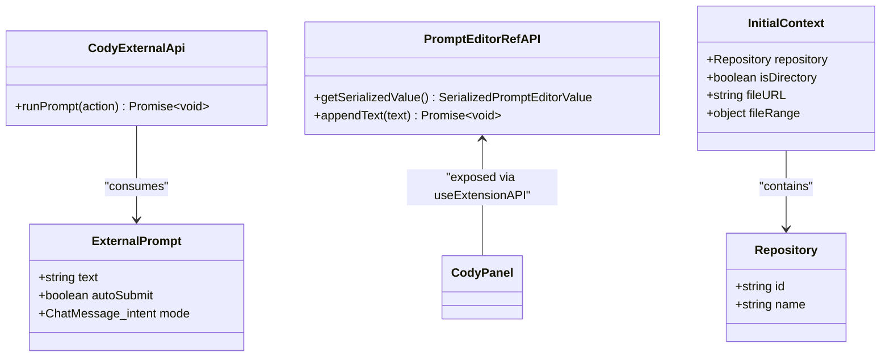
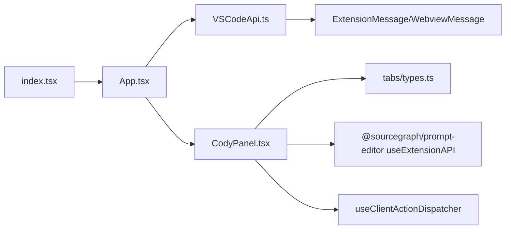

# Web Components

<cite>
**Referenced Files in This Document**
- [web/package.json](file://web/package.json)
- [web/lib/index.ts](file://web/lib/index.ts)
- [web/lib/types.ts](file://web/lib/types.ts)
- [vscode/webviews/App.tsx](file://vscode/webviews/App.tsx)
- [vscode/webviews/utils/VSCodeApi.ts](file://vscode/webviews/utils/VSCodeApi.ts)
- [vscode/webviews/CodyPanel.tsx](file://vscode/webviews/CodyPanel.tsx)
- [vscode/webviews/tabs/types.ts](file://vscode/webviews/tabs/types.ts)
- [vscode/webviews/index.tsx](file://vscode/webviews/index.tsx)
</cite>

## Table of Contents
1. [Introduction](#introduction)
2. [Project Structure](#project-structure)
3. [Core Components](#core-components)
4. [Architecture Overview](#architecture-overview)
5. [Detailed Component Analysis](#detailed-component-analysis)
6. [Dependency Analysis](#dependency-analysis)
7. [Performance Considerations](#performance-considerations)
8. [Troubleshooting Guide](#troubleshooting-guide)
9. [Conclusion](#conclusion)
10. [Appendices](#appendices)

## Introduction
This document describes the web components architecture that enables browser-based integration for Cody. It covers the React component library used in both the VS Code webview and standalone web applications, the state management and styling architecture, the build and bundling system, and the communication patterns between the web components and the underlying agent/runtime. It also addresses responsive design, accessibility, cross-browser compatibility, lifecycle considerations, performance optimization, and debugging tools.

## Project Structure
The web integration spans two primary areas:
- Standalone web application and component library under the web directory
- VS Code webview implementation under vscode/webviews

Key responsibilities:
- web: Standalone web app, component exports, build pipeline, and TypeScript declarations
- vscode/webviews: React-based VS Code webview UI, state orchestration, and VS Code messaging bridge

**Diagram sources**
- [web/package.json:1-52](file://web/package.json#L1-L52)
- [web/lib/index.ts:1-20](file://web/lib/index.ts#L1-L20)
- [web/lib/types.ts:1-31](file://web/lib/types.ts#L1-L31)
- [vscode/webviews/App.tsx:1-273](file://vscode/webviews/App.tsx#L1-L273)
- [vscode/webviews/CodyPanel.tsx:1-261](file://vscode/webviews/CodyPanel.tsx#L1-L261)
- [vscode/webviews/utils/VSCodeApi.ts:1-45](file://vscode/webviews/utils/VSCodeApi.ts#L1-L45)
- [vscode/webviews/index.tsx:1-18](file://vscode/webviews/index.tsx#L1-L18)
- [vscode/webviews/tabs/types.ts:1-9](file://vscode/webviews/tabs/types.ts#L1-L9)

**Section sources**
- [web/package.json:1-52](file://web/package.json#L1-L52)
- [web/lib/index.ts:1-20](file://web/lib/index.ts#L1-L20)
- [web/lib/types.ts:1-31](file://web/lib/types.ts#L1-L31)
- [vscode/webviews/App.tsx:1-273](file://vscode/webviews/App.tsx#L1-L273)
- [vscode/webviews/CodyPanel.tsx:1-261](file://vscode/webviews/CodyPanel.tsx#L1-L261)
- [vscode/webviews/utils/VSCodeApi.ts:1-45](file://vscode/webviews/utils/VSCodeApi.ts#L1-L45)
- [vscode/webviews/index.tsx:1-18](file://vscode/webviews/index.tsx#L1-L18)
- [vscode/webviews/tabs/types.ts:1-9](file://vscode/webviews/tabs/types.ts#L1-L9)

## Core Components
This section outlines the exported web components and their primary responsibilities.

- Exported components and types
  - web/lib/index.ts exports:
    - CodyWebChat and associated controller/message types
    - Prompt template component
    - Skeleton component
    - Shared types: Repository, InitialContext, CodyExternalApi, PromptEditorRefAPI
  - web/lib/types.ts defines:
    - External API contract for running prompts from outside the webview
    - Repository and InitialContext shapes
    - PromptEditorRefAPI for programmatic prompt editor interactions

- VS Code webview entry and orchestration
  - vscode/webviews/index.tsx renders the React root and passes the VS Code wrapper to App
  - vscode/webviews/App.tsx manages:
    - Theme application and CSS variable injection
    - Transcript synchronization and token usage updates
    - Client actions, configuration, and client configuration
    - Authentication flow and error banners
    - Telemetry recorder and OpenTelemetry service configuration
    - Device pixel ratio notifier
    - Composition of providers/wrappers for context providers

- Panel and views
  - vscode/webviews/CodyPanel.tsx:
    - Hosts tabs (Chat, History, MCP) and exposes external and extension APIs
    - Integrates chat models, MCP server discovery, notices, and error banners
    - Provides runPrompt external API via useExternalAPI
  - vscode/webviews/tabs/types.ts:
    - Defines View enum for navigation (Chat, Login, History, Account, Settings, Mcp)

**Section sources**
- [web/lib/index.ts:1-20](file://web/lib/index.ts#L1-L20)
- [web/lib/types.ts:1-31](file://web/lib/types.ts#L1-L31)
- [vscode/webviews/index.tsx:1-18](file://vscode/webviews/index.tsx#L1-L18)
- [vscode/webviews/App.tsx:1-273](file://vscode/webviews/App.tsx#L1-L273)
- [vscode/webviews/CodyPanel.tsx:1-261](file://vscode/webviews/CodyPanel.tsx#L1-L261)
- [vscode/webviews/tabs/types.ts:1-9](file://vscode/webviews/tabs/types.ts#L1-L9)

## Architecture Overview
The architecture separates concerns between the standalone web component library and the VS Code webview implementation. The web component library provides reusable UI elements and types for embedding in external web apps. The VS Code webview integrates tightly with the extension host via a message bridge and orchestrates state, configuration, and UI rendering.

**Diagram sources**
- [web/lib/index.ts:1-20](file://web/lib/index.ts#L1-L20)
- [web/lib/types.ts:1-31](file://web/lib/types.ts#L1-L31)
- [web/package.json:1-52](file://web/package.json#L1-L52)
- [vscode/webviews/index.tsx:1-18](file://vscode/webviews/index.tsx#L1-L18)
- [vscode/webviews/App.tsx:1-273](file://vscode/webviews/App.tsx#L1-L273)
- [vscode/webviews/CodyPanel.tsx:1-261](file://vscode/webviews/CodyPanel.tsx#L1-L261)
- [vscode/webviews/utils/VSCodeApi.ts:1-45](file://vscode/webviews/utils/VSCodeApi.ts#L1-L45)
- [vscode/webviews/tabs/types.ts:1-9](file://vscode/webviews/tabs/types.ts#L1-L9)

## Detailed Component Analysis

### VS Code Webview Entry Point
The webview bootstraps the React application and injects the VS Code message bridge.

**Diagram sources**
- [vscode/webviews/index.tsx:1-18](file://vscode/webviews/index.tsx#L1-L18)
- [vscode/webviews/App.tsx:1-273](file://vscode/webviews/App.tsx#L1-L273)
- [vscode/webviews/utils/VSCodeApi.ts:1-45](file://vscode/webviews/utils/VSCodeApi.ts#L1-L45)

**Section sources**
- [vscode/webviews/index.tsx:1-18](file://vscode/webviews/index.tsx#L1-L18)
- [vscode/webviews/App.tsx:1-273](file://vscode/webviews/App.tsx#L1-L273)
- [vscode/webviews/utils/VSCodeApi.ts:1-45](file://vscode/webviews/utils/VSCodeApi.ts#L1-L45)

### App State Management and Messaging
App coordinates theme application, transcript updates, configuration, client actions, and telemetry.

**Diagram sources**
- [vscode/webviews/App.tsx:67-136](file://vscode/webviews/App.tsx#L67-L136)

**Section sources**
- [vscode/webviews/App.tsx:1-273](file://vscode/webviews/App.tsx#L1-L273)

### Panel and External API
CodyPanel hosts tabs and exposes external and extension APIs. It also handles client action broadcasts and MCP server availability.

**Diagram sources**
- [vscode/webviews/CodyPanel.tsx:67-194](file://vscode/webviews/CodyPanel.tsx#L67-L194)

**Section sources**
- [vscode/webviews/CodyPanel.tsx:1-261](file://vscode/webviews/CodyPanel.tsx#L1-L261)

### External API Contract
The external API allows callers to run prompts programmatically and integrate with the prompt editor.

**Diagram sources**
- [web/lib/types.ts:11-31](file://web/lib/types.ts#L11-L31)
- [vscode/webviews/CodyPanel.tsx:225-260](file://vscode/webviews/CodyPanel.tsx#L225-L260)

**Section sources**
- [web/lib/types.ts:1-31](file://web/lib/types.ts#L1-L31)
- [vscode/webviews/CodyPanel.tsx:1-261](file://vscode/webviews/CodyPanel.tsx#L1-L261)

### Build and Bundling
The standalone web package defines build scripts and dependencies.

- Scripts
  - dev: starts Vite dev server
  - dev:standalone: starts Vite with standalone mode flag
  - build: builds production bundle and TypeScript declaration
  - test: runs Vitest tests
  - build-ts: compiles TypeScript
- Dependencies include React, VS Code webview utilities, Tailwind, and other UI libraries
- Side effects are enabled to preserve CSS side-effects

**Section sources**
- [web/package.json:15-21](file://web/package.json#L15-L21)
- [web/package.json:22-50](file://web/package.json#L22-L50)

## Dependency Analysis
The webview depends on VS Code’s message API and the shared extension API. The panel composes providers for telemetry, configuration, client configuration, and link opening. The external API bridges to the extension API to dispatch client actions.

**Diagram sources**
- [vscode/webviews/index.tsx:1-18](file://vscode/webviews/index.tsx#L1-L18)
- [vscode/webviews/App.tsx:1-273](file://vscode/webviews/App.tsx#L1-L273)
- [vscode/webviews/utils/VSCodeApi.ts:1-45](file://vscode/webviews/utils/VSCodeApi.ts#L1-L45)
- [vscode/webviews/CodyPanel.tsx:1-261](file://vscode/webviews/CodyPanel.tsx#L1-L261)
- [vscode/webviews/tabs/types.ts:1-9](file://vscode/webviews/tabs/types.ts#L1-L9)

**Section sources**
- [vscode/webviews/index.tsx:1-18](file://vscode/webviews/index.tsx#L1-L18)
- [vscode/webviews/App.tsx:1-273](file://vscode/webviews/App.tsx#L1-L273)
- [vscode/webviews/utils/VSCodeApi.ts:1-45](file://vscode/webviews/utils/VSCodeApi.ts#L1-L45)
- [vscode/webviews/CodyPanel.tsx:1-261](file://vscode/webviews/CodyPanel.tsx#L1-L261)
- [vscode/webviews/tabs/types.ts:1-9](file://vscode/webviews/tabs/types.ts#L1-L9)

## Performance Considerations
- Bundle size and side effects
  - Side effects are enabled in the package to preserve CSS; ensure only necessary CSS is included to minimize payload
- Rendering and state updates
  - Use memoization and stable callbacks to avoid unnecessary re-renders
  - Batch configuration and client configuration updates to reduce effect churn
- Telemetry overhead
  - Configure telemetry service appropriately for production to avoid excessive tracing
- Image generation and device pixel ratio
  - Use device pixel ratio notifier for high-DPI assets to prevent re-rendering costs

[No sources needed since this section provides general guidance]

## Troubleshooting Guide
- Authentication and login flow
  - The login redirect posts an auth message to the extension host; ensure the extension host responds to auth commands
- Theme and CSS variables
  - Verify that theme messages include IDE and CSS variables; confirm that root element dataset and style properties are applied
- Transcript and token usage
  - Confirm transcript deserialization and in-progress message handling; ensure chat ID state is persisted
- Client actions and MCP visibility
  - Ensure client action broadcasts are subscribed to; hide MCP tab when no servers are configured
- Error banners
  - Storage warnings trigger a specialized banner; verify extension API integration for storage-related actions

**Section sources**
- [vscode/webviews/App.tsx:150-162](file://vscode/webviews/App.tsx#L150-L162)
- [vscode/webviews/App.tsx:67-136](file://vscode/webviews/App.tsx#L67-L136)
- [vscode/webviews/CodyPanel.tsx:103-131](file://vscode/webviews/CodyPanel.tsx#L103-L131)
- [vscode/webviews/CodyPanel.tsx:196-223](file://vscode/webviews/CodyPanel.tsx#L196-L223)

## Conclusion
The web components architecture combines a standalone web component library with a robust VS Code webview implementation. The VS Code webview leverages a message bridge to synchronize state, configuration, and UI rendering while exposing external and extension APIs for advanced integrations. The build system supports both development and production workflows, and the architecture is designed to accommodate responsive design, accessibility, and cross-browser compatibility considerations.

[No sources needed since this section summarizes without analyzing specific files]

## Appendices

### Communication Patterns Summary
- VS Code message bridge
  - Post messages to the extension host and listen to incoming messages for theme, transcript, configuration, client actions, errors, and attribution
- External API
  - Run prompts programmatically and integrate with the prompt editor via extension API
- Client action broadcasting
  - Subscribe to client action broadcasts to trigger UI actions such as opening recently used prompts

**Section sources**
- [vscode/webviews/utils/VSCodeApi.ts:1-45](file://vscode/webviews/utils/VSCodeApi.ts#L1-L45)
- [vscode/webviews/CodyPanel.tsx:103-131](file://vscode/webviews/CodyPanel.tsx#L103-L131)
- [vscode/webviews/CodyPanel.tsx:235-260](file://vscode/webviews/CodyPanel.tsx#L235-L260)