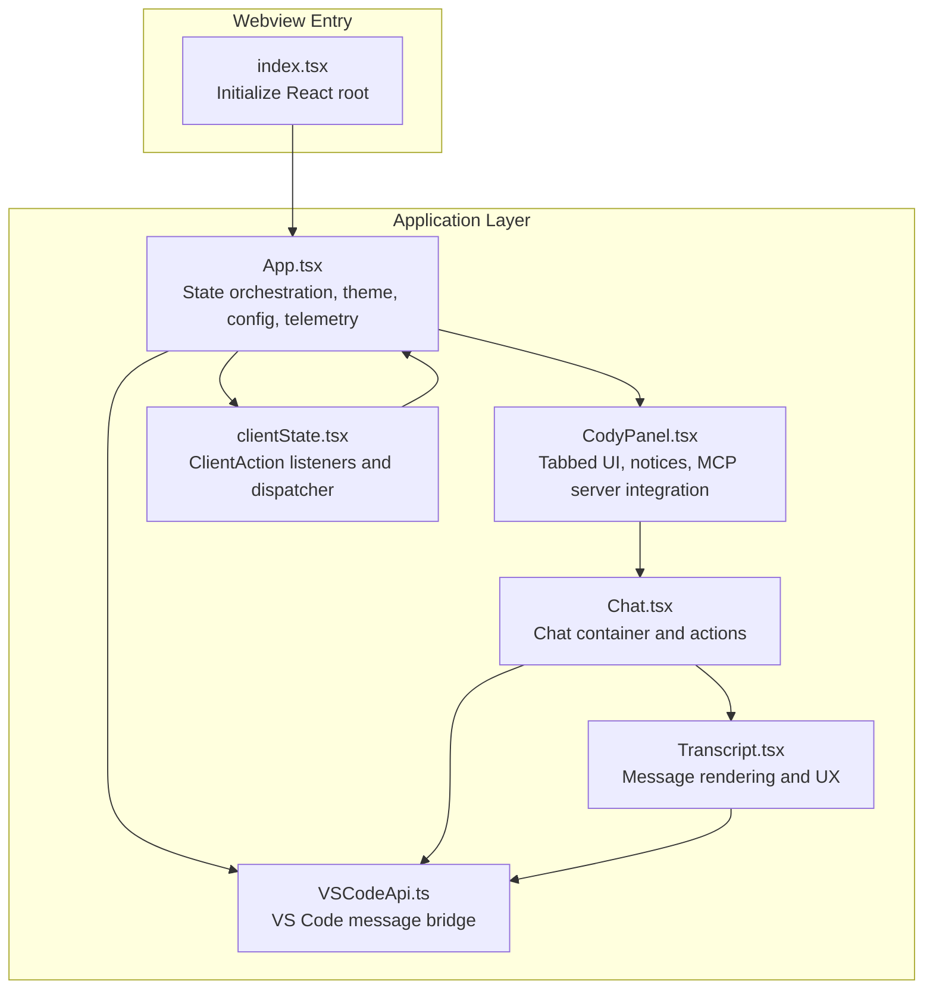
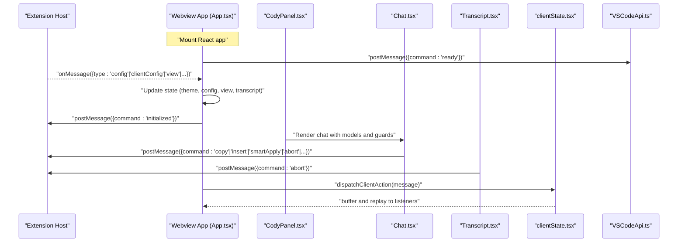
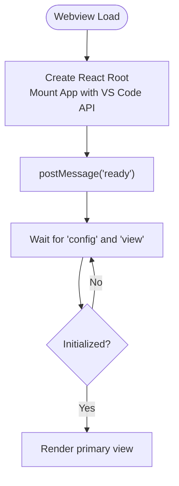
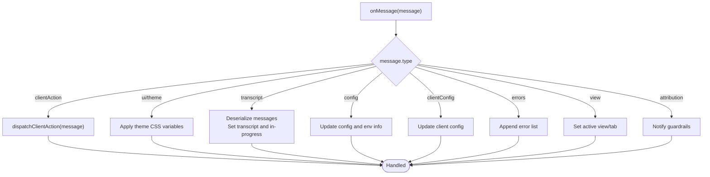
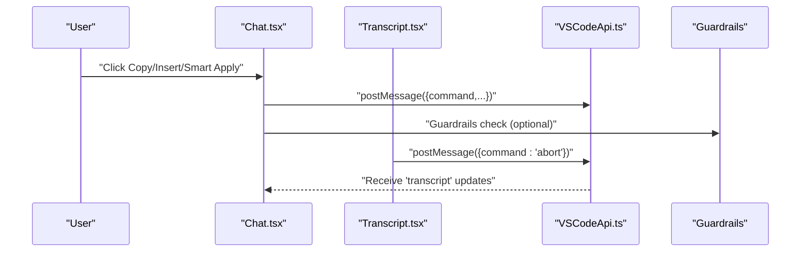
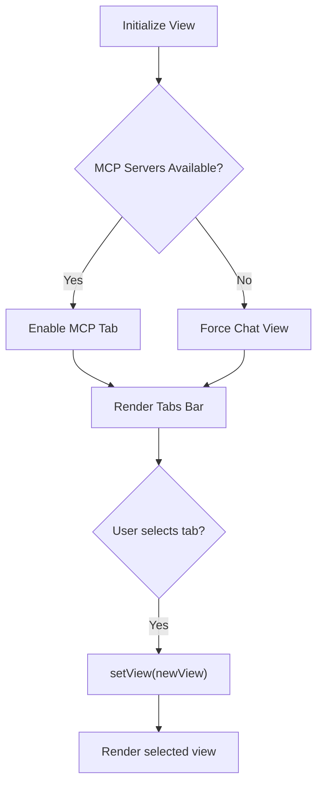
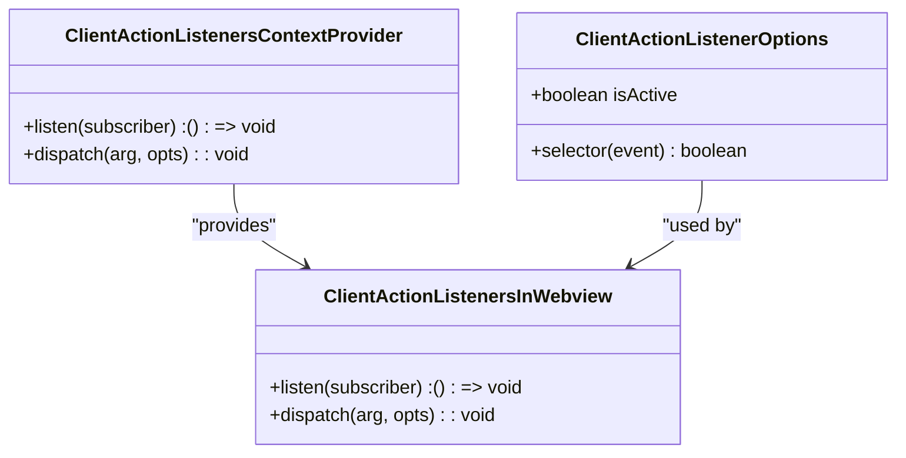
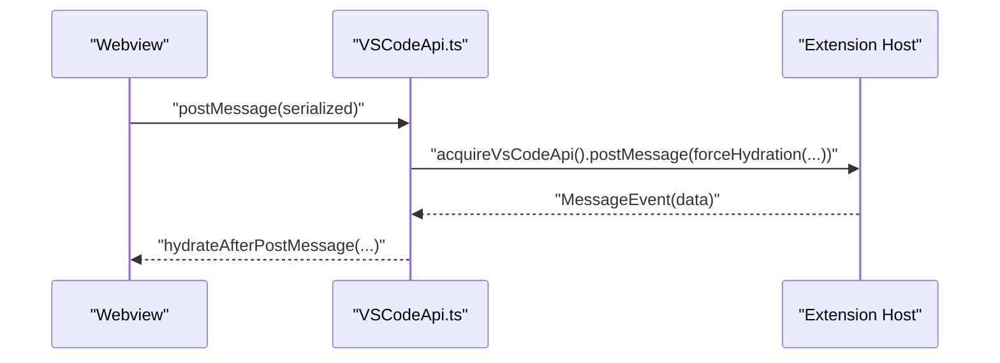
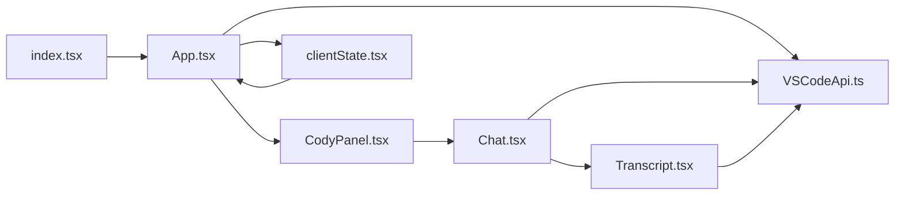

# Webview Integration

<cite>
**Referenced Files in This Document**
- [index.tsx](file://vscode/webviews/index.tsx)
- [App.tsx](file://vscode/webviews/App.tsx)
- [Chat.tsx](file://vscode/webviews/Chat.tsx)
- [CodyPanel.tsx](file://vscode/webviews/CodyPanel.tsx)
- [Transcript.tsx](file://vscode/webviews/chat/Transcript.tsx)
- [clientState.tsx](file://vscode/webviews/client/clientState.tsx)
- [VSCodeApi.ts](file://vscode/webviews/utils/VSCodeApi.ts)
</cite>

## Table of Contents
1. [Introduction](#introduction)
2. [Project Structure](#project-structure)
3. [Core Components](#core-components)
4. [Architecture Overview](#architecture-overview)
5. [Detailed Component Analysis](#detailed-component-analysis)
6. [Dependency Analysis](#dependency-analysis)
7. [Performance Considerations](#performance-considerations)
8. [Security and Sandboxing](#security-and-sandboxing)
9. [Troubleshooting Guide](#troubleshooting-guide)
10. [Conclusion](#conclusion)
11. [Appendices](#appendices)

## Introduction
This document explains the webview integration architecture that connects React-based web components to the VS Code extension host and enables a full-featured chat experience. It covers the webview lifecycle, message passing protocols, state synchronization, chat interface implementation, tab management, client state handling, and communication patterns with the agent/runtime. It also documents configuration, security considerations, debugging aids, performance optimization techniques, and troubleshooting steps.

## Project Structure
The webview application is a React app bundled for VS Code. The entry point initializes the React root and wraps the application with a VS Code API bridge. The main application orchestrates views, configuration, telemetry, and client actions. The chat view renders a transcript and supports interactive actions such as inserting code, copying, and aborting generations. A dedicated client state module manages client-initiated actions broadcast to descendant components.

**Diagram sources**
- [index.tsx:11-17](file://vscode/webviews/index.tsx#L11-L17)
- [App.tsx:32-233](file://vscode/webviews/App.tsx#L32-L233)
- [CodyPanel.tsx:67-194](file://vscode/webviews/CodyPanel.tsx#L67-L194)
- [Chat.tsx:46-228](file://vscode/webviews/Chat.tsx#L46-L228)
- [Transcript.tsx:94-306](file://vscode/webviews/chat/Transcript.tsx#L94-L306)
- [clientState.tsx:36-97](file://vscode/webviews/client/clientState.tsx#L36-L97)
- [VSCodeApi.ts:23-40](file://vscode/webviews/utils/VSCodeApi.ts#L23-L40)

**Section sources**
- [index.tsx:1-18](file://vscode/webviews/index.tsx#L1-L18)
- [App.tsx:32-233](file://vscode/webviews/App.tsx#L32-L233)

## Core Components
- Webview entry and bootstrapping: Initializes the React root and mounts the application with a VS Code API wrapper.
- Application orchestration: Manages configuration, client configuration, view state, telemetry, and client actions. Responds to theme updates and synchronizes state via VS Code’s state APIs.
- Chat container: Exposes actions for copying, inserting, smart apply, and aborting. Handles keyboard shortcuts and focus management.
- Transcript renderer: Converts messages into interactions, manages scrolling, auto-scroll behavior, and rendering spans for performance telemetry.
- Client state listeners: Provides a context-based dispatcher and listener registry for client-initiated actions, including buffering and replay semantics.
- VS Code API bridge: Normalizes message serialization/deserialization and event handling for the webview.

**Section sources**
- [index.tsx:11-17](file://vscode/webviews/index.tsx#L11-L17)
- [App.tsx:67-141](file://vscode/webviews/App.tsx#L67-L141)
- [Chat.tsx:46-228](file://vscode/webviews/Chat.tsx#L46-L228)
- [Transcript.tsx:94-306](file://vscode/webviews/chat/Transcript.tsx#L94-L306)
- [clientState.tsx:36-134](file://vscode/webviews/client/clientState.tsx#L36-L134)
- [VSCodeApi.ts:23-40](file://vscode/webviews/utils/VSCodeApi.ts#L23-L40)

## Architecture Overview
The webview communicates with the extension host using a typed message protocol. The application listens for incoming messages to update configuration, theme, transcript, client actions, and errors. It sends outbound messages for user actions (auth, copy, insert, smart apply, abort, ready, initialized). The client state mechanism buffers and replays client actions to late-mounted components.

**Diagram sources**
- [App.tsx:67-141](file://vscode/webviews/App.tsx#L67-L141)
- [CodyPanel.tsx:117-131](file://vscode/webviews/CodyPanel.tsx#L117-L131)
- [Chat.tsx:73-155](file://vscode/webviews/Chat.tsx#L73-L155)
- [Transcript.tsx:491-495](file://vscode/webviews/chat/Transcript.tsx#L491-L495)
- [clientState.tsx:66-78](file://vscode/webviews/client/clientState.tsx#L66-L78)
- [VSCodeApi.ts:23-40](file://vscode/webviews/utils/VSCodeApi.ts#L23-L40)

## Detailed Component Analysis

### Webview Lifecycle and Initialization
- Entry point creates the React root and mounts the application with a VS Code API wrapper.
- The application signals readiness and initialization to the extension host.
- On first load, the application waits for configuration and view state before rendering the primary view.

**Diagram sources**
- [index.tsx:11-17](file://vscode/webviews/index.tsx#L11-L17)
- [App.tsx:138-148](file://vscode/webviews/App.tsx#L138-L148)

**Section sources**
- [index.tsx:11-17](file://vscode/webviews/index.tsx#L11-L17)
- [App.tsx:138-148](file://vscode/webviews/App.tsx#L138-L148)

### Message Passing Protocol
- Incoming messages:
  - ui/theme: Apply theme variables and IDE metadata.
  - transcript: Deserialize messages, handle in-progress message, update token usage, and persist chat ID via state.
  - config: Update configuration and environment info.
  - clientConfig: Update client-side configuration (e.g., feature flags).
  - clientAction: Dispatch to client action listeners.
  - errors: Append error messages.
  - view: Switch active tab.
  - attribution: Notify guardrails about attribution results.
- Outgoing messages:
  - ready, initialized: Lifecycle signals.
  - auth: Trigger authentication flow.
  - copy, insert, newFile, smartApply*, abort: User actions.
  - attribution-search: Request attribution for snippets.

**Diagram sources**
- [App.tsx:69-134](file://vscode/webviews/App.tsx#L69-L134)
- [clientState.tsx:66-78](file://vscode/webviews/client/clientState.tsx#L66-L78)

**Section sources**
- [App.tsx:69-134](file://vscode/webviews/App.tsx#L69-L134)
- [clientState.tsx:66-78](file://vscode/webviews/client/clientState.tsx#L66-L78)

### Chat Interface Implementation
- Chat component exposes actions for copying, inserting code, and smart apply with tracing context.
- Keyboard shortcuts support aborting in-progress messages and focus management.
- Transcript rendering converts messages into interactions, manages scrolling, and measures rendering performance.

**Diagram sources**
- [Chat.tsx:73-155](file://vscode/webviews/Chat.tsx#L73-L155)
- [Transcript.tsx:491-495](file://vscode/webviews/chat/Transcript.tsx#L491-L495)
- [VSCodeApi.ts:23-40](file://vscode/webviews/utils/VSCodeApi.ts#L23-L40)

**Section sources**
- [Chat.tsx:46-228](file://vscode/webviews/Chat.tsx#L46-L228)
- [Transcript.tsx:94-306](file://vscode/webviews/chat/Transcript.tsx#L94-L306)

### Tab Management System
- The panel provides a vertical tab bar with views for chat, history, and MCP servers.
- View transitions are handled by setting the active view and ensuring availability of dependent features (e.g., MCP servers).
- Error banners surface storage warnings and other transient issues.

**Diagram sources**
- [CodyPanel.tsx:107-111](file://vscode/webviews/CodyPanel.tsx#L107-L111)
- [CodyPanel.tsx:143-151](file://vscode/webviews/CodyPanel.tsx#L143-L151)
- [CodyPanel.tsx:160-189](file://vscode/webviews/CodyPanel.tsx#L160-L189)

**Section sources**
- [CodyPanel.tsx:67-194](file://vscode/webviews/CodyPanel.tsx#L67-L194)

### Client State Handling
- A context provider exposes a dispatcher and listener registry for client actions.
- Actions can be buffered until listeners attach, then replayed once to the first matching listener.
- Components can register selectors to filter relevant actions.

**Diagram sources**
- [clientState.tsx:36-97](file://vscode/webviews/client/clientState.tsx#L36-L97)
- [clientState.tsx:110-134](file://vscode/webviews/client/clientState.tsx#L110-L134)

**Section sources**
- [clientState.tsx:36-134](file://vscode/webviews/client/clientState.tsx#L36-L134)

### Communication Patterns with Agent/Runtime
- The webview uses the VS Code API wrapper to send and receive messages.
- The wrapper serializes outgoing messages and deserializes incoming ones, preserving URIs and other structured data.
- The extension API is exposed to components via a provider, enabling access to chat models, MCP settings, and client action broadcasts.

**Diagram sources**
- [VSCodeApi.ts:23-40](file://vscode/webviews/utils/VSCodeApi.ts#L23-L40)
- [App.tsx:138-141](file://vscode/webviews/App.tsx#L138-L141)

**Section sources**
- [VSCodeApi.ts:23-40](file://vscode/webviews/utils/VSCodeApi.ts#L23-L40)
- [App.tsx:138-141](file://vscode/webviews/App.tsx#L138-L141)

## Dependency Analysis
- The entry point depends on the application component and the VS Code API bridge.
- The application depends on the panel, chat, client state, and telemetry utilities.
- The chat component depends on the transcript renderer and the VS Code API bridge.
- The transcript renderer depends on the VS Code API bridge, client state listeners, and guardrails.

**Diagram sources**
- [index.tsx:11-17](file://vscode/webviews/index.tsx#L11-L17)
- [App.tsx:32-233](file://vscode/webviews/App.tsx#L32-L233)
- [CodyPanel.tsx:67-194](file://vscode/webviews/CodyPanel.tsx#L67-L194)
- [Chat.tsx:46-228](file://vscode/webviews/Chat.tsx#L46-L228)
- [Transcript.tsx:94-306](file://vscode/webviews/chat/Transcript.tsx#L94-L306)
- [clientState.tsx:36-97](file://vscode/webviews/client/clientState.tsx#L36-L97)
- [VSCodeApi.ts:23-40](file://vscode/webviews/utils/VSCodeApi.ts#L23-L40)

**Section sources**
- [index.tsx:11-17](file://vscode/webviews/index.tsx#L11-L17)
- [App.tsx:32-233](file://vscode/webviews/App.tsx#L32-L233)
- [CodyPanel.tsx:67-194](file://vscode/webviews/CodyPanel.tsx#L67-L194)
- [Chat.tsx:46-228](file://vscode/webviews/Chat.tsx#L46-L228)
- [Transcript.tsx:94-306](file://vscode/webviews/chat/Transcript.tsx#L94-L306)
- [clientState.tsx:36-97](file://vscode/webviews/client/clientState.tsx#L36-L97)
- [VSCodeApi.ts:23-40](file://vscode/webviews/utils/VSCodeApi.ts#L23-L40)

## Performance Considerations
- Auto-scroll management: The transcript tracks user scroll state to avoid overriding manual scrolls and smooth-scrolls to the bottom when appropriate.
- Rendering spans: Assistant message rendering is instrumented with spans and performance marks to measure render durations and time-to-first-token.
- Debouncing: The “at bottom” state is debounced to prevent flickering when UI elements cause micro-scrolls.
- Guardrails memoization: Human message info is memoized to reduce guardrails server requests.

Recommendations:
- Keep message lists optimized; avoid unnecessary re-renders by using memoization and stable references.
- Use selective updates for token usage and model lists.
- Minimize heavy DOM operations during scroll handling.

**Section sources**
- [Transcript.tsx:144-191](file://vscode/webviews/chat/Transcript.tsx#L144-L191)
- [Transcript.tsx:533-628](file://vscode/webviews/chat/Transcript.tsx#L533-L628)
- [Transcript.tsx:79-92](file://vscode/webviews/chat/Transcript.tsx#L79-L92)
- [Transcript.tsx:630-637](file://vscode/webviews/chat/Transcript.tsx#L630-L637)

## Security and Sandboxing
- Message serialization/deserialization: The VS Code API wrapper enforces hydration of messages, including URI reconstruction, to ensure safe cross-context data exchange.
- Event listeners: Listeners are attached to the window message channel and removed on cleanup to prevent leaks.
- Client action buffering: Client actions are buffered and replayed only to matching listeners, reducing risk of accidental cross-component exposure.

Best practices:
- Always use the provided VS Code API wrapper for messaging.
- Avoid attaching global listeners outside the wrapper lifecycle.
- Sanitize and validate incoming messages before use.

**Section sources**
- [VSCodeApi.ts:23-40](file://vscode/webviews/utils/VSCodeApi.ts#L23-L40)
- [clientState.tsx:66-78](file://vscode/webviews/client/clientState.tsx#L66-L78)

## Troubleshooting Guide
Common issues and resolutions:
- Webview not initializing:
  - Ensure the application posts the ready signal and waits for view/config before rendering.
  - Verify that the extension host is sending the initial config and view messages.
- Chat actions not working:
  - Confirm that the chat component is receiving transcript updates and that the VS Code API wrapper is functional.
  - Check that keyboard shortcuts are not intercepted by other components.
- Client actions not received:
  - Ensure listeners are registered with the correct selector and that the action is dispatched with the proper type.
  - Verify that actions are not buffered indefinitely if no listeners are present.
- Theme not applied:
  - Confirm that ui/theme messages are received and that CSS variables are set on the document element.

Debugging tips:
- Use the state debug overlay to inspect internal state.
- Enable verbose telemetry to capture spans and traces.
- Inspect the message flow using the VS Code API wrapper logs.

**Section sources**
- [App.tsx:138-148](file://vscode/webviews/App.tsx#L138-L148)
- [Chat.tsx:159-178](file://vscode/webviews/Chat.tsx#L159-L178)
- [clientState.tsx:66-78](file://vscode/webviews/client/clientState.tsx#L66-L78)
- [CodyPanel.tsx:190](file://vscode/webviews/CodyPanel.tsx#L190)

## Conclusion
The webview integration leverages a clean separation of concerns: a robust message bridge, a declarative React application, and a client action system that ensures reliable delivery of runtime-driven actions. The chat interface is highly interactive, performance-aware, and integrates tightly with VS Code’s theme and configuration systems. By following the documented patterns and best practices, developers can extend the webview while maintaining reliability, security, and responsiveness.

## Appendices

### Example: Webview Initialization
- Entry point mounts the application with the VS Code API wrapper.
- The application signals readiness and initialization to the extension host.

**Section sources**
- [index.tsx:11-17](file://vscode/webviews/index.tsx#L11-L17)
- [App.tsx:138-148](file://vscode/webviews/App.tsx#L138-L148)

### Example: Event Handling and Data Binding
- The application binds incoming messages to state updates and forwards user actions to the extension host.
- The chat component binds actions to message posting and keyboard handlers.

**Section sources**
- [App.tsx:69-134](file://vscode/webviews/App.tsx#L69-L134)
- [Chat.tsx:73-155](file://vscode/webviews/Chat.tsx#L73-L155)

### Example: Client State Handling
- Register a listener with a selector to receive only relevant client actions.
- Dispatch actions with optional buffering for late-mounted components.

**Section sources**
- [clientState.tsx:110-134](file://vscode/webviews/client/clientState.tsx#L110-L134)
- [clientState.tsx:66-78](file://vscode/webviews/client/clientState.tsx#L66-L78)