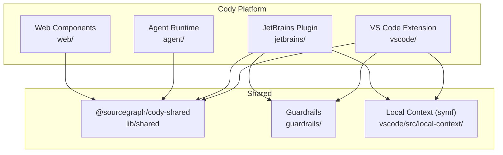
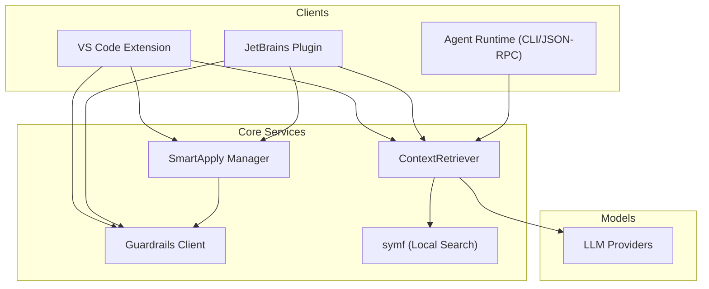
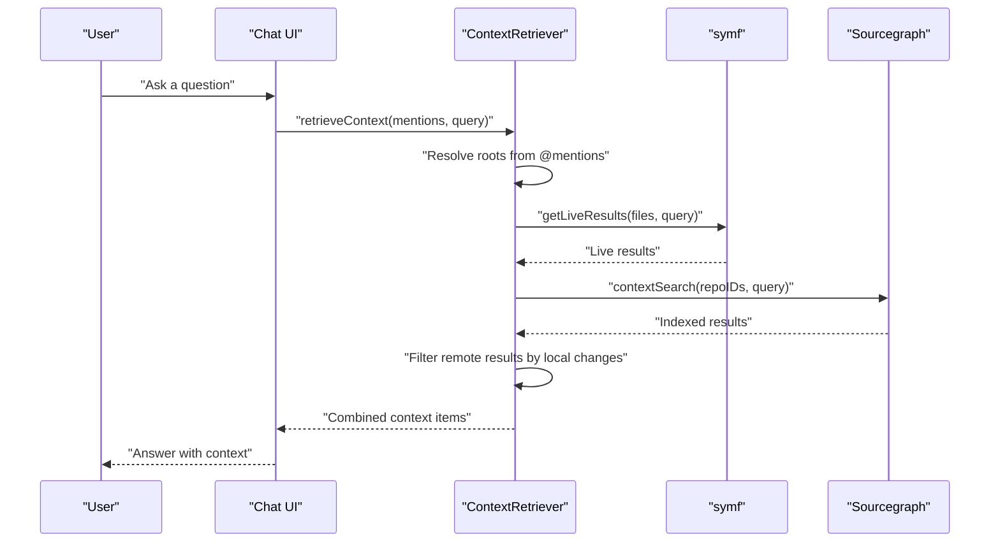
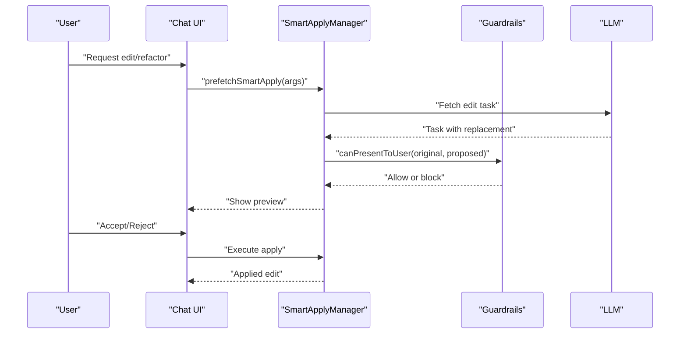
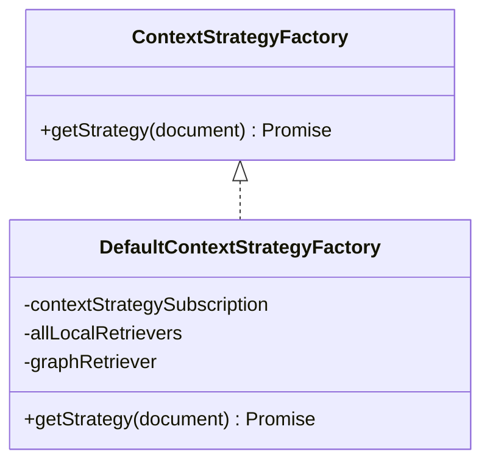
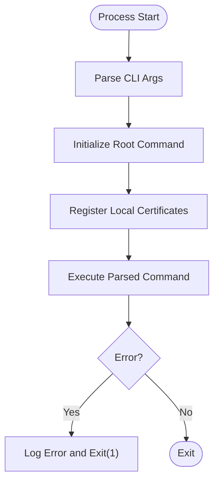
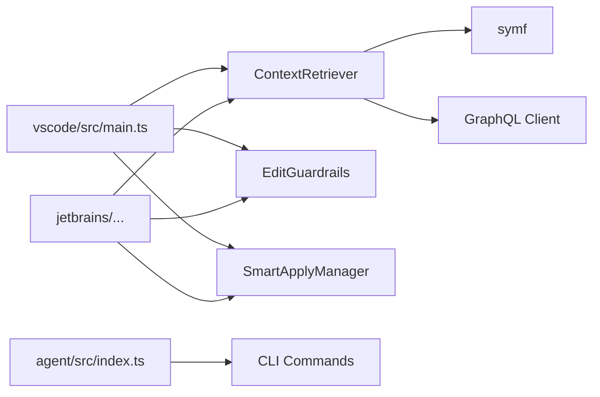

# Project Overview

<cite>
**Referenced Files in This Document**
- [README.md](file://README.md)
- [ARCHITECTURE.md](file://ARCHITECTURE.md)
- [AGENT.md](file://AGENT.md)
- [vscode/README.md](file://vscode/README.md)
- [jetbrains/README.md](file://jetbrains/README.md)
- [agent/src/index.ts](file://agent/src/index.ts)
- [vscode/src/main.ts](file://vscode/src/main.ts)
- [vscode/src/chat/chat-view/ContextRetriever.ts](file://vscode/src/chat/chat-view/ContextRetriever.ts)
- [vscode/src/local-context/symf.ts](file://vscode/src/local-context/symf.ts)
- [vscode/src/local-context/download-symf.ts](file://vscode/src/local-context/download-symf.ts)
- [vscode/src/edit/smart-apply.ts](file://vscode/src/edit/smart-apply.ts)
- [vscode/src/edit/smart-apply-manager.ts](file://vscode/src/edit/smart-apply-manager.ts)
- [vscode/src/edit/edit-guardrails.ts](file://vscode/src/edit/edit-guardrails.ts)
- [vscode/src/completions/context/context-strategy.ts](file://vscode/src/completions/context/context-strategy.ts)
- [vscode/src/chat/chat-view/context.ts](file://vscode/src/chat/chat-view/context.ts)
</cite>

## Table of Contents
1. [Introduction](#introduction)
2. [Project Structure](#project-structure)
3. [Core Components](#core-components)
4. [Architecture Overview](#architecture-overview)
5. [Detailed Component Analysis](#detailed-component-analysis)
6. [Dependency Analysis](#dependency-analysis)
7. [Performance Considerations](#performance-considerations)
8. [Troubleshooting Guide](#troubleshooting-guide)
9. [Conclusion](#conclusion)

## Introduction
Cody is an AI-powered coding agent designed to enhance developer productivity by intelligently understanding codebases and assisting with everyday tasks. It integrates across multiple platforms and environments to deliver:
- Intelligent autocomplete
- Chat-based coding assistance
- Automated code editing and refactoring
- Context-aware code understanding

Cody’s platform spans:
- VS Code extension
- JetBrains plugin
- Agent runtime (CLI and JSON-RPC)
- Web components

Its value propositions include:
- Semantic search across local and remote codebases
- Multi-modal AI interactions
- Swappable LLM support

Practical examples:
- Code completion while typing
- Chat assistance for understanding and modifying code
- Automated refactoring and fixes via Smart Apply

## Project Structure
The repository is organized as a monorepo with multiple packages:
- agent: Agent runtime and CLI
- vscode: VS Code extension
- jetbrains: JetBrains plugin
- web: Web components
- lib, guardrails, lints, patches: Shared libraries and utilities

**Diagram sources**
- [vscode/src/main.ts:122-357](file://vscode/src/main.ts#L122-L357)
- [agent/src/index.ts:14-34](file://agent/src/index.ts#L14-L34)

**Section sources**
- [README.md:35-51](file://README.md#L35-L51)
- [vscode/README.md:4-38](file://vscode/README.md#L4-L38)
- [jetbrains/README.md:8-51](file://jetbrains/README.md#L8-L51)

## Core Components
- Context Retrieval: Centralized mechanism to gather context from local and remote codebases, including live results from a local search engine and indexed results from Sourcegraph.
- Smart Apply: Automated editing workflow that proposes, validates, and applies code changes with guardrails.
- Guardrails: Attribution-based safety checks to ensure edits conform to organizational policies.
- Autocomplete: Inline completion provider integrated with context retrieval and model selection.
- Agent Runtime: CLI and JSON-RPC entrypoint for the agent, enabling cross-platform operation.

Key implementation references:
- Context retrieval pipeline and strategies
- Live and indexed context fetching
- Guardrails enforcement for edits
- Smart Apply orchestration and prefetching

**Section sources**
- [vscode/src/chat/chat-view/ContextRetriever.ts:171-415](file://vscode/src/chat/chat-view/ContextRetriever.ts#L171-L415)
- [vscode/src/local-context/symf.ts:136-346](file://vscode/src/local-context/symf.ts#L136-L346)
- [vscode/src/edit/edit-guardrails.ts:28-142](file://vscode/src/edit/edit-guardrails.ts#L28-L142)
- [vscode/src/edit/smart-apply.ts:6-34](file://vscode/src/edit/smart-apply.ts#L6-L34)
- [vscode/src/edit/smart-apply-manager.ts:117-189](file://vscode/src/edit/smart-apply-manager.ts#L117-L189)
- [vscode/src/completions/context/context-strategy.ts:36-46](file://vscode/src/completions/context/context-strategy.ts#L36-L46)
- [agent/src/index.ts:14-34](file://agent/src/index.ts#L14-L34)

## Architecture Overview
Cody’s architecture is modular and platform-agnostic. At a high level:
- The VS Code and JetBrains extensions initialize platform-specific contexts and register commands.
- The agent runtime provides a JSON-RPC entrypoint and CLI for cross-platform operation.
- Context retrieval aggregates live and indexed results, leveraging a local search engine and remote GraphQL queries.
- Smart Apply coordinates model inference, guardrails, and application of edits.
- Web components expose chat and related UIs.

**Diagram sources**
- [vscode/src/main.ts:254-280](file://vscode/src/main.ts#L254-L280)
- [vscode/src/chat/chat-view/ContextRetriever.ts:171-415](file://vscode/src/chat/chat-view/ContextRetriever.ts#L171-L415)
- [vscode/src/local-context/symf.ts:136-346](file://vscode/src/local-context/symf.ts#L136-L346)
- [vscode/src/edit/edit-guardrails.ts:28-142](file://vscode/src/edit/edit-guardrails.ts#L28-L142)
- [vscode/src/edit/smart-apply-manager.ts:117-189](file://vscode/src/edit/smart-apply-manager.ts#L117-L189)
- [agent/src/index.ts:14-34](file://agent/src/index.ts#L14-L34)

## Detailed Component Analysis

### Context Retrieval Pipeline
Context retrieval powers chat, autocomplete, and Smart Apply by combining:
- Live context from a local search engine
- Indexed context from remote repositories
- Filtering to avoid duplicating locally modified files when remote results overlap

**Diagram sources**
- [vscode/src/chat/chat-view/ContextRetriever.ts:182-254](file://vscode/src/chat/chat-view/ContextRetriever.ts#L182-L254)
- [vscode/src/chat/chat-view/ContextRetriever.ts:256-414](file://vscode/src/chat/chat-view/ContextRetriever.ts#L256-L414)
- [vscode/src/local-context/symf.ts:136-168](file://vscode/src/local-context/symf.ts#L136-L168)
- [vscode/src/chat/chat-view/context.ts:24-49](file://vscode/src/chat/chat-view/context.ts#L24-L49)

**Section sources**
- [vscode/src/chat/chat-view/ContextRetriever.ts:171-415](file://vscode/src/chat/chat-view/ContextRetriever.ts#L171-L415)
- [vscode/src/local-context/symf.ts:136-346](file://vscode/src/local-context/symf.ts#L136-L346)
- [vscode/src/local-context/download-symf.ts:28-60](file://vscode/src/local-context/download-symf.ts#L28-L60)

### Smart Apply Workflow
Smart Apply automates applying edits with guardrails:
- Prefetch and prepare tasks
- Validate against guardrails
- Stream and present results
- Accept or reject changes

**Diagram sources**
- [vscode/src/edit/smart-apply-manager.ts:117-189](file://vscode/src/edit/smart-apply-manager.ts#L117-L189)
- [vscode/src/edit/smart-apply.ts:22-34](file://vscode/src/edit/smart-apply.ts#L22-L34)
- [vscode/src/edit/edit-guardrails.ts:49-140](file://vscode/src/edit/edit-guardrails.ts#L49-L140)

**Section sources**
- [vscode/src/edit/smart-apply.ts:6-34](file://vscode/src/edit/smart-apply.ts#L6-L34)
- [vscode/src/edit/smart-apply-manager.ts:117-189](file://vscode/src/edit/smart-apply-manager.ts#L117-L189)
- [vscode/src/edit/edit-guardrails.ts:28-142](file://vscode/src/edit/edit-guardrails.ts#L28-L142)

### Autocomplete and Context Strategy
Autocomplete integrates with context retrieval and model selection. The context strategy factory selects appropriate retrievers based on configuration and environment.

**Diagram sources**
- [vscode/src/completions/context/context-strategy.ts:36-46](file://vscode/src/completions/context/context-strategy.ts#L36-L46)

**Section sources**
- [vscode/src/completions/context/context-strategy.ts:36-46](file://vscode/src/completions/context/context-strategy.ts#L36-L46)

### Agent Runtime Entrypoint
The agent runtime exposes a CLI and JSON-RPC interface, ensuring logging redirection and robust error handling.

**Diagram sources**
- [agent/src/index.ts:14-34](file://agent/src/index.ts#L14-L34)

**Section sources**
- [agent/src/index.ts:14-34](file://agent/src/index.ts#L14-L34)

## Dependency Analysis
- Clients depend on shared libraries for configuration, telemetry, and platform abstractions.
- Context retrieval depends on symf for live results and GraphQL for indexed results.
- Smart Apply depends on guardrails and model providers.
- Agent runtime depends on CLI commands and JSON-RPC infrastructure.

**Diagram sources**
- [vscode/src/main.ts:254-280](file://vscode/src/main.ts#L254-L280)
- [vscode/src/chat/chat-view/ContextRetriever.ts:171-415](file://vscode/src/chat/chat-view/ContextRetriever.ts#L171-L415)
- [agent/src/index.ts:14-34](file://agent/src/index.ts#L14-L34)

**Section sources**
- [vscode/src/main.ts:254-280](file://vscode/src/main.ts#L254-L280)
- [vscode/src/chat/chat-view/ContextRetriever.ts:171-415](file://vscode/src/chat/chat-view/ContextRetriever.ts#L171-L415)
- [agent/src/index.ts:14-34](file://agent/src/index.ts#L14-L34)

## Performance Considerations
- Token accounting: Accurate token counting depends on the specific model’s tokenizer; prefer counting after concatenation for precision.
- Symf indexing: Background reindexing and stale index triggers improve responsiveness; ensure proper index readiness before heavy queries.
- Parallelization: Live and indexed context retrieval are executed concurrently to reduce latency.
- Guardrails: In enforced mode, synchronous attribution checks can block; in permissive mode, checks are asynchronous to minimize latency.

**Section sources**
- [ARCHITECTURE.md:123-165](file://ARCHITECTURE.md#L123-L165)
- [vscode/src/local-context/symf.ts:309-336](file://vscode/src/local-context/symf.ts#L309-L336)
- [vscode/src/chat/chat-view/ContextRetriever.ts:242-245](file://vscode/src/chat/chat-view/ContextRetriever.ts#L242-L245)
- [vscode/src/edit/edit-guardrails.ts:98-123](file://vscode/src/edit/edit-guardrails.ts#L98-L123)

## Troubleshooting Guide
Common issues and remedies:
- Authentication and endpoints: Use the authentication commands to sign in/out and manage endpoints; ensure correct server URLs and tokens.
- Rate limits: The extension surfaces rate limit modals with guidance to learn more.
- Logs and diagnostics: Export logs, enable verbose debug mode, and use heap snapshots for diagnostics.
- Symf availability: If symf is disabled via feature flag or unavailable, local live context will be skipped; verify platform binaries and permissions.

Operational commands and handlers:
- Authentication commands
- Rate limit modal
- Debug logging and export
- Symf download and path configuration

**Section sources**
- [vscode/src/main.ts:592-602](file://vscode/src/main.ts#L592-L602)
- [vscode/src/main.ts:380-403](file://vscode/src/main.ts#L380-L403)
- [vscode/src/main.ts:641-652](file://vscode/src/main.ts#L641-L652)
- [vscode/src/local-context/download-symf.ts:28-60](file://vscode/src/local-context/download-symf.ts#L28-L60)

## Conclusion
Cody delivers a cohesive, multi-platform AI coding assistant with strong emphasis on context-awareness, automated editing, and safety. Its architecture cleanly separates concerns across clients, runtime, and shared services, enabling swappable LLMs and extensible integrations. Developers can leverage intelligent autocomplete, chat-assisted problem solving, and Smart Apply to accelerate workflows while maintaining policy-aligned changes through guardrails.