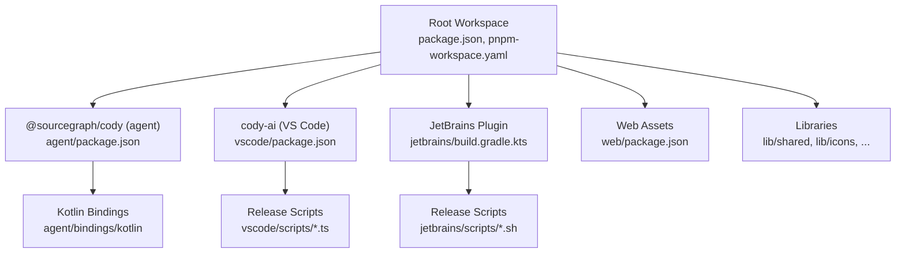
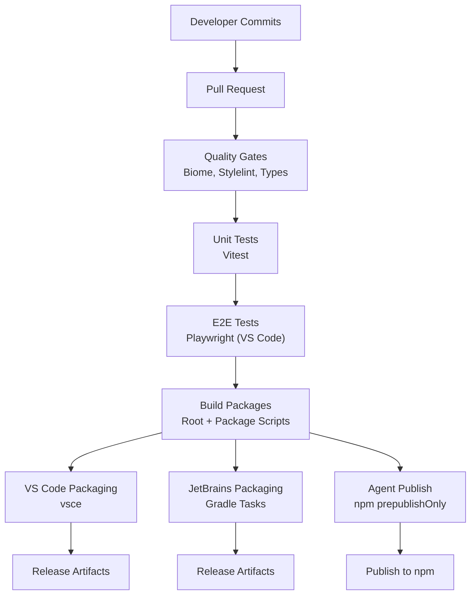
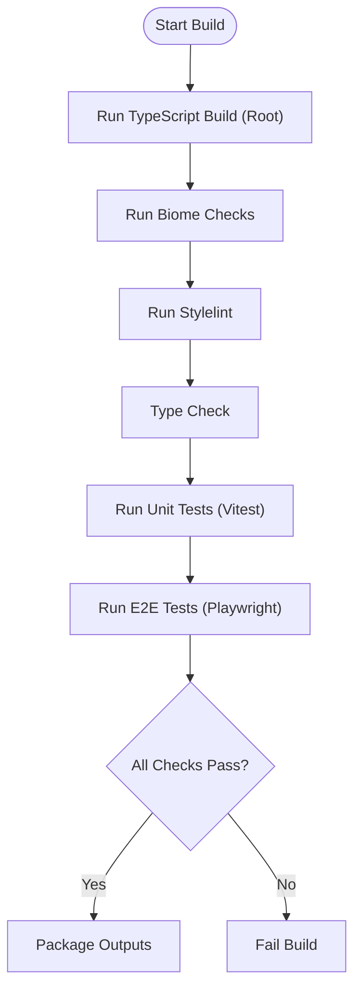
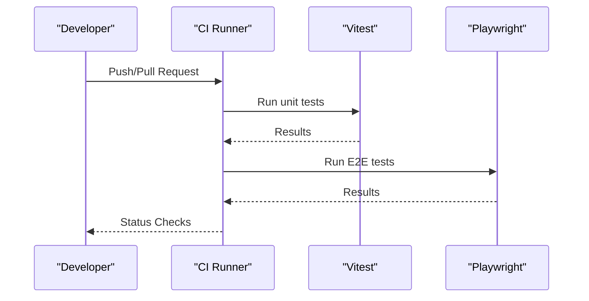
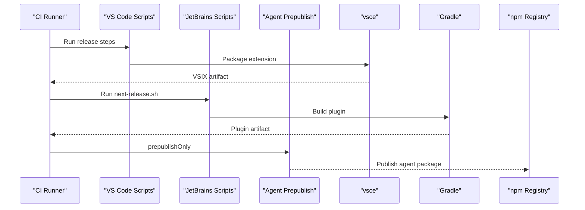
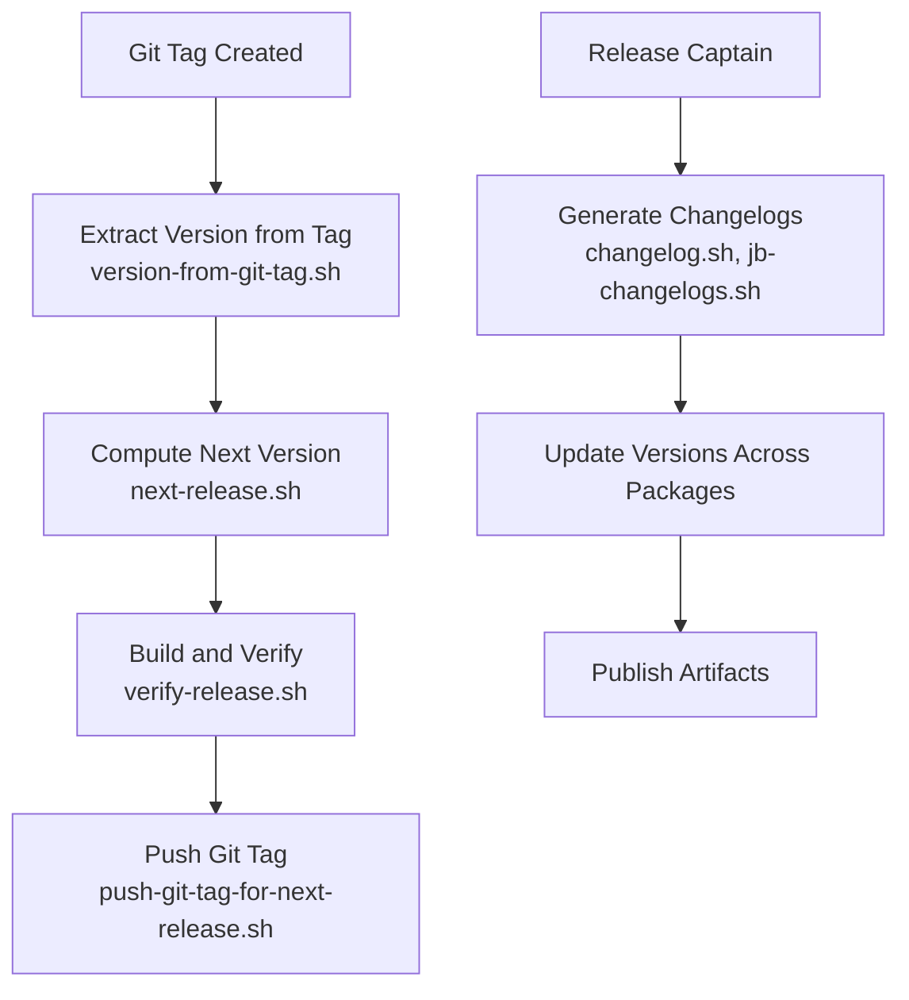
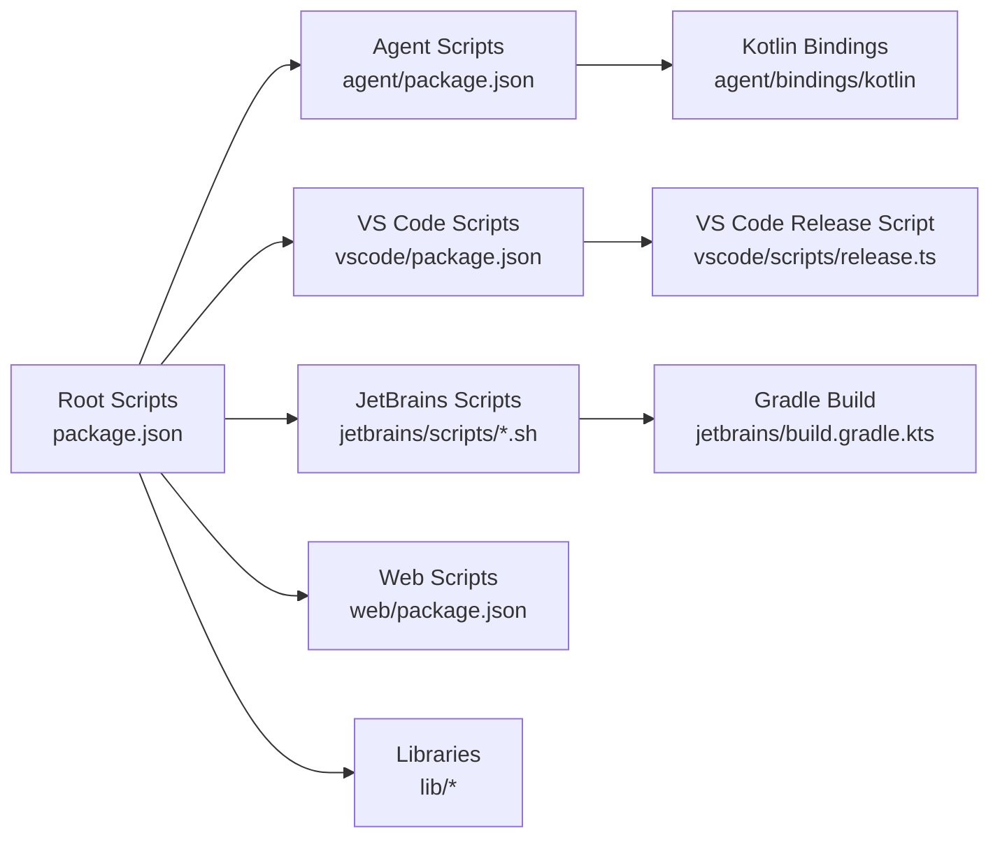

# CI/CD Pipeline

<cite>
**Referenced Files in This Document**
- [package.json](file://package.json)
- [pnpm-workspace.yaml](file://pnpm-workspace.yaml)
- [agent/package.json](file://agent/package.json)
- [vscode/package.json](file://vscode/package.json)
- [jetbrains/scripts/next-release.sh](file://jetbrains/scripts/next-release.sh)
- [jetbrains/scripts/push-git-tag-for-next-release.sh](file://jetbrains/scripts/push-git-tag-for-next-release.sh)
- [jetbrains/scripts/version-from-git-tag.sh](file://jetbrains/scripts/version-from-git-tag.sh)
- [jetbrains/scripts/verify-release.sh](file://jetbrains/scripts/verify-release.sh)
- [release/release-captain.sh](file://release/release-captain.sh)
- [vscode/scripts/changelog.sh](file://vscode/scripts/changelog.sh)
- [vscode/scripts/jb-changelogs.sh](file://vscode/scripts/jb-changelogs.sh)
- [agent/scripts/generate-agent-kotlin-bindings.sh](file://agent/scripts/generate-agent-kotlin-bindings.sh)
- [agent/scripts/update-agent-recordings.sh](file://agent/scripts/update-agent-recordings.sh)
- [agent/scripts/reset-recordings-to-main.sh](file://agent/scripts/reset-recordings-to-main.sh)
- [agent/scripts/resolve-recordings-git-conflict.sh](file://agent/scripts/resolve-recordings-git-conflict.sh)
- [agent/scripts/compile-bindings-if-diff.sh](file://agent/scripts/compile-bindings-if-diff.sh)
- [agent/scripts/error-if-diff.sh](file://agent/scripts/error-if-diff.sh)
- [agent/scripts/minor-release.sh](file://agent/scripts/minor-release.sh)
- [vscode/scripts/release.ts](file://vscode/scripts/release.ts)
- [jetbrains/build.gradle.kts](file://jetbrains/build.gradle.kts)
- [jetbrains/settings.gradle.kts](file://jetbrains/settings.gradle.kts)
- [jetbrains/gradle.properties](file://jetbrains/gradle.properties)
- [jetbrains/gradlew.bat](file://jetbrains/gradlew.bat)
- [agent/bindings/kotlin/settings.gradle.kts](file://agent/bindings/kotlin/settings.gradle.kts)
- [agent/bindings/kotlin/gradlew.bat](file://agent/bindings/kotlin/gradlew.bat)
- [Cargo.toml](file://Cargo.toml)
- [Dockerfile](file://Dockerfile)
- [.dockerignore](file://.dockerignore)
- [biome.jsonc](file://biome.jsonc)
- [renovate.json](file://renovate.json)
- [knip.jsonc](file://knip.jsonc)
</cite>

## Table of Contents
1. [Introduction](#introduction)
2. [Project Structure](#project-structure)
3. [Core Components](#core-components)
4. [Architecture Overview](#architecture-overview)
5. [Detailed Component Analysis](#detailed-component-analysis)
6. [Dependency Analysis](#dependency-analysis)
7. [Performance Considerations](#performance-considerations)
8. [Troubleshooting Guide](#troubleshooting-guide)
9. [Conclusion](#conclusion)
10. [Appendices](#appendices)

## Introduction
This document describes the continuous integration and deployment pipeline for the Cody platform. It explains how builds are orchestrated across multiple packages, how automated testing is integrated, and how quality gates are enforced. It also documents build automation, packaging, and release management for the VS Code extension, JetBrains plugin, and agent packages. Finally, it outlines release coordination, version management, backward compatibility considerations, monitoring and alerting, rollback procedures, incident response, and security scanning and compliance practices.

## Project Structure
The repository is a monorepo managed with pnpm workspaces. The primary packages are:
- Root workspace orchestrates shared tooling and scripts.
- agent: CLI and agent runtime packaged as an npm module.
- vscode: VS Code extension package.
- jetbrains: JetBrains plugin built via Gradle.
- web: Web assets and library consumed by the VS Code extension.
- lib: Shared libraries used across packages.

**Diagram sources**
- [package.json:18-38](file://package.json#L18-L38)
- [pnpm-workspace.yaml:1-8](file://pnpm-workspace.yaml#L1-L8)
- [agent/package.json:1-36](file://agent/package.json#L1-L36)
- [vscode/package.json:1-56](file://vscode/package.json#L1-L56)
- [jetbrains/build.gradle.kts](file://jetbrains/build.gradle.kts)
- [jetbrains/scripts/next-release.sh](file://jetbrains/scripts/next-release.sh)
- [vscode/scripts/release.ts](file://vscode/scripts/release.ts)

**Section sources**
- [package.json:18-38](file://package.json#L18-L38)
- [pnpm-workspace.yaml:1-8](file://pnpm-workspace.yaml#L1-L8)

## Core Components
- Build orchestration: Root scripts coordinate TypeScript compilation and package builds across workspaces.
- Testing: Vitest runs unit tests; Playwright runs E2E tests for the VS Code extension; agent-specific tests are executed via Vitest.
- Packaging: VS Code packaging uses vsce; JetBrains packaging uses Gradle tasks; agent publishes via npm prepublishOnly.
- Release management: Dedicated scripts manage version bumps, tagging, changelogs, and verification for JetBrains; VS Code release script coordinates packaging and metadata.
- Quality gates: Formatting and linting via Biome; CSS linting; type checks; and pre-publish validation.

**Section sources**
- [package.json:18-38](file://package.json#L18-L38)
- [agent/package.json:13-25](file://agent/package.json#L13-L25)
- [vscode/package.json:11-56](file://vscode/package.json#L11-L56)
- [jetbrains/scripts/next-release.sh](file://jetbrains/scripts/next-release.sh)
- [jetbrains/scripts/verify-release.sh](file://jetbrains/scripts/verify-release.sh)
- [vscode/scripts/release.ts](file://vscode/scripts/release.ts)

## Architecture Overview
The CI/CD pipeline is composed of:
- Build jobs that compile TypeScript and bundle assets for each package.
- Test jobs that run unit and E2E suites.
- Quality gates enforcing formatting, linting, and type checks.
- Packaging and publishing jobs for VS Code, JetBrains, and agent packages.
- Release orchestration scripts coordinating versioning and tagging.

**Diagram sources**
- [package.json:18-38](file://package.json#L18-L38)
- [agent/package.json:13-25](file://agent/package.json#L13-L25)
- [vscode/package.json:11-56](file://vscode/package.json#L11-L56)
- [jetbrains/build.gradle.kts](file://jetbrains/build.gradle.kts)

## Detailed Component Analysis

### Build Automation and Quality Gates
- Root build: Orchestrated via TypeScript project references and watch mode for incremental builds.
- Formatting and linting: Biome enforces code quality and applies fixes; Stylelint validates CSS.
- Type checking: TypeScript build is invoked from root and per-package scripts.
- Pre-publish validation: Agent package defines a prepublishOnly hook to ensure builds are fresh.

**Diagram sources**
- [package.json:18-38](file://package.json#L18-L38)
- [agent/package.json:13-25](file://agent/package.json#L13-L25)
- [vscode/package.json:11-56](file://vscode/package.json#L11-L56)

**Section sources**
- [package.json:18-38](file://package.json#L18-L38)
- [biome.jsonc](file://biome.jsonc)
- [knip.jsonc](file://knip.jsonc)

### Automated Testing Processes
- Unit tests: Vitest configured globally and per package; agent-specific tests under agent/src.
- E2E tests: Playwright configured for VS Code extension testing; includes dedicated V2 config.
- Local E2E: Scripted runner for targeted local testing scenarios.
- Recording-based tests: Agent and JetBrains integration tests rely on recorded HTTP sessions; scripts update and reset recordings.

**Diagram sources**
- [package.json:27-31](file://package.json#L27-L31)
- [vscode/package.json:45-49](file://vscode/package.json#L45-L49)

**Section sources**
- [package.json:27-31](file://package.json#L27-L31)
- [vscode/package.json:45-51](file://vscode/package.json#L45-L51)

### Package Publishing and Release Management
- VS Code extension:
  - Packaging uses vsce; scripts coordinate downloading WASM fonts and Windows CA roots prior to packaging.
  - Release script manages versioning and packaging steps.
- JetBrains plugin:
  - Gradle build produces plugin artifacts; scripts handle next release, version extraction from Git tags, verification, and tag pushing.
- Agent package:
  - PrepublishOnly hook ensures a clean build before publishing to npm.

**Diagram sources**
- [vscode/package.json:39-53](file://vscode/package.json#L39-L53)
- [jetbrains/scripts/next-release.sh](file://jetbrains/scripts/next-release.sh)
- [jetbrains/scripts/push-git-tag-for-next-release.sh](file://jetbrains/scripts/push-git-tag-for-next-release.sh)
- [agent/package.json](file://agent/package.json#L25)

**Section sources**
- [vscode/package.json:39-53](file://vscode/package.json#L39-L53)
- [jetbrains/scripts/next-release.sh](file://jetbrains/scripts/next-release.sh)
- [jetbrains/scripts/push-git-tag-for-next-release.sh](file://jetbrains/scripts/push-git-tag-for-next-release.sh)
- [agent/package.json](file://agent/package.json#L25)

### Release Coordination and Version Management
- Version extraction from Git tags for JetBrains releases.
- Next release script and tag push for coordinated releases.
- Release captain script coordinates release activities across packages.
- Changelog generation scripts for VS Code and JetBrains.

**Diagram sources**
- [jetbrains/scripts/version-from-git-tag.sh](file://jetbrains/scripts/version-from-git-tag.sh)
- [jetbrains/scripts/next-release.sh](file://jetbrains/scripts/next-release.sh)
- [jetbrains/scripts/verify-release.sh](file://jetbrains/scripts/verify-release.sh)
- [jetbrains/scripts/push-git-tag-for-next-release.sh](file://jetbrains/scripts/push-git-tag-for-next-release.sh)
- [release/release-captain.sh](file://release/release-captain.sh)
- [vscode/scripts/changelog.sh](file://vscode/scripts/changelog.sh)
- [vscode/scripts/jb-changelogs.sh](file://vscode/scripts/jb-changelogs.sh)

**Section sources**
- [jetbrains/scripts/version-from-git-tag.sh](file://jetbrains/scripts/version-from-git-tag.sh)
- [jetbrains/scripts/next-release.sh](file://jetbrains/scripts/next-release.sh)
- [jetbrains/scripts/verify-release.sh](file://jetbrains/scripts/verify-release.sh)
- [jetbrains/scripts/push-git-tag-for-next-release.sh](file://jetbrains/scripts/push-git-tag-for-next-release.sh)
- [release/release-captain.sh](file://release/release-captain.sh)
- [vscode/scripts/changelog.sh](file://vscode/scripts/changelog.sh)
- [vscode/scripts/jb-changelogs.sh](file://vscode/scripts/jb-changelogs.sh)

### Backward Compatibility Considerations
- Version management is explicit in VS Code and JetBrains packages; agent version is maintained independently.
- Release scripts enforce verification and tagging discipline to avoid breaking changes.
- Changelog generation supports communicating changes to consumers.

**Section sources**
- [vscode/package.json](file://vscode/package.json#L6)
- [jetbrains/scripts/verify-release.sh](file://jetbrains/scripts/verify-release.sh)
- [vscode/scripts/changelog.sh](file://vscode/scripts/changelog.sh)

### Deployment Strategies
- VS Code extension marketplace:
  - Packaging via vsce; artifacts produced for distribution.
- JetBrains plugin repository:
  - Gradle build and plugin publication workflow.
- npm packages:
  - Agent published via npm prepublishOnly; other packages are packaged but not automatically published to npm.

**Section sources**
- [vscode/package.json:39-53](file://vscode/package.json#L39-L53)
- [jetbrains/build.gradle.kts](file://jetbrains/build.gradle.kts)
- [agent/package.json](file://agent/package.json#L25)

### Monitoring and Alerting Systems
- Telemetry and Sentry integrations are present in the VS Code extension services, enabling observability and error reporting.
- No explicit CI/CD monitoring/alerting configuration was identified in the repository.

**Section sources**
- [vscode/package.json:1-56](file://vscode/package.json#L1-L56)

### Rollback Procedures and Incident Response
- Tag-based releases and changelog generation support rollback decisions.
- No explicit rollback scripts were identified; however, tagging and version extraction facilitate manual rollbacks.

**Section sources**
- [jetbrains/scripts/push-git-tag-for-next-release.sh](file://jetbrains/scripts/push-git-tag-for-next-release.sh)
- [jetbrains/scripts/version-from-git-tag.sh](file://jetbrains/scripts/version-from-git-tag.sh)

### Security Scanning and Compliance
- No explicit security scanning or compliance enforcement scripts were identified in the repository.
- Dependency updates are managed via Renovate configuration.

**Section sources**
- [renovate.json](file://renovate.json)

## Dependency Analysis
The monorepo uses pnpm workspaces to manage inter-package dependencies. The root package orchestrates scripts and tooling, while each package defines its own build, test, and release scripts.

**Diagram sources**
- [package.json:18-38](file://package.json#L18-L38)
- [pnpm-workspace.yaml:1-8](file://pnpm-workspace.yaml#L1-L8)
- [agent/package.json:13-25](file://agent/package.json#L13-L25)
- [vscode/package.json:11-56](file://vscode/package.json#L11-L56)
- [jetbrains/scripts/next-release.sh](file://jetbrains/scripts/next-release.sh)
- [jetbrains/build.gradle.kts](file://jetbrains/build.gradle.kts)

**Section sources**
- [pnpm-workspace.yaml:1-8](file://pnpm-workspace.yaml#L1-L8)
- [package.json:18-38](file://package.json#L18-L38)

## Performance Considerations
- Incremental builds: Watch mode and TypeScript project references reduce rebuild times during development.
- Parallelized tasks: Root scripts and package scripts can be parallelized where dependencies allow.
- Asset bundling: Vite and esbuild optimize webview and extension bundles.

**Section sources**
- [package.json:18-22](file://package.json#L18-L22)
- [vscode/package.json:22-37](file://vscode/package.json#L22-L37)

## Troubleshooting Guide
- Recording-based tests failing:
  - Reset recordings to main branch and re-record as needed.
  - Resolve merge conflicts in recordings using provided scripts.
- Kotlin bindings generation:
  - Use the binding generation script and ensure diffs are compiled.
- Minor release automation:
  - Use the minor release script to bump versions consistently.

**Section sources**
- [agent/scripts/reset-recordings-to-main.sh](file://agent/scripts/reset-recordings-to-main.sh)
- [agent/scripts/resolve-recordings-git-conflict.sh](file://agent/scripts/resolve-recordings-git-conflict.sh)
- [agent/scripts/generate-agent-kotlin-bindings.sh](file://agent/scripts/generate-agent-kotlin-bindings.sh)
- [agent/scripts/compile-bindings-if-diff.sh](file://agent/scripts/compile-bindings-if-diff.sh)
- [agent/scripts/minor-release.sh](file://agent/scripts/minor-release.sh)

## Conclusion
The Cody CI/CD pipeline is centered on a pnpm-managed monorepo with robust build, test, and release tooling. Quality gates ensure consistent code standards, while dedicated scripts coordinate VS Code, JetBrains, and agent packaging and publishing. Versioning and tagging are explicit, enabling reliable releases and potential rollbacks. Observability is present through telemetry and Sentry integrations. Security and compliance are not explicitly configured in the repository; teams should integrate appropriate scanning and governance tools as part of their CI/CD practices.

## Appendices

### Appendix A: Key Scripts and Commands
- Root build and watch: [package.json:18-22](file://package.json#L18-L22)
- Unit and E2E tests: [package.json:27-31](file://package.json#L27-L31), [vscode/package.json:45-51](file://vscode/package.json#L45-L51)
- VS Code release: [vscode/package.json:39-53](file://vscode/package.json#L39-L53), [vscode/scripts/release.ts](file://vscode/scripts/release.ts)
- JetBrains release: [jetbrains/scripts/next-release.sh](file://jetbrains/scripts/next-release.sh), [jetbrains/scripts/push-git-tag-for-next-release.sh](file://jetbrains/scripts/push-git-tag-for-next-release.sh), [jetbrains/scripts/version-from-git-tag.sh](file://jetbrains/scripts/version-from-git-tag.sh), [jetbrains/scripts/verify-release.sh](file://jetbrains/scripts/verify-release.sh)
- Agent prepublish: [agent/package.json](file://agent/package.json#L25)
- Recording management: [agent/scripts/update-agent-recordings.sh](file://agent/scripts/update-agent-recordings.sh), [agent/scripts/reset-recordings-to-main.sh](file://agent/scripts/reset-recordings-to-main.sh), [agent/scripts/resolve-recordings-git-conflict.sh](file://agent/scripts/resolve-recordings-git-conflict.sh)
- Kotlin bindings: [agent/scripts/generate-agent-kotlin-bindings.sh](file://agent/scripts/generate-agent-kotlin-bindings.sh), [agent/scripts/compile-bindings-if-diff.sh](file://agent/scripts/compile-bindings-if-diff.sh), [agent/scripts/error-if-diff.sh](file://agent/scripts/error-if-diff.sh)
- Changelog generation: [vscode/scripts/changelog.sh](file://vscode/scripts/changelog.sh), [vscode/scripts/jb-changelogs.sh](file://vscode/scripts/jb-changelogs.sh)
- Minor release: [agent/scripts/minor-release.sh](file://agent/scripts/minor-release.sh)

### Appendix B: Build and Packaging Artifacts
- VS Code: Extension packaged via vsce; assets include WASM and fonts downloaded by scripts.
- JetBrains: Gradle build produces plugin artifacts; versioning derived from Git tags.
- Agent: Published to npm via prepublishOnly hook.

**Section sources**
- [vscode/package.json:39-53](file://vscode/package.json#L39-L53)
- [jetbrains/scripts/version-from-git-tag.sh](file://jetbrains/scripts/version-from-git-tag.sh)
- [agent/package.json](file://agent/package.json#L25)