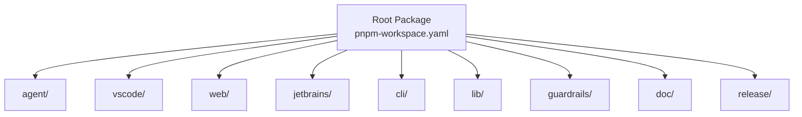
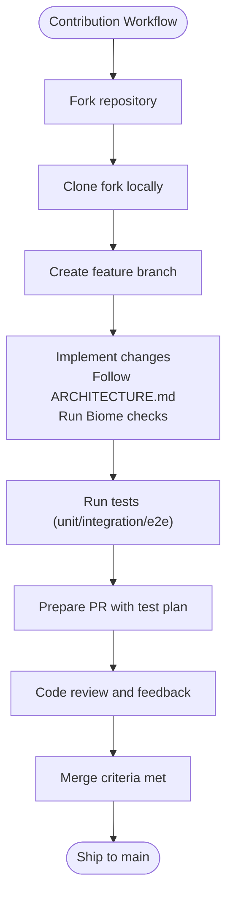
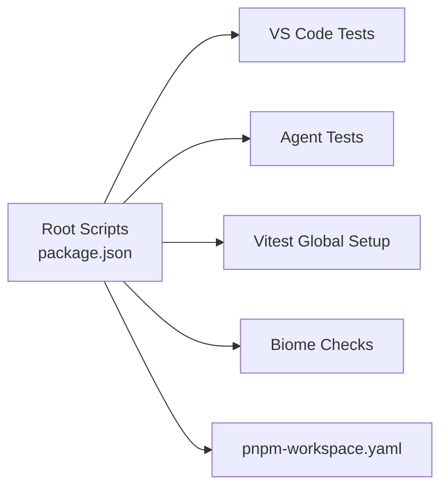

# Contribution Guidelines

<cite>
**Referenced Files in This Document**
- [README.md](file://README.md)
- [ARCHITECTURE.md](file://ARCHITECTURE.md)
- [TESTING.md](file://TESTING.md)
- [doc/dev/index.md](file://doc/dev/index.md)
- [biome.jsonc](file://biome.jsonc)
- [package.json](file://package.json)
- [pnpm-workspace.yaml](file://pnpm-workspace.yaml)
- [vitest.config.ts](file://vitest.config.ts)
- [vscode/CONTRIBUTING.md](file://vscode/CONTRIBUTING.md)
- [jetbrains/CONTRIBUTING.md](file://jetbrains/CONTRIBUTING.md)
- [web/CONTRIBUTING.md](file://web/CONTRIBUTING.md)
- [.github/PULL_REQUEST_TEMPLATE.md](file://.github/PULL_REQUEST_TEMPLATE.md)
</cite>

## Table of Contents
1. [Introduction](#introduction)
2. [Project Structure](#project-structure)
3. [Core Components](#core-components)
4. [Architecture Overview](#architecture-overview)
5. [Detailed Component Analysis](#detailed-component-analysis)
6. [Dependency Analysis](#dependency-analysis)
7. [Performance Considerations](#performance-considerations)
8. [Troubleshooting Guide](#troubleshooting-guide)
9. [Conclusion](#conclusion)
10. [Appendices](#appendices)

## Introduction
This document describes how to contribute effectively to the Cody platform development. It consolidates contribution workflows, standards, testing expectations, and community practices across the monorepo. The repository snapshot indicates the project transitioned to a private repository, but this public snapshot remains available for historical and educational purposes.

Key goals:
- Provide a clear contribution workflow (fork/clone, branches, commits, PRs, reviews, merges)
- Define development standards (TypeScript conventions, architecture principles, testing)
- Establish issue and feature request processes
- Clarify community channels, maintainer responsibilities, and licensing/IP considerations

## Project Structure
The Cody project is a pnpm workspace spanning multiple packages:
- agent: cross-platform agent and bindings
- vscode: VS Code extension
- web: web UI package
- jetbrains: JetBrains plugin
- cli: command-line interface
- lib: shared libraries and components
- guardrails: guardrails module
- doc: developer documentation
- release: release tooling

**Diagram sources**
- [pnpm-workspace.yaml:1-8](file://pnpm-workspace.yaml#L1-L8)

**Section sources**
- [pnpm-workspace.yaml:1-8](file://pnpm-workspace.yaml#L1-L8)
- [package.json:1-99](file://package.json#L1-L99)

## Core Components
- Development environment setup and build: see [Development setup:1-35](file://doc/dev/index.md#L1-L35)
- Architecture and style principles: see [Architecture & Style:1-165](file://ARCHITECTURE.md#L1-L165)
- Quality tools and linting: see [Biome configuration:1-149](file://biome.jsonc#L1-L149)
- Testing expectations: see [Testing checklist:1-317](file://TESTING.md#L1-L317)
- Client-specific contribution guides:
  - VS Code: [Contributing to Cody for VS Code:1-123](file://vscode/CONTRIBUTING.md#L1-L123)
  - JetBrains: [Contributing to Sourcegraph JetBrains Plugin:1-450](file://jetbrains/CONTRIBUTING.md#L1-L450)
  - Web: [Contributing to Cody Web:1-68](file://web/CONTRIBUTING.md#L1-L68)

**Section sources**
- [doc/dev/index.md:1-35](file://doc/dev/index.md#L1-L35)
- [ARCHITECTURE.md:1-165](file://ARCHITECTURE.md#L1-L165)
- [biome.jsonc:1-149](file://biome.jsonc#L1-L149)
- [TESTING.md:1-317](file://TESTING.md#L1-L317)
- [vscode/CONTRIBUTING.md:1-123](file://vscode/CONTRIBUTING.md#L1-L123)
- [jetbrains/CONTRIBUTING.md:1-450](file://jetbrains/CONTRIBUTING.md#L1-L450)
- [web/CONTRIBUTING.md:1-68](file://web/CONTRIBUTING.md#L1-L68)

## Architecture Overview
Cody follows pragmatic style and telemetry principles:
- Prefer strong type safety; avoid unsafe type assertions outside tests
- Use appropriate concurrency primitives (values, promises, observables, generators, listeners)
- Telemetry naming and metadata rules for privacy and compliance
- Token counting best practices for LLM context sizing

[No sources needed since this diagram shows conceptual workflow, not actual code structure]

## Detailed Component Analysis

### Contribution Workflow
- Fork and clone: Use standard GitHub fork/clone procedures. The repository is Apache 2 licensed.
- Branching: Use descriptive feature branches prefixed with your initials or topic (e.g., feature/xxx, fix/xxx). Keep branches short-lived and focused.
- Commit messages: Write clear, imperative summaries. Reference related issues or PRs when applicable.
- Pull requests:
  - Fill in the PR template test plan section.
  - Link related issues and include screenshots or reproduction steps when relevant.
  - Ensure CI passes and address reviewer feedback promptly.
- Reviews and merges:
  - Require at least one maintainer approval.
  - Ensure passing tests and adherence to style/telemetry/architecture guidelines.

**Section sources**
- [README.md:60-76](file://README.md#L60-L76)
- [.github/PULL_REQUEST_TEMPLATE.md:1-5](file://.github/PULL_REQUEST_TEMPLATE.md#L1-L5)

### Development Standards

#### TypeScript Conventions
- Avoid unsafe type assertions; prefer type narrowing or satisfies operator.
- Favor explicit return types for public APIs; use observables for reactive streams.
- Keep telemetry event naming consistent and metadata sanitized.

**Section sources**
- [ARCHITECTURE.md:29-54](file://ARCHITECTURE.md#L29-L54)
- [ARCHITECTURE.md:55-122](file://ARCHITECTURE.md#L55-L122)

#### Architecture Principles
- Encourage re-usable abstractions and shared libraries.
- Document public APIs with structured comments.
- Respect token counting and LLM context limits.

**Section sources**
- [ARCHITECTURE.md:16-28](file://ARCHITECTURE.md#L16-L28)
- [ARCHITECTURE.md:123-165](file://ARCHITECTURE.md#L123-L165)

#### Linting and Formatting
- Biome enforces imports, lint rules, formatting, and ignores test snapshots and generated artifacts.
- Run formatting and checks locally before submitting PRs.

**Section sources**
- [biome.jsonc:1-149](file://biome.jsonc#L1-L149)

#### Testing Requirements
- Unit, integration, and end-to-end tests are available per client.
- Use the provided test plans and checklists to validate behavior across commands, chat, autocomplete, and telemetry.

**Section sources**
- [TESTING.md:1-317](file://TESTING.md#L1-L317)
- [vscode/CONTRIBUTING.md:38-43](file://vscode/CONTRIBUTING.md#L38-L43)

### Client-Specific Contribution Guides

#### VS Code Extension
- Quick start: install dependencies and run the desktop extension debug task.
- Architecture: follow shared architecture principles.
- Debugging and tracing: use verbose logging, autocomplete trace view, and Node DevTools.
- Releases: simulate packaged installs locally.

**Section sources**
- [vscode/CONTRIBUTING.md:1-123](file://vscode/CONTRIBUTING.md#L1-L123)
- [doc/dev/index.md:9-13](file://doc/dev/index.md#L9-L13)

#### JetBrains Plugin
- Prerequisites: Java 17, pnpm, Node versions pinned in tooling.
- Running and debugging: use Gradle tasks and run configurations for both plugin and agent.
- Integration tests: run via Gradle with agent recordings.

**Section sources**
- [jetbrains/CONTRIBUTING.md:14-118](file://jetbrains/CONTRIBUTING.md#L14-L118)
- [jetbrains/CONTRIBUTING.md:434-450](file://jetbrains/CONTRIBUTING.md#L434-L450)

#### Web UI
- Build and run the web demo; test against Sourcegraph or local instances.
- Publishing: manual NPM publish under @sourcegraph/cody-web.

**Section sources**
- [web/CONTRIBUTING.md:1-68](file://web/CONTRIBUTING.md#L1-L68)

### Issue Reporting, Feature Requests, and Bug Fixes
- Report issues and feature requests via the centralized issue tracker.
- Provide reproducible steps, environment details, and expected vs. actual behavior.
- For autocomplete issues, include context and logs as outlined in the VS Code guide.

**Section sources**
- [jetbrains/CONTRIBUTING.md:7-11](file://jetbrains/CONTRIBUTING.md#L7-L11)
- [vscode/CONTRIBUTING.md:24-37](file://vscode/CONTRIBUTING.md#L24-L37)
- [README.md:68-76](file://README.md#L68-L76)

### Community Guidelines and Communication
- Use the issue tracker for bugs and feature requests.
- Engage on community forums and Discord for discussions and support.
- For JetBrains plugin releases, coordinate with marketplace processes and announcements.

**Section sources**
- [README.md:68-76](file://README.md#L68-L76)
- [jetbrains/CONTRIBUTING.md:168-210](file://jetbrains/CONTRIBUTING.md#L168-L210)

### Licensing and Intellectual Property
- All code is open source under the Apache License 2.0.
- Contributions imply license grant to the project under the same terms.

**Section sources**
- [README.md:60-67](file://README.md#L60-L67)
- [package.json:5](file://package.json#L5)

## Dependency Analysis
The workspace ties together multiple packages. The root package defines engines and scripts for building, testing, and releasing across clients.

**Diagram sources**
- [package.json:18-39](file://package.json#L18-L39)
- [vitest.config.ts:1-8](file://vitest.config.ts#L1-L8)
- [pnpm-workspace.yaml:1-8](file://pnpm-workspace.yaml#L1-L8)

**Section sources**
- [package.json:18-39](file://package.json#L18-L39)
- [vitest.config.ts:1-8](file://vitest.config.ts#L1-L8)
- [pnpm-workspace.yaml:1-8](file://pnpm-workspace.yaml#L1-L8)

## Performance Considerations
- Prefer accurate token counting per model tokenizer and apply limits after model selection.
- Avoid unnecessary telemetry overhead; follow metadata and privacy guidance.
- Use watch/build modes for rapid iteration in web and VS Code clients.

[No sources needed since this section provides general guidance]

## Troubleshooting Guide
- VS Code
  - Enable verbose logging and use the autocomplete trace view for diagnostics.
  - Use Node DevTools to inspect the extension host.
- JetBrains
  - Use run configurations to debug plugin and agent; ensure correct environment variables and ports.
  - Integration tests require valid tokens and agent recordings.
- Web
  - Clear IndexedDB and local storage for a fresh start.
  - Build and link locally to Sourcegraph for end-to-end validation.

**Section sources**
- [vscode/CONTRIBUTING.md:28-123](file://vscode/CONTRIBUTING.md#L28-L123)
- [jetbrains/CONTRIBUTING.md:228-450](file://jetbrains/CONTRIBUTING.md#L228-L450)
- [web/CONTRIBUTING.md:31-68](file://web/CONTRIBUTING.md#L31-L68)

## Conclusion
By following the workflow, standards, and client-specific guides outlined here, contributors can efficiently deliver high-quality changes to the Cody platform. Adhering to architecture principles, rigorous testing, and respectful community practices ensures sustainable progress across clients and modules.

[No sources needed since this section summarizes without analyzing specific files]

## Appendices

### Appendix A: Quick Links
- Development setup: [doc/dev/index.md:1-35](file://doc/dev/index.md#L1-L35)
- Architecture and style: [ARCHITECTURE.md:1-165](file://ARCHITECTURE.md#L1-L165)
- Testing checklist: [TESTING.md:1-317](file://TESTING.md#L1-L317)
- VS Code contribution guide: [vscode/CONTRIBUTING.md:1-123](file://vscode/CONTRIBUTING.md#L1-L123)
- JetBrains contribution guide: [jetbrains/CONTRIBUTING.md:1-450](file://jetbrains/CONTRIBUTING.md#L1-L450)
- Web contribution guide: [web/CONTRIBUTING.md:1-68](file://web/CONTRIBUTING.md#L1-L68)
- PR template: [.github/PULL_REQUEST_TEMPLATE.md:1-5](file://.github/PULL_REQUEST_TEMPLATE.md#L1-L5)

[No sources needed since this appendix lists links already cited above]