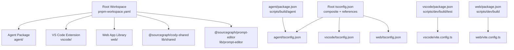
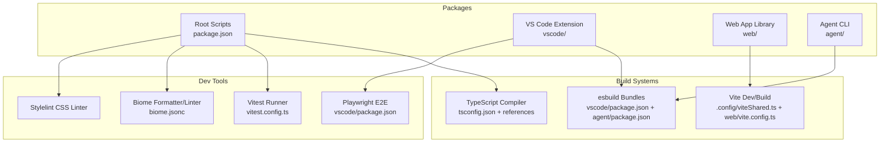
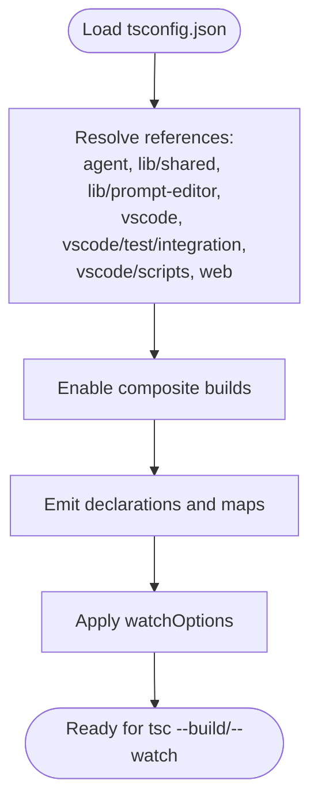
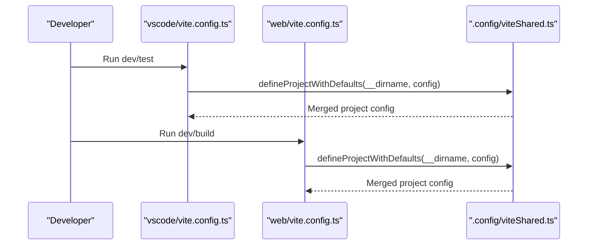
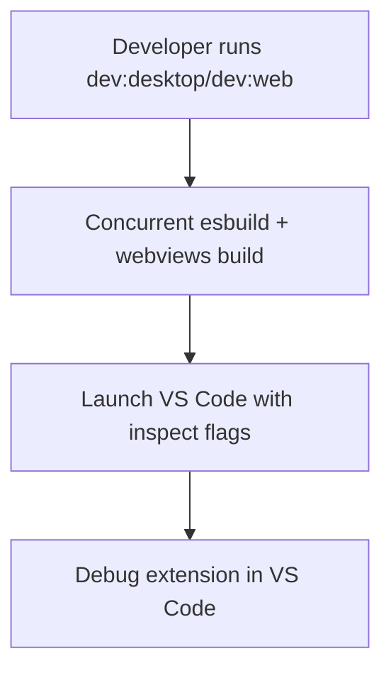
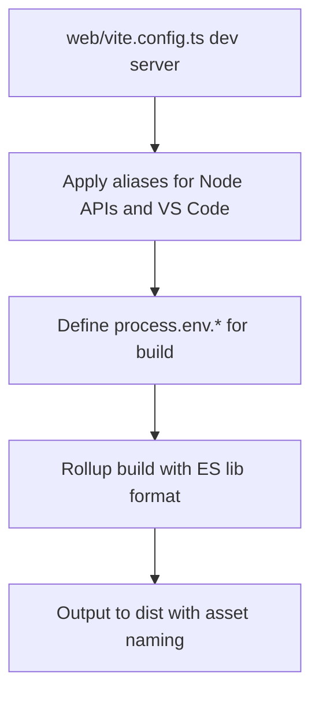
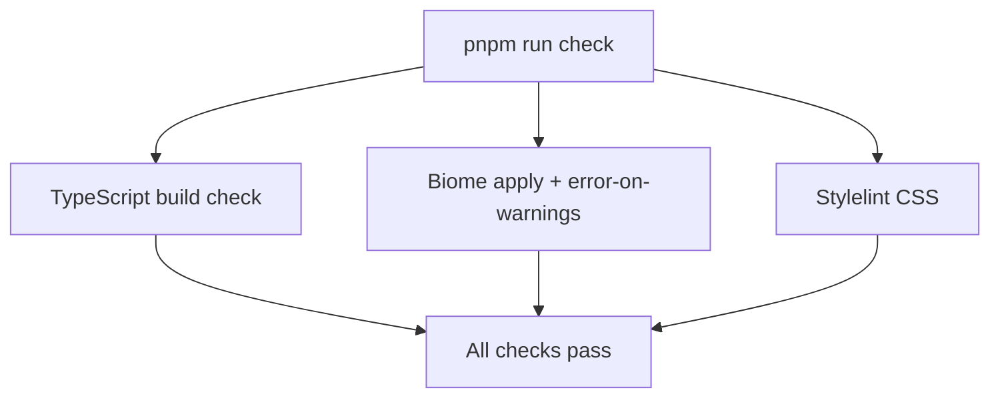
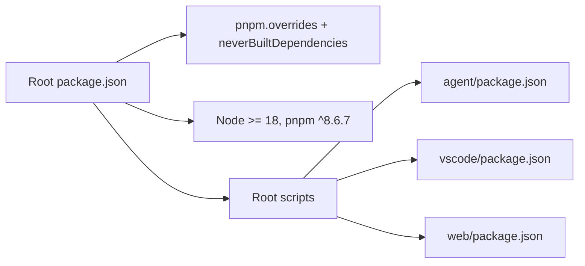

# Development Environment

<cite>
**Referenced Files in This Document**
- [pnpm-workspace.yaml](file://pnpm-workspace.yaml)
- [package.json](file://package.json)
- [tsconfig.json](file://tsconfig.json)
- [biome.jsonc](file://biome.jsonc)
- [vitest.config.ts](file://vitest.config.ts)
- [.config/viteShared.ts](file://.config/viteShared.ts)
- [vscode/vite.config.ts](file://vscode/vite.config.ts)
- [web/vite.config.ts](file://web/vite.config.ts)
- [agent/package.json](file://agent/package.json)
- [vscode/package.json](file://vscode/package.json)
- [vscode/tsconfig.json](file://vscode/tsconfig.json)
- [web/tsconfig.json](file://web/tsconfig.json)
- [agent/tsconfig.json](file://agent/tsconfig.json)
- [.vscode/settings.json](file://.vscode/settings.json)
</cite>

## Table of Contents
1. [Introduction](#introduction)
2. [Project Structure](#project-structure)
3. [Core Components](#core-components)
4. [Architecture Overview](#architecture-overview)
5. [Detailed Component Analysis](#detailed-component-analysis)
6. [Dependency Analysis](#dependency-analysis)
7. [Performance Considerations](#performance-considerations)
8. [Troubleshooting Guide](#troubleshooting-guide)
9. [Conclusion](#conclusion)
10. [Appendices](#appendices)

## Introduction
This document explains how to set up and configure the development environment for the Cody platform. It covers the monorepo structure using pnpm workspace, TypeScript configuration, and the build system. It also documents development tools (VSCode extensions, debugging configurations), hot reload capabilities, build scripts, development servers, asset bundling, environment variables, dependency management, cross-platform considerations, development workflow, formatting and linting, troubleshooting, and performance optimization.

## Project Structure
The repository is a pnpm workspace that includes multiple packages:
- Root workspace configuration defines included packages.
- Top-level TypeScript configuration coordinates composite builds across packages.
- Per-package build and test configurations for VS Code extension, Web app, Agent, and CLI.

**Diagram sources**
- [pnpm-workspace.yaml:1-8](file://pnpm-workspace.yaml#L1-L8)
- [tsconfig.json:27-35](file://tsconfig.json#L27-L35)
- [agent/tsconfig.json:24](file://agent/tsconfig.json#L24)
- [vscode/tsconfig.json:39-46](file://vscode/tsconfig.json#L39-L46)
- [web/tsconfig.json:15](file://web/tsconfig.json#L15)
- [vscode/package.json:11-56](file://vscode/package.json#L11-L56)
- [vscode/vite.config.ts:1-16](file://vscode/vite.config.ts#L1-L16)
- [web/vite.config.ts:1-137](file://web/vite.config.ts#L1-L137)
- [agent/package.json:13-26](file://agent/package.json#L13-L26)

**Section sources**
- [pnpm-workspace.yaml:1-8](file://pnpm-workspace.yaml#L1-L8)
- [package.json:18-39](file://package.json#L18-L39)
- [tsconfig.json:27-35](file://tsconfig.json#L27-L35)

## Core Components
- Monorepo tooling: pnpm workspace with engines pinned to Node and pnpm versions.
- TypeScript: root composite configuration with references to agent, lib/shared, lib/prompt-editor, vscode, web, and integration scripts.
- Formatting and linting: Biome configured via biome.jsonc with formatter and linter rules; Stylelint for CSS.
- Testing: Vitest configured globally and per package; Playwright for E2E in VS Code.
- Build and dev tooling: Vite for web, esbuild for desktop and web bundles in VS Code, esbuild for Agent.

Key scripts and responsibilities:
- Root scripts orchestrate build, watch, check, test, and OpenCtx linking.
- VS Code scripts handle dev modes (desktop, web), build steps, and E2E.
- Web package exposes a Vite-based dev server and library build.
- Agent package builds CLI and related binaries.

**Section sources**
- [package.json:18-39](file://package.json#L18-L39)
- [tsconfig.json:27-35](file://tsconfig.json#L27-L35)
- [biome.jsonc:1-149](file://biome.jsonc#L1-L149)
- [vitest.config.ts:1-8](file://vitest.config.ts#L1-L8)
- [vscode/package.json:11-56](file://vscode/package.json#L11-L56)
- [web/vite.config.ts:25-137](file://web/vite.config.ts#L25-L137)
- [agent/package.json:13-26](file://agent/package.json#L13-L26)

## Architecture Overview
The development environment integrates multiple build systems and tools:
- TypeScript composite builds coordinate between packages.
- Vite provides fast dev servers and optimized builds for the web app.
- esbuild compiles the VS Code extension for Node and browser targets.
- Vitest runs unit and benchmark tests; Playwright runs E2E tests.
- Biome and Stylelint enforce formatting and linting.

**Diagram sources**
- [biome.jsonc:1-149](file://biome.jsonc#L1-L149)
- [vitest.config.ts:1-8](file://vitest.config.ts#L1-L8)
- [tsconfig.json:27-35](file://tsconfig.json#L27-L35)
- [.config/viteShared.ts:1-51](file://.config/viteShared.ts#L1-L51)
- [web/vite.config.ts:1-137](file://web/vite.config.ts#L1-L137)
- [vscode/package.json:11-56](file://vscode/package.json#L11-L56)
- [agent/package.json:13-26](file://agent/package.json#L13-L26)

## Detailed Component Analysis

### TypeScript Configuration and Composite Builds
- Root tsconfig.json enables composite builds and references to agent, lib/shared, lib/prompt-editor, vscode, vscode/test/integration, vscode/scripts, and web.
- Each package has its own tsconfig extending the root, with target, module, jsx, and include/exclude tailored to the package.
- References ensure incremental builds and proper type checking across packages.

**Diagram sources**
- [tsconfig.json:27-35](file://tsconfig.json#L27-L35)
- [vscode/tsconfig.json:39-46](file://vscode/tsconfig.json#L39-L46)
- [web/tsconfig.json:15](file://web/tsconfig.json#L15)
- [agent/tsconfig.json:24](file://agent/tsconfig.json#L24)

**Section sources**
- [tsconfig.json:1-37](file://tsconfig.json#L1-L37)
- [vscode/tsconfig.json:1-48](file://vscode/tsconfig.json#L1-L48)
- [web/tsconfig.json:1-17](file://web/tsconfig.json#L1-L17)
- [agent/tsconfig.json:1-26](file://agent/tsconfig.json#L1-L26)

### Vite Shared Configuration and Workspace Defaults
- A shared Vite configuration provides defaults for aliases, CSS modules, test environment settings, and project naming.
- The VS Code package extends this for test inclusion and environment matching.
- The Web package extends it for React, SVG, bundle analyzer, aliases, define, and build options.

**Diagram sources**
- [.config/viteShared.ts:34-50](file://.config/viteShared.ts#L34-L50)
- [vscode/vite.config.ts:1-16](file://vscode/vite.config.ts#L1-L16)
- [web/vite.config.ts:1-137](file://web/vite.config.ts#L1-L137)

**Section sources**
- [.config/viteShared.ts:1-51](file://.config/viteShared.ts#L1-L51)
- [vscode/vite.config.ts:1-16](file://vscode/vite.config.ts#L1-L16)
- [web/vite.config.ts:25-137](file://web/vite.config.ts#L25-L137)

### VS Code Extension Development
- Scripts support desktop and web dev modes, concurrent builds, and launching VS Code with debugging enabled.
- esbuild handles Node and browser bundles, with aliases and externals for compatibility.
- Vite builds webviews with separate configuration.

**Diagram sources**
- [vscode/package.json:14-32](file://vscode/package.json#L14-L32)
- [vscode/package.json:33-37](file://vscode/package.json#L33-L37)

**Section sources**
- [vscode/package.json:11-56](file://vscode/package.json#L11-L56)

### Web App Development and Asset Bundling
- Web package provides a Vite dev server on a fixed port and a library build with ES format.
- Extensive aliasing maps Node built-ins and VS Code modules to browser-compatible shims.
- Defines environment variables for the web build and disables minification for compatibility.

**Diagram sources**
- [web/vite.config.ts:29-135](file://web/vite.config.ts#L29-L135)

**Section sources**
- [web/vite.config.ts:25-137](file://web/vite.config.ts#L25-L137)

### Agent Development
- Agent package builds CLI and related binaries using esbuild and TypeScript.
- Provides scripts to build, run, and debug the agent binary.

**Section sources**
- [agent/package.json:13-26](file://agent/package.json#L13-L26)

### Formatting, Linting, and Quality Gates
- Biome enforces formatting and linting rules, with overrides for specific files and test suites.
- Stylelint checks CSS with caching and quiet mode.
- Root script “check” orchestrates TypeScript build checks, Biome, and Stylelint.

**Diagram sources**
- [package.json:22-26](file://package.json#L22-L26)
- [biome.jsonc:1-149](file://biome.jsonc#L1-L149)

**Section sources**
- [package.json:22-26](file://package.json#L22-L26)
- [biome.jsonc:1-149](file://biome.jsonc#L1-L149)

### Testing and Benchmarking
- Vitest is configured globally and per package with setup files and environment matching.
- VS Code package includes unit, benchmark, and E2E test scripts.
- Playwright is installed and used for E2E tests.

**Section sources**
- [vitest.config.ts:1-8](file://vitest.config.ts#L1-L8)
- [vscode/package.json:45-56](file://vscode/package.json#L45-L56)

## Dependency Analysis
- Root package declares engines and pnpm overrides/patches for stability and compatibility.
- Overrides ensure consistent versions across packages.
- Workspace references tie packages together for composite builds.

**Diagram sources**
- [package.json:11-14](file://package.json#L11-L14)
- [package.json:87-97](file://package.json#L87-L97)
- [agent/package.json:13-26](file://agent/package.json#L13-L26)
- [vscode/package.json:11-56](file://vscode/package.json#L11-L56)
- [web/vite.config.ts:114-135](file://web/vite.config.ts#L114-L135)

**Section sources**
- [package.json:87-97](file://package.json#L87-L97)
- [tsconfig.json:27-35](file://tsconfig.json#L27-L35)

## Performance Considerations
- Use composite builds to speed up incremental TypeScript compilation across packages.
- Prefer Vite for fast dev reloads in the web app; disable minification only when necessary for compatibility.
- esbuild is used for rapid bundling in VS Code and Agent; keep watch mode enabled for iterative development.
- Leverage Biome’s fast formatter and Stylelint caching to reduce CI overhead.
- Use environment variable toggles (e.g., ANALYZE) to inspect bundle sizes when needed.

[No sources needed since this section provides general guidance]

## Troubleshooting Guide
Common issues and resolutions:
- Node or pnpm version mismatch: Ensure Node >= 18 and pnpm ^8.6.7 as declared in engines.
- Missing dependencies after checkout: Install with pnpm and allow pnpm to apply overrides and patches.
- Vite/Vitest misconfiguration: Verify .config/viteShared.ts defaults and per-package vite configs.
- VS Code launch issues: Confirm dev scripts build prerequisites before launching with inspect flags.
- Web build errors: Check aliases and define blocks in web/vite.config.ts; confirm environment variables are properly set.
- Formatting/linting failures: Run pnpm run check to apply Biome fixes and Stylelint checks.

**Section sources**
- [package.json:11-14](file://package.json#L11-L14)
- [package.json:87-97](file://package.json#L87-L97)
- [.config/viteShared.ts:34-50](file://.config/viteShared.ts#L34-L50)
- [web/vite.config.ts:25-137](file://web/vite.config.ts#L25-L137)
- [vscode/package.json:14-32](file://vscode/package.json#L14-L32)
- [package.json:22-26](file://package.json#L22-L26)

## Conclusion
The Cody development environment leverages a pnpm workspace, composite TypeScript builds, and modern tooling (Vite, esbuild, Vitest, Playwright, Biome, Stylelint) to deliver a fast, reliable, and consistent developer experience across the Agent, VS Code extension, and Web app packages. Following the scripts, configurations, and guidelines in this document will help you set up, iterate, and troubleshoot efficiently.

[No sources needed since this section summarizes without analyzing specific files]

## Appendices

### Development Workflow Checklist
- Install dependencies with pnpm.
- Run root build/watch/check as needed.
- Use VS Code dev scripts for desktop/web dev.
- Use web dev server for web app iteration.
- Run unit/benchmark tests with Vitest; E2E with Playwright.
- Apply formatting/linting via Biome and Stylelint.

**Section sources**
- [package.json:18-39](file://package.json#L18-L39)
- [vscode/package.json:14-32](file://vscode/package.json#L14-L32)
- [web/vite.config.ts:29-32](file://web/vite.config.ts#L29-L32)
- [vitest.config.ts:1-8](file://vitest.config.ts#L1-L8)
- [biome.jsonc:1-149](file://biome.jsonc#L1-L149)

### VS Code Extensions and Settings
- Recommended extensions: Biome, Stylelint.
- VS Code settings integrate Biome for formatting and organize imports on save.
- npm package manager preference set to pnpm.

**Section sources**
- [.vscode/settings.json:14-59](file://.vscode/settings.json#L14-L59)