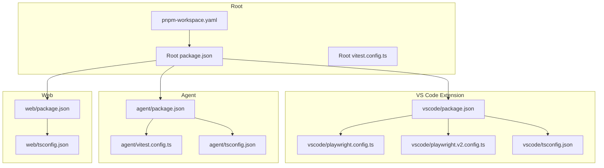
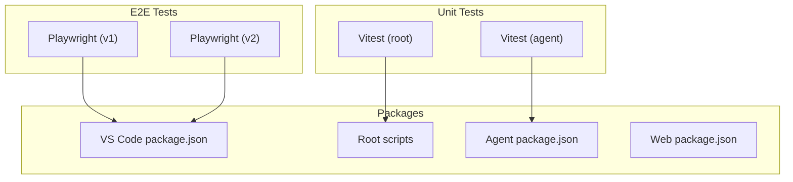
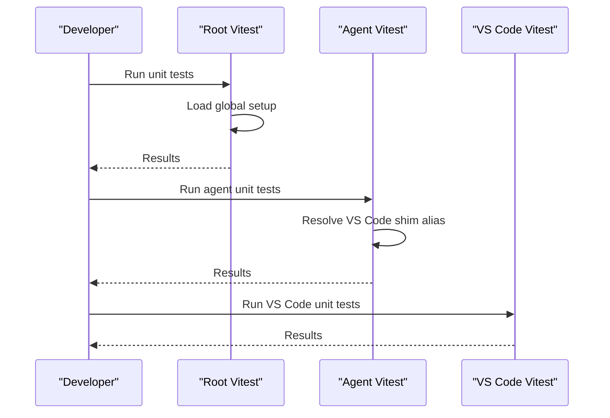
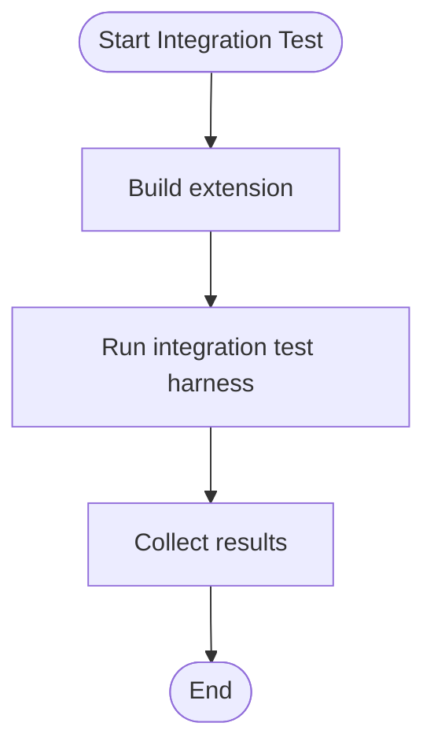
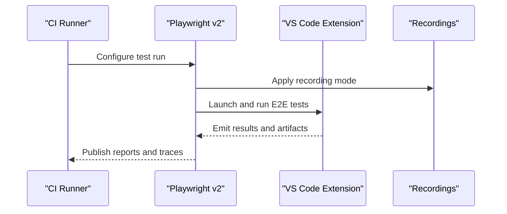
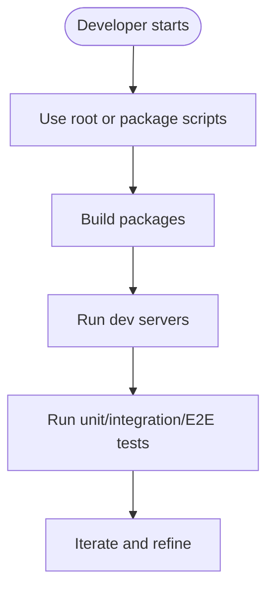
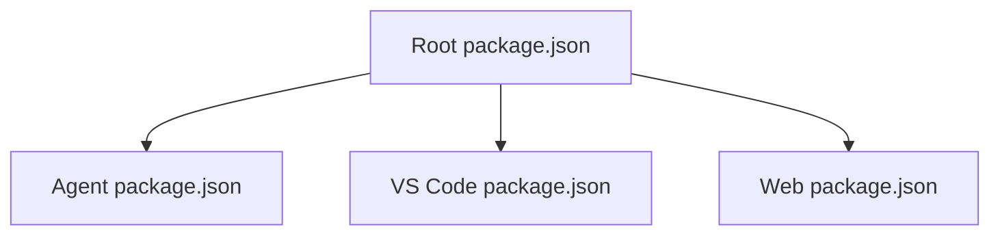

# Testing & Development

<cite>
**Referenced Files in This Document**
- [TESTING.md](file://TESTING.md)
- [jetbrains/TESTING.md](file://jetbrains/TESTING.md)
- [pnpm-workspace.yaml](file://pnpm-workspace.yaml)
- [vitest.config.ts](file://vitest.config.ts)
- [agent/vitest.config.ts](file://agent/vitest.config.ts)
- [vscode/playwright.config.ts](file://vscode/playwright.config.ts)
- [vscode/playwright.v2.config.ts](file://vscode/playwright.v2.config.ts)
- [package.json](file://package.json)
- [agent/package.json](file://agent/package.json)
- [vscode/package.json](file://vscode/package.json)
- [web/package.json](file://web/package.json)
- [agent/tsconfig.json](file://agent/tsconfig.json)
- [vscode/tsconfig.json](file://vscode/tsconfig.json)
- [web/tsconfig.json](file://web/tsconfig.json)
</cite>

## Table of Contents
1. [Introduction](#introduction)
2. [Project Structure](#project-structure)
3. [Core Components](#core-components)
4. [Architecture Overview](#architecture-overview)
5. [Detailed Component Analysis](#detailed-component-analysis)
6. [Dependency Analysis](#dependency-analysis)
7. [Performance Considerations](#performance-considerations)
8. [Troubleshooting Guide](#troubleshooting-guide)
9. [Conclusion](#conclusion)
10. [Appendices](#appendices)

## Introduction
This document describes the testing and development practices for the Cody platform across multiple environments and packages. It covers unit testing, integration testing, and end-to-end testing strategies, the development environment and build system, debugging tools, monorepo structure with pnpm workspace, contribution and review workflows, performance and load testing approaches, continuous integration pipelines, and best practices for cross-platform development.

## Project Structure
The Cody repository is a pnpm monorepo with multiple packages and platforms:
- Root workspace defines packages across agent, cli, lib, vscode, and web.
- Each package has its own test configuration and scripts.
- Platform-specific testing frameworks are used: Vitest for unit tests and Playwright for E2E tests in the VS Code extension.

**Diagram sources**
- [pnpm-workspace.yaml:1-8](file://pnpm-workspace.yaml#L1-L8)
- [package.json:18-38](file://package.json#L18-L38)
- [vscode/playwright.config.ts:1-20](file://vscode/playwright.config.ts#L1-L20)
- [vscode/playwright.v2.config.ts:1-169](file://vscode/playwright.v2.config.ts#L1-L169)
- [agent/vitest.config.ts:1-31](file://agent/vitest.config.ts#L1-L31)
- [vscode/tsconfig.json:1-48](file://vscode/tsconfig.json#L1-L48)
- [agent/tsconfig.json:1-26](file://agent/tsconfig.json#L1-L26)
- [web/tsconfig.json:1-17](file://web/tsconfig.json#L1-L17)

**Section sources**
- [pnpm-workspace.yaml:1-8](file://pnpm-workspace.yaml#L1-L8)
- [package.json:1-99](file://package.json#L1-L99)

## Core Components
- Unit testing
  - Vitest is configured at the root and per-package level. The root Vitest config sets a global setup file, and the agent package adjusts aliases and environment for testing.
  - Scripts to run unit tests are defined in each package’s package.json.

- Integration testing
  - The VS Code extension exposes integration test scripts via its package.json.

- End-to-end testing
  - Playwright is configured for E2E tests in the VS Code extension with separate v1 and v2 configs. The v2 config emphasizes strictness and parallelization, with recording and playback controls for deterministic runs.

- Monorepo and workspace
  - pnpm workspace coordinates multiple packages. The root package.json orchestrates scripts across packages.

**Section sources**
- [vitest.config.ts:1-8](file://vitest.config.ts#L1-L8)
- [agent/vitest.config.ts:1-31](file://agent/vitest.config.ts#L1-L31)
- [vscode/playwright.config.ts:1-20](file://vscode/playwright.config.ts#L1-L20)
- [vscode/playwright.v2.config.ts:1-169](file://vscode/playwright.v2.config.ts#L1-L169)
- [package.json:18-38](file://package.json#L18-L38)
- [vscode/package.json:45-55](file://vscode/package.json#L45-L55)
- [agent/package.json:13-25](file://agent/package.json#L13-L25)
- [web/package.json:15-21](file://web/package.json#L15-L21)

## Architecture Overview
The testing architecture separates concerns by platform and package:
- Unit tests use Vitest with per-package configurations.
- E2E tests use Playwright with recording and replay capabilities to ensure determinism and reduce flakiness.
- Cross-platform considerations are handled via environment variables and platform-specific Playwright settings.

**Diagram sources**
- [vitest.config.ts:1-8](file://vitest.config.ts#L1-L8)
- [agent/vitest.config.ts:1-31](file://agent/vitest.config.ts#L1-L31)
- [vscode/playwright.config.ts:1-20](file://vscode/playwright.config.ts#L1-L20)
- [vscode/playwright.v2.config.ts:1-169](file://vscode/playwright.v2.config.ts#L1-L169)
- [package.json:18-38](file://package.json#L18-L38)
- [vscode/package.json:45-55](file://vscode/package.json#L45-L55)
- [agent/package.json:13-25](file://agent/package.json#L13-L25)
- [web/package.json:15-21](file://web/package.json#L15-L21)

## Detailed Component Analysis

### Unit Testing Strategy
- Root Vitest configuration
  - Global setup is wired via the root Vitest config, enabling consistent initialization across tests.
- Agent Vitest configuration
  - Aliasing of the VS Code shim enables testing of agent code that depends on VS Code APIs.
  - Environment variable toggles testing behavior for the agent.
- Package-level scripts
  - Each package exposes test scripts to run unit tests independently.

**Diagram sources**
- [vitest.config.ts:1-8](file://vitest.config.ts#L1-L8)
- [agent/vitest.config.ts:21-30](file://agent/vitest.config.ts#L21-L30)
- [package.json:27-30](file://package.json#L27-L30)
- [vscode/package.json:51-55](file://vscode/package.json#L51-L55)
- [agent/package.json:23-25](file://agent/package.json#L23-L25)

**Section sources**
- [vitest.config.ts:1-8](file://vitest.config.ts#L1-L8)
- [agent/vitest.config.ts:1-31](file://agent/vitest.config.ts#L1-L31)
- [package.json:27-30](file://package.json#L27-L30)
- [vscode/package.json:51-55](file://vscode/package.json#L51-L55)
- [agent/package.json:23-25](file://agent/package.json#L23-L25)

### Integration Testing Strategy
- VS Code integration tests
  - The VS Code package exposes integration test scripts for multi-root and nested workspace scenarios.
- Scripts orchestrate building the extension and running integration tests with Node runtime.

**Diagram sources**
- [vscode/package.json:50-51](file://vscode/package.json#L50-L51)

**Section sources**
- [vscode/package.json:50-51](file://vscode/package.json#L50-L51)

### End-to-End Testing Strategy
- Playwright v1 configuration
  - Configures worker count, retries, timeouts, expectations, reporters, and snapshot paths tailored for E2E tests.
- Playwright v2 configuration
  - Enforces stricter settings, fully parallel execution, recording and playback modes, and project-based test grouping.
  - Uses environment variables to control recording behavior and expiry.

**Diagram sources**
- [vscode/playwright.v2.config.ts:33-104](file://vscode/playwright.v2.config.ts#L33-L104)
- [vscode/playwright.v2.config.ts:144-168](file://vscode/playwright.v2.config.ts#L144-L168)

**Section sources**
- [vscode/playwright.config.ts:1-20](file://vscode/playwright.config.ts#L1-L20)
- [vscode/playwright.v2.config.ts:1-169](file://vscode/playwright.v2.config.ts#L1-L169)

### Cross-Platform Testing Practices
- Platform-specific Playwright settings
  - Workers, retries, and timeouts differ on Windows and CI to accommodate flakiness and resource constraints.
- Recording and replay
  - Recording mode and expiry are controlled via environment variables, allowing deterministic runs and reduced flakiness.
- JetBrains testing documentation
  - Includes platform-specific guidance for Windows and WSL environments, ensuring compatibility across operating systems.

**Section sources**
- [vscode/playwright.config.ts:3-11](file://vscode/playwright.config.ts#L3-L11)
- [vscode/playwright.v2.config.ts:30-70](file://vscode/playwright.v2.config.ts#L30-L70)
- [jetbrains/TESTING.md:511-544](file://jetbrains/TESTING.md#L511-L544)

### Development Environment Setup and Build System
- Root scripts
  - The root package.json defines scripts to run builds, watch tasks, formatting, and testing across packages.
- VS Code build and dev scripts
  - Dedicated scripts for desktop and web builds, development servers, and E2E preparation.
- Agent build and test scripts
  - Scripts to build the agent, run the agent binary for testing, and prepare binaries for tests.
- Web package build and test scripts
  - Scripts to build the web app and run tests.

**Diagram sources**
- [package.json:18-38](file://package.json#L18-L38)
- [vscode/package.json:11-32](file://vscode/package.json#L11-L32)
- [agent/package.json:13-25](file://agent/package.json#L13-L25)
- [web/package.json:15-21](file://web/package.json#L15-L21)

**Section sources**
- [package.json:18-38](file://package.json#L18-L38)
- [vscode/package.json:11-32](file://vscode/package.json#L11-L32)
- [agent/package.json:13-25](file://agent/package.json#L13-L25)
- [web/package.json:15-21](file://web/package.json#L15-L21)

### Debugging Tools and Techniques
- VS Code extension debugging
  - Scripts to launch the extension in development mode with inspector ports for debugging.
- Agent debugging
  - Scripts to build and run the agent with tracing and remote debugging enabled.
- Playwright debugging
  - Environment variables to enable Playwright debug mode and retain traces for analysis.

**Section sources**
- [vscode/package.json:16-18](file://vscode/package.json#L16-L18)
- [agent/package.json:21-21](file://agent/package.json#L21-L21)
- [vscode/playwright.v2.config.ts:30-32](file://vscode/playwright.v2.config.ts#L30-L32)

### Monorepo Structure and Package Management with pnpm Workspace
- Workspace definition
  - The pnpm workspace enumerates packages across agent, cli, lib, vscode, and web.
- Root orchestration
  - Root scripts delegate to specific packages for build, test, and release tasks.
- Per-package configurations
  - Each package maintains its own test and build configuration, respecting shared TypeScript settings.

**Section sources**
- [pnpm-workspace.yaml:1-8](file://pnpm-workspace.yaml#L1-L8)
- [package.json:18-38](file://package.json#L18-L38)
- [agent/tsconfig.json:1-26](file://agent/tsconfig.json#L1-L26)
- [vscode/tsconfig.json:1-48](file://vscode/tsconfig.json#L1-L48)
- [web/tsconfig.json:1-17](file://web/tsconfig.json#L1-L17)

### Contribution Guidelines, Code Review Processes, and Workflows
- Testing coverage expectations
  - The repository includes platform-specific testing checklists for manual verification of features such as commands, chat UX, autocomplete, and context filtering.
- Automated testing and CI
  - Playwright v2 enforces strict settings and integrates with CI reporting and artifact collection.
- Developer workflows
  - Scripts in each package streamline development tasks such as building, watching, and running tests.

**Section sources**
- [TESTING.md:1-317](file://TESTING.md#L1-L317)
- [jetbrains/TESTING.md:1-800](file://jetbrains/TESTING.md#L1-L800)
- [vscode/playwright.v2.config.ts:144-168](file://vscode/playwright.v2.config.ts#L144-L168)
- [package.json:18-38](file://package.json#L18-L38)

### Performance Testing, Load Testing, and Optimization Strategies
- Benchmarks
  - The VS Code package exposes a benchmark script via Vitest, enabling performance regression detection.
- Recommendations
  - Use benchmark scripts to track performance regressions.
  - Optimize heavy computations and network calls in E2E tests by leveraging recording and replay to minimize variability.

**Section sources**
- [vscode/package.json:52-52](file://vscode/package.json#L52-L52)

### Continuous Integration Pipelines, Automated Testing, and Quality Gates
- CI configuration highlights
  - Playwright v2 disables retries and enforces fully parallel execution to surface flakiness early.
  - Reporters integrate with CI environments and artifact collection.
- Quality gates
  - Strict settings and forbid-only modes prevent accidental skipping of failing tests in CI.

**Section sources**
- [vscode/playwright.v2.config.ts:34-40](file://vscode/playwright.v2.config.ts#L34-L40)
- [vscode/playwright.v2.config.ts:144-168](file://vscode/playwright.v2.config.ts#L144-L168)

### Developing New Features and Extending Functionality
- Unit tests
  - Add or update Vitest-based unit tests alongside new features.
- Integration tests
  - Extend integration test scripts to validate multi-root and nested workspace scenarios.
- E2E tests
  - Add Playwright E2E tests to cover user workflows and platform-specific behaviors.
- Cross-platform considerations
  - Use environment variables and platform-specific settings to ensure consistent behavior across Windows, macOS, and Linux.

**Section sources**
- [vitest.config.ts:1-8](file://vitest.config.ts#L1-L8)
- [agent/vitest.config.ts:1-31](file://agent/vitest.config.ts#L1-L31)
- [vscode/playwright.v2.config.ts:1-169](file://vscode/playwright.v2.config.ts#L1-L169)
- [vscode/playwright.config.ts:1-20](file://vscode/playwright.config.ts#L1-L20)

## Dependency Analysis
The testing stack relies on:
- Vitest for unit tests with global setup and per-package overrides.
- Playwright for E2E tests with recording/replay and strict CI settings.
- pnpm workspace to coordinate builds and scripts across packages.

**Diagram sources**
- [package.json:18-38](file://package.json#L18-L38)
- [agent/package.json:13-25](file://agent/package.json#L13-L25)
- [vscode/package.json:45-55](file://vscode/package.json#L45-L55)
- [web/package.json:15-21](file://web/package.json#L15-L21)

**Section sources**
- [package.json:18-38](file://package.json#L18-L38)
- [agent/package.json:13-25](file://agent/package.json#L13-L25)
- [vscode/package.json:45-55](file://vscode/package.json#L45-L55)
- [web/package.json:15-21](file://web/package.json#L15-L21)

## Performance Considerations
- Use the benchmark script to detect performance regressions in the VS Code extension.
- Prefer recording and replay in E2E tests to reduce variability and improve reliability.
- Keep worker counts and timeouts aligned with platform constraints to avoid flakiness.

[No sources needed since this section provides general guidance]

## Troubleshooting Guide
- E2E flakiness
  - Adjust retries and timeouts per platform; leverage recording mode to stabilize tests.
- Debugging E2E failures
  - Enable Playwright debug mode and inspect retained traces and screenshots.
- Agent debugging
  - Use the agent debug script to enable tracing and remote debugging.
- VS Code extension debugging
  - Launch the extension in development mode with inspector ports for interactive debugging.

**Section sources**
- [vscode/playwright.v2.config.ts:30-40](file://vscode/playwright.v2.config.ts#L30-L40)
- [vscode/playwright.v2.config.ts:97-103](file://vscode/playwright.v2.config.ts#L97-L103)
- [agent/package.json:21-21](file://agent/package.json#L21-L21)
- [vscode/package.json:16-18](file://vscode/package.json#L16-L18)

## Conclusion
The Cody platform employs a robust, multi-layered testing strategy with Vitest for unit tests, Playwright for E2E tests, and pnpm workspace for monorepo coordination. Platform-specific configurations and environment variables ensure reliable cross-platform development. CI enforces strict quality gates, while benchmarking and recording/replay practices support performance and stability. Developers can confidently extend functionality by following established testing and debugging workflows.

## Appendices
- Manual testing checklists
  - Refer to the platform-specific testing documents for comprehensive manual verification procedures.

**Section sources**
- [TESTING.md:1-317](file://TESTING.md#L1-L317)
- [jetbrains/TESTING.md:1-800](file://jetbrains/TESTING.md#L1-L800)